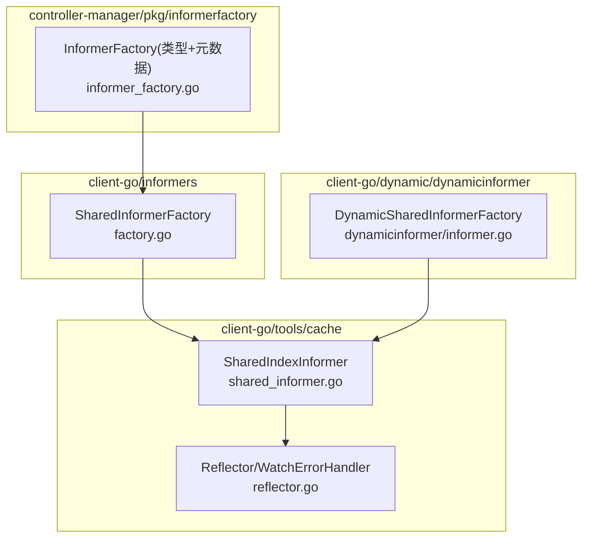
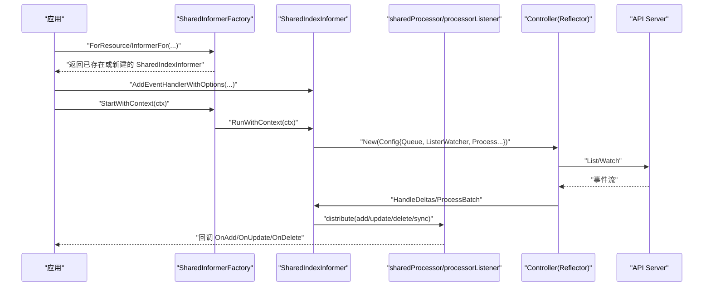
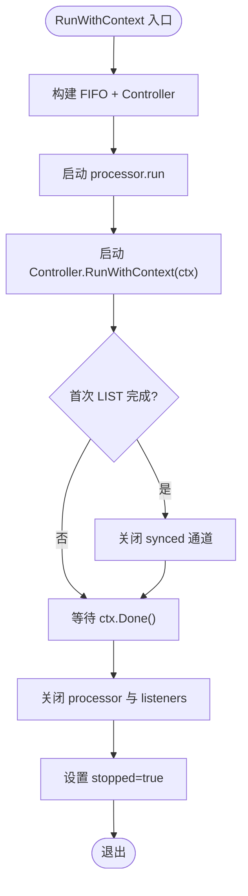
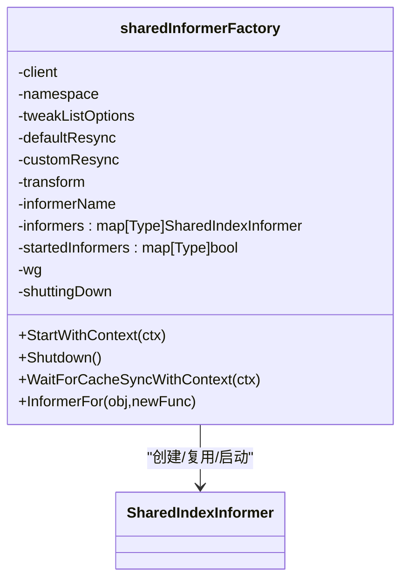
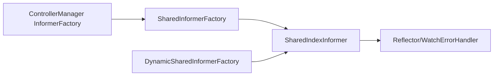

# 生命周期管理

<cite>
**本文引用的文件**   
- [shared_informer.go](file://staging/src/k8s.io/client-go/tools/cache/shared_informer.go)
- [factory.go](file://staging/src/k8s.io/client-go/informers/factory.go)
- [dynamicinformer/informer.go](file://staging/src/k8s.io/client-go/dynamic/dynamicinformer/informer.go)
- [reflector.go](file://staging/src/k8s.io/client-go/tools/cache/reflector.go)
- [informer_factory.go](file://staging/src/k8s.io/controller-manager/pkg/informerfactory/informer_factory.go)
</cite>

## 目录
1. [简介](#简介)
2. [项目结构](#项目结构)
3. [核心组件](#核心组件)
4. [架构总览](#架构总览)
5. [详细组件分析](#详细组件分析)
6. [依赖关系分析](#依赖关系分析)
7. [性能与并发特性](#性能与并发特性)
8. [故障排查指南](#故障排查指南)
9. [结论](#结论)
10. [附录：配置示例与最佳实践](#附录配置示例与最佳实践)

## 简介
本文件围绕 Kubernetes Informer 的生命周期管理，系统阐述其创建、启动、停止与销毁过程；深入解析 SharedInformerFactory 的工作原理与资源复用机制；提供不同场景下的配置示例（自定义列表器、处理器、错误处理）；说明状态监控与健康检查机制；解释并发安全保证与线程池管理；并给出内存泄漏防护与资源清理的最佳实践。

## 项目结构
本仓库中与 Informer 生命周期相关的核心代码位于 client-go 的 tools/cache 与 informers 包，以及 dynamic informer 和 controller-manager 的适配层。

图表来源
- [shared_informer.go:597-792](file://staging/src/k8s.io/client-go/tools/cache/shared_informer.go#L597-L792)
- [factory.go:162-239](file://staging/src/k8s.io/client-go/informers/factory.go#L162-L239)
- [dynamicinformer/informer.go:53-144](file://staging/src/k8s.io/client-go/dynamic/dynamicinformer/informer.go#L53-L144)
- [informer_factory.go:31-56](file://staging/src/k8s.io/controller-manager/pkg/informerfactory/informer_factory.go#L31-L56)
- [reflector.go:190-229](file://staging/src/k8s.io/client-go/tools/cache/reflector.go#L190-L229)

章节来源
- [shared_informer.go:597-792](file://staging/src/k8s.io/client-go/tools/cache/shared_informer.go#L597-L792)
- [factory.go:162-239](file://staging/src/k8s.io/client-go/informers/factory.go#L162-L239)
- [dynamicinformer/informer.go:53-144](file://staging/src/k8s.io/client-go/dynamic/dynamicinformer/informer.go#L53-L144)
- [informer_factory.go:31-56](file://staging/src/k8s.io/controller-manager/pkg/informerfactory/informer_factory.go#L31-L56)
- [reflector.go:190-229](file://staging/src/k8s.io/client-go/tools/cache/reflector.go#L190-L229)

## 核心组件
- SharedIndexInformer：维护本地缓存（Indexer）、事件分发（processorListener）、与 Reflector 协作从 API Server 拉取增量变更。
- SharedInformerFactory：按类型复用 SharedIndexInformer，统一启停、等待同步、注入 Transform/TweakListOptions 等全局选项。
- DynamicSharedInformerFactory：为动态资源提供通用 Informer 工厂，内部同样基于 SharedIndexInformer。
- ControllerManager InformerFactory：在“强类型 Informer”不可用时回退到“仅元数据 Informer”，实现兼容访问。
- Reflector/WatchErrorHandler：负责 ListAndWatch 连接管理与错误处理，支持指数退避重试。

章节来源
- [shared_informer.go:299-349](file://staging/src/k8s.io/client-go/tools/cache/shared_informer.go#L299-L349)
- [factory.go:144-160](file://staging/src/k8s.io/client-go/informers/factory.go#L144-L160)
- [dynamicinformer/informer.go:146-185](file://staging/src/k8s.io/client-go/dynamic/dynamicinformer/informer.go#L146-L185)
- [informer_factory.go:36-47](file://staging/src/k8s.io/controller-manager/pkg/informerfactory/informer_factory.go#L36-L47)
- [reflector.go:214-229](file://staging/src/k8s.io/client-go/tools/cache/reflector.go#L214-L229)

## 架构总览
下图展示从应用侧到 API Server 的完整调用链与关键对象交互。

图表来源
- [factory.go:162-239](file://staging/src/k8s.io/client-go/informers/factory.go#L162-L239)
- [shared_informer.go:728-792](file://staging/src/k8s.io/client-go/tools/cache/shared_informer.go#L728-L792)
- [shared_informer.go:1044-1189](file://staging/src/k8s.io/client-go/tools/cache/shared_informer.go#L1044-L1189)
- [reflector.go:286-371](file://staging/src/k8s.io/client-go/tools/cache/reflector.go#L286-L371)

## 详细组件分析

### SharedIndexInformer 生命周期
- 创建
  - 通过 NewSharedIndexInformerWithOptions 构造，包含 Indexer、Processor、ResyncPeriod、Transform、Identifier/Metrics 等。
- 注册处理器
  - AddEventHandlerWithOptions：支持自定义 resync、日志、缓冲大小；对已运行的 Informer 会进行“安全加入”流程（阻塞新增事件、全量快照、合成 Add 事件）。
- 启动
  - RunWithContext：构建 FIFO 队列与 Controller，启动 processor.run、cacheMutationDetector、控制器主循环；当控制器完成首次 LIST 后关闭 synced 通道。
- 健康检查
  - HasSynced/HasSyncedChecker：判断是否已完成一次完整 LIST；处理器级别可通过注册句柄的 HasSyncedChecker 判断初始事件是否全部投递。
- 停止与销毁
  - 父上下文取消后，Controller 退出；processor 关闭所有 listener 的 addCh/runFinished；WaitGroup 等待 goroutine 结束；stopped 标记置位，禁止再添加处理器。

图表来源
- [shared_informer.go:728-792](file://staging/src/k8s.io/client-go/tools/cache/shared_informer.go#L728-L792)
- [shared_informer.go:800-836](file://staging/src/k8s.io/client-go/tools/cache/shared_informer.go#L800-L836)
- [shared_informer.go:1013-1042](file://staging/src/k8s.io/client-go/tools/cache/shared_informer.go#L1013-L1042)

章节来源
- [shared_informer.go:299-349](file://staging/src/k8s.io/client-go/tools/cache/shared_informer.go#L299-L349)
- [shared_informer.go:728-792](file://staging/src/k8s.io/client-go/tools/cache/shared_informer.go#L728-L792)
- [shared_informer.go:800-836](file://staging/src/k8s.io/client-go/tools/cache/shared_informer.go#L800-L836)
- [shared_informer.go:886-951](file://staging/src/k8s.io/client-go/tools/cache/shared_informer.go#L886-L951)
- [shared_informer.go:1013-1042](file://staging/src/k8s.io/client-go/tools/cache/shared_informer.go#L1013-L1042)

### SharedInformerFactory 工作原理与资源复用
- 资源复用
  - 以 reflect.Type 为键缓存 SharedIndexInformer；同一类型多次请求返回同一实例。
- 全局选项注入
  - WithTweakListOptions、WithNamespace、WithTransform、WithCustomResyncConfig、WithInformerName 等。
- 启动与等待
  - StartWithContext：遍历已创建的 Informer，未启动则并发启动；WaitForCacheSyncWithContext：使用非轮询的 DoneChecker 等待所有 Informer 完成首次 LIST，并汇总结果。
- 停止与释放
  - Shutdown：标记 shuttingDown，等待所有 goroutine 结束，并释放 InformerName 标识。

图表来源
- [factory.go:59-78](file://staging/src/k8s.io/client-go/informers/factory.go#L59-L78)
- [factory.go:162-239](file://staging/src/k8s.io/client-go/informers/factory.go#L162-L239)
- [factory.go:243-265](file://staging/src/k8s.io/client-go/informers/factory.go#L243-L265)

章节来源
- [factory.go:144-160](file://staging/src/k8s.io/client-go/informers/factory.go#L144-L160)
- [factory.go:162-239](file://staging/src/k8s.io/client-go/informers/factory.go#L162-L239)
- [factory.go:243-265](file://staging/src/k8s.io/client-go/informers/factory.go#L243-L265)

### DynamicSharedInformerFactory 与动态资源
- 按 GVR 复用 GenericInformer；Start 时并行启动各 Informer；Shutdown 等待 goroutine 结束。
- 内部通过 cache.NewSharedIndexInformerWithOptions 包装 ListWatch，支持 TweakListOptions。

章节来源
- [dynamicinformer/informer.go:53-144](file://staging/src/k8s.io/client-go/dynamic/dynamicinformer/informer.go#L53-L144)
- [dynamicinformer/informer.go:146-185](file://staging/src/k8s.io/client-go/dynamic/dynamicinformer/informer.go#L146-L185)

### ControllerManager InformerFactory（类型+元数据）
- ForResource：优先尝试强类型 Informer；失败则回退到仅元数据的 Informer。
- Start：同时启动两类工厂。

章节来源
- [informer_factory.go:36-47](file://staging/src/k8s.io/controller-manager/pkg/informerfactory/informer_factory.go#L36-L47)

### 事件分发与 Resync 机制
- sharedProcessor：集中分发事件给多个 processorListener；根据 shouldResync 决定是否发送“同步类”事件。
- processorListener：每个处理器拥有独立 goroutine 与环形缓冲；支持最小 resync 周期限制与动态调整；支持 HasSyncedChecker 精确判定“上游已同步且初始事件已投递”。

章节来源
- [shared_informer.go:1044-1189](file://staging/src/k8s.io/client-go/tools/cache/shared_informer.go#L1044-L1189)
- [shared_informer.go:1224-1446](file://staging/src/k8s.io/client-go/tools/cache/shared_informer.go#L1224-L1446)

## 依赖关系分析
- SharedIndexInformer 依赖 Reflector 提供的 List/Watch 能力与 WatchErrorHandler 错误处理策略。
- SharedInformerFactory 聚合多组 API Group 的 Informer，统一生命周期管理。
- Dynamic 与 ControllerManager 适配器均基于 SharedIndexInformer 抽象，向上提供一致接口。

图表来源
- [factory.go:162-239](file://staging/src/k8s.io/client-go/informers/factory.go#L162-L239)
- [dynamicinformer/informer.go:53-144](file://staging/src/k8s.io/client-go/dynamic/dynamicinformer/informer.go#L53-L144)
- [informer_factory.go:31-56](file://staging/src/k8s.io/controller-manager/pkg/informerfactory/informer_factory.go#L31-L56)
- [reflector.go:190-229](file://staging/src/k8s.io/client-go/tools/cache/reflector.go#L190-L229)

## 性能与并发特性
- 并发模型
  - 每个 Informer 一个 Controller 协程负责 List/Watch；processor.run 为单协程串行分发；每个处理器有独立的 pop/run 协程，避免长耗时处理阻塞其他处理器。
- 背压与缓冲
  - processorListener 使用无界环形缓冲暂存待分发通知；若某处理器消费缓慢，将导致内存增长，需关注处理器性能。
- Resync 控制
  - 最小 resync 周期限制（默认 1s），且不得小于 informer 的 resyncCheckPeriod；运行时可动态调整监听器的 resync 周期。
- 指标与追踪
  - 支持 InformerName 与 InformerMetricsProvider；当积压超过阈值时启用慢路径追踪。

章节来源
- [shared_informer.go:880-915](file://staging/src/k8s.io/client-go/tools/cache/shared_informer.go#L880-L915)
- [shared_informer.go:1253-1261](file://staging/src/k8s.io/client-go/tools/cache/shared_informer.go#L1253-L1261)
- [shared_informer.go:1383-1390](file://staging/src/k8s.io/client-go/tools/cache/shared_informer.go#L1383-L1390)

## 故障排查指南
- Watch 断连与重试
  - 通过 SetWatchErrorHandler/SetWatchErrorHandlerWithContext 自定义错误处理；默认实现会根据错误类型记录日志并触发指数退避重试。
- 同步状态检查
  - 使用 WaitForCacheSync/WaitForCacheSyncWithContext 等待所有 Informer 完成首次 LIST；对于业务就绪性，还需等待处理器级别的 HasSyncedChecker。
- 处理器异常隔离
  - 处理器 run 中捕获 panic，跳过当前项并在短暂休眠后继续，避免整个 Informer 崩溃。
- 资源清理
  - 务必调用 RemoveEventHandler/ShutDownEventHandler 移除处理器；调用工厂 Shutdown 等待 goroutine 结束，防止泄露。

章节来源
- [reflector.go:190-229](file://staging/src/k8s.io/client-go/tools/cache/reflector.go#L190-L229)
- [shared_informer.go:694-722](file://staging/src/k8s.io/client-go/tools/cache/shared_informer.go#L694-L722)
- [shared_informer.go:1365-1408](file://staging/src/k8s.io/client-go/tools/cache/shared_informer.go#L1365-L1408)
- [shared_informer.go:1013-1042](file://staging/src/k8s.io/client-go/tools/cache/shared_informer.go#L1013-L1042)

## 结论
Informer 体系通过 SharedIndexInformer 提供最终一致的本地缓存与事件驱动模型，配合 SharedInformerFactory 实现跨资源的统一生命周期管理。其并发模型、resync 策略、错误处理与指标追踪共同保障了高可用与可观测性。正确理解并遵循其生命周期与资源清理规范，是避免内存泄漏与提升稳定性的关键。

## 附录：配置示例与最佳实践

- 基础创建与启动
  - 通过工厂获取 Informer，注册处理器，启动并等待同步。
  - 参考路径：[factory.go:267-302](file://staging/src/k8s.io/client-go/informers/factory.go#L267-L302)

- 自定义列表器与过滤
  - 使用 WithTweakListOptions 对所有 List/Watch 附加筛选条件。
  - 参考路径：[factory.go:90-96](file://staging/src/k8s.io/client-go/informers/factory.go#L90-L96)

- 自定义 Transform
  - 使用 WithTransform 在入缓存前裁剪字段，降低内存占用。
  - 参考路径：[factory.go:106-112](file://staging/src/k8s.io/client-go/informers/factory.go#L106-L112)

- 自定义 Resync
  - 使用 WithCustomResyncConfig 为特定类型设置 resync 周期。
  - 参考路径：[factory.go:80-88](file://staging/src/k8s.io/client-go/informers/factory.go#L80-L88)

- 动态资源 Informer
  - 使用 DynamicSharedInformerFactory.ForResource 获取通用 Informer，并通过 TweakListOptions 定制查询。
  - 参考路径：[dynamicinformer/informer.go:42-51](file://staging/src/k8s.io/client-go/dynamic/dynamicinformer/informer.go#L42-L51)

- 错误处理
  - 通过 SetWatchErrorHandlerWithContext 设置 Watch 错误回调，记录告警或上报指标。
  - 参考路径：[shared_informer.go:700-710](file://staging/src/k8s.io/client-go/tools/cache/shared_informer.go#L700-L710)

- 健康检查与就绪
  - 使用 WaitForCacheSyncWithContext 等待 Informer 同步；再用 handle.HasSyncedChecker 确保初始事件已投递。
  - 参考路径：[factory.go:199-239](file://staging/src/k8s.io/client-go/informers/factory.go#L199-L239)

- 并发与线程池
  - 每个 Informer 一个 Controller 协程；每个处理器两个协程（pop/run）；工厂 StartWithContext 并发启动各 Informer。
  - 参考路径：[shared_informer.go:728-792](file://staging/src/k8s.io/client-go/tools/cache/shared_informer.go#L728-L792)

- 内存泄漏防护与资源清理
  - 必须调用 RemoveEventHandler/ShutDownEventHandler 移除处理器；调用工厂 Shutdown 等待 goroutine 结束；避免在处理器回调内执行长时间阻塞操作。
  - 参考路径：[shared_informer.go:1013-1042](file://staging/src/k8s.io/client-go/tools/cache/shared_informer.go#L1013-L1042)
  - 参考路径：[factory.go:184-192](file://staging/src/k8s.io/client-go/informers/factory.go#L184-L192)