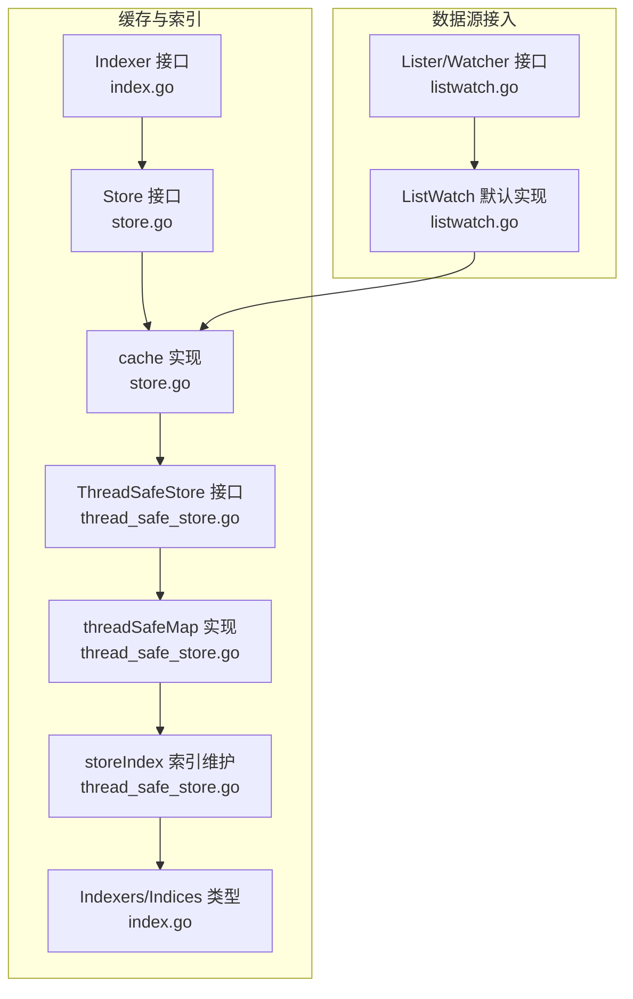
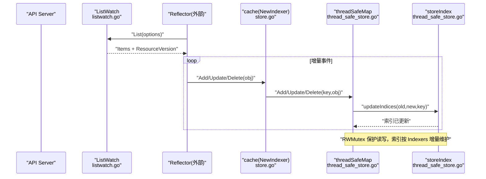
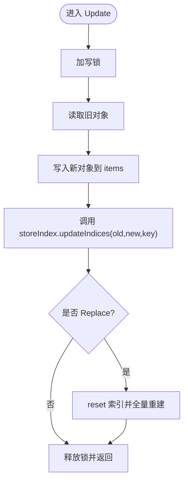
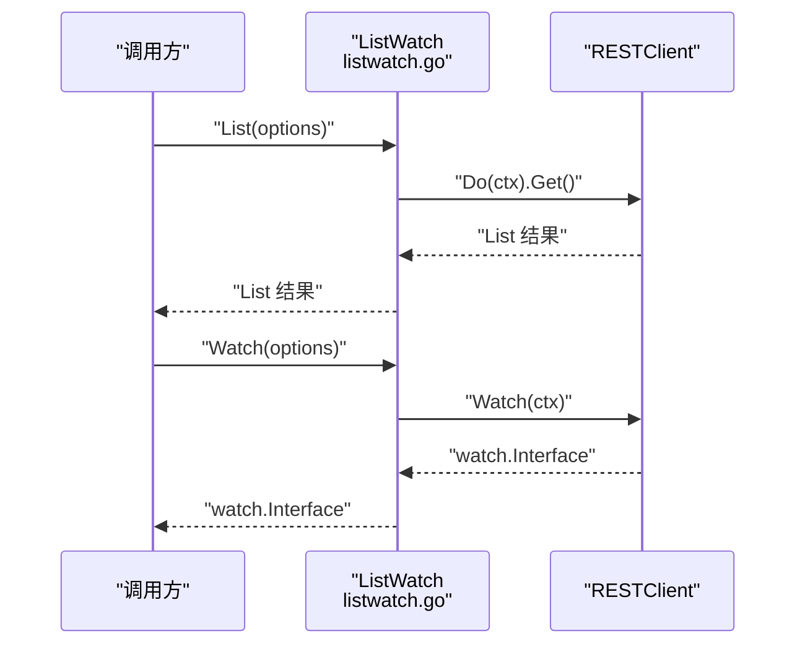
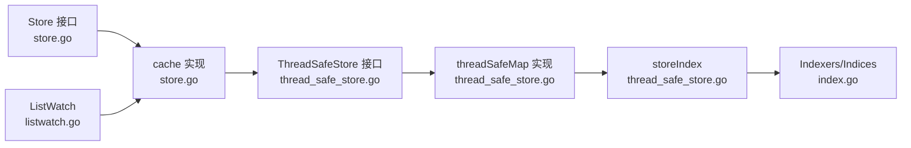

# 索引与查询机制

<cite>
**本文引用的文件**   
- [index.go](file://staging/src/k8s.io/client-go/tools/cache/index.go)
- [store.go](file://staging/src/k8s.io/client-go/tools/cache/store.go)
- [thread_safe_store.go](file://staging/src/k8s.io/client-go/tools/cache/thread_safe_store.go)
- [listwatch.go](file://staging/src/k8s.io/client-go/tools/cache/listwatch.go)
</cite>

## 目录
1. [简介](#简介)
2. [项目结构](#项目结构)
3. [核心组件](#核心组件)
4. [架构总览](#架构总览)
5. [详细组件分析](#详细组件分析)
6. [依赖关系分析](#依赖关系分析)
7. [性能考量](#性能考量)
8. [故障排查指南](#故障排查指南)
9. [结论](#结论)
10. [附录](#附录)

## 简介
本文件聚焦于 client-go tools/cache 中的索引与查询机制，系统性阐述 Indexer 接口设计、内置索引器实现（标签/字段/自定义）、Lister 的使用方式与优化策略，以及复杂查询场景（多条件组合、分页）的实现思路。同时给出索引更新策略、一致性保证、查询性能分析与调优建议，并结合实际业务场景提供索引设计最佳实践。

## 项目结构
client-go/tools/cache 的索引与查询相关代码主要分布在以下文件中：
- index.go：定义 Indexer 接口、IndexFunc、内置命名空间索引函数及索引数据结构
- store.go：定义 Store 接口、cache 实现、NewStore/NewIndexer 构造方法
- thread_safe_store.go：线程安全的存储实现 threadSafeMap 与索引维护逻辑 storeIndex
- listwatch.go：Lister/Watcher/ListWatch 抽象与默认实现，用于初始列表与增量监听



图表来源
- [index.go:26-101](file://staging/src/k8s.io/client-go/tools/cache/index.go#L26-L101)
- [store.go:28-82](file://staging/src/k8s.io/client-go/tools/cache/store.go#L28-L82)
- [store.go:202-443](file://staging/src/k8s.io/client-go/tools/cache/store.go#L202-L443)
- [thread_safe_store.go:31-70](file://staging/src/k8s.io/client-go/tools/cache/thread_safe_store.go#L31-L70)
- [thread_safe_store.go:93-253](file://staging/src/k8s.io/client-go/tools/cache/thread_safe_store.go#L93-L253)
- [thread_safe_store.go:255-553](file://staging/src/k8s.io/client-go/tools/cache/thread_safe_store.go#L255-L553)
- [listwatch.go:30-118](file://staging/src/k8s.io/client-go/tools/cache/listwatch.go#L30-L118)
- [listwatch.go:180-313](file://staging/src/k8s.io/client-go/tools/cache/listwatch.go#L180-L313)

章节来源
- [index.go:26-101](file://staging/src/k8s.io/client-go/tools/cache/index.go#L26-L101)
- [store.go:28-82](file://staging/src/k8s.io/client-go/tools/cache/store.go#L28-L82)
- [store.go:202-443](file://staging/src/k8s.io/client-go/tools/cache/store.go#L202-L443)
- [thread_safe_store.go:31-70](file://staging/src/k8s.io/client-go/tools/cache/thread_safe_store.go#L31-L70)
- [thread_safe_store.go:93-253](file://staging/src/k8s.io/client-go/tools/cache/thread_safe_store.go#L93-L253)
- [thread_safe_store.go:255-553](file://staging/src/k8s.io/client-go/tools/cache/thread_safe_store.go#L255-L553)
- [listwatch.go:30-118](file://staging/src/k8s.io/client-go/tools/cache/listwatch.go#L30-L118)
- [listwatch.go:180-313](file://staging/src/k8s.io/client-go/tools/cache/listwatch.go#L180-L313)

## 核心组件
- Indexer 接口：在 Store 基础上扩展多索引能力，支持按索引名查询对象集合、返回匹配对象的存储键、列出索引值等
- IndexFunc：将对象映射为多个“索引值”字符串的函数；同一对象可产生多个索引值
- 内置索引器：MetaNamespaceIndexFunc 基于元数据的 namespace 生成索引值，常量 NamespaceIndex 作为常见索引名
- Store 接口：通用对象存取与处理接口，包含 Add/Update/Delete/List/Get/Replace 等
- cache 实现：对 ThreadSafeStore 的薄封装，负责 KeyFunc 转换、transformer 与指标注入
- ThreadSafeStore 与 threadSafeMap：线程安全的数据结构与索引维护，内部使用 RWMutex 保护并发访问
- storeIndex：维护 Indexers 到 Indices 的映射，并在对象增删改时增量更新索引
- Lister/Watcher/ListWatch：用于从 API Server 拉取初始列表与建立 Watch 流，配合 Reflector 驱动缓存更新

章节来源
- [index.go:26-101](file://staging/src/k8s.io/client-go/tools/cache/index.go#L26-L101)
- [store.go:28-82](file://staging/src/k8s.io/client-go/tools/cache/store.go#L28-L82)
- [store.go:202-443](file://staging/src/k8s.io/client-go/tools/cache/store.go#L202-L443)
- [thread_safe_store.go:31-70](file://staging/src/k8s.io/client-go/tools/cache/thread_safe_store.go#L31-L70)
- [thread_safe_store.go:93-253](file://staging/src/k8s.io/client-go/tools/cache/thread_safe_store.go#L93-L253)
- [thread_safe_store.go:255-553](file://staging/src/k8s.io/client-go/tools/cache/thread_safe_store.go#L255-L553)
- [listwatch.go:30-118](file://staging/src/k8s.io/client-go/tools/cache/listwatch.go#L30-L118)
- [listwatch.go:180-313](file://staging/src/k8s.io/client-go/tools/cache/listwatch.go#L180-L313)

## 架构总览
下图展示了从数据源到本地缓存与索引的整体流程：ListWatch 负责 List 与 Watch，Reflector（外部）将事件写入 Store/Indexer，threadSafeMap 负责线程安全存储与索引维护。



图表来源
- [listwatch.go:180-313](file://staging/src/k8s.io/client-go/tools/cache/listwatch.go#L180-L313)
- [store.go:428-443](file://staging/src/k8s.io/client-go/tools/cache/store.go#L428-L443)
- [thread_safe_store.go:255-553](file://staging/src/k8s.io/client-go/tools/cache/thread_safe_store.go#L255-L553)
- [thread_safe_store.go:93-253](file://staging/src/k8s.io/client-go/tools/cache/thread_safe_store.go#L93-L253)

## 详细组件分析

### Indexer 接口与内置索引器
- Indexer 继承 Store，新增 Index/ByIndex/IndexKeys/ListIndexFuncValues/AddIndexers 等方法
- IndexFunc 将对象映射为多个索引值字符串，支持一对多映射
- MetaNamespaceIndexFunc 基于元数据获取 namespace 作为索引值，常量 NamespaceIndex 表示该索引名
- IndexFuncToKeyFuncAdapter 可将单值 IndexFunc 适配为 KeyFunc（要求唯一性）

```mermaid
classDiagram
class Indexer {
+Index(indexName, obj) []interface{}
+IndexKeys(indexName, indexedValue) []string
+ListIndexFuncValues(indexName) []string
+ByIndex(indexName, indexedValue) []interface{}
+GetIndexers() Indexers
+AddIndexers(newIndexers) error
}
class Store {
+Add(obj) error
+Update(obj) error
+Delete(obj) error
+List() []interface{}
+ListKeys() []string
+LastStoreSyncResourceVersion() string
+Bookmark(rv) void
+Get(obj) (item, exists, err)
+GetByKey(key) (item, exists, err)
+Replace(list, rv) error
+Resync() error
}
class IndexFunc {
+func(obj) ([]string, error)
}
class MetaNamespaceIndexFunc {
+func(obj) ([]string, error)
}
Indexer <|-- Store
Indexer ..> IndexFunc : "使用"
MetaNamespaceIndexFunc ..> IndexFunc : "实现"
```

图表来源
- [index.go:26-101](file://staging/src/k8s.io/client-go/tools/cache/index.go#L26-L101)
- [store.go:28-82](file://staging/src/k8s.io/client-go/tools/cache/store.go#L28-L82)

章节来源
- [index.go:26-101](file://staging/src/k8s.io/client-go/tools/cache/index.go#L26-L101)
- [store.go:28-82](file://staging/src/k8s.io/client-go/tools/cache/store.go#L28-L82)

### 线程安全存储与索引维护（threadSafeMap 与 storeIndex）
- threadSafeMap 通过 RWMutex 保护 items 与索引，提供 Add/Update/Delete/Replace/List/Get/ByIndex/IndexKeys 等
- storeIndex 维护 indexers 与 indices 的映射，并在 updateIndices 中根据 old/new 对象计算索引值的差集进行增量更新
- Replace 会重建索引：先 reset 再遍历 items 重新构建
- DeleteWithObject 支持传入对象以正确更新 ResourceVersion 指标
- Transaction 批量操作减少锁竞争，提升吞吐



图表来源
- [thread_safe_store.go:255-553](file://staging/src/k8s.io/client-go/tools/cache/thread_safe_store.go#L255-L553)
- [thread_safe_store.go:93-253](file://staging/src/k8s.io/client-go/tools/cache/thread_safe_store.go#L93-L253)

章节来源
- [thread_safe_store.go:255-553](file://staging/src/k8s.io/client-go/tools/cache/thread_safe_store.go#L255-L553)
- [thread_safe_store.go:93-253](file://staging/src/k8s.io/client-go/tools/cache/thread_safe_store.go#L93-L253)

### Lister 与 ListWatch 的使用
- Lister/Watcher 定义了初始列表与 Watch 的能力；ListerWithContext/WatcherWithContext 支持上下文传递
- ToListerWithContext/ToWatcherWithContext 提供适配器，兼容旧接口
- ListWatch 是常用实现，封装了 List/Watch 的具体调用，支持选项修改（如 fieldSelector）
- 注意：ListWatch 自身不处理分页，通常由上层 Reflector 负责分页与断点续传



图表来源
- [listwatch.go:180-313](file://staging/src/k8s.io/client-go/tools/cache/listwatch.go#L180-L313)

章节来源
- [listwatch.go:30-118](file://staging/src/k8s.io/client-go/tools/cache/listwatch.go#L30-L118)
- [listwatch.go:180-313](file://staging/src/k8s.io/client-go/tools/cache/listwatch.go#L180-L313)

### 复杂查询场景：多条件组合与分页
- 多条件组合查询
  - 方案一：在 IndexFunc 中将多个字段拼接为复合索引值，例如 “fieldA=xxx&fieldB=yyy”，然后 ByIndex 精确匹配
  - 方案二：分别按不同索引查询得到键集合，再做交集/并集运算（利用 IndexKeys 返回的键集合）
  - 方案三：使用 Index(obj) 基于对象计算一组索引值，再合并去重
- 分页处理
  - 在 ListWatch 层设置 ListOptions 的分页参数（如 limit、continue），由上层 Reflector 负责循环拉取与 Resume
  - 若需本地二次分页，可在 ByIndex/Index 后对结果切片或游标式迭代

章节来源
- [index.go:26-101](file://staging/src/k8s.io/client-go/tools/cache/index.go#L26-L101)
- [thread_safe_store.go:417-496](file://staging/src/k8s.io/client-go/tools/cache/thread_safe_store.go#L417-L496)
- [listwatch.go:180-313](file://staging/src/k8s.io/client-go/tools/cache/listwatch.go#L180-L313)

### 索引更新策略与一致性保证
- 更新策略
  - Add/Update：计算新旧对象的索引值集合，删除旧映射、插入新映射
  - Delete：仅旧对象参与索引清理
  - Replace：重置索引并全量重建，确保与 items 一致
- 一致性保证
  - 所有写路径均持有写锁，读路径持有读锁，避免竞态
  - LastStoreSyncResourceVersion 与 Bookmark 暴露最新资源版本，便于上层判断同步状态
  - Transaction 批量写入在同一锁内执行，减少中间不一致窗口

章节来源
- [thread_safe_store.go:255-553](file://staging/src/k8s.io/client-go/tools/cache/thread_safe_store.go#L255-L553)
- [thread_safe_store.go:435-459](file://staging/src/k8s.io/client-go/tools/cache/thread_safe_store.go#L435-L459)

### 查询性能分析与调优建议
- 时间复杂度
  - ByIndex/IndexKeys：O(1) 查找索引值对应的键集合，再 O(k) 拷贝 k 个对象引用
  - Index：根据对象计算的索引值集合求并集，最坏 O(m*k)，m 为索引值个数
  - Replace：O(n) 重建索引，n 为 items 数量
- 内存与 GC
  - 高基数字段应谨慎建索引，避免空集合长期占用内存（实现已在空集合时清理）
  - 避免直接修改 Get/List 返回的对象，防止破坏索引一致性
- 并发与锁
  - 高频写入建议使用 Transaction 批量提交
  - 读多写少场景下，尽量复用只读快照（List/ByIndex 返回的切片）
- 监控与观测
  - 通过 LastStoreSyncResourceVersion 与指标观察同步进度与延迟
  - 结合 trace 定位慢路径（如大批量 Replace）

章节来源
- [thread_safe_store.go:255-553](file://staging/src/k8s.io/client-go/tools/cache/thread_safe_store.go#L255-L553)
- [thread_safe_store.go:93-253](file://staging/src/k8s.io/client-go/tools/cache/thread_safe_store.go#L93-L253)

### 实际业务场景中的索引设计最佳实践
- 标签索引（Label-based）
  - 使用 LabelSelector 将匹配到的 label 值作为索引值，适合按环境/租户/版本筛选
- 字段索引（Field-based）
  - 针对热点查询字段（如 status、owner、region）建立索引，必要时采用复合索引值
- 自定义索引器
  - 对于跨字段派生属性（如 “名称前缀+状态”），编写专用 IndexFunc
  - 保持 IndexFunc 稳定且幂等，避免频繁变更导致索引抖动
- 索引粒度
  - 低基数字段优先（如 namespace、phase），高基数字段谨慎使用
  - 对短生命周期资源，避免过多索引造成内存膨胀

章节来源
- [index.go:26-101](file://staging/src/k8s.io/client-go/tools/cache/index.go#L26-L101)
- [thread_safe_store.go:93-253](file://staging/src/k8s.io/client-go/tools/cache/thread_safe_store.go#L93-L253)

## 依赖关系分析
- 组件耦合
  - cache 依赖 ThreadSafeStore 与 Indexers/Indices
  - threadSafeMap 依赖 storeIndex 进行索引维护
  - ListWatch 独立于缓存，但通常与 Reflector 协作驱动缓存更新
- 外部依赖
  - 使用 apimachinery 的 meta.Accessor 提取元数据
  - 使用 sets.Set[string] 高效维护键集合
  - 使用 utiltrace 进行慢路径追踪



图表来源
- [store.go:202-443](file://staging/src/k8s.io/client-go/tools/cache/store.go#L202-L443)
- [thread_safe_store.go:255-553](file://staging/src/k8s.io/client-go/tools/cache/thread_safe_store.go#L255-L553)
- [thread_safe_store.go:93-253](file://staging/src/k8s.io/client-go/tools/cache/thread_safe_store.go#L93-L253)
- [index.go:26-101](file://staging/src/k8s.io/client-go/tools/cache/index.go#L26-L101)
- [listwatch.go:180-313](file://staging/src/k8s.io/client-go/tools/cache/listwatch.go#L180-L313)

章节来源
- [store.go:202-443](file://staging/src/k8s.io/client-go/tools/cache/store.go#L202-L443)
- [thread_safe_store.go:255-553](file://staging/src/k8s.io/client-go/tools/cache/thread_safe_store.go#L255-L553)
- [thread_safe_store.go:93-253](file://staging/src/k8s.io/client-go/tools/cache/thread_safe_store.go#L93-L253)
- [index.go:26-101](file://staging/src/k8s.io/client-go/tools/cache/index.go#L26-L101)
- [listwatch.go:180-313](file://staging/src/k8s.io/client-go/tools/cache/listwatch.go#L180-L313)

## 性能考量
- 批量写入优先使用 Transaction，降低锁竞争
- 避免在热路径上创建大量临时对象，复用切片与集合
- 合理选择索引字段，控制索引基数与大小
- 对大规模初始化使用 Replace 一次性重建，避免多次增量更新带来的开销
- 使用 LastStoreSyncResourceVersion 监控同步滞后，及时告警

[本节为通用指导，无需特定文件来源]

## 故障排查指南
- 常见问题
  - 索引不存在：调用 ByIndex/IndexKeys 时报错，检查 AddIndexers 是否正确注册
  - 索引冲突：重复注册同名索引器，需调整索引名
  - 返回对象被修改：直接修改 Get/List 返回对象会导致索引不一致，应复制后再修改
  - 资源版本不一致：Delete 未传入对象导致 RV 未更新，改用 DeleteWithObject 或确保传入对象
- 诊断手段
  - 使用 LastStoreSyncResourceVersion 与 Bookmark 对比期望版本
  - 开启 trace 观察慢路径（如大批量 Replace/Transaction）
  - 监控 storeResourceVersion 指标变化趋势

章节来源
- [thread_safe_store.go:255-553](file://staging/src/k8s.io/client-go/tools/cache/thread_safe_store.go#L255-L553)
- [thread_safe_store.go:93-253](file://staging/src/k8s.io/client-go/tools/cache/thread_safe_store.go#L93-L253)

## 结论
client-go/tools/cache 提供了清晰可扩展的索引与查询体系：以 Indexer 为核心，配合 ThreadSafeStore 的线程安全实现与 storeIndex 的增量维护，既保证了并发安全，又兼顾了查询性能。通过合理的索引设计与批量写入策略，可在复杂业务场景中实现高效的多条件查询与稳定的数据一致性。

[本节为总结，无需特定文件来源]

## 附录
- 关键构造与入口
  - NewIndexer：创建带索引的缓存实例
  - NewThreadSafeStore：创建线程安全存储并注入指标
  - NewFilteredListWatchFromClient：构造 ListWatch 并注入字段选择器等选项

章节来源
- [store.go:428-443](file://staging/src/k8s.io/client-go/tools/cache/store.go#L428-L443)
- [thread_safe_store.go:525-540](file://staging/src/k8s.io/client-go/tools/cache/thread_safe_store.go#L525-L540)
- [listwatch.go:225-272](file://staging/src/k8s.io/client-go/tools/cache/listwatch.go#L225-L272)