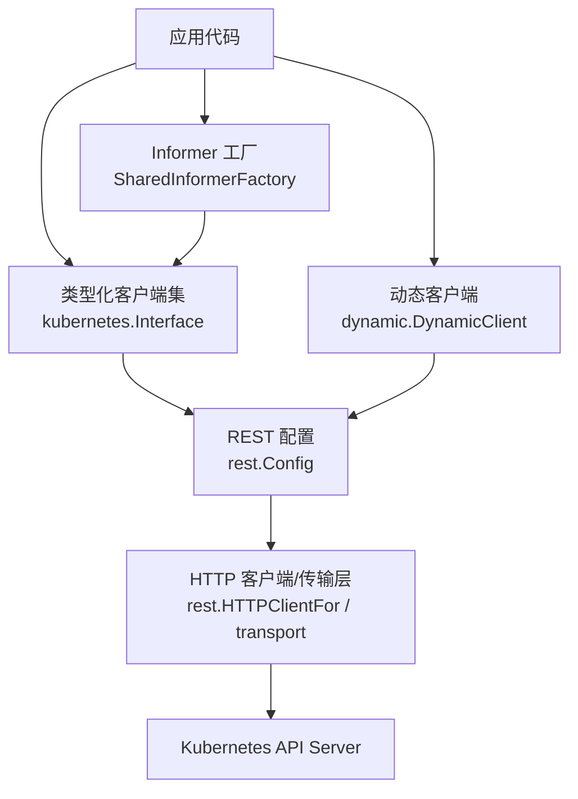
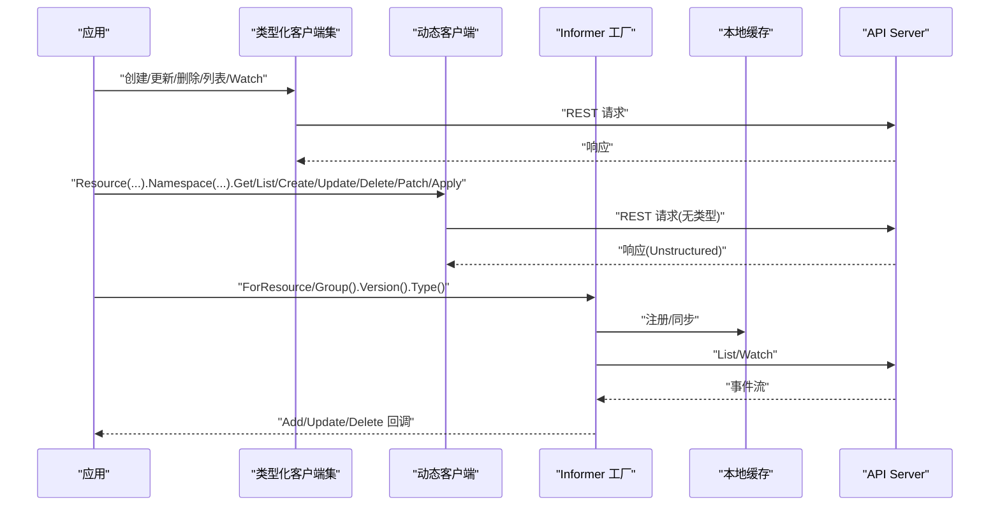
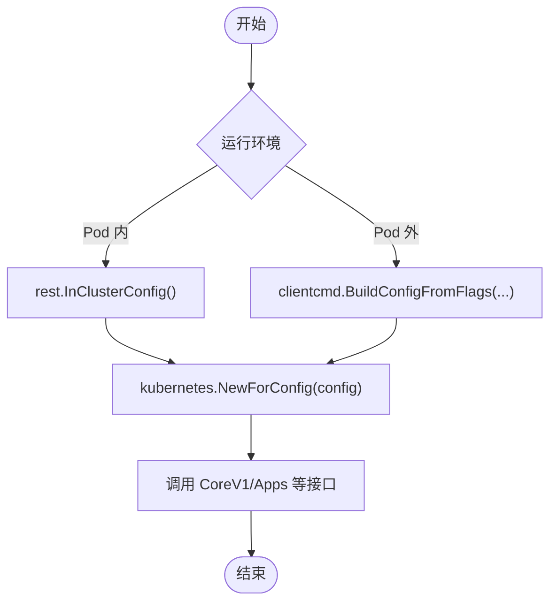
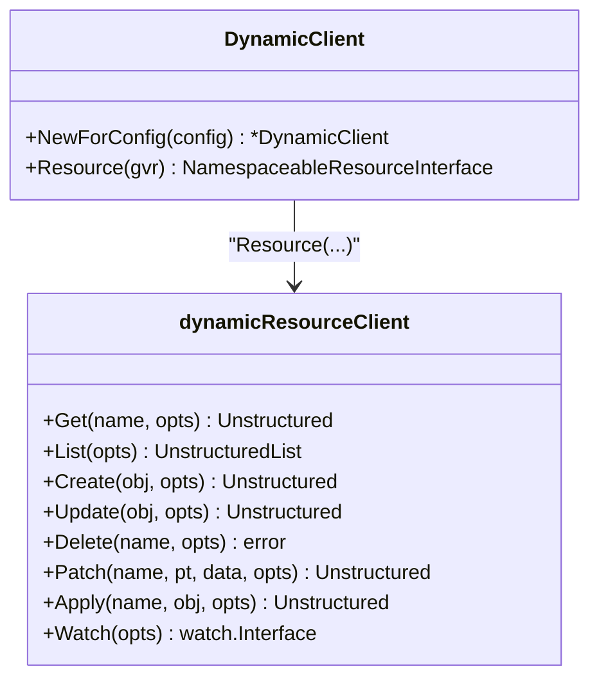
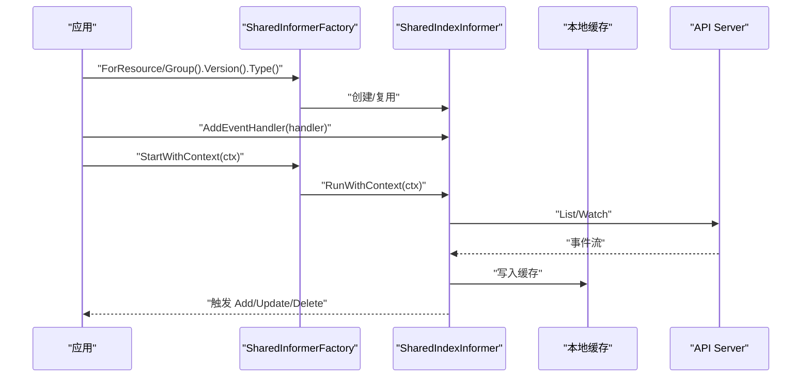
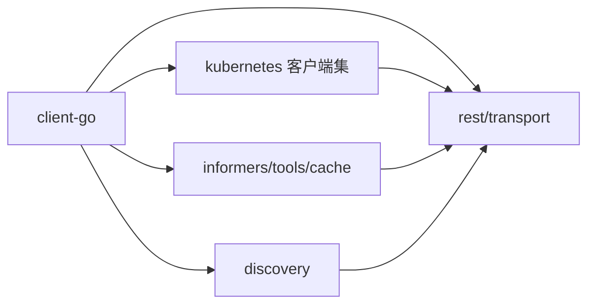

# SDK客户端

<cite>
**本文引用的文件**   
- [README.md](file://staging/src/k8s.io/client-go/README.md)
- [INSTALL.md](file://staging/src/k8s.io/client-go/INSTALL.md)
- [in-cluster 示例 main.go](file://staging/src/k8s.io/client-go/examples/in-cluster-client-configuration/main.go)
- [out-of-cluster 示例 main.go](file://staging/src/k8s.io/client-go/examples/out-of-cluster-client-configuration/main.go)
- [动态客户端 simple.go](file://staging/src/k8s.io/client-go/dynamic/simple.go)
- [Informer 工厂 factory.go](file://staging/src/k8s.io/client-go/informers/factory.go)
</cite>

## 目录
1. [简介](#简介)
2. [项目结构](#项目结构)
3. [核心组件](#核心组件)
4. [架构总览](#架构总览)
5. [详细组件分析](#详细组件分析)
6. [依赖关系分析](#依赖关系分析)
7. [性能与内存优化](#性能与内存优化)
8. [故障排查指南](#故障排查指南)
9. [结论](#结论)
10. [附录](#附录)

## 简介
本指南面向使用 Kubernetes SDK 的开发者，聚焦 Go 客户端库（client-go）的安装、初始化与基本用法，并扩展至动态客户端、Informer 机制与事件监听模式。同时提供配置管理、认证设置、连接池配置、CRUD 操作与批量处理、错误处理与重试、超时控制、性能优化与内存管理等实践建议。文档还包含 kubectl 源码分析与自定义命令开发要点，帮助读者构建稳定高效的 Kubernetes 集成方案。

## 项目结构
kubernetes 仓库将 client-go 作为 staging 模块发布，便于独立版本化与复用。关键入口与能力包括：
- 类型化客户端集（kubernetes.Interface）：通过 REST 配置创建，用于访问标准 API 资源。
- 动态客户端（dynamic）：对任意 API 对象进行通用 CRUD 与 Watch。
- Informer 工厂（informers）：共享缓存与事件分发，支持按组/版本获取具体资源的 Informer。
- 发现客户端（discovery）：探测集群支持的 API 组与版本。
- 工具与插件：认证插件、REST 传输层、缓存工具等。

图表来源
- [in-cluster 示例 main.go:37-47](file://staging/src/k8s.io/client-go/examples/in-cluster-client-configuration/main.go#L37-L47)
- [out-of-cluster 示例 main.go:49-59](file://staging/src/k8s.io/client-go/examples/out-of-cluster-client-configuration/main.go#L49-L59)
- [动态客户端 simple.go:76-101](file://staging/src/k8s.io/client-go/dynamic/simple.go#L76-L101)
- [Informer 工厂 factory.go:129-160](file://staging/src/k8s.io/client-go/informers/factory.go#L129-L160)

章节来源
- [README.md:35-43](file://staging/src/k8s.io/client-go/README.md#L35-L43)
- [INSTALL.md:1-16](file://staging/src/k8s.io/client-go/INSTALL.md#L1-L16)

## 核心组件
- 安装与依赖管理
  - 使用 go get 安装最新或指定版本；遵循 v0.x.y 标签策略与兼容性矩阵说明。
- 配置与认证
  - 在 Pod 内使用 InClusterConfig；在 Pod 外使用 kubeconfig 构建配置。
  - 可加载认证插件以支持 OIDC、云厂商等外部凭据源。
- 类型化客户端集
  - 基于 rest.Config 创建 kubernetes.Interface，调用 CoreV1、Apps 等子接口执行 CRUD。
- 动态客户端
  - 针对未生成类型化的资源或 CRD，使用 dynamic.DynamicClient 进行通用操作。
- Informer 与事件监听
  - 通过 SharedInformerFactory 获取各 API 组的 Informer，注册事件处理器，启动后自动维护本地缓存。

章节来源
- [README.md:166-194](file://staging/src/k8s.io/client-go/README.md#L166-L194)
- [INSTALL.md:18-41](file://staging/src/k8s.io/client-go/INSTALL.md#L18-L41)
- [in-cluster 示例 main.go:37-47](file://staging/src/k8s.io/client-go/examples/in-cluster-client-configuration/main.go#L37-L47)
- [out-of-cluster 示例 main.go:49-59](file://staging/src/k8s.io/client-go/examples/out-of-cluster-client-configuration/main.go#L49-L59)
- [动态客户端 simple.go:76-101](file://staging/src/k8s.io/client-go/dynamic/simple.go#L76-L101)
- [Informer 工厂 factory.go:129-160](file://staging/src/k8s.io/client-go/informers/factory.go#L129-L160)

## 架构总览
下图展示从应用到 API Server 的典型调用路径，涵盖类型化客户端、动态客户端与 Informer 的协作关系。

图表来源
- [in-cluster 示例 main.go:48-72](file://staging/src/k8s.io/client-go/examples/in-cluster-client-configuration/main.go#L48-L72)
- [out-of-cluster 示例 main.go:60-85](file://staging/src/k8s.io/client-go/examples/out-of-cluster-client-configuration/main.go#L60-L85)
- [动态客户端 simple.go:119-327](file://staging/src/k8s.io/client-go/dynamic/simple.go#L119-L327)
- [Informer 工厂 factory.go:162-239](file://staging/src/k8s.io/client-go/informers/factory.go#L162-L239)

## 详细组件分析

### Go 客户端安装与初始化
- 安装
  - 使用 go get 获取最新版本或指定版本；注意 Go 版本与模块要求。
- 初始化
  - 在集群内：使用 InClusterConfig 构建 rest.Config，再创建 kubernetes.NewForConfig。
  - 在集群外：使用 BuildConfigFromFlags 读取 kubeconfig，再创建客户端集。
- 认证插件
  - 可通过导入认证插件包启用 OIDC 等外部认证方式。

图表来源
- [in-cluster 示例 main.go:37-47](file://staging/src/k8s.io/client-go/examples/in-cluster-client-configuration/main.go#L37-L47)
- [out-of-cluster 示例 main.go:49-59](file://staging/src/k8s.io/client-go/examples/out-of-cluster-client-configuration/main.go#L49-L59)

章节来源
- [INSTALL.md:1-41](file://staging/src/k8s.io/client-go/INSTALL.md#L1-L41)
- [in-cluster 示例 main.go:37-47](file://staging/src/k8s.io/client-go/examples/in-cluster-client-configuration/main.go#L37-L47)
- [out-of-cluster 示例 main.go:49-59](file://staging/src/k8s.io/client-go/examples/out-of-cluster-client-configuration/main.go#L49-L59)

### 动态客户端与通用资源操作
- 适用场景
  - 未生成类型化客户端的资源（如 CRD）、需要跨组/版本的通用操作。
- 主要能力
  - Resource(GVR).Namespace(ns) 选择作用域；支持 Get/List/Create/Update/Delete/Patch/Apply/Status 等。
  - Watch 返回 watch.Interface，用于事件流处理。
- 参数与序列化
  - 默认 JSON，支持特性门控下的 CBOR 协商与偏好。

图表来源
- [动态客户端 simple.go:76-101](file://staging/src/k8s.io/client-go/dynamic/simple.go#L76-L101)
- [动态客户端 simple.go:109-117](file://staging/src/k8s.io/client-go/dynamic/simple.go#L109-L117)
- [动态客户端 simple.go:119-327](file://staging/src/k8s.io/client-go/dynamic/simple.go#L119-L327)

章节来源
- [动态客户端 simple.go:42-59](file://staging/src/k8s.io/client-go/dynamic/simple.go#L42-L59)
- [动态客户端 simple.go:119-327](file://staging/src/k8s.io/client-go/dynamic/simple.go#L119-L327)

### Informer 机制与事件监听
- 工厂与选项
  - 通过 NewSharedInformerFactoryWithOptions 创建工厂，支持命名空间限制、Resync 周期、Transform、InformerName 等。
- 生命周期
  - Start/StartWithContext 启动所有已注册的 Informer；Shutdown 等待 goroutine 退出；WaitForCacheSync 等待缓存同步。
- 事件模型
  - 为每个资源类型注册 Add/Update/Delete 处理器，结合本地缓存实现高效控制器逻辑。

图表来源
- [Informer 工厂 factory.go:129-160](file://staging/src/k8s.io/client-go/informers/factory.go#L129-L160)
- [Informer 工厂 factory.go:162-239](file://staging/src/k8s.io/client-go/informers/factory.go#L162-L239)

章节来源
- [Informer 工厂 factory.go:80-123](file://staging/src/k8s.io/client-go/informers/factory.go#L80-L123)
- [Informer 工厂 factory.go:162-239](file://staging/src/k8s.io/client-go/informers/factory.go#L162-L239)

### 配置管理、认证与连接池
- 配置来源
  - 集群内：InClusterConfig；集群外：kubeconfig 文件。
- 认证插件
  - 通过导入认证插件包启用外部认证（如 OIDC）。
- 连接与传输
  - 动态客户端内部通过 rest.HTTPClientFor 创建 HTTP 客户端；可在更上层定制 Transport 与连接池参数。
- 内容协商
  - 动态客户端默认 JSON，支持 CBOR 协商与偏好（受特性门控影响）。

章节来源
- [in-cluster 示例 main.go:37-47](file://staging/src/k8s.io/client-go/examples/in-cluster-client-configuration/main.go#L37-L47)
- [out-of-cluster 示例 main.go:49-59](file://staging/src/k8s.io/client-go/examples/out-of-cluster-client-configuration/main.go#L49-L59)
- [动态客户端 simple.go:42-59](file://staging/src/k8s.io/client-go/dynamic/simple.go#L42-L59)

### CRUD 与批量处理
- 类型化客户端
  - 使用 CoreV1、Apps 等子接口进行 Get/List/Create/Update/Delete；示例展示了 List Pods 与 Get Pod 的错误处理。
- 动态客户端
  - 使用 Resource(GVR).Namespace(ns) 链式调用完成通用 CRUD、Patch、Apply 与 Status 更新。
- 批量处理
  - 推荐结合 WorkQueue 与 Informer 的事件驱动模式，避免阻塞与重复处理；对大规模列表建议使用分页与过滤。

章节来源
- [in-cluster 示例 main.go:48-72](file://staging/src/k8s.io/client-go/examples/in-cluster-client-configuration/main.go#L48-L72)
- [out-of-cluster 示例 main.go:60-85](file://staging/src/k8s.io/client-go/examples/out-of-cluster-client-configuration/main.go#L60-L85)
- [动态客户端 simple.go:119-327](file://staging/src/k8s.io/client-go/dynamic/simple.go#L119-L327)

### 错误处理、重试与超时
- 错误分类
  - 使用 errors.IsNotFound 判断不存在；可将错误转换为 StatusError 获取详细信息。
- 重试策略
  - 建议在业务层根据错误类型（网络抖动、限流、冲突）实施指数退避与幂等性保护。
- 超时控制
  - 通过 context.WithTimeout 控制请求超时；合理设置 Resync 周期以避免长时间不一致。

章节来源
- [in-cluster 示例 main.go:57-69](file://staging/src/k8s.io/client-go/examples/in-cluster-client-configuration/main.go#L57-L69)
- [out-of-cluster 示例 main.go:67-82](file://staging/src/k8s.io/client-go/examples/out-of-cluster-client-configuration/main.go#L67-L82)

### 其他语言客户端集成要点
- Java/Python/JavaScript
  - 官方提供对应语言的 Kubernetes 客户端库，通常通过 kubeconfig 或 ServiceAccount Token 进行认证。
  - 常见步骤：安装依赖 → 加载配置（kubeconfig 或环境变量）→ 创建客户端实例 → 调用 API。
  - 在生产环境中建议结合服务发现与证书校验，确保 TLS 安全。
- 参考
  - 请参考各语言官方文档与示例，与本指南中的 Go 实践保持一致的配置与错误处理思路。

[本节为概念性说明，不直接分析具体文件]

### kubectl 源码分析与自定义命令开发
- 源码位置
  - kubectl 主程序位于 cmd/kubectl；命令框架与插件体系位于 pkg/kubectl 与 staging/src/k8s.io/kubectl。
- 开发流程
  - 定义命令与标志 → 绑定 REST 客户端 → 实现业务逻辑 → 输出格式化结果。
  - 利用 cobra 框架组织命令树，复用 kubectl 的打印器与过滤器。
- 扩展点
  - 通过插件机制扩展新命令；或使用 sample-cli-plugin 示例学习插件开发。

章节来源
- [cmd/kubectl/kubectl.go](file://cmd/kubectl/kubectl.go)
- [pkg/kubectl/doc.go](file://pkg/kubectl/doc.go)

## 依赖关系分析
- 模块关系
  - client-go 作为 staging 模块被独立发布，与 api、apimachinery、apiserver 等模块协同工作。
- 运行时依赖
  - 依赖 discovery 进行 API 发现；依赖 tools/cache 实现 Informer 缓存；依赖 transport/rest 建立连接。
- 兼容性与版本
  - 遵循 v0.x.y 标签策略，与 Kubernetes 版本保持良好兼容；参见 README 中的兼容性矩阵。

图表来源
- [README.md:35-43](file://staging/src/k8s.io/client-go/README.md#L35-L43)

章节来源
- [README.md:81-128](file://staging/src/k8s.io/client-go/README.md#L81-L128)

## 性能与内存优化
- 合理使用 Informer
  - 优先使用 Informer 缓存减少直连 API 的请求量；按需开启 Resync，避免频繁全量拉取。
- 列表与过滤
  - 使用 LabelSelector 与 FieldSelector 缩小数据范围；分页处理大列表。
- 并发与队列
  - 使用 WorkQueue 解耦事件处理；控制并发度，避免过载。
- 序列化与传输
  - 在特性允许时启用 CBOR 以减少带宽与 CPU 开销；合理设置 UserAgent 便于观测。
- 连接池
  - 通过底层 HTTP 客户端调整连接池参数（最大空闲连接、每主机最大连接数等），匹配集群规模与 QPS 需求。
- 内存管理
  - 及时移除不再使用的 Informer 事件处理器；避免在事件回调中持有大对象引用；定期 GC 友好地释放缓存。

[本节为通用指导，不直接分析具体文件]

## 故障排查指南
- 安装问题
  - Go 版本过低或模块未启用：检查 GO111MODULE 与 go.mod；必要时显式指定 client-go 版本。
  - 旧版本冲突：使用 go mod graph 定位依赖，必要时用 replace 强制统一版本。
- 认证失败
  - 确认 kubeconfig 上下文正确；在 Pod 内检查 ServiceAccount 与 RBAC 权限；启用认证插件日志。
- 连接异常
  - 检查网络连通性与证书；查看 REST 传输层错误信息；适当增加超时与重试。
- 事件丢失或不一致
  - 检查 Informer 是否成功同步；核对 Resync 周期与事件处理器逻辑；关注 HasSynced 状态。

章节来源
- [INSTALL.md:43-95](file://staging/src/k8s.io/client-go/INSTALL.md#L43-L95)
- [in-cluster 示例 main.go:57-69](file://staging/src/k8s.io/client-go/examples/in-cluster-client-configuration/main.go#L57-L69)
- [out-of-cluster 示例 main.go:67-82](file://staging/src/k8s.io/client-go/examples/out-of-cluster-client-configuration/main.go#L67-L82)

## 结论
通过本指南，读者可以掌握 Go 客户端库的安装与初始化、动态客户端与 Informer 的使用、配置与认证、CRUD 与批量处理、错误处理与重试、以及性能与内存优化实践。对于非 Go 语言用户，可参照相同的设计思路进行集成。kubectl 源码分析则为扩展 CLI 能力提供了清晰路径。

## 附录
- 快速参考
  - 安装：go get k8s.io/client-go@latest 或指定版本。
  - 初始化：InClusterConfig 或 BuildConfigFromFlags。
  - 动态客户端：Resource(GVR).Namespace(ns) 链式调用。
  - Informer：工厂创建 → 注册事件 → 启动 → 等待同步。
- 相关示例
  - 集群内/外配置示例、动态 CRUD 示例、Fake 客户端与工作队列示例。

章节来源
- [README.md:166-194](file://staging/src/k8s.io/client-go/README.md#L166-L194)
- [in-cluster 示例 main.go:37-72](file://staging/src/k8s.io/client-go/examples/in-cluster-client-configuration/main.go#L37-L72)
- [out-of-cluster 示例 main.go:49-85](file://staging/src/k8s.io/client-go/examples/out-of-cluster-client-configuration/main.go#L49-L85)
- [动态客户端 simple.go:119-327](file://staging/src/k8s.io/client-go/dynamic/simple.go#L119-L327)
- [Informer 工厂 factory.go:129-239](file://staging/src/k8s.io/client-go/informers/factory.go#L129-L239)