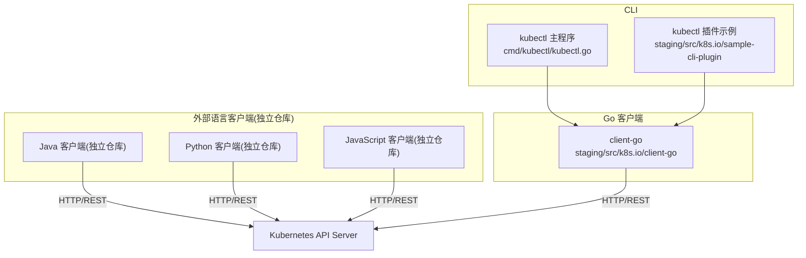
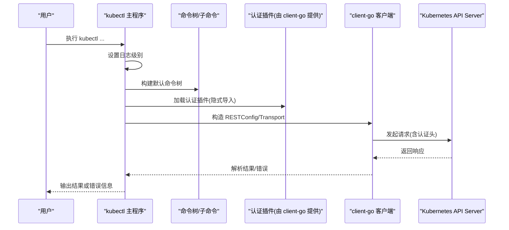
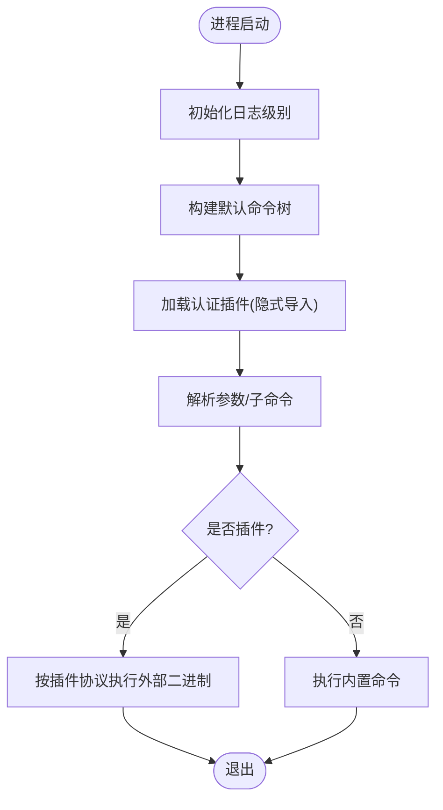
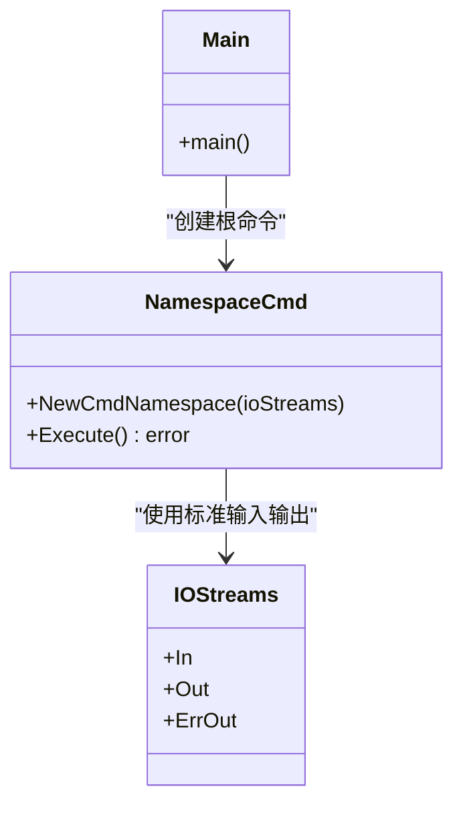
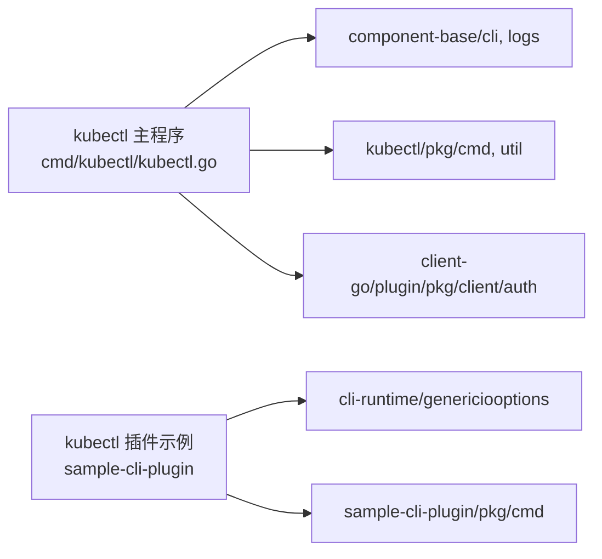

# 其他语言客户端

<cite>
**本文引用的文件**   
- [README.md](file://staging/src/k8s.io/client-go/README.md)
- [kubectl.go](file://cmd/kubectl/kubectl.go)
- [sample-cli-plugin README.md](file://staging/src/k8s.io/sample-cli-plugin/README.md)
- [kubectl-ns.go](file://staging/src/k8s.io/sample-cli-plugin/cmd/kubectl-ns.go)
</cite>

## 目录
1. [简介](#简介)
2. [项目结构](#项目结构)
3. [核心组件](#核心组件)
4. [架构总览](#架构总览)
5. [详细组件分析](#详细组件分析)
6. [依赖关系分析](#依赖关系分析)
7. [性能考量](#性能考量)
8. [故障排查指南](#故障排查指南)
9. [结论](#结论)
10. [附录](#附录)

## 简介
本指南面向希望在 Kubernetes 生态中使用“其他语言”（Java、Python、JavaScript 等）官方客户端库的开发者，提供集成与最佳实践说明。内容涵盖：
- 各语言客户端的安装与基本用法要点
- 与 Go 客户端的关系与差异
- 资源创建、查询与管理集群状态的通用模式
- 认证配置、连接管理与错误处理的最佳实践
- kubectl 命令行内部架构与扩展机制
- CLI 工具开发指南（自定义命令与插件系统）
- 多语言客户端的性能对比与选型建议

说明：本仓库以 Go 生态为主，包含 Go 客户端 client-go 与 kubectl 源码；其他语言的官方客户端由社区维护于独立仓库。本文在涉及非 Go 客户端时，将给出通用指引与参考路径，并结合本仓库中的 Go 侧实现进行对照说明。

## 项目结构
与本主题直接相关的代码位于以下位置：
- Go 客户端 client-go：staging/src/k8s.io/client-go
- kubectl 主入口：cmd/kubectl/kubectl.go
- kubectl 插件示例：staging/src/k8s.io/sample-cli-plugin

图表来源
- [kubectl.go:1-45](file://cmd/kubectl/kubectl.go#L1-L45)
- [README.md:1-194](file://staging/src/k8s.io/client-go/README.md#L1-L194)

章节来源
- [kubectl.go:1-45](file://cmd/kubectl/kubectl.go#L1-L45)
- [README.md:1-194](file://staging/src/k8s.io/client-go/README.md#L1-L194)

## 核心组件
- Go 客户端 client-go
  - 提供 typed clientset、动态客户端 discovery、informer/listers、认证插件、传输层等能力
  - 版本策略与兼容性矩阵见其 README
- kubectl 主程序
  - 初始化日志级别、构建默认命令树、执行并输出错误
  - 通过导入 client-go 认证插件包完成认证扩展
- kubectl 插件示例
  - 展示如何基于 cli-runtime 与 genericiooptions 构建可被 kubectl 发现的子命令
  - 演示读取/修改 KUBECONFIG 上下文、使用 RESTClient 访问 API

章节来源
- [README.md:1-194](file://staging/src/k8s.io/client-go/README.md#L1-L194)
- [kubectl.go:1-45](file://cmd/kubectl/kubectl.go#L1-L45)
- [sample-cli-plugin README.md:1-107](file://staging/src/k8s.io/sample-cli-plugin/README.md#L1-L107)
- [kubectl-ns.go:1-37](file://staging/src/k8s.io/sample-cli-plugin/cmd/kubectl-ns.go#L1-L37)

## 架构总览
下图展示了 kubectl 启动流程与插件发现机制，以及 Go 客户端在其中的角色。

图表来源
- [kubectl.go:1-45](file://cmd/kubectl/kubectl.go#L1-L45)
- [README.md:1-194](file://staging/src/k8s.io/client-go/README.md#L1-L194)

## 详细组件分析

### Go 客户端 client-go 概览
- 包含 typed clientset、discovery、dynamic client、informer/lister、transport、auth plugins 等
- 版本策略：v0.x.y 标签对应 Kubernetes v1.x.y 发布；兼容矩阵见 README
- 安装方式：go get 指定版本或 latest

章节来源
- [README.md:1-194](file://staging/src/k8s.io/client-go/README.md#L1-L194)

### kubectl 主程序与插件体系
- 主程序负责：
  - 解析全局参数（如日志级别）
  - 构建默认命令树
  - 执行命令并统一错误输出
- 认证扩展：
  - 通过导入 client-go 的认证插件包启用外部认证源
- 插件发现：
  - 支持 kubectl 插件协议，PATH 下符合命名约定的可执行文件会被自动发现

图表来源
- [kubectl.go:1-45](file://cmd/kubectl/kubectl.go#L1-L45)

章节来源
- [kubectl.go:1-45](file://cmd/kubectl/kubectl.go#L1-L45)

### kubectl 插件示例：切换当前上下文命名空间
- 目标：在不破坏现有上下文的前提下，为当前上下文生成指向新命名空间的等效上下文
- 关键能力：
  - 使用 cli-runtime 的 genericiooptions 获取/修改 KUBECONFIG
  - 复用 kubectl 提供的通用选项与 REST 客户端
  - 支持 shell 补全（kubectl >= 1.26）

图表来源
- [kubectl-ns.go:1-37](file://staging/src/k8s.io/sample-cli-plugin/cmd/kubectl-ns.go#L1-L37)
- [sample-cli-plugin README.md:1-107](file://staging/src/k8s.io/sample-cli-plugin/README.md#L1-L107)

章节来源
- [sample-cli-plugin README.md:1-107](file://staging/src/k8s.io/sample-cli-plugin/README.md#L1-L107)
- [kubectl-ns.go:1-37](file://staging/src/k8s.io/sample-cli-plugin/cmd/kubectl-ns.go#L1-L37)

### 其他语言客户端（Java、Python、JavaScript）集成要点
说明：这些客户端由社区维护于独立仓库，不在本仓库中。以下为通用集成步骤与注意事项，供快速上手与对照理解。

- Java 客户端（独立仓库）
  - 安装：通过 Maven/Gradle 引入官方工件
  - 基本用法：
    - 从 Pod 内使用 in-cluster 配置
    - 从本地使用 kubeconfig 配置
    - 使用 typed client 或 dynamic client 操作资源
  - 认证：支持 ServiceAccount Token、Bearer Token、证书等
  - 连接管理：合理设置超时、重试、连接池
  - 错误处理：区分服务端错误码与网络异常，记录上下文信息

- Python 客户端（独立仓库）
  - 安装：pip install kubernetes
  - 基本用法：
    - load_kube_config() / config.load_incluster_config()
    - CoreV1Api/AppsV1Api 等 typed client
    - 或使用 ApiClient 发送 raw 请求
  - 认证：kubeconfig、Token、证书、exec 插件
  - 连接管理：会话复用、超时与重试策略
  - 错误处理： ApiException 分类处理，结合日志与指标

- JavaScript/TypeScript 客户端（独立仓库）
  - 安装：npm/yarn 安装 @kubernetes/client-node
  - 基本用法：
    - fromKubeConfig() / fromCluster()
    - 使用 V1Pod/V1Deployment 等模型对象
    - 支持 watch/streaming
  - 认证：kubeconfig、Token、证书、exec 插件
  - 连接管理：事件循环友好、避免阻塞 I/O
  - 错误处理：捕获 HTTP 错误与序列化错误，结构化日志

注意：以上为通用实践总结，具体 API 与示例请参考各语言官方仓库文档与示例。

[本节不直接分析本仓库特定文件，故无“章节来源”]

## 依赖关系分析
- kubectl 主程序依赖：
  - component-base/cli 与 logs
  - kubectl/pkg/cmd 与 util
  - client-go/plugin/pkg/client/auth（用于认证插件）
- kubectl 插件示例依赖：
  - cli-runtime/genericiooptions
  - sample-cli-plugin 内部命令实现

图表来源
- [kubectl.go:1-45](file://cmd/kubectl/kubectl.go#L1-L45)
- [kubectl-ns.go:1-37](file://staging/src/k8s.io/sample-cli-plugin/cmd/kubectl-ns.go#L1-L37)

章节来源
- [kubectl.go:1-45](file://cmd/kubectl/kubectl.go#L1-L45)
- [kubectl-ns.go:1-37](file://staging/src/k8s.io/sample-cli-plugin/cmd/kubectl-ns.go#L1-L37)

## 性能考量
- 连接与请求
  - 复用 HTTP 连接与 TLS 会话
  - 合理设置超时与重试退避
  - 对列表/Watch 场景使用分页与增量同步
- 缓存与 Informer
  - 使用 informer/lister 减少直连 API 的压力
  - 控制 resync 周期与队列深度
- 并发与背压
  - 控制并发度，避免雪崩
  - 使用工作队列与速率限制
- 序列化与带宽
  - 选择合适的内容类型与字段选择
  - 压缩大对象传输（若服务端支持）
- 多语言差异
  - Go：原生高性能、强类型、丰富生态
  - Python：易用但需注意 GIL 与异步化
  - JavaScript：事件驱动适合高并发 I/O，注意内存与 GC

[本节提供通用指导，不直接分析特定文件，故无“章节来源”]

## 故障排查指南
- 认证失败
  - 检查 kubeconfig 路径、上下文、令牌有效期
  - 确认 exec 插件可执行且返回正确凭据
  - 查看 client-go 认证插件日志
- 连接问题
  - 校验 API Server 地址、端口、TLS 证书链
  - 检查代理与防火墙规则
  - 调整超时与重试参数
- 权限不足
  - 核对 RBAC 规则（Role/ClusterRole、Binding）
  - 验证 Impersonation 与审计日志
- 插件相关问题
  - 确保插件二进制在 PATH 中且可执行
  - 遵循 kubectl 插件协议（stdout/stderr 约定）
  - 使用 --help 与调试标志定位问题

章节来源
- [kubectl.go:1-45](file://cmd/kubectl/kubectl.go#L1-L45)
- [README.md:1-194](file://staging/src/k8s.io/client-go/README.md#L1-L194)

## 结论
- Go 客户端 client-go 是 Kubernetes 生态的核心基础，kubectl 与其紧密协作
- 其他语言客户端遵循统一的 REST/OpenAPI 契约，认证与连接模式相似
- 插件体系让 kubectl 具备高度可扩展性，便于企业定制
- 在生产环境中应重视连接管理、错误处理与性能调优

[本节为总结性内容，不直接分析特定文件，故无“章节来源”]

## 附录
- 参考与延伸阅读
  - client-go README：版本策略、兼容性矩阵、安装与使用
  - kubectl 主程序入口：了解命令树构建与错误输出
  - kubectl 插件示例：学习基于 cli-runtime 的插件开发

章节来源
- [README.md:1-194](file://staging/src/k8s.io/client-go/README.md#L1-L194)
- [kubectl.go:1-45](file://cmd/kubectl/kubectl.go#L1-L45)
- [sample-cli-plugin README.md:1-107](file://staging/src/k8s.io/sample-cli-plugin/README.md#L1-L107)