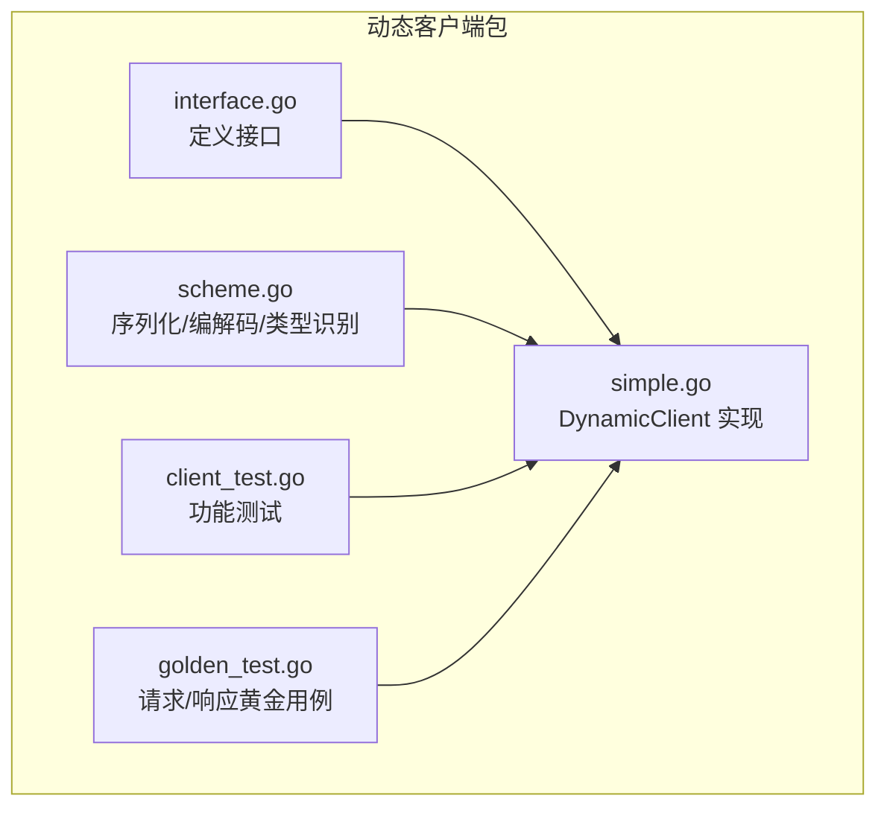
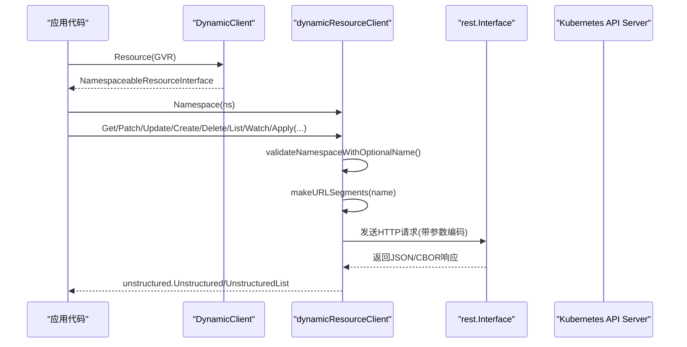
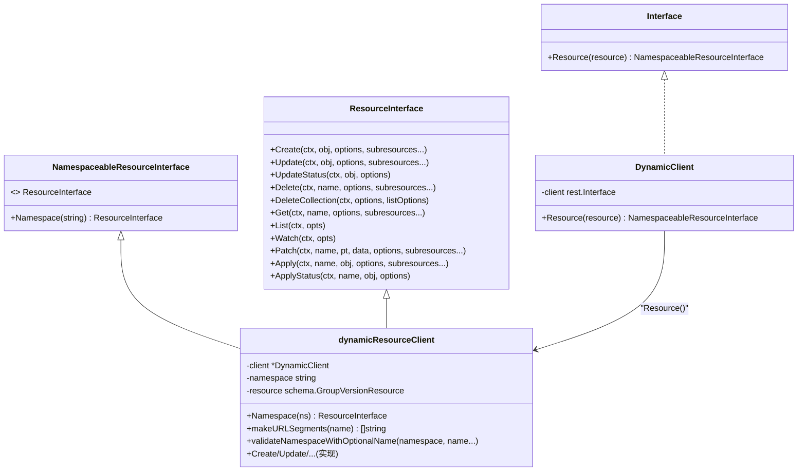
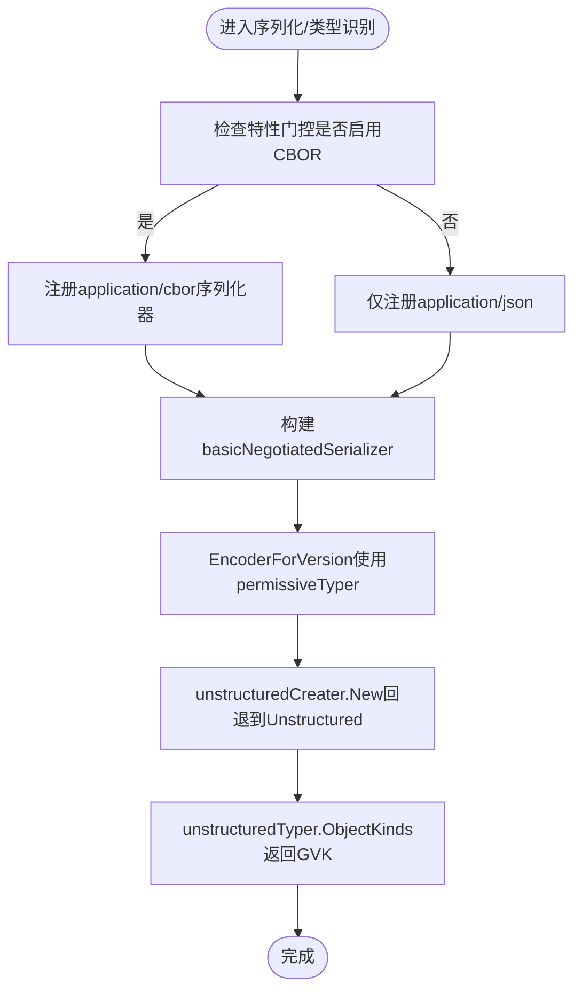
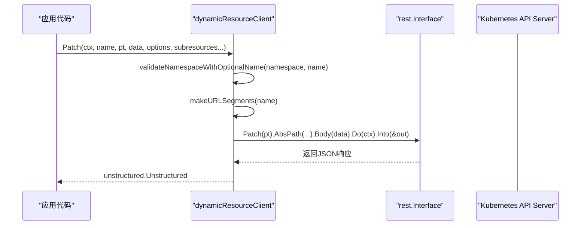
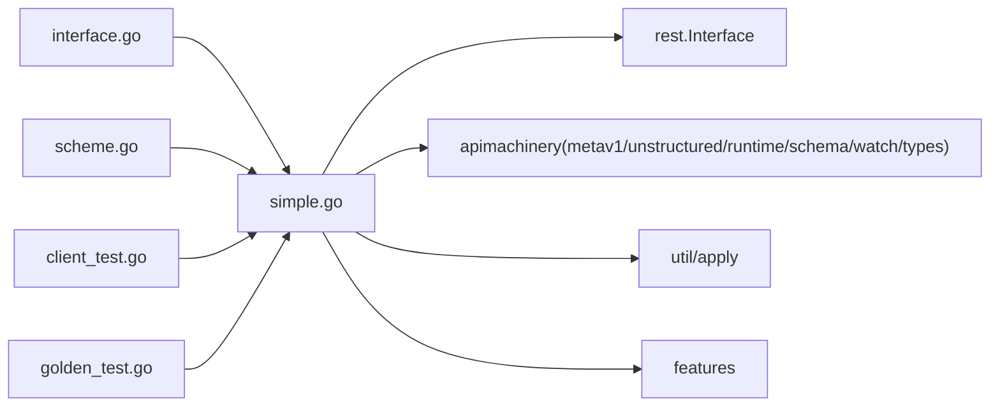

# 动态客户端

<cite>
**本文引用的文件**   
- [interface.go](file://staging/src/k8s.io/client-go/dynamic/interface.go)
- [simple.go](file://staging/src/k8s.io/client-go/dynamic/simple.go)
- [scheme.go](file://staging/src/k8s.io/client-go/dynamic/scheme.go)
- [client_test.go](file://staging/src/k8s.io/client-go/dynamic/client_test.go)
- [golden_test.go](file://staging/src/k8s.io/client-go/dynamic/golden_test.go)
</cite>

## 目录
1. [简介](#简介)
2. [项目结构](#项目结构)
3. [核心组件](#核心组件)
4. [架构总览](#架构总览)
5. [详细组件分析](#详细组件分析)
6. [依赖关系分析](#依赖关系分析)
7. [性能考虑](#性能考虑)
8. [故障排查指南](#故障排查指南)
9. [结论](#结论)
10. [附录](#附录)

## 简介
本文件面向在 Kubernetes 中使用动态客户端的开发者，聚焦以下目标：
- 解释动态客户端的设计原理与适用场景（尤其是处理未知类型资源、CRD 等）。
- 说明如何发现并加载自定义 API 资源，以及 CRD 的动态注册与处理思路。
- 提供完整的动态资源操作示例路径，展示如何处理未知类型的资源对象。
- 解释 OpenAPI 规范的使用与资源发现机制。
- 详细说明动态 Informer 与动态 Lister 的实现和使用方法。
- 给出性能优化技巧（缓存策略、批量操作等）。
- 总结错误处理与异常情况的处理模式。
- 解释与静态类型客户端的混合使用方案。

## 项目结构
本仓库中的动态客户端位于 staging 模块下的 client-go/dynamic 包，核心文件包括：
- interface.go：定义动态客户端接口与资源访问接口。
- simple.go：实现 DynamicClient 及具体资源客户端，封装 REST 调用、参数编解码、URL 构造等。
- scheme.go：配置序列化/反序列化器、CBOR 支持、Unstructured 创建与类型识别。
- client_test.go / golden_test.go：单元测试与请求/响应黄金用例，覆盖常见 CRUD、Watch、Patch、Apply 等。

图表来源
- [interface.go:1-64](file://staging/src/k8s.io/client-go/dynamic/interface.go#L1-L64)
- [simple.go:1-363](file://staging/src/k8s.io/client-go/dynamic/simple.go#L1-L363)
- [scheme.go:1-145](file://staging/src/k8s.io/client-go/dynamic/scheme.go#L1-L145)
- [client_test.go:1-806](file://staging/src/k8s.io/client-go/dynamic/client_test.go#L1-L806)
- [golden_test.go:1-410](file://staging/src/k8s.io/client-go/dynamic/golden_test.go#L1-L410)

章节来源
- [interface.go:1-64](file://staging/src/k8s.io/client-go/dynamic/interface.go#L1-L64)
- [simple.go:1-363](file://staging/src/k8s.io/client-go/dynamic/simple.go#L1-L363)
- [scheme.go:1-145](file://staging/src/k8s.io/client-go/dynamic/scheme.go#L1-L145)
- [client_test.go:1-806](file://staging/src/k8s.io/client-go/dynamic/client_test.go#L1-L806)
- [golden_test.go:1-410](file://staging/src/k8s.io/client-go/dynamic/golden_test.go#L1-L410)

## 核心组件
- 动态客户端接口
  - Interface：通过 Resource(GVR) 获取可命名空间化的资源接口。
  - NamespaceableResourceInterface：提供 Namespace(ns) 限定命名空间，并继承 ResourceInterface。
  - ResourceInterface：提供 Create/Update/UpdateStatus/Delete/DeleteCollection/Get/List/Watch/Patch/Apply/ApplyStatus 等方法，统一以 unstructured.Unstructured 作为数据载体。
- 动态客户端实现
  - DynamicClient：基于 rest.Interface 的无版本客户端，负责 HTTP 请求构建、参数编码、结果解码。
  - dynamicResourceClient：针对特定 GVR 的资源客户端，内部维护 namespace 与 resource，负责 URL 分段组装与校验。
- 序列化与类型识别
  - basicNegotiatedSerializer：默认 JSON，可选 CBOR；配合 Unstructured 进行编解码。
  - permissiveTyper/unstructuredCreater：允许未设置 apiVersion/kind 的 Unstructured 对象参与编解码，提升灵活性。

章节来源
- [interface.go:29-50](file://staging/src/k8s.io/client-go/dynamic/interface.go#L29-L50)
- [simple.go:34-117](file://staging/src/k8s.io/client-go/dynamic/simple.go#L34-L117)
- [scheme.go:40-89](file://staging/src/k8s.io/client-go/dynamic/scheme.go#L40-L89)
- [scheme.go:91-145](file://staging/src/k8s.io/client-go/dynamic/scheme.go#L91-L145)

## 架构总览
动态客户端整体流程：应用层通过 DynamicClient.Resource(GVR).Namespace(ns) 获取资源接口，随后调用 Get/Create/Update/Delete/List/Watch/Patch/Apply 等方法。底层由 dynamicResourceClient 将 GVR 与 name 拼装为 REST 路径，并通过 rest.Interface 发起 HTTP 请求，返回 unstructured.Unstructured 或列表。

图表来源
- [simple.go:109-117](file://staging/src/k8s.io/client-go/dynamic/simple.go#L109-L117)
- [simple.go:329-362](file://staging/src/k8s.io/client-go/dynamic/simple.go#L329-L362)
- [simple.go:119-327](file://staging/src/k8s.io/client-go/dynamic/simple.go#L119-L327)

## 详细组件分析

### 动态客户端接口与实现
- 接口设计
  - Interface.Resource(GVR) 返回 NamespaceableResourceInterface，便于链式调用。
  - NamespaceableResourceInterface.Namespace(ns) 返回 ResourceInterface，限定命名空间。
  - ResourceInterface 暴露标准 REST 语义方法，统一以 unstructured 承载数据。
- 实现要点
  - DynamicClient 使用 rest.UnversionedRESTClientForConfigAndClient 创建无版本客户端，避免硬编码 GroupVersion。
  - dynamicResourceClient 负责：
    - 参数校验：validateNamespaceWithOptionalName 检查命名空间与名称合法性。
    - URL 组装：makeURLSegments 根据 Group、Version、Resource、Namespace、Name 生成路径片段。
    - 参数编码：SpecificallyVersionedParams 使用 dynamicParameterCodec 与 versionV1。
    - 子资源支持：所有写/读方法均支持可变参数 subresources。
  - Apply 系列方法：
    - Apply 使用 apply.NewRequest 构建服务端 Apply 请求，要求对象未包含 managedFields。
    - ApplyStatus 是 Apply 的特化，追加 status 子资源路径。

图表来源
- [interface.go:29-50](file://staging/src/k8s.io/client-go/dynamic/interface.go#L29-L50)
- [simple.go:34-117](file://staging/src/k8s.io/client-go/dynamic/simple.go#L34-L117)
- [simple.go:103-117](file://staging/src/k8s.io/client-go/dynamic/simple.go#L103-L117)

章节来源
- [interface.go:29-50](file://staging/src/k8s.io/client-go/dynamic/interface.go#L29-L50)
- [simple.go:109-117](file://staging/src/k8s.io/client-go/dynamic/simple.go#L109-L117)
- [simple.go:119-327](file://staging/src/k8s.io/client-go/dynamic/simple.go#L119-L327)
- [simple.go:329-362](file://staging/src/k8s.io/client-go/dynamic/simple.go#L329-L362)

### 序列化与类型识别
- 基本序列化器
  - newBasicNegotiatedSerializer 注册 application/json，并在特性门控开启时注册 application/cbor。
  - EncoderForVersion 使用 permissiveTyper 包装，使 Unstructured 即使缺少 apiVersion/kind 也能被识别。
- Unstructured 创建与类型识别
  - unstructuredCreater.New：若嵌套 creater 无法创建对应类型，则回退到 unstructured.Unstructured。
  - unstructuredTyper.ObjectKinds：对 runtime.Unstructured 直接返回其 GVK，忽略空值。
  - permissiveTyper：兼容历史行为，允许写入时不强制 apiVersion/kind。

图表来源
- [scheme.go:40-89](file://staging/src/k8s.io/client-go/dynamic/scheme.go#L40-L89)
- [scheme.go:91-145](file://staging/src/k8s.io/client-go/dynamic/scheme.go#L91-L145)

章节来源
- [scheme.go:40-89](file://staging/src/k8s.io/client-go/dynamic/scheme.go#L40-L89)
- [scheme.go:91-145](file://staging/src/k8s.io/client-go/dynamic/scheme.go#L91-L145)

### 关键操作流程（以 Patch 为例）

图表来源
- [simple.go:273-290](file://staging/src/k8s.io/client-go/dynamic/simple.go#L273-L290)
- [simple.go:329-362](file://staging/src/k8s.io/client-go/dynamic/simple.go#L329-L362)

章节来源
- [simple.go:273-290](file://staging/src/k8s.io/client-go/dynamic/simple.go#L273-L290)
- [simple.go:329-362](file://staging/src/k8s.io/client-go/dynamic/simple.go#L329-L362)

### 单元测试与黄金用例
- client_test.go
  - 覆盖 List/Get/Delete/DeleteCollection/Create/Update/Watch/Patch 等方法的 HTTP 路径与方法验证。
  - 验证命名空间与名称非法时的错误信息。
- golden_test.go
  - TestGoldenRequest：对比实际发出的 HTTP 请求与期望 fixture，确保请求格式稳定。
  - TestGoldenResponse：固定响应 fixture，验证客户端解析后的对象结构稳定。

章节来源
- [client_test.go:92-166](file://staging/src/k8s.io/client-go/dynamic/client_test.go#L92-L166)
- [client_test.go:168-250](file://staging/src/k8s.io/client-go/dynamic/client_test.go#L168-L250)
- [client_test.go:252-325](file://staging/src/k8s.io/client-go/dynamic/client_test.go#L252-L325)
- [client_test.go:327-378](file://staging/src/k8s.io/client-go/dynamic/client_test.go#L327-L378)
- [client_test.go:380-460](file://staging/src/k8s.io/client-go/dynamic/client_test.go#L380-L460)
- [client_test.go:462-542](file://staging/src/k8s.io/client-go/dynamic/client_test.go#L462-L542)
- [client_test.go:544-614](file://staging/src/k8s.io/client-go/dynamic/client_test.go#L544-L614)
- [client_test.go:616-701](file://staging/src/k8s.io/client-go/dynamic/client_test.go#L616-L701)
- [client_test.go:703-800](file://staging/src/k8s.io/client-go/dynamic/client_test.go#L703-L800)
- [golden_test.go:45-252](file://staging/src/k8s.io/client-go/dynamic/golden_test.go#L45-L252)
- [golden_test.go:262-410](file://staging/src/k8s.io/client-go/dynamic/golden_test.go#L262-L410)

## 依赖关系分析
- 包内依赖
  - simple.go 依赖 interface.go 定义的接口，依赖 scheme.go 提供的序列化与参数编解码。
  - 测试文件依赖 simple.go 与 scheme.go 的行为，用于断言请求/响应一致性。
- 外部依赖
  - rest.Interface：底层 HTTP 客户端抽象。
  - apimachinery 的 metav1、unstructured、runtime、schema、watch、types 等。
  - util/apply：Apply 请求构建。
  - features：特性门控控制 CBOR 支持。

图表来源
- [interface.go:1-64](file://staging/src/k8s.io/client-go/dynamic/interface.go#L1-L64)
- [simple.go:1-363](file://staging/src/k8s.io/client-go/dynamic/simple.go#L1-L363)
- [scheme.go:1-145](file://staging/src/k8s.io/client-go/dynamic/scheme.go#L1-L145)
- [client_test.go:1-806](file://staging/src/k8s.io/client-go/dynamic/client_test.go#L1-L806)
- [golden_test.go:1-410](file://staging/src/k8s.io/client-go/dynamic/golden_test.go#L1-L410)

章节来源
- [simple.go:19-32](file://staging/src/k8s.io/client-go/dynamic/simple.go#L19-L32)
- [scheme.go:19-27](file://staging/src/k8s.io/client-go/dynamic/scheme.go#L19-L27)

## 性能考虑
- 内容协商与 CBOR
  - 当特性门控 ClientsAllowCBOR 启用时，动态客户端优先协商 application/cbor，可降低网络传输开销。
  - ClientsPreferCBOR 进一步将 ContentType 设置为 application/cbor，减少服务器端转换成本。
- WatchList 语义
  - 动态客户端支持 watchlist 语义，有利于大规模列表监听的性能优化。
- 批量操作
  - 使用 DeleteCollection 一次性删除集合，减少多次请求开销。
  - 合理设置 ListOptions（如 ResourceVersion、FieldSelector）以减少不必要的数据传输。
- 缓存策略
  - 结合 Informer/Lister 的本地缓存，避免频繁直连 API Server。
  - 注意缓存一致性与失效策略，避免脏读。

章节来源
- [simple.go:42-59](file://staging/src/k8s.io/client-go/dynamic/simple.go#L42-L59)
- [client_test.go:82-90](file://staging/src/k8s.io/client-go/dynamic/client_test.go#L82-L90)

## 故障排查指南
- 命名空间与名称校验失败
  - 当命名空间或资源名包含非法字符时，会返回“invalid namespace”或“invalid resource name”错误。
  - 建议在调用前自行校验或使用客户端内置校验逻辑。
- Apply 已存在 managedFields
  - Apply 要求对象不包含已设置的 managedFields，否则会拒绝并提示使用 UnstructuredExtractor 获取 ApplyConfiguration。
- Watch 连接与事件流
  - Watch 返回 watch.Interface，需正确处理 ResultChan 关闭与重连逻辑。
- 请求/响应稳定性
  - 使用 golden_test 的 fixture 对比，快速定位请求头、查询参数或响应结构变化导致的回归。

章节来源
- [simple.go:329-341](file://staging/src/k8s.io/client-go/dynamic/simple.go#L329-L341)
- [simple.go:292-327](file://staging/src/k8s.io/client-go/dynamic/simple.go#L292-L327)
- [client_test.go:703-800](file://staging/src/k8s.io/client-go/dynamic/client_test.go#L703-L800)
- [golden_test.go:45-252](file://staging/src/k8s.io/client-go/dynamic/golden_test.go#L45-L252)

## 结论
动态客户端通过统一的 unstructured 模型与灵活的接口设计，为处理未知类型资源（如 CRD）提供了强大能力。结合特性门控的 CBOR 支持、WatchList 语义与完善的测试保障，可在保证灵活性的同时兼顾性能与稳定性。建议在实际工程中配合 Informer/Lister 的缓存机制，并遵循严格的命名与字段校验策略，以获得最佳实践效果。

## 附录

### 设计与适用场景
- 适用场景
  - 处理运行时发现的自定义资源（CRD），无需编译期类型定义。
  - 通用控制器或工具平台需要跨组/跨版本的资源管理能力。
  - 需要最小化依赖与耦合的轻量级客户端。
- 不适用场景
  - 强类型安全与编译期校验需求较高的业务逻辑，建议使用静态类型客户端。

### 资源发现与 OpenAPI 规范
- 资源发现
  - 通过 discovery 接口获取可用 API 组与版本，再结合 GVR 构造动态客户端请求。
- OpenAPI 规范
  - 利用 OpenAPI v3 描述资源字段、约束与子资源，辅助生成文档与校验逻辑。
  - 在动态场景中，OpenAPI 可作为元数据来源，帮助前端或工具展示字段含义与必填项。

[本节为概念性说明，不直接分析具体源文件]

### 动态 Informer 与动态 Lister
- 动态 Informer
  - 基于动态客户端与资源发现，按 GVR 启动 informer，监听资源变更事件。
  - 适合大规模资源监听与本地缓存更新。
- 动态 Lister
  - 从 informer 的共享索引中读取资源快照，避免重复请求 API Server。
  - 常用于控制器主循环中对资源的只读访问。

[本节为概念性说明，不直接分析具体源文件]

### 与静态类型客户端的混合使用
- 何时混合
  - 核心业务使用静态类型客户端获得类型安全与良好 DX。
  - 扩展能力（CRD、第三方资源）使用动态客户端降低耦合。
- 注意事项
  - 保持认证与配置一致（同一 rest.Config）。
  - 明确职责边界，避免在同一资源上混用两种客户端导致状态不一致。
  - 谨慎处理并发与缓存一致性。

[本节为概念性说明，不直接分析具体源文件]