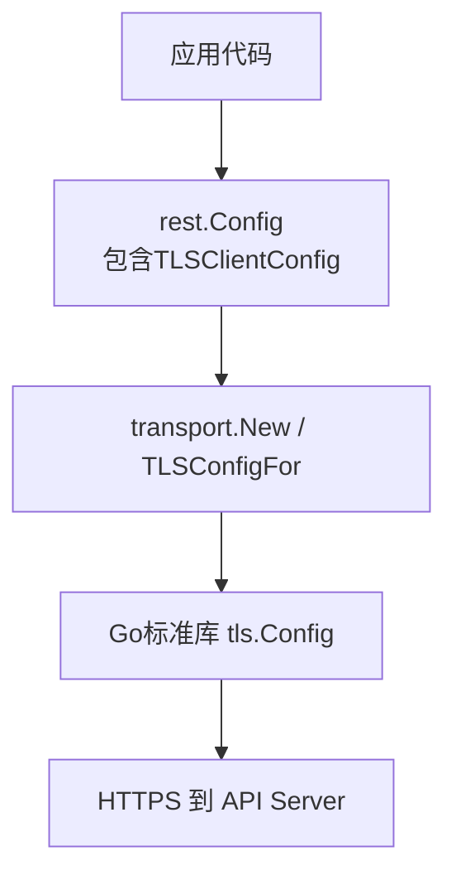
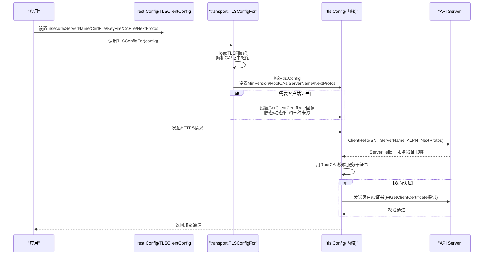
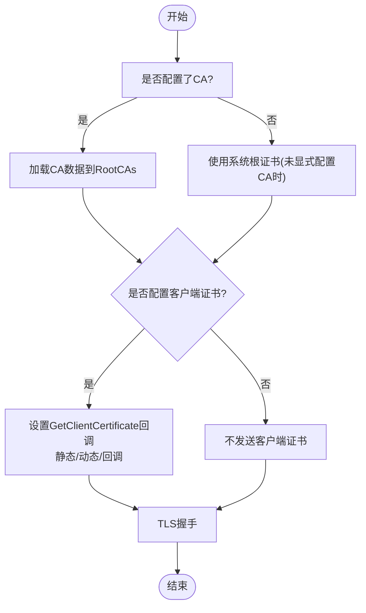
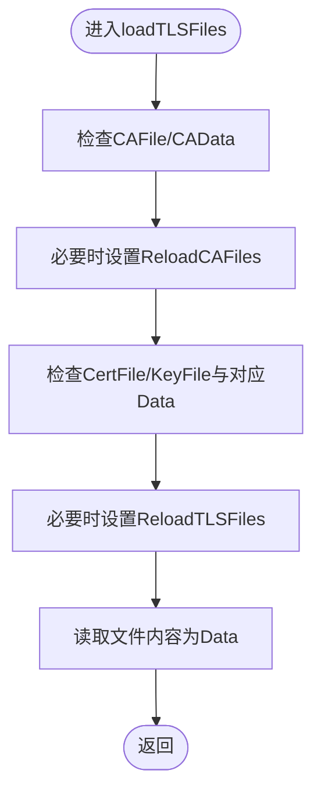
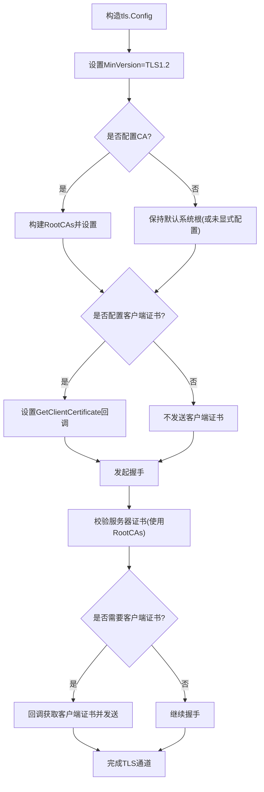
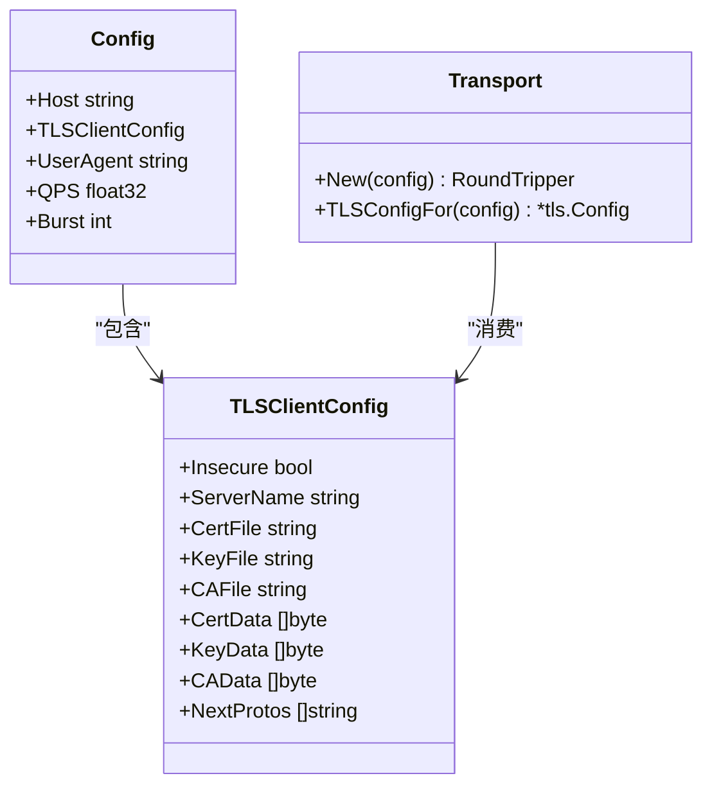

# TLS安全配置

<cite>
**本文引用的文件**   
- [config.go](file://staging/src/k8s.io/client-go/rest/config.go)
- [transport.go](file://staging/src/k8s.io/client-go/transport/transport.go)
</cite>

## 目录
1. [简介](#简介)
2. [项目结构](#项目结构)
3. [核心组件](#核心组件)
4. [架构总览](#架构总览)
5. [详细组件分析](#详细组件分析)
6. [依赖关系分析](#依赖关系分析)
7. [性能考虑](#性能考虑)
8. [故障排查指南](#故障排查指南)
9. [结论](#结论)
10. [附录](#附录)

## 简介
本指南面向Kubernetes客户端的TLS安全配置，聚焦于rest包中的TLSClientConfig与transport层实现。内容涵盖：
- TLSClientConfig各选项的含义与使用方式（证书、密钥、CA、SNI、NextProtos等）
- 双向TLS认证的原理与配置方法
- 证书验证流程与SNI支持
- 证书轮换与安全更新最佳实践
- 连接性能优化与安全加固建议
- 常见配置错误与解决方案

## 项目结构
与TLS客户端配置直接相关的代码位于client-go的rest与transport两个包中：
- rest包提供高层配置对象TLSClientConfig及加载逻辑
- transport包负责将配置转换为底层tls.Config，并处理证书加载、校验、动态重载与缓存

图表来源
- [config.go:234-265](file://staging/src/k8s.io/client-go/rest/config.go#L234-L265)
- [transport.go:78-211](file://staging/src/k8s.io/client-go/transport/transport.go#L78-L211)

章节来源
- [config.go:234-265](file://staging/src/k8s.io/client-go/rest/config.go#L234-L265)
- [transport.go:78-211](file://staging/src/k8s.io/client-go/transport/transport.go#L78-L211)

## 核心组件
- TLSClientConfig：定义客户端侧TLS相关参数，包括是否跳过校验、SNI名称、证书/密钥/CA的文件或内存数据、ALPN协议列表等
- transport.TLSConfigFor：根据配置生成tls.Config，完成CA池构建、客户端证书加载、回调与动态重载策略设置
- 文件/内存数据优先级：Data字段优先于File字段；当仅指定文件路径时启用动态重载与缓存

章节来源
- [config.go:234-265](file://staging/src/k8s.io/client-go/rest/config.go#L234-L265)
- [transport.go:78-211](file://staging/src/k8s.io/client-go/transport/transport.go#L78-L211)

## 架构总览
下图展示了从配置到建立TLS握手的关键步骤，以及双向认证在握手过程中的交互点。

图表来源
- [transport.go:78-211](file://staging/src/k8s.io/client-go/transport/transport.go#L78-L211)
- [config.go:234-265](file://staging/src/k8s.io/client-go/rest/config.go#L234-L265)

## 详细组件分析

### TLSClientConfig 配置项详解
- Insecure：是否跳过服务器证书校验（仅测试环境使用）
- ServerName：SNI名称，用于选择服务端证书并在客户端进行证书主机名校验；为空时使用目标主机名
- CertFile/KeyFile/CAFile：证书、私钥、CA根证书的文件路径
- CertData/KeyData/CAData：PEM编码的证书、私钥、CA根证书的内存数据；Data优先于File
- NextProtos：ALPN协议列表，如["http/1.1","h2"]或仅["http/1.1"]

注意：
- Data字段优先于File字段
- 若同时传入CA与Insecure=true，将被拒绝（不允许绕过校验的同时指定可信根）
- MinVersion固定为TLS 1.2，禁止旧版不安全协议

章节来源
- [config.go:234-265](file://staging/src/k8s.io/client-go/rest/config.go#L234-L265)
- [transport.go:78-100](file://staging/src/k8s.io/client-go/transport/transport.go#L78-L100)

### 双向TLS认证（mTLS）原理与配置
- 客户端侧：
  - 通过CAData/CAFile设置信任根，用于校验服务器证书
  - 通过CertData/KeyFile或CertFile/KeyFile提供客户端证书与私钥
  - 当仅指定文件路径时，启用动态重载与缓存机制
- 服务器侧：
  - 要求客户端证书并进行校验（由apiserver端实现）

图表来源
- [transport.go:101-211](file://staging/src/k8s.io/client-go/transport/transport.go#L101-L211)

章节来源
- [transport.go:101-211](file://staging/src/k8s.io/client-go/transport/transport.go#L101-L211)

### SNI与NextProtos支持
- SNI：通过ServerName设置，影响服务端证书选择与客户端证书主机名校验
- NextProtos：控制ALPN协商顺序，可强制仅HTTP/1.1或优先HTTP/1.1再回退HTTP/2

章节来源
- [config.go:234-265](file://staging/src/k8s.io/client-go/rest/config.go#L234-L265)
- [transport.go:91-99](file://staging/src/k8s.io/client-go/transport/transport.go#L91-L99)

### 证书加载与动态重载
- 加载优先级：Data > File
- 动态重载：当仅使用文件路径（未提供Data）时，启用ReloadTLSFiles标志，并通过cachingCertificateLoader以秒级粒度缓存证书，避免频繁IO
- CA旋转：在特定特性门控开启时，允许基于文件的CA动态重载

图表来源
- [transport.go:213-244](file://staging/src/k8s.io/client-go/transport/transport.go#L213-L244)
- [transport.go:393-416](file://staging/src/k8s.io/client-go/transport/transport.go#L393-L416)

章节来源
- [transport.go:213-244](file://staging/src/k8s.io/client-go/transport/transport.go#L213-L244)
- [transport.go:393-416](file://staging/src/k8s.io/client-go/transport/transport.go#L393-L416)

### 关键流程图：TLS握手与证书校验

图表来源
- [transport.go:78-211](file://staging/src/k8s.io/client-go/transport/transport.go#L78-L211)

## 依赖关系分析
- rest.Config包含TLSClientConfig，作为高层配置入口
- transport层负责将TLSClientConfig映射为tls.Config，并实现证书加载、校验、回调与缓存
- 外部依赖：Go标准库crypto/tls与crypto/x509

图表来源
- [config.go:234-265](file://staging/src/k8s.io/client-go/rest/config.go#L234-L265)
- [transport.go:78-211](file://staging/src/k8s.io/client-go/transport/transport.go#L78-L211)

章节来源
- [config.go:234-265](file://staging/src/k8s.io/client-go/rest/config.go#L234-L265)
- [transport.go:78-211](file://staging/src/k8s.io/client-go/transport/transport.go#L78-L211)

## 性能考虑
- 最小版本限制：强制TLS 1.2，避免低版本协议带来的安全风险与潜在性能问题
- 证书缓存：对文件型证书采用秒级缓存，减少高频IO开销
- ALPN协商：合理设置NextProtos，避免不必要的协议回退
- 连接复用：结合HTTP客户端的连接池与Keep-Alive提升吞吐

[本节为通用指导，无需源码引用]

## 故障排查指南
常见问题与定位要点：
- 同时配置CA与Insecure=true：会被拒绝，需移除Insecure或仅保留其一
- 证书格式错误：无法解析PEM或证书无效，需检查证书链完整性与签名链
- SNI不匹配：ServerName与证书CN/SAN不一致导致校验失败，需修正ServerName或证书
- 缺少客户端证书：当服务端要求mTLS但未配置客户端证书时，握手失败
- 动态重载未生效：仅在纯文件模式（无Data）下启用，确认未混用Data与File

章节来源
- [transport.go:78-100](file://staging/src/k8s.io/client-go/transport/transport.go#L78-L100)
- [transport.go:213-244](file://staging/src/k8s.io/client-go/transport/transport.go#L213-L244)
- [transport.go:262-304](file://staging/src/k8s.io/client-go/transport/transport.go#L262-L304)

## 结论
通过正确配置TLSClientConfig并结合transport层的实现细节，可在Kubernetes客户端上实现安全可靠的TLS通信。遵循最小权限原则、严格证书校验、合理使用SNI与ALPN、启用证书动态重载与缓存，可有效提升安全性与性能。

[本节为总结性内容，无需源码引用]

## 附录

### 证书生成与管理脚本（概念性说明）
- 生成集群CA与服务器证书：包含SAN扩展，覆盖所有API Server监听地址与域名
- 生成客户端证书：为不同用户或服务账户签发，限定有效期与用途
- 证书轮换：定期更换CA与中间证书，确保新旧证书平滑过渡
- 存储与分发：将证书与密钥安全存放，按最小权限原则分发给各组件

[本节为概念性说明，不涉及具体代码片段]

### 证书轮换与安全更新最佳实践
- 使用独立CA层级，缩短子证书生命周期
- 提前部署新CA，滚动替换服务证书，最后下线旧CA
- 启用客户端CA动态重载，避免重启服务
- 审计与监控：记录证书过期告警与异常握手事件

[本节为通用指导，无需源码引用]

### 常见TLS配置错误与解决方案
- 错误：InsecureSkipVerify=true且配置了CA
  - 解决：移除Insecure或仅保留CA
- 错误：ServerName与证书不匹配
  - 解决：调整ServerName或更新证书SAN
- 错误：证书链不完整
  - 解决：合并完整证书链，确保中间证书齐全
- 错误：客户端证书缺失或私钥不匹配
  - 解决：核对证书与私钥配对，确认路径或Data一致

章节来源
- [transport.go:78-100](file://staging/src/k8s.io/client-go/transport/transport.go#L78-L100)
- [transport.go:262-304](file://staging/src/k8s.io/client-go/transport/transport.go#L262-L304)