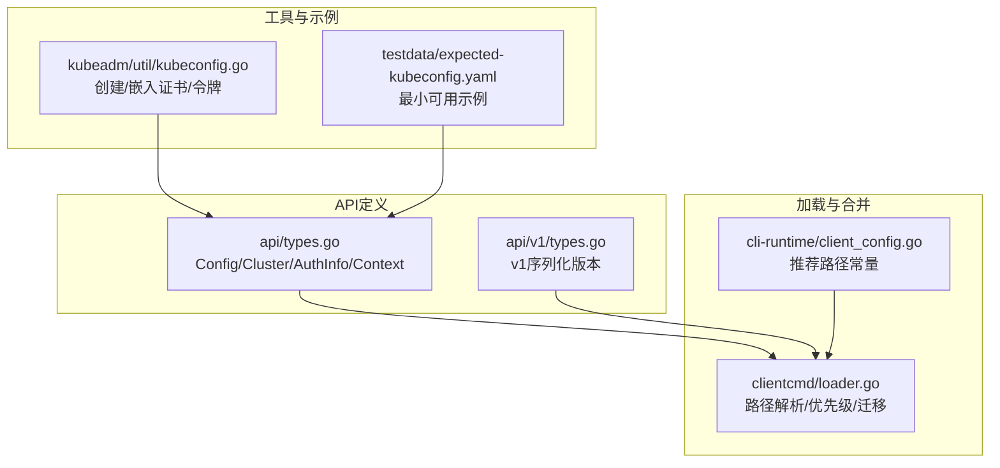
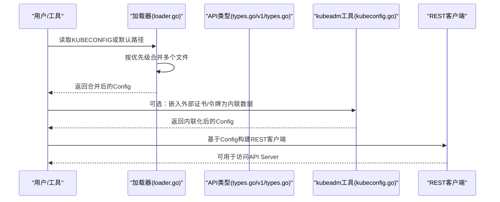
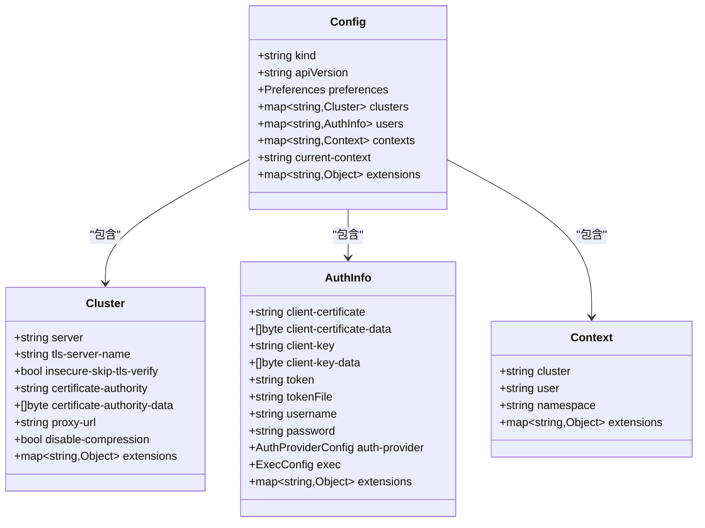
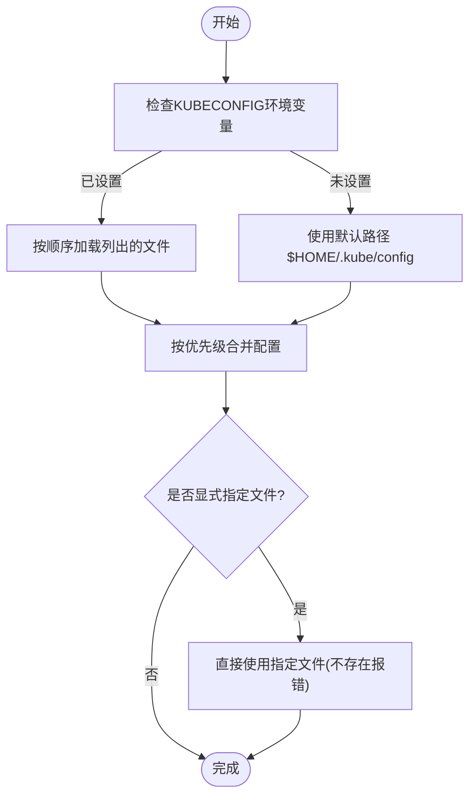

# kubeconfig文件配置

<cite>
**本文引用的文件**   
- [types.go](file://staging/src/k8s.io/client-go/tools/clientcmd/api/types.go)
- [v1/types.go](file://staging/src/k8s.io/client-go/tools/clientcmd/api/v1/types.go)
- [loader.go](file://staging/src/k8s.io/client-go/tools/clientcmd/loader.go)
- [client_config.go](file://staging/src/k8s.io/cli-runtime/pkg/genericclioptions/client_config.go)
- [kubeconfig.go](file://cmd/kubeadm/app/util/kubeconfig/kubeconfig.go)
- [expected-kubeconfig.yaml](file://cmd/kubeadm/app/discovery/token/testdata/expected-kubeconfig.yaml)
</cite>

## 目录
1. [简介](#简介)
2. [项目结构](#项目结构)
3. [核心组件](#核心组件)
4. [架构总览](#架构总览)
5. [详细组件分析](#详细组件分析)
6. [依赖关系分析](#依赖关系分析)
7. [性能与行为特性](#性能与行为特性)
8. [故障排查指南](#故障排查指南)
9. [结论](#结论)
10. [附录](#附录)

## 简介
本指南面向Kubernetes用户与开发者，系统化阐述kubeconfig文件的完整结构与所有配置选项，覆盖clusters、users、contexts和preferences等关键部分；解释字段含义、数据类型与使用场景；提供不同认证方式与网络配置的示例路径；说明配置文件的路径解析规则与优先级机制；并给出验证工具建议、最佳实践与常见错误排查方法。

## 项目结构
kubeconfig的核心数据结构定义位于client-go的API包中，加载与合并逻辑位于clientcmd包，CLI默认路径策略在cli-runtime中也有体现。kubeadm提供了生成与处理kubeconfig的工具函数，测试数据中包含一个最小可用的kubeconfig样例。

图示来源
- [types.go:28-106](file://staging/src/k8s.io/client-go/tools/clientcmd/api/types.go#L28-L106)
- [v1/types.go:26-99](file://staging/src/k8s.io/client-go/tools/clientcmd/api/v1/types.go#L26-L99)
- [loader.go:158-200](file://staging/src/k8s.io/client-go/tools/clientcmd/loader.go#L158-L200)
- [client_config.go:30-31](file://staging/src/k8s.io/cli-runtime/pkg/genericclioptions/client_config.go#L30-L31)
- [kubeconfig.go:33-73](file://cmd/kubeadm/app/util/kubeconfig/kubeconfig.go#L33-L73)
- [expected-kubeconfig.yaml:1-15](file://cmd/kubeadm/app/discovery/token/testdata/expected-kubeconfig.yaml#L1-L15)

章节来源
- [types.go:28-106](file://staging/src/k8s.io/client-go/tools/clientcmd/api/types.go#L28-L106)
- [v1/types.go:26-99](file://staging/src/k8s.io/client-go/tools/clientcmd/api/v1/types.go#L26-L99)
- [loader.go:158-200](file://staging/src/k8s.io/client-go/tools/clientcmd/loader.go#L158-L200)
- [client_config.go:30-31](file://staging/src/k8s.io/cli-runtime/pkg/genericclioptions/client_config.go#L30-L31)
- [kubeconfig.go:33-73](file://cmd/kubeadm/app/util/kubeconfig/kubeconfig.go#L33-L73)
- [expected-kubeconfig.yaml:1-15](file://cmd/kubeadm/app/discovery/token/testdata/expected-kubeconfig.yaml#L1-L15)

## 核心组件
kubeconfig由以下顶层对象组成：
- Config：根对象，包含当前上下文、集群、用户、上下文映射及扩展信息
- Cluster：集群连接信息（地址、TLS、代理、压缩开关等）
- AuthInfo：用户身份与认证信息（证书、令牌、基本认证、exec插件、auth-provider等）
- Context：将Cluster与AuthInfo绑定，并可指定默认命名空间
- Preferences：偏好设置（已弃用，不影响功能）

这些对象的JSON键名与命令行参数保持一致，便于理解与对照。

章节来源
- [types.go:28-106](file://staging/src/k8s.io/client-go/tools/clientcmd/api/types.go#L28-L106)
- [v1/types.go:26-99](file://staging/src/k8s.io/client-go/tools/clientcmd/api/v1/types.go#L26-L99)

## 架构总览
下图展示kubeconfig从磁盘到客户端的配置构建流程，包括路径解析、多文件合并、认证信息嵌入与最终REST配置生成。

图示来源
- [loader.go:158-200](file://staging/src/k8s.io/client-go/tools/clientcmd/loader.go#L158-L200)
- [types.go:28-106](file://staging/src/k8s.io/client-go/tools/clientcmd/api/types.go#L28-L106)
- [v1/types.go:26-99](file://staging/src/k8s.io/client-go/tools/clientcmd/api/v1/types.go#L26-L99)
- [kubeconfig.go:176-229](file://cmd/kubeadm/app/util/kubeconfig/kubeconfig.go#L176-L229)

## 详细组件分析

### 顶层对象：Config
- kind/apiVersion：兼容字段，通常可省略
- preferences：已弃用，不影响功能
- clusters：集群配置映射（键为名称）
- users：用户配置映射（键为用户名）
- contexts：上下文映射（键为上下文名）
- current-context：默认上下文名
- extensions：扩展字段，供插件使用

注意：在v1序列化版本中，clusters/users/contexts以“带name包装”的列表形式出现，但语义等价。

章节来源
- [types.go:28-56](file://staging/src/k8s.io/client-go/tools/clientcmd/api/types.go#L28-L56)
- [v1/types.go:26-53](file://staging/src/k8s.io/client-go/tools/clientcmd/api/v1/types.go#L26-L53)

### 集群对象：Cluster
关键字段
- server：API Server地址（https://host:port）
- tls-server-name：校验证书时的SNI主机名
- insecure-skip-tls-verify：跳过服务器证书校验（不推荐）
- certificate-authority / certificate-authority-data：CA证书路径或PEM数据（后者优先）
- proxy-url：HTTP/HTTPS/SOCKS5代理URL
- disable-compression：关闭响应压缩以提升带宽充足时的吞吐

使用场景
- 企业环境常通过proxy-url统一出站流量
- 私有CA需配置certificate-authority-data避免额外文件依赖
- 调试时可临时开启insecure-skip-tls-verify（生产禁用）

章节来源
- [types.go:68-106](file://staging/src/k8s.io/client-go/tools/clientcmd/api/types.go#L68-L106)
- [v1/types.go:64-99](file://staging/src/k8s.io/client-go/tools/clientcmd/api/v1/types.go#L64-L99)

### 用户对象：AuthInfo
支持多种认证方式（可同时存在时遵循内部优先级）
- 证书认证：client-certificate / client-certificate-data 与 client-key / client-key-data（Data优先）
- 令牌认证：token 或 tokenFile（tokenFile会被周期读取，最后成功值优先）
- 基本认证：username/password（较少使用）
- exec插件：exec.command/args/env/apiVersion/installHint/provideClusterInfo/interactiveMode
- auth-provider：第三方认证提供者（如云厂商登录）
- 模拟身份：act-as / act-as-uid / act-as-groups / act-as-user-extra

安全提示
- 敏感字段带有datapolicy标记，应避免在日志中泄露
- 推荐使用tokenFile或exec插件动态获取短期凭证

章节来源
- [types.go:108-159](file://staging/src/k8s.io/client-go/tools/clientcmd/api/types.go#L108-L159)
- [v1/types.go:101-149](file://staging/src/k8s.io/client-go/tools/clientcmd/api/v1/types.go#L101-L149)

### 上下文对象：Context
- cluster：引用集群名称
- user：引用用户名称
- namespace：请求未显式指定命名空间时的默认值

用途
- 将“谁（user）+ 到哪里（cluster）+ 在哪个域（namespace）”组合成可切换的工作视图

章节来源
- [types.go:161-176](file://staging/src/k8s.io/client-go/tools/clientcmd/api/types.go#L161-L176)
- [v1/types.go:151-163](file://staging/src/k8s.io/client-go/tools/clientcmd/api/v1/types.go#L151-L163)

### 偏好设置：Preferences
- colors：终端颜色输出偏好
- extensions：扩展字段
备注：该结构已在较新版本中标记为弃用，不影响实际功能。

章节来源
- [types.go:58-66](file://staging/src/k8s.io/client-go/tools/clientcmd/api/types.go#L58-L66)
- [v1/types.go:55-62](file://staging/src/k8s.io/client-go/tools/clientcmd/api/v1/types.go#L55-L62)

### 认证方式与网络配置要点
- 证书认证：适合服务账户或管理员长期凭证；建议将证书与密钥内联为Data字段，提升便携性
- 令牌认证：适合CI/CD与短生命周期凭证；tokenFile可实现自动轮转
- exec插件：适合集成外部身份源（如OIDC、云CLI），支持交互式与非交互式模式
- 代理与压缩：通过proxy-url与disable-compression优化网络行为

章节来源
- [types.go:108-159](file://staging/src/k8s.io/client-go/tools/clientcmd/api/types.go#L108-L159)
- [types.go:68-106](file://staging/src/k8s.io/client-go/tools/clientcmd/api/types.go#L68-L106)

### 配置文件示例（路径参考）
- 最小可用示例（含集群、上下文、current-context）：[expected-kubeconfig.yaml](file://cmd/kubeadm/app/discovery/token/testdata/expected-kubeconfig.yaml)
- 使用kubeadm工具快速生成基础kubeconfig（含证书或令牌）：[kubeconfig.go](file://cmd/kubeadm/app/util/kubeconfig/kubeconfig.go)

章节来源
- [expected-kubeconfig.yaml:1-15](file://cmd/kubeadm/app/discovery/token/testdata/expected-kubeconfig.yaml#L1-L15)
- [kubeconfig.go:33-73](file://cmd/kubeadm/app/util/kubeconfig/kubeconfig.go#L33-L73)

## 依赖关系分析
- API层：api/types.go与api/v1/types.go定义了kubeconfig的数据模型与序列化差异
- 加载层：clientcmd/loader.go实现路径解析、多文件合并、迁移规则与缺失告警
- CLI层：cli-runtime/client_config.go暴露推荐路径常量与环境变量约定
- 工具层：kubeadm/util/kubeconfig.go提供便捷构造与内联化处理

图示来源
- [types.go:28-176](file://staging/src/k8s.io/client-go/tools/clientcmd/api/types.go#L28-L176)
- [v1/types.go:26-163](file://staging/src/k8s.io/client-go/tools/clientcmd/api/v1/types.go#L26-L163)

章节来源
- [types.go:28-176](file://staging/src/k8s.io/client-go/tools/clientcmd/api/types.go#L28-L176)
- [v1/types.go:26-163](file://staging/src/k8s.io/client-go/tools/clientcmd/api/v1/types.go#L26-L163)
- [loader.go:158-200](file://staging/src/k8s.io/client-go/tools/clientcmd/loader.go#L158-L200)
- [client_config.go:30-31](file://staging/src/k8s.io/cli-runtime/pkg/genericclioptions/client_config.go#L30-L31)

## 性能与行为特性
- 多文件合并策略：先按优先级顺序读取，同名键首次写入者胜出；非map结构的字段会覆盖更新
- 相对路径解析：kubeconfig中的相对路径会相对于其所在文件目录解析为绝对路径
- 缺失文件告警：当KUBECONFIG指向的所有文件均不存在时，可选择发出警告
- 压缩开关：disable-compression可在带宽充足时减少CPU开销，提升列表类请求吞吐

章节来源
- [loader.go:182-196](file://staging/src/k8s.io/client-go/tools/clientcmd/loader.go#L182-L196)
- [types.go:98-102](file://staging/src/k8s.io/client-go/tools/clientcmd/api/types.go#L98-L102)

## 故障排查指南
常见问题与定位步骤
- 无法找到配置文件
  - 检查环境变量KUBECONFIG是否设置正确
  - 确认默认路径是否存在：$HOME/.kube/config
  - 若KUBECONFIG指向多个文件，确保至少有一个有效
- 认证失败
  - 证书路径或内容不正确：优先使用certificate-authority-data内联CA
  - 令牌过期或未生效：若使用tokenFile，确认文件可读且内容最新
  - exec插件不可执行或缺少依赖：检查command与args，必要时启用installHint提示
- TLS握手问题
  - 证书域名不匹配：配置tls-server-name进行SNI校验
  - 临时绕过校验仅用于排障：insecure-skip-tls-verify（生产禁用）
- 代理与网络
  - 未生效：确认proxy-url格式与可达性
  - 列表请求慢：尝试开启disable-compression

实用工具与建议
- 使用kubeadm工具快速生成与内联化证书/令牌，减少外部文件依赖
- 借助kubectl config view/diff/merge辅助查看与对比配置
- 在CI/CD中使用tokenFile或exec插件管理短期凭证

章节来源
- [client_config.go:30-31](file://staging/src/k8s.io/cli-runtime/pkg/genericclioptions/client_config.go#L30-L31)
- [kubeconfig.go:176-229](file://cmd/kubeadm/app/util/kubeconfig/kubeconfig.go#L176-L229)

## 结论
kubeconfig是Kubernetes客户端访问控制面的核心入口。掌握其数据结构、认证方式与路径解析规则，有助于在不同环境与团队中稳定复用配置。建议在生产环境中采用内联证书与令牌文件轮转，结合exec插件与严格的插件策略，兼顾安全性与可维护性。

## 附录

### 路径解析与优先级机制
- 环境变量KUBECONFIG：若设置，则按冒号分隔的文件列表依次加载（去重后保持顺序）
- 默认路径：若未设置KUBECONFIG，则使用$HOME/.kube/config
- 显式文件：若通过命令行参数指定具体文件，则以该文件为准（不存在时报错）
- 合并规则：同名键首次写入者胜出；非map字段会被后续文件覆盖
- 迁移规则：旧版位置会自动迁移至新位置后再加载

图示来源
- [loader.go:158-200](file://staging/src/k8s.io/client-go/tools/clientcmd/loader.go#L158-L200)
- [client_config.go:30-31](file://staging/src/k8s.io/cli-runtime/pkg/genericclioptions/client_config.go#L30-L31)

章节来源
- [loader.go:158-200](file://staging/src/k8s.io/client-go/tools/clientcmd/loader.go#L158-L200)
- [client_config.go:30-31](file://staging/src/k8s.io/cli-runtime/pkg/genericclioptions/client_config.go#L30-L31)