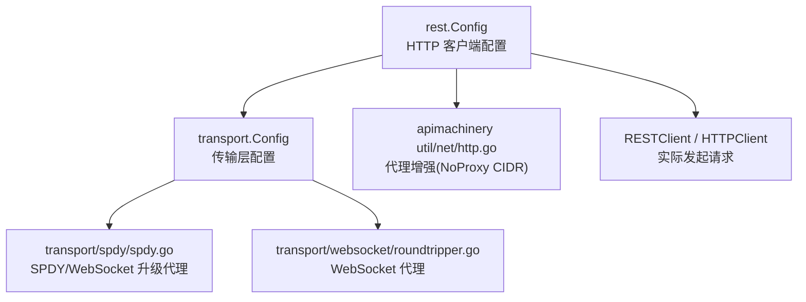
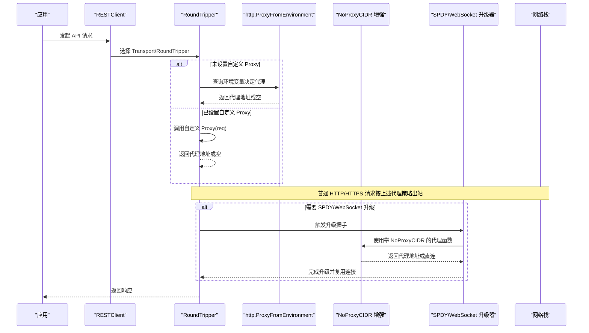
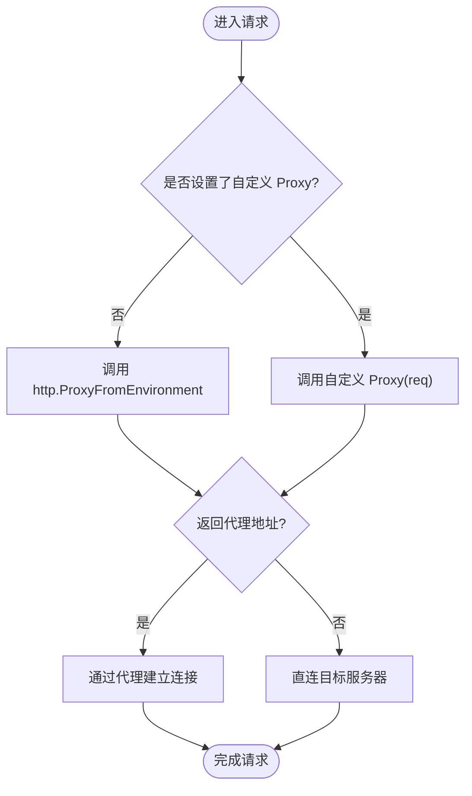
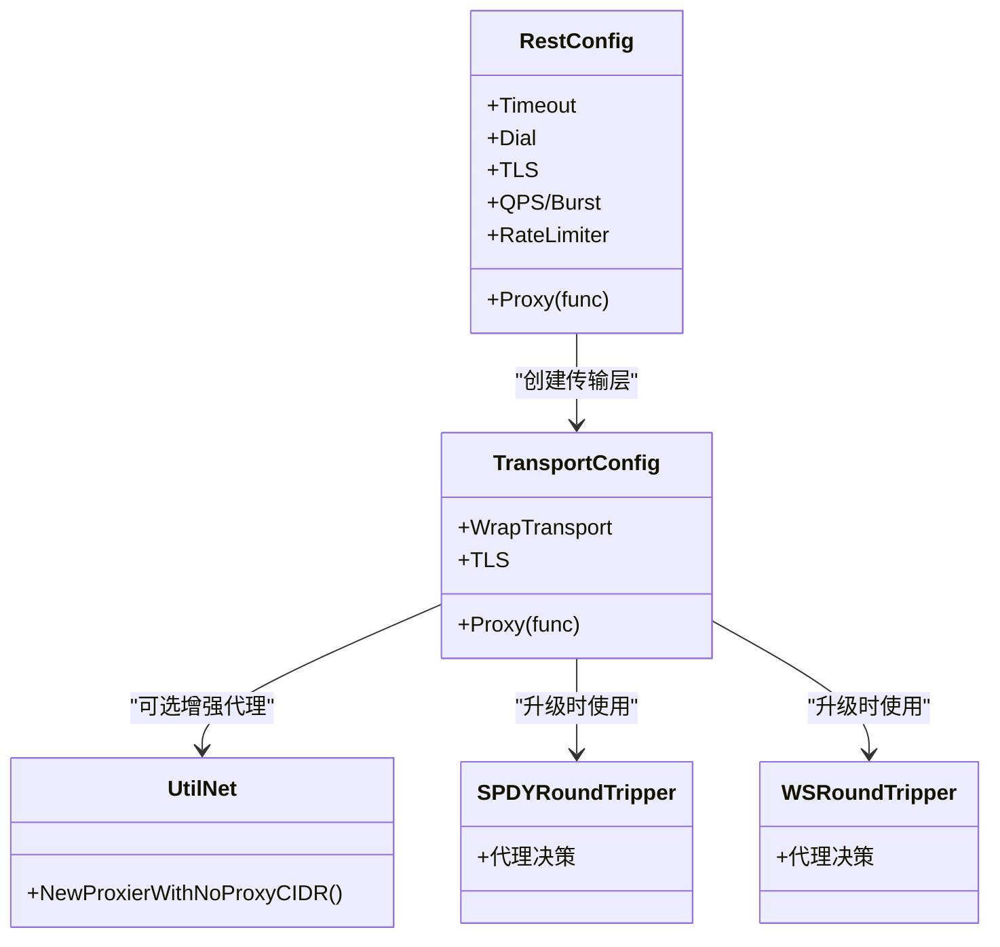

# 代理和网络配置

<cite>
**本文引用的文件**
- [config.go](file://staging/src/k8s.io/client-go/rest/config.go)
- [transport_config.go](file://staging/src/k8s.io/client-go/transport/config.go)
- [http_util.go](file://staging/src/k8s.io/apimachinery/pkg/util/net/http.go)
- [spdy_roundtripper.go](file://staging/src/k8s.io/client-go/transport/spdy/spdy.go)
- [websocket_roundtripper.go](file://staging/src/k8s.io/client-go/transport/websocket/roundtripper.go)
- [exec_test.go](file://staging/src/k8s.io/client-go/rest/exec_test.go)
</cite>

## 目录
1. [简介](#简介)
2. [项目结构](#项目结构)
3. [核心组件](#核心组件)
4. [架构总览](#架构总览)
5. [详细组件分析](#详细组件分析)
6. [依赖关系分析](#依赖关系分析)
7. [性能考虑](#性能考虑)
8. [故障排查指南](#故障排查指南)
9. [结论](#结论)
10. [附录](#附录)

## 简介
本文件面向在 Kubernetes 生态中使用客户端访问 API Server 的开发者与运维人员，聚焦于 HTTP、HTTPS 与 SOCKS5 代理的配置与实现原理，涵盖以下主题：
- Proxy 函数的工作原理与自定义代理逻辑
- 网络超时、连接池与重试机制的配置要点
- 企业网络环境下的代理配置示例（含认证与 SSL 隧道）
- 常见网络问题的排查方法与性能调优建议

## 项目结构
围绕“代理与网络”的关键代码主要位于 client-go 的 rest 与 transport 包，以及 apimachinery 的网络工具中。下图展示了与代理相关的主要模块及其职责：

图表来源
- [config.go:156-161](file://staging/src/k8s.io/client-go/rest/config.go#L156-L161)
- [transport_config.go:74-79](file://staging/src/k8s.io/client-go/transport/config.go#L74-L79)
- [http_util.go:110-112](file://staging/src/k8s.io/apimachinery/pkg/util/net/http.go#L110-L112)
- [spdy_roundtripper.go:43](file://staging/src/k8s.io/client-go/transport/spdy/spdy.go#L43)
- [websocket_roundtripper.go:193](file://staging/src/k8s.io/client-go/transport/websocket/roundtripper.go#L193)

章节来源
- [config.go:156-161](file://staging/src/k8s.io/client-go/rest/config.go#L156-L161)
- [transport_config.go:74-79](file://staging/src/k8s.io/client-go/transport/config.go#L74-L79)
- [http_util.go:110-112](file://staging/src/k8s.io/apimachinery/pkg/util/net/http.go#L110-L112)
- [spdy_roundtripper.go:43](file://staging/src/k8s.io/client-go/transport/spdy/spdy.go#L43)
- [websocket_roundtripper.go:193](file://staging/src/k8s.io/client-go/transport/websocket/roundtripper.go#L193)

## 核心组件
- REST 客户端配置（rest.Config）
  - 提供 Proxy 字段用于指定代理决策函数；若为 nil，则回退到 http.ProxyFromEnvironment
  - 支持 Timeout、Dial、TLS、QPS/Burst、RateLimiter 等网络与限流参数
- 传输层配置（transport.Config）
  - 同样暴露 Proxy 字段，并在构建 RoundTripper 时生效
  - 支持 WrapTransport 以叠加中间件（如日志、指标、重试等）
- 代理增强（apimachinery util/net/http.go）
  - 对默认 http.ProxyFromEnvironment 进行增强，支持基于 CIDR 的 NoProxy 列表，避免将 Pod/Service 流量误经代理
- SPDY/WebSocket 升级路径
  - 在建立长连接或流式接口（如 exec/logs/portforward）时，使用专门的 RoundTripper 处理代理

章节来源
- [config.go:156-161](file://staging/src/k8s.io/client-go/rest/config.go#L156-L161)
- [transport_config.go:74-79](file://staging/src/k8s.io/client-go/transport/config.go#L74-L79)
- [http_util.go:110-112](file://staging/src/k8s.io/apimachinery/pkg/util/net/http.go#L110-L112)
- [spdy_roundtripper.go:43](file://staging/src/k8s.io/client-go/transport/spdy/spdy.go#L43)
- [websocket_roundtripper.go:193](file://staging/src/k8s.io/client-go/transport/websocket/roundtripper.go#L193)

## 架构总览
下图展示从应用调用到最终出站连接的代理决策流程，包括默认环境与自定义 Proxy 函数的交互，以及 SPDY/WebSocket 升级时的代理行为。

图表来源
- [config.go:156-161](file://staging/src/k8s.io/client-go/rest/config.go#L156-L161)
- [transport_config.go:74-79](file://staging/src/k8s.io/client-go/transport/config.go#L74-L79)
- [http_util.go:110-112](file://staging/src/k8s.io/apimachinery/pkg/util/net/http.go#L110-L112)
- [spdy_roundtripper.go:43](file://staging/src/k8s.io/client-go/transport/spdy/spdy.go#L43)
- [websocket_roundtripper.go:193](file://staging/src/k8s.io/client-go/transport/websocket/roundtripper.go#L193)

## 详细组件分析

### Proxy 函数与自定义代理逻辑
- 默认行为
  - 当 Proxy 为 nil 时，底层使用 http.ProxyFromEnvironment，依据环境变量（如 HTTP_PROXY、HTTPS_PROXY、NO_PROXY）计算是否走代理及目标代理地址
- 自定义代理
  - 通过设置 Config.Proxy 或 transport.Config.Proxy，可完全接管代理决策逻辑，例如根据域名、路径、用户上下文动态选择不同代理
  - 若自定义函数返回 nil URL，表示不使用代理，直接直连
- 注意事项
  - 文档注释指出：SOCKS5 代理目前不支持 spdy 流式端点（如 exec/logs），需留意长连接场景

图表来源
- [config.go:156-161](file://staging/src/k8s.io/client-go/rest/config.go#L156-L161)
- [transport_config.go:74-79](file://staging/src/k8s.io/client-go/transport/config.go#L74-L79)

章节来源
- [config.go:156-161](file://staging/src/k8s.io/client-go/rest/config.go#L156-L161)
- [transport_config.go:74-79](file://staging/src/k8s.io/client-go/transport/config.go#L74-L79)

### 代理增强：NoProxy CIDR 支持
- 问题背景
  - 标准 http.ProxyFromEnvironment 不识别 CIDR 形式的 NO_PROXY，可能导致 Pod/Service IP 被错误地经代理转发
- 解决方案
  - 使用 apimachinery 提供的增强代理函数，保留原有环境行为的同时，增加对 CIDR 的解析与匹配，确保集群内部流量直连

章节来源
- [http_util.go:110-112](file://staging/src/k8s.io/apimachinery/pkg/util/net/http.go#L110-L112)

### SPDY/WebSocket 升级与代理
- 升级场景
  - 对于需要长连接或双向流的接口（如 exec、logs、portforward），客户端会尝试将 HTTP 升级为 SPDY 或 WebSocket
- 代理行为
  - 升级阶段会使用带有 NoProxyCIDR 增强的代理函数，保证升级握手与后续数据通道遵循一致的代理策略
- 限制
  - 当前实现中，SOCKS5 代理不支持 spdy 流式端点，遇到此类需求应改用 HTTP/HTTPS 代理或本地转接方案

章节来源
- [spdy_roundtripper.go:43](file://staging/src/k8s.io/client-go/transport/spdy/spdy.go#L43)
- [websocket_roundtripper.go:193](file://staging/src/k8s.io/client-go/transport/websocket/roundtripper.go#L193)

### 自定义代理示例（参考测试用例）
- 可通过测试用例了解如何注入自定义 Proxy 函数，以便在单元测试或集成测试中模拟不同代理策略
- 该方式适用于验证代理路由规则、鉴权失败、超时等边界情况

章节来源
- [exec_test.go:302](file://staging/src/k8s.io/client-go/rest/exec_test.go#L302)

## 依赖关系分析
- rest.Config 与 transport.Config 均暴露 Proxy 字段，前者用于高层 REST 客户端，后者用于底层传输层
- 默认代理函数由 http.ProxyFromEnvironment 提供，可在 apimachinery 中被增强以支持 CIDR
- SPDY/WebSocket 升级路径各自维护独立的代理逻辑，确保长连接场景的一致性

图表来源
- [config.go:156-161](file://staging/src/k8s.io/client-go/rest/config.go#L156-L161)
- [transport_config.go:74-79](file://staging/src/k8s.io/client-go/transport/config.go#L74-L79)
- [http_util.go:110-112](file://staging/src/k8s.io/apimachinery/pkg/util/net/http.go#L110-L112)
- [spdy_roundtripper.go:43](file://staging/src/k8s.io/client-go/transport/spdy/spdy.go#L43)
- [websocket_roundtripper.go:193](file://staging/src/k8s.io/client-go/transport/websocket/roundtripper.go#L193)

## 性能考虑
- 连接复用与连接池
  - 合理设置 QPS 与 Burst，避免突发流量导致服务端限流或客户端排队
  - 使用共享的 http.Client 或 RoundTripper，减少 TCP/TLS 握手开销
- 超时与重试
  - 设置合理的 Timeout，防止慢请求占用连接资源
  - 结合 RateLimiter 与业务重试策略，区分瞬时错误与持久错误
- 代理路径优化
  - 使用 NoProxyCIDR 增强，避免集群内流量绕行代理，降低延迟与带宽消耗
  - 在企业环境中，优先使用高性能 HTTP/HTTPS 代理，谨慎使用 SOCKS5（尤其涉及流式接口时）

[本节为通用指导，无需源码引用]

## 故障排查指南
- 无法走代理或直连异常
  - 检查环境变量是否正确（HTTP_PROXY、HTTPS_PROXY、NO_PROXY）
  - 确认是否启用了 NoProxyCIDR 增强，避免 Pod/Service IP 被误代理
- 长连接失败（exec/logs/portforward）
  - 注意 SOCKS5 代理不支持 spdy 流式端点的限制，必要时切换至 HTTP/HTTPS 代理
- 证书与 TLS
  - 校验 CA/Cert/Key 配置，确认 SNI 与 NextProtos 设置符合服务端要求
- 代理鉴权失败
  - 确认代理服务器要求的认证方式（Basic/Digest/NTLM 等）与客户端能力匹配
- 性能问题定位
  - 观察 QPS/Burst 与 RateLimiter 配置，评估是否存在过度限流或拥塞
  - 监控代理链路延迟与丢包，必要时调整超时与重试策略

章节来源
- [http_util.go:110-112](file://staging/src/k8s.io/apimachinery/pkg/util/net/http.go#L110-L112)
- [spdy_roundtripper.go:43](file://staging/src/k8s.io/client-go/transport/spdy/spdy.go#L43)
- [websocket_roundtripper.go:193](file://staging/src/k8s.io/client-go/transport/websocket/roundtripper.go#L193)

## 结论
- 通过 rest.Config 与 transport.Config 的 Proxy 字段，Kubernetes 客户端提供了灵活的代理控制能力
- 默认基于环境变量的代理策略可通过 apimachinery 的 NoProxyCIDR 增强，更贴合集群网络语义
- 针对长连接与流式接口，需注意 SPDY/WebSocket 升级路径的代理支持与限制
- 在企业网络中，建议采用高性能 HTTP/HTTPS 代理，并结合超时、连接池与重试策略进行整体调优

[本节为总结性内容，无需源码引用]

## 附录

### 企业网络代理配置示例（说明性）
- 环境变量方式
  - 设置 HTTP_PROXY/HTTPS_PROXY 指向企业代理服务器
  - 使用 NO_PROXY 排除集群网段（建议使用 CIDR 形式，配合 NoProxyCIDR 增强）
- 自定义 Proxy 函数
  - 根据域名或路径选择不同代理出口（如按命名空间或租户分流）
  - 在代理前注入鉴权头或进行白名单校验
- 认证与 SSL 隧道
  - 代理支持 Basic/Digest/NTLM 等认证方式（取决于代理实现）
  - HTTPS 代理通常通过 CONNECT 方法建立隧道，客户端需正确配置 CA 与证书

[本节为概念性说明，无需源码引用]