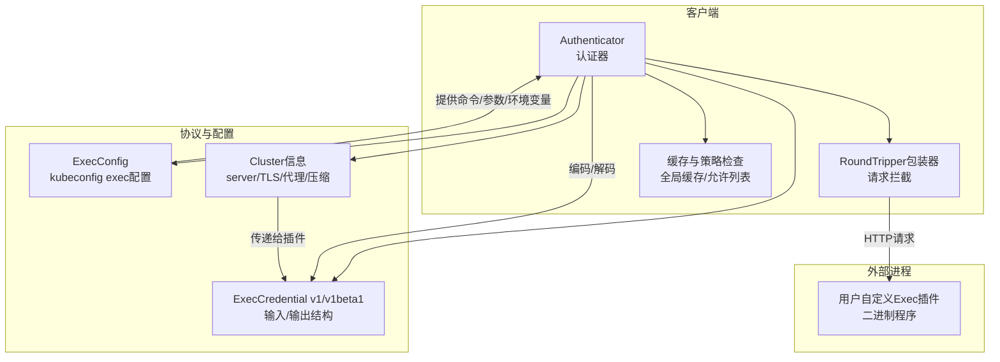
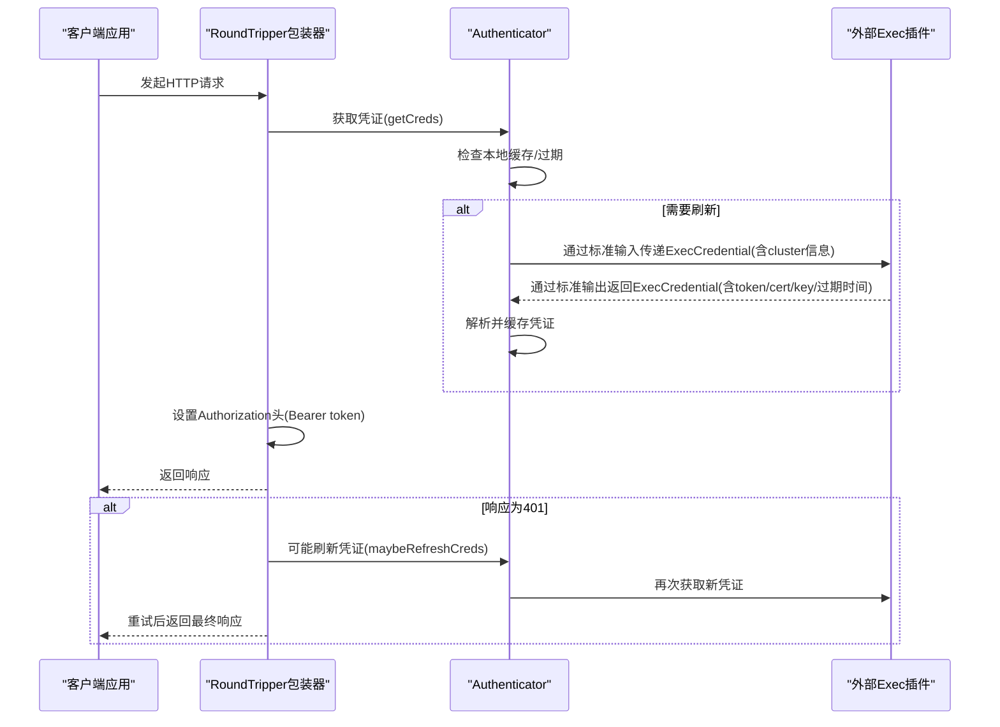
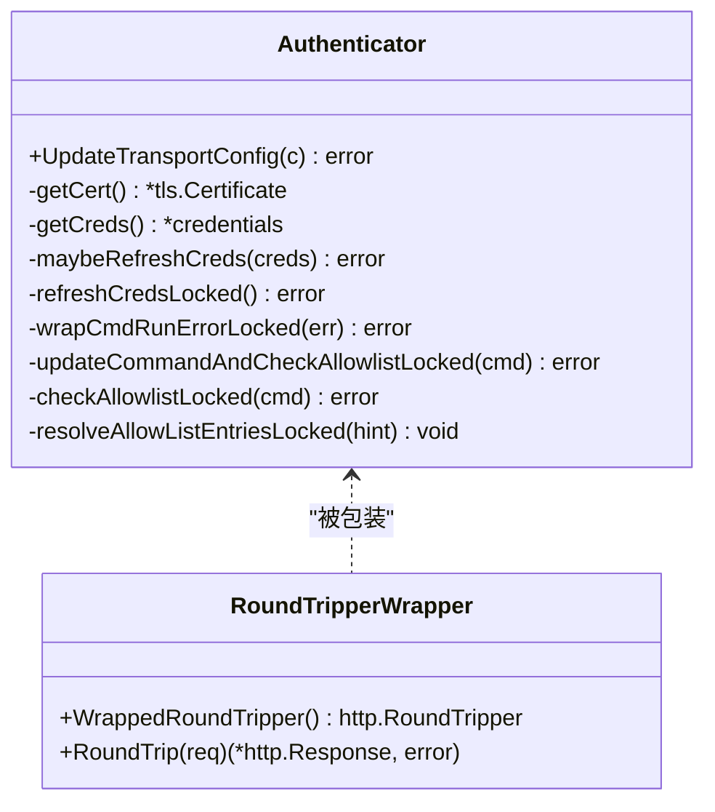
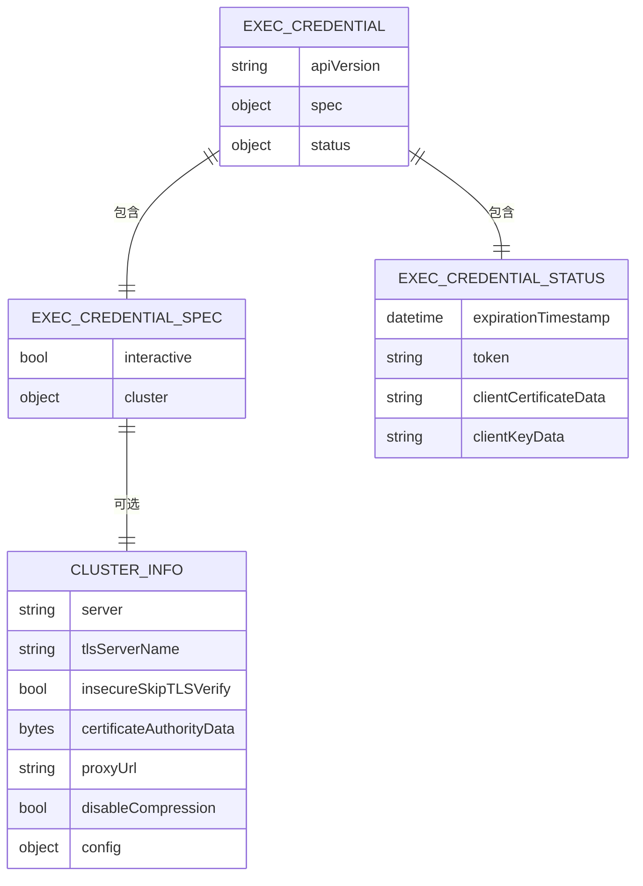
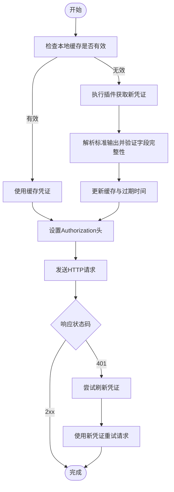
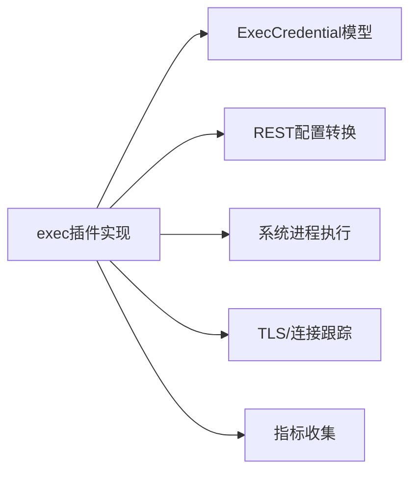

# Exec认证

<cite>
**本文引用的文件**   
- [exec.go](file://staging/src/k8s.io/client-go/plugin/pkg/client/auth/exec/exec.go)
- [exec.go](file://staging/src/k8s.io/client-go/rest/exec.go)
- [types.go](file://staging/src/k8s.io/client-go/pkg/apis/clientauthentication/v1/types.go)
- [types.go](file://staging/src/k8s.io/client-go/pkg/apis/clientauthentication/v1beta1/types.go)
- [types.go](file://staging/src/k8s.io/client-go/tools/clientcmd/api/types.go)
</cite>

## 目录
1. [简介](#简介)
2. [项目结构](#项目结构)
3. [核心组件](#核心组件)
4. [架构总览](#架构总览)
5. [详细组件分析](#详细组件分析)
6. [依赖分析](#依赖分析)
7. [性能考虑](#性能考虑)
8. [故障排查指南](#故障排查指南)
9. [结论](#结论)
10. [附录](#附录)

## 简介
本文件面向Kubernetes客户端侧的Exec认证插件机制，系统性阐述其工作原理、协议约定、错误处理与安全性，并提供自定义插件开发指南、kubeconfig配置要点、常见云厂商插件使用示例与性能优化建议。读者无需深入源码即可理解并安全高效地使用或扩展Exec认证能力。

## 项目结构
围绕Exec认证的关键代码主要分布在以下模块：
- 客户端认证执行器与传输层集成：位于client-go的exec插件实现与REST配置转换
- 认证数据模型：定义ExecCredential输入/输出结构与集群信息
- kubeconfig模型：定义ExecConfig等配置项，用于描述外部程序调用方式与环境变量

图表来源
- [exec.go:160-232](file://staging/src/k8s.io/client-go/plugin/pkg/client/auth/exec/exec.go#L160-L232)
- [exec.go:29-61](file://staging/src/k8s.io/client-go/rest/exec.go#L29-L61)
- [types.go:26-127](file://staging/src/k8s.io/client-go/pkg/apis/clientauthentication/v1/types.go#L26-L127)
- [types.go:204-291](file://staging/src/k8s.io/client-go/tools/clientcmd/api/types.go#L204-L291)

章节来源
- [exec.go:160-232](file://staging/src/k8s.io/client-go/plugin/pkg/client/auth/exec/exec.go#L160-L232)
- [exec.go:29-61](file://staging/src/k8s.io/client-go/rest/exec.go#L29-L61)
- [types.go:26-127](file://staging/src/k8s.io/client-go/pkg/apis/clientauthentication/v1/types.go#L26-L127)
- [types.go:204-291](file://staging/src/k8s.io/client-go/tools/clientcmd/api/types.go#L204-L291)

## 核心组件
- Authenticator（认证器）
  - 负责根据ExecConfig构造并缓存认证器实例，管理插件生命周期、交互式模式判断、证书/令牌缓存与刷新、连接跟踪与TLS回调注入。
- RoundTripper包装器
  - 在HTTP请求前注入Bearer Token；当收到401时触发可能的凭证刷新。
- 协议类型
  - ExecCredentialSpec/Status：定义传入插件的上下文与返回的凭证（token或mTLS证书对），支持过期时间。
- kubeconfig Exec配置
  - ExecConfig：指定command、args、env、apiVersion、interactiveMode、provideClusterInfo等。
- REST到集群信息转换
  - ConfigToExecCluster/ExecClusterToConfig：将REST配置转换为插件可消费的Cluster信息，反之亦然。

章节来源
- [exec.go:261-347](file://staging/src/k8s.io/client-go/plugin/pkg/client/auth/exec/exec.go#L261-L347)
- [exec.go:349-385](file://staging/src/k8s.io/client-go/plugin/pkg/client/auth/exec/exec.go#L349-L385)
- [types.go:26-127](file://staging/src/k8s.io/client-go/pkg/apis/clientauthentication/v1/types.go#L26-L127)
- [types.go:204-291](file://staging/src/k8s.io/client-go/tools/clientcmd/api/types.go#L204-L291)
- [exec.go:29-87](file://staging/src/k8s.io/client-go/rest/exec.go#L29-L87)

## 架构总览
下图展示一次典型认证流程：客户端发起请求→RoundTripper拦截→认证器获取凭证→必要时刷新→设置Authorization头→发送请求→若401则尝试刷新并重试。

图表来源
- [exec.go:349-385](file://staging/src/k8s.io/client-go/plugin/pkg/client/auth/exec/exec.go#L349-L385)
- [exec.go:402-543](file://staging/src/k8s.io/client-go/plugin/pkg/client/auth/exec/exec.go#L402-L543)
- [types.go:26-127](file://staging/src/k8s.io/client-go/pkg/apis/clientauthentication/v1/types.go#L26-L127)

## 详细组件分析

### 认证器(Authenticator)与传输层集成
- 初始化与缓存
  - 基于ExecConfig与Cluster信息生成唯一键，进行全局缓存，避免重复创建。
  - 校验API版本，建立连接跟踪器与默认Dialer，封装GetCert/Dial以支持TLS配置缓存。
- 交互式模式
  - 根据InteractiveMode与Stdin可用性决定是否需要交互；不支持时返回错误。
- 凭证获取与刷新
  - getCreds优先命中缓存；否则refreshCredsLocked执行插件，读取stdout并解析ExecCredential。
  - 支持token或mTLS证书对；证书旋转时会关闭旧连接并记录指标。
- 401自动重试
  - RoundTripper在收到401时调用maybeRefreshCreds，若凭证未变化则强制刷新并重试。
- 策略与白名单
  - 支持AllowAll/DenyAll/Allowlist三种策略；Allowlist会解析绝对路径并匹配。

图表来源
- [exec.go:261-347](file://staging/src/k8s.io/client-go/plugin/pkg/client/auth/exec/exec.go#L261-L347)
- [exec.go:349-385](file://staging/src/k8s.io/client-go/plugin/pkg/client/auth/exec/exec.go#L349-L385)
- [exec.go:402-543](file://staging/src/k8s.io/client-go/plugin/pkg/client/auth/exec/exec.go#L402-L543)
- [exec.go:577-659](file://staging/src/k8s.io/client-go/plugin/pkg/client/auth/exec/exec.go#L577-L659)

章节来源
- [exec.go:160-232](file://staging/src/k8s.io/client-go/plugin/pkg/client/auth/exec/exec.go#L160-L232)
- [exec.go:234-259](file://staging/src/k8s.io/client-go/plugin/pkg/client/auth/exec/exec.go#L234-L259)
- [exec.go:349-385](file://staging/src/k8s.io/client-go/plugin/pkg/client/auth/exec/exec.go#L349-L385)
- [exec.go:402-543](file://staging/src/k8s.io/client-go/plugin/pkg/client/auth/exec/exec.go#L402-L543)
- [exec.go:577-659](file://staging/src/k8s.io/client-go/plugin/pkg/client/auth/exec/exec.go#L577-L659)

### 协议与数据模型(ExecCredential)
- 输入(Spec)
  - Cluster：包含server、TLS服务器名、是否跳过校验、CA数据、代理URL、禁用压缩、以及按集群的额外配置。
  - Interactive：是否已传递stdin给插件。
- 输出(Status)
  - ExpirationTimestamp：凭证过期时间。
  - Token：Bearer令牌。
  - ClientCertificateData/ClientKeyData：PEM格式的证书与私钥（需成对出现）。
- 版本兼容
  - 同时支持v1与v1beta1，客户端会根据配置的APIVersion选择编解码器。

图表来源
- [types.go:26-127](file://staging/src/k8s.io/client-go/pkg/apis/clientauthentication/v1/types.go#L26-L127)
- [types.go:26-127](file://staging/src/k8s.io/client-go/pkg/apis/clientauthentication/v1beta1/types.go#L26-L127)

章节来源
- [types.go:26-127](file://staging/src/k8s.io/client-go/pkg/apis/clientauthentication/v1/types.go#L26-L127)
- [types.go:26-127](file://staging/src/k8s.io/client-go/pkg/apis/clientauthentication/v1beta1/types.go#L26-L127)

### kubeconfig中的Exec配置项
- ExecConfig关键字段
  - command：要执行的二进制路径
  - args：命令行参数数组
  - env：环境变量列表（与宿主环境合并）
  - apiVersion：期望的ExecCredential API版本
  - provideClusterInfo：是否将Cluster信息作为KUBERNETES_EXEC_INFO环境变量传给插件
  - interactiveMode：Never/IfAvailable/Always，控制stdin交互行为
  - installHint：当可执行文件缺失时的安装提示
- 交互模式语义
  - Never：从不使用stdin
  - IfAvailable：尽可能使用stdin（若可用）
  - Always：必须使用stdin，不可用时直接报错
- 插件策略
  - PolicyType：AllowAll/DenyAll/Allowlist
  - Allowlist：仅允许白名单中解析后的绝对路径执行

章节来源
- [types.go:204-291](file://staging/src/k8s.io/client-go/tools/clientcmd/api/types.go#L204-L291)
- [types.go:309-335](file://staging/src/k8s.io/client-go/tools/clientcmd/api/types.go#L309-L335)
- [types.go:371-389](file://staging/src/k8s.io/client-go/tools/clientcmd/api/types.go#L371-L389)

### REST到集群信息的转换
- ConfigToExecCluster：从REST配置提取Host、TLS、Proxy、DisableCompression等，构建Cluster对象供插件消费。
- ExecClusterToConfig：反向转换，便于插件内部复用或调试。

章节来源
- [exec.go:29-87](file://staging/src/k8s.io/client-go/rest/exec.go#L29-L87)

### 自定义Exec认证插件开发指南
- 语言与接口规范
  - 任意语言均可，只要遵循“标准输入/输出”协议：
    - 启动时从标准输入读取JSON序列化的ExecCredential（由客户端编码，包含spec.cluster与interactive标志）
    - 向标准输出写入JSON序列化的ExecCredential（包含status.token或status.clientCertificateData+status.clientKeyData，以及可选expirationTimestamp）
    - 退出码为0表示成功，非0表示失败
- 环境变量约定
  - KUBERNETES_EXEC_INFO：当provideClusterInfo为true时，客户端会将Cluster信息序列化后放入该环境变量
  - 其他自定义环境变量可通过ExecConfig.env注入
- 命令行参数约定
  - 通过ExecConfig.args传入，插件自行解析
- 动态令牌获取
  - 插件可从本地密钥存储、云厂商CLI或远程服务获取短期令牌，并在返回结构中设置expirationTimestamp
- 缓存机制
  - 客户端侧已内置凭证缓存与过期判断；插件也可在进程内维护短期缓存以减少外部调用
- 重试逻辑
  - 客户端在401时会自动尝试刷新；插件应保证幂等与快速失败，避免阻塞
- 交互式模式
  - 若interactiveMode=Always，插件必须能正确读取stdin；若为IfAvailable，应在无stdin时优雅降级
- 安全建议
  - 仅在内存中传递敏感字段（token、私钥），避免落盘
  - 严格限制插件二进制权限与路径，结合Allowlist策略
  - 谨慎使用installHint，避免泄露敏感信息

章节来源
- [exec.go:433-543](file://staging/src/k8s.io/client-go/plugin/pkg/client/auth/exec/exec.go#L433-L543)
- [types.go:26-127](file://staging/src/k8s.io/client-go/pkg/apis/clientauthentication/v1/types.go#L26-L127)
- [types.go:204-291](file://staging/src/k8s.io/client-go/tools/clientcmd/api/types.go#L204-L291)

### 流程图：凭证刷新与401重试

图表来源
- [exec.go:349-385](file://staging/src/k8s.io/client-go/plugin/pkg/client/auth/exec/exec.go#L349-L385)
- [exec.go:402-543](file://staging/src/k8s.io/client-go/plugin/pkg/client/auth/exec/exec.go#L402-L543)

## 依赖分析
- 组件耦合
  - Authenticator依赖REST配置转换、协议类型编解码、系统进程执行、TLS与连接跟踪
  - RoundTripper包装器与Authenticator紧密协作，负责请求级注入与401重试
- 外部依赖
  - 操作系统进程执行与I/O
  - TLS证书解析与连接跟踪
  - 指标收集（如证书旋转年龄）
- 潜在循环依赖
  - 当前实现无循环依赖；各模块职责清晰

图表来源
- [exec.go:160-232](file://staging/src/k8s.io/client-go/plugin/pkg/client/auth/exec/exec.go#L160-L232)
- [exec.go:29-61](file://staging/src/k8s.io/client-go/rest/exec.go#L29-L61)
- [types.go:26-127](file://staging/src/k8s.io/client-go/pkg/apis/clientauthentication/v1/types.go#L26-L127)

章节来源
- [exec.go:160-232](file://staging/src/k8s.io/client-go/plugin/pkg/client/auth/exec/exec.go#L160-L232)
- [exec.go:29-61](file://staging/src/k8s.io/client-go/rest/exec.go#L29-L61)
- [types.go:26-127](file://staging/src/k8s.io/client-go/pkg/apis/clientauthentication/v1/types.go#L26-L127)

## 性能考虑
- 凭证缓存
  - 客户端侧对Authenticator与TLS配置进行缓存，减少重复初始化与外部调用
- 连接跟踪与证书旋转
  - 证书变更时主动关闭旧连接，避免使用过期证书导致的握手失败
- 压缩开关
  - 通过DisableCompression可在大带宽场景下提升列表类请求性能
- 401重试
  - 仅在必要时刷新凭证，避免频繁调用外部插件
- 交互式开销
  - 尽量避免Always模式，降低终端交互带来的延迟

[本节为通用指导，不直接分析具体文件]

## 故障排查指南
- 可执行文件不存在
  - 错误信息会包含安装提示（installHint），请确认PATH与二进制权限
- 执行失败（非零退出码）
  - 检查插件日志与返回格式是否符合协议
- 缺少必要字段
  - 必须返回token或证书/私钥对；证书与私钥需同时存在
- 版本不匹配
  - 插件返回的API版本需与客户端配置一致
- 策略拒绝
  - 若启用Allowlist，确保插件路径在白名单中且可解析
- 交互模式错误
  - Always模式下若无stdin将直接报错；IfAvailable模式下注意stdin可用性

章节来源
- [exec.go:545-575](file://staging/src/k8s.io/client-go/plugin/pkg/client/auth/exec/exec.go#L545-L575)
- [exec.go:478-543](file://staging/src/k8s.io/client-go/plugin/pkg/client/auth/exec/exec.go#L478-L543)
- [exec.go:577-659](file://staging/src/k8s.io/client-go/plugin/pkg/client/auth/exec/exec.go#L577-L659)
- [exec.go:234-259](file://staging/src/k8s.io/client-go/plugin/pkg/client/auth/exec/exec.go#L234-L259)

## 结论
Exec认证插件通过标准化的输入/输出协议，将动态令牌或mTLS证书获取逻辑外置，既提升了灵活性又增强了安全性。客户端侧提供了完善的缓存、重试、策略与连接管理能力。开发者只需遵循协议约定与最佳实践，即可快速实现高性能、高可用的认证插件。

[本节为总结性内容，不直接分析具体文件]

## 附录

### kubeconfig中exec配置项速查
- command：必填，外部程序路径
- args：可选，命令行参数数组
- env：可选，环境变量列表（name/value）
- apiVersion：可选，期望的ExecCredential API版本（v1或v1beta1）
- provideClusterInfo：可选，是否将Cluster信息注入KUBERNETES_EXEC_INFO
- interactiveMode：可选（v1alpha1/v1beta1可缺省），Never/IfAvailable/Always
- installHint：可选，缺失可执行文件时的安装提示
- pluginPolicy：运行时策略（AllowAll/DenyAll/Allowlist），用于限制可执行插件

章节来源
- [types.go:204-291](file://staging/src/k8s.io/client-go/tools/clientcmd/api/types.go#L204-L291)
- [types.go:309-335](file://staging/src/k8s.io/client-go/tools/clientcmd/api/types.go#L309-L335)
- [types.go:371-389](file://staging/src/k8s.io/client-go/tools/clientcmd/api/types.go#L371-L389)

### 常见云提供商Exec插件使用示例
- AWS IAM OIDC Provider / STS
  - 使用aws-iam-authenticator或eksctl提供的exec插件，配置command为aws-iam-authenticator，args包含必要的region与role参数
- Google Cloud gke-gcloud-auth-plugin
  - 配置command为gke-gcloud-auth-plugin，args包含project/cluster名称，利用gcloud凭据链获取短期令牌
- Azure Kubernetes Service (AKS)
  - 使用az aks get-credentials配合Azure CLI的exec插件，command为az，args包含订阅与资源组信息
- Alibaba Cloud ACK
  - 使用阿里云提供的exec插件，command为aliyun-ack-kubeconfig，args包含地域与角色信息

[本节为概念性示例，不直接分析具体文件]