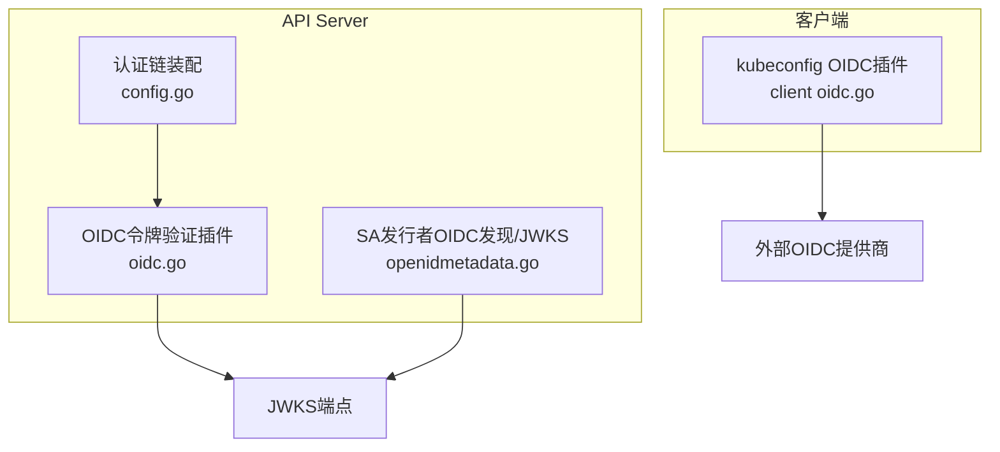
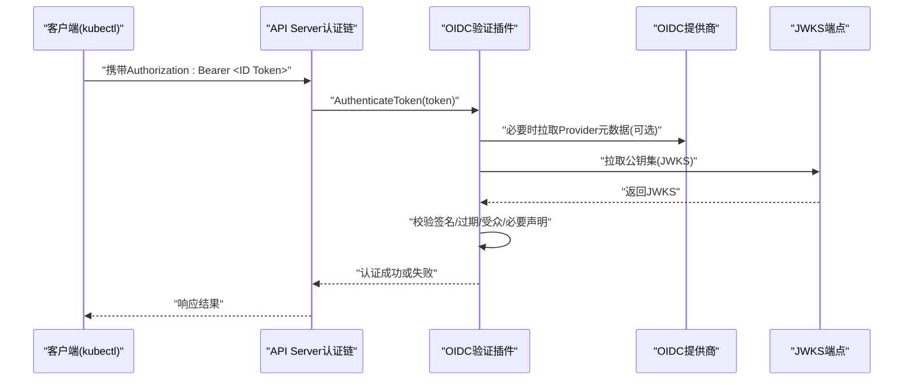
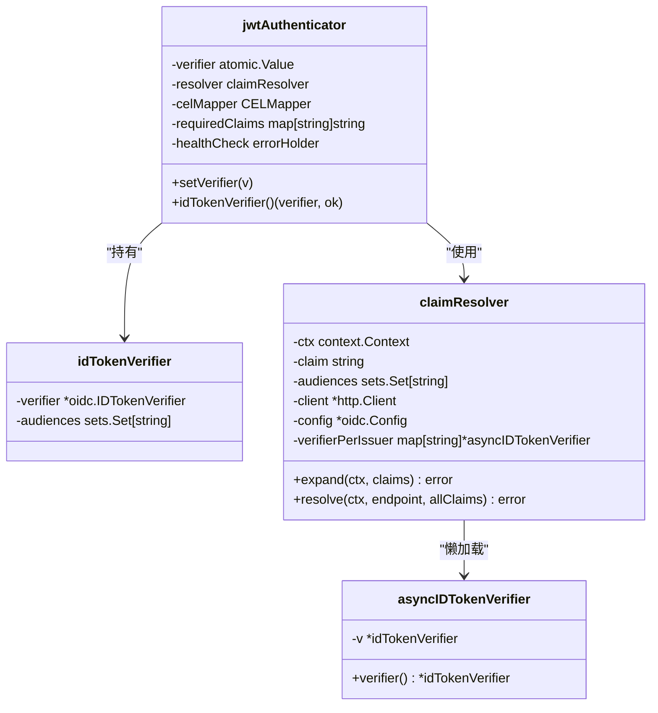
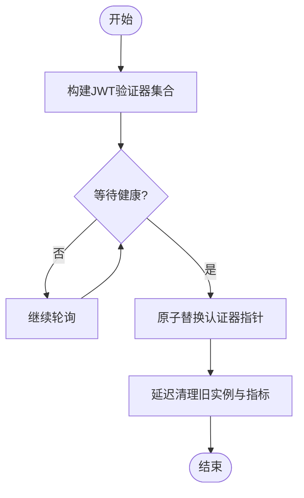
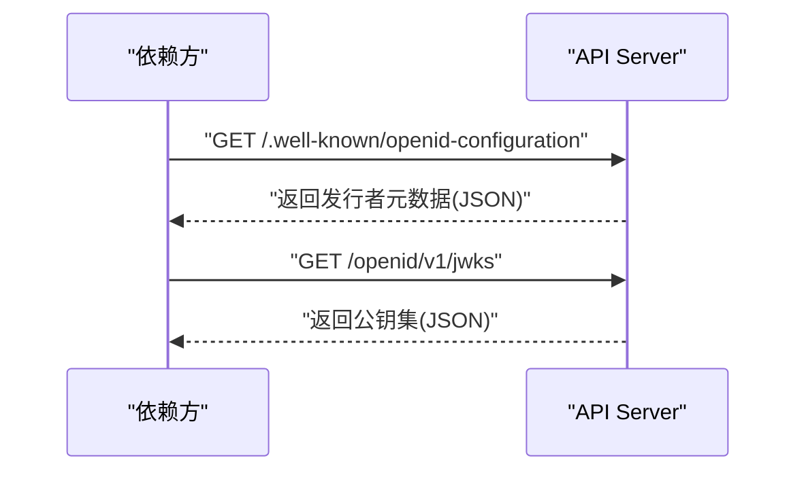
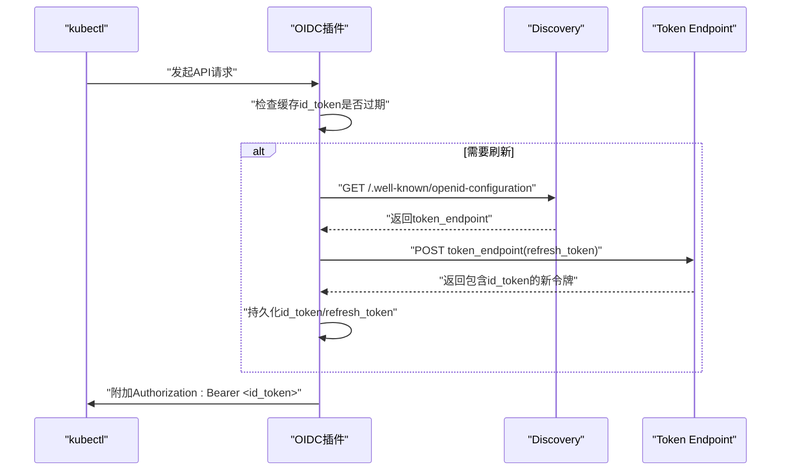
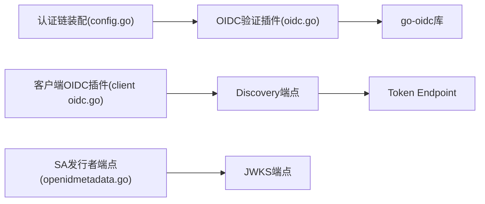

# OIDC认证

<cite>
**本文引用的文件**   
- [oidc.go](file://staging/src/k8s.io/apiserver/plugin/pkg/authenticator/token/oidc/oidc.go)
- [config.go](file://pkg/kubeapiserver/authenticator/config.go)
- [openidmetadata.go](file://pkg/serviceaccount/openidmetadata.go)
- [oidc_test.go](file://test/integration/apiserver/oidc/oidc_test.go)
- [client oidc.go](file://staging/src/k8s.io/client-go/plugin/pkg/client/auth/oidc/oidc.go)
</cite>

## 目录
1. [简介](#简介)
2. [项目结构](#项目结构)
3. [核心组件](#核心组件)
4. [架构总览](#架构总览)
5. [详细组件分析](#详细组件分析)
6. [依赖关系分析](#依赖关系分析)
7. [性能考虑](#性能考虑)
8. [故障排查指南](#故障排查指南)
9. [结论](#结论)
10. [附录](#附录)

## 简介
本文件面向在Kubernetes中集成OpenID Connect（OIDC）的工程师与运维人员，系统性阐述API Server侧对OIDC ID Token的验证流程、客户端侧令牌刷新机制、以及与服务账户发行者相关的OIDC发现端点。文档覆盖以下主题：
- API Server如何验证外部OIDC提供商签发的ID Token
- 客户端如何通过kubeconfig中的OIDC插件自动刷新ID Token
- 服务账户发行者的OIDC发现与JWKS端点
- 配置要点与安全建议（签名算法、受众校验、网络出口等）
- 常见集成场景与排错思路

说明：
- 本文聚焦于“服务端验证ID Token”和“客户端刷新ID Token”的实现细节；授权码/隐式流程属于客户端登录交互范畴，不在API Server代码路径内实现，但可通过客户端插件完成。
- 所有技术细节均基于仓库源码进行分析与归纳。

## 项目结构
与OIDC相关的关键位置如下：
- API Server OIDC令牌验证插件：staging/src/k8s.io/apiserver/plugin/pkg/authenticator/token/oidc/oidc.go
- API Server认证链组装与动态更新：pkg/kubeapiserver/authenticator/config.go
- 服务账户发行者OIDC发现与JWKS：pkg/serviceaccount/openidmetadata.go
- 客户端OIDC插件（kubeconfig id-token刷新）：staging/src/k8s.io/client-go/plugin/pkg/client/auth/oidc/oidc.go
- 端到端集成测试用例：test/integration/apiserver/oidc/oidc_test.go

图表来源
- [config.go:107-249](file://pkg/kubeapiserver/authenticator/config.go#L107-L249)
- [oidc.go:264-471](file://staging/src/k8s.io/apiserver/plugin/pkg/authenticator/token/oidc/oidc.go#L264-L471)
- [openidmetadata.go:50-196](file://pkg/serviceaccount/openidmetadata.go#L50-L196)
- [client oidc.go:111-162](file://staging/src/k8s.io/client-go/plugin/pkg/client/auth/oidc/oidc.go#L111-L162)

章节来源
- [config.go:107-249](file://pkg/kubeapiserver/authenticator/config.go#L107-L249)
- [oidc.go:264-471](file://staging/src/k8s.io/apiserver/plugin/pkg/authenticator/token/oidc/oidc.go#L264-L471)
- [openidmetadata.go:50-196](file://pkg/serviceaccount/openidmetadata.go#L50-L196)
- [client oidc.go:111-162](file://staging/src/k8s.io/client-go/plugin/pkg/client/auth/oidc/oidc.go#L111-L162)

## 核心组件
- OIDC令牌验证插件（服务端）
  - 负责从外部OIDC提供商异步初始化ID Token验证器，支持自定义CA、出站选择器、签名算法白名单、受众校验、分布式声明扩展等。
  - 提供健康检查能力，便于配置热更新时等待就绪。
- 认证链装配（服务端）
  - 将OIDC JWT验证器接入Bearer Token认证链，并支持按AuthenticationConfiguration动态替换JWT验证器集合。
- 服务账户发行者OIDC发现（服务端）
  - 暴露/.well-known/openid-configuration与/openid/v1/jwks，供依赖方验证SA令牌。
- kubeconfig OIDC插件（客户端）
  - 读取idp-issuer-url、client-id、client-secret、id-token、refresh-token等字段，通过Discovery获取token_endpoint，使用refresh_token换取新的id_token并持久化到kubeconfig。

章节来源
- [oidc.go:264-471](file://staging/src/k8s.io/apiserver/plugin/pkg/authenticator/token/oidc/oidc.go#L264-L471)
- [config.go:160-249](file://pkg/kubeapiserver/authenticator/config.go#L160-L249)
- [openidmetadata.go:50-196](file://pkg/serviceaccount/openidmetadata.go#L50-L196)
- [client oidc.go:111-162](file://staging/src/k8s.io/client-go/plugin/pkg/client/auth/oidc/oidc.go#L111-L162)

## 架构总览
下图展示了请求进入API Server后，OIDC认证在主链中的位置与关键交互。

图表来源
- [config.go:160-249](file://pkg/kubeapiserver/authenticator/config.go#L160-L249)
- [oidc.go:264-471](file://staging/src/k8s.io/apiserver/plugin/pkg/authenticator/token/oidc/oidc.go#L264-L471)

## 详细组件分析

### 组件A：OIDC令牌验证插件（服务端）
职责
- 根据配置创建并缓存ID Token验证器，支持异步初始化与JWKS指标采集。
- 支持自定义CA、出站选择器、签名算法白名单、受众校验、分布式声明解析。
- 提供HealthCheck用于健康探测与配置热更新等待。

关键设计点
- 异步初始化：若未提供KeySet，则后台轮询初始化Provider与Verifier，避免启动阻塞。
- 受众校验：当配置多个audiences时，跳过库级client_id检查，本地进行aud校验。
- 出站控制：支持EgressSelector以控制访问外部OIDC的网络路径。
- 指标采集：可选择为JWKS拉取增加指标记录。
- 分布式声明：支持_claim_names/_claim_sources扩展，按需拉取远程声明。

图表来源
- [oidc.go:199-241](file://staging/src/k8s.io/apiserver/plugin/pkg/authenticator/token/oidc/oidc.go#L199-L241)
- [oidc.go:144-190](file://staging/src/k8s.io/apiserver/plugin/pkg/authenticator/token/oidc/oidc.go#L144-L190)
- [oidc.go:664-800](file://staging/src/k8s.io/apiserver/plugin/pkg/authenticator/token/oidc/oidc.go#L664-L800)

章节来源
- [oidc.go:264-471](file://staging/src/k8s.io/apiserver/plugin/pkg/authenticator/token/oidc/oidc.go#L264-L471)
- [oidc.go:199-241](file://staging/src/k8s.io/apiserver/plugin/pkg/authenticator/token/oidc/oidc.go#L199-L241)
- [oidc.go:144-190](file://staging/src/k8s.io/apiserver/plugin/pkg/authenticator/token/oidc/oidc.go#L144-L190)
- [oidc.go:664-800](file://staging/src/k8s.io/apiserver/plugin/pkg/authenticator/token/oidc/oidc.go#L664-L800)

### 组件B：认证链装配与动态更新（服务端）
职责
- 将OIDC JWT验证器加入Bearer Token认证链。
- 支持基于AuthenticationConfiguration的热更新，并在切换前等待新实例健康。

关键设计点
- 顺序策略：将OIDC置于Service Account之后，避免不必要的远程键拉取导致缓存失效。
- 健康等待：热更新时轮询新实例HealthCheck，成功后原子替换旧实例。
- 指标清理：移除不再使用的issuer对应指标。

图表来源
- [config.go:257-367](file://pkg/kubeapiserver/authenticator/config.go#L257-L367)

章节来源
- [config.go:160-249](file://pkg/kubeapiserver/authenticator/config.go#L160-L249)
- [config.go:257-367](file://pkg/kubeapiserver/authenticator/config.go#L257-L367)

### 组件C：服务账户发行者OIDC发现与JWKS（服务端）
职责
- 提供/.well-known/openid-configuration与/openid/v1/jwks，描述SA发行者支持的算法与公钥集。

关键设计点
- 强制HTTPS与URL约束：issuer URL必须为https且不含查询/片段。
- 自动生成jwks_uri：可由默认外部地址拼接路径生成。
- 动态更新：监听公钥变化，重新渲染配置与JWKS。

图表来源
- [openidmetadata.go:50-196](file://pkg/serviceaccount/openidmetadata.go#L50-L196)

章节来源
- [openidmetadata.go:50-196](file://pkg/serviceaccount/openidmetadata.go#L50-L196)

### 组件D：kubeconfig OIDC插件（客户端）
职责
- 从kubeconfig读取OIDC参数，自动刷新id_token并写入文件。
- 通过Discovery获取token_endpoint，使用refresh_token换取新id_token。

关键设计点
- 缓存：按clusterAddress+issuerURL+clientID缓存provider实例，避免并发重复刷新。
- 持久化：刷新成功后写回id_token与可能的refresh_token。
- 错误处理：无refresh_token或响应缺少id_token时明确报错。

图表来源
- [client oidc.go:111-162](file://staging/src/k8s.io/client-go/plugin/pkg/client/auth/oidc/oidc.go#L111-L162)
- [client oidc.go:196-288](file://staging/src/k8s.io/client-go/plugin/pkg/client/auth/oidc/oidc.go#L196-L288)
- [client oidc.go:293-331](file://staging/src/k8s.io/client-go/plugin/pkg/client/auth/oidc/oidc.go#L293-L331)

章节来源
- [client oidc.go:111-162](file://staging/src/k8s.io/client-go/plugin/pkg/client/auth/oidc/oidc.go#L111-L162)
- [client oidc.go:196-288](file://staging/src/k8s.io/client-go/plugin/pkg/client/auth/oidc/oidc.go#L196-L288)
- [client oidc.go:293-331](file://staging/src/k8s.io/client-go/plugin/pkg/client/auth/oidc/oidc.go#L293-L331)

## 依赖关系分析
- API Server认证链依赖OIDC插件进行JWT验证。
- OIDC插件依赖go-oidc库进行Provider发现与JWKS拉取。
- 客户端插件依赖oauth2库与Discovery端点完成刷新。
- 服务账户发行者端点由API Server内部提供，供外部依赖方验证SA令牌。

图表来源
- [config.go:160-249](file://pkg/kubeapiserver/authenticator/config.go#L160-L249)
- [oidc.go:264-471](file://staging/src/k8s.io/apiserver/plugin/pkg/authenticator/token/oidc/oidc.go#L264-L471)
- [client oidc.go:111-162](file://staging/src/k8s.io/client-go/plugin/pkg/client/auth/oidc/oidc.go#L111-L162)
- [openidmetadata.go:50-196](file://pkg/serviceaccount/openidmetadata.go#L50-L196)

章节来源
- [config.go:160-249](file://pkg/kubeapiserver/authenticator/config.go#L160-L249)
- [oidc.go:264-471](file://staging/src/k8s.io/apiserver/plugin/pkg/authenticator/token/oidc/oidc.go#L264-L471)
- [client oidc.go:111-162](file://staging/src/k8s.io/client-go/plugin/pkg/client/auth/oidc/oidc.go#L111-L162)
- [openidmetadata.go:50-196](file://pkg/serviceaccount/openidmetadata.go#L50-L196)

## 性能考虑
- 异步初始化：OIDC插件后台轮询初始化，避免启动阻塞与首次请求抖动。
- 健康等待：配置热更新时等待新实例健康后再替换，降低切换风险。
- 指标采集：可选为JWKS拉取增加指标，便于监控与定位问题。
- 客户端缓存：按issuer与clientID缓存provider实例，减少并发刷新风暴。

[本节为通用指导，不直接分析具体文件]

## 故障排查指南
常见问题与定位要点：
- 无法连接外部OIDC提供商
  - 检查网络出口配置（EgressSelector）、自定义CA、超时设置。
  - 参考插件初始化与RoundTripper构造逻辑。
- JWKS拉取失败或格式异常
  - 关注指标记录与错误日志，确认jwks_uri可达且返回合法JSON。
- 多受众（audiences）校验失败
  - 确认配置的audiences与ID Token中aud一致；多audience时需跳过库级client_id检查。
- 客户端刷新失败
  - 确认kubeconfig中存在refresh_token且token_endpoint可用；部分提供商刷新响应可能不包含id_token，需确保请求了openid scope。
- 配置热更新卡住
  - 观察新实例HealthCheck是否成功；必要时缩短轮询间隔或检查后端可用性。

章节来源
- [oidc.go:264-471](file://staging/src/k8s.io/apiserver/plugin/pkg/authenticator/token/oidc/oidc.go#L264-L471)
- [client oidc.go:196-288](file://staging/src/k8s.io/client-go/plugin/pkg/client/auth/oidc/oidc.go#L196-L288)
- [client oidc.go:293-331](file://staging/src/k8s.io/client-go/plugin/pkg/client/auth/oidc/oidc.go#L293-L331)

## 结论
Kubernetes在API Server侧实现了健壮的OIDC ID Token验证能力，支持异步初始化、动态配置更新、出站控制与指标观测；客户端侧通过kubeconfig OIDC插件简化了令牌生命周期管理。结合服务账户发行者的OIDC发现与JWKS端点，可形成完整的身份与权限闭环。生产部署应重点关注签名算法白名单、受众校验、网络连通性与健康探测。

[本节为总结性内容，不直接分析具体文件]

## 附录

### 配置要点速查（服务端）
- 启用OIDC验证
  - 通过AuthenticationConfiguration定义jwt列表，指定issuer.url、audiences、certificateAuthority等。
  - 支持discovery_url重写、egress_selector_type、supported_signing_algs等。
- 健康检查
  - 使用插件提供的HealthCheck方法判断是否就绪。
- 指标
  - 可选择开启JWKS拉取指标以便监控。

章节来源
- [config.go:160-249](file://pkg/kubeapiserver/authenticator/config.go#L160-L249)
- [oidc.go:264-471](file://staging/src/k8s.io/apiserver/plugin/pkg/authenticator/token/oidc/oidc.go#L264-L471)

### 配置要点速查（客户端）
- kubeconfig字段
  - idp-issuer-url、client-id、client-secret、id-token、refresh-token、idp-certificate-authority-data等。
- 行为
  - 自动通过Discovery获取token_endpoint并使用refresh_token刷新id_token。
  - 刷新成功后持久化到kubeconfig。

章节来源
- [client oidc.go:111-162](file://staging/src/k8s.io/client-go/plugin/pkg/client/auth/oidc/oidc.go#L111-L162)
- [client oidc.go:196-288](file://staging/src/k8s.io/client-go/plugin/pkg/client/auth/oidc/oidc.go#L196-L288)
- [client oidc.go:293-331](file://staging/src/k8s.io/client-go/plugin/pkg/client/auth/oidc/oidc.go#L293-L331)

### 集成示例参考（测试）
- 集成测试覆盖了两种模式：
  - 使用命令行参数方式配置OIDC
  - 使用AuthenticationConfiguration YAML方式配置OIDC
- 测试中包含最小有效ID Token声明、RBAC绑定、刷新流程等场景。

章节来源
- [oidc_test.go:131-200](file://test/integration/apiserver/oidc/oidc_test.go#L131-L200)