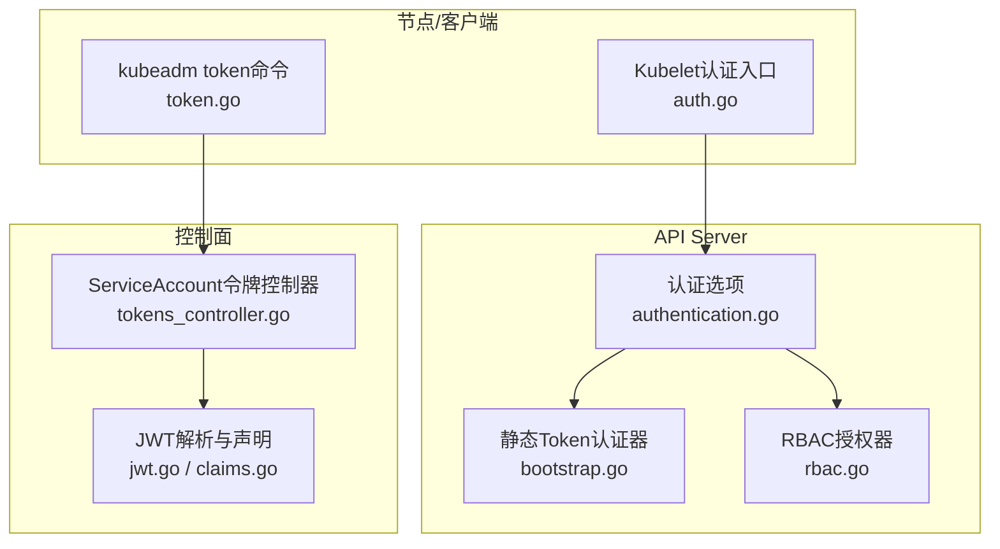
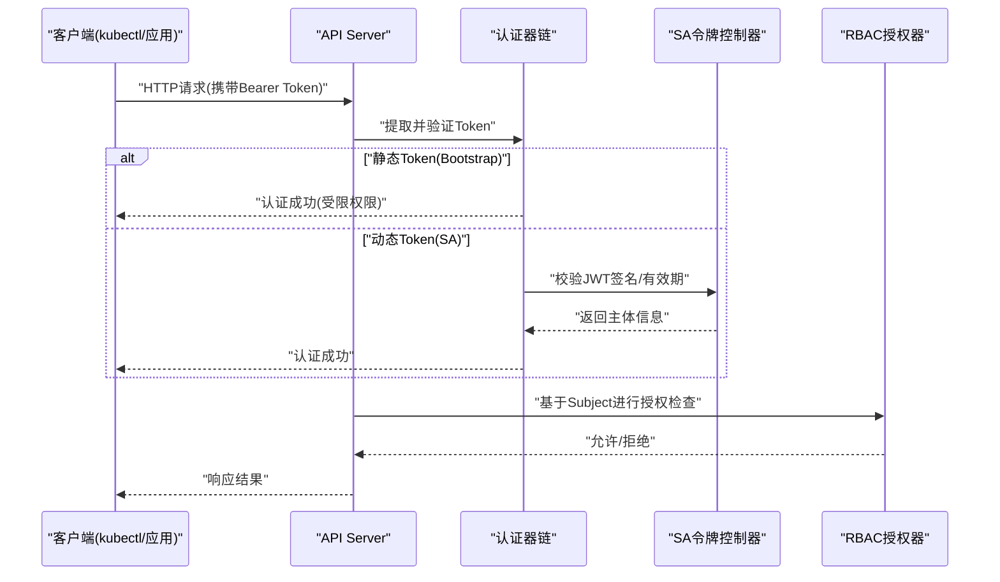
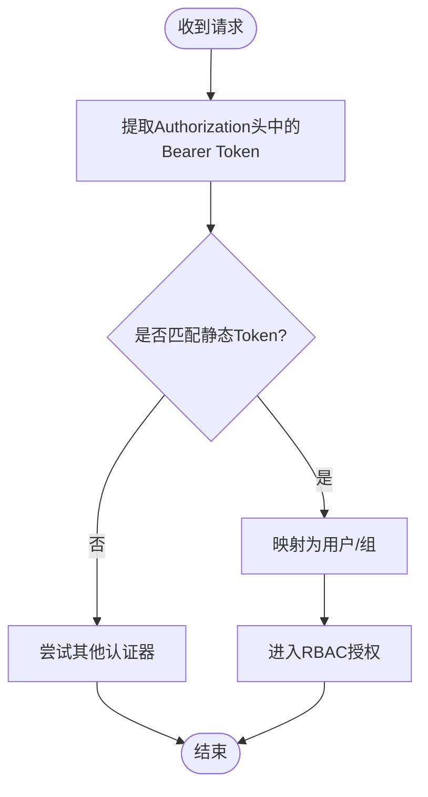
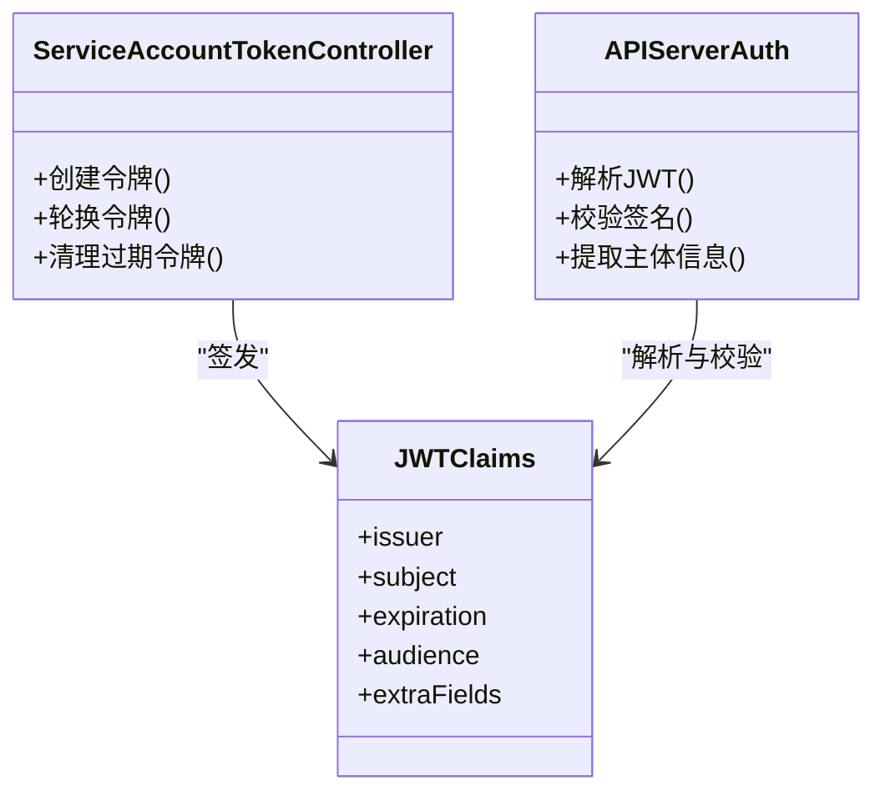
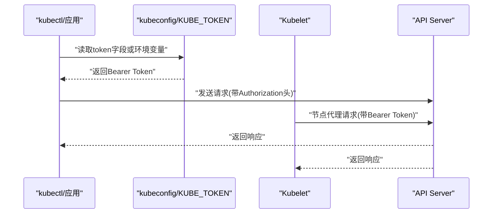
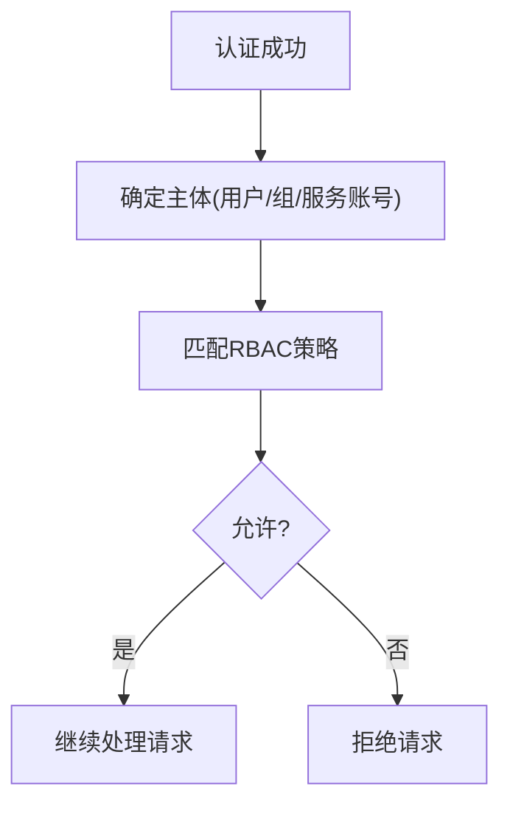
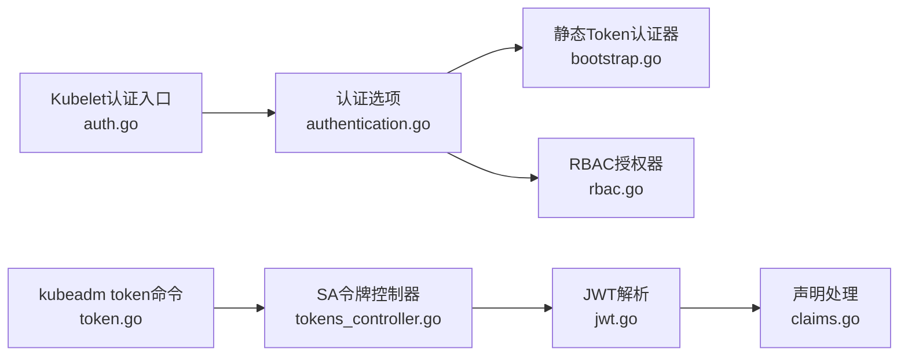

# Token认证

<cite>
**本文引用的文件**   
- [authentication.go](file://pkg/kubeapiserver/options/authentication.go)
- [bootstrap.go](file://plugin/pkg/auth/authenticator/token/bootstrap/bootstrap.go)
- [token_manager.go](file://pkg/kubelet/token/token_manager.go)
- [tokens_controller.go](file://pkg/controller/serviceaccount/tokens_controller.go)
- [jwt.go](file://pkg/serviceaccount/jwt.go)
- [claims.go](file://pkg/serviceaccount/claims.go)
- [rbac.go](file://plugin/pkg/auth/authorizer/rbac/rbac.go)
- [auth.go](file://cmd/kubelet/app/auth.go)
- [token.go](file://cmd/kubeadm/app/cmd/token.go)
</cite>

## 目录
1. [简介](#简介)
2. [项目结构](#项目结构)
3. [核心组件](#核心组件)
4. [架构总览](#架构总览)
5. [详细组件分析](#详细组件分析)
6. [依赖关系分析](#依赖关系分析)
7. [性能考虑](#性能考虑)
8. [故障排查指南](#故障排查指南)
9. [结论](#结论)
10. [附录](#附录)

## 简介
本文件面向Kubernetes Token认证机制，系统性阐述静态Token与动态Token的实现原理、Bearer Token传递方式、生命周期管理、安全考量以及与RBAC的集成。文档同时覆盖kubeconfig中token字段的配置方法、通过环境变量KUBE_TOKEN进行认证的方式、Token刷新与安全存储最佳实践，并提供性能优化建议与故障排查指引。

## 项目结构
围绕Token认证的关键代码分布在以下模块：
- API Server端认证选项与插件装配
- 静态Token（Bootstrap）认证器
- ServiceAccount令牌控制器与签发
- JWT解析与声明处理
- Kubelet侧认证入口与环境变量支持
- kubeadm工具中的Token子命令

图表来源
- [authentication.go:1-200](file://pkg/kubeapiserver/options/authentication.go#L1-200)
- [bootstrap.go:1-200](file://plugin/pkg/auth/authenticator/token/bootstrap/bootstrap.go#L1-200)
- [rbac.go:1-200](file://plugin/pkg/auth/authorizer/rbac/rbac.go#L1-200)
- [tokens_controller.go:1-200](file://pkg/controller/serviceaccount/tokens_controller.go#L1-200)
- [jwt.go:1-200](file://pkg/serviceaccount/jwt.go#L1-200)
- [claims.go:1-200](file://pkg/serviceaccount/claims.go#L1-200)
- [auth.go:1-200](file://cmd/kubelet/app/auth.go#L1-200)
- [token.go:1-200](file://cmd/kubeadm/app/cmd/token.go#L1-200)

章节来源
- [authentication.go:1-200](file://pkg/kubeapiserver/options/authentication.go#L1-200)
- [bootstrap.go:1-200](file://plugin/pkg/auth/authenticator/token/bootstrap/bootstrap.go#L1-200)
- [tokens_controller.go:1-200](file://pkg/controller/serviceaccount/tokens_controller.go#L1-200)
- [jwt.go:1-200](file://pkg/serviceaccount/jwt.go#L1-200)
- [claims.go:1-200](file://pkg/serviceaccount/claims.go#L1-200)
- [rbac.go:1-200](file://plugin/pkg/auth/authorizer/rbac/rbac.go#L1-200)
- [auth.go:1-200](file://cmd/kubelet/app/auth.go#L1-200)
- [token.go:1-200](file://cmd/kubeadm/app/cmd/token.go#L1-200)

## 核心组件
- 静态Token认证（Bootstrap Token）
  - 用于集群初始化或引导阶段，提供最小权限的临时身份。
  - 由API Server的静态Token认证器负责校验。
- 动态Token（ServiceAccount Token）
  - 由ServiceAccount令牌控制器自动签发和管理，支持短期令牌与自动轮换。
  - 以JWT形式存在，包含标准声明与扩展字段。
- Bearer Token传递
  - HTTP请求头Authorization: Bearer <token>。
  - kubeconfig中可通过token字段或KUBE_TOKEN环境变量注入。
- RBAC集成
  - 认证通过后进入授权阶段，由RBAC根据Subject（用户/组/服务账号）判定访问权限。

章节来源
- [bootstrap.go:1-200](file://plugin/pkg/auth/authenticator/token/bootstrap/bootstrap.go#L1-200)
- [tokens_controller.go:1-200](file://pkg/controller/serviceaccount/tokens_controller.go#L1-200)
- [jwt.go:1-200](file://pkg/serviceaccount/jwt.go#L1-200)
- [claims.go:1-200](file://pkg/serviceaccount/claims.go#L1-200)
- [rbac.go:1-200](file://plugin/pkg/auth/authorizer/rbac/rbac.go#L1-200)

## 架构总览
下图展示从客户端发起请求到鉴权决策的整体流程，涵盖静态与动态两种Token路径。

图表来源
- [authentication.go:1-200](file://pkg/kubeapiserver/options/authentication.go#L1-200)
- [bootstrap.go:1-200](file://plugin/pkg/auth/authenticator/token/bootstrap/bootstrap.go#L1-200)
- [tokens_controller.go:1-200](file://pkg/controller/serviceaccount/tokens_controller.go#L1-200)
- [rbac.go:1-200](file://plugin/pkg/auth/authorizer/rbac/rbac.go#L1-200)

## 详细组件分析

### 静态Token认证（Bootstrap Token）
- 作用与场景
  - 在集群初始化和引导阶段使用，提供最小权限身份，避免循环依赖。
- 实现要点
  - 由静态Token认证器加载并校验预置的Token列表。
  - 认证成功后映射为特定用户/组，后续交由RBAC决定具体权限。
- 安全考虑
  - 仅用于引导，应严格限制其用途与生命周期。
  - 生产环境不建议长期启用或扩大其权限范围。

图表来源
- [bootstrap.go:1-200](file://plugin/pkg/auth/authenticator/token/bootstrap/bootstrap.go#L1-200)
- [rbac.go:1-200](file://plugin/pkg/auth/authorizer/rbac/rbac.go#L1-200)

章节来源
- [bootstrap.go:1-200](file://plugin/pkg/auth/authenticator/token/bootstrap/bootstrap.go#L1-200)

### 动态Token认证（ServiceAccount Token）
- 签发与管理
  - ServiceAccount令牌控制器负责为ServiceAccount创建和轮换Token。
  - 默认支持短期JWT令牌，减少泄露风险。
- 结构与校验
  - 令牌为JWT格式，包含标准声明（如iss、sub、exp等）及Kubernetes扩展字段。
  - API Server使用公钥策略校验签名与有效期。
- 生命周期
  - 自动轮换：控制器定期生成新令牌并更新挂载卷或Secret。
  - 过期清理：过期令牌不再被接受，但历史数据保留策略受配置影响。

图表来源
- [tokens_controller.go:1-200](file://pkg/controller/serviceaccount/tokens_controller.go#L1-200)
- [jwt.go:1-200](file://pkg/serviceaccount/jwt.go#L1-200)
- [claims.go:1-200](file://pkg/serviceaccount/claims.go#L1-200)

章节来源
- [tokens_controller.go:1-200](file://pkg/controller/serviceaccount/tokens_controller.go#L1-200)
- [jwt.go:1-200](file://pkg/serviceaccount/jwt.go#L1-200)
- [claims.go:1-200](file://pkg/serviceaccount/claims.go#L1-200)

### Bearer Token传递机制
- 传输方式
  - 客户端在HTTP请求头中设置Authorization: Bearer <token>。
- kubeconfig配置
  - 在对应用户的credentials下设置token字段，kubectl会自动附加到请求头。
- 环境变量
  - 通过KUBE_TOKEN可注入当前会话的Token，优先级通常高于配置文件。
- Kubelet侧
  - Kubelet启动时读取认证配置，支持从文件或环境变量获取Token。

图表来源
- [authentication.go:1-200](file://pkg/kubeapiserver/options/authentication.go#L1-200)
- [auth.go:1-200](file://cmd/kubelet/app/auth.go#L1-200)

章节来源
- [authentication.go:1-200](file://pkg/kubeapiserver/options/authentication.go#L1-200)
- [auth.go:1-200](file://cmd/kubelet/app/auth.go#L1-200)

### Token与RBAC集成
- 认证后主体
  - 静态Token映射为特定用户/组；动态Token映射为服务账号主体。
- 授权决策
  - RBAC根据Role/ClusterRole、Binding以及资源规则判断是否允许操作。
- 审计与日志
  - 授权结果记录于审计日志，便于追踪与合规。

图表来源
- [rbac.go:1-200](file://plugin/pkg/auth/authorizer/rbac/rbac.go#L1-200)

章节来源
- [rbac.go:1-200](file://plugin/pkg/auth/authorizer/rbac/rbac.go#L1-200)

### kubeadm中的Token子命令
- 功能概述
  - 提供创建、列出、删除Bootstrap Token的能力，常用于集群初始化与节点加入。
- 典型用法
  - 创建一次性或长期有效的引导令牌。
  - 配合kubelet使用，完成节点引导流程。

章节来源
- [token.go:1-200](file://cmd/kubeadm/app/cmd/token.go#L1-200)

## 依赖关系分析
- 组件耦合
  - API Server认证选项聚合多种认证器（含静态Token）。
  - 动态Token依赖ServiceAccount控制器与JWT解析。
  - 授权统一由RBAC处理，形成“认证→授权”的清晰分层。
- 外部依赖
  - JWT库用于签名校验与声明解析。
  - 存储后端保存ServiceAccount及其令牌元数据。

图表来源
- [authentication.go:1-200](file://pkg/kubeapiserver/options/authentication.go#L1-200)
- [bootstrap.go:1-200](file://plugin/pkg/auth/authenticator/token/bootstrap/bootstrap.go#L1-200)
- [rbac.go:1-200](file://plugin/pkg/auth/authorizer/rbac/rbac.go#L1-200)
- [tokens_controller.go:1-200](file://pkg/controller/serviceaccount/tokens_controller.go#L1-200)
- [jwt.go:1-200](file://pkg/serviceaccount/jwt.go#L1-200)
- [claims.go:1-200](file://pkg/serviceaccount/claims.go#L1-200)
- [auth.go:1-200](file://cmd/kubelet/app/auth.go#L1-200)
- [token.go:1-200](file://cmd/kubeadm/app/cmd/token.go#L1-200)

章节来源
- [authentication.go:1-200](file://pkg/kubeapiserver/options/authentication.go#L1-200)
- [tokens_controller.go:1-200](file://pkg/controller/serviceaccount/tokens_controller.go#L1-200)
- [jwt.go:1-200](file://pkg/serviceaccount/jwt.go#L1-200)
- [claims.go:1-200](file://pkg/serviceaccount/claims.go#L1-200)
- [rbac.go:1-200](file://plugin/pkg/auth/authorizer/rbac/rbac.go#L1-200)
- [auth.go:1-200](file://cmd/kubelet/app/auth.go#L1-200)
- [token.go:1-200](file://cmd/kubeadm/app/cmd/token.go#L1-200)

## 性能考虑
- 认证路径选择
  - 优先启用动态Token（JWT），利用短生命周期降低泄露风险与批量失效成本。
- 缓存与复用
  - 客户端侧缓存有效Token，避免频繁重新获取；合理设置刷新窗口。
- 令牌大小与网络开销
  - JWT体积较小，但仍需关注高频调用下的带宽占用，必要时合并请求或使用批处理接口。
- 授权计算
  - RBAC策略尽量精简，避免过度复杂的规则导致授权延迟。
- 监控与指标
  - 关注认证失败率、平均耗时、令牌刷新频率等关键指标，定位瓶颈。

[本节为通用指导，不直接分析具体文件]

## 故障排查指南
- 常见错误
  - 401未认证：检查Authorization头是否正确携带Bearer Token；确认kubeconfig或KUBE_TOKEN配置。
  - 403禁止访问：确认RBAC策略是否授予相应权限；核对主体映射是否正确。
  - 令牌过期：触发自动刷新或手动轮换；检查系统时钟同步。
- 诊断步骤
  - 查看API Server日志，定位认证失败原因。
  - 验证JWT签名与有效期；确认公钥策略配置。
  - 检查ServiceAccount令牌控制器状态与事件。
  - 对Kubelet，确认其认证配置与网络连通性。

章节来源
- [authentication.go:1-200](file://pkg/kubeapiserver/options/authentication.go#L1-200)
- [tokens_controller.go:1-200](file://pkg/controller/serviceaccount/tokens_controller.go#L1-200)
- [auth.go:1-200](file://cmd/kubelet/app/auth.go#L1-200)

## 结论
Kubernetes Token认证通过静态Token与动态Token两条路径满足不同场景需求。静态Token适用于引导阶段的最小权限接入，动态Token结合JWT与RBAC提供灵活、安全的身份与授权模型。通过合理的生命周期管理、安全存储与性能优化，可在保障安全的同时提升系统的可用性与效率。

[本节为总结性内容，不直接分析具体文件]

## 附录
- 配置示例（概念性说明）
  - kubeconfig中token字段：在用户凭证处设置token值，使kubectl自动附加至请求头。
  - 环境变量KUBE_TOKEN：在当前Shell环境中设置，优先级高于配置文件。
  - Kubelet认证：通过命令行参数或配置文件指定Token来源，确保节点能正常与API Server通信。
- 最佳实践
  - 使用短期JWT令牌并启用自动轮换。
  - 将Token存储在受保护的介质中（如密钥管理服务或只读卷）。
  - 最小权限原则：为每个服务账号分配最小必要权限。
  - 定期审计与清理：移除无用令牌与绑定，降低攻击面。

[本节为概念性说明，不直接分析具体文件]