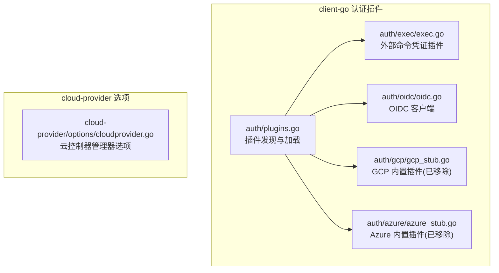
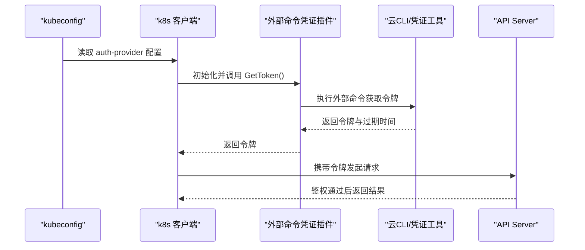
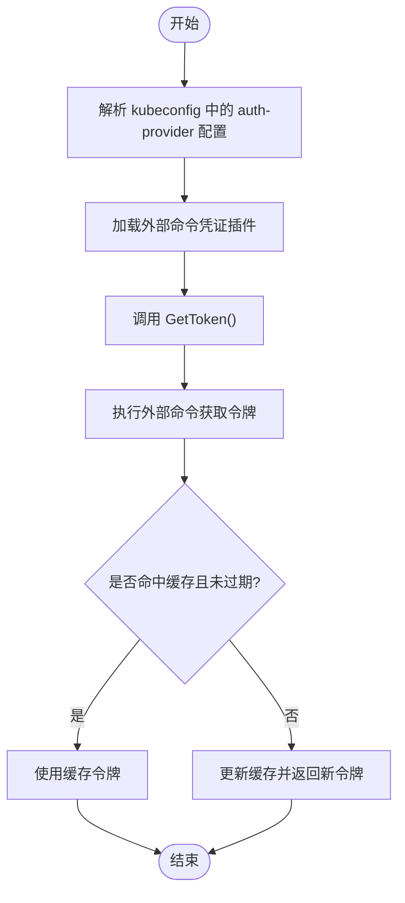
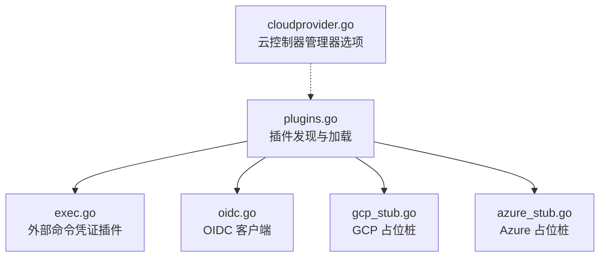

# 云提供商认证

<cite>
**本文引用的文件**   
- [gcp_stub.go](file://staging/src/k8s.io/client-go/plugin/pkg/client/auth/gcp/gcp_stub.go)
- [azure_stub.go](file://staging/src/k8s.io/client-go/plugin/pkg/client/auth/azure/azure_stub.go)
- [exec.go](file://staging/src/k8s.io/client-go/plugin/pkg/client/auth/exec/exec.go)
- [oidc.go](file://staging/src/k8s.io/client-go/plugin/pkg/client/auth/oidc/oidc.go)
- [plugins.go](file://staging/src/k8s.io/client-go/plugin/pkg/client/auth/plugins.go)
- [cloudprovider.go](file://staging/src/k8s.io/cloud-provider/options/cloudprovider.go)
</cite>

## 目录
1. [简介](#简介)
2. [项目结构](#项目结构)
3. [核心组件](#核心组件)
4. [架构总览](#架构总览)
5. [详细组件分析](#详细组件分析)
6. [依赖关系分析](#依赖关系分析)
7. [性能考虑](#性能考虑)
8. [故障排查指南](#故障排查指南)
9. [结论](#结论)
10. [附录](#附录)

## 简介
本技术文档聚焦于 Kubernetes 与主流云提供商（GCP、Azure、AWS）的认证集成方式，围绕以下主题展开：
- 服务账号、IAM 角色与临时凭据的处理机制
- gcloud、azcli 与 aws cli 的集成配置要点
- 云平台身份管理系统的利用方式
- kubeconfig 与环境变量配置示例
- 安全特性：短期令牌、自动轮换、权限边界
- 多云环境下的认证管理策略与最佳实践
- 性能优化建议与故障排查方法（网络延迟、令牌缓存等）

说明：
- GCP 与 Azure 的内置 client-go 认证插件已被移除，需使用外部凭证插件（credential plugin）。
- AWS 未提供内置 client-go 认证插件，通常通过 OIDC 或外部凭证插件完成。

## 项目结构
与云认证相关的代码主要位于 staging 模块中，关键路径如下：
- client-go 认证插件注册与执行框架
  - staging/src/k8s.io/client-go/plugin/pkg/client/auth
    - exec: 外部命令凭证插件实现
    - oidc: OpenID Connect 客户端实现
    - gcp/azure: 占位桩（已移除内置支持）
    - plugins.go: 插件发现与加载入口
- cloud-provider 选项
  - staging/src/k8s.io/cloud-provider/options/cloudprovider.go: 云控制器管理器相关选项

图表来源
- [plugins.go](file://staging/src/k8s.io/client-go/plugin/pkg/client/auth/plugins.go)
- [exec.go](file://staging/src/k8s.io/client-go/plugin/pkg/client/auth/exec/exec.go)
- [oidc.go](file://staging/src/k8s.io/client-go/plugin/pkg/client/auth/oidc/oidc.go)
- [gcp_stub.go](file://staging/src/k8s.io/client-go/plugin/pkg/client/auth/gcp/gcp_stub.go)
- [azure_stub.go](file://staging/src/k8s.io/client-go/plugin/pkg/client/auth/azure/azure_stub.go)
- [cloudprovider.go](file://staging/src/k8s.io/cloud-provider/options/cloudprovider.go)

章节来源
- [gcp_stub.go:1-37](file://staging/src/k8s.io/client-go/plugin/pkg/client/auth/gcp/gcp_stub.go#L1-L37)
- [azure_stub.go:1-37](file://staging/src/k8s.io/client-go/plugin/pkg/client/auth/azure/azure_stub.go#L1-L37)
- [exec.go](file://staging/src/k8s.io/client-go/plugin/pkg/client/auth/exec/exec.go)
- [oidc.go](file://staging/src/k8s.io/client-go/plugin/pkg/client/auth/oidc/oidc.go)
- [plugins.go](file://staging/src/k8s.io/client-go/plugin/pkg/client/auth/plugins.go)
- [cloudprovider.go](file://staging/src/k8s.io/cloud-provider/options/cloudprovider.go)

## 核心组件
- 外部命令凭证插件（exec）
  - 通过执行外部程序获取访问令牌，适合对接各云厂商 CLI 或专用凭证工具
  - 支持缓存与指标采集，减少频繁调用外部程序的开销
- OIDC 客户端（oidc）
  - 基于标准 OIDC 协议获取 ID Token，常用于集群间信任与跨平台统一身份
- 已移除的内置插件（gcp/azure）
  - 不再提供内置实现，转而推荐外部凭证插件方案

章节来源
- [exec.go](file://staging/src/k8s.io/client-go/plugin/pkg/client/auth/exec/exec.go)
- [oidc.go](file://staging/src/k8s.io/client-go/plugin/pkg/client/auth/oidc/oidc.go)
- [gcp_stub.go:1-37](file://staging/src/k8s.io/client-go/plugin/pkg/client/auth/gcp/gcp_stub.go#L1-L37)
- [azure_stub.go:1-37](file://staging/src/k8s.io/client-go/plugin/pkg/client/auth/azure/azure_stub.go#L1-L37)

## 架构总览
Kubernetes 客户端在发起 API 请求时，若 kubeconfig 指定了 auth-provider 为外部命令插件，则按如下流程工作：
- 解析 kubeconfig 中的 auth-provider 配置
- 根据名称选择并加载对应的外部命令插件
- 执行外部命令以获取或刷新令牌
- 将令牌注入到后续 API 请求头中

图表来源
- [exec.go](file://staging/src/k8s.io/client-go/plugin/pkg/client/auth/exec/exec.go)
- [plugins.go](file://staging/src/k8s.io/client-go/plugin/pkg/client/auth/plugins.go)

## 详细组件分析

### GCP 认证集成（推荐：gke-gcloud-auth-plugin）
- 现状
  - 内置 gcp 认证插件已移除，直接报错提示改用外部凭证插件
- 推荐方案
  - 使用 gke-gcloud-auth-plugin 作为外部命令凭证插件
  - 该插件封装 gcloud 行为，自动处理应用默认凭据、服务账号与短期令牌
- kubeconfig 要点
  - 在目标集群的 user 条目下设置 auth-provider 为 gcp
  - 指定 command 指向 gke-gcloud-auth-plugin 可执行文件
  - 可选参数包括 cluster-name、cluster-location、project 等
- 环境变量与凭据
  - 遵循 Google 应用默认凭据链（ADC），优先使用服务账号 JSON 或实例元数据
  - 可通过 GOOGLE_APPLICATION_CREDENTIALS 指定服务账号密钥文件路径
- 安全特性
  - 使用短期访问令牌，降低泄露风险
  - 结合 IAM 角色最小权限原则，限制对 GKE 与 GCP 资源的访问范围
- 配置示例（概念性描述）
  - 在 kubeconfig 的 user 段添加 auth-provider: name=gcp，command 指向 gke-gcloud-auth-plugin，并传入必要参数
  - 或通过 kubectl config set-credentials 与 kubectl config set-context 进行设置

章节来源
- [gcp_stub.go:1-37](file://staging/src/k8s.io/client-go/plugin/pkg/client/auth/gcp/gcp_stub.go#L1-L37)

### Azure 认证集成（推荐：kubelogin）
- 现状
  - 内置 azure 认证插件已移除，直接报错提示改用外部凭证插件
- 推荐方案
  - 使用 kubelogin 作为外部命令凭证插件
  - 支持多种登录方式（交互式、服务主体、托管标识等）
- kubeconfig 要点
  - 在 user 条目下设置 auth-provider 为 azure
  - 指定 command 指向 kubelogin 可执行文件
  - 常见参数包括 login-method、tenant-id、client-id、resource-group、cluster-name 等
- 环境变量与凭据
  - 支持 AZURE_* 系列环境变量（如 AZURE_TENANT_ID、AZURE_CLIENT_ID、AZURE_CLIENT_SECRET 等）
  - 也可通过 Azure CLI 登录状态或托管标识获取凭据
- 安全特性
  - 使用短期访问令牌，支持自动刷新
  - 结合 Azure RBAC 与条件访问策略，实施细粒度权限控制
- 配置示例（概念性描述）
  - 在 kubeconfig 的 user 段添加 auth-provider: name=azure，command 指向 kubelogin，并传入必要参数
  - 或通过 kubectl config set-credentials 与 kubectl config set-context 进行设置

章节来源
- [azure_stub.go:1-37](file://staging/src/k8s.io/client-go/plugin/pkg/client/auth/azure/azure_stub.go#L1-L37)

### AWS 认证集成（推荐：OIDC 或外部凭证插件）
- 现状
  - 未提供内置 client-go 认证插件
- 推荐方案
  - 使用 OIDC 客户端（oidc）对接 AWS EKS 的 OIDC 端点
  - 或使用外部命令凭证插件（如 eksctl 提供的插件）
- kubeconfig 要点
  - 在 user 条目下设置 auth-provider 为 oidc
  - 指定 idp-issuer-url、client-id、idp-certificate-authority 等
- 环境变量与凭据
  - 遵循 AWS SDK 默认凭据链（配置文件、环境变量、实例元数据等）
  - 常用环境变量包括 AWS_REGION、AWS_PROFILE、AWS_ACCESS_KEY_ID、AWS_SECRET_ACCESS_KEY 等
- 安全特性
  - 使用短期访问令牌，结合 IRSA（IAM Roles for Service Accounts）授予 Pod 最小权限
  - 借助条件与权限边界进一步收敛权限
- 配置示例（概念性描述）
  - 在 kubeconfig 的 user 段添加 auth-provider: name=oidc，并填写 OIDC 发行者、客户端 ID 与 CA 证书信息
  - 或通过 kubectl config set-credentials 与 kubectl config set-context 进行设置

章节来源
- [oidc.go](file://staging/src/k8s.io/client-go/plugin/pkg/client/auth/oidc/oidc.go)

### 外部命令凭证插件（exec）通用机制
- 功能概述
  - 通过执行外部程序获取访问令牌，支持缓存与指标
  - 适用于所有支持外部凭证插件的云厂商
- 工作流程
  - 客户端调用 GetToken()
  - 插件执行外部命令，解析输出（包含 token、expiry 等字段）
  - 缓存令牌并在过期前复用
- 适用场景
  - 对接 gke-gcloud-auth-plugin、kubelogin、eksctl 等
- 性能与安全
  - 缓存减少外部调用频率，降低网络延迟影响
  - 外部命令应严格权限控制，避免泄露敏感信息

图表来源
- [exec.go](file://staging/src/k8s.io/client-go/plugin/pkg/client/auth/exec/exec.go)
- [plugins.go](file://staging/src/k8s.io/client-go/plugin/pkg/client/auth/plugins.go)

章节来源
- [exec.go](file://staging/src/k8s.io/client-go/plugin/pkg/client/auth/exec/exec.go)
- [plugins.go](file://staging/src/k8s.io/client-go/plugin/pkg/client/auth/plugins.go)

## 依赖关系分析
- client-go 认证插件体系
  - plugins.go 负责插件发现与加载
  - exec.go 提供外部命令凭证插件实现
  - oidc.go 提供 OIDC 客户端实现
  - gcp_stub.go 与 azure_stub.go 为占位桩，提示迁移至外部凭证插件
- cloud-provider 选项
  - cloudprovider.go 提供云控制器管理器的相关选项，用于集群资源管理与云能力集成

图表来源
- [plugins.go](file://staging/src/k8s.io/client-go/plugin/pkg/client/auth/plugins.go)
- [exec.go](file://staging/src/k8s.io/client-go/plugin/pkg/client/auth/exec/exec.go)
- [oidc.go](file://staging/src/k8s.io/client-go/plugin/pkg/client/auth/oidc/oidc.go)
- [gcp_stub.go:1-37](file://staging/src/k8s.io/client-go/plugin/pkg/client/auth/gcp/gcp_stub.go#L1-L37)
- [azure_stub.go:1-37](file://staging/src/k8s.io/client-go/plugin/pkg/client/auth/azure/azure_stub.go#L1-L37)
- [cloudprovider.go](file://staging/src/k8s.io/cloud-provider/options/cloudprovider.go)

章节来源
- [plugins.go](file://staging/src/k8s.io/client-go/plugin/pkg/client/auth/plugins.go)
- [exec.go](file://staging/src/k8s.io/client-go/plugin/pkg/client/auth/exec/exec.go)
- [oidc.go](file://staging/src/k8s.io/client-go/plugin/pkg/client/auth/oidc/oidc.go)
- [gcp_stub.go:1-37](file://staging/src/k8s.io/client-go/plugin/pkg/client/auth/gcp/gcp_stub.go#L1-L37)
- [azure_stub.go:1-37](file://staging/src/k8s.io/client-go/plugin/pkg/client/auth/azure/azure_stub.go#L1-L37)
- [cloudprovider.go](file://staging/src/k8s.io/cloud-provider/options/cloudprovider.go)

## 性能考虑
- 令牌缓存
  - 外部命令凭证插件支持缓存，避免频繁调用外部 CLI，降低网络延迟与 CPU 开销
- 并发与重试
  - 合理设置客户端超时与重试策略，避免雪崩效应
- 多集群与多租户
  - 为不同集群/租户配置独立的 kubeconfig 与凭据，减少上下文切换成本
- 监控与指标
  - 启用插件指标采集，观察令牌获取耗时与失败率，定位瓶颈

[本节为通用指导，不直接分析具体文件]

## 故障排查指南
- 常见错误
  - 使用已移除的内置插件（gcp/azure）会返回明确错误，提示改用外部凭证插件
- 排查步骤
  - 检查 kubeconfig 中 auth-provider 的名称与 command 是否正确
  - 确认外部凭证插件可执行文件存在且具备执行权限
  - 验证环境变量与凭据文件路径是否正确
  - 查看外部命令的输出与退出码，定位具体问题
- 日志与诊断
  - 启用 klog 日志级别，观察插件加载与调用过程
  - 使用云 CLI 单独测试凭据有效性，排除网络与权限问题

章节来源
- [gcp_stub.go:1-37](file://staging/src/k8s.io/client-go/plugin/pkg/client/auth/gcp/gcp_stub.go#L1-L37)
- [azure_stub.go:1-37](file://staging/src/k8s.io/client-go/plugin/pkg/client/auth/azure/azure_stub.go#L1-L37)

## 结论
- GCP 与 Azure 的内置 client-go 认证插件已移除，推荐使用外部凭证插件（gke-gcloud-auth-plugin、kubelogin）
- AWS 通常采用 OIDC 或外部凭证插件完成认证
- 通过短期令牌、RBAC/IAM 权限边界与自动轮换，提升安全性与可维护性
- 在多云环境中，统一 kubeconfig 模板与凭据管理策略，配合缓存与监控，保障性能与稳定性

[本节为总结性内容，不直接分析具体文件]

## 附录
- 配置清单（概念性）
  - GCP
    - kubeconfig: user.auth-provider.name=gcp；command 指向 gke-gcloud-auth-plugin；参数含 cluster-name、cluster-location、project
    - 环境变量: GOOGLE_APPLICATION_CREDENTIALS 指向服务账号 JSON
  - Azure
    - kubeconfig: user.auth-provider.name=azure；command 指向 kubelogin；参数含 login-method、tenant-id、client-id、resource-group、cluster-name
    - 环境变量: AZURE_TENANT_ID、AZURE_CLIENT_ID、AZURE_CLIENT_SECRET 等
  - AWS
    - kubeconfig: user.auth-provider.name=oidc；参数含 idp-issuer-url、client-id、idp-certificate-authority
    - 环境变量: AWS_REGION、AWS_PROFILE、AWS_ACCESS_KEY_ID、AWS_SECRET_ACCESS_KEY 等

[本节为概念性说明，不直接分析具体文件]