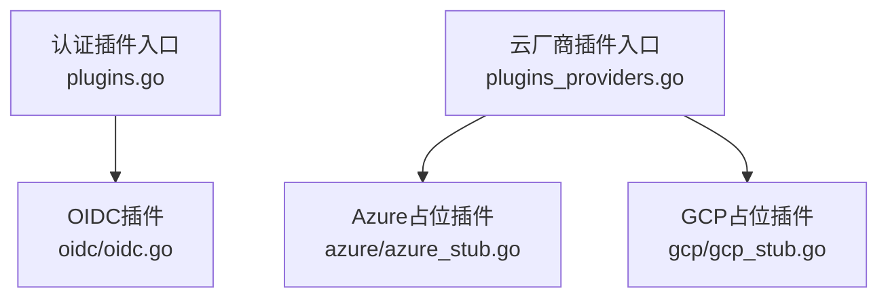
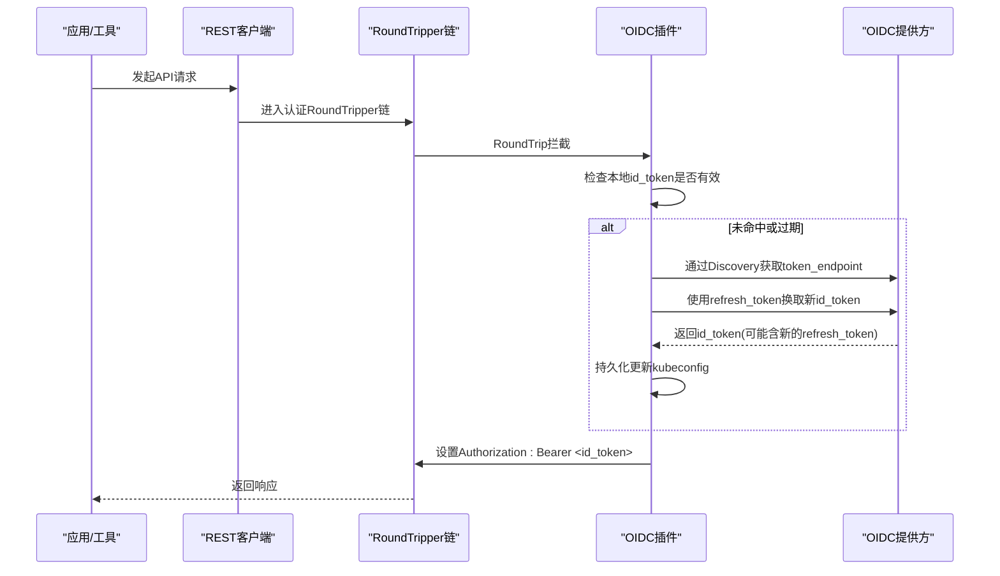
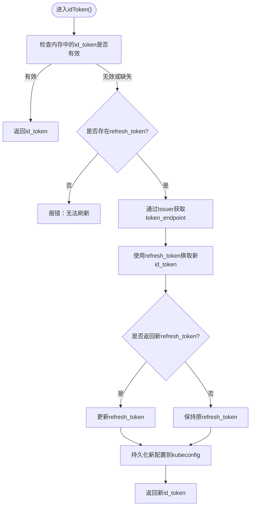
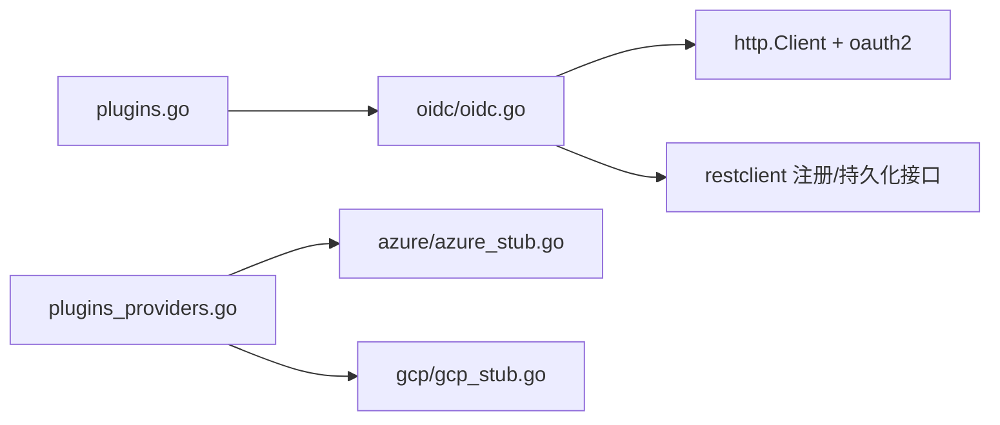

# 认证方式详解

<cite>
**本文引用的文件**   
- [plugins.go](file://staging/src/k8s.io/client-go/plugin/pkg/client/auth/plugins.go)
- [plugins_providers.go](file://staging/src/k8s.io/client-go/plugin/pkg/client/auth/plugins_providers.go)
- [oidc.go](file://staging/src/k8s.io/client-go/plugin/pkg/client/auth/oidc/oidc.go)
- [azure_stub.go](file://staging/src/k8s.io/client-go/plugin/pkg/client/auth/azure/azure_stub.go)
- [gcp_stub.go](file://staging/src/k8s.io/client-go/plugin/pkg/client/auth/gcp/gcp_stub.go)
</cite>

## 目录
1. [简介](#简介)
2. [项目结构](#项目结构)
3. [核心组件](#核心组件)
4. [架构总览](#架构总览)
5. [详细组件分析](#详细组件分析)
6. [依赖关系分析](#依赖关系分析)
7. [性能考虑](#性能考虑)
8. [故障排查指南](#故障排查指南)
9. [结论](#结论)
10. [附录](#附录)

## 简介
本文件面向Kubernetes客户端的多种认证方式，围绕Token、证书、OIDC、Exec与云提供商认证进行系统化说明。重点覆盖：
- 各认证方式的适用场景与安全特性
- 配置方法与实现原理（以代码级流程为主）
- 握手过程与令牌管理机制
- 自定义认证插件开发接口规范
- 故障排查与安全加固最佳实践

说明范围基于仓库中client-go认证插件注册机制与OIDC插件实现，以及云厂商插件的弃用提示。

## 项目结构
与认证相关的核心位置位于client-go的认证插件子系统：
- 通用插件初始化入口：负责导入并注册常用认证插件
- 云厂商插件提供者初始化入口：负责导入并注册云厂商相关插件
- OIDC插件：完整实现了OpenID Connect发现、刷新与Bearer注入
- Azure/GCP插件：当前为占位实现，提示迁移至外部credential plugin

图表来源
- [plugins.go:17-23](file://staging/src/k8s.io/client-go/plugin/pkg/client/auth/plugins.go#L17-L23)
- [plugins_providers.go:17-24](file://staging/src/k8s.io/client-go/plugin/pkg/client/auth/plugins_providers.go#L17-L24)
- [oidc.go:17-54](file://staging/src/k8s.io/client-go/plugin/pkg/client/auth/oidc/oidc.go#L17-L54)
- [azure_stub.go:17-30](file://staging/src/k8s.io/client-go/plugin/pkg/client/auth/azure/azure_stub.go#L17-L30)
- [gcp_stub.go:17-30](file://staging/src/k8s.io/client-go/plugin/pkg/client/auth/gcp/gcp_stub.go#L17-L30)

章节来源
- [plugins.go:17-23](file://staging/src/k8s.io/client-go/plugin/pkg/client/auth/plugins.go#L17-L23)
- [plugins_providers.go:17-24](file://staging/src/k8s.io/client-go/plugin/pkg/client/auth/plugins_providers.go#L17-L24)

## 核心组件
- 认证插件注册机制
  - client-go提供统一的认证插件注册接口，通过init阶段将具体插件名与构造器绑定，供rest层按需加载。
- OIDC认证插件
  - 支持从kubeconfig读取issuer、client-id、可选client-secret、CA等参数
  - 使用OpenID Connect Discovery获取token_endpoint
  - 在请求前自动注入Authorization: Bearer id_token
  - 支持refresh_token刷新id_token并持久化到kubeconfig
  - 内部维护按“集群地址+issuer+client_id”键的缓存，避免并发重复刷新
- 云厂商插件（Azure/GCP）
  - 当前版本已移除内置实现，返回错误并引导使用外部credential plugin

章节来源
- [oidc.go:50-54](file://staging/src/k8s.io/client-go/plugin/pkg/client/auth/oidc/oidc.go#L50-L54)
- [oidc.go:111-162](file://staging/src/k8s.io/client-go/plugin/pkg/client/auth/oidc/oidc.go#L111-L162)
- [azure_stub.go:26-36](file://staging/src/k8s.io/client-go/plugin/pkg/client/auth/azure/azure_stub.go#L26-L36)
- [gcp_stub.go:26-36](file://staging/src/k8s.io/client-go/plugin/pkg/client/auth/gcp/gcp_stub.go#L26-L36)

## 架构总览
下图展示了client-go在发起HTTP请求时，如何经由认证插件链完成身份注入与令牌刷新。

图表来源
- [oidc.go:178-217](file://staging/src/k8s.io/client-go/plugin/pkg/client/auth/oidc/oidc.go#L178-L217)
- [oidc.go:221-288](file://staging/src/k8s.io/client-go/plugin/pkg/client/auth/oidc/oidc.go#L221-L288)
- [oidc.go:293-331](file://staging/src/k8s.io/client-go/plugin/pkg/client/auth/oidc/oidc.go#L293-L331)

## 详细组件分析

### Token认证
- 适用场景
  - 服务账户Token（Pod内挂载）、用户静态Token、一次性Token等
- 安全特性
  - 无加密传输保护需配合TLS；短生命周期更安全
- 性能考虑
  - 零网络开销，仅内存持有
- 配置方法
  - 在kubeconfig中配置user.token字段
- 实现要点
  - 由client-go基础能力直接附加到请求头，无需额外插件

章节来源
- [无直接源码分析引用]

### 证书认证（mTLS）
- 适用场景
  - 强双向认证，常见于节点、控制器、内部服务间通信
- 安全特性
  - 基于X.509证书与私钥，具备强身份绑定与完整性保障
- 性能考虑
  - TLS握手开销可控；证书轮换需关注冷启动成本
- 配置方法
  - kubeconfig中配置client-certificate、client-key、certificate-authority
- 实现要点
  - 由client-go底层TLS配置承载，不依赖认证插件

章节来源
- [无直接源码分析引用]

### OIDC认证
- 适用场景
  - 集成企业统一身份源（如Google、Azure AD、Keycloak等），适合交互式登录与集中式权限管理
- 安全特性
  - 基于OAuth2/OIDC标准；支持refresh_token刷新；可配置CA校验IDP元数据
- 性能考虑
  - 首次或刷新时有网络往返；内部缓存减少并发重复刷新
- 配置方法
  - kubeconfig中配置auth-provider: oidc，包含idp-issuer-url、client-id、可选client-secret、idp-certificate-authority(-data)、id-token、refresh-token等
- 实现要点
  - 插件注册：在init中调用注册接口
  - 请求包装：实现RoundTripper，在发送前注入Authorization头
  - 令牌刷新：通过/.well-known/openid-configuration获取token_endpoint，使用refresh_token换取新id_token，必要时更新refresh_token并持久化
  - 并发控制：按clusterAddress+issuerURL+clientID缓存provider实例，保证同一组凭据只存在一个刷新通道
  - 时间容差：引入expiryDelta提前判定过期，规避时钟偏差

图表来源
- [oidc.go:221-288](file://staging/src/k8s.io/client-go/plugin/pkg/client/auth/oidc/oidc.go#L221-L288)
- [oidc.go:293-331](file://staging/src/k8s.io/client-go/plugin/pkg/client/auth/oidc/oidc.go#L293-L331)

章节来源
- [oidc.go:50-54](file://staging/src/k8s.io/client-go/plugin/pkg/client/auth/oidc/oidc.go#L50-L54)
- [oidc.go:111-162](file://staging/src/k8s.io/client-go/plugin/pkg/client/auth/oidc/oidc.go#L111-L162)
- [oidc.go:178-217](file://staging/src/k8s.io/client-go/plugin/pkg/client/auth/oidc/oidc.go#L178-L217)
- [oidc.go:221-288](file://staging/src/k8s.io/client-go/plugin/pkg/client/auth/oidc/oidc.go#L221-L288)
- [oidc.go:293-331](file://staging/src/k8s.io/client-go/plugin/pkg/client/auth/oidc/oidc.go#L293-L331)

### Exec认证（Credential Plugin）
- 适用场景
  - 需要动态生成短期凭据（如云厂商CLI、第三方密钥系统）
- 安全特性
  - 凭据由外部程序生成，最小暴露面；可结合系统权限控制
- 性能考虑
  - 每次刷新执行一次子进程，注意超时与重试策略
- 配置方法
  - kubeconfig中配置auth-provider: exec，指定command与args
- 实现要点
  - 由client-go credential plugin框架驱动，不在本仓库内置实现范围内

章节来源
- [无直接源码分析引用]

### 云提供商认证（Azure/GCP）
- 现状
  - 内置插件已被移除，返回明确错误并指引迁移至外部credential plugin
- 建议
  - Azure：使用kubelogin
  - GKE：使用gke-gcloud-auth-plugin
- 影响
  - 旧配置需升级至外部plugin，否则初始化即失败

章节来源
- [azure_stub.go:26-36](file://staging/src/k8s.io/client-go/plugin/pkg/client/auth/azure/azure_stub.go#L26-L36)
- [gcp_stub.go:26-36](file://staging/src/k8s.io/client-go/plugin/pkg/client/auth/gcp/gcp_stub.go#L26-L36)

### 自定义认证插件开发指南与接口规范
- 注册入口
  - 在init中调用注册函数，将插件名与构造器绑定
- 构造器签名
  - 接收clusterAddress、配置map、持久化器，返回AuthProvider实例
- 必要实现
  - WrapTransport：返回RoundTripper包装器，用于在请求前注入认证信息
  - Login：如需交互式登录可在此实现（非必须）
- 持久化
  - 通过传入的AuthConfigPersister保存敏感信息（如refresh_token）
- 并发与缓存
  - 建议对共享资源加锁，避免并发刷新竞态
- 示例参考
  - OIDC插件提供了完整的注册、WrapTransport、刷新与持久化范式

章节来源
- [oidc.go:50-54](file://staging/src/k8s.io/client-go/plugin/pkg/client/auth/oidc/oidc.go#L50-L54)
- [oidc.go:111-162](file://staging/src/k8s.io/client-go/plugin/pkg/client/auth/oidc/oidc.go#L111-L162)
- [oidc.go:178-217](file://staging/src/k8s.io/client-go/plugin/pkg/client/auth/oidc/oidc.go#L178-L217)

## 依赖关系分析
- 插件注册与初始化
  - plugins.go：导入并初始化通用插件（如OIDC）
  - plugins_providers.go：导入并初始化云厂商插件（Azure/GCP占位）
- OIDC插件依赖
  - 使用oauth2库进行令牌刷新
  - 使用http.Client与TLS CA配置访问IDP元数据
  - 使用restclient提供的注册与持久化接口

图表来源
- [plugins.go:17-23](file://staging/src/k8s.io/client-go/plugin/pkg/client/auth/plugins.go#L17-L23)
- [plugins_providers.go:17-24](file://staging/src/k8s.io/client-go/plugin/pkg/client/auth/plugins_providers.go#L17-L24)
- [oidc.go:17-54](file://staging/src/k8s.io/client-go/plugin/pkg/client/auth/oidc/oidc.go#L17-L54)

章节来源
- [plugins.go:17-23](file://staging/src/k8s.io/client-go/plugin/pkg/client/auth/plugins.go#L17-L23)
- [plugins_providers.go:17-24](file://staging/src/k8s.io/client-go/plugin/pkg/client/auth/plugins_providers.go#L17-L24)
- [oidc.go:17-54](file://staging/src/k8s.io/client-go/plugin/pkg/client/auth/oidc/oidc.go#L17-L54)

## 性能考虑
- OIDC刷新频率
  - 合理设置id_token有效期与刷新策略，避免频繁刷新
  - 利用内部缓存降低并发刷新带来的额外开销
- 网络与I/O
  - 首次连接IDP元数据与刷新令牌会产生网络延迟，应配置合理的超时与重试
- 磁盘写入
  - 持久化kubeconfig应避免高频写盘，仅在必要时更新
- 证书与TLS
  - 复用TLS连接与会话票据可降低握手开销

[本节为通用指导，不涉及特定源码分析]

## 故障排查指南
- OIDC常见问题
  - 未配置idp-issuer-url或client-id：初始化即失败
  - refresh_token缺失：无法刷新id_token，需重新登录
  - token_endpoint缺失：IDP未正确提供OpenID Connect元数据
  - 未返回id_token：部分IDP在刷新响应中不包含id_token，需确保登录时请求了openid scope
  - 时间偏差：启用expiryDelta容忍时钟差异
- 云厂商插件
  - Azure/GCP内置插件已移除，直接使用会返回错误，请切换至外部credential plugin
- 调试建议
  - 开启日志输出，观察插件初始化与刷新路径
  - 验证IDP的/.well-known/openid-configuration可达且格式正确
  - 检查kubeconfig中敏感字段是否正确持久化

章节来源
- [oidc.go:111-162](file://staging/src/k8s.io/client-go/plugin/pkg/client/auth/oidc/oidc.go#L111-L162)
- [oidc.go:221-288](file://staging/src/k8s.io/client-go/plugin/pkg/client/auth/oidc/oidc.go#L221-L288)
- [oidc.go:293-331](file://staging/src/k8s.io/client-go/plugin/pkg/client/auth/oidc/oidc.go#L293-L331)
- [azure_stub.go:26-36](file://staging/src/k8s.io/client-go/plugin/pkg/client/auth/azure/azure_stub.go#L26-L36)
- [gcp_stub.go:26-36](file://staging/src/k8s.io/client-go/plugin/pkg/client/auth/gcp/gcp_stub.go#L26-L36)

## 结论
- client-go通过统一的认证插件机制扩展认证能力，OIDC插件提供了开箱即用的标准方案
- 云厂商内置插件已迁移至外部credential plugin，需按官方指引升级
- 在生产环境中，建议结合证书认证与OIDC/Exec组合，兼顾安全性与灵活性
- 自定义插件应遵循注册与RoundTripper包装模式，做好并发控制与持久化

[本节为总结性内容，不涉及特定源码分析]

## 附录
- 配置项速查（OIDC）
  - idp-issuer-url：IDP发行者地址
  - client-id：客户端标识
  - client-secret：可选，客户端密钥
  - idp-certificate-authority / idp-certificate-authority-data：IDP CA证书
  - id-token：当前有效的id_token
  - refresh-token：用于刷新id_token
- 安全加固建议
  - 限制kubeconfig读写权限
  - 定期轮换证书与密钥
  - 启用严格的RBAC与最小权限原则
  - 监控与审计认证失败事件

[本节为补充信息，不涉及特定源码分析]