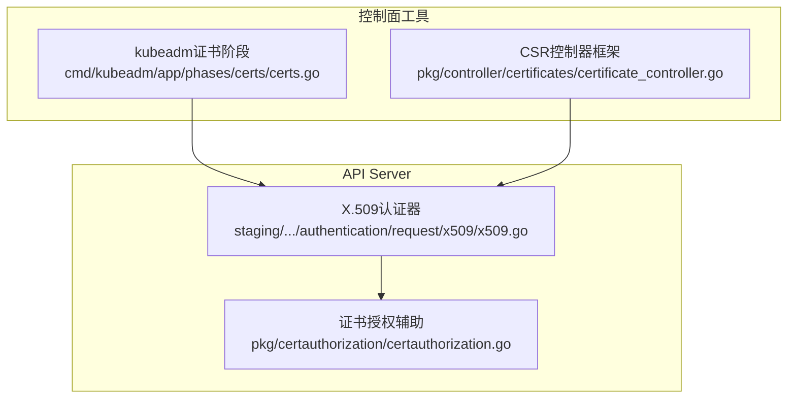
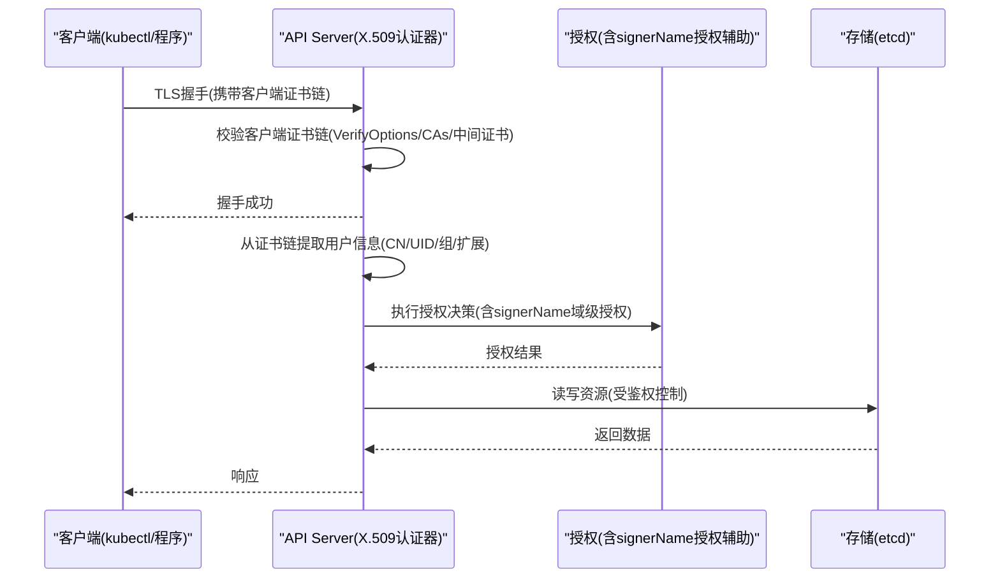
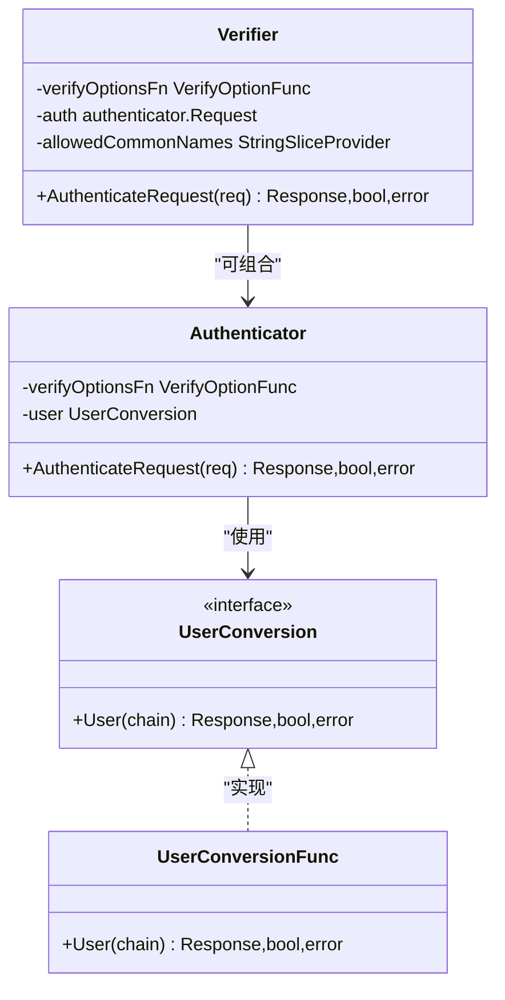
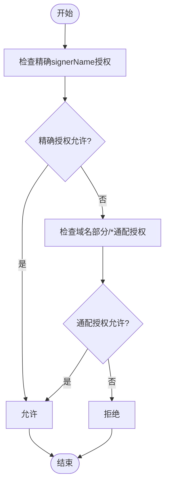
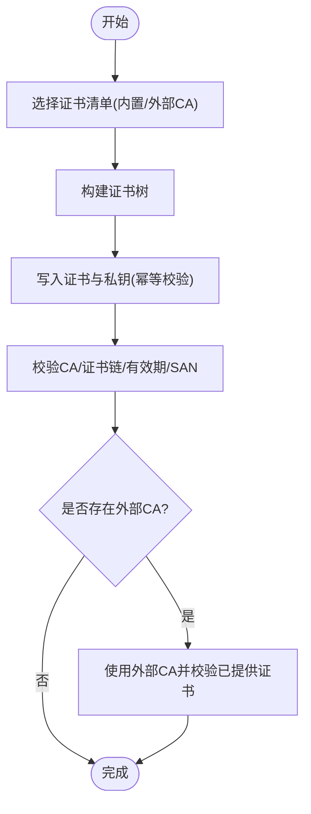
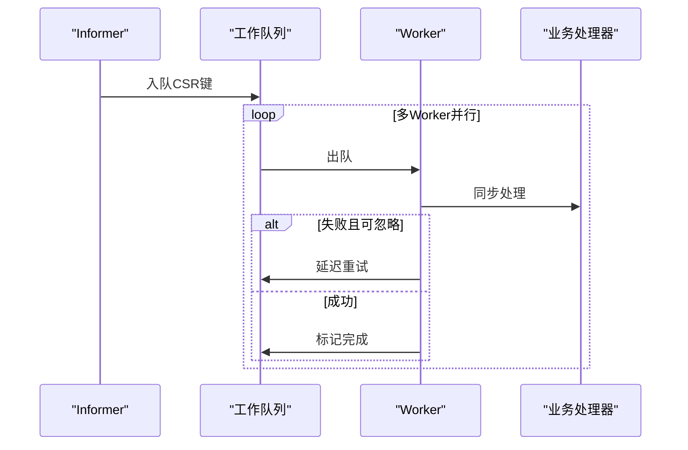
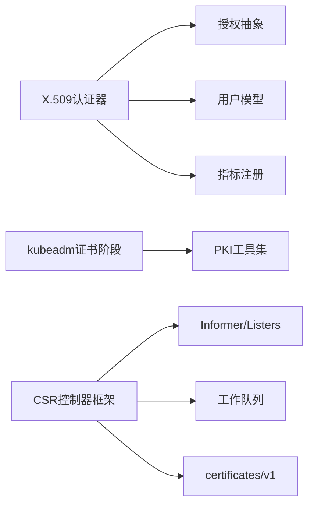
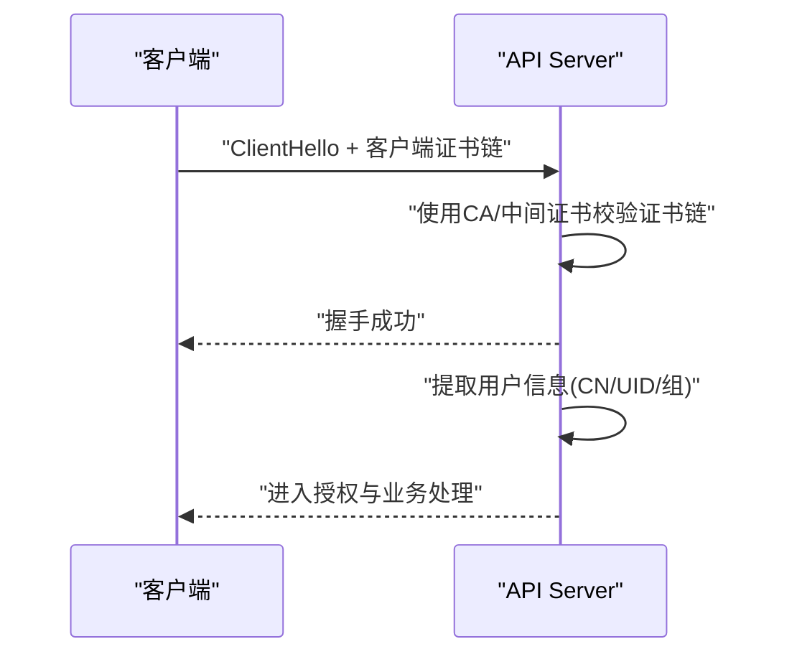

# 证书认证

<cite>
**本文引用的文件**   
- [x509.go](file://staging/src/k8s.io/apiserver/pkg/authentication/request/x509/x509.go)
- [certauthorization.go](file://pkg/certauthorization/certauthorization.go)
- [certs.go](file://cmd/kubeadm/app/phases/certs/certs.go)
- [certificate_controller.go](file://pkg/controller/certificates/certificate_controller.go)
</cite>

## 目录
1. [简介](#简介)
2. [项目结构](#项目结构)
3. [核心组件](#核心组件)
4. [架构总览](#架构总览)
5. [详细组件分析](#详细组件分析)
6. [依赖关系分析](#依赖关系分析)
7. [性能考虑](#性能考虑)
8. [故障排查指南](#故障排查指南)
9. [结论](#结论)
10. [附录](#附录)

## 简介
本文件面向Kubernetes客户端证书认证，聚焦于mTLS双向TLS握手、客户端证书生成与验证、kubeconfig中client-certificate/client-key配置、证书链信任机制、证书轮换策略与自动化管理、安全最佳实践以及性能调优与排障。文档内容基于仓库中的API Server X.509认证实现、证书授权辅助逻辑、kubeadm证书生命周期管理与CSR控制器框架进行系统化梳理。

## 项目结构
围绕“客户端证书认证”的关键代码分布在以下位置：
- API Server侧X.509认证器：负责在TLS握手后对客户端证书进行校验并提取用户信息
- 证书授权辅助：用于判断主体是否有权使用特定signerName签发证书
- kubeadm证书阶段：负责集群PKI资产创建、校验与外部CA判定
- CSR控制器框架：提供通用的CSR处理循环与队列能力，供具体签名控制器复用

图表来源
- [x509.go:127-216](file://staging/src/k8s.io/apiserver/pkg/authentication/request/x509/x509.go#L127-L216)
- [certauthorization.go:28-76](file://pkg/certauthorization/certauthorization.go#L28-L76)
- [certs.go:43-72](file://cmd/kubeadm/app/phases/certs/certs.go#L43-L72)
- [certificate_controller.go:42-113](file://pkg/controller/certificates/certificate_controller.go#L42-L113)

章节来源
- [x509.go:127-216](file://staging/src/k8s.io/apiserver/pkg/authentication/request/x509/x509.go#L127-L216)
- [certauthorization.go:28-76](file://pkg/certauthorization/certauthorization.go#L28-L76)
- [certs.go:43-72](file://cmd/kubeadm/app/phases/certs/certs.go#L43-L72)
- [certificate_controller.go:42-113](file://pkg/controller/certificates/certificate_controller.go#L42-L113)

## 核心组件
- X.509客户端认证器
  - 职责：从HTTP请求的TLS上下文中提取客户端证书链，依据VerifyOptions进行校验，并将有效证书链转换为user.Info（如用户名、UID、组等）
  - 关键行为：支持动态CA更新、中间证书自动注入、证书过期时间指标采集、CN白名单校验（Verifier包装器）
- 证书授权辅助
  - 职责：根据signerName与域名前缀进行RBAC授权检查，允许按域授予批量权限
- kubeadm证书阶段
  - 职责：创建/校验PKI资产（CA、服务账户密钥、前后代理CA等），检测外部CA场景，校验证书有效期与SAN匹配
- CSR控制器框架
  - 职责：监听CertificateSigningRequest事件，入队并调用处理器完成签名流程；具备速率限制与重试机制

章节来源
- [x509.go:127-216](file://staging/src/k8s.io/apiserver/pkg/authentication/request/x509/x509.go#L127-L216)
- [certauthorization.go:28-76](file://pkg/certauthorization/certauthorization.go#L28-L76)
- [certs.go:43-72](file://cmd/kubeadm/app/phases/certs/certs.go#L43-L72)
- [certificate_controller.go:42-113](file://pkg/controller/certificates/certificate_controller.go#L42-L113)

## 架构总览
下图展示客户端通过mTLS访问API Server时的端到端流程，包括证书校验、用户信息提取与后续授权路径。

图表来源
- [x509.go:146-216](file://staging/src/k8s.io/apiserver/pkg/authentication/request/x509/x509.go#L146-L216)
- [certauthorization.go:34-57](file://pkg/certauthorization/certauthorization.go#L34-L57)

## 详细组件分析

### X.509客户端认证器
- 功能要点
  - 从TLS上下文获取PeerCertificates[0]作为终端实体证书
  - 若存在中间证书，自动注入到VerifyOptions.Intermediates
  - 使用系统根或配置的CA池进行证书链校验
  - 将有效证书链转换为user.DefaultInfo（包含Name/UID/Groups/Extra）
  - 暴露指标：客户端证书剩余有效期直方图
  - 支持CN白名单校验（Verifier包装器）
- 关键接口与类型
  - Authenticator：实现request.Authenticator
  - UserConversion：定义从证书链到用户信息的转换
  - VerifyOptionFunc：动态提供VerifyOptions的能力
  - Verifier：在认证前先校验证书并可选地限制允许的CN集合

图表来源
- [x509.go:127-144](file://staging/src/k8s.io/apiserver/pkg/authentication/request/x509/x509.go#L127-L144)
- [x509.go:146-216](file://staging/src/k8s.io/apiserver/pkg/authentication/request/x509/x509.go#L146-L216)
- [x509.go:218-278](file://staging/src/k8s.io/apiserver/pkg/authentication/request/x509/x509.go#L218-L278)

章节来源
- [x509.go:127-216](file://staging/src/k8s.io/apiserver/pkg/authentication/request/x509/x509.go#L127-L216)
- [x509.go:218-278](file://staging/src/k8s.io/apiserver/pkg/authentication/request/x509/x509.go#L218-L278)

### 证书授权辅助(signerName授权)
- 功能要点
  - 先针对具体signerName进行授权检查
  - 若不通过，再尝试以“域名部分/*”进行通配授权检查（例如 kubernetes.io/*）
  - 便于按域授予批量签发权限，降低RBAC复杂度
- 适用场景
  - 自定义证书控制器或外部签名者需要按域精细化授权

图表来源
- [certauthorization.go:34-57](file://pkg/certauthorization/certauthorization.go#L34-L57)

章节来源
- [certauthorization.go:28-76](file://pkg/certauthorization/certauthorization.go#L28-L76)

### kubeadm证书阶段(PKI资产与外部CA)
- 功能要点
  - 创建集群所需PKI资产（CA、SA密钥、前后代理CA等）
  - 校验现有证书与私钥一致性、是否为CA、有效期、SAN匹配
  - 检测外部CA场景（仅存在公钥无私钥时），跳过内部生成
- 典型流程
  - CreatePKIAssets：根据配置选择证书清单，构建证书树并写入磁盘
  - LoadCertificateAuthority：加载并校验CA证书与私钥
  - writeCertificateFilesIfNotExist：按需生成或校验已有证书链与属性
  - UsingExternal*：判定是否使用外部CA并校验对应已提供的证书

图表来源
- [certs.go:43-72](file://cmd/kubeadm/app/phases/certs/certs.go#L43-L72)
- [certs.go:146-167](file://cmd/kubeadm/app/phases/certs/certs.go#L146-L167)
- [certs.go:206-252](file://cmd/kubeadm/app/phases/certs/certs.go#L206-L252)
- [certs.go:290-367](file://cmd/kubeadm/app/phases/certs/certs.go#L290-L367)

章节来源
- [certs.go:43-72](file://cmd/kubeadm/app/phases/certs/certs.go#L43-L72)
- [certs.go:146-167](file://cmd/kubeadm/app/phases/certs/certs.go#L146-L167)
- [certs.go:206-252](file://cmd/kubeadm/app/phases/certs/certs.go#L206-L252)
- [certs.go:290-367](file://cmd/kubeadm/app/phases/certs/certs.go#L290-L367)

### CSR控制器框架
- 功能要点
  - 监听CertificateSigningRequest增删改事件，入队处理
  - 支持指数退避与桶限流的重试策略
  - 提供通用worker循环与错误分类（可忽略错误）
- 适用场景
  - 构建自定义证书签名控制器（如Node证书、ServiceAccount证书等）

图表来源
- [certificate_controller.go:56-113](file://pkg/controller/certificates/certificate_controller.go#L56-L113)
- [certificate_controller.go:141-168](file://pkg/controller/certificates/certificate_controller.go#L141-L168)

章节来源
- [certificate_controller.go:42-113](file://pkg/controller/certificates/certificate_controller.go#L42-L113)
- [certificate_controller.go:141-168](file://pkg/controller/certificates/certificate_controller.go#L141-L168)

## 依赖关系分析
- X.509认证器依赖
  - 标准库crypto/x509进行证书链校验
  - apiserver认证/用户模型抽象（authenticator/user）
  - 指标注册（component-base/metrics）
- 证书授权辅助依赖
  - apiserver授权抽象（authorizer）
  - user信息模型
- kubeadm证书阶段依赖
  - PKI工具集（pkiutil/keyutil）
  - kubeadm配置与常量
- CSR控制器框架依赖
  - client-go informer/listers/workqueue
  - api/certificates/v1

图表来源
- [x509.go:19-40](file://staging/src/k8s.io/apiserver/pkg/authentication/request/x509/x509.go#L19-L40)
- [certauthorization.go:19-26](file://pkg/certauthorization/certauthorization.go#L19-L26)
- [certs.go:19-35](file://cmd/kubeadm/app/phases/certs/certs.go#L19-L35)
- [certificate_controller.go:21-40](file://pkg/controller/certificates/certificate_controller.go#L21-L40)

章节来源
- [x509.go:19-40](file://staging/src/k8s.io/apiserver/pkg/authentication/request/x509/x509.go#L19-L40)
- [certauthorization.go:19-26](file://pkg/certauthorization/certauthorization.go#L19-L26)
- [certs.go:19-35](file://cmd/kubeadm/app/phases/certs/certs.go#L19-L35)
- [certificate_controller.go:21-40](file://pkg/controller/certificates/certificate_controller.go#L21-L40)

## 性能考虑
- 证书校验开销
  - 每次请求都会进行证书链校验与用户信息转换，建议合理设置CA池大小与中间证书数量，避免过深证书链
- 指标观测
  - 客户端证书剩余有效期直方图可用于监控即将过期的证书，提前触发轮换
- 并发与限流
  - CSR控制器采用指数退避+桶限流，避免雪崩；可根据集群规模调整workers与速率参数
- 动态CA更新
  - 通过VerifyOptionFunc动态提供CA，减少重启成本，但需保证线程安全与一致性

章节来源
- [x509.go:50-85](file://staging/src/k8s.io/apiserver/pkg/authentication/request/x509/x509.go#L50-L85)
- [certificate_controller.go:67-77](file://pkg/controller/certificates/certificate_controller.go#L67-L77)

## 故障排查指南
- 常见错误定位
  - 证书链校验失败：检查CA是否正确、中间证书是否完整、证书用途是否包含客户端认证
  - CN不在允许列表：确认Verifier的CN白名单配置
  - 证书过期：观察指标直方图，及时轮换
  - signerName授权失败：检查RBAC是否授予了精确或通配域名授权
- 日志与诊断
  - X.509认证器会记录证书标识符与错误原因
  - kubeadm证书阶段会输出警告提示证书周期问题
  - CSR控制器会区分可忽略错误与普通错误，便于定位用户态问题

章节来源
- [x509.go:192-216](file://staging/src/k8s.io/apiserver/pkg/authentication/request/x509/x509.go#L192-L216)
- [certs.go:461-476](file://cmd/kubeadm/app/phases/certs/certs.go#L461-L476)
- [certificate_controller.go:155-168](file://pkg/controller/certificates/certificate_controller.go#L155-L168)

## 结论
Kubernetes客户端证书认证基于标准X.509与mTLS，结合灵活的UserConversion与动态CA能力，实现了高可用与可扩展的认证体系。配合kubeadm的PKI管理与CSR控制器框架，可形成完整的证书生命周期闭环。实践中应重视最小权限、定期轮换与安全存储，并通过指标与日志建立完善的可观测性与排障能力。

## 附录

### mTLS双向TLS握手过程（概念性说明）
- 步骤概览
  - 客户端向API Server发起TLS握手，发送自身证书链
  - API Server使用配置的CA与中间证书校验客户端证书链
  - 校验通过后，从证书中提取用户信息并进入授权阶段
- 注意
  - 该图为概念流程，不直接映射具体源码文件

### kubeconfig中client-certificate与client-key配置方法
- 字段说明
  - client-certificate：指向PEM格式的客户端证书文件路径
  - client-key：指向对应的PEM格式私钥文件路径
- 文件格式要求
  - 证书与私钥必须为PEM编码
  - 私钥不得加密或使用复杂口令（kubectl默认不支持交互式输入密码）
- 安全存储建议
  - 限制文件权限（仅当前用户可读）
  - 使用受控目录存放，避免与其他敏感信息混放
  - 结合Secret或外部密钥管理服务进行分发与轮换

### 证书生成与管理流程（openssl与cfssl）
- openssl方式
  - 生成CA私钥与自签CA证书
  - 生成客户端私钥与CSR
  - 使用CA签发客户端证书，指定用途为客户端认证
  - 将证书与私钥导出为PEM文件，并在kubeconfig中引用
- cfssl方式
  - 定义JSON配置文件（包含Subject、KeyUsage、SAN等）
  - 使用cfssl生成CA与客户端证书
  - 输出PEM格式证书与私钥，便于集成到kubeconfig
- 注意事项
  - 确保证书KeyUsage包含客户端认证
  - SAN中包含必要的DNS/IP（如需服务端证书）
  - 合理设置有效期，便于轮换

### 证书轮换策略与自动化管理
- 轮换策略
  - 短有效期证书（如90天）+ 自动化续期
  - 滚动替换：新证书生效后再清理旧证书
  - 灰度发布：先在非关键节点试用新证书
- 自动化方案
  - 使用CSR控制器与自定义签名者，结合RBAC与signerName授权
  - 利用kubeadm的外部CA模式，集中管理CA与证书
  - 结合CI/CD流水线与密钥管理系统进行证书分发

### 安全最佳实践
- 最小权限原则
  - 为每个客户端分配最小必要权限，优先使用命名空间与资源限定
  - 使用signerName域级授权简化批量管理
- 定期轮换
  - 设定告警阈值（如剩余30天），自动触发续期
  - 监控证书过期指标，及时发现异常
- 安全存储
  - 严格限制私钥文件权限
  - 避免在日志或调试信息中泄露证书指纹或私钥片段