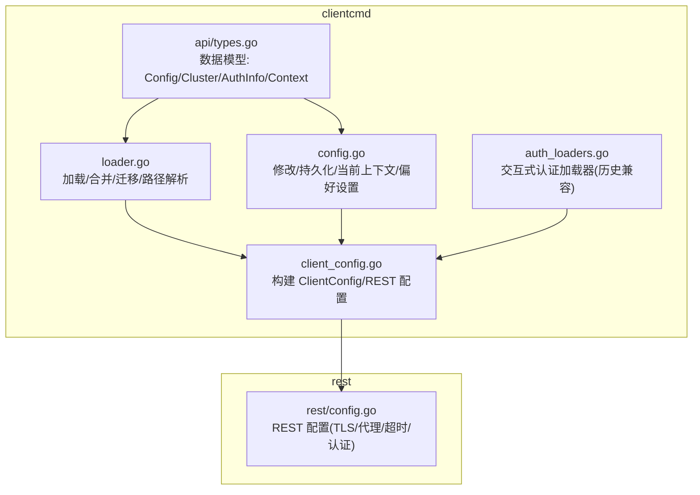
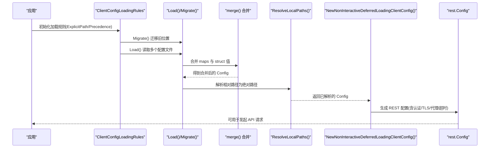
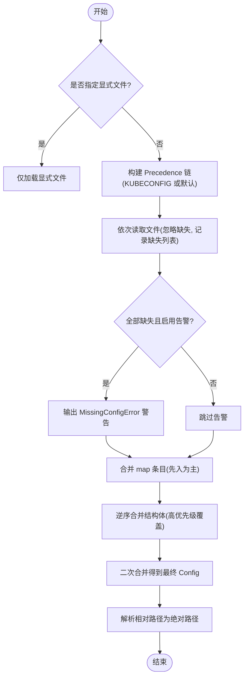
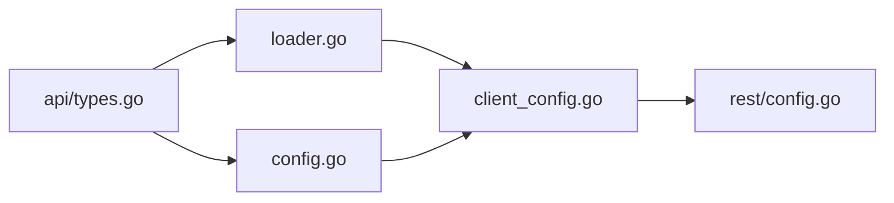

# 配置与认证

<cite>
**本文引用的文件**   
- [config.go](file://staging/src/k8s.io/client-go/tools/clientcmd/config.go)
- [loader.go](file://staging/src/k8s.io/client-go/tools/clientcmd/loader.go)
- [types.go](file://staging/src/k8s.io/client-go/tools/clientcmd/api/types.go)
- [auth_loaders.go](file://staging/src/k8s.io/client-go/tools/clientcmd/auth_loaders.go)
- [client_config.go](file://staging/src/k8s.io/client-go/tools/clientcmd/client_config.go)
- [rest_config.go](file://staging/src/k8s.io/client-go/rest/config.go)
</cite>

## 目录
1. [简介](#简介)
2. [项目结构](#项目结构)
3. [核心组件](#核心组件)
4. [架构总览](#架构总览)
5. [详细组件分析](#详细组件分析)
6. [依赖分析](#依赖分析)
7. [性能考虑](#性能考虑)
8. [故障排查指南](#故障排查指南)
9. [结论](#结论)
10. [附录](#附录)

## 简介
本指南聚焦于 Kubernetes 客户端的配置与认证，围绕 kubeconfig 文件的结构与选项、多种认证方式（Token、证书、OIDC、云厂商）、In-cluster 与 Out-of-cluster 的差异、自定义认证插件开发、TLS/代理/超时配置、配置验证与安全最佳实践、常见问题排查以及热重载与动态更新实现进行系统化说明。内容基于 client-go 的 clientcmd 与 rest 包源码进行分析与提炼，帮助读者从原理到实践全面掌握配置与认证。

## 项目结构
与配置和认证相关的关键代码位于 staging/src/k8s.io/client-go/tools/clientcmd 与 staging/src/k8s.io/client-go/rest：
- clientcmd：负责 kubeconfig 加载、合并、路径解析、持久化、上下文选择、默认值与迁移等
- clientcmd/api：定义 kubeconfig 的数据模型（Config、Cluster、AuthInfo、Context、AuthProviderConfig、ExecConfig 等）
- rest：将 clientcmd 的结果转换为 REST 客户端配置（TLS、代理、超时、认证传输等）

图表来源
- [loader.go:197-282](file://staging/src/k8s.io/client-go/tools/clientcmd/loader.go#L197-L282)
- [config.go:165-353](file://staging/src/k8s.io/client-go/tools/clientcmd/config.go#L165-L353)
- [types.go:31-176](file://staging/src/k8s.io/client-go/tools/clientcmd/api/types.go#L31-L176)
- [auth_loaders.go:31-111](file://staging/src/k8s.io/client-go/tools/clientcmd/auth_loaders.go#L31-L111)
- [client_config.go](file://staging/src/k8s.io/client-go/tools/clientcmd/client_config.go)
- [rest_config.go](file://staging/src/k8s.io/client-go/rest/config.go)

章节来源
- [loader.go:197-282](file://staging/src/k8s.io/client-go/tools/clientcmd/loader.go#L197-L282)
- [config.go:165-353](file://staging/src/k8s.io/client-go/tools/clientcmd/config.go#L165-L353)
- [types.go:31-176](file://staging/src/k8s.io/client-go/tools/clientcmd/api/types.go#L31-L176)
- [auth_loaders.go:31-111](file://staging/src/k8s.io/client-go/tools/clientcmd/auth_loaders.go#L31-L111)
- [client_config.go](file://staging/src/k8s.io/client-go/tools/clientcmd/client_config.go)
- [rest_config.go](file://staging/src/k8s.io/client-go/rest/config.go)

## 核心组件
- 配置访问与路径规则
  - PathOptions：封装全局文件、环境变量、显式文件标志，决定加载优先级与默认写入目标
  - ClientConfigLoadingRules：维护 ExplicitPath、Precedence、MigrationRules、DoNotResolvePaths、WarnIfAllMissing 等，提供 Load/Migrate/GetDefaultFilename 等方法
- 配置读写与持久化
  - ModifyConfig：对比新旧配置差异，按 LocationOfOrigin 定位源文件并增量写回；支持相对路径转换
  - WriteToFile/Write：序列化与落盘，包含目录创建与权限控制
- 数据模型
  - Config/Cluster/AuthInfo/Context：kubeconfig 的核心结构体，定义集群地址、TLS、用户凭据、上下文绑定等
  - AuthProviderConfig/ExecConfig：扩展认证能力（OIDC/云厂商/自定义 exec 插件）
- 认证加载器
  - AuthLoader/PromptingAuthLoader：历史兼容的交互式认证加载器（用户名/密码），用于早期版本或特定场景

章节来源
- [config.go:46-157](file://staging/src/k8s.io/client-go/tools/clientcmd/config.go#L46-L157)
- [config.go:165-353](file://staging/src/k8s.io/client-go/tools/clientcmd/config.go#L165-L353)
- [loader.go:111-180](file://staging/src/k8s.io/client-go/tools/clientcmd/loader.go#L111-L180)
- [loader.go:197-282](file://staging/src/k8s.io/client-go/tools/clientcmd/loader.go#L197-L282)
- [loader.go:454-470](file://staging/src/k8s.io/client-go/tools/clientcmd/loader.go#L454-L470)
- [types.go:31-176](file://staging/src/k8s.io/client-go/tools/clientcmd/api/types.go#L31-L176)
- [types.go:178-291](file://staging/src/k8s.io/client-go/tools/clientcmd/api/types.go#L178-L291)
- [auth_loaders.go:31-111](file://staging/src/k8s.io/client-go/tools/clientcmd/auth_loaders.go#L31-L111)

## 架构总览
下图展示了从 kubeconfig 到 REST 客户端配置的端到端流程，包括加载、合并、路径解析、认证信息装配与 TLS/代理/超时设置。

图表来源
- [loader.go:197-282](file://staging/src/k8s.io/client-go/tools/clientcmd/loader.go#L197-L282)
- [loader.go:509-541](file://staging/src/k8s.io/client-go/tools/clientcmd/loader.go#L509-L541)
- [client_config.go](file://staging/src/k8s.io/client-go/tools/clientcmd/client_config.go)
- [rest_config.go](file://staging/src/k8s.io/client-go/rest/config.go)

## 详细组件分析

### kubeconfig 数据结构与字段说明
- Config：顶层对象，包含 Clusters、AuthInfos、Contexts、CurrentContext、Extensions
- Cluster：集群连接信息
  - server：API Server 地址
  - tls-server-name：证书校验时使用的服务器名称
  - insecure-skip-tls-verify：跳过证书校验（不推荐生产使用）
  - certificate-authority / certificate-authority-data：CA 证书路径或内联数据
  - proxy-url：HTTP/HTTPS/SOCKS5 代理
  - disable-compression：禁用响应压缩以提升带宽充足时的列表性能
- AuthInfo：用户身份与认证信息
  - client-certificate / client-key 或对应 data 字段：双向 TLS 证书
  - token / tokenFile：Bearer Token 或 Token 文件（tokenFile 会周期性读取）
  - impersonate / impersonate-groups / impersonate-user-extra：模拟用户与组
  - username/password：基本认证（较少使用）
  - auth-provider：外部认证提供者（如 OIDC、云厂商）
  - exec：exec 插件认证（可交互模式、环境变量、策略控制）
- Context：绑定 Cluster + User + Namespace
- AuthProviderConfig：认证提供者名称与配置键值对
- ExecConfig：exec 插件命令、参数、环境变量、APIVersion、InstallHint、ProvideClusterInfo、InteractiveMode、PluginPolicy 等

章节来源
- [types.go:31-176](file://staging/src/k8s.io/client-go/tools/clientcmd/api/types.go#L31-L176)
- [types.go:178-291](file://staging/src/k8s.io/client-go/tools/clientcmd/api/types.go#L178-L291)

### 加载与合并机制
- 加载优先级
  - 显式文件 > KUBECONFIG 环境变量列出的文件链 > 默认 ~/.kube/config
  - 重复路径去重，缺失文件可选择性告警
- 合并策略
  - 先按 map 键顺序合并（先入为主，后覆盖无效）
  - 再逆序合并非 map 结构体（确保高优先级覆盖低优先级）
  - 最终合并两次结果以达成预期覆盖语义
- 路径解析
  - 根据各条目的 LocationOfOrigin 计算基目录，将相对路径转为绝对路径
  - 支持反向相对化（避免“..”越级）
- 迁移规则
  - 自动将旧位置文件复制到新位置（例如 Windows/.kubeconfig 到 .kube/config）

图表来源
- [loader.go:197-282](file://staging/src/k8s.io/client-go/tools/clientcmd/loader.go#L197-L282)
- [loader.go:509-541](file://staging/src/k8s.io/client-go/tools/clientcmd/loader.go#L509-L541)

章节来源
- [loader.go:111-180](file://staging/src/k8s.io/client-go/tools/clientcmd/loader.go#L111-L180)
- [loader.go:197-282](file://staging/src/k8s.io/client-go/tools/clientcmd/loader.go#L197-L282)
- [loader.go:509-541](file://staging/src/k8s.io/client-go/tools/clientcmd/loader.go#L509-L541)

### 修改与持久化
- ModifyConfig
  - 比较起始配置与新配置差异，分别处理 CurrentContext、Preferences、Clusters、Contexts、AuthInfos
  - 通过 LocationOfOrigin 定位源文件，必要时回写到默认目标文件
  - 可选相对路径转换，保证跨机器可移植
  - 并发安全：可通过 UseModifyConfigLock 启用锁文件保护
- 写入行为
  - WriteToFile 自动创建目录并以 0600 权限写入
  - Write 使用最新编解码器序列化为 YAML

章节来源
- [config.go:165-353](file://staging/src/k8s.io/client-go/tools/clientcmd/config.go#L165-L353)
- [config.go:377-477](file://staging/src/k8s.io/client-go/tools/clientcmd/config.go#L377-L477)
- [loader.go:454-470](file://staging/src/k8s.io/client-go/tools/clientcmd/loader.go#L454-L470)

### 认证方式详解
- Token 认证
  - 直接设置 token 或通过 tokenFile 周期性读取（后者优先）
  - 适合服务账户、CI/CD 流水线、短期令牌轮换
- 证书认证（mTLS）
  - 使用 client-certificate/client-key 或对应的 data 字段
  - CA 证书通过 certificate-authority 或 certificate-authority-data 提供
  - 适用于强身份校验与双向认证场景
- OIDC 认证（auth-provider）
  - 在 AuthInfo.AuthProvider 中配置 name 与 config
  - 由外部认证提供者（如云厂商 OIDC）负责获取/刷新令牌
  - 可通过 PersisterForUser 将刷新后的令牌持久化到 kubeconfig
- 云提供商认证
  - 通常通过 auth-provider 集成（如 gcp、azure、aws 等）
  - 结合系统环境或 SDK 获取临时凭证，自动刷新
- exec 插件认证
  - 在 AuthInfo.Exec 中配置命令、参数、环境变量、APIVersion、InteractiveMode、ProvideClusterInfo 等
  - 支持 PluginPolicy 控制执行策略（AllowAll/DenyAll/Allowlist）
  - 适合企业统一认证、KMS、外部身份系统集成
- 基本认证（username/password）
  - 一般不建议在生产使用，更多用于测试或遗留系统

章节来源
- [types.go:108-159](file://staging/src/k8s.io/client-go/tools/clientcmd/api/types.go#L108-L159)
- [types.go:178-291](file://staging/src/k8s.io/client-go/tools/clientcmd/api/types.go#L178-L291)
- [config.go:355-375](file://staging/src/k8s.io/client-go/tools/clientcmd/config.go#L355-L375)

### In-cluster 与 Out-of-cluster 配置
- In-cluster
  - 运行在 Pod 中的控制器/工作负载，通常挂载 ServiceAccount 的 token 与 CA
  - 通过 ServiceAccount 提供的 token 与 /var/run/secrets/kubernetes.io/serviceaccount 下的 CA 建立连接
  - 无需 kubeconfig，由运行时注入凭据
- Out-of-cluster
  - 本地或外部进程，使用 kubeconfig 指定集群、用户、上下文
  - 支持多集群、多用户、多命名空间切换
  - 通过环境变量 KUBECONFIG 或 --kubeconfig 指定文件链

章节来源
- [types.go:31-176](file://staging/src/k8s.io/client-go/tools/clientcmd/api/types.go#L31-L176)
- [loader.go:111-180](file://staging/src/k8s.io/client-go/tools/clientcmd/loader.go#L111-L180)

### TLS、代理与网络超时配置
- TLS
  - cluster.certificate-authority / certificate-authority-data：根 CA
  - cluster.tls-server-name：证书主机名校验
  - cluster.insecure-skip-tls-verify：跳过校验（仅调试）
  - user.client-certificate / client-key：客户端证书与私钥
- 代理
  - cluster.proxy-url：支持 http/https/socks5
  - 未设置时尝试从环境变量构造代理配置
- 超时与压缩
  - rest.Config 中可设置 DialTimeout、RequestTimeout、QPS/Burst 等
  - cluster.disable-compression：禁用压缩提升列表性能（带宽充足时）

章节来源
- [types.go:68-106](file://staging/src/k8s.io/client-go/tools/clientcmd/api/types.go#L68-L106)
- [rest_config.go](file://staging/src/k8s.io/client-go/rest/config.go)

### 自定义认证插件开发指南（exec 插件）
- 设计要点
  - 遵循 client.authentication.k8s.io API 规范，接收输入并输出结构化凭据
  - 通过 InteractiveMode 声明 stdin 需求（Never/IfAvailable/Always）
  - 通过 ProvideClusterInfo 决定是否附带集群信息（可能包含大体积 CA）
  - 通过 PluginPolicy 控制执行策略（建议生产使用 Allowlist）
- 开发步骤
  - 编写命令行工具，实现输入/输出协议
  - 在 kubeconfig 的 AuthInfo.exec 中配置 command、args、env、apiVersion、interactiveMode 等
  - 如需集群信息，设置 provideClusterInfo=true
  - 配置 pluginPolicy 限制可执行范围
- 调试与日志
  - 注意敏感字段在 Stringer 实现中被脱敏，避免泄露
  - 使用 InstallHint 提示安装依赖

章节来源
- [types.go:204-291](file://staging/src/k8s.io/client-go/tools/clientcmd/api/types.go#L204-L291)

### 配置热重载与动态更新
- 热重载思路
  - 使用 NewNonInteractiveDeferredLoadingClientConfig 延迟加载，每次调用 RawConfig() 重新读取
  - 监听 kubeconfig 文件变更事件（inotify/FSEvents），触发重建 ClientConfig
  - 对于 exec 插件，tokenFile 周期性读取，无需手动重启
- 持久化刷新
  - 使用 PersisterForUser 将 auth-provider 刷新后的状态写回 kubeconfig
  - 谨慎使用 ModifyConfig，避免频繁写盘导致竞争

章节来源
- [client_config.go](file://staging/src/k8s.io/client-go/tools/clientcmd/client_config.go)
- [config.go:355-375](file://staging/src/k8s.io/client-go/tools/clientcmd/config.go#L355-L375)
- [types.go:125-131](file://staging/src/k8s.io/client-go/tools/clientcmd/api/types.go#L125-L131)

## 依赖分析
- clientcmd 内部依赖关系
  - loader.go 依赖 api/types.go 的数据模型
  - config.go 依赖 loader.go 的加载与路径解析能力
  - client_config.go 将 clientcmd 结果转换为 rest.Config
  - rest/config.go 负责底层 HTTP 传输、TLS、代理、超时与认证传输
- 外部依赖
  - runtime.Codec 用于序列化/反序列化
  - klog 用于日志输出
  - os/path/filepath 用于文件系统操作

图表来源
- [types.go:31-176](file://staging/src/k8s.io/client-go/tools/clientcmd/api/types.go#L31-L176)
- [loader.go:197-282](file://staging/src/k8s.io/client-go/tools/clientcmd/loader.go#L197-L282)
- [config.go:165-353](file://staging/src/k8s.io/client-go/tools/clientcmd/config.go#L165-L353)
- [client_config.go](file://staging/src/k8s.io/client-go/tools/clientcmd/client_config.go)
- [rest_config.go](file://staging/src/k8s.io/client-go/rest/config.go)

章节来源
- [types.go:31-176](file://staging/src/k8s.io/client-go/tools/clientcmd/api/types.go#L31-L176)
- [loader.go:197-282](file://staging/src/k8s.io/client-go/tools/clientcmd/loader.go#L197-L282)
- [config.go:165-353](file://staging/src/k8s.io/client-go/tools/clientcmd/config.go#L165-L353)
- [client_config.go](file://staging/src/k8s.io/client-go/tools/clientcmd/client_config.go)
- [rest_config.go](file://staging/src/k8s.io/client-go/rest/config.go)

## 性能考虑
- 列表优化：cluster.disable-compression 可在带宽充足时减少压缩开销
- 合并效率：避免过多 kubeconfig 文件链，减少合并与路径解析成本
- 文件 I/O：频繁写盘会影响性能，建议使用 tokenFile 与 auth-provider 刷新而非频繁 ModifyConfig
- 代理与 TLS：合理设置代理与证书缓存，避免每次请求重复握手

[本节为通用指导，不直接分析具体文件]

## 故障排查指南
- 常见错误
  - 配置文件缺失：MissingConfigError 告警或错误
  - 路径解析失败：相对路径无法解析或需要“..”越级
  - 权限问题：写入 kubeconfig 无权限或目录不存在
  - 认证失败：证书过期、CA 不匹配、Token 无效、exec 插件不可执行
- 诊断步骤
  - 检查 KUBECONFIG 与环境变量
  - 确认显式文件是否存在且可读
  - 查看合并后的 Config 与 LocationOfOrigin
  - 验证 exec 插件命令与策略
  - 检查 TLS 证书与 CA 有效性
- 修复建议
  - 修正路径与权限
  - 更新证书与 CA
  - 调整 PluginPolicy 允许必要插件
  - 使用 PersisterForUser 持久化刷新后的凭据

章节来源
- [loader.go:147-153](file://staging/src/k8s.io/client-go/tools/clientcmd/loader.go#L147-L153)
- [loader.go:509-541](file://staging/src/k8s.io/client-go/tools/clientcmd/loader.go#L509-L541)
- [loader.go:454-470](file://staging/src/k8s.io/client-go/tools/clientcmd/loader.go#L454-L470)
- [config.go:165-353](file://staging/src/k8s.io/client-go/tools/clientcmd/config.go#L165-L353)

## 结论
通过理解 kubeconfig 的数据模型、加载合并机制、路径解析与持久化策略，并结合 REST 层的 TLS/代理/超时配置，可以灵活而安全地构建 Kubernetes 客户端。在生产环境中，推荐使用证书或 exec 插件认证，配合 PluginPolicy 与最小权限原则，避免硬编码敏感信息。对于大规模或多集群场景，应优化文件链长度与合并策略，采用热重载与动态刷新提升可用性与可维护性。

[本节为总结，不直接分析具体文件]

## 附录
- 最佳实践清单
  - 使用证书或 exec 插件认证，避免明文 token
  - 明确设置 tls-server-name 与 CA，禁止在生产跳过校验
  - 合理配置代理与超时，适配网络环境
  - 使用 tokenFile 与 auth-provider 实现自动刷新
  - 启用 PluginPolicy 限制可执行插件范围
  - 定期审计 kubeconfig 与权限，最小化暴露面

[本节为补充说明，不直接分析具体文件]