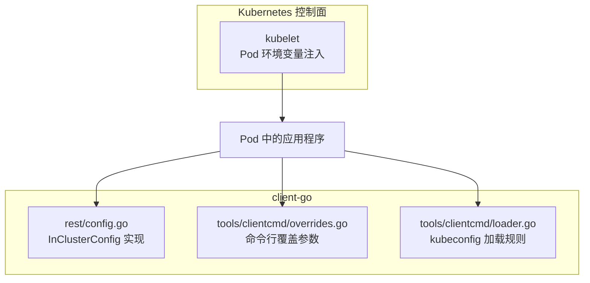
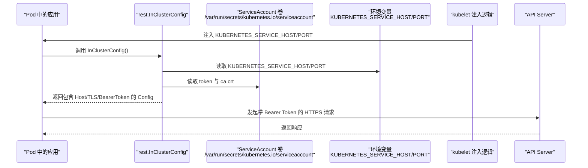
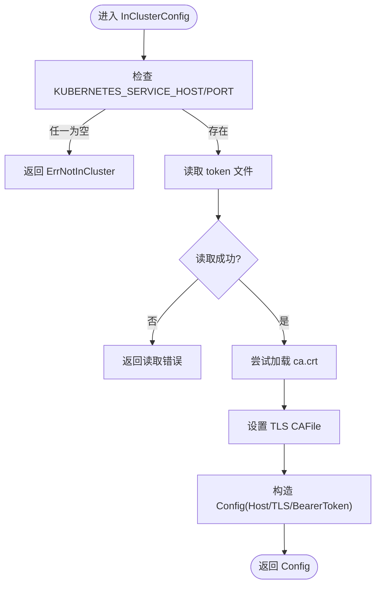
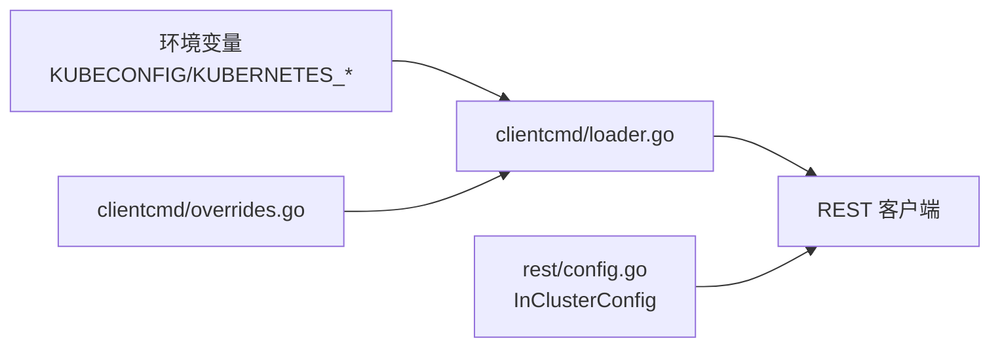

# 集群内配置

<cite>
**本文引用的文件**   
- [config.go](file://staging/src/k8s.io/client-go/rest/config.go)
- [overrides.go](file://staging/src/k8s.io/client-go/tools/clientcmd/overrides.go)
- [loader.go](file://staging/src/k8s.io/client-go/tools/clientcmd/loader.go)
- [kubelet_pods.go](file://pkg/kubelet/kubelet_pods.go)
</cite>

## 目录
1. [简介](#简介)
2. [项目结构](#项目结构)
3. [核心组件](#核心组件)
4. [架构总览](#架构总览)
5. [详细组件分析](#详细组件分析)
6. [依赖关系分析](#依赖关系分析)
7. [性能考虑](#性能考虑)
8. [故障排查指南](#故障排查指南)
9. [结论](#结论)
10. [附录](#附录)

## 简介
本指南面向在 Kubernetes 集群内部运行的应用，聚焦于“集群内配置”的完整技术说明。内容涵盖：
- InClusterConfig 的工作原理与自动发现机制
- ServiceAccount 的配置与使用（token 挂载、权限管理）
- 环境变量 KUBERNETES_SERVICE_HOST 与 KUBERNETES_SERVICE_PORT 的作用
- Pod 中运行客户端的完整配置示例
- 集群内网络访问的安全考虑与最佳实践
- 集群内配置的故障排查与调试方法

## 项目结构
围绕“集群内配置”，本仓库中与实现直接相关的代码主要位于 client-go 的 rest 与 clientcmd 子模块，以及 kubelet 的环境变量注入逻辑：
- staging/src/k8s.io/client-go/rest/config.go：提供 InClusterConfig 等集群内配置构建能力
- staging/src/k8s.io/client-go/tools/clientcmd/overrides.go：定义命令行覆盖参数（如 server、token、证书等）
- staging/src/k8s.io/client-go/tools/clientcmd/loader.go：定义 kubeconfig 加载规则与环境变量 KUBECONFIG 行为
- pkg/kubelet/kubelet_pods.go：负责向 Pod 注入 KUBERNETES_SERVICE_HOST 等环境变量



图表来源
- [config.go:542-577](file://staging/src/k8s.io/client-go/rest/config.go#L542-L577)
- [overrides.go:146-214](file://staging/src/k8s.io/client-go/tools/clientcmd/overrides.go#L146-L214)
- [loader.go:158-180](file://staging/src/k8s.io/client-go/tools/clientcmd/loader.go#L158-L180)
- [kubelet_pods.go:750-765](file://pkg/kubelet/kubelet_pods.go#L750-L765)

章节来源
- [config.go:542-577](file://staging/src/k8s.io/client-go/rest/config.go#L542-L577)
- [overrides.go:146-214](file://staging/src/k8s.io/client-go/tools/clientcmd/overrides.go#L146-L214)
- [loader.go:158-180](file://staging/src/k8s.io/client-go/tools/clientcmd/loader.go#L158-L180)
- [kubelet_pods.go:750-765](file://pkg/kubelet/kubelet_pods.go#L750-L765)

## 核心组件
- InClusterConfig：用于在 Pod 环境中自动发现 API Server 地址、读取 ServiceAccount token 与 CA 证书，并构造 REST 客户端配置。
- 环境变量注入：kubelet 将 KUBERNETES_SERVICE_HOST 和 KUBERNETES_SERVICE_PORT 注入到每个 Pod，作为 InClusterConfig 自动发现的依据。
- kubeconfig 加载与覆盖：通过 loader 与 overrides 支持从 KUBECONFIG 或命令行参数覆盖默认行为，便于本地开发与测试。

章节来源
- [config.go:542-577](file://staging/src/k8s.io/client-go/rest/config.go#L542-L577)
- [kubelet_pods.go:750-765](file://pkg/kubelet/kubelet_pods.go#L750-L765)
- [overrides.go:146-214](file://staging/src/k8s.io/client-go/tools/clientcmd/overrides.go#L146-L214)
- [loader.go:158-180](file://staging/src/k8s.io/client-go/tools/clientcmd/loader.go#L158-L180)

## 架构总览
下图展示了 Pod 内应用如何通过 InClusterConfig 自动发现 API Server，并使用 ServiceAccount 提供的 token 进行认证。



图表来源
- [config.go:542-577](file://staging/src/k8s.io/client-go/rest/config.go#L542-L577)
- [kubelet_pods.go:750-765](file://pkg/kubelet/kubelet_pods.go#L750-L765)

## 详细组件分析

### InClusterConfig 工作原理与自动发现机制
- 自动发现入口：InClusterConfig 函数会检查环境变量 KUBERNETES_SERVICE_HOST 与 KUBERNETES_SERVICE_PORT 是否已设置；若缺失则返回错误，表示不在集群环境。
- 服务地址构造：以 https://host:port 的形式拼接 API Server 地址。
- 认证与 TLS：
  - 从 /var/run/secrets/kubernetes.io/serviceaccount/token 读取 Bearer Token。
  - 尝试从 /var/run/secrets/kubernetes.io/serviceaccount/ca.crt 加载根 CA 证书；若失败仅记录日志而不中断流程（兼容历史行为）。
- 结果对象：返回包含 Host、TLSClientConfig（CAFile）、BearerToken 与 BearerTokenFile 的 Config。



图表来源
- [config.go:542-577](file://staging/src/k8s.io/client-go/rest/config.go#L542-L577)

章节来源
- [config.go:542-577](file://staging/src/k8s.io/client-go/rest/config.go#L542-L577)

### ServiceAccount 的配置与使用（token 挂载与权限管理）
- 默认挂载路径：
  - token 文件：/var/run/secrets/kubernetes.io/serviceaccount/token
  - CA 证书：/var/run/secrets/kubernetes.io/serviceaccount/ca.crt
- 自动挂载行为：
  - kubelet 在启动 Pod 时，会将 ServiceAccount 对应的 Secret 以只读卷形式挂载到上述路径。
  - 自 1.21 起，该 token 为限时、自动刷新，并在 Pod 删除时失效。
- 权限最小化原则：
  - 为应用创建专用的 ServiceAccount，并通过 Role/RoleBinding 授予最小必要权限。
  - 避免使用默认的 default ServiceAccount 或赋予过宽权限。
- 安全建议：
  - 不要将 token 暴露给容器进程之外的其他非信任进程。
  - 结合 PodSecurityPolicy/PSA 限制敏感卷挂载范围。

章节来源
- [config.go:542-577](file://staging/src/k8s.io/client-go/rest/config.go#L542-L577)

### 环境变量 KUBERNETES_SERVICE_HOST 与 KUBERNETES_SERVICE_PORT 的作用
- 作用：
  - 由 kubelet 注入到每个 Pod，作为 InClusterConfig 自动发现 API Server 地址的必要条件。
  - 若未设置，InClusterConfig 将无法工作并返回错误。
- 注入时机与保障：
  - kubelet 在服务列表同步完成后才允许构造环境变量，以避免早期竞态导致缺少 KUBERNETES_SERVICE_HOST。
- 替代方案：
  - 生产环境建议使用 DNS 名称访问 API Server，而非依赖环境变量。

章节来源
- [kubelet_pods.go:750-765](file://pkg/kubelet/kubelet_pods.go#L750-L765)
- [config.go:542-577](file://staging/src/k8s.io/client-go/rest/config.go#L542-L577)

### Pod 中运行客户端的完整配置示例
以下示例展示如何在 Pod 中启用 ServiceAccount 自动挂载，以便应用通过 InClusterConfig 访问 API Server。

- Pod 清单要点：
  - 指定 serviceAccountName（推荐使用专用 SA）。
  - 无需显式声明 volumes 与 volumeMounts，kubelet 会自动挂载 ServiceAccount 相关卷到标准路径。
  - 确保镜像与资源配额合理，避免启动失败影响认证流程。

```yaml
apiVersion: v1
kind: Pod
metadata:
  name: app-with-incluster-config
  namespace: default
spec:
  serviceAccountName: app-sa
  containers:
  - name: app
    image: your-image:tag
    command: ["your-app-binary"]
    resources:
      requests:
        memory: "128Mi"
        cpu: "100m"
      limits:
        memory: "256Mi"
        cpu: "200m"
```

- RBAC 示例（最小权限）：
  - 创建 Role，仅授予应用所需资源的 get/list/watch 等权限。
  - 通过 RoleBinding 将 Role 绑定到 app-sa。

章节来源
- [config.go:542-577](file://staging/src/k8s.io/client-go/rest/config.go#L542-L577)

### 集群内网络访问的安全考虑与最佳实践
- 强制 HTTPS：
  - InClusterConfig 默认使用 https://host:port 访问 API Server，确保传输加密。
- 证书校验：
  - 优先使用 ServiceAccount 提供的 ca.crt 进行服务器证书校验，避免跳过校验。
- 代理与压缩：
  - 可通过 clientcmd 的覆盖参数设置 ProxyURL 与 DisableCompression，但需评估对安全性与性能的影响。
- 限流与重试：
  - 合理设置 QPS/Burst 或使用自定义 RateLimiter，防止突发流量冲击 API Server。
- 用户代理与可观测性：
  - 保留默认 User-Agent 或添加业务标识，便于审计与问题定位。

章节来源
- [config.go:542-577](file://staging/src/k8s.io/client-go/rest/config.go#L542-L577)
- [overrides.go:196-205](file://staging/src/k8s.io/client-go/tools/clientcmd/overrides.go#L196-L205)

## 依赖关系分析
- InClusterConfig 依赖：
  - 环境变量：KUBERNETES_SERVICE_HOST、KUBERNETES_SERVICE_PORT
  - 文件系统：ServiceAccount token 与 CA 证书
- kubeconfig 加载与覆盖：
  - loader 根据 KUBECONFIG 环境变量或默认路径加载配置。
  - overrides 提供命令行参数覆盖（如 server、token、证书等），常用于本地开发。



图表来源
- [loader.go:158-180](file://staging/src/k8s.io/client-go/tools/clientcmd/loader.go#L158-L180)
- [overrides.go:146-214](file://staging/src/k8s.io/client-go/tools/clientcmd/overrides.go#L146-L214)
- [config.go:542-577](file://staging/src/k8s.io/client-go/rest/config.go#L542-L577)

章节来源
- [loader.go:158-180](file://staging/src/k8s.io/client-go/tools/clientcmd/loader.go#L158-L180)
- [overrides.go:146-214](file://staging/src/k8s.io/client-go/tools/clientcmd/overrides.go#L146-L214)
- [config.go:542-577](file://staging/src/k8s.io/client-go/rest/config.go#L542-L577)

## 性能考虑
- 限流策略：
  - 使用合理的 QPS/Burst 或自定义 RateLimiter，避免对 API Server 造成压力。
- 连接复用：
  - 共享 http.Client 可减少连接开销，提升吞吐。
- 压缩开关：
  - 在带宽受限场景可开启压缩，但会增加 CPU 消耗，需权衡。
- 超时与重试：
  - 设置合适的 Timeout，并结合指数退避重试策略提高鲁棒性。

[本节为通用指导，不直接分析具体文件]

## 故障排查指南
- 常见错误：
  - “无法加载集群内配置，必须定义 KUBERNETES_SERVICE_HOST 与 KUBERNETES_SERVICE_PORT”：检查 kubelet 是否正确注入环境变量。
  - “读取 token 文件失败”：确认 ServiceAccount 卷已正确挂载且路径存在。
  - “CA 证书加载失败”：查看日志输出，确认 ca.crt 是否存在且可读。
- 诊断步骤：
  - 在 Pod 中执行命令检查环境变量与文件路径。
  - 验证 ServiceAccount 的 RBAC 权限是否足够。
  - 使用 kubectl describe pod 查看事件与挂载信息。
- 参考实现：
  - InClusterConfig 的错误类型与处理逻辑。
  - kubelet 的环境变量注入与同步等待逻辑。

章节来源
- [config.go:542-577](file://staging/src/k8s.io/client-go/rest/config.go#L542-L577)
- [kubelet_pods.go:750-765](file://pkg/kubelet/kubelet_pods.go#L750-L765)

## 结论
通过 InClusterConfig 与 ServiceAccount 的自动化集成，应用在 Pod 中可以零配置地访问 API Server。为确保稳定性与安全，应：
- 保证环境变量与 ServiceAccount 卷的正确注入
- 遵循最小权限原则配置 RBAC
- 在生产环境优先使用 DNS 与证书校验
- 合理设置限流、超时与重试策略
- 建立完善的故障排查流程

[本节为总结性内容，不直接分析具体文件]

## 附录
- 相关常量与默认值：
  - DefaultQPS、DefaultBurst：默认限流参数
  - RecommendedConfigPathEnvVar：KUBECONFIG 环境变量名
- 关键路径与文件名：
  - token 文件：/var/run/secrets/kubernetes.io/serviceaccount/token
  - CA 证书：/var/run/secrets/kubernetes.io/serviceaccount/ca.crt

章节来源
- [config.go:47-52](file://staging/src/k8s.io/client-go/rest/config.go#L47-L52)
- [loader.go:38-50](file://staging/src/k8s.io/client-go/tools/clientcmd/loader.go#L38-L50)
- [config.go:542-577](file://staging/src/k8s.io/client-go/rest/config.go#L542-L577)