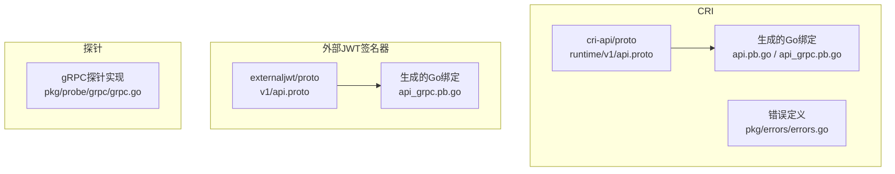
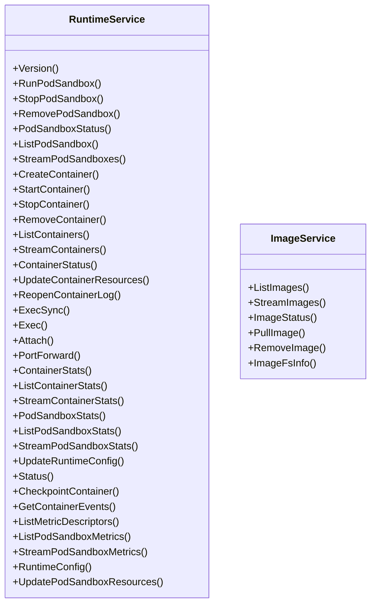
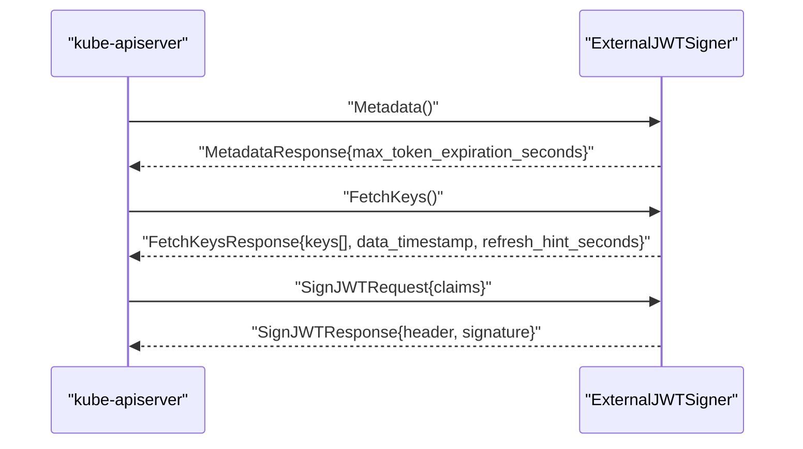
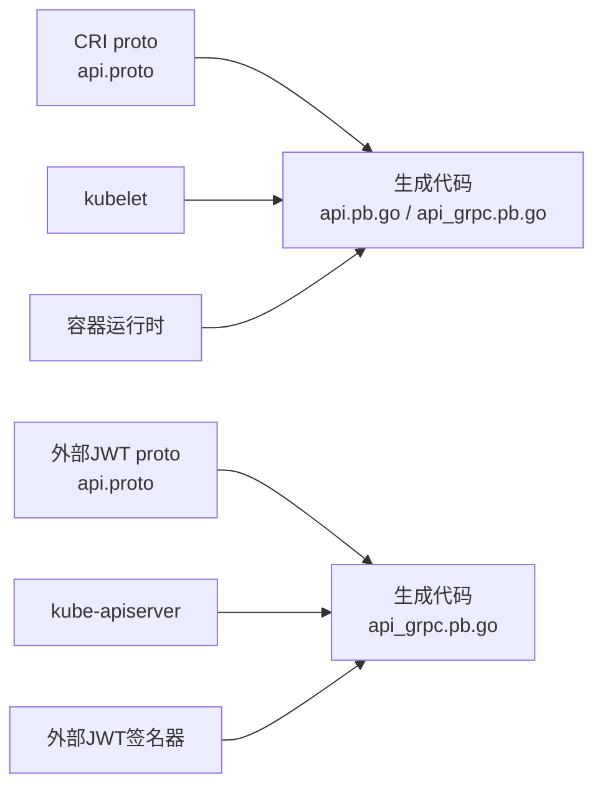
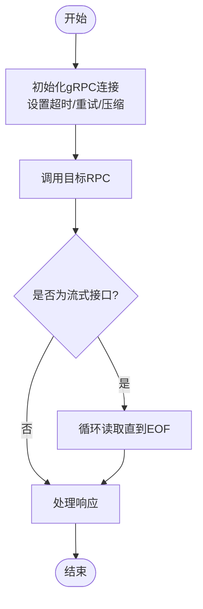

# gRPC API

<cite>
**本文引用的文件**   
- [api.proto](file://staging/src/k8s.io/cri-api/pkg/apis/runtime/v1/api.proto)
- [api_grpc.pb.go](file://staging/src/k8s.io/cri-api/pkg/apis/runtime/v1/api_grpc.pb.go)
- [api.pb.go](file://staging/src/k8s.io/cri-api/pkg/apis/runtime/v1/api.pb.go)
- [errors.go](file://staging/src/k8s.io/cri-api/pkg/errors/errors.go)
- [api.proto](file://staging/src/k8s.io/externaljwt/apis/v1/api.proto)
- [api_grpc.pb.go](file://staging/src/k8s.io/externaljwt/apis/v1/api_grpc.pb.go)
- [grpc.go](file://pkg/probe/grpc/grpc.go)
</cite>

## 目录
1. [简介](#简介)
2. [项目结构](#项目结构)
3. [核心组件](#核心组件)
4. [架构总览](#架构总览)
5. [详细组件分析](#详细组件分析)
6. [依赖关系分析](#依赖关系分析)
7. [性能与传输特性](#性能与传输特性)
8. [客户端初始化、连接管理与调用示例](#客户端初始化连接管理与调用示例)
9. [错误码、重试与超时配置](#错误码重试与超时配置)
10. [监控与调试](#监控与调试)
11. [与REST API的互补关系与适用场景](#与rest-ap的互补关系与适用场景)
12. [结论](#结论)

## 简介
本文件面向Kubernetes生态中的gRPC接口，聚焦以下两类关键服务：
- CRI（Container Runtime Interface）：kubelet与容器运行时之间的标准gRPC协议，用于沙箱与容器的生命周期管理、镜像操作、统计与事件等。
- 外部JWT签名器（External JWT Signer）：kube-apiserver通过本地Unix域套接字调用的gRPC服务，用于为ServiceAccount签发JWT并获取公钥元数据。

文档将说明协议定义位置、消息格式与序列化方式、传输协议选择、客户端实现要点、错误码与重试策略、性能与监控建议，以及与REST API的互补关系。

## 项目结构
- CRI协议定义位于 staging 模块中，包含proto源文件与生成的Go绑定。
- 外部JWT签名器协议定义同样位于 staging 模块，提供v1版本接口。
- gRPC健康探针实现位于 pkg/probe/grpc。



图表来源
- [api.proto:1-2280](file://staging/src/k8s.io/cri-api/pkg/apis/runtime/v1/api.proto#L1-L2280)
- [api.pb.go](file://staging/src/k8s.io/cri-api/pkg/apis/runtime/v1/api.pb.go)
- [api_grpc.pb.go](file://staging/src/k8s.io/cri-api/pkg/apis/runtime/v1/api_grpc.pb.go)
- [errors.go](file://staging/src/k8s.io/cri-api/pkg/errors/errors.go)
- [api.proto:1-114](file://staging/src/k8s.io/externaljwt/apis/v1/api.proto#L1-L114)
- [api_grpc.pb.go](file://staging/src/k8s.io/externaljwt/apis/v1/api_grpc.pb.go)
- [grpc.go](file://pkg/probe/grpc/grpc.go)

章节来源
- [api.proto:1-2280](file://staging/src/k8s.io/cri-api/pkg/apis/runtime/v1/api.proto#L1-L2280)
- [api.proto:1-114](file://staging/src/k8s.io/externaljwt/apis/v1/api.proto#L1-L114)

## 核心组件
- CRI RuntimeService：提供沙箱与容器生命周期、执行、端口转发、资源更新、状态与指标、事件订阅等能力。
- CRI ImageService：提供镜像列表、拉取、删除、状态查询与镜像文件系统信息。
- 外部JWT签名器 ExternalJWTSigner：提供JWT签名、公钥获取与元数据交换。

章节来源
- [api.proto:24-247](file://staging/src/k8s.io/cri-api/pkg/apis/runtime/v1/api.proto#L24-L247)
- [api.proto:27-48](file://staging/src/k8s.io/externaljwt/apis/v1/api.proto#L27-L48)

## 架构总览
下图展示了kubelet与容器运行时的交互（CRI），以及kube-apiserver与外部JWT签名器的交互。

```mermaid
graph TB
Kubelet["kubelet"] --> |gRPC(UNIX/TCP)| CRI["容器运行时(CRI)<br/>RuntimeService/ImageService"]
APIServer["kube-apiserver"] --> |gRPC(UNIX)| Signer["外部JWT签名器<br/>ExternalJWTSigner"]
```

图表来源
- [api.proto:24-247](file://staging/src/k8s.io/cri-api/pkg/apis/runtime/v1/api.proto#L24-L247)
- [api.proto:27-48](file://staging/src/k8s.io/externaljwt/apis/v1/api.proto#L27-L48)

## 详细组件分析

### CRI协议与服务
- 服务与方法
  - RuntimeService：Version、RunPodSandbox、StopPodSandbox、RemovePodSandbox、PodSandboxStatus、ListPodSandbox、StreamPodSandboxes、CreateContainer、StartContainer、StopContainer、RemoveContainer、ListContainers、StreamContainers、ContainerStatus、UpdateContainerResources、ReopenContainerLog、ExecSync、Exec、Attach、PortForward、ContainerStats、ListContainerStats、StreamContainerStats、PodSandboxStats、ListPodSandboxStats、StreamPodSandboxStats、UpdateRuntimeConfig、Status、CheckpointContainer、GetContainerEvents、ListMetricDescriptors、ListPodSandboxMetrics、StreamPodSandboxMetrics、RuntimeConfig、UpdatePodSandboxResources。
  - ImageService：ListImages、StreamImages、ImageStatus、PullImage、RemoveImage、ImageFsInfo。
- 流式接口
  - 针对大规模节点上的列表与指标采集，CRI提供了多组streaming RPC，以避免单次消息过大导致的限制问题。
- 消息与枚举
  - 定义了DNS配置、端口映射、挂载、命名空间模式、安全上下文、Linux/Windows特定配置、状态与过滤条件等大量消息类型。
- 生成代码
  - 由proto生成对应的Go结构与gRPC桩代码，供kubelet与运行时实现使用。



图表来源
- [api.proto:24-247](file://staging/src/k8s.io/cri-api/pkg/apis/runtime/v1/api.proto#L24-L247)

章节来源
- [api.proto:24-247](file://staging/src/k8s.io/cri-api/pkg/apis/runtime/v1/api.proto#L24-L247)
- [api.pb.go](file://staging/src/k8s.io/cri-api/pkg/apis/runtime/v1/api.pb.go)
- [api_grpc.pb.go](file://staging/src/k8s.io/cri-api/pkg/apis/runtime/v1/api_grpc.pb.go)

### 外部JWT签名器协议与服务
- 服务与方法
  - ExternalJWTSigner.Sign：对已序列化的JWT载荷进行签名，返回header与signature片段。
  - ExternalJWTSigner.FetchKeys：返回受信任的公钥集合，支持刷新提示与时间戳。
  - ExternalJWTSigner.Metadata：启动时调用一次，告知最大令牌有效期等元数据。
- 消息与约束
  - header必须包含alg、kid、typ；typ固定为“JWT”；kid非空且对应公钥需参与OIDC发现；alg需在API Server支持的算法集合内。
  - Key包含key_id、PKIX序列化的公钥字节，以及是否排除在OIDC发现之外的标记。
  - MetadataResponse提供max_token_expiration_seconds，用于API Server默认与校验令牌过期时间。



图表来源
- [api.proto:27-114](file://staging/src/k8s.io/externaljwt/apis/v1/api.proto#L27-L114)

章节来源
- [api.proto:27-114](file://staging/src/k8s.io/externaljwt/apis/v1/api.proto#L27-L114)
- [api_grpc.pb.go](file://staging/src/k8s.io/externaljwt/apis/v1/api_grpc.pb.go)

## 依赖关系分析
- CRI与外部JWT签名器均基于protobuf与gRPC，使用proto3语法。
- kubelet作为CRI客户端，容器运行时作为服务端；kube-apiserver作为外部JWT签名器客户端，签名器进程作为服务端。
- 两者均通过生成的Go绑定进行编译期类型检查与高效序列化。



图表来源
- [api.proto:1-2280](file://staging/src/k8s.io/cri-api/pkg/apis/runtime/v1/api.proto#L1-L2280)
- [api.pb.go](file://staging/src/k8s.io/cri-api/pkg/apis/runtime/v1/api.pb.go)
- [api_grpc.pb.go](file://staging/src/k8s.io/cri-api/pkg/apis/runtime/v1/api_grpc.pb.go)
- [api.proto:1-114](file://staging/src/k8s.io/externaljwt/apis/v1/api.proto#L1-L114)
- [api_grpc.pb.go](file://staging/src/k8s.io/externaljwt/apis/v1/api_grpc.pb.go)

章节来源
- [api.proto:1-2280](file://staging/src/k8s.io/cri-api/pkg/apis/runtime/v1/api.proto#L1-L2280)
- [api.proto:1-114](file://staging/src/k8s.io/externaljwt/apis/v1/api.proto#L1-L114)

## 性能与传输特性
- 序列化与编码
  - 使用protobuf二进制编码，具备高吞吐与低开销优势。
- 流式传输
  - CRI提供多组streaming RPC以应对大规模对象列表与指标采集，避免单次响应过大。
- 传输协议
  - CRI通常通过UNIX域套接字或TCP传输；外部JWT签名器明确通过本地UNIX域套接字提供服务。
- 背压与限流
  - 结合gRPC的流控与客户端侧并发控制，可缓解突发负载。
- 压缩
  - 可在gRPC层启用压缩以降低带宽占用，但会增加CPU消耗，需权衡。

章节来源
- [api.proto:51-191](file://staging/src/k8s.io/cri-api/pkg/apis/runtime/v1/api.proto#L51-L191)
- [api.proto:26-48](file://staging/src/k8s.io/externaljwt/apis/v1/api.proto#L26-L48)

## 客户端初始化、连接管理与调用示例
- 通用步骤
  - 加载生成的gRPC桩代码。
  - 建立到目标地址的连接（UNIX域套接字或TCP）。
  - 创建带超时的上下文，构造客户端实例。
  - 调用具体RPC方法，处理响应与错误。
- CRI客户端
  - 使用RuntimeServiceClient与ImageServiceClient分别访问运行时与镜像相关能力。
  - 对于流式接口，按协议要求读取流直至EOF，注意整体超时与部分结果丢弃策略。
- 外部JWT签名器客户端
  - 使用ExternalJWTSignerClient，依次调用Metadata、FetchKeys与Sign。
  - 注意header与signature均为URL-safe base64片段，需按JWT三段式拼接。



[此图为概念流程，不直接映射具体源码文件]

## 错误码、重试与超时配置
- 错误码
  - CRI使用gRPC标准错误码体系，并在cri-api的错误定义中提供语义化封装，便于上层统一处理。
- 重试策略
  - 仅对幂等且无副作用的RPC进行重试（如只读查询、状态获取）。
  - 对写操作需谨慎，必要时采用指数退避与抖动。
- 超时配置
  - 为每个请求设置合理的deadline，尤其是长耗时操作（如拉取镜像、流式列表）。
  - 对流式接口，除单条消息超时外，还需设置整体流超时。
- 健康检查
  - 可使用gRPC探针进行快速连通性与存活检测。

章节来源
- [errors.go](file://staging/src/k8s.io/cri-api/pkg/errors/errors.go)
- [grpc.go](file://pkg/probe/grpc/grpc.go)

## 监控与调试
- 指标
  - 暴露gRPC层面的延迟、吞吐、错误率、流长度分布等指标。
  - 对CRI的流式接口，记录每次流的条目数与耗时，辅助定位大对象瓶颈。
- 日志
  - 记录关键RPC的请求ID、目标端点、耗时与错误码，便于链路追踪。
- 调试工具
  - 使用gRPC探针验证服务可达性。
  - 借助抓包与trace工具分析端到端延迟与丢包情况。

章节来源
- [grpc.go](file://pkg/probe/grpc/grpc.go)

## 与REST API的互补关系与适用场景
- REST API
  - 适合人类可读、浏览器友好、跨语言通用的管理面交互。
  - 天然支持HTTP缓存、代理与中间件生态。
- gRPC
  - 适合高性能、强类型、双向流与内部组件间通信。
  - 在kubelet与运行时之间、API Server与插件之间尤为合适。
- 组合使用
  - 对外暴露REST/OpenAPI，对内使用gRPC提升效率与稳定性。
  - 通过统一的认证授权与审计机制保障一致性。

[本节为概念性内容，不直接分析具体文件]

## 结论
Kubernetes通过CRI与外部JWT签名器等gRPC服务，实现了高性能、强类型的内部通信。基于protobuf与gRPC的协议设计，配合流式接口与完善的错误码体系，能够满足大规模集群下的可扩展性与可靠性需求。在实际工程中，应合理配置超时、重试与压缩，完善监控与调试手段，并与REST API形成互补，构建稳健的分布式系统。