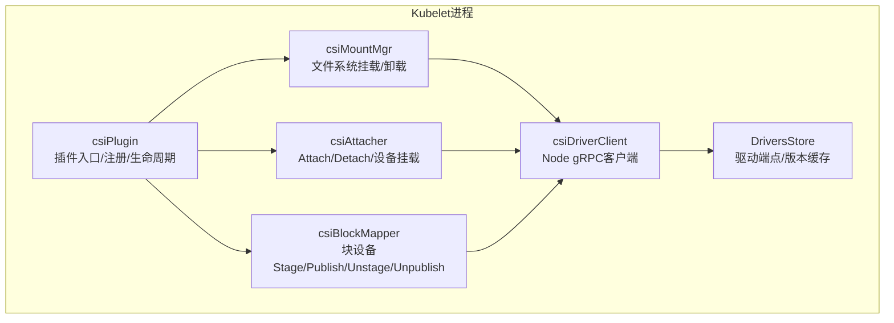
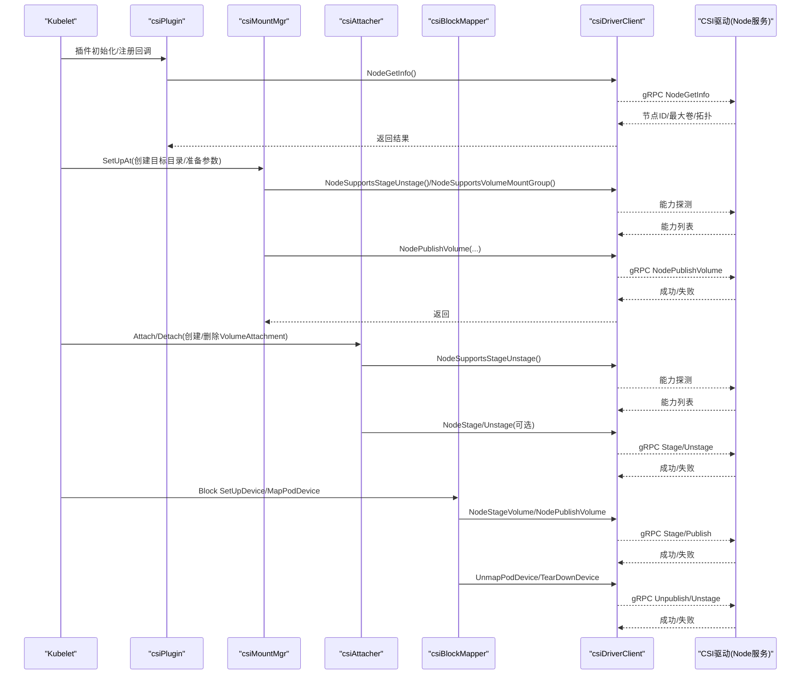
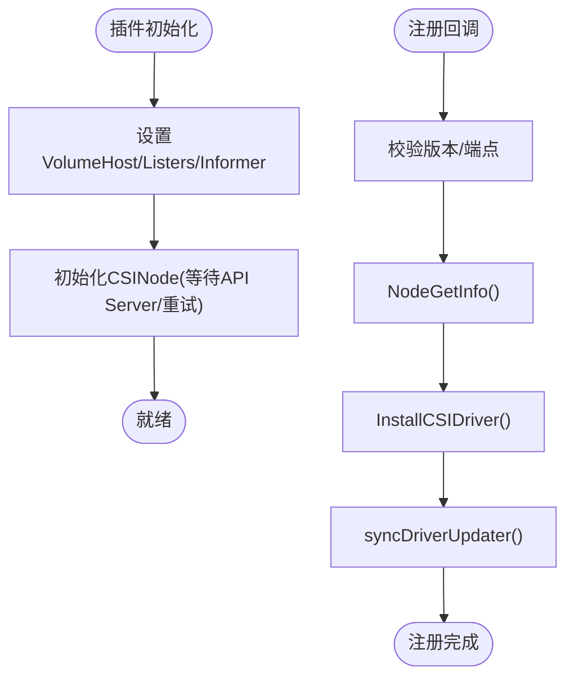
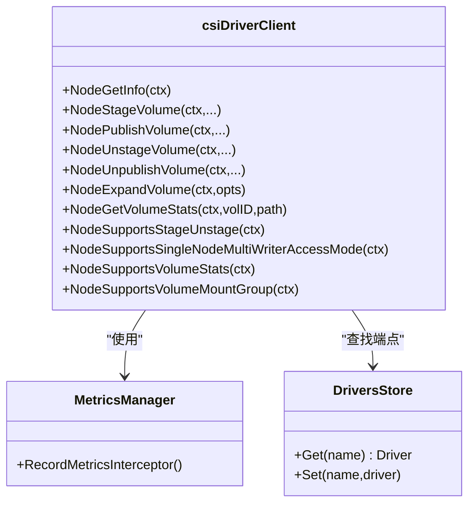
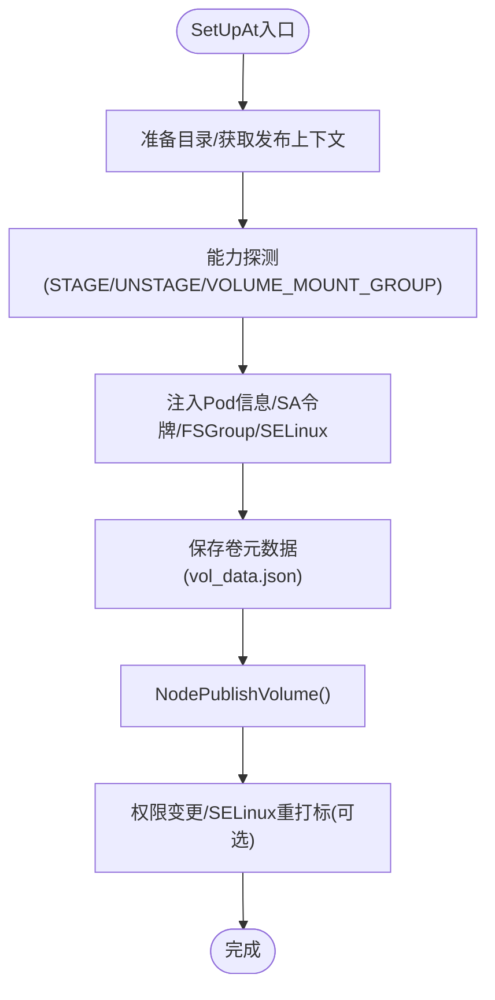
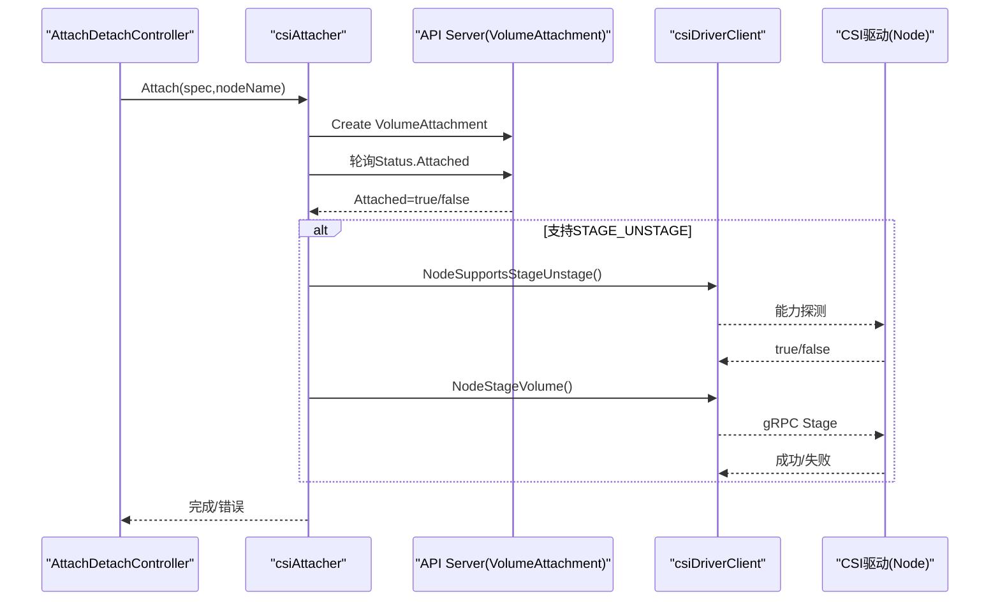
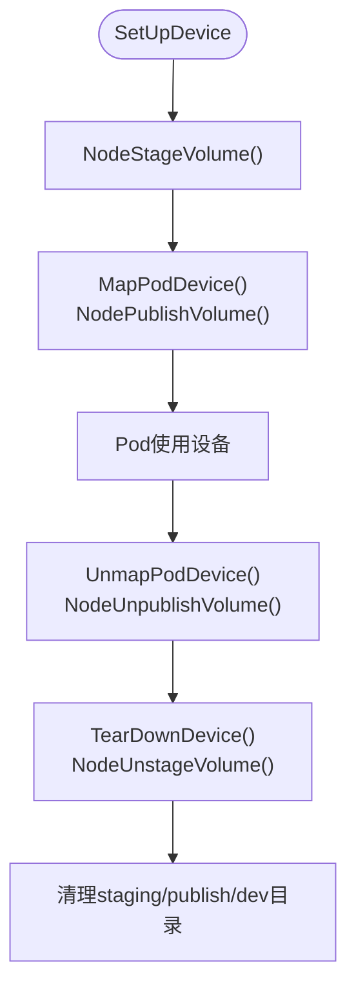
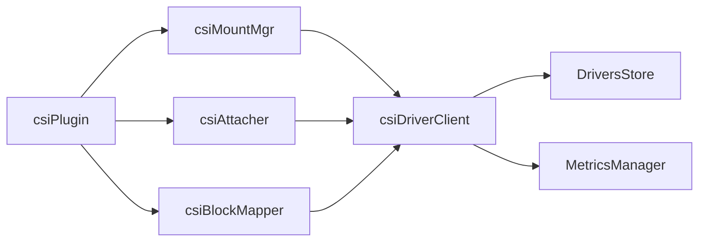

# CSI插件架构

<cite>
**本文引用的文件**   
- [csi_plugin.go](file://pkg/volume/csi/csi_plugin.go)
- [csi_client.go](file://pkg/volume/csi/csi_client.go)
- [csi_attacher.go](file://pkg/volume/csi/csi_attacher.go)
- [csi_mounter.go](file://pkg/volume/csi/csi_mounter.go)
- [csi_block.go](file://pkg/volume/csi/csi_block.go)
- [csi_drivers_store.go](file://pkg/volume/csi/csi_drivers_store.go)
</cite>

## 目录
1. [简介](#简介)
2. [项目结构](#项目结构)
3. [核心组件](#核心组件)
4. [架构总览](#架构总览)
5. [详细组件分析](#详细组件分析)
6. [依赖关系分析](#依赖关系分析)
7. [性能与可扩展性](#性能与可扩展性)
8. [故障诊断与排错指南](#故障诊断与排错指南)
9. [结论](#结论)
10. [附录](#附录)

## 简介
本文件面向Kubernetes CSI（Container Storage Interface）插件架构，聚焦于Node服务、Controller服务和Identity服务的职责分工；CSI驱动开发流程（gRPC接口实现、插件注册与生命周期管理）；主流存储系统（NFS、Ceph、vSphere等）的CSI驱动配置要点；CSI迁移机制与传统Volume插件兼容性处理；以及调试工具、日志分析与故障诊断方法。文档基于仓库中Kubelet侧CSI插件实现进行深度解析，并给出可视化架构图与流程图，帮助读者快速理解从Pod挂载到设备映射的完整链路。

## 项目结构
本节聚焦Kubelet内CSI插件相关源码组织与职责划分：
- csi_plugin.go：CSI插件入口、注册处理器、生命周期初始化、Mounter/Attacher/BlockMapper工厂方法
- csi_client.go：CSI Node gRPC客户端封装、能力探测、指标采集、错误分类
- csi_attacher.go：Attach/Detach流程、VolumeAttachment状态轮询、设备挂载路径计算
- csi_mounter.go：文件系统挂载流程、FSGroup/SELinux注入、发布上下文获取、卸载清理
- csi_block.go：块设备Stage/Publish/Unstage/Unpublish全流程、全局与Pod级映射路径管理
- csi_drivers_store.go：节点本地已注册CSI驱动端点与版本信息缓存

图表来源
- [csi_plugin.go:66-170](file://pkg/volume/csi/csi_plugin.go#L66-L170)
- [csi_mounter.go:64-120](file://pkg/volume/csi/csi_mounter.go#L64-L120)
- [csi_attacher.go:48-140](file://pkg/volume/csi/csi_attacher.go#L48-L140)
- [csi_block.go:86-141](file://pkg/volume/csi/csi_block.go#L86-L141)
- [csi_client.go:109-170](file://pkg/volume/csi/csi_client.go#L109-L170)
- [csi_drivers_store.go:25-80](file://pkg/volume/csi/csi_drivers_store.go#L25-L80)

章节来源
- [csi_plugin.go:66-170](file://pkg/volume/csi/csi_plugin.go#L66-L170)
- [csi_client.go:109-170](file://pkg/volume/csi/csi_client.go#L109-L170)
- [csi_attacher.go:48-140](file://pkg/volume/csi/csi_attacher.go#L48-L140)
- [csi_mounter.go:64-120](file://pkg/volume/csi/csi_mounter.go#L64-L120)
- [csi_block.go:86-141](file://pkg/volume/csi/csi_block.go#L86-L141)
- [csi_drivers_store.go:25-80](file://pkg/volume/csi/csi_drivers_store.go#L25-L80)

## 核心组件
- 插件入口与注册
  - 通过ProbeVolumePlugins暴露插件名，使用RegistrationHandler对接Kubelet插件watcher，完成ValidatePlugin/RegisterPlugin/DeRegisterPlugin生命周期回调
  - 注册时调用NodeGetInfo获取节点ID、最大卷数、拓扑信息，并写入本地DriversStore与NodeInfoManager
- gRPC客户端
  - 封装Node服务所有RPC：NodeGetInfo、NodeStage/Unstage、NodePublish/Unpublish、NodeExpandVolume、NodeGetVolumeStats、能力探测
  - 自动选择是否支持SINGLE_NODE_MULTI_WRITER访问模式，统一将K8s访问模式映射为CSI v1 AccessMode
- 挂载器（文件系统）
  - SetUpAt负责创建目标目录、准备发布上下文、可选Stage路径、注入Pod信息与ServiceAccount Token、FSGroup/SELinux策略处理，最终调用NodePublishVolume
  - TearDownAt调用NodeUnpublishVolume并清理挂载目录与元数据
- 附加器（Attach/Detach）
  - 在外部控制器上下文中创建/删除VolumeAttachment对象，轮询其Attached/Detached状态
  - 若驱动支持STAGE_UNSTAGE_VOLUME，则执行MountDevice/UnmountDevice以调用NodeStage/Unstage
- 块设备映射器
  - 维护全局map路径、staging/publish路径与Pod设备映射路径，按顺序执行Stage→Publish→Map→Unmap→Unstage→Cleanup

章节来源
- [csi_plugin.go:75-170](file://pkg/volume/csi/csi_plugin.go#L75-L170)
- [csi_client.go:42-170](file://pkg/volume/csi/csi_client.go#L42-L170)
- [csi_mounter.go:99-361](file://pkg/volume/csi/csi_mounter.go#L99-L361)
- [csi_attacher.go:63-170](file://pkg/volume/csi/csi_attacher.go#L63-L170)
- [csi_block.go:143-204](file://pkg/volume/csi/csi_block.go#L143-L204)

## 架构总览
下图展示Kubelet侧CSI插件与CSI驱动Node服务之间的交互关系，包括注册、能力探测、挂载与块设备映射的关键路径。

图表来源
- [csi_plugin.go:118-170](file://pkg/volume/csi/csi_plugin.go#L118-L170)
- [csi_client.go:172-209](file://pkg/volume/csi/csi_client.go#L172-L209)
- [csi_mounter.go:184-361](file://pkg/volume/csi/csi_mounter.go#L184-L361)
- [csi_attacher.go:264-411](file://pkg/volume/csi/csi_attacher.go#L264-L411)
- [csi_block.go:279-340](file://pkg/volume/csi/csi_block.go#L279-L340)

## 详细组件分析

### 组件一：csiPlugin（插件入口与注册）
- 职责
  - 提供插件名、CanSupport、RequiresRemount、NewMounter/NewUnmounter、NewAttacher/NewDetacher、NewBlockVolumeMapper等
  - 通过RegistrationHandler对接Kubelet插件watcher，完成新驱动的验证、注册与注销
  - 初始化CSINode、可变的CSINode Allocatable计数更新、迁移驱动标记
- 关键流程
  - ValidatePlugin/RegisterPlugin：校验支持的CSI版本、记录端点与最高版本、调用NodeGetInfo、安装到NodeInfoManager、触发CSINode同步
  - DeRegisterPlugin：移除驱动、触发CSINode同步
  - Init：设置Listers、Informer、TokenGetter，初始化NodeInfoManager与CSINode初始化协程

图表来源
- [csi_plugin.go:281-359](file://pkg/volume/csi/csi_plugin.go#L281-L359)
- [csi_plugin.go:105-170](file://pkg/volume/csi/csi_plugin.go#L105-L170)

章节来源
- [csi_plugin.go:66-170](file://pkg/volume/csi/csi_plugin.go#L66-L170)
- [csi_plugin.go:281-429](file://pkg/volume/csi/csi_plugin.go#L281-L429)

### 组件二：csiClient（Node gRPC客户端）
- 职责
  - 封装Node服务所有RPC，包含能力探测、访问模式映射、指标拦截、错误分类
  - 提供带缓存的csiClientGetter，避免重复创建连接
- 关键点
  - 访问模式映射：根据驱动是否支持SINGLE_NODE_MULTI_WRITER，选择不同映射函数
  - 错误分类：区分“不确定进度”与“最终错误”，影响重试与清理策略
  - 指标：通过UnaryInterceptor记录RPC指标

图表来源
- [csi_client.go:109-170](file://pkg/volume/csi/csi_client.go#L109-L170)
- [csi_client.go:482-530](file://pkg/volume/csi/csi_client.go#L482-L530)
- [csi_client.go:714-736](file://pkg/volume/csi/csi_client.go#L714-L736)
- [csi_drivers_store.go:25-80](file://pkg/volume/csi/csi_drivers_store.go#L25-L80)

章节来源
- [csi_client.go:42-170](file://pkg/volume/csi/csi_client.go#L42-L170)
- [csi_client.go:482-530](file://pkg/volume/csi/csi_client.go#L482-L530)
- [csi_client.go:714-736](file://pkg/volume/csi/csi_client.go#L714-L736)
- [csi_drivers_store.go:25-80](file://pkg/volume/csi/csi_drivers_store.go#L25-L80)

### 组件三：csiMountMgr（文件系统挂载）
- 职责
  - SetUpAt：准备目录、获取发布上下文、注入Pod信息与服务账户令牌、FSGroup/SELinux策略、调用NodePublishVolume
  - TearDownAt：调用NodeUnpublishVolume并清理挂载目录与元数据
- 关键点
  - FSGroup：若驱动不支持VOLUME_MOUNT_GROUP，则由Kubelet应用权限变更
  - SELinux：根据特性开关与驱动支持，决定是否添加SELinux标签选项
  - 幂等与恢复：对不确定进度错误进行特殊处理，避免误删已挂载内容

图表来源
- [csi_mounter.go:99-361](file://pkg/volume/csi/csi_mounter.go#L99-L361)

章节来源
- [csi_mounter.go:99-361](file://pkg/volume/csi/csi_mounter.go#L99-L361)
- [csi_mounter.go:434-472](file://pkg/volume/csi/csi_mounter.go#L434-L472)

### 组件四：csiAttacher（Attach/Detach与设备挂载）
- 职责
  - 在外部控制器上下文中创建/删除VolumeAttachment，轮询Attached/Detached状态
  - 若驱动支持STAGE_UNSTAGE_VOLUME，则执行MountDevice/UnmountDevice以调用NodeStage/Unstage
- 关键点
  - 路径计算：makeDeviceMountPath生成全局设备挂载路径
  - 超时与退避：指数退避等待Attach/Detach完成
  - 错误处理：区分“未找到”、“正在删除”、“驱动报错”等状态

图表来源
- [csi_attacher.go:63-170](file://pkg/volume/csi/csi_attacher.go#L63-L170)
- [csi_attacher.go:264-411](file://pkg/volume/csi/csi_attacher.go#L264-L411)

章节来源
- [csi_attacher.go:63-170](file://pkg/volume/csi/csi_attacher.go#L63-L170)
- [csi_attacher.go:264-411](file://pkg/volume/csi/csi_attacher.go#L264-L411)

### 组件五：csiBlockMapper（块设备映射）
- 职责
  - 管理全局map路径、staging/publish路径与Pod设备映射路径
  - 按序执行Stage→Publish→Map→Unmap→Unstage→Cleanup
- 关键点
  - 路径约定：plugins/kubernetes.io/csi/volumeDevices/{specName}/{dev|staging|publish}
  - 幂等清理：TearDownDevice后清理孤儿文件与目录

图表来源
- [csi_block.go:143-204](file://pkg/volume/csi/csi_block.go#L143-L204)
- [csi_block.go:279-340](file://pkg/volume/csi/csi_block.go#L279-L340)
- [csi_block.go:400-475](file://pkg/volume/csi/csi_block.go#L400-L475)

章节来源
- [csi_block.go:86-141](file://pkg/volume/csi/csi_block.go#L86-L141)
- [csi_block.go:279-340](file://pkg/volume/csi/csi_block.go#L279-L340)
- [csi_block.go:400-475](file://pkg/volume/csi/csi_block.go#L400-L475)

## 依赖关系分析
- 组件耦合
  - csiPlugin聚合Mounter/Attacher/BlockMapper工厂方法，并通过csiClient与CSI驱动通信
  - csiClient依赖DriversStore获取驱动端点，依赖MetricsManager记录指标
  - Mounter/Attacher/BlockMapper均通过csiClientGetter懒加载并复用csiDriverClient实例
- 外部依赖
  - API Server：VolumeAttachment、CSIDriver、Secret等资源的读写
  - CSI驱动：Node服务gRPC接口
- 潜在循环
  - 当前实现无直接循环依赖，组件间通过接口与getter解耦

图表来源
- [csi_plugin.go:66-170](file://pkg/volume/csi/csi_plugin.go#L66-L170)
- [csi_client.go:109-170](file://pkg/volume/csi/csi_client.go#L109-L170)
- [csi_drivers_store.go:25-80](file://pkg/volume/csi/csi_drivers_store.go#L25-L80)

章节来源
- [csi_plugin.go:66-170](file://pkg/volume/csi/csi_plugin.go#L66-L170)
- [csi_client.go:109-170](file://pkg/volume/csi/csi_client.go#L109-L170)
- [csi_drivers_store.go:25-80](file://pkg/volume/csi/csi_drivers_store.go#L25-L80)

## 性能与可扩展性
- 连接复用
  - csiClientGetter采用双检锁缓存，减少频繁创建gRPC连接开销
- 能力探测优化
  - 按需探测NodeSupportsStageUnstage/NodeSupportsVolumeMountGroup等能力，避免不必要的Stage/FSGroup操作
- 指标与可观测性
  - UnaryInterceptor记录RPC指标，便于定位慢调用与异常
- 扩展建议
  - 针对高频路径（如NodePublish/Unpublish）增加批量或异步化能力
  - 结合CSINodeAllocatable动态更新，提升调度准确性

[本节为通用指导，不直接分析具体文件]

## 故障诊断与排错指南
- 常见问题定位
  - 插件注册失败：检查ValidatePlugin/RegisterPlugin日志，确认端点可达、版本兼容、NodeGetInfo返回正常
  - 挂载失败：查看SetUpAt阶段错误，关注发布上下文获取、Secret读取、FSGroup/SELinux策略、NodePublishVolume返回码
  - 块设备问题：核对Stage/Publish/Unstage/Unpublish顺序与路径存在性，检查孤儿文件清理逻辑
  - Attach/Detach卡住：检查VolumeAttachment状态、驱动AttachError/DetachError、超时与退避策略
- 关键错误分类
  - 不确定进度错误：表示操作可能仍在进行中，不应立即清理资源
  - 最终错误：表示操作未开始或明确失败，可安全清理
- 日志关键字
  - “calling Node* rpc”、“failed to get publishContext”、“STAGE_UNSTAGE_VOLUME capability not set”、“timed out waiting for external-attacher”

章节来源
- [csi_client.go:714-736](file://pkg/volume/csi/csi_client.go#L714-L736)
- [csi_mounter.go:99-361](file://pkg/volume/csi/csi_mounter.go#L99-L361)
- [csi_attacher.go:485-524](file://pkg/volume/csi/csi_attacher.go#L485-L524)

## 结论
Kubelet侧CSI插件通过清晰的组件分层与接口抽象，实现了与CSI驱动Node服务的高效协作。注册与生命周期管理、能力探测、挂载与块设备映射、Attach/Detach流程均具备完善的错误分类与恢复策略。结合指标与日志，可有效支撑大规模集群中的存储稳定性与可观测性。

[本节为总结性内容，不直接分析具体文件]

## 附录

### CSI规范服务角色说明
- Node服务：负责卷的Stage/Publish/Unstage/Unpublish、容量统计、能力探测等节点侧操作
- Controller服务：负责卷的创建、删除、克隆、快照等控制面操作
- Identity服务：提供驱动名称、版本、能力等信息，供Kubelet与外部组件发现

[本节为概念性说明，不直接分析具体文件]

### CSI驱动开发流程要点
- 实现Node/Controller/Identity三个gRPC服务
- 在节点侧通过sidecar registrar注册驱动端点，Kubelet接收注册回调并完成NodeGetInfo与能力探测
- 遵循错误分类与幂等语义，确保Stage/Publish/Unstage/Unpublish的可恢复性

[本节为概念性说明，不直接分析具体文件]

### 主流存储系统CSI驱动配置示例（要点）
- NFS
  - 使用nfs.csi.k8s.io驱动，配置Server与Share，必要时设置ReadOnlyMany访问模式
  - 注意SELinux与FSGroup策略，确保多Pod共享时的权限一致
- Ceph
  - 使用ceph.csi.ceph.com驱动，配置pool、namespace、monitors与认证Secret
  - 支持RBD块与CephFS文件系统，合理设置accessModes与mountOptions
- vSphere
  - 使用csi.vsphere.vmware.com驱动，配置vCenter地址、集群、数据存储与证书
  - 支持多种accessModes，结合StorageClass定义topology与容量上限

[本节为概念性说明，不直接分析具体文件]

### CSI迁移与传统Volume插件兼容性
- 迁移标志与翻译库
  - 代码中包含对GCEPD、AWSEBS、Cinder、AzureDisk、AzureFile、VSphere、Portworx等in-tree插件的迁移标记，用于CSINode初始化与能力判断
- 行为差异
  - 迁移模式下，Kubelet通过CSI路径完成原in-tree插件的功能，需保证CSIDriver声明与能力匹配
  - 对于Inline PV场景，CSI翻译API会填充必要的字段（如AccessMode、MountOptions）

章节来源
- [csi_plugin.go:325-350](file://pkg/volume/csi/csi_plugin.go#L325-L350)