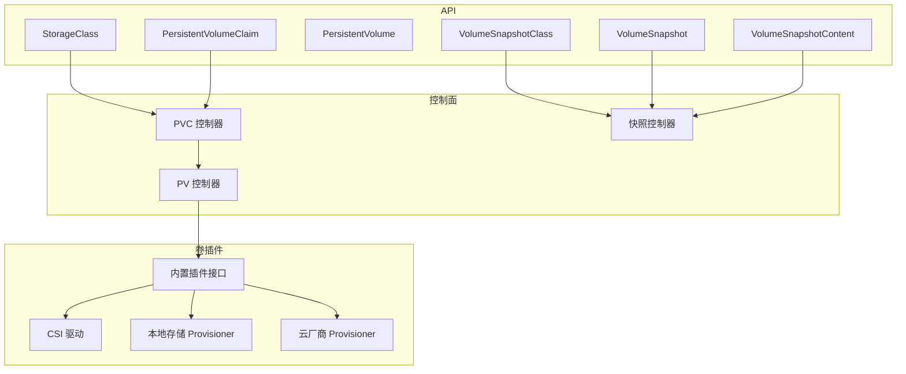
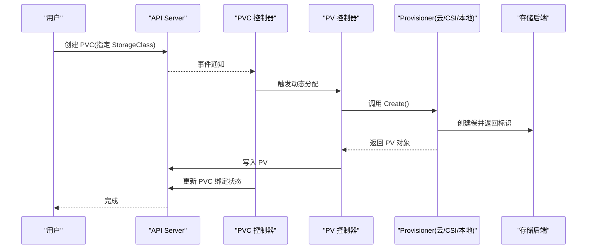
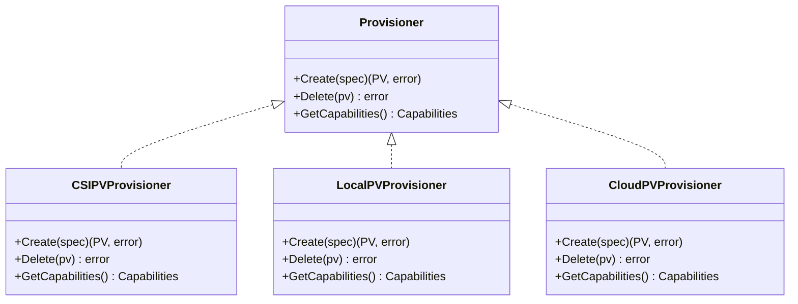
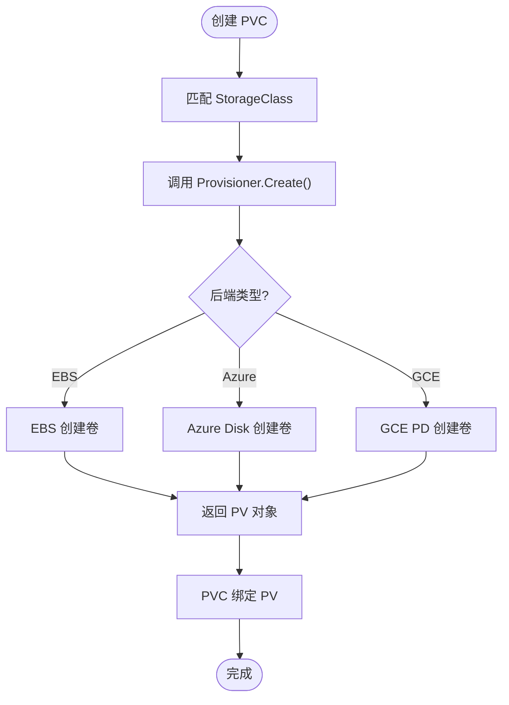
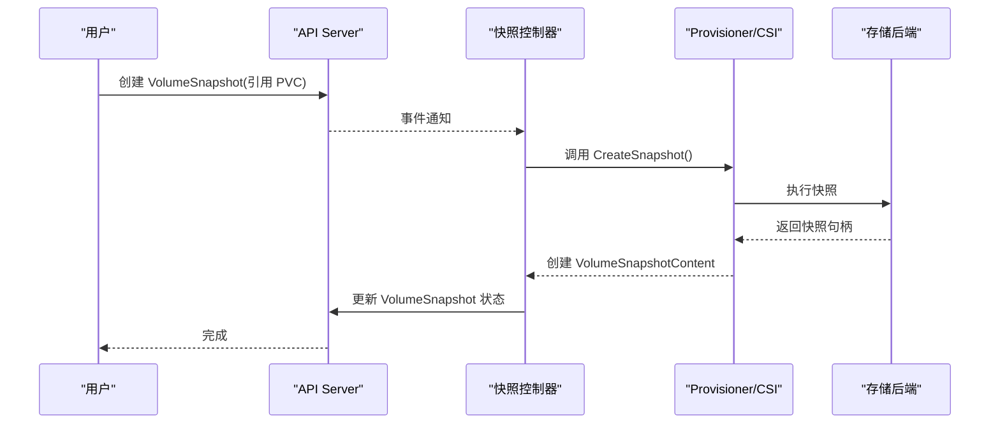
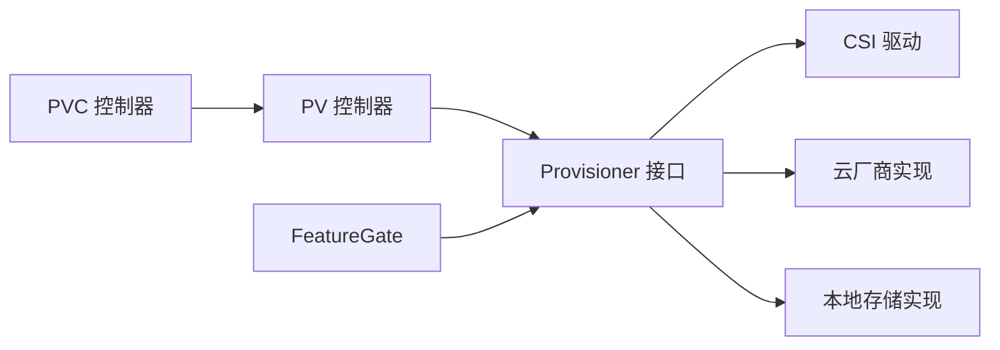

# 动态存储供应

<cite>
**本文引用的文件**   
- [storageclass.go](file://pkg/apis/storage/v1/types.go)
- [provisioner.go](file://pkg/volume/plugins.go)
- [persistentvolumecontroller.go](file://pkg/controller/volume/persistentvolume/persistentvolumecontroller.go)
- [pv_controller.go](file://pkg/controller/volume/persistentvolume/pv_controller.go)
- [pvc_controller.go](file://pkg/controller/volume/persistentvolumeclaim/pvc_controller.go)
- [csi_provisioner.go](file://pkg/volume/csi/csi_provisioner.go)
- [local_volume_provisioner.go](file://pkg/volume/local/provisioner.go)
- [aws_ebs.go](file://staging/src/k8s.io/cloud-provider/providers/aws/ebs.go)
- [azure_disk.go](file://staging/src/k8s.io/cloud-provider/providers/azure/disk.go)
- [gce_pd.go](file://staging/src/k8s.io/cloud-provider/providers/gce/gce_pd.go)
- [snapshot_controller.go](file://pkg/controller/volume/snapshot/snapshot_controller.go)
- [snapshot_class.go](file://pkg/apis/storage/v1/types.go)
- [feature_gates.go](file://pkg/features/kube_features.go)
</cite>

## 目录
1. [简介](#简介)
2. [项目结构](#项目结构)
3. [核心组件](#核心组件)
4. [架构总览](#架构总览)
5. [详细组件分析](#详细组件分析)
6. [依赖关系分析](#依赖关系分析)
7. [性能考虑](#性能考虑)
8. [故障排查指南](#故障排查指南)
9. [结论](#结论)
10. [附录](#附录)

## 简介
本技术文档围绕 Kubernetes 的动态存储供应能力，系统阐述 StorageClass 概念、参数与默认配置、Provisioner 接口设计与插件化架构，覆盖云提供商（AWS EBS、Azure Disk、GCE PD）和本地存储的实现方式。同时提供自定义 Provisioner 开发指南、快照与克隆机制说明，以及性能优化与监控指标建议。

## 项目结构
Kubernetes 中动态存储供应涉及 API 定义、控制器循环、卷插件体系与 CSI 集成等关键模块：
- API 层：StorageClass、VolumeSnapshotClass、VolumeSnapshot、VolumeSnapshotContent 等 CRD 类型定义位于 storage API 包。
- 控制面：PersistentVolumeController 负责 PV/PVC 生命周期协调；Snapshot Controller 负责快照相关资源协调。
- 卷插件：内置插件通过统一接口暴露 Create/Delete/Attach/Detach 等操作；CSI 作为标准扩展点。
- 云厂商实现：cloud-provider 子模块包含各云平台的卷实现。
- 本地存储：本地目录或块设备由专用 Provisioner 管理。

图表来源
- [storageclass.go:1-200](file://pkg/apis/storage/v1/types.go#L1-L200)
- [persistentvolumecontroller.go:1-200](file://pkg/controller/volume/persistentvolume/persistentvolumecontroller.go#L1-L200)
- [snapshot_controller.go:1-200](file://pkg/controller/volume/snapshot/snapshot_controller.go#L1-L200)

章节来源
- [storageclass.go:1-200](file://pkg/apis/storage/v1/types.go#L1-L200)
- [persistentvolumecontroller.go:1-200](file://pkg/controller/volume/persistentvolume/persistentvolumecontroller.go#L1-L200)
- [snapshot_controller.go:1-200](file://pkg/controller/volume/snapshot/snapshot_controller.go#L1-L200)

## 核心组件
- StorageClass：描述“存储类”，声明 provisioner、参数、回收策略、是否允许扩容等。
- PersistentVolumeController：根据 PVC 选择匹配的 StorageClass，调用对应 Provisioner 创建 PV。
- PVC 控制器：跟踪 PVC 状态，触发绑定流程。
- 卷插件接口：统一的 Create/Delete/GetCapabilities 等方法，供内置插件和 CSI 实现。
- Snapshot Controller：协调 VolumeSnapshotClass/Snapshot/SnapshotContent 的生命周期，驱动底层快照能力。

章节来源
- [storageclass.go:1-200](file://pkg/apis/storage/v1/types.go#L1-L200)
- [persistentvolumecontroller.go:1-200](file://pkg/controller/volume/persistentvolume/persistentvolumecontroller.go#L1-L200)
- [pv_controller.go:1-200](file://pkg/controller/volume/persistentvolume/pv_controller.go#L1-L200)
- [pvc_controller.go:1-200](file://pkg/controller/volume/persistentvolumeclaim/pvc_controller.go#L1-L200)
- [provisioner.go:1-200](file://pkg/volume/plugins.go#L1-L200)
- [snapshot_controller.go:1-200](file://pkg/controller/volume/snapshot/snapshot_controller.go#L1-L200)

## 架构总览
动态供应的关键路径：用户提交 PVC → 匹配 StorageClass → 控制器调用 Provisioner → 创建 PV → 绑定到 Pod。

图表来源
- [pvc_controller.go:1-200](file://pkg/controller/volume/persistentvolumeclaim/pvc_controller.go#L1-L200)
- [pv_controller.go:1-200](file://pkg/controller/volume/persistentvolume/pv_controller.go#L1-L200)
- [persistentvolumecontroller.go:1-200](file://pkg/controller/volume/persistentvolume/persistentvolumecontroller.go#L1-L200)
- [provisioner.go:1-200](file://pkg/volume/plugins.go#L1-L200)

## 详细组件分析

### StorageClass 概念与参数
- 作用：抽象存储后端的特性集合，包括 provisioner 名称、参数键值对、回收策略、是否支持扩容、是否允许从快照恢复等。
- 典型参数：
  - 云盘：IOPS、吞吐量、加密、分区表、磁盘类型等。
  - CSI：driver-specific 参数，如拓扑约束、容量上限、快照类引用等。
  - 本地存储：path、fsType、reclaimPolicy 等。
- 默认配置：可通过 DefaultStorageClass 标记一个类为默认，简化用户声明。

章节来源
- [storageclass.go:1-200](file://pkg/apis/storage/v1/types.go#L1-L200)

### Provisioner 接口设计与插件架构
- 统一接口：Create、Delete、GetCapabilities 等，用于创建/删除卷与查询能力。
- 插件注册：通过插件管理器发现并加载不同实现（内置、CSI、外部）。
- 能力协商：GetCapabilities 返回是否支持扩容、快照、克隆等，控制器据此决定后续操作。

图表来源
- [provisioner.go:1-200](file://pkg/volume/plugins.go#L1-L200)
- [csi_provisioner.go:1-200](file://pkg/volume/csi/csi_provisioner.go#L1-L200)
- [local_volume_provisioner.go:1-200](file://pkg/volume/local/provisioner.go#L1-L200)

章节来源
- [provisioner.go:1-200](file://pkg/volume/plugins.go#L1-L200)
- [csi_provisioner.go:1-200](file://pkg/volume/csi/csi_provisioner.go#L1-L200)
- [local_volume_provisioner.go:1-200](file://pkg/volume/local/provisioner.go#L1-L200)

### 云提供商存储的动态供应
- AWS EBS：通过 cloud-provider 的 EBS 实现，支持 IOPS、吞吐、加密、快照等参数。
- Azure Disk：支持托管磁盘类型、IOPS/吞吐上限、加密、快照等。
- GCE PD：支持 ssd/hdd、压缩、快照、多副本等。

图表来源
- [aws_ebs.go:1-200](file://staging/src/k8s.io/cloud-provider/providers/aws/ebs.go#L1-L200)
- [azure_disk.go:1-200](file://staging/src/k8s.io/cloud-provider/providers/azure/disk.go#L1-L200)
- [gce_pd.go:1-200](file://staging/src/k8s.io/cloud-provider/providers/gce/gce_pd.go#L1-L200)

章节来源
- [aws_ebs.go:1-200](file://staging/src/k8s.io/cloud-provider/providers/aws/ebs.go#L1-L200)
- [azure_disk.go:1-200](file://staging/src/k8s.io/cloud-provider/providers/azure/disk.go#L1-L200)
- [gce_pd.go:1-200](file://staging/src/k8s.io/cloud-provider/providers/gce/gce_pd.go#L1-L200)

### 本地存储的动态供应
- 使用本地目录或块设备作为后端，Provisioner 在节点上创建/清理目录或格式化块设备。
- 典型参数：path、fsType、reclaimPolicy、nodeAffinity 等。
- 适用场景：高性能低延迟、数据局部性要求高的工作负载。

章节来源
- [local_volume_provisioner.go:1-200](file://pkg/volume/local/provisioner.go#L1-L200)

### 自定义 Provisioner 开发指南
- 实现步骤：
  - 实现 Provisioner 接口（Create/Delete/GetCapabilities）。
  - 处理参数解析与校验，结合 GetCapabilities 声明能力。
  - 在控制器侧注册或通过 CSI 方式对外暴露。
- 最佳实践：
  - 幂等性：Create/Delete 需具备幂等语义。
  - 错误分类：区分可重试与不可重试错误，便于控制器退避。
  - 资源清理：确保 Delete 时彻底释放后端资源。
  - 安全：敏感参数通过 Secret 引用，避免明文。

章节来源
- [provisioner.go:1-200](file://pkg/volume/plugins.go#L1-L200)
- [csi_provisioner.go:1-200](file://pkg/volume/csi/csi_provisioner.go#L1-L200)

### 存储类模板、参数验证与默认配置
- 模板化：使用 Kustomize/Helm 生成不同环境下的 StorageClass 清单。
- 参数验证：在 Provisioner 内部进行强校验，失败时快速返回错误。
- 默认配置：将常用参数封装进默认 StorageClass，减少用户心智负担。

章节来源
- [storageclass.go:1-200](file://pkg/apis/storage/v1/types.go#L1-L200)

### 快照与克隆的实现原理与使用方法
- 快照模型：VolumeSnapshotClass 定义快照能力与驱动参数；VolumeSnapshot 表示一次快照请求；VolumeSnapshotContent 记录实际快照资源。
- 工作流程：
  - 用户创建 VolumeSnapshot，关联到 PVC。
  - Snapshot Controller 调用底层驱动（CSI 或云厂商）执行快照。
  - 成功后创建 VolumeSnapshotContent，并回填 VolumeSnapshot 状态。
- 克隆：基于现有快照创建新的 PVC，通常由 Provisioner 支持。

图表来源
- [snapshot_controller.go:1-200](file://pkg/controller/volume/snapshot/snapshot_controller.go#L1-L200)
- [snapshot_class.go:1-200](file://pkg/apis/storage/v1/types.go#L1-L200)

章节来源
- [snapshot_controller.go:1-200](file://pkg/controller/volume/snapshot/snapshot_controller.go#L1-L200)
- [snapshot_class.go:1-200](file://pkg/apis/storage/v1/types.go#L1-L200)

## 依赖关系分析
- 控制器耦合：PVC/PV 控制器与 Provisioner 解耦，通过接口交互，降低耦合度。
- 外部依赖：CSI 驱动、云厂商 SDK、本地文件系统/块设备。
- 功能开关：部分能力受 FeatureGate 控制（例如某些快照或扩容特性）。

图表来源
- [pvc_controller.go:1-200](file://pkg/controller/volume/persistentvolumeclaim/pvc_controller.go#L1-L200)
- [pv_controller.go:1-200](file://pkg/controller/volume/persistentvolume/pv_controller.go#L1-L200)
- [provisioner.go:1-200](file://pkg/volume/plugins.go#L1-L200)
- [feature_gates.go:1-200](file://pkg/features/kube_features.go#L1-L200)

章节来源
- [pvc_controller.go:1-200](file://pkg/controller/volume/persistentvolumeclaim/pvc_controller.go#L1-L200)
- [pv_controller.go:1-200](file://pkg/controller/volume/persistentvolume/pv_controller.go#L1-L200)
- [provisioner.go:1-200](file://pkg/volume/plugins.go#L1-L200)
- [feature_gates.go:1-200](file://pkg/features/kube_features.go#L1-L200)

## 性能考虑
- 并发控制：合理设置控制器队列大小与并发度，避免风暴式创建。
- 指数退避：对可重试错误采用退避策略，减轻后端压力。
- 批量操作：在可能的情况下合并创建/删除请求。
- 缓存与去重：对已存在的卷进行去重，避免重复创建。
- 监控指标：关注创建耗时、失败率、队列长度、资源配额使用情况。

[本节为通用指导，不直接分析具体文件]

## 故障排查指南
- 常见问题：
  - 参数校验失败：检查 StorageClass 参数是否符合后端要求。
  - 权限不足：确认 ServiceAccount/RBAC 具有访问云 API 或 CSI 的权限。
  - 资源配额限制：检查云账号配额与集群资源配额。
  - 网络问题：确认节点到云 API/CSI 端点的连通性与证书有效性。
- 定位方法：
  - 查看 PVC/PV 事件与状态字段。
  - 检查控制器日志与 Provisioner 日志。
  - 使用 kubectl describe 获取详细错误信息。

章节来源
- [persistentvolumecontroller.go:1-200](file://pkg/controller/volume/persistentvolume/persistentvolumecontroller.go#L1-L200)
- [snapshot_controller.go:1-200](file://pkg/controller/volume/snapshot/snapshot_controller.go#L1-L200)

## 结论
Kubernetes 的动态存储供应通过 StorageClass 与 Provisioner 接口实现了高度可扩展的存储抽象。借助 CSI 与云厂商实现，用户可以以一致的方式消费多种后端。配合快照与克隆能力，能够构建高可用与可迁移的数据平面。遵循参数验证、幂等性与错误分类的最佳实践，并结合监控与性能调优，可获得稳定高效的存储体验。

## 附录
- 参考 API 类型：StorageClass、VolumeSnapshotClass、VolumeSnapshot、VolumeSnapshotContent。
- 参考控制器：PersistentVolumeController、Snapshot Controller。
- 参考插件：CSI、云厂商实现、本地存储 Provisioner。