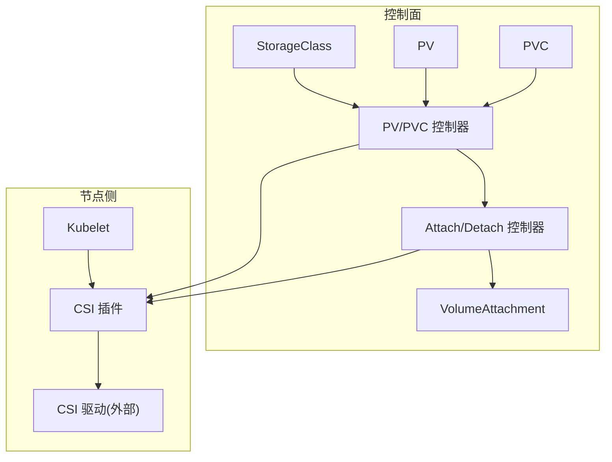
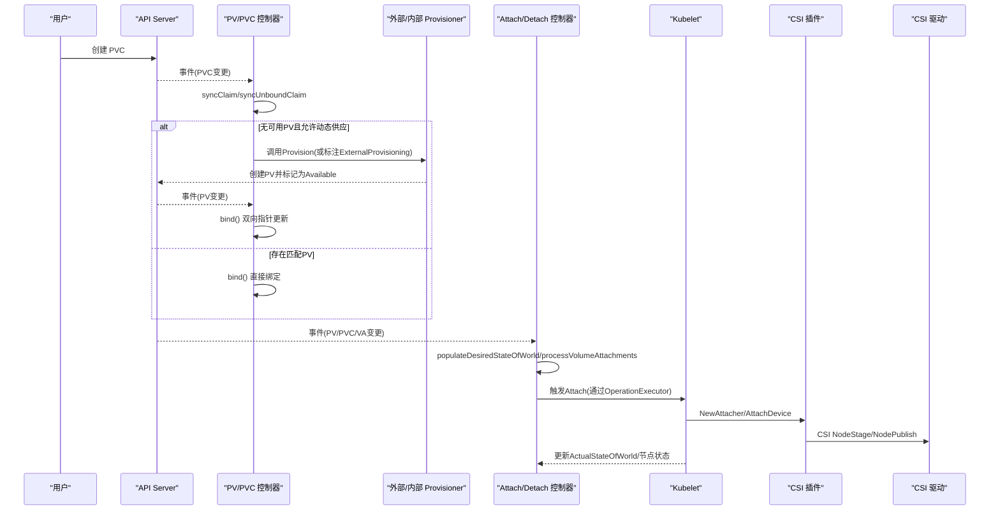
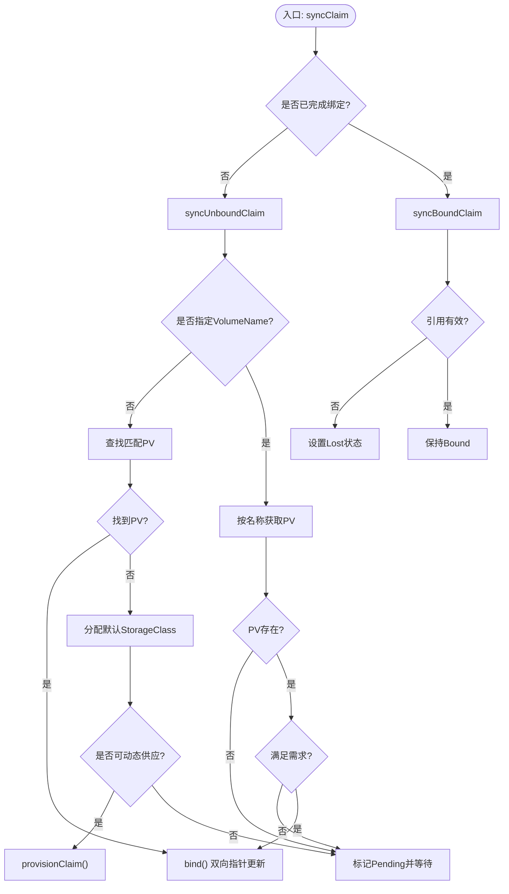
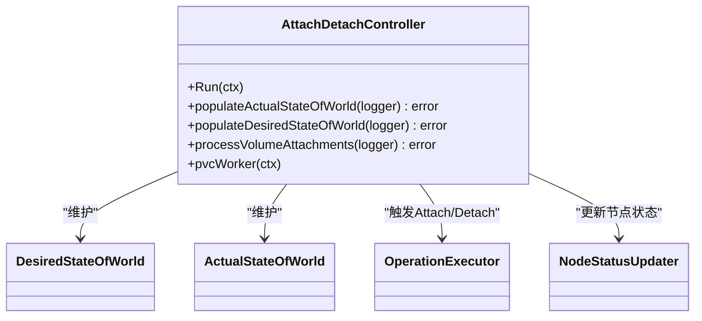
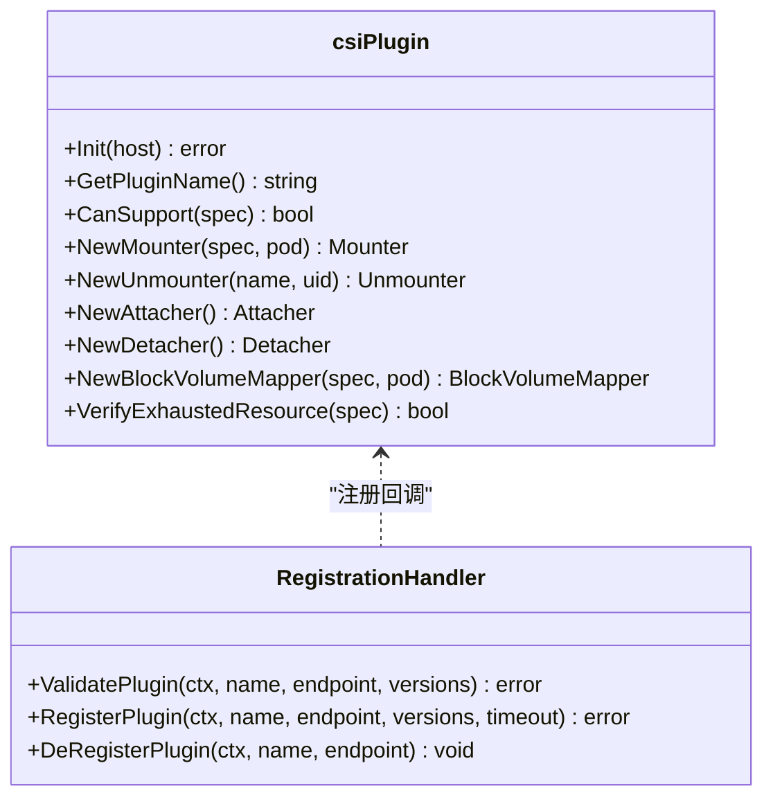
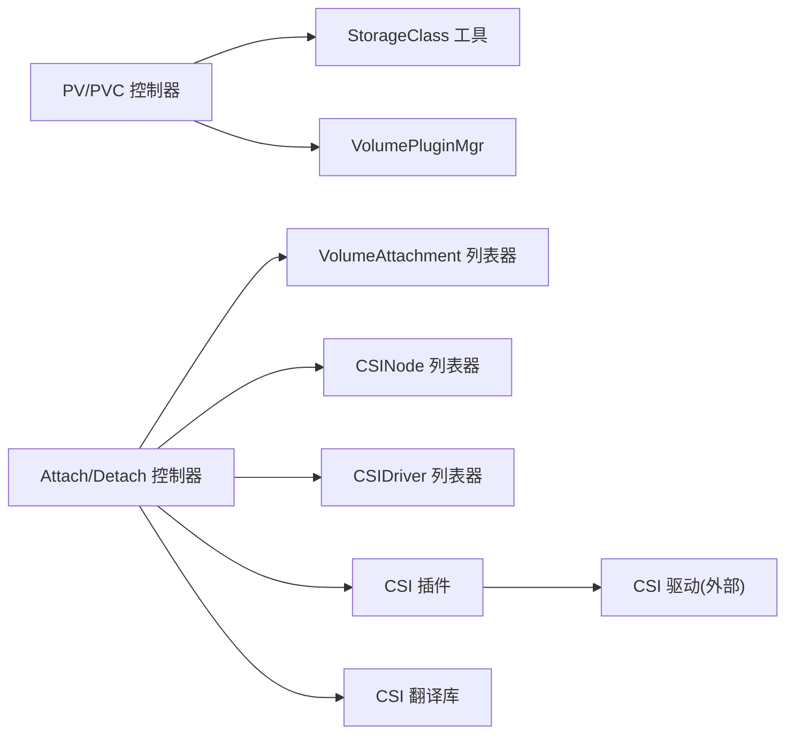

# 存储管理

<cite>
**本文引用的文件**   
- [pkg/controller/volume/persistentvolume/pv_controller.go](file://pkg/controller/volume/persistentvolume/pv_controller.go)
- [pkg/controller/volume/attachdetach/attach_detach_controller.go](file://pkg/controller/volume/attachdetach/attach_detach_controller.go)
- [pkg/volume/csi/csi_plugin.go](file://pkg/volume/csi/csi_plugin.go)
- [staging/src/k8s.io/csi-translation-lib/translate.go](file://staging/src/k8s.io/csi-translation-lib/translate.go)
- [pkg/volume/util/storageclass.go](file://pkg/volume/util/storageclass.go)
</cite>

## 目录
1. [简介](#简介)
2. [项目结构](#项目结构)
3. [核心组件](#核心组件)
4. [架构总览](#架构总览)
5. [详细组件分析](#详细组件分析)
6. [依赖关系分析](#依赖关系分析)
7. [性能与容量规划](#性能与容量规划)
8. [故障排查指南](#故障排查指南)
9. [结论](#结论)
10. [附录](#附录)

## 简介
本技术文档围绕 Kubernetes 的存储管理机制，系统性阐述持久卷（PV）与持久卷声明（PVC）的生命周期、绑定与动态供应流程；深入解析 StorageClass 的动态存储供应能力与后端抽象层设计；详解 CSI 插件架构及驱动实现方式；并提供备份恢复、数据迁移、灾难恢复的最佳实践，以及监控、容量规划与成本优化建议。最后对不同存储类型（块存储、文件存储、对象存储）的使用场景与配置方法进行说明。

## 项目结构
Kubernetes 存储子系统由控制面控制器与节点侧插件共同协作完成：
- 控制面
  - PV/PVC 控制器：负责 PV 与 PVC 的双向指针维护、匹配、绑定、释放与回收。
  - 挂载/卸载控制器（Attach/Detach Controller）：协调 VolumeAttachment、节点状态与实际挂载情况，驱动底层存储进行 Attach/Detach。
- 节点侧
  - CSI 插件：通过标准接口与外部 CSI 驱动通信，完成卷的创建、挂载、卸载、扩容等。
- 通用工具
  - StorageClass 工具函数：用于获取默认类、延迟绑定模式判断等。
  - CSI 翻译库：将内嵌卷规格转换为 CSI 规格，支持从 in-tree 到 CSI 的平滑迁移。

图表来源
- [pkg/controller/volume/persistentvolume/pv_controller.go:140-230](file://pkg/controller/volume/persistentvolume/pv_controller.go#L140-L230)
- [pkg/controller/volume/attachdetach/attach_detach_controller.go:103-195](file://pkg/controller/volume/attachdetach/attach_detach_controller.go#L103-L195)
- [pkg/volume/csi/csi_plugin.go:66-80](file://pkg/volume/csi/csi_plugin.go#L66-L80)

章节来源
- [pkg/controller/volume/persistentvolume/pv_controller.go:140-230](file://pkg/controller/volume/persistentvolume/pv_controller.go#L140-L230)
- [pkg/controller/volume/attachdetach/attach_detach_controller.go:103-195](file://pkg/controller/volume/attachdetach/attach_detach_controller.go#L103-L195)
- [pkg/volume/csi/csi_plugin.go:66-80](file://pkg/volume/csi/csi_plugin.go#L66-L80)

## 核心组件
- PV/PVC 控制器
  - 职责：维护 PV.Spec.ClaimRef 与 PVC.Spec.VolumeName 的双向指针；处理未绑定与已绑定分支；执行动态供应与回收策略；更新事件与指标。
  - 关键方法：syncClaim、syncUnboundClaim、syncBoundClaim、syncVolume、bind、reclaimVolume。
- Attach/Detach 控制器
  - 职责：维护 DesiredStateOfWorld 与 ActualStateOfWorld；根据 Pod/Node/VolumentAttachment 变化触发 Attach/Detach；更新节点状态。
  - 关键方法：Run、populateDesiredStateOfWorld、processVolumeAttachments、pvcWorker。
- CSI 插件
  - 职责：注册/反注册 CSI 驱动；提供 Mounter/Unmounter/Attacher/Detacher；与 CSI 驱动交互；支持设备挂载与只读模式。
  - 关键方法：Init、NewMounter、NewAttacher、NewDetacher、CanSupport、RequiresRemount。
- StorageClass 工具
  - 职责：获取默认 StorageClass、判断延迟绑定模式、检查访问模式与 volumeMode 兼容性等。
- CSI 翻译库
  - 职责：将 in-tree 卷规格转换为 CSI 规格，支撑迁移路径。

章节来源
- [pkg/controller/volume/persistentvolume/pv_controller.go:232-303](file://pkg/controller/volume/persistentvolume/pv_controller.go#L232-L303)
- [pkg/controller/volume/attachdetach/attach_detach_controller.go:325-379](file://pkg/controller/volume/attachdetach/attach_detach_controller.go#L325-L379)
- [pkg/volume/csi/csi_plugin.go:281-359](file://pkg/volume/csi/csi_plugin.go#L281-L359)
- [pkg/volume/util/storageclass.go](file://pkg/volume/util/storageclass.go)
- [staging/src/k8s.io/csi-translation-lib/translate.go](file://staging/src/k8s.io/csi-translation-lib/translate.go)

## 架构总览
下图展示了从 PVC 创建到最终在节点上挂载的端到端流程，包括动态供应、绑定、Attach/Detach 与 CSI 调用。

图表来源
- [pkg/controller/volume/persistentvolume/pv_controller.go:232-303](file://pkg/controller/volume/persistentvolume/pv_controller.go#L232-L303)
- [pkg/controller/volume/attachdetach/attach_detach_controller.go:325-379](file://pkg/controller/volume/attachdetach/attach_detach_controller.go#L325-L379)
- [pkg/volume/csi/csi_plugin.go:474-538](file://pkg/volume/csi/csi_plugin.go#L474-L538)

## 详细组件分析

### PV/PVC 控制器：生命周期与绑定机制
- 双向指针设计
  - PV.Spec.ClaimRef 与 PVC.Spec.VolumeName 构成双向“指针”，确保绑定一致性，避免多实例竞争导致的数据风险。
- 未绑定分支（syncUnboundClaim）
  - 若未指定目标 PV，则尝试匹配现有 PV；若无匹配且允许动态供应，则调用 provisionClaim；否则进入等待或失败事件。
  - 支持延迟绑定（WaitForFirstConsumer），在未调度前不立即分配。
- 已绑定分支（syncBoundClaim）
  - 校验 PVC 是否仍指向有效 PV；若丢失引用或冲突，进入 Lost/Misbound 终态并记录事件。
- 卷同步（syncVolume）
  - 当 PVC 被删除时，依据 ReclaimPolicy 执行 Release/Recycle/Retain；对动态创建的 Delete 策略卷进行清理。
- 绑定操作（bind）
  - 原子性更新 PV.ClaimRef 与 PVC.VolumeName，并通过注解 AnnBindCompleted 标记完成。

图表来源
- [pkg/controller/volume/persistentvolume/pv_controller.go:232-303](file://pkg/controller/volume/persistentvolume/pv_controller.go#L232-L303)
- [pkg/controller/volume/persistentvolume/pv_controller.go:332-489](file://pkg/controller/volume/persistentvolume/pv_controller.go#L332-L489)
- [pkg/controller/volume/persistentvolume/pv_controller.go:491-557](file://pkg/controller/volume/persistentvolume/pv_controller.go#L491-L557)
- [pkg/controller/volume/persistentvolume/pv_controller.go:559-777](file://pkg/controller/volume/persistentvolume/pv_controller.go#L559-L777)

章节来源
- [pkg/controller/volume/persistentvolume/pv_controller.go:232-303](file://pkg/controller/volume/persistentvolume/pv_controller.go#L232-L303)
- [pkg/controller/volume/persistentvolume/pv_controller.go:332-489](file://pkg/controller/volume/persistentvolume/pv_controller.go#L332-L489)
- [pkg/controller/volume/persistentvolume/pv_controller.go:491-557](file://pkg/controller/volume/persistentvolume/pv_controller.go#L491-L557)
- [pkg/controller/volume/persistentvolume/pv_controller.go:559-777](file://pkg/controller/volume/persistentvolume/pv_controller.go#L559-L777)

### Attach/Detach 控制器：期望状态与实际状态协调
- 世界模型
  - DesiredStateOfWorld：基于 Pod/Node/PVC/PV 计算出的期望挂载状态。
  - ActualStateOfWorld：从节点状态与 VolumeAttachment 推导的实际挂载状态。
- 初始化与填充
  - Run 启动后，先 populateActualStateOfWorld 再 populateDesiredStateOfWorld，随后周期性 reconciler 循环比对差异并触发操作。
- PVC 工作队列
  - pvcWorker 处理已绑定 PVC，定位使用它的活跃 Pod，更新 DSW 以触发后续 Attach。
- VolumeAttachment 处理
  - processVolumeAttachments 将 VA 对象映射到 ASW，识别不确定附着并在 reconciler 中决定 Attach/Detach。

图表来源
- [pkg/controller/volume/attachdetach/attach_detach_controller.go:103-195](file://pkg/controller/volume/attachdetach/attach_detach_controller.go#L103-L195)
- [pkg/controller/volume/attachdetach/attach_detach_controller.go:325-379](file://pkg/controller/volume/attachdetach/attach_detach_controller.go#L325-L379)
- [pkg/controller/volume/attachdetach/attach_detach_controller.go:381-412](file://pkg/controller/volume/attachdetach/attach_detach_controller.go#L381-L412)
- [pkg/controller/volume/attachdetach/attach_detach_controller.go:436-496](file://pkg/controller/volume/attachdetach/attach_detach_controller.go#L436-L496)
- [pkg/controller/volume/attachdetach/attach_detach_controller.go:694-755](file://pkg/controller/volume/attachdetach/attach_detach_controller.go#L694-L755)

章节来源
- [pkg/controller/volume/attachdetach/attach_detach_controller.go:325-379](file://pkg/controller/volume/attachdetach/attach_detach_controller.go#L325-L379)
- [pkg/controller/volume/attachdetach/attach_detach_controller.go:381-412](file://pkg/controller/volume/attachdetach/attach_detach_controller.go#L381-L412)
- [pkg/controller/volume/attachdetach/attach_detach_controller.go:436-496](file://pkg/controller/volume/attachdetach/attach_detach_controller.go#L436-L496)
- [pkg/controller/volume/attachdetach/attach_detach_controller.go:694-755](file://pkg/controller/volume/attachdetach/attach_detach_controller.go#L694-L755)

### CSI 插件架构与驱动实现
- 插件注册与版本协商
  - 通过 kubelet 插件 watcher 发现新驱动，ValidatePlugin/RegisterPlugin 验证版本并建立连接，调用 NodeGetInfo 获取节点信息并安装到 CSINode。
- 插件能力
  - CanSupport：识别 PV/Volume 中的 CSI 源。
  - NewMounter/NewUnmounter：创建文件系统挂载器。
  - NewAttacher/NewDetacher：创建块设备 Attach/Detach 器。
  - RequiresRemount：根据 CSIDriver.Spec.RequiresRepublish 决定是否重新发布。
- 设备挂载与只读
  - NewBlockVolumeMapper：支持块设备挂载，保存卷信息以便卸载与重建。
- 资源耗尽检测
  - VerifyExhaustedResource：检测 VolumeAttachment 的 ResourceExhausted 错误并更新 CSIDriver 的可分配计数。

图表来源
- [pkg/volume/csi/csi_plugin.go:66-80](file://pkg/volume/csi/csi_plugin.go#L66-L80)
- [pkg/volume/csi/csi_plugin.go:105-170](file://pkg/volume/csi/csi_plugin.go#L105-L170)
- [pkg/volume/csi/csi_plugin.go:281-359](file://pkg/volume/csi/csi_plugin.go#L281-L359)
- [pkg/volume/csi/csi_plugin.go:474-538](file://pkg/volume/csi/csi_plugin.go#L474-L538)
- [pkg/volume/csi/csi_plugin.go:729-800](file://pkg/volume/csi/csi_plugin.go#L729-L800)
- [pkg/volume/csi/csi_plugin.go:192-232](file://pkg/volume/csi/csi_plugin.go#L192-L232)

章节来源
- [pkg/volume/csi/csi_plugin.go:105-170](file://pkg/volume/csi/csi_plugin.go#L105-L170)
- [pkg/volume/csi/csi_plugin.go:281-359](file://pkg/volume/csi/csi_plugin.go#L281-L359)
- [pkg/volume/csi/csi_plugin.go:474-538](file://pkg/volume/csi/csi_plugin.go#L474-L538)
- [pkg/volume/csi/csi_plugin.go:729-800](file://pkg/volume/csi/csi_plugin.go#L729-L800)
- [pkg/volume/csi/csi_plugin.go:192-232](file://pkg/volume/csi/csi_plugin.go#L192-L232)

### StorageClass 动态供应与后端抽象
- 动态供应
  - 当 PVC 未指定 PV 且存在匹配的 StorageClass 时，控制器会调用对应 Provisioner（外部或内部）创建 PV，并标记 AnnDynamicallyProvisioned。
- 默认类与延迟绑定
  - assignDefaultStorageClass 为未指定类的 PVC 自动分配默认类；IsDelayBindingMode 判断 WaitForFirstConsumer 模式。
- 后端抽象
  - 通过 VolumePluginMgr 统一抽象不同后端（CSI、in-tree），Attach/Detach 控制器与 CSI 插件协同完成具体实现。

章节来源
- [pkg/controller/volume/persistentvolume/pv_controller.go:332-489](file://pkg/controller/volume/persistentvolume/pv_controller.go#L332-L489)
- [pkg/volume/util/storageclass.go](file://pkg/volume/util/storageclass.go)
- [pkg/controller/volume/attachdetach/attach_detach_controller.go:148-195](file://pkg/controller/volume/attachdetach/attach_detach_controller.go#L148-L195)

### CSI 迁移与 in-tree 到 CSI 的转换
- 翻译库
  - TranslateInTreeSpecToCSI 将 in-tree 卷规格转换为 CSI 规格，使迁移后的 PV 能由 CSI 插件接管。
- 控制器集成
  - Attach/Detach 控制器在处理 VolumeAttachment 时，若检测到迁移，则使用 CSI 插件与翻译库生成正确的 volumeSpec。

章节来源
- [staging/src/k8s.io/csi-translation-lib/translate.go](file://staging/src/k8s.io/csi-translation-lib/translate.go)
- [pkg/controller/volume/attachdetach/attach_detach_controller.go:714-755](file://pkg/controller/volume/attachdetach/attach_detach_controller.go#L714-L755)

## 依赖关系分析
- 组件耦合
  - PV/PVC 控制器依赖 StorageClass 工具与 VolumePluginMgr；与 Attach/Detach 控制器通过事件与共享缓存协作。
  - Attach/Detach 控制器依赖 VolumeAttachment、CSINode、CSIDriver 列表器，以及 CSI 插件提供的 Attacher/Detacher。
  - CSI 插件依赖 CSIDriver 列表器与 VolumeAttachment 列表器，以感知驱动能力与资源限制。
- 外部依赖
  - CSI 驱动作为外部进程，通过 gRPC 与 kubelet 内的 CSI 插件通信。
  - 翻译库提供 in-tree 到 CSI 的兼容路径。

图表来源
- [pkg/controller/volume/persistentvolume/pv_controller.go:140-230](file://pkg/controller/volume/persistentvolume/pv_controller.go#L140-L230)
- [pkg/controller/volume/attachdetach/attach_detach_controller.go:103-195](file://pkg/controller/volume/attachdetach/attach_detach_controller.go#L103-L195)
- [pkg/volume/csi/csi_plugin.go:281-359](file://pkg/volume/csi/csi_plugin.go#L281-L359)
- [staging/src/k8s.io/csi-translation-lib/translate.go](file://staging/src/k8s.io/csi-translation-lib/translate.go)

章节来源
- [pkg/controller/volume/persistentvolume/pv_controller.go:140-230](file://pkg/controller/volume/persistentvolume/pv_controller.go#L140-L230)
- [pkg/controller/volume/attachdetach/attach_detach_controller.go:103-195](file://pkg/controller/volume/attachdetach/attach_detach_controller.go#L103-L195)
- [pkg/volume/csi/csi_plugin.go:281-359](file://pkg/volume/csi/csi_plugin.go#L281-L359)
- [staging/src/k8s.io/csi-translation-lib/translate.go](file://staging/src/k8s.io/csi-translation-lib/translate.go)

## 性能与容量规划
- 性能监控
  - 关注 PV/PVC 绑定耗时、Attach/Detach 时长、CSI 调用延迟与错误率；利用控制器内置指标与节点侧 metrics 收集。
- 容量规划
  - 结合 CSIDriver.Spec.NodeAllocatableCount 与 VerifyExhaustedResource 的检测逻辑，评估单节点最大可挂载卷数与资源耗尽告警。
- 成本优化
  - 合理选择 StorageClass 与 ReclaimPolicy（Delete/Retain），避免不必要的保留成本；对热数据使用高性能类，冷数据使用低成本类。
- 弹性与扩展
  - 使用 WaitForFirstConsumer 延迟绑定减少跨节点移动带来的开销；按需启用 CSI 迁移以提升稳定性与功能丰富度。

[本节为通用指导，无需特定文件来源]

## 故障排查指南
- 常见现象
  - PVC 长期 Pending：检查是否存在匹配 PV、StorageClass 是否正确、是否启用了延迟绑定但未调度 Pod。
  - 绑定失败或冲突：查看 PV.ClaimRef 与 PVC.VolumeName 是否一致，确认 AnnBindCompleted 注解状态。
  - Attach/Detach 卡住：核对 VolumeAttachment 状态、节点 VolumesAttached/VolumesInUse 字段、CSI 驱动日志。
- 定位步骤
  - 控制器日志：PV/PVC 控制器与 Attach/Detach 控制器的 klog 输出。
  - 事件与指标：PVC/PV 事件、控制器指标、CSI 插件指标。
  - 节点状态：kubelet 日志、CSI 插件 socket 注册与 NodeGetInfo 返回。
- 恢复建议
  - 修正 StorageClass 参数或 mountOptions；调整 ReclaimPolicy；修复 CSI 驱动权限与网络连通性。

章节来源
- [pkg/controller/volume/persistentvolume/pv_controller.go:232-303](file://pkg/controller/volume/persistentvolume/pv_controller.go#L232-L303)
- [pkg/controller/volume/attachdetach/attach_detach_controller.go:694-755](file://pkg/controller/volume/attachdetach/attach_detach_controller.go#L694-L755)
- [pkg/volume/csi/csi_plugin.go:105-170](file://pkg/volume/csi/csi_plugin.go#L105-L170)

## 结论
Kubernetes 的存储管理通过 PV/PVC 控制器、Attach/Detach 控制器与 CSI 插件的紧密协作，实现了从声明式存储需求到实际挂载的全链路自动化。StorageClass 提供了灵活的动态供应与策略抽象，CSI 则屏蔽了后端差异，使得多种存储类型得以统一管理。在生产环境中，应重视绑定与挂载的性能监控、容量规划与成本优化，并结合备份恢复与灾难恢复方案保障数据安全与业务连续性。

[本节为总结，无需特定文件来源]

## 附录

### 备份与恢复最佳实践
- 快照与克隆
  - 使用 CSI 驱动的快照能力创建一致快照；基于快照克隆快速恢复副本。
- 数据迁移
  - 跨集群迁移可采用快照导出/导入或在线复制工具；注意 I/O 冻结与一致性保证。
- 灾难恢复
  - 定期演练恢复流程；定义 RPO/RTO 目标；对关键数据采用多副本与异地容灾。

[本节为通用指导，无需特定文件来源]

### 不同存储类型的使用场景与配置要点
- 块存储
  - 适用：数据库、高吞吐应用；配置要点：VolumeMode=Block、AccessModes=RWO、ReclaimPolicy=Delete。
- 文件存储
  - 适用：共享目录、日志聚合；配置要点：VolumeMode=Filesystem、AccessModes=RWX、考虑 SELinux 与并发写入。
- 对象存储
  - 适用：非结构化数据、归档；配置要点：通过 CSI 或 Sidecar 接入，注意一致性模型与带宽限制。

[本节为通用指导，无需特定文件来源]