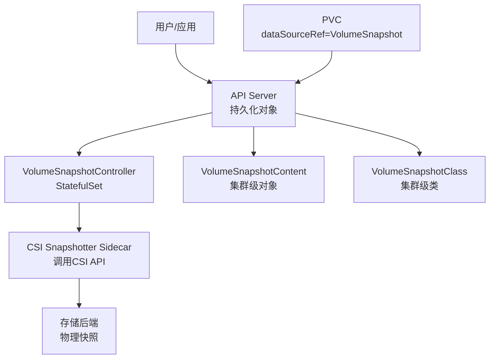
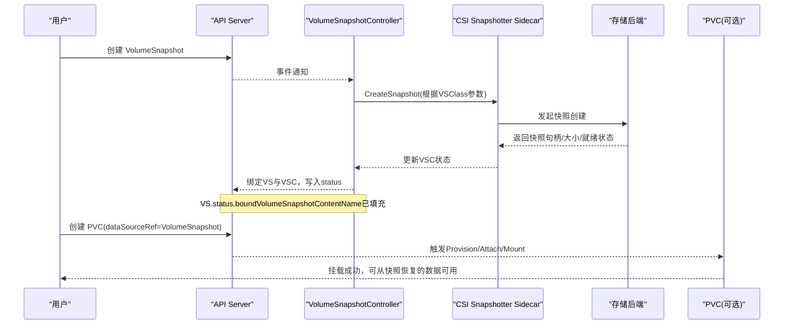
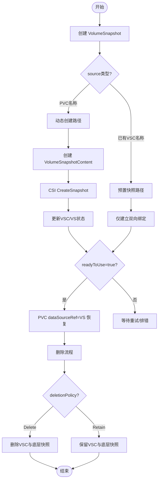
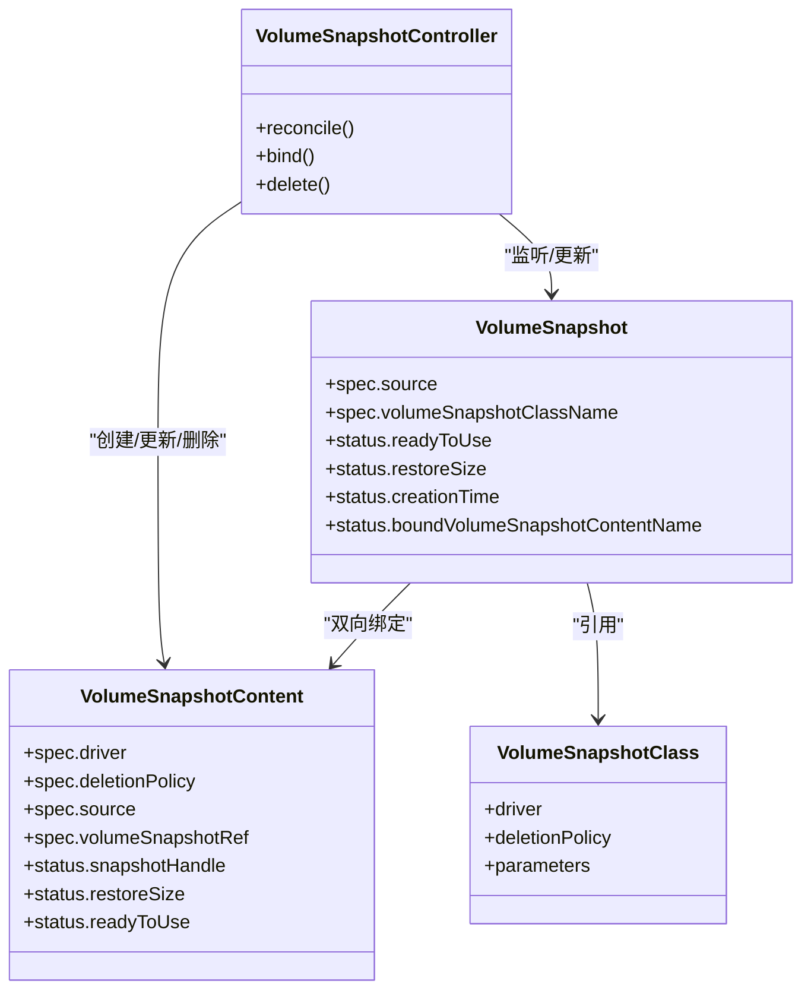

# 存储运维与备份

<cite>
**本文引用的文件**   
- [cluster/addons/volumesnapshots/crd/snapshot.storage.k8s.io_volumesnapshots.yaml](file://cluster/addons/volumesnapshots/crd/snapshot.storage.k8s.io_volumesnapshots.yaml)
- [cluster/addons/volumesnapshots/crd/snapshot.storage.k8s.io_volumesnapshotcontents.yaml](file://cluster/addons/volumesnapshots/crd/snapshot.storage.k8s.io_volumesnapshotcontents.yaml)
- [cluster/addons/volumesnapshots/crd/snapshot.storage.k8s.io_volumesnapshotclasses.yaml](file://cluster/addons/volumesnapshots/crd/snapshot.storage.k8s.io_volumesnapshotclasses.yaml)
- [cluster/addons/volumesnapshots/volume-snapshot-controller/volume-snapshot-controller-deployment.yaml](file://cluster/addons/volumesnapshots/volume-snapshot-controller/volume-snapshot-controller-deployment.yaml)
- [pkg/api/persistentvolumeclaim/util.go](file://pkg/api/persistentvolumeclaim/util.go)
</cite>

## 目录
1. [简介](#简介)
2. [项目结构](#项目结构)
3. [核心组件](#核心组件)
4. [架构总览](#架构总览)
5. [详细组件分析](#详细组件分析)
6. [依赖关系分析](#依赖关系分析)
7. [性能与容量监控](#性能与容量监控)
8. [故障排查指南](#故障排查指南)
9. [结论](#结论)
10. [附录：操作清单与最佳实践](#附录操作清单与最佳实践)

## 简介
本技术文档面向Kubernetes存储运维与备份恢复，聚焦VolumeSnapshot、VolumeSnapshotContent和VolumeSnapshotClass三类CRD及其控制器的工作机制。文档覆盖快照生命周期管理、创建/恢复/删除流程、不同存储后端的快照支持与配置要点、数据备份策略（本地/远程/跨集群）、容量监控与告警建议、成本分析方法、常见故障排查命令与技巧，以及存储升级与数据迁移的最佳实践。

## 项目结构
仓库中与“卷快照”相关的资源定义与控制器部署位于addons/volumesnapshots目录下，包含三套CRD定义与snapshot-controller的Deployment示例；PVC使用快照作为数据源的校验逻辑位于pkg/api/persistentvolumeclaim/util.go中。

图表来源
- [cluster/addons/volumesnapshots/crd/snapshot.storage.k8s.io_volumesnapshots.yaml:1-354](file://cluster/addons/volumesnapshots/crd/snapshot.storage.k8s.io_volumesnapshots.yaml#L1-L354)
- [cluster/addons/volumesnapshots/crd/snapshot.storage.k8s.io_volumesnapshotcontents.yaml:1-460](file://cluster/addons/volumesnapshots/crd/snapshot.storage.k8s.io_volumesnapshotcontents.yaml#L1-L460)
- [cluster/addons/volumesnapshots/crd/snapshot.storage.k8s.io_volumesnapshotclasses.yaml:1-146](file://cluster/addons/volumesnapshots/crd/snapshot.storage.k8s.io_volumesnapshotclasses.yaml#L1-L146)
- [cluster/addons/volumesnapshots/volume-snapshot-controller/volume-snapshot-controller-deployment.yaml:1-30](file://cluster/addons/volumesnapshots/volume-snapshot-controller/volume-snapshot-controller-deployment.yaml#L1-L30)
- [pkg/api/persistentvolumeclaim/util.go:1-200](file://pkg/api/persistentvolumeclaim/util.go#L1-L200)

章节来源
- [cluster/addons/volumesnapshots/crd/snapshot.storage.k8s.io_volumesnapshots.yaml:1-354](file://cluster/addons/volumesnapshots/crd/snapshot.storage.k8s.io_volumesnapshots.yaml#L1-L354)
- [cluster/addons/volumesnapshots/crd/snapshot.storage.k8s.io_volumesnapshotcontents.yaml:1-460](file://cluster/addons/volumesnapshots/crd/snapshot.storage.k8s.io_volumesnapshotcontents.yaml#L1-L460)
- [cluster/addons/volumesnapshots/crd/snapshot.storage.k8s.io_volumesnapshotclasses.yaml:1-146](file://cluster/addons/volumesnapshots/crd/snapshot.storage.k8s.io_volumesnapshotclasses.yaml#L1-L146)
- [cluster/addons/volumesnapshots/volume-snapshot-controller/volume-snapshot-controller-deployment.yaml:1-30](file://cluster/addons/volumesnapshots/volume-snapshot-controller/volume-snapshot-controller-deployment.yaml#L1-L30)
- [pkg/api/persistentvolumeclaim/util.go:1-200](file://pkg/api/persistentvolumeclaim/util.go#L1-L200)

## 核心组件
- VolumeSnapshot（命名空间级）
  - 用途：用户请求对某个PVC进行时间点快照，或绑定到已有快照内容。
  - 关键字段：spec.source（persistentVolumeClaimName或volumeSnapshotContentName二选一且不可变）、spec.volumeSnapshotClassName、status.readyToUse、status.restoreSize、status.creationTime、status.error等。
- VolumeSnapshotContent（集群级）
  - 用途：表示底层存储系统中的实际“磁盘快照”，由CSI驱动创建并维护。
  - 关键字段：spec.driver、spec.deletionPolicy（Delete/Retain）、spec.source（volumeHandle或snapshotHandle二选一且不可变）、spec.volumeSnapshotRef（双向绑定）、status.snapshotHandle、status.restoreSize、status.readyToUse等。
- VolumeSnapshotClass（集群级）
  - 用途：声明快照创建参数与删除策略，供VolumeSnapshot引用。
  - 关键字段：driver、deletionPolicy、parameters（键值对，透传给驱动）。
- VolumeSnapshotController
  - 职责：协调VolumeSnapshot与VolumeSnapshotContent的创建、绑定、状态同步与删除清理；通过CSI Snapshotter Sidecar与存储后端交互。

章节来源
- [cluster/addons/volumesnapshots/crd/snapshot.storage.k8s.io_volumesnapshots.yaml:63-240](file://cluster/addons/volumesnapshots/crd/snapshot.storage.k8s.io_volumesnapshots.yaml#L63-L240)
- [cluster/addons/volumesnapshots/crd/snapshot.storage.k8s.io_volumesnapshotcontents.yaml:61-312](file://cluster/addons/volumesnapshots/crd/snapshot.storage.k8s.io_volumesnapshotcontents.yaml#L61-L312)
- [cluster/addons/volumesnapshots/crd/snapshot.storage.k8s.io_volumesnapshotclasses.yaml:36-91](file://cluster/addons/volumesnapshots/crd/snapshot.storage.k8s.io_volumesnapshotclasses.yaml#L36-L91)
- [cluster/addons/volumesnapshots/volume-snapshot-controller/volume-snapshot-controller-deployment.yaml:1-30](file://cluster/addons/volumesnapshots/volume-snapshot-controller/volume-snapshot-controller-deployment.yaml#L1-L30)

## 架构总览
下图展示了从用户创建VolumeSnapshot到控制器协调CSI侧车完成物理快照，再到PVC基于快照恢复的整体流程。

图表来源
- [cluster/addons/volumesnapshots/crd/snapshot.storage.k8s.io_volumesnapshots.yaml:63-240](file://cluster/addons/volumesnapshots/crd/snapshot.storage.k8s.io_volumesnapshots.yaml#L63-L240)
- [cluster/addons/volumesnapshots/crd/snapshot.storage.k8s.io_volumesnapshotcontents.yaml:61-312](file://cluster/addons/volumesnapshots/crd/snapshot.storage.k8s.io_volumesnapshotcontents.yaml#L61-L312)
- [cluster/addons/volumesnapshots/volume-snapshot-controller/volume-snapshot-controller-deployment.yaml:1-30](file://cluster/addons/volumesnapshots/volume-snapshot-controller/volume-snapshot-controller-deployment.yaml#L1-L30)
- [pkg/api/persistentvolumeclaim/util.go:1-200](file://pkg/api/persistentvolumeclaim/util.go#L1-L200)

## 详细组件分析

### VolumeSnapshot 与 VolumeSnapshotContent 生命周期
- 动态创建路径
  - 用户创建VolumeSnapshot，指定source.persistentVolumeClaimName与可选的volumeSnapshotClassName。
  - 控制器创建VolumeSnapshotContent，设置driver、deletionPolicy、source.volumeHandle、volumeSnapshotRef。
  - CSI Snapshotter调用CreateSnapshot，成功后回填status.readyToUse、status.restoreSize、status.creationTime、status.snapshotHandle。
  - 控制器建立双向绑定：VS.status.boundVolumeSnapshotContentName与VSC.spec.volumeSnapshotRef互相指向。
- 预置快照路径
  - 用户直接提供source.volumeSnapshotContentName（VS）或source.snapshotHandle（VSC），控制器仅做绑定与状态同步。
- 删除路径
  - 若deletionPolicy为Delete：删除绑定的VS时，控制器会删除对应的VSC及底层快照。
  - 若deletionPolicy为Retain：删除VS不会删除VSC与底层快照，需手动清理。

图表来源
- [cluster/addons/volumesnapshots/crd/snapshot.storage.k8s.io_volumesnapshots.yaml:63-240](file://cluster/addons/volumesnapshots/crd/snapshot.storage.k8s.io_volumesnapshots.yaml#L63-L240)
- [cluster/addons/volumesnapshots/crd/snapshot.storage.k8s.io_volumesnapshotcontents.yaml:61-312](file://cluster/addons/volumesnapshots/crd/snapshot.storage.k8s.io_volumesnapshotcontents.yaml#L61-L312)

章节来源
- [cluster/addons/volumesnapshots/crd/snapshot.storage.k8s.io_volumesnapshots.yaml:63-240](file://cluster/addons/volumesnapshots/crd/snapshot.storage.k8s.io_volumesnapshots.yaml#L63-L240)
- [cluster/addons/volumesnapshots/crd/snapshot.storage.k8s.io_volumesnapshotcontents.yaml:61-312](file://cluster/addons/volumesnapshots/crd/snapshot.storage.k8s.io_volumesnapshotcontents.yaml#L61-L312)

### VolumeSnapshotClass 的作用与配置
- driver：必须与CSI插件名称一致，用于选择正确的快照实现。
- deletionPolicy：控制删除行为（Delete/Retain）。
- parameters：键值对，透传给具体驱动以实现差异化快照策略（如加密、压缩、层级等）。

章节来源
- [cluster/addons/volumesnapshots/crd/snapshot.storage.k8s.io_volumesnapshotclasses.yaml:36-91](file://cluster/addons/volumesnapshots/crd/snapshot.storage.k8s.io_volumesnapshotclasses.yaml#L36-L91)

### PVC 基于快照恢复
- 支持在PVC的dataSourceRef中引用VolumeSnapshot，从而以快照为数据源创建新卷。
- 校验逻辑确保dataSourceKind为VolumeSnapshot且apiGroup为snapshot.storage.k8s.io。

章节来源
- [pkg/api/persistentvolumeclaim/util.go:1-200](file://pkg/api/persistentvolumeclaim/util.go#L1-L200)

## 依赖关系分析
- CRD与控制器
  - VolumeSnapshotController监听三类CRD事件，协调CSI Snapshotter与存储后端。
- 对象间耦合
  - VS与VSC通过双向引用形成强绑定；VSC与底层快照通过snapshotHandle关联。
  - VSClass为无状态模板，被VS引用以决定driver与删除策略。
- 外部依赖
  - CSI驱动与存储后端能力决定快照特性（是否支持group snapshot、是否返回size/时间戳等）。

图表来源
- [cluster/addons/volumesnapshots/crd/snapshot.storage.k8s.io_volumesnapshots.yaml:63-240](file://cluster/addons/volumesnapshots/crd/snapshot.storage.k8s.io_volumesnapshots.yaml#L63-L240)
- [cluster/addons/volumesnapshots/crd/snapshot.storage.k8s.io_volumesnapshotcontents.yaml:61-312](file://cluster/addons/volumesnapshots/crd/snapshot.storage.k8s.io_volumesnapshotcontents.yaml#L61-L312)
- [cluster/addons/volumesnapshots/crd/snapshot.storage.k8s.io_volumesnapshotclasses.yaml:36-91](file://cluster/addons/volumesnapshots/crd/snapshot.storage.k8s.io_volumesnapshotclasses.yaml#L36-L91)
- [cluster/addons/volumesnapshots/volume-snapshot-controller/volume-snapshot-controller-deployment.yaml:1-30](file://cluster/addons/volumesnapshots/volume-snapshot-controller/volume-snapshot-controller-deployment.yaml#L1-L30)

章节来源
- [cluster/addons/volumesnapshots/crd/snapshot.storage.k8s.io_volumesnapshots.yaml:63-240](file://cluster/addons/volumesnapshots/crd/snapshot.storage.k8s.io_volumesnapshots.yaml#L63-L240)
- [cluster/addons/volumesnapshots/crd/snapshot.storage.k8s.io_volumesnapshotcontents.yaml:61-312](file://cluster/addons/volumesnapshots/crd/snapshot.storage.k8s.io_volumesnapshotcontents.yaml#L61-L312)
- [cluster/addons/volumesnapshots/crd/snapshot.storage.k8s.io_volumesnapshotclasses.yaml:36-91](file://cluster/addons/volumesnapshots/crd/snapshot.storage.k8s.io_volumesnapshotclasses.yaml#L36-L91)
- [cluster/addons/volumesnapshots/volume-snapshot-controller/volume-snapshot-controller-deployment.yaml:1-30](file://cluster/addons/volumesnapshots/volume-snapshot-controller/volume-snapshot-controller-deployment.yaml#L1-L30)

## 性能与容量监控
- 指标采集
  - snapshot-controller暴露HTTP端点与metrics路径，便于Prometheus抓取。
- 容量与成本
  - 通过status.restoreSize估算快照占用；结合存储后端账单或配额统计进行成本分摊。
- 告警建议
  - readyToUse长期为false或error字段非空应告警。
  - 快照数量/大小异常增长告警。
  - 控制器副本数不足导致队列堆积告警。

章节来源
- [cluster/addons/volumesnapshots/volume-snapshot-controller/volume-snapshot-controller-deployment.yaml:24-30](file://cluster/addons/volumesnapshots/volume-snapshot-controller/volume-snapshot-controller-deployment.yaml#L24-L30)
- [cluster/addons/volumesnapshots/crd/snapshot.storage.k8s.io_volumesnapshots.yaml:184-236](file://cluster/addons/volumesnapshots/crd/snapshot.storage.k8s.io_volumesnapshots.yaml#L184-L236)
- [cluster/addons/volumesnapshots/crd/snapshot.storage.k8s.io_volumesnapshotcontents.yaml:252-305](file://cluster/addons/volumesnapshots/crd/snapshot.storage.k8s.io_volumesnapshotcontents.yaml#L252-L305)

## 故障排查指南
- 基础检查
  - 查看VolumeSnapshot与VolumeSnapshotContent状态、错误信息、绑定关系。
  - 确认VolumeSnapshotClass的driver与deletionPolicy是否符合预期。
- 控制器健康
  - 检查snapshot-controller Pod运行状态、日志、指标端点可达性。
- 常见错误定位
  - readyToUse=false：关注status.error.message与time，核对CSI驱动能力与权限。
  - 绑定失败：核对VS与VSC的双向引用是否一致。
  - 删除卡住：确认deletionPolicy是否为Retain且存在未释放的底层快照。
- 常用命令（概念性说明）
  - 列出并查看快照对象详情与事件。
  - 查看控制器Pod日志与指标。
  - 验证PVC能否基于快照正常恢复。

章节来源
- [cluster/addons/volumesnapshots/crd/snapshot.storage.k8s.io_volumesnapshots.yaml:184-236](file://cluster/addons/volumesnapshots/crd/snapshot.storage.k8s.io_volumesnapshots.yaml#L184-L236)
- [cluster/addons/volumesnapshots/crd/snapshot.storage.k8s.io_volumesnapshotcontents.yaml:252-305](file://cluster/addons/volumesnapshots/crd/snapshot.storage.k8s.io_volumesnapshotcontents.yaml#L252-L305)
- [cluster/addons/volumesnapshots/volume-snapshot-controller/volume-snapshot-controller-deployment.yaml:24-30](file://cluster/addons/volumesnapshots/volume-snapshot-controller/volume-snapshot-controller-deployment.yaml#L24-L30)

## 结论
通过VolumeSnapshot/VolumeSnapshotContent/VolumeSnapshotClass三件套与snapshot-controller的协作，Kubernetes提供了标准化的快照能力抽象。运维侧应重点关注：
- 正确配置VolumeSnapshotClass与deletionPolicy，避免数据丢失风险。
- 持续监控快照状态与控制器健康，及时处置错误。
- 结合restoreSize与业务SLA制定备份策略与成本优化方案。
- 在升级与迁移过程中遵循最小变更与回滚预案，保障数据安全。

## 附录：操作清单与最佳实践
- 创建快照
  - 准备VolumeSnapshotClass（driver、deletionPolicy、parameters）。
  - 创建VolumeSnapshot，指定source.persistentVolumeClaimName与可选的volumeSnapshotClassName。
  - 观察status.readyToUse与status.restoreSize，确认可恢复。
- 从快照恢复
  - 新建PVC，设置dataSourceRef指向目标VolumeSnapshot。
  - 验证PVC状态与数据一致性。
- 删除快照
  - 若deletionPolicy=Delete，删除VS将级联清理VSC与底层快照。
  - 若deletionPolicy=Retain，需人工确认并清理残留快照。
- 备份策略
  - 本地快照：适合短期保留与快速恢复。
  - 远程复制：借助存储后端或第三方工具将快照复制到远端对象存储/异地集群。
  - 跨集群迁移：导出VS/VSC元数据并在目标集群重建，或使用平台提供的迁移工具链。
- 容量与成本
  - 定期盘点快照数量与大小，结合业务价值分级保留。
  - 利用restoreSize与存储计费模型进行成本归因。
- 升级与迁移
  - 升级前评估CSI驱动与snapshot-controller版本兼容性。
  - 采用灰度发布与回滚策略，优先在非关键工作负载验证。
  - 对重要数据执行演练恢复，确保RTO/RPO达标。

[本节为通用指导，不直接分析具体文件]