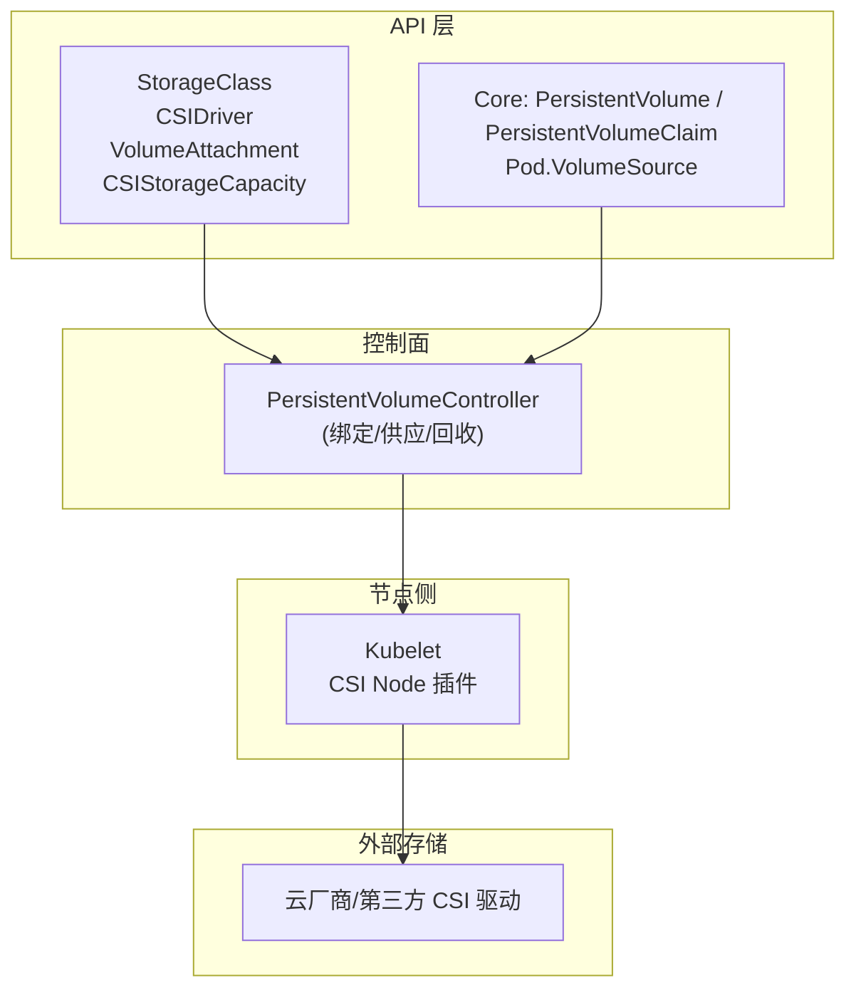
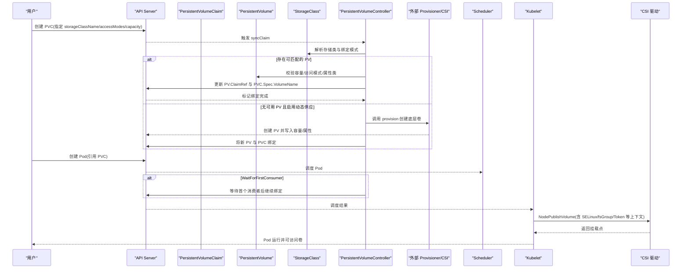
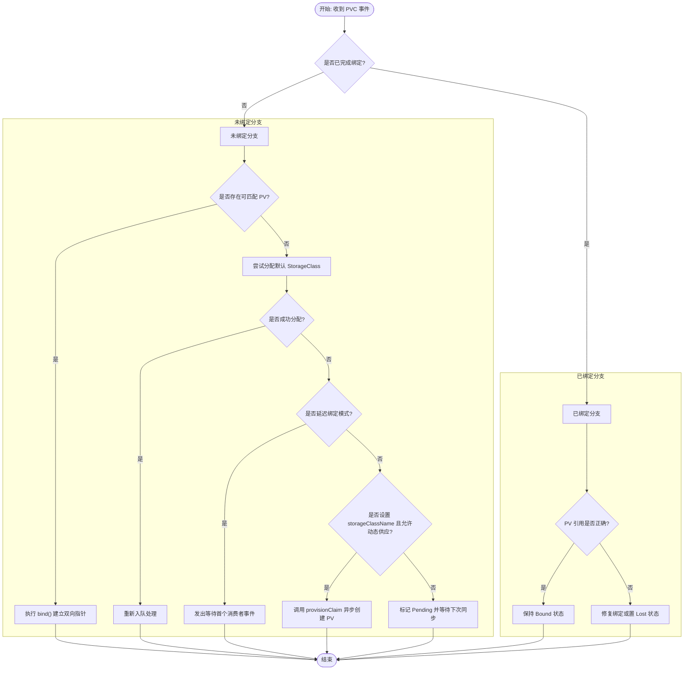
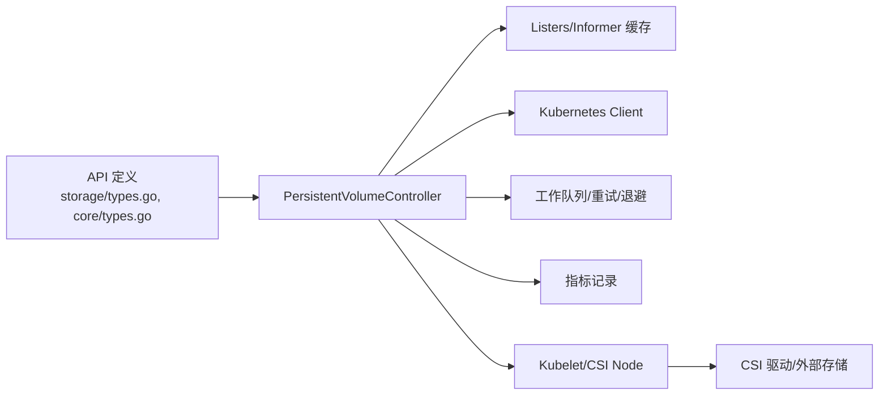

# 持久化存储

<cite>
**本文引用的文件**   
- [pkg/apis/storage/types.go](file://pkg/apis/storage/types.go)
- [pkg/controller/volume/persistentvolume/pv_controller.go](file://pkg/controller/volume/persistentvolume/pv_controller.go)
- [pkg/apis/core/types.go](file://pkg/apis/core/types.go)
</cite>

## 目录
1. [简介](#简介)
2. [项目结构](#项目结构)
3. [核心组件](#核心组件)
4. [架构总览](#架构总览)
5. [详细组件分析](#详细组件分析)
6. [依赖关系分析](#依赖关系分析)
7. [性能与容量管理](#性能与容量管理)
8. [故障排查指南](#故障排查指南)
9. [结论](#结论)
10. [附录：配置要点与最佳实践](#附录配置要点与最佳实践)

## 简介
本技术文档围绕 Kubernetes 的持久化存储机制，系统阐述持久卷（PV）与持久卷声明（PVC）的概念、生命周期与绑定流程；对比静态供应与动态供应的差异与适用场景；梳理块存储、文件存储、对象存储等类型的配置思路与最佳实践；并给出访问模式（ReadWriteOnce、ReadOnlyMany、ReadWriteMany、ReadWriteOncePod）、容量管理、配额与资源限制、性能调优及故障排查的实用建议。

## 项目结构
Kubernetes 中持久化存储相关的关键代码位于以下位置：
- API 类型定义：storage API 定义了 StorageClass、CSIDriver、VolumeAttachment、CSIStorageCapacity、VolumeAttributesClass 等核心对象；core API 定义了 Pod 中的 VolumeSource 以及 PV/PVC 的基础字段。
- 控制器实现：PersistentVolumeController 负责 PV 与 PVC 的绑定、动态供应、释放与回收等核心逻辑。

图表来源
- [pkg/apis/storage/types.go](file://pkg/apis/storage/types.go)
- [pkg/apis/core/types.go](file://pkg/apis/core/types.go)
- [pkg/controller/volume/persistentvolume/pv_controller.go](file://pkg/controller/volume/persistentvolume/pv_controller.go)

章节来源
- [pkg/apis/storage/types.go](file://pkg/apis/storage/types.go)
- [pkg/apis/core/types.go](file://pkg/apis/core/types.go)
- [pkg/controller/volume/persistentvolume/pv_controller.go](file://pkg/controller/volume/persistentvolume/pv_controller.go)

## 核心组件
- StorageClass：描述“存储类”，包含 provisioner、参数、回收策略、挂载选项、是否允许扩容、绑定模式（Immediate/WaitForFirstConsumer）、拓扑限制等。
- CSIDriver/CSINode/CSIStorageCapacity：CSI 驱动能力、节点能力与容量信息的声明式表达，用于调度与容量感知。
- VolumeAttachment：记录卷在节点上的挂载状态与错误信息，协调外部 Attacher 完成 attach/detach。
- PersistentVolumeController：核心控制器，负责 PV/PVC 双向指针维护、匹配与绑定、动态供应、释放与回收、延迟绑定事件提示等。

章节来源
- [pkg/apis/storage/types.go](file://pkg/apis/storage/types.go)
- [pkg/controller/volume/persistentvolume/pv_controller.go](file://pkg/controller/volume/persistentvolume/pv_controller.go)

## 架构总览
下图展示了从用户创建 PVC 到最终被 Pod 使用的端到端流程，包括绑定、动态供应、调度与挂载等环节。

图表来源
- [pkg/controller/volume/persistentvolume/pv_controller.go](file://pkg/controller/volume/persistentvolume/pv_controller.go)
- [pkg/apis/storage/types.go](file://pkg/apis/storage/types.go)

## 详细组件分析

### 组件一：PersistentVolumeController 绑定与供应流程
- 入口方法：syncClaim 根据 PVC 是否已完成绑定进入不同分支；未绑定时执行匹配或动态供应；已绑定时进行一致性修复。
- 匹配规则：checkVolumeSatisfyClaim 校验容量、storageClassName、VolumeAttributesClass、volumeMode、accessModes 等。
- 动态供应：当无可用 PV 且设置了 storageClassName 时，调用 provisionClaim 启动异步供应；完成后由后续同步完成绑定。
- 延迟绑定：对 WaitForFirstConsumer 模式，发出事件提示等待首个消费者；在 Pod 调度阶段才真正选择节点并完成绑定。
- 回收与释放：当 PVC 删除导致 PV 失去引用时，依据 reclaimPolicy 执行 Release/Recycle/Delete；若为动态创建的 PV 且被错误绑定到其他 PVC，会释放并删除。

图表来源
- [pkg/controller/volume/persistentvolume/pv_controller.go](file://pkg/controller/volume/persistentvolume/pv_controller.go)

章节来源
- [pkg/controller/volume/persistentvolume/pv_controller.go](file://pkg/controller/volume/persistentvolume/pv_controller.go)

### 组件二：StorageClass 与绑定模式
- 关键特性：
  - provisioner：指定驱动名称（支持前缀）。
  - parameters：透传给驱动的参数键值对。
  - reclaimPolicy：动态创建的 PV 的回收策略。
  - mountOptions：挂载选项。
  - allowVolumeExpansion：是否允许扩容。
  - volumeBindingMode：Immediate 或 WaitForFirstConsumer。
  - allowedTopologies：拓扑限制，配合调度器进行拓扑感知供应。
- 使用建议：
  - 需要按节点拓扑选择卷时，优先使用 WaitForFirstConsumer 并结合 allowedTopologies。
  - 对多副本共享读的场景，结合 ReadOnlyMany 提升并发读取效率。
  - 对单写多读但需强一致性的场景，谨慎评估 ReadWriteMany 的支持性与性能。

章节来源
- [pkg/apis/storage/types.go](file://pkg/apis/storage/types.go)

### 组件三：CSI 驱动与容量感知
- CSIDriver：声明驱动能力（是否需要 attach、是否传递 podInfoOnMount、生命周期模式、fsGroup 策略、SELinux 挂载、令牌传递方式等）。
- CSINode：节点上已安装的 CSI 驱动信息与拓扑键、可分配卷数量上限。
- CSIStorageCapacity：按拓扑段报告可用容量与最大卷大小，供调度器进行容量感知过滤。
- 使用建议：
  - 开启 CSIDriverSpec.StorageCapacity 以启用容量感知调度，避免在容量不足区域创建卷。
  - 合理配置 NodeAllocatableUpdatePeriodSeconds 以周期性上报节点可分配卷数，辅助调度决策。

章节来源
- [pkg/apis/storage/types.go](file://pkg/apis/storage/types.go)

### 组件四：VolumeAttachment 与挂载状态
- 作用：记录卷在节点上的 attach/detach 状态与错误信息，协调 external-attacher 与 CSI 驱动完成实际挂载。
- 排障要点：关注 Attached 标志、AttachError/DetachError 字段，定位底层驱动或云平台问题。

章节来源
- [pkg/apis/storage/types.go](file://pkg/apis/storage/types.go)

### 组件五：Pod 中的卷引用与 VolumeSource
- Pod 通过 PersistentVolumeClaimVolumeSource 引用 PVC，从而间接使用 PV。
- 其他 VolumeSource 类型（如 hostPath、nfs、csi 等）可用于临时或特定场景的卷挂载。

章节来源
- [pkg/apis/core/types.go](file://pkg/apis/core/types.go)

## 依赖关系分析
- API 层依赖：
  - storage API 提供 StorageClass、CSIDriver、VolumeAttachment、CSIStorageCapacity 等对象定义。
  - core API 提供 PV/PVC 基础结构与 Pod 的 VolumeSource。
- 控制面依赖：
  - PersistentVolumeController 监听 PV/PVC/StorageClass/Pod/Node 变化，维护本地缓存与工作队列，执行匹配、绑定、供应与回收。
- 节点侧依赖：
  - Kubelet 通过 CSI Node 插件完成 NodeStage/NodePublish，并根据 CSIDriver 能力决定是否传递 pod 信息、token、SELinux 上下文等。
- 外部依赖：
  - 外部 Provisioner/CSI 驱动负责底层卷的创建、扩容、快照等操作。

图表来源
- [pkg/apis/storage/types.go](file://pkg/apis/storage/types.go)
- [pkg/apis/core/types.go](file://pkg/apis/core/types.go)
- [pkg/controller/volume/persistentvolume/pv_controller.go](file://pkg/controller/volume/persistentvolume/pv_controller.go)

章节来源
- [pkg/apis/storage/types.go](file://pkg/apis/storage/types.go)
- [pkg/apis/core/types.go](file://pkg/apis/core/types.go)
- [pkg/controller/volume/persistentvolume/pv_controller.go](file://pkg/controller/volume/persistentvolume/pv_controller.go)

## 性能与容量管理
- 容量管理
  - 使用 CSIStorageCapacity 与 CSIDriverSpec.StorageCapacity 启用容量感知调度，避免在容量不足区域创建卷。
  - 合理设置 StorageClass 的 maximumVolumeSize 与 Capacity，确保调度器能正确过滤节点。
- 访问模式与性能
  - ReadWriteOnce：适用于单写多读受限场景，通常具备更高吞吐与更低延迟。
  - ReadOnlyMany：适合多副本只读共享，减少写放大。
  - ReadWriteMany：需确认后端存储支持与一致性模型，注意跨节点并发写入的性能与锁开销。
  - ReadWriteOncePod：将卷限制到单个 Pod 在单个节点上访问，增强隔离性，适用于强一致数据库等场景。
- 延迟绑定与拓扑
  - WaitForFirstConsumer 可减少不必要的提前供应，结合 allowedTopologies 实现就近挂载，降低网络延迟。
- 节点资源限制
  - CSINodeDriver.Allocatable.Count 限制每节点可挂载的唯一卷数量，防止节点过载。
- 扩容与再发布
  - AllowVolumeExpansion 开启后，可在 PVC 层面调整请求容量；某些驱动支持 RequiresRepublish 以周期性刷新挂载内容。

章节来源
- [pkg/apis/storage/types.go](file://pkg/apis/storage/types.go)
- [pkg/controller/volume/persistentvolume/pv_controller.go](file://pkg/controller/volume/persistentvolume/pv_controller.go)

## 故障排查指南
- 绑定失败
  - 检查 PVC 的 storageClassName、accessModes、capacity 是否与现有 PV 匹配；查看 checkVolumeSatisfyClaim 相关的错误原因（容量不足、类名不匹配、volumeMode 不兼容、访问模式不兼容等）。
  - 对于延迟绑定，确认是否有 Pod 引用该 PVC 并被调度；必要时查看事件提示“等待首个消费者”。
- 动态供应异常
  - 确认 StorageClass 的 provisioner 与参数正确；观察外部 Provisioner 日志与 CSI 驱动状态。
  - 若出现重复绑定或冲突，控制器会通过版本冲突与注解修正；检查 AnnBindCompleted、AnnBoundByController 等标注。
- 回收与释放
  - 当 PVC 删除后，依据 reclaimPolicy 决定 PV 行为；动态创建的 PV 若被错误绑定到其他 PVC，会被释放并删除。
- 挂载与 SELinux
  - 关注 CSIDriver 的 SELinuxMount 与 fsGroup 策略；在 ReadWriteOncePod 场景下，确保驱动支持独立 SELinux 上下文。
- 令牌与安全
  - 若启用 TokenRequests，确认 ServiceAccountTokenInSecrets 的配置与驱动读取路径，避免敏感信息泄露风险。

章节来源
- [pkg/controller/volume/persistentvolume/pv_controller.go](file://pkg/controller/volume/persistentvolume/pv_controller.go)
- [pkg/apis/storage/types.go](file://pkg/apis/storage/types.go)

## 结论
Kubernetes 的持久化存储通过 PV/PVC 抽象与 StorageClass 组合，实现了灵活的资源申请与供应机制。PersistentVolumeController 作为核心编排者，保障绑定一致性与幂等性；CSI 生态则提供了强大的可扩展性与能力声明。结合容量感知、延迟绑定与访问模式，可以在保证数据一致性的同时优化性能与可用性。运维侧应重点关注容量规划、拓扑约束与驱动能力，并通过事件与状态字段快速定位问题。

## 附录：配置要点与最佳实践
- 静态供应 vs 动态供应
  - 静态供应：管理员预先创建 PV，PVC 直接匹配；适用于固定资源池与离线环境。
  - 动态供应：PVC 指定 StorageClass，由 provisioner 按需创建 PV；适用于弹性伸缩与多云环境。
- 访问模式选择
  - 单写多读受限：ReadWriteOnce。
  - 多副本只读共享：ReadOnlyMany。
  - 多副本读写共享：ReadWriteMany（需确认后端支持与一致性模型）。
  - 强隔离与强一致：ReadWriteOncePod。
- 容量与配额
  - 使用 ResourceQuota 限制命名空间内 PVC 总量与总容量。
  - 结合 LimitRange 设定默认请求与上限，避免过大或过小分配。
- 性能调优
  - 选择合适的存储类与 IOPS/吞吐等级。
  - 利用 WaitForFirstConsumer 与拓扑标签减少跨区/跨节点访问。
  - 监控 CSIStorageCapacity 与 CSINode Allocatable，避免热点与瓶颈。
- 安全与合规
  - 合理使用 fsGroup 与 SELinux 挂载策略。
  - 使用 TokenRequests 与 Secrets 传递敏感信息，遵循最小权限原则。

[本节为通用指导，不直接分析具体文件]