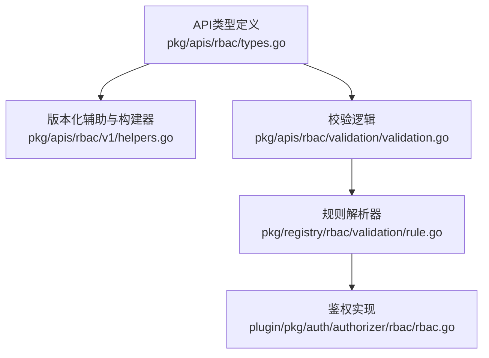
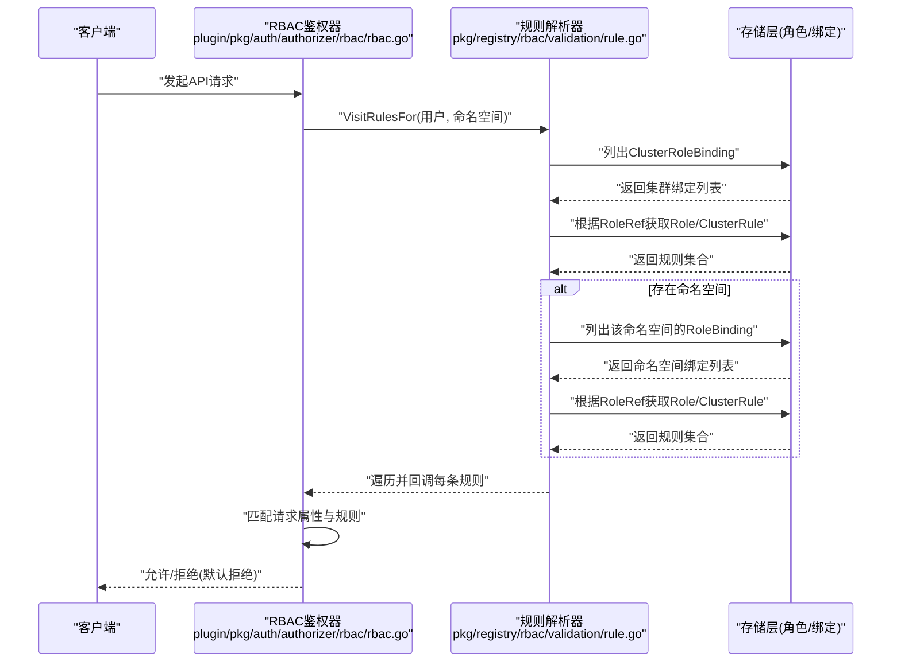
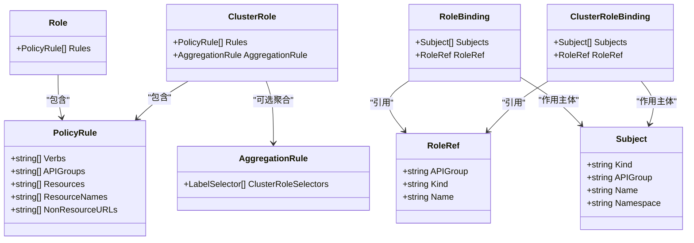
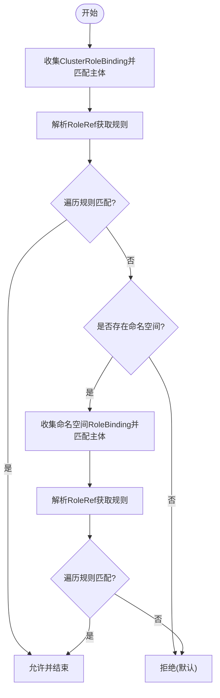
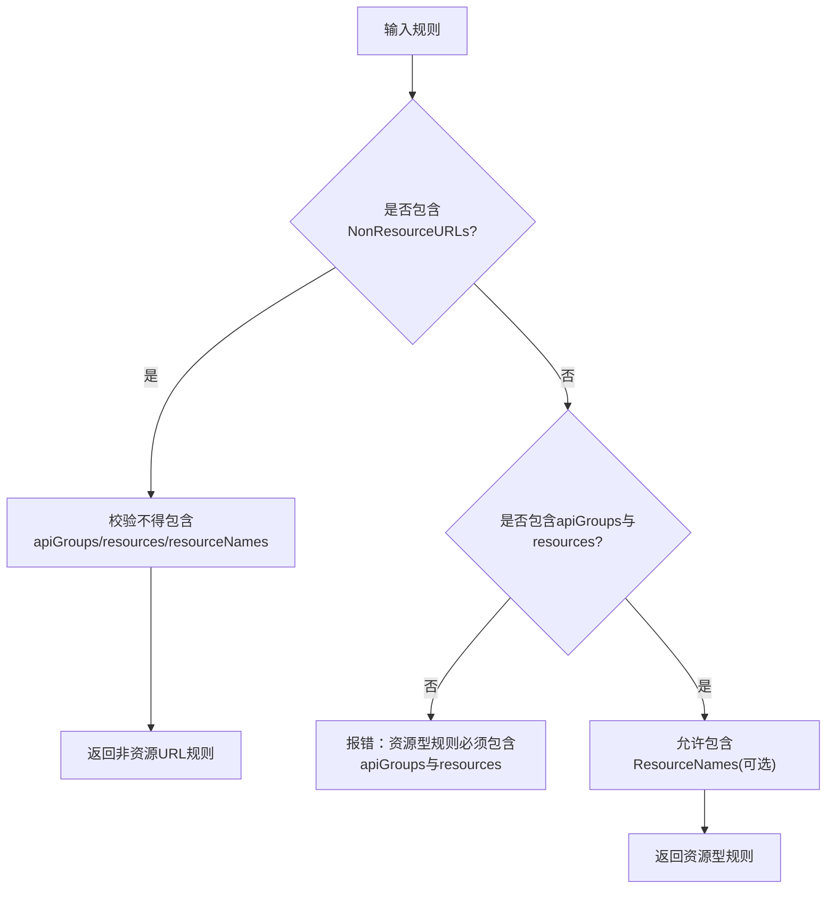
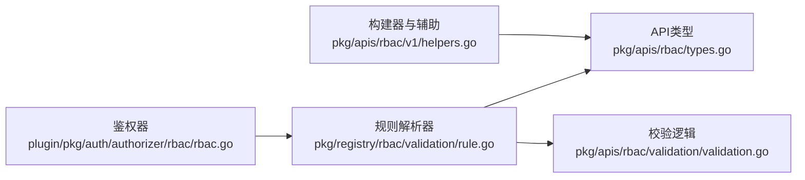

# RBAC权限模型

<cite>
**本文引用的文件**   
- [types.go](file://pkg/apis/rbac/types.go)
- [helpers.go](file://pkg/apis/rbac/v1/helpers.go)
- [validation.go](file://pkg/apis/rbac/validation/validation.go)
- [rule.go](file://pkg/registry/rbac/validation/rule.go)
- [rbac.go](file://plugin/pkg/auth/authorizer/rbac/rbac.go)
</cite>

## 目录
1. [简介](#简介)
2. [项目结构](#项目结构)
3. [核心组件](#核心组件)
4. [架构总览](#架构总览)
5. [详细组件分析](#详细组件分析)
6. [依赖关系分析](#依赖关系分析)
7. [性能考虑](#性能考虑)
8. [故障排查指南](#故障排查指南)
9. [结论](#结论)
10. [附录](#附录)

## 简介
本文件面向Kubernetes RBAC（基于角色的访问控制）权限模型，系统性阐述其核心概念、数据模型、规则语法与匹配策略、命名空间与集群范围的权限边界、执行流程与性能考量，并提供最佳实践与常见问题排查方法。文档内容严格基于仓库中的RBAC API定义、校验逻辑、规则解析器与鉴权实现进行提炼与说明。

## 项目结构
RBAC在仓库中由API类型定义、校验、规则解析与鉴权四个层次组成：
- API类型定义：位于pkg/apis/rbac下，包含Role、ClusterRole、RoleBinding、ClusterRoleBinding、PolicyRule、Subject等核心对象。
- 版本化辅助与构建器：位于pkg/apis/rbac/v1/helpers.go，提供规则与绑定的便捷构造工具。
- 校验逻辑：位于pkg/apis/rbac/validation/validation.go，对对象元数据、规则字段、绑定引用等进行约束检查。
- 规则解析器：位于pkg/registry/rbac/validation/rule.go，负责将用户身份与绑定关系展开为可评估的PolicyRule集合。
- 鉴权实现：位于plugin/pkg/auth/authorizer/rbac/rbac.go，实现Authorizer接口，依据请求属性与规则判定允许或拒绝。

**图示来源** 
- [types.go:1-211](file://pkg/apis/rbac/types.go#L1-L211)
- [helpers.go:1-239](file://pkg/apis/rbac/v1/helpers.go#L1-L239)
- [validation.go:1-251](file://pkg/apis/rbac/validation/validation.go#L1-L251)
- [rule.go:1-369](file://pkg/registry/rbac/validation/rule.go#L1-L369)
- [rbac.go:1-239](file://plugin/pkg/auth/authorizer/rbac/rbac.go#L1-L239)

**章节来源**
- [types.go:1-211](file://pkg/apis/rbac/types.go#L1-L211)
- [helpers.go:1-239](file://pkg/apis/rbac/v1/helpers.go#L1-L239)
- [validation.go:1-251](file://pkg/apis/rbac/validation/validation.go#L1-L251)
- [rule.go:1-369](file://pkg/registry/rbac/validation/rule.go#L1-L369)
- [rbac.go:1-239](file://plugin/pkg/auth/authorizer/rbac/rbac.go#L1-L239)

## 核心组件
- 主体（Subject）
  - 支持User、Group、ServiceAccount三种类型；ServiceAccount需指定Namespace，User/Group使用rbac组名作为APIGroup。
- 角色（Role/ClusterRole）
  - Role为命名空间级，ClusterRole为集群范围；二者均包含一组PolicyRule。
- 绑定（RoleBinding/ClusterRoleBinding）
  - RoleBinding在命名空间内生效，可引用同命名空间的Role或全局的ClusterRole；ClusterRoleBinding为集群范围，仅能引用ClusterRole。
- 规则（PolicyRule）
  - 资源型规则：必须包含apiGroups与resources，可选resourceNames；非资源URL规则：仅含nonResourceURLs，且不得与资源字段混用。
- 聚合（AggregationRule）
  - ClusterRole可通过标签选择器聚合其他ClusterRole的规则，由控制器管理。

**章节来源**
- [types.go:43-90](file://pkg/apis/rbac/types.go#L43-L90)
- [types.go:94-161](file://pkg/apis/rbac/types.go#L94-L161)
- [types.go:172-186](file://pkg/apis/rbac/types.go#L172-L186)
- [types.go:163-168](file://pkg/apis/rbac/types.go#L163-L168)
- [validation.go:104-127](file://pkg/apis/rbac/validation/validation.go#L104-L127)
- [validation.go:212-250](file://pkg/apis/rbac/validation/validation.go#L212-L250)

## 架构总览
RBAC鉴权的关键路径如下：
- 请求进入后，鉴权器收集适用于当前用户与命名空间的规则集合。
- 规则来源于两类绑定：集群范围的ClusterRoleBinding与命名空间级的RoleBinding。
- 规则匹配时，资源型请求会合并资源与子资源名称进行匹配；非资源URL请求则直接匹配路径前缀。
- 若任一规则允许，则立即放行；否则返回“无意见”（默认拒绝）。

**图示来源** 
- [rbac.go:78-130](file://plugin/pkg/auth/authorizer/rbac/rbac.go#L78-L130)
- [rule.go:179-237](file://pkg/registry/rbac/validation/rule.go#L179-L237)
- [rule.go:239-259](file://pkg/registry/rbac/validation/rule.go#L239-L259)

## 详细组件分析

### 数据模型与类图

**图示来源** 
- [types.go:43-90](file://pkg/apis/rbac/types.go#L43-L90)
- [types.go:94-161](file://pkg/apis/rbac/types.go#L94-L161)
- [types.go:172-186](file://pkg/apis/rbac/types.go#L172-L186)
- [types.go:163-168](file://pkg/apis/rbac/types.go#L163-L168)

**章节来源**
- [types.go:43-90](file://pkg/apis/rbac/types.go#L43-L90)
- [types.go:94-161](file://pkg/apis/rbac/types.go#L94-L161)
- [types.go:172-186](file://pkg/apis/rbac/types.go#L172-L186)
- [types.go:163-168](file://pkg/apis/rbac/types.go#L163-L168)

### 规则解析与匹配流程
- 规则收集顺序：先遍历所有ClusterRoleBinding，再遍历目标命名空间的RoleBinding。
- 主体匹配：
  - User：精确用户名匹配。
  - Group：检查用户所属组是否包含绑定中的组名。
  - ServiceAccount：按命名空间+名称匹配，命名空间可从绑定上下文推断。
- 规则匹配：
  - 资源型请求：合并资源与子资源为“资源/子资源”，依次匹配Verbs、APIGroups、Resources、ResourceNames。
  - 非资源URL请求：仅匹配Verbs与NonResourceURLs。
- 短路策略：一旦某条规则允许，立即返回允许；否则继续遍历。

**图示来源** 
- [rule.go:179-237](file://pkg/registry/rbac/validation/rule.go#L179-L237)
- [rule.go:281-304](file://pkg/registry/rbac/validation/rule.go#L281-L304)
- [rbac.go:191-206](file://plugin/pkg/auth/authorizer/rbac/rbac.go#L191-L206)

**章节来源**
- [rule.go:179-237](file://pkg/registry/rbac/validation/rule.go#L179-L237)
- [rule.go:281-304](file://pkg/registry/rbac/validation/rule.go#L281-L304)
- [rbac.go:191-206](file://plugin/pkg/auth/authorizer/rbac/rbac.go#L191-L206)

### 规则语法与匹配模式
- 资源型规则
  - 必填：Verbs、APIGroups、Resources。
  - 可选：ResourceNames用于白名单式限制具体资源实例。
  - 子资源匹配：资源与子资源组合后进行匹配。
- 非资源URL规则
  - 仅允许NonResourceURLs，禁止与资源相关字段同时出现。
  - URL匹配采用前缀匹配方式。
- 通配符
  - 支持“*”表示全部API组、资源、动词与非资源URL。

**图示来源** 
- [validation.go:104-127](file://pkg/apis/rbac/validation/validation.go#L104-L127)
- [helpers.go:79-107](file://pkg/apis/rbac/v1/helpers.go#L79-L107)

**章节来源**
- [validation.go:104-127](file://pkg/apis/rbac/validation/validation.go#L104-L127)
- [helpers.go:79-107](file://pkg/apis/rbac/v1/helpers.go#L79-L107)

### 命名空间与集群范围权限
- 命名空间级别
  - Role与RoleBinding限定在特定命名空间内生效。
  - RoleBinding可引用同命名空间的Role或全局的ClusterRole。
- 集群范围
  - ClusterRole与ClusterRoleBinding作用于整个集群。
  - ClusterRoleBinding只能引用ClusterRole。
- 非资源URL
  - 仅在集群范围的ClusterRole中通过ClusterRoleBinding生效。

**章节来源**
- [types.go:106-120](file://pkg/apis/rbac/types.go#L106-L120)
- [types.go:172-186](file://pkg/apis/rbac/types.go#L172-L186)
- [validation.go:170-200](file://pkg/apis/rbac/validation/validation.go#L170-L200)

### 最小权限原则与最佳实践
- 明确限定API组与资源，避免使用“*”过度授权。
- 优先使用ResourceNames进行细粒度实例级控制。
- 尽量使用ClusterRole复用权限集，并通过多个绑定分配给不同主体。
- 遵循“按需授予”，定期审计与清理未使用的绑定。
- 利用聚合ClusterRole组织通用权限，减少重复配置。

[本节为通用指导，不直接分析具体文件]

## 依赖关系分析
- 鉴权器依赖规则解析器，规则解析器依赖角色与绑定的读取能力。
- 校验模块对API对象进行创建/更新时的约束检查，确保规则与绑定语义正确。
- 版本化辅助模块提供便捷的规则与绑定构建器，便于测试与代码生成。

**图示来源** 
- [rbac.go:172-179](file://plugin/pkg/auth/authorizer/rbac/rbac.go#L172-L179)
- [rule.go:91-100](file://pkg/registry/rbac/validation/rule.go#L91-L100)
- [types.go:1-211](file://pkg/apis/rbac/types.go#L1-L211)
- [validation.go:1-251](file://pkg/apis/rbac/validation/validation.go#L1-L251)
- [helpers.go:1-239](file://pkg/apis/rbac/v1/helpers.go#L1-L239)

**章节来源**
- [rbac.go:172-179](file://plugin/pkg/auth/authorizer/rbac/rbac.go#L172-L179)
- [rule.go:91-100](file://pkg/registry/rbac/validation/rule.go#L91-L100)
- [types.go:1-211](file://pkg/apis/rbac/types.go#L1-L211)
- [validation.go:1-251](file://pkg/apis/rbac/validation/validation.go#L1-L251)
- [helpers.go:1-239](file://pkg/apis/rbac/v1/helpers.go#L1-L239)

## 性能考虑
- 规则收集与遍历
  - 先遍历集群绑定，再遍历命名空间绑定；在大量绑定场景下可能产生较多I/O与CPU开销。
- 主体匹配优化
  - ServiceAccount匹配使用高效的用户名比较函数，降低字符串处理成本。
- 短路机制
  - 一旦匹配到允许规则即短路返回，减少后续遍历。
- 日志与调试
  - 高详细度日志仅在拒绝路径开启，避免正常路径的性能损耗。

**章节来源**
- [rule.go:179-237](file://pkg/registry/rbac/validation/rule.go#L179-L237)
- [rule.go:281-304](file://pkg/registry/rbac/validation/rule.go#L281-L304)
- [rbac.go:88-123](file://plugin/pkg/auth/authorizer/rbac/rbac.go#L88-L123)

## 故障排查指南
- 常见错误
  - 规则缺少必填字段：如资源型规则未提供apiGroups或resources。
  - 非资源URL与资源字段混用：导致校验失败。
  - 绑定引用无效：RoleRef指向的角色不存在或类型不支持。
  - 主体不匹配：ServiceAccount命名空间缺失或不一致；User/Group名称不匹配。
- 诊断步骤
  - 确认请求是否为资源型或非资源URL，并核对对应规则字段。
  - 检查ClusterRoleBinding与RoleBinding的主体匹配情况。
  - 查看鉴权器的拒绝日志，定位未匹配的动词、资源或URL。
  - 使用规则解析器接口收集并打印实际生效的规则集合，验证预期。

**章节来源**
- [validation.go:104-127](file://pkg/apis/rbac/validation/validation.go#L104-L127)
- [validation.go:129-209](file://pkg/apis/rbac/validation/validation.go#L129-L209)
- [validation.go:212-250](file://pkg/apis/rbac/validation/validation.go#L212-L250)
- [rbac.go:88-130](file://plugin/pkg/auth/authorizer/rbac/rbac.go#L88-L130)

## 结论
Kubernetes RBAC通过清晰的数据模型与严格的校验规则，实现了可扩展的权限管理能力。其鉴权流程以“先集群后命名空间”的顺序收集规则，并在匹配阶段采用短路策略提升性能。实践中应遵循最小权限原则，结合聚合与复用机制，持续审计与优化权限配置，以确保系统的安全性与可维护性。

[本节为总结性内容，不直接分析具体文件]

## 附录
- 术语对照
  - 用户（User）、组（Group）、服务账号（ServiceAccount）
  - 角色（Role）、集群角色（ClusterRole）
  - 角色绑定（RoleBinding）、集群角色绑定（ClusterRoleBinding）
  - 规则（PolicyRule）、聚合（AggregationRule）

[本节为概念性补充，不直接分析具体文件]