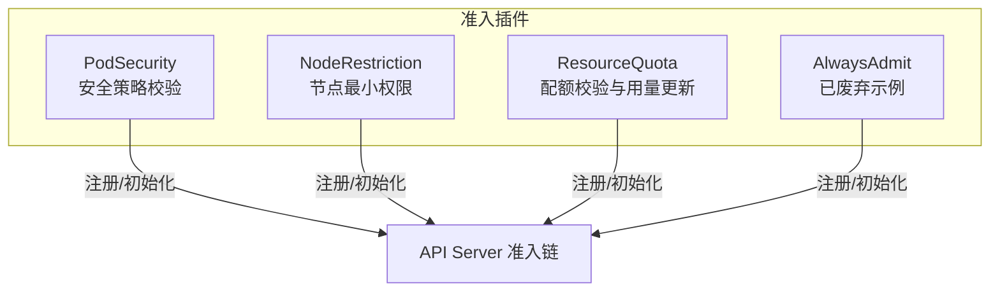
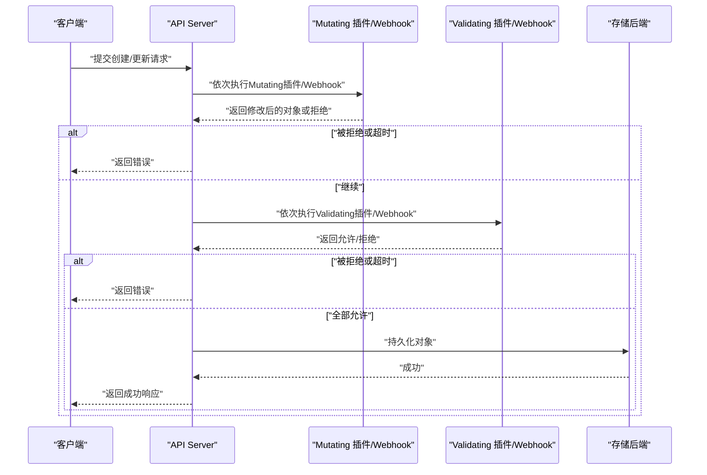
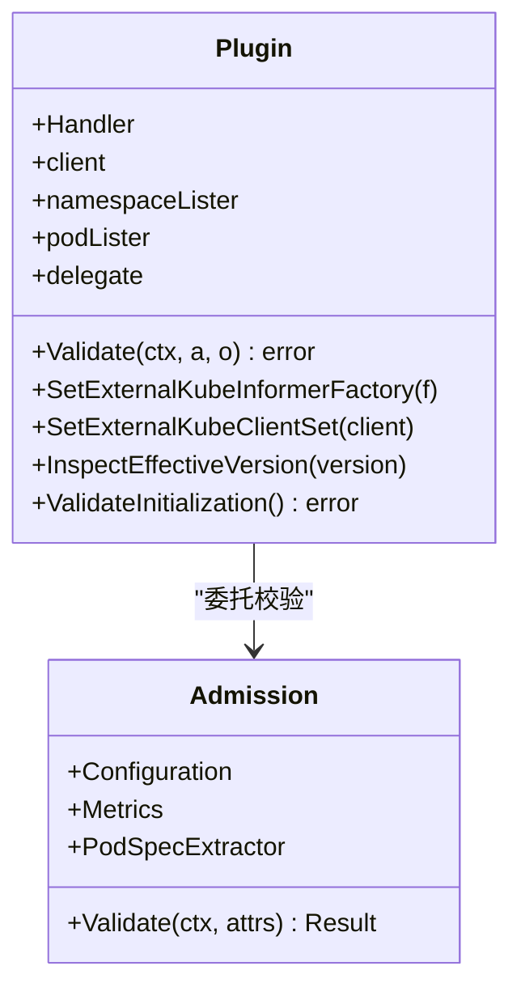
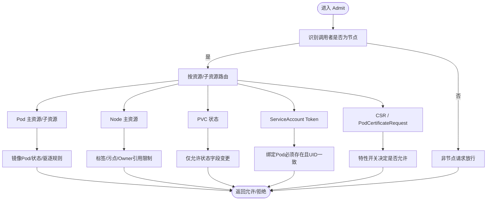
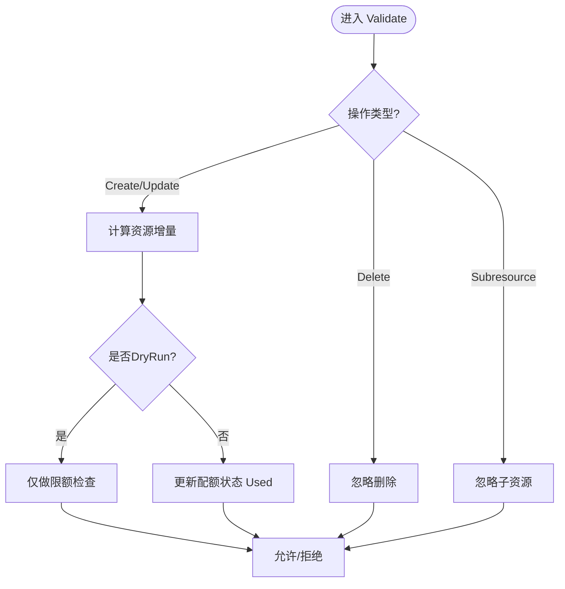
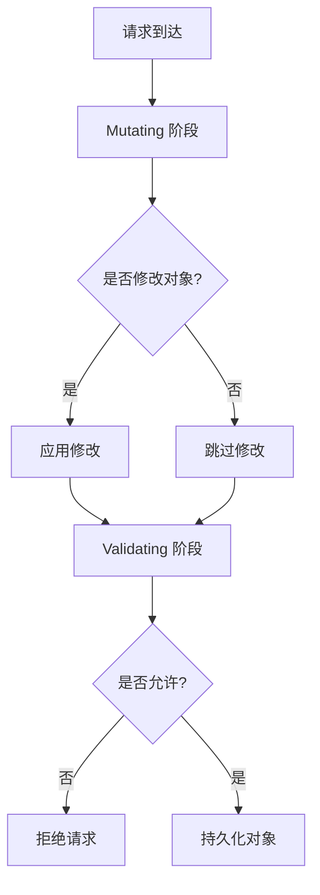
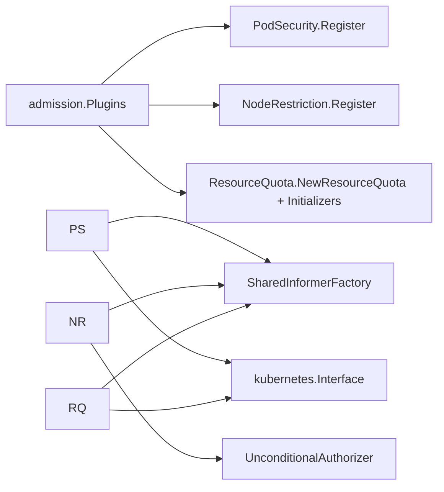

# 准入控制

<cite>
**本文引用的文件**   
- [admission.go](file://plugin/pkg/admission/security/podsecurity/admission.go)
- [admission.go](file://plugin/pkg/admission/noderestriction/admission.go)
- [admission_test.go](file://plugin/pkg/admission/resourcequota/admission_test.go)
- [admission.go](file://plugin/pkg/admission/admit/admission.go)
</cite>

## 目录
1. [简介](#简介)
2. [项目结构](#项目结构)
3. [核心组件](#核心组件)
4. [架构总览](#架构总览)
5. [详细组件分析](#详细组件分析)
6. [依赖关系分析](#依赖关系分析)
7. [性能考虑](#性能考虑)
8. [故障排查指南](#故障排查指南)
9. [结论](#结论)
10. [附录](#附录)

## 简介
本文件面向Kubernetes准入控制机制，系统性阐述其执行时机与作用域、Mutating与Validating两类插件的差异与适用场景、Admission Webhook的配置与开发要点（含TLS与重试）、内置插件功能（PodSecurity、NodeRestriction、ResourceQuota等），以及自定义插件开发、性能优化、安全考量与调试方法。文档以仓库中实际源码为依据，提供可追溯的“章节来源”和“图示来源”，帮助读者从概念到实现逐步掌握准入控制体系。

## 项目结构
围绕准入控制，仓库中与内置插件相关的核心代码位于 plugin/pkg/admission 下：
- PodSecurity：安全策略校验入口与适配层
- NodeRestriction：节点身份与最小权限约束
- ResourceQuota：配额校验与使用量更新（测试用例覆盖广泛）
- AlwaysAdmit：已废弃的“始终允许”示例插件

**图示来源**
- [admission.go:58-66](file://plugin/pkg/admission/security/podsecurity/admission.go#L58-L66)
- [admission.go:58-66](file://plugin/pkg/admission/noderestriction/admission.go#L58-L66)
- [admission_test.go:102-127](file://plugin/pkg/admission/resourcequota/admission_test.go#L102-L127)
- [admission.go:30-35](file://plugin/pkg/admission/admit/admission.go#L30-L35)

**章节来源**
- [admission.go:58-66](file://plugin/pkg/admission/security/podsecurity/admission.go#L58-L66)
- [admission.go:58-66](file://plugin/pkg/admission/noderestriction/admission.go#L58-L66)
- [admission_test.go:102-127](file://plugin/pkg/admission/resourcequota/admission_test.go#L102-L127)
- [admission.go:30-35](file://plugin/pkg/admission/admit/admission.go#L30-L35)

## 核心组件
本节聚焦三个关键内置插件的职责与行为特征，结合源码定位说明其作用范围与处理逻辑。

- PodSecurity
  - 职责：对Pod及相关资源进行安全策略校验，支持命名空间级默认策略与警告/审计标注输出。
  - 作用域：主要作用于创建/更新操作，针对包含PodSpec的资源类型进行解析与评估。
  - 关键点：通过外部Informer获取Namespace/Pod信息；根据有效版本选择兼容策略；将拒绝结果映射为标准错误状态码与详情。

- NodeRestriction
  - 职责：限制节点身份发起的请求，确保节点只能操作自身相关对象（如镜像Pod、节点状态、PVC状态、租约、CSINode、CSR等）。
  - 作用域：对多种资源与子资源进行细粒度授权检查，结合特性开关动态启用能力。
  - 关键点：基于用户身份识别节点；按资源路由到具体校验器；必要时调用无条件授权器进行额外鉴权。

- ResourceQuota
  - 职责：在准入阶段校验资源使用是否超出配额，并在通过后增量更新配额使用量。
  - 作用域：主要针对创建/更新操作，忽略删除与子资源请求；支持DryRun不持久化用量。
  - 关键点：对比新旧对象计算差异；仅对正增量触发status更新；对负变更或不存在旧对象时采用不同策略。

**章节来源**
- [admission.go:100-184](file://plugin/pkg/admission/security/podsecurity/admission.go#L100-L184)
- [admission.go:187-253](file://plugin/pkg/admission/noderestriction/admission.go#L187-L253)
- [admission_test.go:129-183](file://plugin/pkg/admission/resourcequota/admission_test.go#L129-L183)

## 架构总览
下图展示API Server在处理一次写入请求时的准入链流程，包括内置插件与Webhook的交互顺序与决策点。

[此图为概念性流程图，未直接映射具体源文件，故不提供图示来源]

## 详细组件分析

### PodSecurity 插件
- 角色与接口
  - 作为ValidationInterface实现，负责在Validate阶段进行安全策略评估。
  - 通过WantsExternalKubeInformerFactory与WantsExternalKubeClientSet注入外部Informer与Client。
- 关键流程
  - 构造委托对象并设置Metrics、PodSpecExtractor。
  - 在Validate中判断资源是否包含PodSpec，若包含则调用委托进行校验。
  - 将警告与审计注解附加到上下文；拒绝时转换为标准Forbidden错误。
- 版本与兼容性
  - 通过InspectEffectiveVersion感知二进制与模拟版本，必要时调整策略评估。

**图示来源**
- [admission.go:68-115](file://plugin/pkg/admission/security/podsecurity/admission.go#L68-L115)
- [admission.go:193-233](file://plugin/pkg/admission/security/podsecurity/admission.go#L193-L233)

**章节来源**
- [admission.go:100-184](file://plugin/pkg/admission/security/podsecurity/admission.go#L100-L184)
- [admission.go:193-233](file://plugin/pkg/admission/security/podsecurity/admission.go#L193-L233)

### NodeRestriction 插件
- 角色与接口
  - 实现admission.Interface，覆盖Create/Update/Delete等多种操作。
  - 通过WantsFeatures、WantsUnconditionalAuthorizer接入特性开关与授权器。
- 关键流程
  - 识别调用者是否为节点身份，无法识别则拒绝。
  - 按资源与子资源分发到对应校验器（Pod、Node、PVC、ServiceAccount、CSR等）。
  - 对部分路径（如服务账户令牌受众限制、Pod证书请求）调用无条件授权器进行二次鉴权。
- 典型规则
  - 节点仅能创建/删除绑定到自身的镜像Pod。
  - 节点仅能更新自身Pod状态且不允许变更标签等元数据。
  - 节点仅能更新PVC状态字段，禁止变更其他元数据。
  - 节点创建CSR受特性开关控制，可能允许不安全CSR。

**图示来源**
- [admission.go:187-253](file://plugin/pkg/admission/noderestriction/admission.go#L187-L253)
- [admission.go:255-341](file://plugin/pkg/admission/noderestriction/admission.go#L255-L341)
- [admission.go:343-447](file://plugin/pkg/admission/noderestriction/admission.go#L343-L447)
- [admission.go:449-537](file://plugin/pkg/admission/noderestriction/admission.go#L449-L537)
- [admission.go:539-603](file://plugin/pkg/admission/noderestriction/admission.go#L539-L603)
- [admission.go:661-712](file://plugin/pkg/admission/noderestriction/admission.go#L661-L712)
- [admission.go:714-752](file://plugin/pkg/admission/noderestriction/admission.go#L714-L752)

**章节来源**
- [admission.go:187-253](file://plugin/pkg/admission/noderestriction/admission.go#L187-L253)
- [admission.go:255-341](file://plugin/pkg/admission/noderestriction/admission.go#L255-L341)
- [admission.go:343-447](file://plugin/pkg/admission/noderestriction/admission.go#L343-L447)
- [admission.go:449-537](file://plugin/pkg/admission/noderestriction/admission.go#L449-L537)
- [admission.go:539-603](file://plugin/pkg/admission/noderestriction/admission.go#L539-L603)
- [admission.go:661-712](file://plugin/pkg/admission/noderestriction/admission.go#L661-L712)
- [admission.go:714-752](file://plugin/pkg/admission/noderestriction/admission.go#L714-L752)

### ResourceQuota 插件（基于测试用例的行为验证）
- 行为要点
  - 忽略删除操作与子资源请求。
  - 创建Pod时若超过配额则拒绝；否则更新配额状态中的Used计数。
  - DryRun模式下不进行持久化更新，但仍可进行超限判定。
  - 更新场景需比较新旧对象，仅对正增量触发status更新；负变更不触发更新。
  - 当旧对象不存在时，将更新视为“创建”来计算用量。
- 典型用例
  - 低于配额限制：允许并通过update resourcequotas status记录用量。
  - 超过配额限制：拒绝并返回错误。
  - 指定内存limit强制要求：若配额跟踪LimitsMemory但Pod未声明，则拒绝。
  - 命名空间无配额：请求不受影响。
  - Terminating与非Terminating配额区分：终止态Pod计入相应配额。

**图示来源**
- [admission_test.go:129-183](file://plugin/pkg/admission/resourcequota/admission_test.go#L129-L183)
- [admission_test.go:185-259](file://plugin/pkg/admission/resourcequota/admission_test.go#L185-L259)
- [admission_test.go:261-307](file://plugin/pkg/admission/resourcequota/admission_test.go#L261-L307)
- [admission_test.go:309-403](file://plugin/pkg/admission/resourcequota/admission_test.go#L309-L403)
- [admission_test.go:405-455](file://plugin/pkg/admission/resourcequota/admission_test.go#L405-L455)
- [admission_test.go:457-545](file://plugin/pkg/admission/resourcequota/admission_test.go#L457-L545)
- [admission_test.go:547-638](file://plugin/pkg/admission/resourcequota/admission_test.go#L547-L638)
- [admission_test.go:640-674](file://plugin/pkg/admission/resourcequota/admission_test.go#L640-L674)
- [admission_test.go:676-715](file://plugin/pkg/admission/resourcequota/admission_test.go#L676-L715)
- [admission_test.go:717-755](file://plugin/pkg/admission/resourcequota/admission_test.go#L717-L755)
- [admission_test.go:757-800](file://plugin/pkg/admission/resourcequota/admission_test.go#L757-L800)

**章节来源**
- [admission_test.go:129-183](file://plugin/pkg/admission/resourcequota/admission_test.go#L129-L183)
- [admission_test.go:185-259](file://plugin/pkg/admission/resourcequota/admission_test.go#L185-L259)
- [admission_test.go:261-307](file://plugin/pkg/admission/resourcequota/admission_test.go#L261-L307)
- [admission_test.go:309-403](file://plugin/pkg/admission/resourcequota/admission_test.go#L309-L403)
- [admission_test.go:405-455](file://plugin/pkg/admission/resourcequota/admission_test.go#L405-L455)
- [admission_test.go:457-545](file://plugin/pkg/admission/resourcequota/admission_test.go#L457-L545)
- [admission_test.go:547-638](file://plugin/pkg/admission/resourcequota/admission_test.go#L547-L638)
- [admission_test.go:640-674](file://plugin/pkg/admission/resourcequota/admission_test.go#L640-L674)
- [admission_test.go:676-715](file://plugin/pkg/admission/resourcequota/admission_test.go#L676-L715)
- [admission_test.go:717-755](file://plugin/pkg/admission/resourcequota/admission_test.go#L717-L755)
- [admission_test.go:757-800](file://plugin/pkg/admission/resourcequota/admission_test.go#L757-L800)

### 概念性概览：Mutating vs Validating
- Mutating
  - 执行时机：在对象持久化之前，可对对象进行修改。
  - 适用场景：注入默认值、补丁、转换格式、添加注解/标签等。
  - 风险：若失败或超时会影响后续Validating与持久化，需谨慎设计幂等性与容错。
- Validating
  - 执行时机：在对象持久化之前，仅做校验，不可修改对象。
  - 适用场景：策略合规、配额检查、安全基线、业务规则校验等。
  - 风险：拒绝会直接中断请求，应提供清晰的错误信息与原因。

[此图为概念性流程图，未直接映射具体源文件，故不提供图示来源]

## 依赖关系分析
- 插件注册与初始化
  - 各插件通过Register函数向admission.Plugins注册，由API Server在启动时加载。
  - 插件可通过WantsExternalKubeInformerFactory/WantsExternalKubeClientSet/WantsFeatures/WantsUnconditionalAuthorizer等接口接收外部依赖。
- 内部耦合与内聚
  - PodSecurity高内聚于策略评估与版本兼容；对外部Informer/Client依赖清晰。
  - NodeRestriction强耦合于节点身份识别与多资源路由，具备条件分支较多的特点。
  - ResourceQuota通过测试用例体现与配额系统、Informer、Client的协作模式。

**图示来源**
- [admission.go:62-66](file://plugin/pkg/admission/security/podsecurity/admission.go#L62-L66)
- [admission.go:62-66](file://plugin/pkg/admission/noderestriction/admission.go#L62-L66)
- [admission_test.go:102-127](file://plugin/pkg/admission/resourcequota/admission_test.go#L102-L127)

**章节来源**
- [admission.go:62-66](file://plugin/pkg/admission/security/podsecurity/admission.go#L62-L66)
- [admission.go:62-66](file://plugin/pkg/admission/noderestriction/admission.go#L62-L66)
- [admission_test.go:102-127](file://plugin/pkg/admission/resourcequota/admission_test.go#L102-L127)

## 性能考虑
- 减少不必要的对象转换与深拷贝
  - PodSecurity采用懒转换包装Attributes，仅在需要时进行对象转换，降低开销。
- 避免频繁I/O
  - NodeRestriction通过Informer缓存读取Pod/Node/SA等信息，减少实时查询。
- 精准匹配与短路
  - 尽早判断资源/子资源/操作类型，快速放行无关请求，缩短处理路径。
- 合理配置Webhook超时与重试
  - 对于外部Webhook，建议设置合理的超时与最大重试次数，避免阻塞API Server主循环。
- 批量化与并行
  - 在插件内部尽量复用共享状态（如列表器、缓存），避免重复构建昂贵对象。

[本节为通用指导，不直接分析具体文件，故不提供章节来源]

## 故障排查指南
- 常见错误与定位
  - 节点身份识别失败：检查认证信息是否能正确映射到节点名称。
  - 配额超限：查看ResourceQuota的Hard与Used字段，确认是否存在未释放资源或统计偏差。
  - 安全策略拒绝：关注PodSecurity返回的错误消息与审计注解，定位违反的策略项。
- 日志与指标
  - 利用API Server日志与审计日志追踪准入链执行路径与耗时。
  - 关注插件暴露的Prometheus指标（如PodSecurity的度量记录器）。
- 调试技巧
  - 使用DryRun参数进行预检，避免真实写入带来的副作用。
  - 逐步禁用插件或缩小匹配范围，隔离问题来源。

**章节来源**
- [admission.go:193-233](file://plugin/pkg/admission/security/podsecurity/admission.go#L193-L233)
- [admission_test.go:261-307](file://plugin/pkg/admission/resourcequota/admission_test.go#L261-L307)

## 结论
Kubernetes准入控制通过Mutating与Validating两类插件与Webhook的组合，提供了强大的请求前拦截与扩展能力。内置插件如PodSecurity、NodeRestriction、ResourceQuota覆盖了安全、权限与资源治理的关键需求。在实际部署中，应重视插件的性能与安全设计，合理配置Webhook的TLS与重试策略，并通过测试与监控持续优化。

[本节为总结性内容，不直接分析具体文件，故不提供章节来源]

## 附录
- 术语
  - 准入控制：在对象持久化之前对请求进行校验或修改的机制。
  - Mutating：可在准入阶段修改对象的插件或Webhook。
  - Validating：仅在准入阶段进行校验的插件或Webhook。
  - Webhook：外部HTTP服务，用于扩展API Server的准入逻辑。
- 最佳实践
  - 明确插件职责边界，避免过度耦合。
  - 对拒绝路径提供清晰错误信息与原因。
  - 对Webhook实施严格的TLS与证书轮换策略。
  - 在大规模集群中谨慎启用高延迟插件，优先使用本地缓存与短路逻辑。

[本节为概念性内容，不直接分析具体文件，故不提供章节来源]