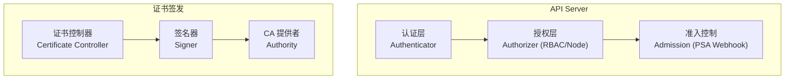
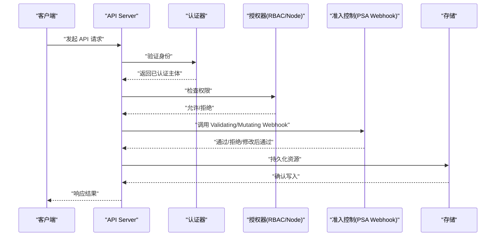
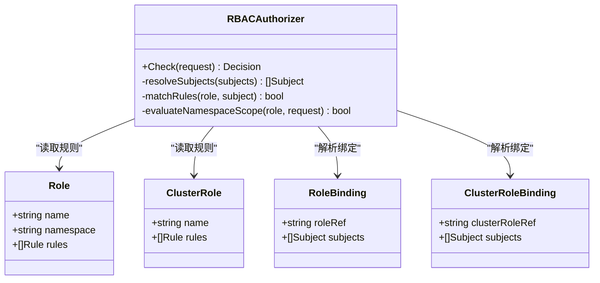
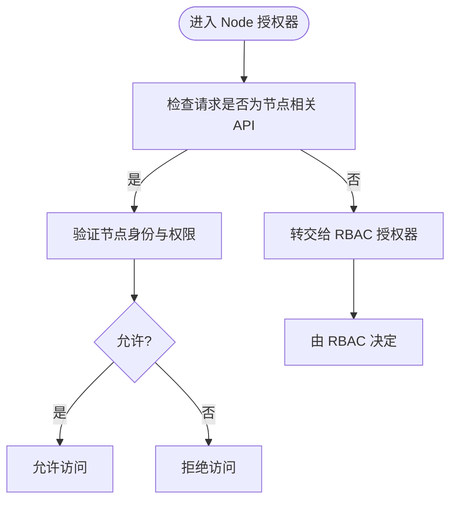
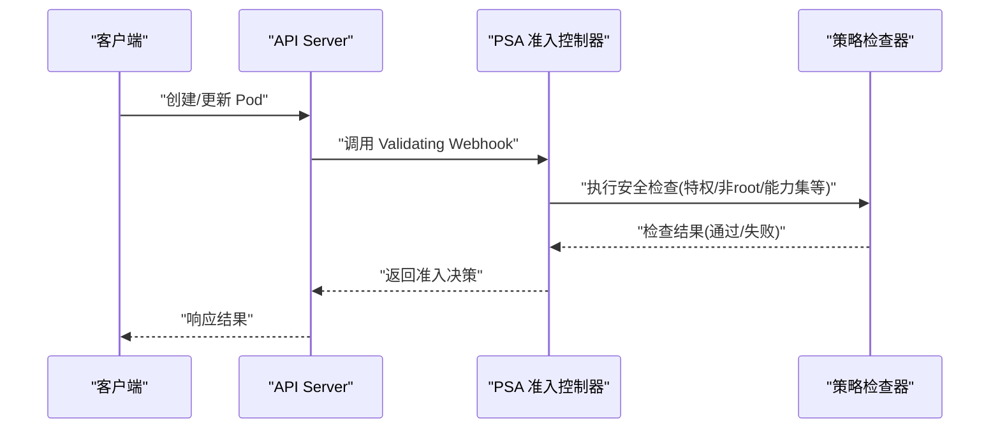
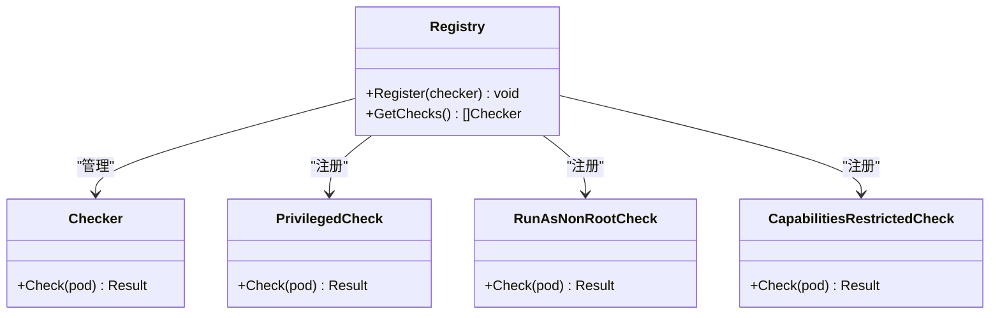
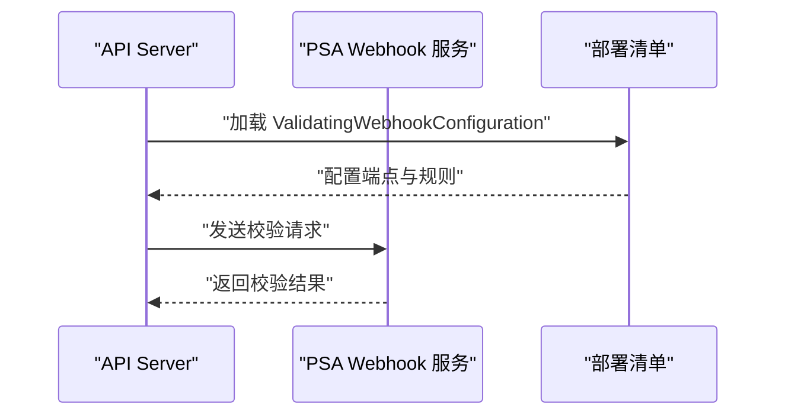
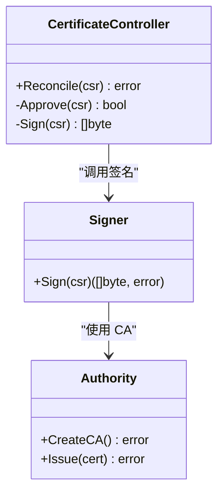
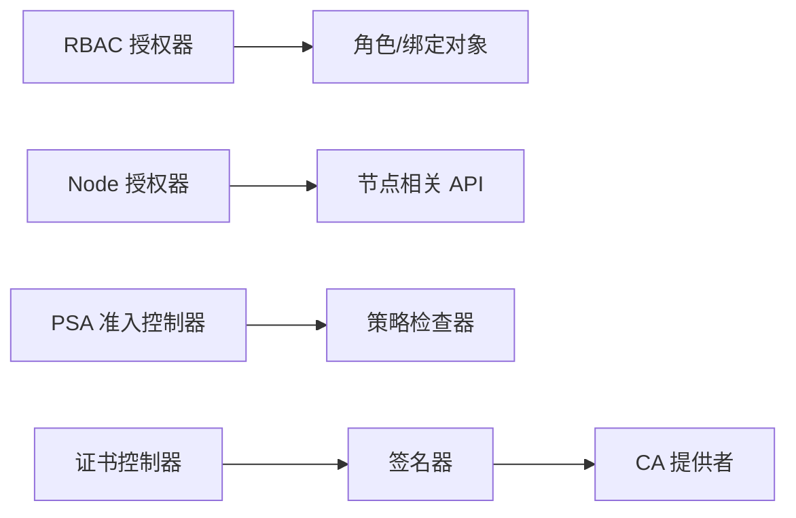

# 安全与权限

<cite>
**本文引用的文件**   
- [staging/src/k8s.io/pod-security-admission/doc.go](file://staging/src/k8s.io/pod-security-admission/doc.go)
- [staging/src/k8s.io/pod-security-admission/admission/admission.go](file://staging/src/k8s.io/pod-security-admission/admission/admission.go)
- [staging/src/k8s.io/pod-security-admission/policy/check_privileged.go](file://staging/src/k8s.io/pod-security-admission/policy/check_privileged.go)
- [staging/src/k8s.io/pod-security-admission/policy/check_runAsNonRoot.go](file://staging/src/k8s.io/pod-security-admission/policy/check_runAsNonRoot.go)
- [staging/src/k8s.io/pod-security-admission/policy/check_capabilities_restricted.go](file://staging/src/k8s.io/pod-security-admission/policy/check_capabilities_restricted.go)
- [staging/src/k8s.io/pod-security-admission/policy/registry.go](file://staging/src/k8s.io/pod-security-admission/policy/registry.go)
- [staging/src/k8s.io/pod-security-admission/cmd/webhook/webhook.go](file://staging/src/k8s.io/pod-security-admission/cmd/webhook/webhook.go)
- [staging/src/k8s.io/pod-security-admission/webhook/manifests/70-validatingwebhookconfiguration.yaml](file://staging/src/k8s.io/pod-security-admission/webhook/manifests/70-validatingwebhookconfiguration.yaml)
- [plugin/pkg/auth/authorizer/rbac/rbac.go](file://plugin/pkg/auth/authorizer/rbac/rbac.go)
- [plugin/pkg/auth/authorizer/node/node_authorizer.go](file://plugin/pkg/auth/authorizer/node/node_authorizer.go)
- [pkg/controller/certificates/certificate_controller.go](file://pkg/controller/certificates/certificate_controller.go)
- [pkg/controller/certificates/signer/signer.go](file://pkg/controller/certificates/signer/signer.go)
- [pkg/controller/certificates/authority/authority.go](file://pkg/controller/certificates/authority/authority.go)
</cite>

## 目录
1. [简介](#简介)
2. [项目结构](#项目结构)
3. [核心组件](#核心组件)
4. [架构总览](#架构总览)
5. [详细组件分析](#详细组件分析)
6. [依赖关系分析](#依赖关系分析)
7. [性能考量](#性能考量)
8. [故障排查指南](#故障排查指南)
9. [结论](#结论)
10. [附录](#附录)

## 简介
本技术文档围绕 Kubernetes 的安全与权限体系展开，重点覆盖以下主题：
- RBAC（基于角色的访问控制）模型：用户、角色、绑定关系的权限管理方式
- 认证机制：客户端证书、令牌、Webhook 等认证后端支持
- 授权策略执行流程与自定义授权插件开发方法
- 准入控制（Admission Control）：Mutating 与 Validating Webhook 的实现原理
- 证书管理与密钥加密、安全审计最佳实践
- 网络安全策略、Pod 安全策略与容器安全上下文的配置方法

为便于读者理解，文档在概念性内容之外，结合仓库中的实际源码与清单进行代码级分析与图示说明。

## 项目结构
与安全与权限相关的核心实现分布在如下位置：
- RBAC 授权器：plugin/pkg/auth/authorizer/rbac
- Node 专用授权器：plugin/pkg/auth/authorizer/node
- Pod 安全准入控制器（PSA）：staging/src/k8s.io/pod-security-admission
- 证书签发与控制面组件：pkg/controller/certificates

图表来源
- [plugin/pkg/auth/authorizer/rbac/rbac.go](file://plugin/pkg/auth/authorizer/rbac/rbac.go)
- [plugin/pkg/auth/authorizer/node/node_authorizer.go](file://plugin/pkg/auth/authorizer/node/node_authorizer.go)
- [staging/src/k8s.io/pod-security-admission/admission/admission.go](file://staging/src/k8s.io/pod-security-admission/admission/admission.go)
- [pkg/controller/certificates/certificate_controller.go](file://pkg/controller/certificates/certificate_controller.go)
- [pkg/controller/certificates/signer/signer.go](file://pkg/controller/certificates/signer/signer.go)
- [pkg/controller/certificates/authority/authority.go](file://pkg/controller/certificates/authority/authority.go)

章节来源
- [plugin/pkg/auth/authorizer/rbac/rbac.go](file://plugin/pkg/auth/authorizer/rbac/rbac.go)
- [plugin/pkg/auth/authorizer/node/node_authorizer.go](file://plugin/pkg/auth/authorizer/node/node_authorizer.go)
- [staging/src/k8s.io/pod-security-admission/admission/admission.go](file://staging/src/k8s.io/pod-security-admission/admission/admission.go)
- [pkg/controller/certificates/certificate_controller.go](file://pkg/controller/certificates/certificate_controller.go)
- [pkg/controller/certificates/signer/signer.go](file://pkg/controller/certificates/signer/signer.go)
- [pkg/controller/certificates/authority/authority.go](file://pkg/controller/certificates/authority/authority.go)

## 核心组件
- RBAC 授权器：负责解析 Role/ClusterRole、RoleBinding/ClusterRoleBinding 以及 Subject 的权限匹配逻辑
- Node 授权器：针对节点相关 API 的专用授权路径
- Pod 安全准入控制器（PSA）：以 Validating Webhook 形式对 Pod 安全上下文进行检查与拦截
- 证书签发子系统：包含证书控制器、签名器与 CA 提供者，用于集群内证书生命周期管理

章节来源
- [plugin/pkg/auth/authorizer/rbac/rbac.go](file://plugin/pkg/auth/authorizer/rbac/rbac.go)
- [plugin/pkg/auth/authorizer/node/node_authorizer.go](file://plugin/pkg/auth/authorizer/node/node_authorizer.go)
- [staging/src/k8s.io/pod-security-admission/admission/admission.go](file://staging/src/k8s.io/pod-security-admission/admission/admission.go)
- [pkg/controller/certificates/certificate_controller.go](file://pkg/controller/certificates/certificate_controller.go)
- [pkg/controller/certificates/signer/signer.go](file://pkg/controller/certificates/signer/signer.go)
- [pkg/controller/certificates/authority/authority.go](file://pkg/controller/certificates/authority/authority.go)

## 架构总览
Kubernetes 请求处理链路中，安全与权限的关键阶段如下：
- 认证：验证客户端身份（如客户端证书、Bearer Token、Webhook 等）
- 授权：根据 RBAC 或 Node 授权器判断是否允许操作
- 准入控制：通过 Mutating/Validating Webhook 对资源进行校验与修改
- 持久化：将合法请求写入存储

图表来源
- [plugin/pkg/auth/authorizer/rbac/rbac.go](file://plugin/pkg/auth/authorizer/rbac/rbac.go)
- [plugin/pkg/auth/authorizer/node/node_authorizer.go](file://plugin/pkg/auth/authorizer/node/node_authorizer.go)
- [staging/src/k8s.io/pod-security-admission/admission/admission.go](file://staging/src/k8s.io/pod-security-admission/admission/admission.go)

## 详细组件分析

### RBAC 授权器
RBAC 是 Kubernetes 默认且推荐的授权模型，核心对象包括：
- Role/ClusterRole：定义一组权限规则（资源、动词、命名空间范围）
- RoleBinding/ClusterRoleBinding：将角色授予用户、组或服务账号
- Subject：被授权的主体（User、Group、ServiceAccount）

RBAC 授权器在请求进入时，依据请求主体与目标资源的属性进行匹配，判定是否允许。

图表来源
- [plugin/pkg/auth/authorizer/rbac/rbac.go](file://plugin/pkg/auth/authorizer/rbac/rbac.go)

章节来源
- [plugin/pkg/auth/authorizer/rbac/rbac.go](file://plugin/pkg/auth/authorizer/rbac/rbac.go)

### Node 专用授权器
Node 授权器专门处理与节点相关的 API 访问，通常用于 kubelet 等系统组件的受限访问场景。其逻辑与通用 RBAC 不同，专注于节点身份与资源类型的快速判定。

图表来源
- [plugin/pkg/auth/authorizer/node/node_authorizer.go](file://plugin/pkg/auth/authorizer/node/node_authorizer.go)

章节来源
- [plugin/pkg/auth/authorizer/node/node_authorizer.go](file://plugin/pkg/auth/authorizer/node/node_authorizer.go)

### Pod 安全准入控制器（PSA）
PSA 作为 Validating Webhook 运行，对 Pod 的安全上下文进行策略检查，常见检查项包括：
- 特权容器限制
- 非 root 用户强制
- 能力集最小化（capabilities）
- 其他内核与挂载相关约束

图表来源
- [staging/src/k8s.io/pod-security-admission/admission/admission.go](file://staging/src/k8s.io/pod-security-admission/admission/admission.go)
- [staging/src/k8s.io/pod-security-admission/policy/check_privileged.go](file://staging/src/k8s.io/pod-security-admission/policy/check_privileged.go)
- [staging/src/k8s.io/pod-security-admission/policy/check_runAsNonRoot.go](file://staging/src/k8s.io/pod-security-admission/policy/check_runAsNonRoot.go)
- [staging/src/k8s.io/pod-security-admission/policy/check_capabilities_restricted.go](file://staging/src/k8s.io/pod-security-admission/policy/check_capabilities_restricted.go)

章节来源
- [staging/src/k8s.io/pod-security-admission/admission/admission.go](file://staging/src/k8s.io/pod-security-admission/admission/admission.go)
- [staging/src/k8s.io/pod-security-admission/policy/check_privileged.go](file://staging/src/k8s.io/pod-security-admission/policy/check_privileged.go)
- [staging/src/k8s.io/pod-security-admission/policy/check_runAsNonRoot.go](file://staging/src/k8s.io/pod-security-admission/policy/check_runAsNonRoot.go)
- [staging/src/k8s.io/pod-security-admission/policy/check_capabilities_restricted.go](file://staging/src/k8s.io/pod-security-admission/policy/check_capabilities_restricted.go)

### PSA 策略注册表与检查项
PSA 的策略检查项通过注册表统一管理，新增检查只需实现相应接口并注册。

图表来源
- [staging/src/k8s.io/pod-security-admission/policy/registry.go](file://staging/src/k8s.io/pod-security-admission/policy/registry.go)
- [staging/src/k8s.io/pod-security-admission/policy/check_privileged.go](file://staging/src/k8s.io/pod-security-admission/policy/check_privileged.go)
- [staging/src/k8s.io/pod-security-admission/policy/check_runAsNonRoot.go](file://staging/src/k8s.io/pod-security-admission/policy/check_runAsNonRoot.go)
- [staging/src/k8s.io/pod-security-admission/policy/check_capabilities_restricted.go](file://staging/src/k8s.io/pod-security-admission/policy/check_capabilities_restricted.go)

章节来源
- [staging/src/k8s.io/pod-security-admission/policy/registry.go](file://staging/src/k8s.io/pod-security-admission/policy/registry.go)

### PSA Webhook 服务与部署清单
PSA 提供独立的 Webhook 服务，并通过 ValidatingWebhookConfiguration 暴露给 API Server。

图表来源
- [staging/src/k8s.io/pod-security-admission/cmd/webhook/webhook.go](file://staging/src/k8s.io/pod-security-admission/cmd/webhook/webhook.go)
- [staging/src/k8s.io/pod-security-admission/webhook/manifests/70-validatingwebhookconfiguration.yaml](file://staging/src/k8s.io/pod-security-admission/webhook/manifests/70-validatingwebhookconfiguration.yaml)

章节来源
- [staging/src/k8s.io/pod-security-admission/cmd/webhook/webhook.go](file://staging/src/k8s.io/pod-security-admission/cmd/webhook/webhook.go)
- [staging/src/k8s.io/pod-security-admission/webhook/manifests/70-validatingwebhookconfiguration.yaml](file://staging/src/k8s.io/pod-security-admission/webhook/manifests/70-validatingwebhookconfiguration.yaml)

### 证书签发子系统
证书签发子系统由控制器、签名器与 CA 提供者组成，负责集群内证书的申请、审批与签发。

图表来源
- [pkg/controller/certificates/certificate_controller.go](file://pkg/controller/certificates/certificate_controller.go)
- [pkg/controller/certificates/signer/signer.go](file://pkg/controller/certificates/signer/signer.go)
- [pkg/controller/certificates/authority/authority.go](file://pkg/controller/certificates/authority/authority.go)

章节来源
- [pkg/controller/certificates/certificate_controller.go](file://pkg/controller/certificates/certificate_controller.go)
- [pkg/controller/certificates/signer/signer.go](file://pkg/controller/certificates/signer/signer.go)
- [pkg/controller/certificates/authority/authority.go](file://pkg/controller/certificates/authority/authority.go)

## 依赖关系分析
- RBAC 授权器依赖角色与绑定对象的读取与匹配逻辑
- Node 授权器与 RBAC 解耦，专注节点相关 API 的快速判定
- PSA 准入控制器依赖策略检查器的注册与执行
- 证书签发子系统依赖签名器与 CA 提供者完成证书生成

图表来源
- [plugin/pkg/auth/authorizer/rbac/rbac.go](file://plugin/pkg/auth/authorizer/rbac/rbac.go)
- [plugin/pkg/auth/authorizer/node/node_authorizer.go](file://plugin/pkg/auth/authorizer/node/node_authorizer.go)
- [staging/src/k8s.io/pod-security-admission/policy/registry.go](file://staging/src/k8s.io/pod-security-admission/policy/registry.go)
- [pkg/controller/certificates/certificate_controller.go](file://pkg/controller/certificates/certificate_controller.go)
- [pkg/controller/certificates/signer/signer.go](file://pkg/controller/certificates/signer/signer.go)
- [pkg/controller/certificates/authority/authority.go](file://pkg/controller/certificates/authority/authority.go)

章节来源
- [plugin/pkg/auth/authorizer/rbac/rbac.go](file://plugin/pkg/auth/authorizer/rbac/rbac.go)
- [plugin/pkg/auth/authorizer/node/node_authorizer.go](file://plugin/pkg/auth/authorizer/node/node_authorizer.go)
- [staging/src/k8s.io/pod-security-admission/policy/registry.go](file://staging/src/k8s.io/pod-security-admission/policy/registry.go)
- [pkg/controller/certificates/certificate_controller.go](file://pkg/controller/certificates/certificate_controller.go)
- [pkg/controller/certificates/signer/signer.go](file://pkg/controller/certificates/signer/signer.go)
- [pkg/controller/certificates/authority/authority.go](file://pkg/controller/certificates/authority/authority.go)

## 性能考量
- RBAC 授权：建议合理划分命名空间与角色粒度，避免过宽泛的 ClusterRole 导致匹配开销增大
- Node 授权：尽量复用内置 Node 授权器，减少自定义逻辑带来的额外计算
- PSA 准入：策略检查应轻量高效，避免复杂计算；必要时引入缓存或预检
- 证书签发：批量 CSR 处理需考虑并发与重试策略，避免阻塞主循环

[本节为通用指导，不直接分析具体文件]

## 故障排查指南
- 认证失败：检查客户端证书或令牌是否正确配置，确认认证后端可达
- 授权拒绝：核对 RBAC 绑定与角色规则，确认主体与资源匹配
- 准入拦截：查看 ValidatingWebhookConfiguration 与 PSA 日志，定位具体检查项失败原因
- 证书问题：检查证书控制器日志与 CA 状态，确认签名器可用

章节来源
- [staging/src/k8s.io/pod-security-admission/admission/admission.go](file://staging/src/k8s.io/pod-security-admission/admission/admission.go)
- [staging/src/k8s.io/pod-security-admission/webhook/manifests/70-validatingwebhookconfiguration.yaml](file://staging/src/k8s.io/pod-security-admission/webhook/manifests/70-validatingwebhookconfiguration.yaml)
- [pkg/controller/certificates/certificate_controller.go](file://pkg/controller/certificates/certificate_controller.go)

## 结论
Kubernetes 的安全与权限体系以 RBAC 为核心，辅以多种认证后端与灵活的准入控制机制。PSA 提供了强大的 Pod 安全策略能力，而证书签发子系统则保障了集群内实体的可信身份。通过合理的策略设计与组件配置，可构建高安全性的集群环境。

[本节为总结性内容，不直接分析具体文件]

## 附录
- 参考文档入口：
  - [Pod 安全准入控制器文档](file://staging/src/k8s.io/pod-security-admission/doc.go)

章节来源
- [staging/src/k8s.io/pod-security-admission/doc.go](file://staging/src/k8s.io/pod-security-admission/doc.go)