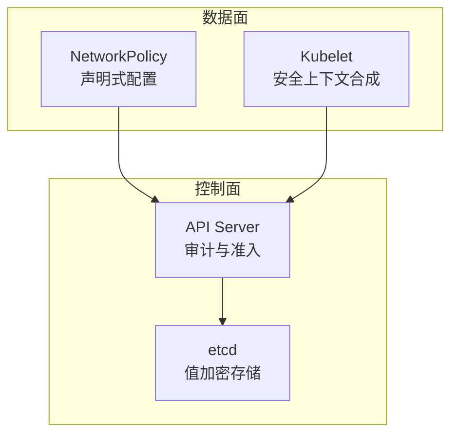
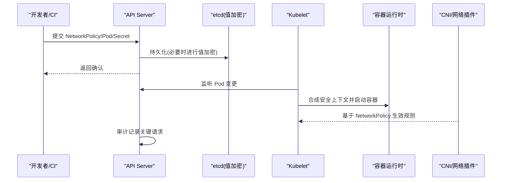
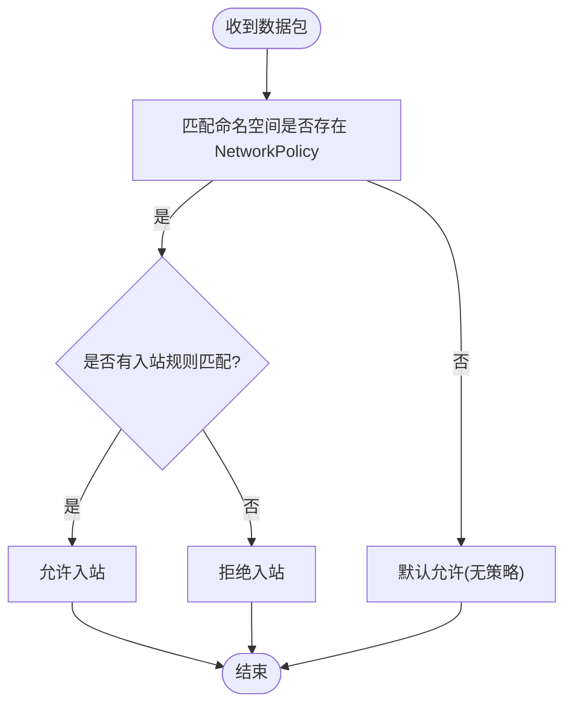
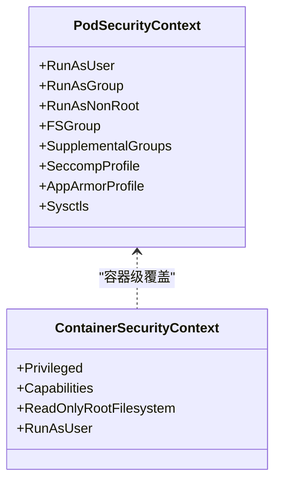
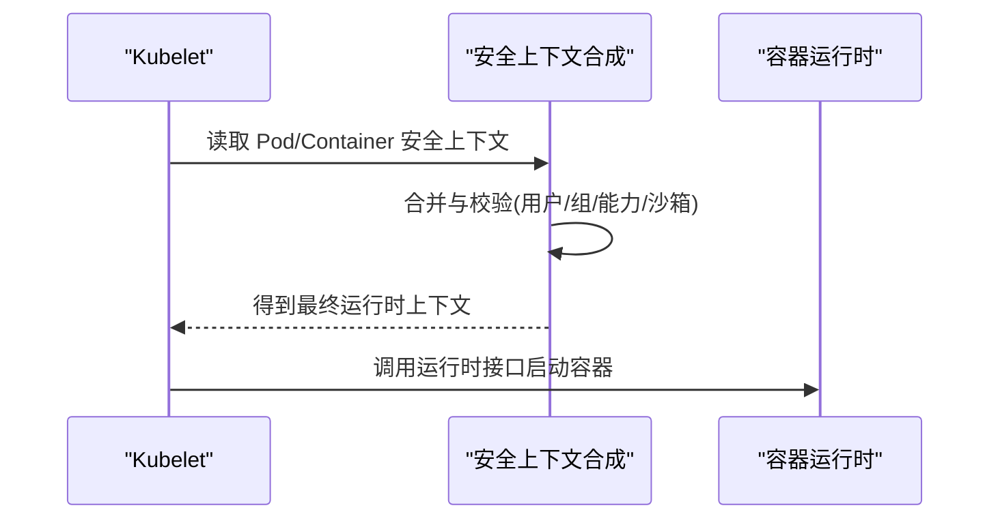
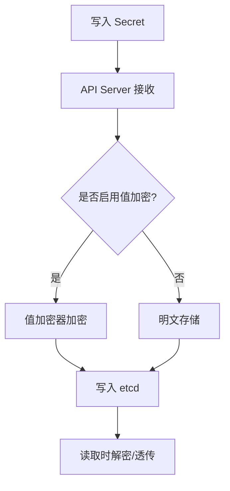
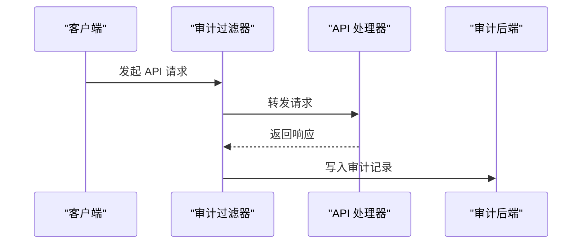
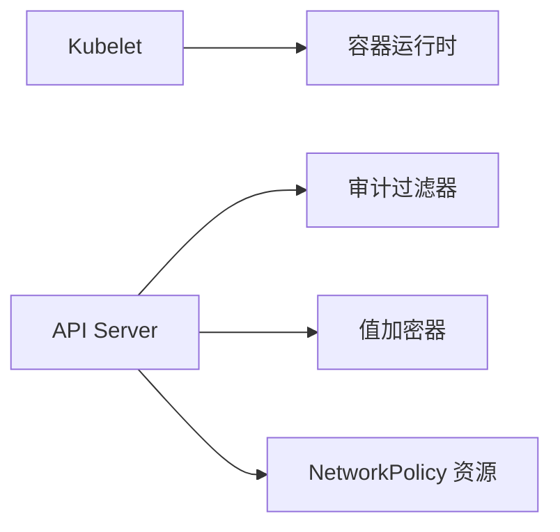

# 安全最佳实践

<cite>
**本文引用的文件**   
- [security_context.go](file://pkg/kubelet/kuberuntime/security_context.go)
- [networkpolicy.go](file://staging/src/k8s.io/client-go/applyconfigurations/networking/v1/networkpolicy.go)
- [podsecuritycontext.go](file://staging/src/k8s.io/client-go/applyconfigurations/core/v1/podsecuritycontext.go)
- [secretbox.go](file://staging/src/k8s.io/apiserver/pkg/storage/value/encrypt/secretbox/secretbox.go)
- [audit.go](file://staging/src/k8s.io/apiserver/pkg/endpoints/filters/audit.go)
- [audit_init.go](file://staging/src/k8s.io/apiserver/pkg/endpoints/filters/audit_init.go)
- [audit.go](file://staging/src/k8s.io/apiserver/pkg/server/options/audit.go)
</cite>

## 目录
1. [简介](#简介)
2. [项目结构](#项目结构)
3. [核心组件](#核心组件)
4. [架构总览](#架构总览)
5. [详细组件分析](#详细组件分析)
6. [依赖分析](#依赖分析)
7. [性能考虑](#性能考虑)
8. [故障排查指南](#故障排查指南)
9. [结论](#结论)
10. [附录](#附录)

## 简介
本指南面向Kubernetes集群管理员与平台工程师，围绕网络安全策略（NetworkPolicy）、Pod安全标准（Pod Security Standards）、容器安全上下文、密钥管理与配置安全、审计与日志、集群加固、漏洞扫描与安全监控、事件响应与灾难恢复等主题，提供可落地的最佳实践。文档结合仓库中的实现与API定义，给出从设计到运维的全链路建议，并辅以图示帮助理解关键流程。

## 项目结构
为支撑上述安全能力，仓库中与安全相关的代码主要分布在以下位置：
- 运行时安全上下文合成与转换：kubelet/kuberuntime 中负责将 Pod/Container 的安全上下文转换为 CRI 调用参数
- 网络策略声明式配置：client-go applyconfiguration 中生成 NetworkPolicy 的声明式构建器
- Pod 级安全上下文字段：core v1 的 PodSecurityContext 声明式构建器
- etcd 值加密：apiserver 存储层 value transformer 对敏感数据进行落盘加密
- API Server 审计：endpoints filters 与 server options 中的审计初始化与过滤链

图表来源
- [audit.go](file://staging/src/k8s.io/apiserver/pkg/endpoints/filters/audit.go)
- [audit_init.go](file://staging/src/k8s.io/apiserver/pkg/endpoints/filters/audit_init.go)
- [audit.go](file://staging/src/k8s.io/apiserver/pkg/server/options/audit.go)
- [secretbox.go](file://staging/src/k8s.io/apiserver/pkg/storage/value/encrypt/secretbox/secretbox.go)
- [security_context.go](file://pkg/kubelet/kuberuntime/security_context.go)
- [networkpolicy.go](file://staging/src/k8s.io/client-go/applyconfigurations/networking/v1/networkpolicy.go)

章节来源
- [security_context.go:29-96](file://pkg/kubelet/kuberuntime/security_context.go#L29-L96)
- [networkpolicy.go:30-52](file://staging/src/k8s.io/client-go/applyconfigurations/networking/v1/networkpolicy.go#L30-L52)
- [podsecuritycontext.go:25-132](file://staging/src/k8s.io/client-go/applyconfigurations/core/v1/podsecuritycontext.go#L25-L132)
- [secretbox.go:30-70](file://staging/src/k8s.io/apiserver/pkg/storage/value/encrypt/secretbox/secretbox.go#L30-L70)
- [audit.go](file://staging/src/k8s.io/apiserver/pkg/endpoints/filters/audit.go)
- [audit_init.go](file://staging/src/k8s.io/apiserver/pkg/endpoints/filters/audit_init.go)
- [audit.go](file://staging/src/k8s.io/apiserver/pkg/server/options/audit.go)

## 核心组件
- 网络安全策略（NetworkPolicy）
  - 通过 networking.k8s.io/v1 资源描述允许或拒绝 Pod 的入站/出站流量
  - 使用标签选择器精确匹配目标 Pod，按命名空间隔离
  - 建议默认拒绝所有流量，再按需放行最小必要路径
- Pod 安全标准（Pod Security Standards）
  - 以命名空间为单位启用“受限/基线/特权”三档策略，限制特权操作与内核能力
  - 配合准入控制器在创建时校验 Pod 是否符合所选级别
- 容器安全上下文（Security Context）
  - 控制运行用户、只读根文件系统、能力集、Seccomp/AppArmor、SELinux、Sysctls 等
  - 由 kubelet 在启动容器前合成最终上下文并下发给运行时
- 密钥管理与配置安全
  - Secrets 对象用于存放敏感信息；可通过 apiserver 值加密器对 etcd 落盘数据加密
  - 结合 RBAC 最小权限原则访问 Secret
- 审计与日志
  - API Server 审计过滤器记录关键请求与响应，支持分级策略与后端输出
- 集群加固与监控
  - 关闭不必要功能开关、启用强认证与授权、部署网络插件与监控告警

章节来源
- [networkpolicy.go:30-52](file://staging/src/k8s.io/client-go/applyconfigurations/networking/v1/networkpolicy.go#L30-L52)
- [podsecuritycontext.go:25-132](file://staging/src/k8s.io/client-go/applyconfigurations/core/v1/podsecuritycontext.go#L25-L132)
- [security_context.go:29-96](file://pkg/kubelet/kuberuntime/security_context.go#L29-L96)
- [secretbox.go:30-70](file://staging/src/k8s.io/apiserver/pkg/storage/value/encrypt/secretbox/secretbox.go#L30-L70)
- [audit.go](file://staging/src/k8s.io/apiserver/pkg/endpoints/filters/audit.go)
- [audit_init.go](file://staging/src/k8s.io/apiserver/pkg/endpoints/filters/audit_init.go)
- [audit.go](file://staging/src/k8s.io/apiserver/pkg/server/options/audit.go)

## 架构总览
下图展示从应用侧声明到控制面执行的关键路径：NetworkPolicy 声明经 API Server 持久化，Kubelet 根据 Pod 安全上下文驱动运行时，Secrets 经值加密后落盘，API Server 审计记录关键操作。

图表来源
- [audit.go](file://staging/src/k8s.io/apiserver/pkg/endpoints/filters/audit.go)
- [audit_init.go](file://staging/src/k8s.io/apiserver/pkg/endpoints/filters/audit_init.go)
- [audit.go](file://staging/src/k8s.io/apiserver/pkg/server/options/audit.go)
- [secretbox.go](file://staging/src/k8s.io/apiserver/pkg/storage/value/encrypt/secretbox/secretbox.go)
- [security_context.go](file://pkg/kubelet/kuberuntime/security_context.go)
- [networkpolicy.go](file://staging/src/k8s.io/client-go/applyconfigurations/networking/v1/networkpolicy.go)

## 详细组件分析

### 网络安全策略（NetworkPolicy）
- 作用范围
  - 仅影响具备相应网络插件支持的集群；未启用网络策略插件时不生效
- 入站/出站控制
  - 通过 ingress/egress 规则限定源/目的 IP、端口与协议
  - 使用 podSelector 与 namespaceSelector 精准定位通信端点
- 默认行为
  - 若命名空间存在任何 NetworkPolicy，则默认拒绝该命名空间内 Pod 的所有入站流量；出站取决于是否定义了 egress 规则
- 常见模式
  - 白名单模型：先拒绝全部，再逐步放开必要通信
  - 微服务隔离：按服务/命名空间划分边界，跨域访问显式授权
- 验证与排障
  - 使用 kubectl describe networkpolicy 检查匹配结果
  - 借助抓包或网络插件可视化工具定位丢包原因

图表来源
- [networkpolicy.go:30-52](file://staging/src/k8s.io/client-go/applyconfigurations/networking/v1/networkpolicy.go#L30-L52)

章节来源
- [networkpolicy.go:30-52](file://staging/src/k8s.io/client-go/applyconfigurations/networking/v1/networkpolicy.go#L30-L52)

### Pod 安全标准（Pod Security Standards）
- 级别说明
  - 受限（Restricted）：最严格，禁止特权、限制能力集、要求非 root、限制 sysctls 等
  - 基线（Baseline）：防止已知提权路径，保留部分兼容性
  - 特权（Privileged）：不做限制，适用于系统组件
- 实施建议
  - 默认命名空间采用“受限”，系统命名空间按需放宽
  - 使用命名空间注解启用对应级别，并结合准入控制器强制校验
- 与容器的关系
  - Pod 级与容器级安全上下文冲突时，容器级优先；但 Pod 级可作为兜底约束

图表来源
- [podsecuritycontext.go:25-132](file://staging/src/k8s.io/client-go/applyconfigurations/core/v1/podsecuritycontext.go#L25-L132)

章节来源
- [podsecuritycontext.go:25-132](file://staging/src/k8s.io/client-go/applyconfigurations/core/v1/podsecuritycontext.go#L25-L132)

### 容器安全上下文（Security Context）
- 关键能力
  - 用户与组：RunAsUser/RunAsGroup/RunAsNonRoot 确保非 root 运行
  - 文件系统：ReadOnlyRootFilesystem 降低写扩散风险
  - 能力集：Capabilities.Add/Drop 精细控制 Linux 能力
  - 沙箱与隔离：SeccompProfile、AppArmorProfile、SELinuxOptions
  - 命名空间与补充组：NamespaceOptions、SupplementalGroups、FSGroup
- 合成与下发
  - kubelet 在启动容器前合并 Pod 与 Container 的安全上下文，转换为运行时所需结构并下发

图表来源
- [security_context.go:29-96](file://pkg/kubelet/kuberuntime/security_context.go#L29-L96)

章节来源
- [security_context.go:29-96](file://pkg/kubelet/kuberuntime/security_context.go#L29-L96)

### 密钥管理与配置安全
- Secrets 使用
  - 避免在镜像或环境变量中硬编码敏感信息
  - 通过 Volume 或环境变量注入，结合 RBAC 最小权限访问
- 落盘加密
  - 通过 apiserver 值加密器对 etcd 中的敏感字段进行加密，降低离线泄露风险
- 轮换与生命周期
  - 定期轮换密钥，建立自动化更新与回滚流程
  - 对过期或废弃的 Secret 及时清理

图表来源
- [secretbox.go:30-70](file://staging/src/k8s.io/apiserver/pkg/storage/value/encrypt/secretbox/secretbox.go#L30-L70)

章节来源
- [secretbox.go:30-70](file://staging/src/k8s.io/apiserver/pkg/storage/value/encrypt/secretbox/secretbox.go#L30-L70)

### 安全审计与日志分析
- 审计过滤器
  - API Server 在请求处理链中插入审计过滤器，记录请求元数据、主体、决策与耗时
- 审计策略
  - 通过策略定义不同级别的记录粒度（如 Metadata/Request/Response），并按资源/用户/动作筛选
- 后端输出
  - 支持文件、Webhook、stdout 等多种后端，便于集中收集与分析
- 分析方法
  - 关注异常登录、越权访问、高危 API 调用、大规模删除/扩缩容等行为
  - 结合 SIEM 或日志平台做关联分析与告警

图表来源
- [audit.go](file://staging/src/k8s.io/apiserver/pkg/endpoints/filters/audit.go)
- [audit_init.go](file://staging/src/k8s.io/apiserver/pkg/endpoints/filters/audit_init.go)
- [audit.go](file://staging/src/k8s.io/apiserver/pkg/server/options/audit.go)

章节来源
- [audit.go](file://staging/src/k8s.io/apiserver/pkg/endpoints/filters/audit.go)
- [audit_init.go](file://staging/src/k8s.io/apiserver/pkg/endpoints/filters/audit_init.go)
- [audit.go](file://staging/src/k8s.io/apiserver/pkg/server/options/audit.go)

### 集群安全加固、漏洞扫描与安全监控
- 加固要点
  - 启用强认证（如 OIDC）、RBAC 最小权限、禁用匿名访问
  - 限制 Node 节点能力与内核参数，启用 Seccomp/AppArmor
  - 使用受信任的镜像仓库与签名校验
- 漏洞扫描
  - 在 CI/CD 中对镜像进行静态扫描，阻断高危漏洞镜像进入集群
  - 定期扫描工作负载与节点镜像，持续跟踪修复
- 安全监控
  - 采集 API Server、Node、Pod 指标与审计日志
  - 设置告警阈值，覆盖异常登录、权限提升、网络异常等场景

[本节为通用指导，无需源码引用]

### 安全事件响应与灾难恢复
- 事件响应
  - 制定预案：隔离受影响 Pod/命名空间、撤销凭证、回滚版本
  - 溯源取证：拉取审计日志、容器日志、网络流日志
- 灾难恢复
  - 备份 etcd 与关键配置，演练恢复流程
  - 多可用区部署与跨集群灾备，缩短 RTO/RPO

[本节为通用指导，无需源码引用]

## 依赖分析
- 组件耦合
  - kubelet 依赖 Pod/Container 安全上下文定义，并在运行时合成
  - API Server 审计过滤器贯穿请求链路，依赖审计策略与后端配置
  - 值加密器作为存储层 Transformer，独立于业务逻辑
- 外部依赖
  - 网络策略依赖 CNI 插件实现
  - 审计后端可能依赖外部日志系统或 Webhook 服务

图表来源
- [security_context.go](file://pkg/kubelet/kuberuntime/security_context.go)
- [audit.go](file://staging/src/k8s.io/apiserver/pkg/endpoints/filters/audit.go)
- [audit_init.go](file://staging/src/k8s.io/apiserver/pkg/endpoints/filters/audit_init.go)
- [audit.go](file://staging/src/k8s.io/apiserver/pkg/server/options/audit.go)
- [secretbox.go](file://staging/src/k8s.io/apiserver/pkg/storage/value/encrypt/secretbox/secretbox.go)
- [networkpolicy.go](file://staging/src/k8s.io/client-go/applyconfigurations/networking/v1/networkpolicy.go)

章节来源
- [security_context.go:29-96](file://pkg/kubelet/kuberuntime/security_context.go#L29-L96)
- [audit.go](file://staging/src/k8s.io/apiserver/pkg/endpoints/filters/audit.go)
- [audit_init.go](file://staging/src/k8s.io/apiserver/pkg/endpoints/filters/audit_init.go)
- [audit.go](file://staging/src/k8s.io/apiserver/pkg/server/options/audit.go)
- [secretbox.go:30-70](file://staging/src/k8s.io/apiserver/pkg/storage/value/encrypt/secretbox/secretbox.go#L30-L70)
- [networkpolicy.go:30-52](file://staging/src/k8s.io/client-go/applyconfigurations/networking/v1/networkpolicy.go#L30-L52)

## 性能考虑
- 网络策略
  - 合理聚合规则，减少匹配复杂度；避免过度细粒度的规则导致性能抖动
- 安全上下文
  - 避免频繁变更 Pod 安全上下文，减少重启与调度开销
- 审计
  - 调整审计策略粒度，避免高吞吐下产生过多日志；选择性记录高价值事件
- 值加密
  - 值加密带来额外 CPU 与 I/O 开销，建议在敏感数据量较大时评估容量与延迟

[本节为通用指导，无需源码引用]

## 故障排查指南
- NetworkPolicy 不生效
  - 确认已安装并启用支持网络策略的 CNI 插件
  - 检查命名空间与 Pod 标签是否与策略匹配
- 容器无法启动
  - 查看 kubelet 日志，确认安全上下文合成是否正确
  - 检查 Seccomp/AppArmor/SELinux 配置是否被主机支持
- Secret 读取失败
  - 检查 RBAC 权限与 ServiceAccount
  - 确认值加密密钥配置正确且可访问
- 审计日志缺失
  - 核对审计策略与后端配置，确认过滤器已加载
  - 检查后端服务连通性与磁盘配额

章节来源
- [security_context.go:29-96](file://pkg/kubelet/kuberuntime/security_context.go#L29-L96)
- [audit.go](file://staging/src/k8s.io/apiserver/pkg/endpoints/filters/audit.go)
- [audit_init.go](file://staging/src/k8s.io/apiserver/pkg/endpoints/filters/audit_init.go)
- [audit.go](file://staging/src/k8s.io/apiserver/pkg/server/options/audit.go)
- [secretbox.go:30-70](file://staging/src/k8s.io/apiserver/pkg/storage/value/encrypt/secretbox/secretbox.go#L30-L70)

## 结论
通过在网络层、工作负载层、存储层与控制面全栈落实安全策略与最佳实践，可以显著降低攻击面、提升可观测性与可恢复性。建议以“默认拒绝、最小权限、纵深防御”为原则，持续迭代策略与监控体系，形成闭环的安全运营。

[本节为总结性内容，无需源码引用]

## 附录
- 术语
  - NetworkPolicy：网络访问控制策略
  - Pod Security Standards：Pod 安全标准（受限/基线/特权）
  - Security Context：容器/Pod 安全上下文
  - 值加密：apiserver 存储层对敏感值的加密机制
  - 审计：API Server 请求与响应的记录与分析

[本节为概念性内容，无需源码引用]