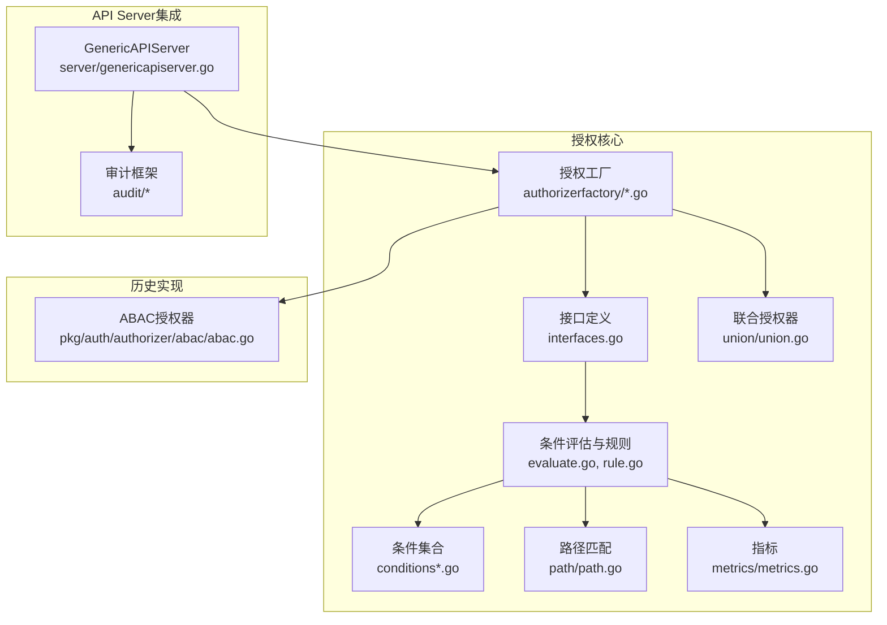
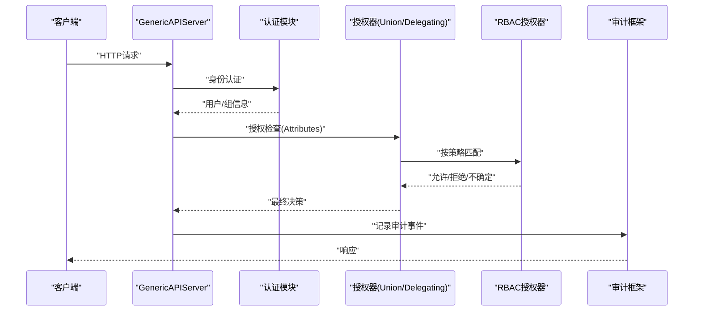
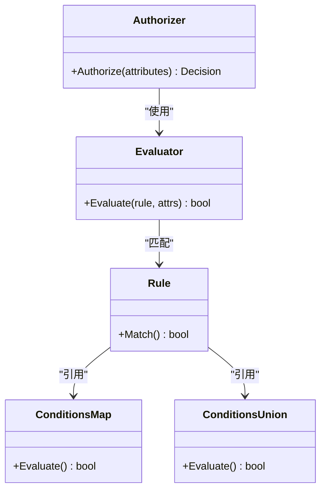
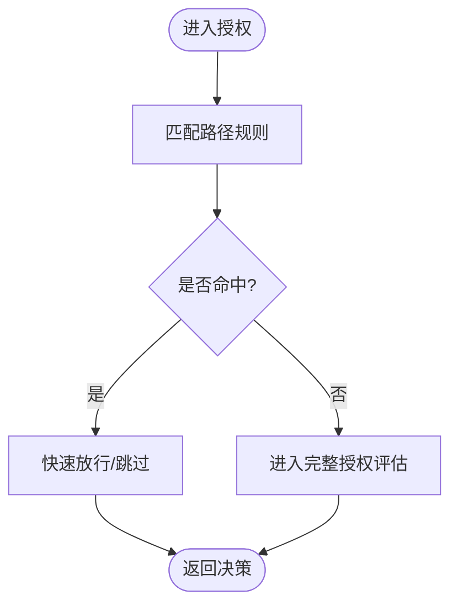
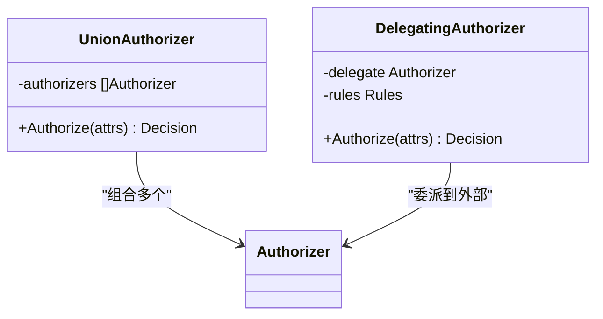
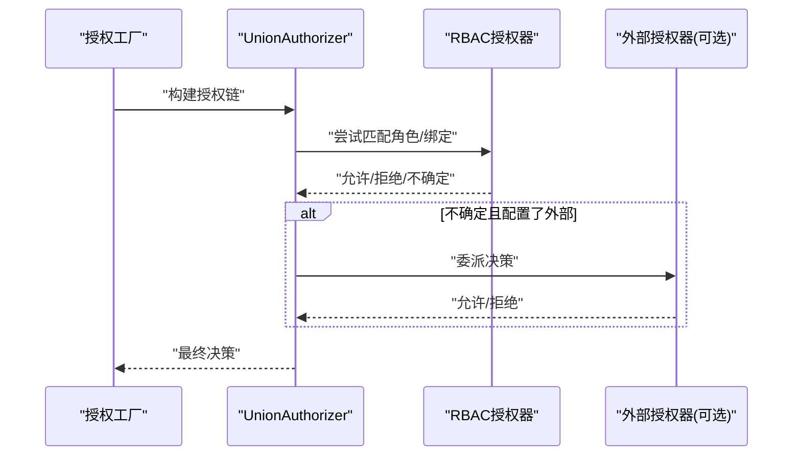
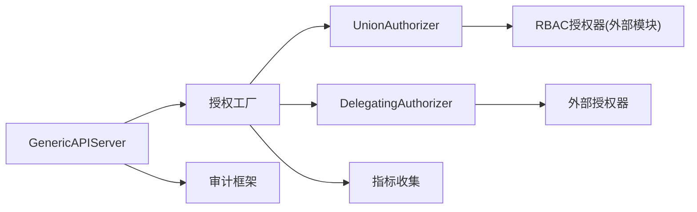

# 授权策略

<cite>
**本文引用的文件**   
- [doc.go](file://plugin/pkg/auth/doc.go)
- [abac.go](file://pkg/auth/authorizer/abac/abac.go)
- [interfaces.go](file://staging/src/k8s.io/apiserver/pkg/authorization/authorizer/interfaces.go)
- [evaluate.go](file://staging/src/k8s.io/apiserver/pkg/authorization/authorizer/evaluate.go)
- [conditions.go](file://staging/src/k8s.io/apiserver/pkg/authorization/authorizer/conditions.go)
- [conditionsmap.go](file://staging/src/k8s.io/apiserver/pkg/authorization/authorizer/conditionsmap.go)
- [conditionsunion.go](file://staging/src/k8s.io/apiserver/pkg/authorization/authorizer/conditionsunion.go)
- [rule.go](file://staging/src/k8s.io/apiserver/pkg/authorization/authorizer/rule.go)
- [builtin.go](file://staging/src/k8s.io/apiserver/pkg/authorization/authorizerfactory/builtin.go)
- [delegating.go](file://staging/src/k8s.io/apiserver/pkg/authorization/authorizerfactory/delegating.go)
- [metrics.go](file://staging/src/k8s.io/apiserver/pkg/authorization/metrics/metrics.go)
- [path.go](file://staging/src/k8s.io/apiserver/pkg/authorization/path/path.go)
- [union.go](file://staging/src/k8s.io/apiserver/pkg/authorization/union/union.go)
- [audit.go](file://staging/src/k8s.io/apiserver/pkg/admission/audit.go)
- [request.go](file://staging/src/k8s.io/apiserver/pkg/audit/request.go)
- [types.go](file://staging/src/k8s.io/apiserver/pkg/audit/types.go)
- [genericapiserver.go](file://staging/src/k8s.io/apiserver/pkg/server/genericapiserver.go)
</cite>

## 目录
1. [简介](#简介)
2. [项目结构](#项目结构)
3. [核心组件](#核心组件)
4. [架构总览](#架构总览)
5. [详细组件分析](#详细组件分析)
6. [依赖分析](#依赖分析)
7. [性能考虑](#性能考虑)
8. [故障排查指南](#故障排查指南)
9. [结论](#结论)
10. [附录](#附录)

## 简介
本文件面向Kubernetes授权子系统，系统性阐述授权决策的完整流程（请求解析、权限检查、策略评估），深入解释内置授权器工作机制与扩展点，提供配置与调试方法（含日志与审计）、自定义授权插件开发指南、高并发场景优化建议、最佳实践与安全建议，以及常见问题诊断与解决方案。

## 项目结构
授权相关代码主要分布在以下位置：
- 接口定义与通用实现：staging/src/k8s.io/apiserver/pkg/authorization
- 授权工厂与组合器：staging/src/k8s.io/apiserver/pkg/authorization/authorizerfactory
- 路径匹配工具：staging/src/k8s.io/apiserver/pkg/authorization/path
- 指标与度量：staging/src/k8s.io/apiserver/pkg/authorization/metrics
- 历史ABAC授权器示例：pkg/auth/authorizer/abac
- API Server集成入口：staging/src/k8s.io/apiserver/pkg/server/genericapiserver.go
- 审计框架：staging/src/k8s.io/apiserver/pkg/audit

图表来源
- [interfaces.go](file://staging/src/k8s.io/apiserver/pkg/authorization/authorizer/interfaces.go)
- [evaluate.go](file://staging/src/k8s.io/apiserver/pkg/authorization/authorizer/evaluate.go)
- [conditions.go](file://staging/src/k8s.io/apiserver/pkg/authorization/authorizer/conditions.go)
- [conditionsmap.go](file://staging/src/k8s.io/apiserver/pkg/authorization/authorizer/conditionsmap.go)
- [conditionsunion.go](file://staging/src/k8s.io/apiserver/pkg/authorization/authorizer/conditionsunion.go)
- [rule.go](file://staging/src/k8s.io/apiserver/pkg/authorization/authorizer/rule.go)
- [path.go](file://staging/src/k8s.io/apiserver/pkg/authorization/path/path.go)
- [metrics.go](file://staging/src/k8s.io/apiserver/pkg/authorization/metrics/metrics.go)
- [union.go](file://staging/src/k8s.io/apiserver/pkg/authorization/union/union.go)
- [builtin.go](file://staging/src/k8s.io/apiserver/pkg/authorization/authorizerfactory/builtin.go)
- [delegating.go](file://staging/src/k8s.io/apiserver/pkg/authorization/authorizerfactory/delegating.go)
- [abac.go](file://pkg/auth/authorizer/abac/abac.go)
- [genericapiserver.go](file://staging/src/k8s.io/apiserver/pkg/server/genericapiserver.go)
- [audit.go](file://staging/src/k8s.io/apiserver/pkg/admission/audit.go)

章节来源
- [doc.go](file://plugin/pkg/auth/doc.go)
- [interfaces.go](file://staging/src/k8s.io/apiserver/pkg/authorization/authorizer/interfaces.go)
- [genericapiserver.go](file://staging/src/k8s.io/apiserver/pkg/server/genericapiserver.go)

## 核心组件
- 授权接口与抽象
  - Authorizer接口定义了统一的授权判定入口，用于对“谁在什么资源上执行什么操作”进行决策。
  - AuthorizerProvider/Factory负责构建具体授权器实例，支持组合与委派。
- 条件与规则评估
  - 通过条件集合（单值、映射、并集）与规则表达式进行匹配，决定授权结果。
- 路径匹配
  - 基于HTTP路径前缀或正则等机制，快速过滤非API请求或特定子路径。
- 组合与委派
  - UnionAuthorizer将多个授权器按顺序组合；DelegatingAuthorizer将部分请求委派给外部授权服务。
- 指标与可观测性
  - 暴露授权成功/失败计数、耗时分布等指标，便于监控与排障。
- 历史ABAC授权器
  - 提供基于JSONL策略文件的授权逻辑，作为参考实现与迁移对照。

章节来源
- [interfaces.go](file://staging/src/k8s.io/apiserver/pkg/authorization/authorizer/interfaces.go)
- [evaluate.go](file://staging/src/k8s.io/apiserver/pkg/authorization/authorizer/evaluate.go)
- [conditions.go](file://staging/src/k8s.io/apiserver/pkg/authorization/authorizer/conditions.go)
- [conditionsmap.go](file://staging/src/k8s.io/apiserver/pkg/authorization/authorizer/conditionsmap.go)
- [conditionsunion.go](file://staging/src/k8s.io/apiserver/pkg/authorization/authorizer/conditionsunion.go)
- [rule.go](file://staging/src/k8s.io/apiserver/pkg/authorization/authorizer/rule.go)
- [path.go](file://staging/src/k8s.io/apiserver/pkg/authorization/path/path.go)
- [union.go](file://staging/src/k8s.io/apiserver/pkg/authorization/union/union.go)
- [delegating.go](file://staging/src/k8s.io/apiserver/pkg/authorization/authorizerfactory/delegating.go)
- [metrics.go](file://staging/src/k8s.io/apiserver/pkg/authorization/metrics/metrics.go)
- [abac.go](file://pkg/auth/authorizer/abac/abac.go)

## 架构总览
授权子系统位于认证之后、存储之前，贯穿API请求处理链路。典型调用链如下：

图表来源
- [genericapiserver.go](file://staging/src/k8s.io/apiserver/pkg/server/genericapiserver.go)
- [interfaces.go](file://staging/src/k8s.io/apiserver/pkg/authorization/authorizer/interfaces.go)
- [union.go](file://staging/src/k8s.io/apiserver/pkg/authorization/union/union.go)
- [delegating.go](file://staging/src/k8s.io/apiserver/pkg/authorization/authorizerfactory/delegating.go)
- [audit.go](file://staging/src/k8s.io/apiserver/pkg/admission/audit.go)

## 详细组件分析

### 授权接口与评估引擎
- 接口设计
  - Authorizer接口统一了授权决策入口，接收Attributes对象（包含用户、命名空间、资源、动词等）。
- 条件与规则
  - conditions系列类型提供原子条件、映射条件与并集条件的组合能力。
  - evaluate与rule模块将条件与规则结合，输出布尔决策。
- 复杂度与性能
  - 条件匹配为O(n)线性扫描，n为规则数量；可通过路径预过滤与缓存减少评估次数。

图表来源
- [interfaces.go](file://staging/src/k8s.io/apiserver/pkg/authorization/authorizer/interfaces.go)
- [evaluate.go](file://staging/src/k8s.io/apiserver/pkg/authorization/authorizer/evaluate.go)
- [conditionsmap.go](file://staging/src/k8s.io/apiserver/pkg/authorization/authorizer/conditionsmap.go)
- [conditionsunion.go](file://staging/src/k8s.io/apiserver/pkg/authorization/authorizer/conditionsunion.go)
- [rule.go](file://staging/src/k8s.io/apiserver/pkg/authorization/authorizer/rule.go)

章节来源
- [interfaces.go](file://staging/src/k8s.io/apiserver/pkg/authorization/authorizer/interfaces.go)
- [evaluate.go](file://staging/src/k8s.io/apiserver/pkg/authorization/authorizer/evaluate.go)
- [conditions.go](file://staging/src/k8s.io/apiserver/pkg/authorization/authorizer/conditions.go)
- [conditionsmap.go](file://staging/src/k8s.io/apiserver/pkg/authorization/authorizer/conditionsmap.go)
- [conditionsunion.go](file://staging/src/k8s.io/apiserver/pkg/authorization/authorizer/conditionsunion.go)
- [rule.go](file://staging/src/k8s.io/apiserver/pkg/authorization/authorizer/rule.go)

### 路径匹配与快速过滤
- 作用
  - 在授权早期阶段，依据HTTP路径快速判断是否进入授权流程，降低不必要的计算开销。
- 适用场景
  - 健康检查、元数据端点、静态资源等非业务API路径可直接放行或跳过。

图表来源
- [path.go](file://staging/src/k8s.io/apiserver/pkg/authorization/path/path.go)

章节来源
- [path.go](file://staging/src/k8s.io/apiserver/pkg/authorization/path/path.go)

### 组合与委派授权器
- UnionAuthorizer
  - 将多个授权器串联，任一允许即放行，全部拒绝则拒绝，未决继续下一个。
- DelegatingAuthorizer
  - 将部分请求委派给外部授权服务（如远程策略引擎），本地保留兜底策略。

图表来源
- [union.go](file://staging/src/k8s.io/apiserver/pkg/authorization/union/union.go)
- [delegating.go](file://staging/src/k8s.io/apiserver/pkg/authorization/authorizerfactory/delegating.go)
- [interfaces.go](file://staging/src/k8s.io/apiserver/pkg/authorization/authorizer/interfaces.go)

章节来源
- [union.go](file://staging/src/k8s.io/apiserver/pkg/authorization/union/union.go)
- [delegating.go](file://staging/src/k8s.io/apiserver/pkg/authorization/authorizerfactory/delegating.go)

### 内置授权器与RBAC
- 内置授权器
  - 通过authorizerfactory提供的Builtin与Delegating构建器组装默认授权链。
- RBAC工作原理
  - 基于Role/ClusterRole、RoleBinding/ClusterRoleBinding、ServiceAccount与User/Group关系，将请求Attributes映射为“资源+动词”的访问需求，再匹配规则得到决策。
  - 注意：仓库中未直接包含RBAC实现源码，但授权接口与工厂提供了标准扩展点，RBAC通常以独立模块形式集成。

图表来源
- [builtin.go](file://staging/src/k8s.io/apiserver/pkg/authorization/authorizerfactory/builtin.go)
- [delegating.go](file://staging/src/k8s.io/apiserver/pkg/authorization/authorizerfactory/delegating.go)
- [union.go](file://staging/src/k8s.io/apiserver/pkg/authorization/union/union.go)
- [interfaces.go](file://staging/src/k8s.io/apiserver/pkg/authorization/authorizer/interfaces.go)

章节来源
- [builtin.go](file://staging/src/k8s.io/apiserver/pkg/authorization/authorizerfactory/builtin.go)
- [delegating.go](file://staging/src/k8s.io/apiserver/pkg/authorization/authorizerfactory/delegating.go)

### 历史ABAC授权器（参考实现）
- 功能概述
  - 基于JSONL策略文件逐行匹配，支持用户、组、资源、动作、命名空间等维度。
- 适用场景
  - 学习授权规则表达式的历史形态，辅助从ABAC迁移至RBAC或CEL。

章节来源
- [abac.go](file://pkg/auth/authorizer/abac/abac.go)

### 指标与可观测性
- 指标项
  - 授权成功/失败计数、各授权器耗时、错误分类等。
- 使用建议
  - 结合Prometheus抓取，设置告警阈值，定位慢路径与热点规则。

章节来源
- [metrics.go](file://staging/src/k8s.io/apiserver/pkg/authorization/metrics/metrics.go)

## 依赖分析
- 耦合关系
  - GenericAPIServer依赖授权工厂，工厂组合Union/Delegating与具体授权器（如RBAC）。
  - 评估引擎依赖条件与规则模块，路径匹配作为前置过滤器。
- 外部依赖
  - 审计框架用于记录授权决策与上下文。
- 潜在循环
  - 当前结构清晰分层，未见明显循环依赖。

图表来源
- [genericapiserver.go](file://staging/src/k8s.io/apiserver/pkg/server/genericapiserver.go)
- [builtin.go](file://staging/src/k8s.io/apiserver/pkg/authorization/authorizerfactory/builtin.go)
- [delegating.go](file://staging/src/k8s.io/apiserver/pkg/authorization/authorizerfactory/delegating.go)
- [union.go](file://staging/src/k8s.io/apiserver/pkg/authorization/union/union.go)
- [metrics.go](file://staging/src/k8s.io/apiserver/pkg/authorization/metrics/metrics.go)
- [audit.go](file://staging/src/k8s.io/apiserver/pkg/admission/audit.go)

章节来源
- [genericapiserver.go](file://staging/src/k8s.io/apiserver/pkg/server/genericapiserver.go)
- [builtin.go](file://staging/src/k8s.io/apiserver/pkg/authorization/authorizerfactory/builtin.go)
- [delegating.go](file://staging/src/k8s.io/apiserver/pkg/authorization/authorizerfactory/delegating.go)
- [union.go](file://staging/src/k8s.io/apiserver/pkg/authorization/union/union.go)
- [metrics.go](file://staging/src/k8s.io/apiserver/pkg/authorization/metrics/metrics.go)
- [audit.go](file://staging/src/k8s.io/apiserver/pkg/admission/audit.go)

## 性能考虑
- 路径预过滤
  - 利用路径匹配尽早短路，避免进入复杂规则评估。
- 规则精简与合并
  - 合并重复规则，优先匹配高频路径与常见主体，减少平均评估成本。
- 组合顺序优化
  - 将确定性高的授权器置于前面，尽快返回确定决策。
- 异步与缓存
  - 对只读属性或外部查询结果做短期缓存，降低I/O抖动影响。
- 指标驱动调优
  - 基于授权耗时分位与错误率，识别瓶颈并针对性优化。

[本节为通用指导，不直接分析具体文件]

## 故障排查指南
- 启用与查看审计
  - 配置审计策略，关注AuthorizationDecision字段与原因，定位拒绝根因。
- 关键日志
  - 关注授权器初始化、规则加载、外部委派失败的错误日志。
- 常见问题
  - 规则冲突：检查优先级与覆盖范围，确保最小权限原则。
  - 外部授权超时：调整超时与重试策略，增加熔断与降级。
  - 路径误配：校验路径前缀与正则，避免误放行或误拦截。
- 诊断步骤
  - 开启详细日志级别，复现问题后提取审计事件与指标快照，对比预期策略。

章节来源
- [audit.go](file://staging/src/k8s.io/apiserver/pkg/admission/audit.go)
- [request.go](file://staging/src/k8s.io/apiserver/pkg/audit/request.go)
- [types.go](file://staging/src/k8s.io/apiserver/pkg/audit/types.go)

## 结论
Kubernetes授权子系统通过清晰的接口与可扩展的工厂模式，实现了灵活的授权决策流程。结合路径预过滤、组合与委派、指标与审计，可在保证安全性的同时获得良好的性能与可观测性。生产环境应遵循最小权限原则，持续优化规则与组合顺序，并通过审计与指标闭环保障稳定性与安全性。

[本节为总结性内容，不直接分析具体文件]

## 附录

### 配置与调试要点
- 授权链配置
  - 使用授权工厂构建Union/Delegating组合，按需接入RBAC与外部授权器。
- 审计策略
  - 针对敏感资源与高危操作提升审计级别，保留必要上下文。
- 指标采集
  - 抓取授权成功/失败比率、P99延迟、错误分类，建立告警规则。

章节来源
- [builtin.go](file://staging/src/k8s.io/apiserver/pkg/authorization/authorizerfactory/builtin.go)
- [delegating.go](file://staging/src/k8s.io/apiserver/pkg/authorization/authorizerfactory/delegating.go)
- [metrics.go](file://staging/src/k8s.io/apiserver/pkg/authorization/metrics/metrics.go)
- [audit.go](file://staging/src/k8s.io/apiserver/pkg/admission/audit.go)

### 自定义授权插件开发指南
- 接口规范
  - 实现Authorizer接口，接收Attributes并返回授权决策。
- 实现建议
  - 明确输入校验与边界条件，记录必要的上下文以便审计。
  - 对于外部依赖，做好超时、重试与熔断处理。
- 集成方式
  - 通过授权工厂注册自定义授权器，并将其加入Union链或作为Delegating目标。

章节来源
- [interfaces.go](file://staging/src/k8s.io/apiserver/pkg/authorization/authorizer/interfaces.go)
- [builtin.go](file://staging/src/k8s.io/apiserver/pkg/authorization/authorizerfactory/builtin.go)
- [delegating.go](file://staging/src/k8s.io/apiserver/pkg/authorization/authorizerfactory/delegating.go)

### 最佳实践与安全建议
- 最小权限原则
  - 仅授予完成工作所需的最小权限，定期审查与回收。
- 分层授权
  - 使用Union组合多源策略，区分命名空间级与集群级权限。
- 审计先行
  - 先开启审计观察，再逐步收紧策略，避免误阻断。
- 变更管理
  - 所有策略变更纳入版本控制与审批流程，灰度发布与回滚预案完备。

[本节为通用指导，不直接分析具体文件]