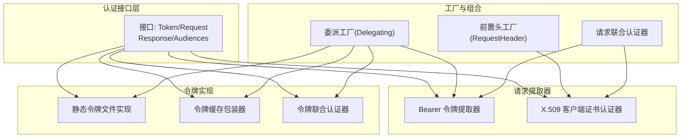
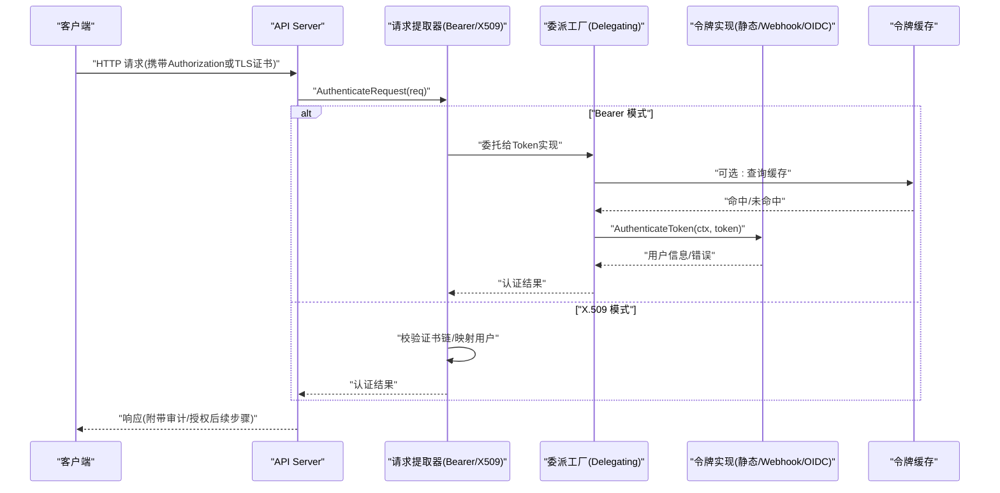
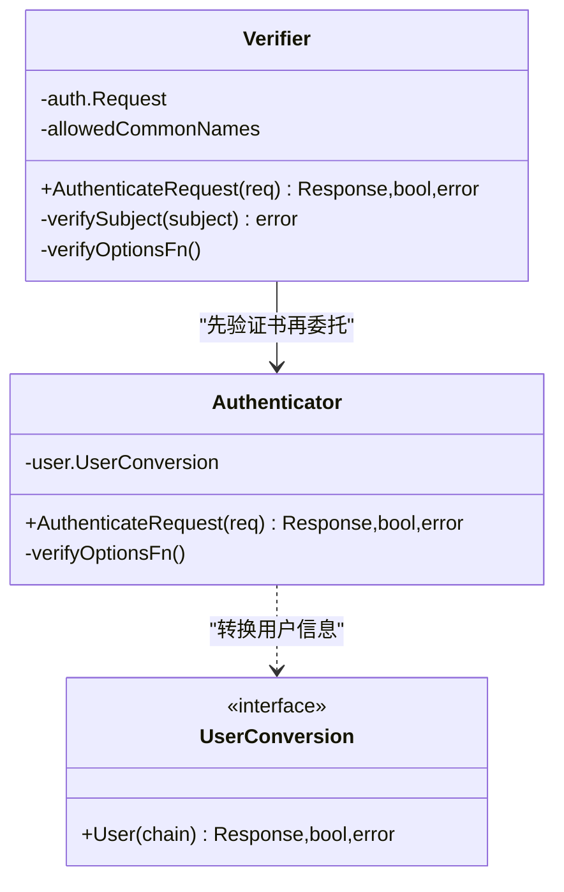
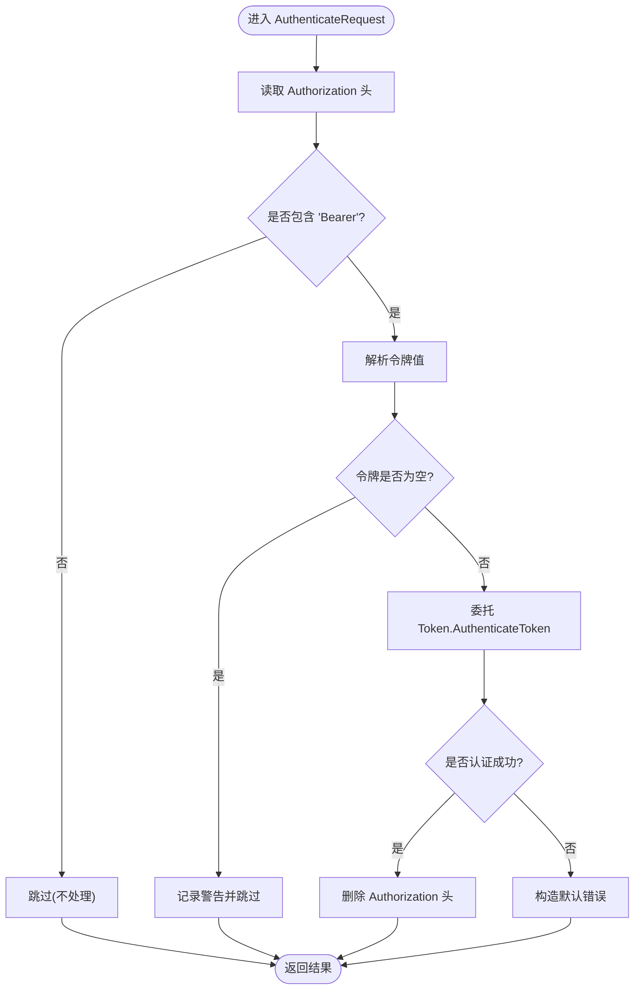
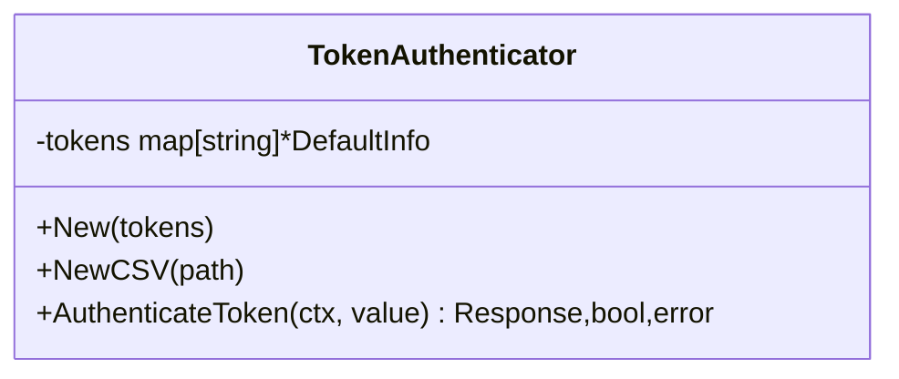
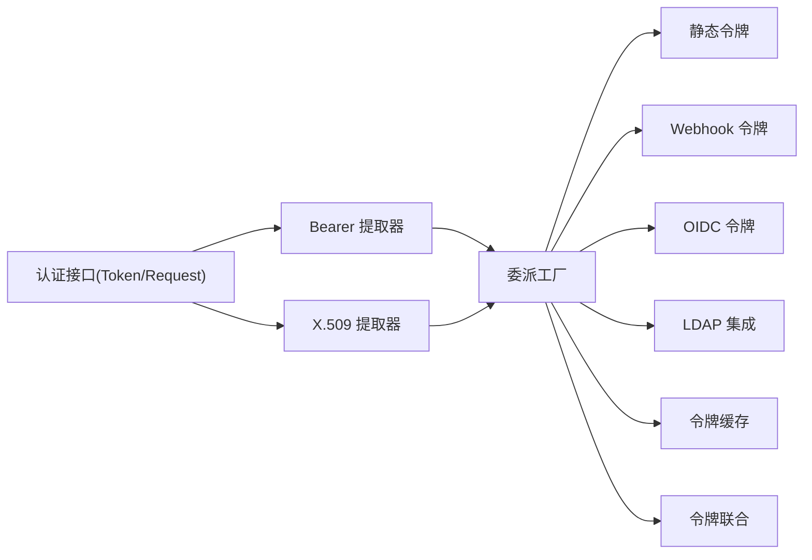

# 认证机制

<cite>
**本文引用的文件**   
- [interfaces.go](file://staging/src/k8s.io/apiserver/pkg/authentication/authenticator/interfaces.go)
- [bearertoken.go](file://staging/src/k8s.io/apiserver/pkg/authentication/request/bearertoken/bearertoken.go)
- [x509.go](file://staging/src/k8s.io/apiserver/pkg/authentication/request/x509/x509.go)
- [tokenfile.go](file://staging/src/k8s.io/apiserver/pkg/authentication/token/tokenfile/tokenfile.go)
- [delegating.go](file://staging/src/k8s.io/apiserver/pkg/authentication/authenticatorfactory/delegating.go)
- [requestheader.go](file://staging/src/k8s.io/apiserver/pkg/authentication/authenticatorfactory/requestheader.go)
- [cached_token_authenticator.go](file://staging/src/k8s.io/apiserver/pkg/authentication/token/cache/cached_token_authenticator.go)
- [union.go](file://staging/src/k8s.io/apiserver/pkg/authentication/request/union/union.go)
- [doc.go](file://plugin/pkg/auth/doc.go)
</cite>

## 目录
1. [简介](#简介)
2. [项目结构](#项目结构)
3. [核心组件](#核心组件)
4. [架构总览](#架构总览)
5. [详细组件分析](#详细组件分析)
6. [依赖关系分析](#依赖关系分析)
7. [性能与高可用](#性能与高可用)
8. [故障诊断指南](#故障诊断指南)
9. [结论](#结论)
10. [附录](#附录)

## 简介
本文件面向 Kubernetes API Server 的认证子系统，系统性梳理多种认证后端（客户端证书、静态令牌、Webhook 令牌、OIDC、LDAP 等）的工作原理、配置要点与安全特性，并给出从请求入口到身份验证的完整流程说明。同时提供自定义认证插件开发指南、性能优化建议、高可用部署方案以及常见问题的诊断方法。

## 项目结构
Kubernetes 控制面中，认证相关代码主要位于 apiserver 子模块的 authentication 包下，包含接口定义、请求解析器、令牌校验器、工厂装配与组合器等关键组件。

图表来源
- [interfaces.go:1-66](file://staging/src/k8s.io/apiserver/pkg/authentication/authenticator/interfaces.go#L1-L66)
- [bearertoken.go:1-77](file://staging/src/k8s.io/apiserver/pkg/authentication/request/bearertoken/bearertoken.go#L1-L77)
- [x509.go:1-342](file://staging/src/k8s.io/apiserver/pkg/authentication/request/x509/x509.go#L1-L342)
- [tokenfile.go:1-100](file://staging/src/k8s.io/apiserver/pkg/authentication/token/tokenfile/tokenfile.go#L1-L100)
- [delegating.go:1-200](file://staging/src/k8s.io/apiserver/pkg/authentication/authenticatorfactory/delegating.go#L1-L200)
- [requestheader.go:1-200](file://staging/src/k8s.io/apiserver/pkg/authentication/authenticatorfactory/requestheader.go#L1-L200)
- [cached_token_authenticator.go:1-200](file://staging/src/k8s.io/apiserver/pkg/authentication/token/cache/cached_token_authenticator.go#L1-L200)
- [union.go:1-200](file://staging/src/k8s.io/apiserver/pkg/authentication/request/union/union.go#L1-L200)

章节来源
- [interfaces.go:1-66](file://staging/src/k8s.io/apiserver/pkg/authentication/authenticator/interfaces.go#L1-L66)
- [bearertoken.go:1-77](file://staging/src/k8s.io/apiserver/pkg/authentication/request/bearertoken/bearertoken.go#L1-L77)
- [x509.go:1-342](file://staging/src/k8s.io/apiserver/pkg/authentication/request/x509/x509.go#L1-L342)
- [tokenfile.go:1-100](file://staging/src/k8s.io/apiserver/pkg/authentication/token/tokenfile/tokenfile.go#L1-L100)
- [delegating.go:1-200](file://staging/src/k8s.io/apiserver/pkg/authentication/authenticatorfactory/delegating.go#L1-L200)
- [requestheader.go:1-200](file://staging/src/k8s.io/apiserver/pkg/authentication/authenticatorfactory/requestheader.go#L1-L200)
- [cached_token_authenticator.go:1-200](file://staging/src/k8s.io/apiserver/pkg/authentication/token/cache/cached_token_authenticator.go#L1-L200)
- [union.go:1-200](file://staging/src/k8s.io/apiserver/pkg/authentication/request/union/union.go#L1-L200)

## 核心组件
- 认证接口
  - Token：基于字符串令牌进行鉴权，返回用户信息与受众集合。
  - Request：从 HTTP 请求中提取认证信息并返回用户信息。
  - Response：封装认证成功后的用户信息与受众集合。
- 请求提取器
  - Bearer 令牌提取器：从 Authorization 头部解析 Bearer 令牌并委托给 Token 实现。
  - X.509 客户端证书认证器：基于 TLS 握手阶段的客户端证书链进行校验与用户映射。
- 令牌实现
  - 静态令牌文件：从 CSV 文件加载 token->user 映射。
  - 令牌缓存：对底层 Token 实现进行缓存包装，降低外部调用开销。
  - 令牌联合：将多个 Token 实现按顺序尝试，任一成功即通过。
- 工厂与组合
  - 委派工厂：将多种认证方式组合为统一的 Request 认证器，支持优先级与回退策略。
  - 前置头工厂：在特定前置代理场景下，基于可信头部信息进行认证。

章节来源
- [interfaces.go:1-66](file://staging/src/k8s.io/apiserver/pkg/authentication/authenticator/interfaces.go#L1-L66)
- [bearertoken.go:1-77](file://staging/src/k8s.io/apiserver/pkg/authentication/request/bearertoken/bearertoken.go#L1-L77)
- [x509.go:1-342](file://staging/src/k8s.io/apiserver/pkg/authentication/request/x509/x509.go#L1-L342)
- [tokenfile.go:1-100](file://staging/src/k8s.io/apiserver/pkg/authentication/token/tokenfile/tokenfile.go#L1-L100)
- [cached_token_authenticator.go:1-200](file://staging/src/k8s.io/apiserver/pkg/authentication/token/cache/cached_token_authenticator.go#L1-L200)
- [union.go:1-200](file://staging/src/k8s.io/apiserver/pkg/authentication/request/union/union.go#L1-L200)
- [delegating.go:1-200](file://staging/src/k8s.io/apiserver/pkg/authentication/authenticatorfactory/delegating.go#L1-L200)
- [requestheader.go:1-200](file://staging/src/k8s.io/apiserver/pkg/authentication/authenticatorfactory/requestheader.go#L1-L200)

## 架构总览
下图展示了从 HTTP 请求进入 API Server 到完成认证的典型路径，包括 Bearer 令牌与 X.509 两种主流方式的组合与委派。

图表来源
- [bearertoken.go:1-77](file://staging/src/k8s.io/apiserver/pkg/authentication/request/bearertoken/bearertoken.go#L1-L77)
- [x509.go:1-342](file://staging/src/k8s.io/apiserver/pkg/authentication/request/x509/x509.go#L1-L342)
- [delegating.go:1-200](file://staging/src/k8s.io/apiserver/pkg/authentication/authenticatorfactory/delegating.go#L1-L200)
- [cached_token_authenticator.go:1-200](file://staging/src/k8s.io/apiserver/pkg/authentication/token/cache/cached_token_authenticator.go#L1-L200)

## 详细组件分析

### 客户端证书认证(X.509)
- 工作原理
  - 从 TLS 握手阶段获取客户端证书链，使用配置的 CA 与验证选项进行链式校验。
  - 将证书链转换为 user.Info，默认以 Subject CommonName 作为用户名，组织字段作为组，并可附加证书指纹等额外信息。
  - 支持动态 VerifyOptions 注入，允许中间证书池按需更新；支持 CN 白名单过滤。
- 安全特性
  - 双向 TLS 确保服务端与客户端均具备强身份凭证。
  - 可限制证书用途为客户端认证，避免误用。
  - 支持从证书 OID 解析 UID（需启用相应特性门控）。
- 适用场景
  - 服务间通信、内部组件（如 kubelet、控制器）与 API Server 的安全通道。
  - 需要强绑定主机或服务身份的自动化系统。

图表来源
- [x509.go:1-342](file://staging/src/k8s.io/apiserver/pkg/authentication/request/x509/x509.go#L1-L342)

章节来源
- [x509.go:1-342](file://staging/src/k8s.io/apiserver/pkg/authentication/request/x509/x509.go#L1-L342)

### Bearer 令牌认证
- 工作原理
  - 从 Authorization 头部解析 Bearer 令牌，去除多余空格与无效格式。
  - 将令牌交由 Token 实现进行校验，成功后删除请求中的敏感头部，防止泄露。
- 安全特性
  - 仅当底层 Token 实现成功时才会移除 Authorization 头，减少二次暴露风险。
  - 对空令牌与非法格式进行快速拒绝。
- 适用场景
  - 用户登录、CLI 工具、应用通过 ServiceAccount 或外部 IdP 颁发的令牌访问集群。

图表来源
- [bearertoken.go:1-77](file://staging/src/k8s.io/apiserver/pkg/authentication/request/bearertoken/bearertoken.go#L1-L77)

章节来源
- [bearertoken.go:1-77](file://staging/src/k8s.io/apiserver/pkg/authentication/request/bearertoken/bearertoken.go#L1-L77)

### 静态令牌认证(TokenFile)
- 工作原理
  - 从 CSV 文件加载 token->user 映射，支持用户名、UID 与组列表。
  - 运行时直接内存查找，适合小规模、静态环境。
- 安全特性
  - 无签名校验，安全性完全依赖文件保护与访问控制。
  - 重复令牌会告警，便于发现配置问题。
- 适用场景
  - 本地开发、测试环境或最小化部署。

图表来源
- [tokenfile.go:1-100](file://staging/src/k8s.io/apiserver/pkg/authentication/token/tokenfile/tokenfile.go#L1-L100)

章节来源
- [tokenfile.go:1-100](file://staging/src/k8s.io/apiserver/pkg/authentication/token/tokenfile/tokenfile.go#L1-L100)

### Webhook 令牌认证
- 工作原理
  - 通过 HTTP 回调将令牌提交至外部服务进行校验，外部服务返回用户信息。
  - 通常由委派工厂组合进认证链，可按优先级与其他实现协同。
- 安全特性
  - 依赖外部服务的安全性与可用性，建议使用 mTLS 与超时重试策略。
- 适用场景
  - 企业统一身份平台、RBAC 集成、动态权限决策。

章节来源
- [delegating.go:1-200](file://staging/src/k8s.io/apiserver/pkg/authentication/authenticatorfactory/delegating.go#L1-L200)

### OIDC 集成
- 工作原理
  - 基于 JWT 令牌，校验签名、过期时间与受众(Audience)，并将声明映射为用户信息。
  - 可与前置头认证结合，用于网关/代理下发可信用户上下文。
- 安全特性
  - 严格校验签名算法与密钥轮换；Audience 匹配防止令牌跨域滥用。
- 适用场景
  - 云厂商 IdP、企业 SSO、多租户隔离。

章节来源
- [requestheader.go:1-200](file://staging/src/k8s.io/apiserver/pkg/authentication/authenticatorfactory/requestheader.go#L1-L200)

### LDAP 集成
- 工作原理
  - 通过外部 LDAP 服务器进行用户凭据校验，可将组信息同步到用户对象。
  - 常与前置头或 Webhook 组合，形成统一身份源。
- 安全特性
  - 使用 LDAPS/LDIF 加密传输；谨慎管理密码与账户生命周期。
- 适用场景
  - 企业内部目录服务、集中式账号管理。

章节来源
- [delegating.go:1-200](file://staging/src/k8s.io/apiserver/pkg/authentication/authenticatorfactory/delegating.go#L1-L200)

### 令牌缓存与联合
- 令牌缓存
  - 对底层 Token 实现的结果进行缓存，显著降低外部调用延迟与负载。
- 令牌联合
  - 将多个 Token 实现串联，按顺序尝试，任一成功即通过，便于渐进迁移与混合部署。

章节来源
- [cached_token_authenticator.go:1-200](file://staging/src/k8s.io/apiserver/pkg/authentication/token/cache/cached_token_authenticator.go#L1-L200)
- [union.go:1-200](file://staging/src/k8s.io/apiserver/pkg/authentication/request/union/union.go#L1-L200)

### 自定义认证插件开发指南
- 接口要求
  - 实现 Token 或 Request 接口，遵循返回值约定：成功返回用户信息，失败返回错误或不成功标志。
  - 若实现 Request，应从 HTTP 请求中提取必要信息；若实现 Token，应接受字符串令牌。
- 最佳实践
  - 合理设置超时与重试，避免阻塞主请求路径。
  - 对敏感数据进行最小化处理，认证成功后及时清理请求中的敏感字段。
  - 输出必要的指标与日志，便于监控与排障。
- 注册与组合
  - 通过委派工厂将自定义实现加入认证链，指定优先级与回退策略。
  - 可使用前置头认证在网关层完成初步校验，再将上下文传递给 API Server。

章节来源
- [interfaces.go:1-66](file://staging/src/k8s.io/apiserver/pkg/authentication/authenticator/interfaces.go#L1-L66)
- [doc.go:1-19](file://plugin/pkg/auth/doc.go#L1-L19)
- [delegating.go:1-200](file://staging/src/k8s.io/apiserver/pkg/authentication/authenticatorfactory/delegating.go#L1-L200)

## 依赖关系分析
- 组件耦合
  - 请求提取器依赖 Token 接口，解耦具体实现。
  - 委派工厂聚合多种实现，提供统一入口。
  - 缓存与联合属于横切关注点，可透明增强现有实现。
- 外部依赖
  - 标准库 crypto/x509 用于证书校验。
  - 外部服务（Webhook/OIDC/LDAP）通过网络协议交互。
- 潜在循环依赖
  - 当前设计通过接口与工厂解耦，避免循环导入。

图表来源
- [interfaces.go:1-66](file://staging/src/k8s.io/apiserver/pkg/authentication/authenticator/interfaces.go#L1-L66)
- [bearertoken.go:1-77](file://staging/src/k8s.io/apiserver/pkg/authentication/request/bearertoken/bearertoken.go#L1-L77)
- [x509.go:1-342](file://staging/src/k8s.io/apiserver/pkg/authentication/request/x509/x509.go#L1-L342)
- [tokenfile.go:1-100](file://staging/src/k8s.io/apiserver/pkg/authentication/token/tokenfile/tokenfile.go#L1-L100)
- [delegating.go:1-200](file://staging/src/k8s.io/apiserver/pkg/authentication/authenticatorfactory/delegating.go#L1-L200)
- [cached_token_authenticator.go:1-200](file://staging/src/k8s.io/apiserver/pkg/authentication/token/cache/cached_token_authenticator.go#L1-L200)
- [union.go:1-200](file://staging/src/k8s.io/apiserver/pkg/authentication/request/union/union.go#L1-L200)

章节来源
- [interfaces.go:1-66](file://staging/src/k8s.io/apiserver/pkg/authentication/authenticator/interfaces.go#L1-L66)
- [bearertoken.go:1-77](file://staging/src/k8s.io/apiserver/pkg/authentication/request/bearertoken/bearertoken.go#L1-L77)
- [x509.go:1-342](file://staging/src/k8s.io/apiserver/pkg/authentication/request/x509/x509.go#L1-L342)
- [tokenfile.go:1-100](file://staging/src/k8s.io/apiserver/pkg/authentication/token/tokenfile/tokenfile.go#L1-L100)
- [delegating.go:1-200](file://staging/src/k8s.io/apiserver/pkg/authentication/authenticatorfactory/delegating.go#L1-L200)
- [cached_token_authenticator.go:1-200](file://staging/src/k8s.io/apiserver/pkg/authentication/token/cache/cached_token_authenticator.go#L1-L200)
- [union.go:1-200](file://staging/src/k8s.io/apiserver/pkg/authentication/request/union/union.go#L1-L200)

## 性能与高可用
- 性能优化
  - 启用令牌缓存以减少外部调用延迟与压力。
  - 合理设置超时与并发度，避免认证链路成为瓶颈。
  - 使用前置头认证在网关层完成部分校验，减轻 API Server 负担。
- 高可用部署
  - 多副本部署 API Server，配合负载均衡与健康检查。
  - 外部身份服务（Webhook/OIDC/LDAP）应具备冗余与故障转移能力。
  - 证书与密钥采用动态更新机制，避免重启影响。

[本节为通用指导，无需源码引用]

## 故障诊断指南
- 常见问题
  - Bearer 令牌格式错误：检查 Authorization 头部是否包含正确的 "Bearer <token>" 且无多余空格。
  - 证书校验失败：确认 CA 链完整、证书用途正确、时间有效。
  - 静态令牌文件异常：检查 CSV 列数、重复令牌与空令牌告警。
  - 外部服务不可用：检查网络连通性、mTLS 配置与超时设置。
- 定位方法
  - 查看 API Server 日志中的认证错误与警告信息。
  - 开启认证相关指标，观察失败率与延迟分布。
  - 使用最小复现用例逐步排除配置项。

章节来源
- [bearertoken.go:1-77](file://staging/src/k8s.io/apiserver/pkg/authentication/request/bearertoken/bearertoken.go#L1-L77)
- [x509.go:1-342](file://staging/src/k8s.io/apiserver/pkg/authentication/request/x509/x509.go#L1-L342)
- [tokenfile.go:1-100](file://staging/src/k8s.io/apiserver/pkg/authentication/token/tokenfile/tokenfile.go#L1-L100)

## 结论
Kubernetes 认证体系通过清晰的接口与灵活的组合机制，支持多种认证后端与扩展点。生产环境推荐采用强身份凭证（X.509 或 OIDC），结合令牌缓存与前置头认证提升性能与可用性，并通过严格的证书与令牌管理保障安全。

[本节为总结，无需源码引用]

## 附录
- 配置要点
  - 客户端证书：配置 CA 文件与中间证书池，限制证书用途为客户端认证。
  - 静态令牌：确保文件权限受控，定期审计与轮换。
  - Webhook/OIDC/LDAP：配置超时、重试与熔断策略，监控外部服务健康状态。
- 安全最佳实践
  - 最小权限原则：仅授予必要权限，定期审查与回收。
  - 密钥与证书轮换：制定计划并自动化执行，避免停机。
  - 审计与合规：开启审计日志，保留必要证据，满足合规要求。

[本节为通用指导，无需源码引用]