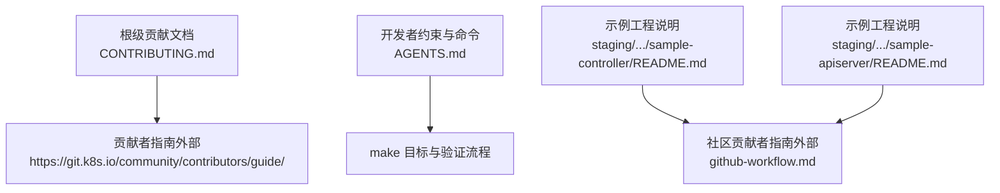
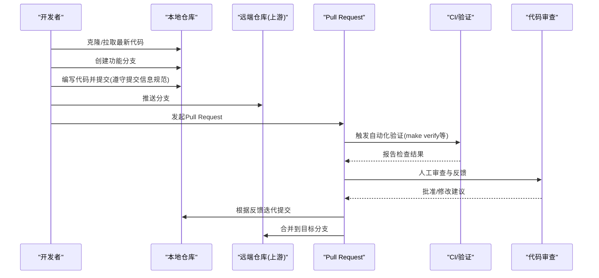
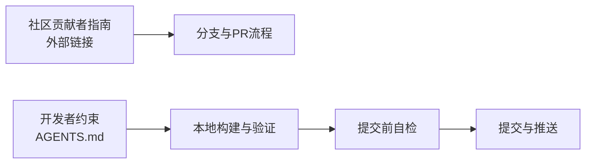

# Git工作流规范

<cite>
**本文引用的文件**   
- [CONTRIBUTING.md](file://CONTRIBUTING.md)
- [AGENTS.md](file://AGENTS.md)
- [sample-controller/README.md](file://staging/src/k8s.io/sample-controller/README.md)
- [sample-apiserver/README.md](file://staging/src/k8s.io/sample-apiserver/README.md)
</cite>

## 目录
1. [简介](#简介)
2. [项目结构](#项目结构)
3. [核心组件](#核心组件)
4. [架构总览](#架构总览)
5. [详细组件分析](#详细组件分析)
6. [依赖分析](#依赖分析)
7. [性能考虑](#性能考虑)
8. [故障排查指南](#故障排查指南)
9. [结论](#结论)
10. [附录](#附录)

## 简介
本规范面向Kubernetes项目的贡献者与协作者，统一本地开发、分支管理、提交信息与协作流程。内容基于仓库内现有贡献指引与示例工程说明整理而成，确保与社区实践保持一致，便于新成员快速上手并遵循统一的协作标准。

## 项目结构
为支撑Git工作流，仓库提供了以下关键入口与参考：
- 贡献总览与CLA要求：根级贡献文档
- 开发者约束与常用命令：开发者行为与命令速查
- 示例工程的“上游主仓库”说明：指向社区贡献者指南的GitHub工作流页面

**图表来源** 
- [CONTRIBUTING.md:1-10](file://CONTRIBUTING.md#L1-L10)
- [AGENTS.md:23-32](file://AGENTS.md#L23-L32)
- [sample-controller/README.md:55-62](file://staging/src/k8s.io/sample-controller/README.md#L55-L62)
- [sample-apiserver/README.md:50-56](file://staging/src/k8s.io/sample-apiserver/README.md#L50-L56)

**章节来源**
- [CONTRIBUTING.md:1-10](file://CONTRIBUTING.md#L1-L10)
- [AGENTS.md:23-32](file://AGENTS.md#L23-L32)
- [sample-controller/README.md:55-62](file://staging/src/k8s.io/sample-controller/README.md#L55-L62)
- [sample-apiserver/README.md:50-56](file://staging/src/k8s.io/sample-apiserver/README.md#L50-L56)

## 核心组件
- 贡献入口与许可协议
  - 根级贡献文档明确需签署贡献者许可协议（CLA），并引导至社区贡献者指南。
- 开发者约束与命令
  - 生成文件只读、go.mod/go.work由工具生成、Staging为权威源、必须包含样板头。
  - 提供常用 make 目标用于测试、验证与更新。
- 示例工程的工作流参考
  - 两个示例工程均引用社区贡献者指南中的GitHub工作流页面，作为分支与PR流程的外部权威参考。

**章节来源**
- [CONTRIBUTING.md:1-10](file://CONTRIBUTING.md#L1-L10)
- [AGENTS.md:9-22](file://AGENTS.md#L9-L22)
- [AGENTS.md:23-32](file://AGENTS.md#L23-L32)
- [sample-controller/README.md:55-62](file://staging/src/k8s.io/sample-controller/README.md#L55-L62)
- [sample-apiserver/README.md:50-56](file://staging/src/k8s.io/sample-apiserver/README.md#L50-L56)

## 架构总览
下图展示从本地开发到提交与审查的关键路径，以及各阶段对应的仓库内依据与外部参考。

[此图为概念性流程图，不直接映射具体源码文件，故不提供图表来源]

## 详细组件分析

### 分支策略
- 主分支与发布线
  - 以社区贡献者指南为准，通常使用稳定主线进行版本发布；具体命名与保护规则请参考外部指南。
- 开发分支
  - 日常集成与特性开发通常在独立分支上进行，避免直接在受保护的主分支上提交。
- 功能分支
  - 每个变更应基于最新上游主干创建独立分支，保持变更聚焦、可审查。
- 同步与重基
  - 定期从上游拉取最新变更，并在需要时rebase以保持历史整洁。

**章节来源**
- [CONTRIBUTING.md:1-10](file://CONTRIBUTING.md#L1-L10)
- [sample-controller/README.md:55-62](file://staging/src/k8s.io/sample-controller/README.md#L55-L62)
- [sample-apiserver/README.md:50-56](file://staging/src/k8s.io/sample-apiserver/README.md#L50-L56)

### 提交信息规范
- 禁止在提交信息中使用提及或自动关闭关键字
- 禁止在提交信息中添加协作署名行
- 提交信息应保持简洁、聚焦，解释“为什么”而非“做了什么”

上述约束来自仓库内的开发者行为约定，旨在提升提交历史的清晰度与可维护性。

**章节来源**
- [AGENTS.md:16-22](file://AGENTS.md#L16-L22)

### Fork与Clone工作流程
- 克隆上游仓库
  - 将上游仓库克隆到本地，作为后续开发的起点。
- 设置上游与个人远端
  - 将上游仓库设为upstream，将个人fork设为origin，便于拉取上游更新与推送个人分支。
- 本地开发环境设置
  - 遵循生成文件只读、使用指定脚本更新依赖与生成代码等约束。
- 代码同步
  - 定期从上游拉取最新变更，必要时rebase本地功能分支。
- 冲突解决
  - 优先采用交互式rebase或merge策略，保留清晰的历史；必要时回滚或拆分提交。

**章节来源**
- [sample-controller/README.md:55-62](file://staging/src/k8s.io/sample-controller/README.md#L55-L62)
- [sample-apiserver/README.md:50-56](file://staging/src/k8s.io/sample-apiserver/README.md#L50-L56)
- [AGENTS.md:9-15](file://AGENTS.md#L9-L15)

### Git操作最佳实践与常用命令
- 基础操作
  - 初始化与克隆：从上游仓库克隆代码
  - 分支管理：创建、切换、删除功能分支
  - 提交与推送：小步提交、及时推送
- 同步与重基
  - 拉取上游更新并进行rebase，保持线性历史
- 验证与更新
  - 使用仓库提供的make目标执行验证与更新任务
- 常见命令示例（以通用Git语义描述）
  - 克隆：git clone <上游地址>
  - 添加上游：git remote add upstream <上游地址>
  - 拉取上游：git fetch upstream
  - 重基：git rebase upstream/<目标分支>
  - 推送：git push origin <功能分支>
  - 验证：make verify
  - 更新：make update

**章节来源**
- [AGENTS.md:23-32](file://AGENTS.md#L23-L32)

## 依赖分析
- 外部依赖
  - 社区贡献者指南与GitHub工作流页面是分支与PR流程的主要参考来源。
- 内部约束
  - 生成文件只读、go.mod/go.work由工具生成、Staging为权威源、样板头必填等约束影响本地开发与提交前检查。

**图表来源** 
- [CONTRIBUTING.md:1-10](file://CONTRIBUTING.md#L1-L10)
- [AGENTS.md:9-22](file://AGENTS.md#L9-L22)
- [AGENTS.md:23-32](file://AGENTS.md#L23-L32)

**章节来源**
- [CONTRIBUTING.md:1-10](file://CONTRIBUTING.md#L1-L10)
- [AGENTS.md:9-22](file://AGENTS.md#L9-L22)
- [AGENTS.md:23-32](file://AGENTS.md#L23-L32)

## 性能考虑
- 提交粒度与历史质量
  - 小而专注的提交有助于减少冲突与提高审查效率。
- 生成文件与依赖更新
  - 遵循工具链更新生成文件与依赖，避免手工编辑导致的额外维护成本。
- 本地验证前置
  - 在提交前运行验证目标，降低CI失败带来的往返成本。

[本节为通用指导，不直接分析具体文件]

## 故障排查指南
- 提交被拒绝或审查未通过
  - 检查是否违反提交信息约束（如包含提及或协作署名）。
  - 确认已运行验证目标并通过。
- 生成文件相关错误
  - 不要手动编辑生成文件，使用仓库提供的更新命令重新生成。
- 依赖与模块问题
  - 使用仓库提供的脚本更新依赖与vendor，避免自行执行可能破坏一致性的命令。

**章节来源**
- [AGENTS.md:9-22](file://AGENTS.md#L9-L22)
- [AGENTS.md:23-32](file://AGENTS.md#L23-L32)

## 结论
本规范以仓库内现有贡献指引与开发者约束为依据，明确了分支策略、提交信息规范、Fork/Clone流程与最佳实践。遵循这些约定可显著提升协作效率与代码质量。对于更详细的分支与PR流程，请参照社区贡献者指南中的GitHub工作流页面。

[本节为总结性内容，不直接分析具体文件]

## 附录
- 外部参考
  - 社区贡献者指南：根级贡献文档中提供链接
  - GitHub工作流页面：示例工程说明中提供链接

**章节来源**
- [CONTRIBUTING.md:1-10](file://CONTRIBUTING.md#L1-L10)
- [sample-controller/README.md:55-62](file://staging/src/k8s.io/sample-controller/README.md#L55-L62)
- [sample-apiserver/README.md:50-56](file://staging/src/k8s.io/sample-apiserver/README.md#L50-L56)