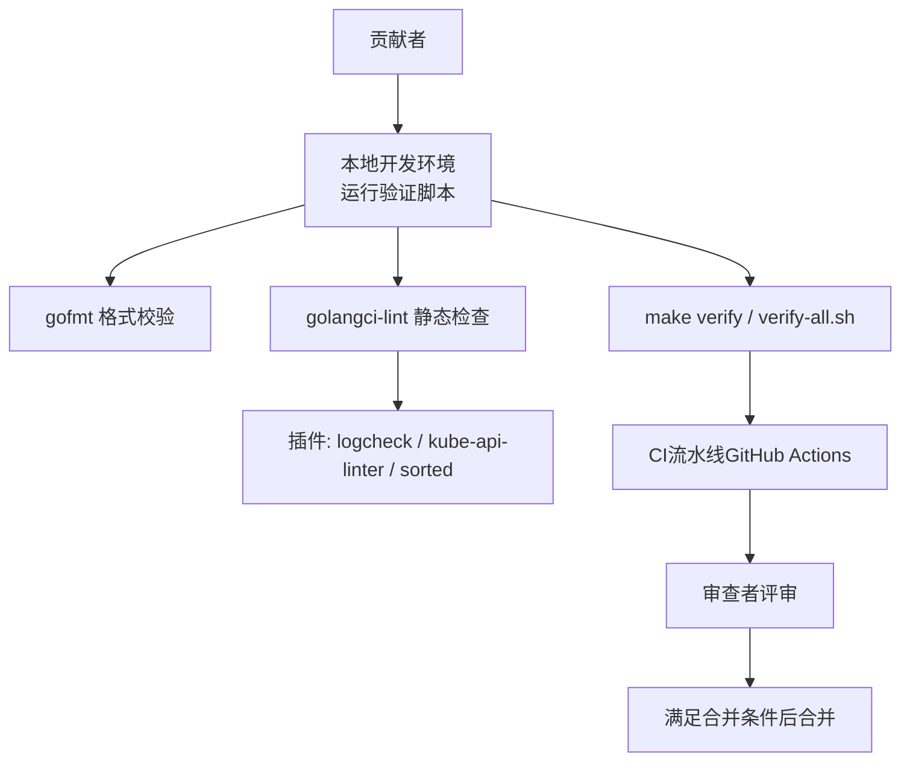
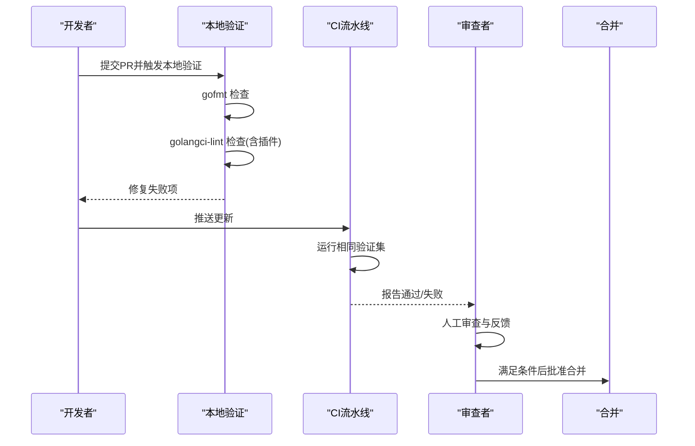
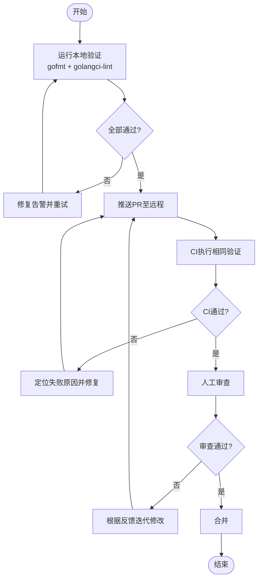
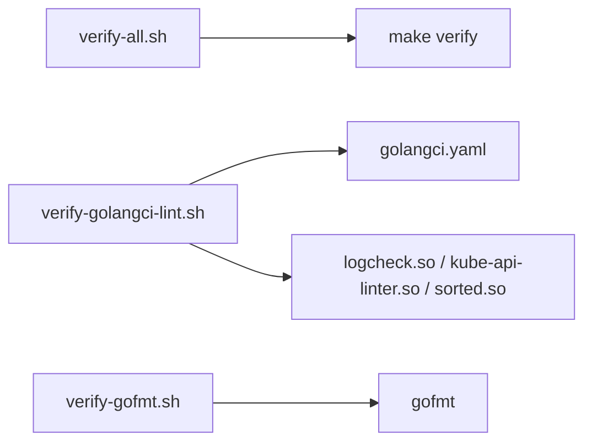

# 代码审查流程

<cite>
**本文引用的文件**   
- [PULL_REQUEST_TEMPLATE.md](file://.github/PULL_REQUEST_TEMPLATE.md)
- [CONTRIBUTING.md](file://CONTRIBUTING.md)
- [golangci.yaml](file://hack/golangci.yaml)
- [verify-golangci-lint.sh](file://hack/verify-golangci-lint.sh)
- [verify-all.sh](file://hack/verify-all.sh)
- [verify-gofmt.sh](file://hack/verify-gofmt.sh)
</cite>

## 目录
1. [简介](#简介)
2. [项目结构](#项目结构)
3. [核心组件](#核心组件)
4. [架构总览](#架构总览)
5. [详细组件分析](#详细组件分析)
6. [依赖分析](#依赖分析)
7. [性能考虑](#性能考虑)
8. [故障排查指南](#故障排查指南)
9. [结论](#结论)
10. [附录](#附录)

## 简介
本指南面向Kubernetes贡献者与维护者，系统化说明Pull Request（PR）的创建与审查流程、模板使用规范、标题与描述编写要求、代码质量检查标准、测试覆盖率与性能考量、审查者选择机制与反馈处理、合并条件与自动化检查。文档内容基于仓库内现有模板与验证脚本，确保可操作且与社区实践一致。

## 项目结构
与代码审查直接相关的仓库结构与关键文件如下：
- PR模板位于 .github/PULL_REQUEST_TEMPLATE.md，用于引导提交者填写变更类型、关联问题、发布说明等。
- 贡献入口与CLA要求在根目录 CONTRIBUTING.md 中说明。
- 代码风格与静态检查由 hack/golangci.yaml 配置，并通过 hack/verify-golangci-lint.sh 执行。
- 格式化检查由 hack/verify-gofmt.sh 提供。
- 统一验证入口为 hack/verify-all.sh（等价于 make verify）。

**图表来源** 
- [verify-gofmt.sh:1-69](file://hack/verify-gofmt.sh#L1-L69)
- [verify-golangci-lint.sh:1-249](file://hack/verify-golangci-lint.sh#L1-L249)
- [verify-all.sh:1-41](file://hack/verify-all.sh#L1-L41)

**章节来源**
- [PULL_REQUEST_TEMPLATE.md:1-83](file://.github/PULL_REQUEST_TEMPLATE.md#L1-L83)
- [CONTRIBUTING.md:1-10](file://CONTRIBUTING.md#L1-L10)
- [verify-gofmt.sh:1-69](file://hack/verify-gofmt.sh#L1-L69)
- [verify-golangci-lint.sh:1-249](file://hack/verify-golangci-lint.sh#L1-L249)
- [verify-all.sh:1-41](file://hack/verify-all.sh#L1-L41)

## 核心组件
- PR模板与元数据
  - 变更类型标签：bug、dependency、cleanup、documentation、feature 等，可选 api-change、deprecation、failing-test、flake、regression。
  - 关联问题：支持 Fixes #issue 自动关闭；KEP链接建议指向具体commit。
  - 用户可见变更：release-note块必填或写NONE；docs块用于补充文档链接。
- 代码质量检查
  - gofmt 强制格式一致性。
  - golangci-lint 启用多类linter与自定义规则，包含API linter、日志检查、依赖限制、命名与注释约定等。
- 统一验证
  - verify-all.sh 作为本地与CI的统一入口，等价于 make verify。

**章节来源**
- [PULL_REQUEST_TEMPLATE.md:11-83](file://.github/PULL_REQUEST_TEMPLATE.md#L11-L83)
- [verify-gofmt.sh:1-69](file://hack/verify-gofmt.sh#L1-L69)
- [golangci.yaml:1-695](file://hack/golangci.yaml#L1-L695)
- [verify-all.sh:1-41](file://hack/verify-all.sh#L1-L41)

## 架构总览
下图展示从本地到CI再到人工审查的关键路径与职责边界。

**图表来源** 
- [verify-gofmt.sh:1-69](file://hack/verify-gofmt.sh#L1-L69)
- [verify-golangci-lint.sh:1-249](file://hack/verify-golangci-lint.sh#L1-L249)
- [verify-all.sh:1-41](file://hack/verify-all.sh#L1-L41)

## 详细组件分析

### PR模板与描述规范
- 变更类型
  - 必须选择至少一个 kind，如 bug、feature、cleanup、documentation、dependency。
  - 可选附加 kind：api-change、deprecation、failing-test、flake、regression。
- 问题关联
  - 使用 Fixes #<issue> 可在合并时自动关闭；非 failing-test/flake 场景适用。
  - 涉及 KEP 时，链接应指向具体commit，避免直链master分支。
- 用户可见变更
  - release-note 块：若无用户可见变更，填 NONE；否则需详细描述影响与必要动作。
- 文档补充
  - docs 块：提供KEP、用法文档等永久链接。

最佳实践
- 标题简明扼要，体现“模块/组件 + 变更性质”。
- 描述遵循模板顺序：What/Why/Related Issue(s)/Notes for Reviewer/User-facing Change/Docs。
- 对破坏性变更或API变更，务必在 release-note 中明确说明兼容性与迁移步骤。

**章节来源**
- [PULL_REQUEST_TEMPLATE.md:11-83](file://.github/PULL_REQUEST_TEMPLATE.md#L11-L83)

### 代码质量检查与标准
- 格式检查
  - 使用 gofmt 进行统一格式化；不合规将导致验证失败。
- 静态检查
  - 通过 golangci-lint 执行，默认启用多种linter与自定义规则。
  - 插件能力：
    - logcheck：结构化日志调用检查。
    - kube-api-linter：API定义与标记规范检查。
    - sorted：特性开关排序检查。
  - 依赖与导入限制：
    - depguard 禁止在测试外使用特定包（如 cmp、html/template）。
    - forbidigo 禁止不安全或过时API（如 md5、已移除的managedfields API、旧版FeatureGate Add）。
  - 命名与注释：
    - revive/staticcheck 对导出符号注释、命名规范有严格要求。
  - API字段约定：
    - kubeapilinter 强制 json tag、optional/required 标记、listType、无timestamp字段等。
- 提示模式
  - 可通过 hints 配置（golangci-hints.yaml）获得更严格的建议，便于逐步改进。

建议
- 在提交前本地运行完整验证，减少CI往返。
- 针对告警，优先修复；若确属误报或历史遗留，按模板指引添加豁免并在PR中说明。

**章节来源**
- [verify-gofmt.sh:1-69](file://hack/verify-gofmt.sh#L1-L69)
- [golangci.yaml:1-695](file://hack/golangci.yaml#L1-L695)
- [verify-golangci-lint.sh:1-249](file://hack/verify-golangci-lint.sh#L1-L249)

### 测试覆盖率与性能考量
- 覆盖率
  - 仓库未在本指南范围内提供统一的覆盖率阈值与统计脚本引用。建议在涉及逻辑变更时补充单元测试与集成测试，保证关键路径覆盖。
- 性能
  - 避免引入不必要的内存分配与锁竞争；谨慎使用反射与正则。
  - 对热点路径增加基准测试或profiling数据，必要时在PR中附上对比结果。
  - 关注kubelet、proxy等关键组件的上下文日志与指标输出，避免高频I/O。

[本节为通用指导，不直接分析具体文件]

### 审查者选择机制与反馈处理
- 审查者选择
  - 仓库未在本指南范围内提供自动指派规则或OWNERS文件引用。通常由领域专家或维护者根据变更范围与历史参与情况选择。
- 反馈处理
  - 针对审查意见逐条回复，必要时在PR中追加解释或补充测试。
  - 对于需要放宽规则的告警，应在PR描述中说明原因并征得审查者同意。

[本节为通用指导，不直接分析具体文件]

### 合并条件与自动化检查流程
- 本地验证
  - 推荐在提交前运行 make verify 或 hack/verify-all.sh，确保格式与静态检查通过。
- CI流水线
  - GitHub Actions会复用相同的验证脚本与配置，确保环境与行为一致。
- 合并条件
  - 所有自动化检查通过。
  - 至少一名相关领域审查者批准。
  - 必要的release-note/docs已完善。
  - CLA已签署（见贡献指南）。

**图表来源** 
- [verify-all.sh:1-41](file://hack/verify-all.sh#L1-L41)
- [verify-gofmt.sh:1-69](file://hack/verify-gofmt.sh#L1-L69)
- [verify-golangci-lint.sh:1-249](file://hack/verify-golangci-lint.sh#L1-L249)

**章节来源**
- [verify-all.sh:1-41](file://hack/verify-all.sh#L1-L41)
- [verify-gofmt.sh:1-69](file://hack/verify-gofmt.sh#L1-L69)
- [verify-golangci-lint.sh:1-249](file://hack/verify-golangci-lint.sh#L1-L249)

## 依赖分析
- 脚本与配置关系
  - verify-all.sh 作为统一入口，委托 make verify。
  - verify-golangci-lint.sh 负责安装与运行golangci-lint及插件，并支持仅检查新增代码（--new-from-rev）。
  - golangci.yaml 集中管理linter启用列表、排除规则与插件配置。
  - verify-gofmt.sh 独立执行go fmt一致性检查。

**图表来源** 
- [verify-all.sh:1-41](file://hack/verify-all.sh#L1-L41)
- [verify-golangci-lint.sh:1-249](file://hack/verify-golangci-lint.sh#L1-L249)
- [golangci.yaml:1-695](file://hack/golangci.yaml#L1-L695)
- [verify-gofmt.sh:1-69](file://hack/verify-gofmt.sh#L1-L69)

**章节来源**
- [verify-all.sh:1-41](file://hack/verify-all.sh#L1-L41)
- [verify-golangci-lint.sh:1-249](file://hack/verify-golangci-lint.sh#L1-L249)
- [golangci.yaml:1-695](file://hack/golangci.yaml#L1-L695)
- [verify-gofmt.sh:1-69](file://hack/verify-gofmt.sh#L1-L69)

## 性能考虑
- 本地验证优化
  - 使用 --new-from-rev 仅检查差异部分，缩短反馈周期。
  - 合理缓存golangci-lint结果，避免重复构建插件。
- 代码层面
  - 避免在热路径中进行昂贵计算；合理使用并发与缓冲。
  - 控制日志级别与频率，避免阻塞主流程。
- 测试层面
  - 拆分长耗时测试为并行任务；对不稳定测试进行隔离与重试策略。

[本节为通用指导，不直接分析具体文件]

## 故障排查指南
- gofmt失败
  - 现象：diff输出显示格式不一致。
  - 解决：运行格式化脚本后重新提交。
- golangci-lint失败
  - 现象：出现linter告警或插件错误。
  - 解决：
    - 依据告警信息修复代码或调整配置。
    - 如需豁免，结合模板在PR中说明并获得审查者同意。
    - 使用 hints 配置辅助识别可忽略项。
- 配置验证失败
  - 现象：golangci-lint config verify 报错。
  - 解决：修正配置文件路径或语法后重试。
- 统一验证失败
  - 现象：make verify 或 verify-all.sh 返回非零退出码。
  - 解决：逐项修复子任务失败，直至全部通过。

**章节来源**
- [verify-gofmt.sh:1-69](file://hack/verify-gofmt.sh#L1-L69)
- [verify-golangci-lint.sh:1-249](file://hack/verify-golangci-lint.sh#L1-L249)
- [verify-all.sh:1-41](file://hack/verify-all.sh#L1-L41)

## 结论
通过模板化PR描述、严格的格式与静态检查、以及统一的验证入口，Kubernetes项目在代码质量与协作效率上建立了坚实基础。遵循本指南的流程与实践，有助于提升PR一次性通过率、降低审查成本，并确保变更的可追溯性与稳定性。

[本节为总结性内容，不直接分析具体文件]

## 附录
- 贡献与CLA
  - 贡献入口与CLA签署要求参见贡献指南。
- 常用命令
  - 本地验证：make verify 或 hack/verify-all.sh
  - 仅检查新增代码：参考 verify-golangci-lint.sh 的 --new-from-rev 参数
  - 格式化：参考 verify-gofmt.sh 对应的更新脚本

**章节来源**
- [CONTRIBUTING.md:1-10](file://CONTRIBUTING.md#L1-L10)
- [verify-all.sh:1-41](file://hack/verify-all.sh#L1-L41)
- [verify-golangci-lint.sh:1-249](file://hack/verify-golangci-lint.sh#L1-L249)
- [verify-gofmt.sh:1-69](file://hack/verify-gofmt.sh#L1-L69)