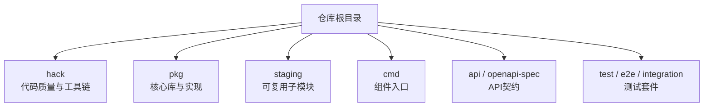
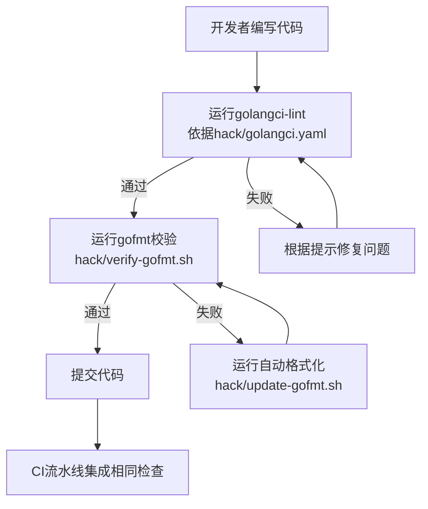
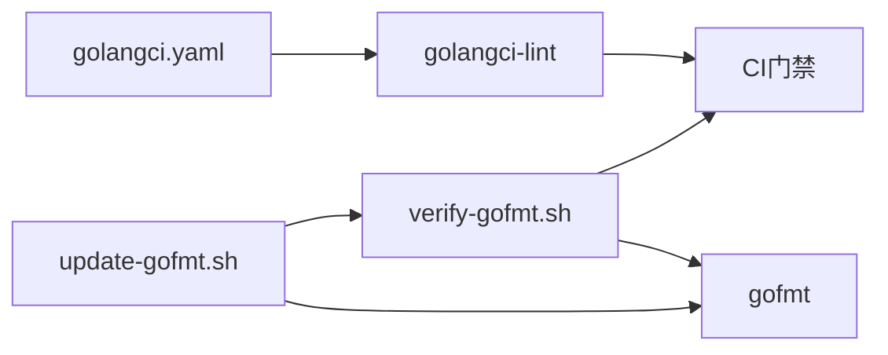

# 代码规范与标准

<cite>
**本文引用的文件**   
- [README.md](file://README.md)
- [CONTRIBUTING.md](file://CONTRIBUTING.md)
- [golangci.yaml](file://hack/golangci.yaml)
- [verify-gofmt.sh](file://hack/verify-gofmt.sh)
- [update-gofmt.sh](file://hack/update-gofmt.sh)
</cite>

## 目录
1. [简介](#简介)
2. [项目结构](#项目结构)
3. [核心组件](#核心组件)
4. [架构总览](#架构总览)
5. [详细组件分析](#详细组件分析)
6. [依赖分析](#依赖分析)
7. [性能考虑](#性能考虑)
8. [故障排查指南](#故障排查指南)
9. [结论](#结论)
10. [附录](#附录)

## 简介
本文件面向Kubernetes项目的Go语言编码规范与标准，覆盖命名约定、文件组织、包结构与导入管理；注释与文档规范（函数注释、类型定义、API文档）；格式化规则与linting工具使用；安全编码实践与常见反模式避免；以及性能优化与内存管理最佳实践。内容基于仓库内现有脚本与配置进行提炼，确保可执行性与一致性。

## 项目结构
Kubernetes仓库采用多模块与分层组织方式：
- 顶层包含构建与验证脚本、社区贡献说明等
- hack目录集中了代码质量、格式检查、生成与CI相关工具链
- pkg、staging、cmd等目录承载核心实现与组件入口
- api与openapi-spec存放API契约与OpenAPI描述

[本节为概念性概述，不直接分析具体文件]

## 核心组件
围绕“代码规范与标准”的关键基础设施包括：
- golangci-lint配置：统一启用静态检查、命名规范、API校验、依赖限制、日志规范等
- gofmt校验与自动修复脚本：保证全仓一致的代码风格
- 贡献与开发指引：指向社区贡献流程与CLA要求

这些组件共同构成仓库的“规范即代码”基座，确保提交前与CI中的一致性。

章节来源
- [golangci.yaml:1-695](file://hack/golangci.yaml#L1-L695)
- [verify-gofmt.sh:1-69](file://hack/verify-gofmt.sh#L1-L69)
- [update-gofmt.sh:1-52](file://hack/update-gofmt.sh#L1-L52)
- [CONTRIBUTING.md:1-10](file://CONTRIBUTING.md#L1-L10)

## 架构总览
下图展示了“本地开发—提交—CI”中的规范与质量门禁流程，以及关键脚本与配置文件的作用关系。

图表来源
- [golangci.yaml:1-695](file://hack/golangci.yaml#L1-L695)
- [verify-gofmt.sh:1-69](file://hack/verify-gofmt.sh#L1-L69)
- [update-gofmt.sh:1-52](file://hack/update-gofmt.sh#L1-L52)

章节来源
- [golangci.yaml:1-695](file://hack/golangci.yaml#L1-L695)
- [verify-gofmt.sh:1-69](file://hack/verify-gofmt.sh#L1-L69)
- [update-gofmt.sh:1-52](file://hack/update-gofmt.sh#L1-L52)

## 详细组件分析

### Go语言编码标准与命名约定
- 包与文件组织
  - 包名应简短、清晰、小写，避免下划线与混用大小写
  - 文件按功能域划分，单一职责，避免巨型文件
- 标识符命名
  - 遵循Go官方命名惯例；导出符号需具备可读性与稳定性
  - 转换函数、默认值设置与自定义校验函数允许使用下划线以提升可读性（如Convert_*_To_*、SetDefaults_*、ValidateCustom_*），此为Kubernetes特例化约定
- API字段命名
  - 优先使用Ref/Refs后缀而非Reference/References
  - 时间字段优先使用time语义，避免使用timestamp字面量
  - 禁止在API中使用map类型（除特定白名单场景），列表需标注listType
  - 可选/必填字段需明确标记并保持一致性

章节来源
- [golangci.yaml:94-109](file://hack/golangci.yaml#L94-L109)
- [golangci.yaml:276-280](file://hack/golangci.yaml#L276-L280)
- [golangci.yaml:167-176](file://hack/golangci.yaml#L167-L176)
- [golangci.yaml:411-424](file://hack/golangci.yaml#L411-L424)

### 文件组织与包结构
- 建议将公共能力下沉至pkg或staging下的独立模块，便于复用与版本治理
- 组件入口集中于cmd目录，保持main最小化，逻辑上移
- 第三方与vendor目录不参与规范检查，避免污染规则集

章节来源
- [golangci.yaml:26-30](file://hack/golangci.yaml#L26-L30)
- [golangci.yaml:41-44](file://hack/golangci.yaml#L41-L44)

### 导入管理与依赖约束
- 禁止使用已弃用的指针辅助包，迁移到新的ptr包
- 非测试代码禁止引入html/template以避免死代码消除失效
- 仅测试代码可使用go-cmp/cmp进行比较
- 对featuregate.Add的使用进行限制，推荐使用AddVersioned

章节来源
- [golangci.yaml:472-491](file://hack/golangci.yaml#L472-L491)
- [golangci.yaml:507-513](file://hack/golangci.yaml#L507-L513)

### 代码注释与文档规范
- 导出符号必须提供文档注释；包级注释需符合约定
- 针对部分路径（如kubeadm）放宽强制导出注释要求，以兼顾历史包袱
- API字段注释需以序列化后的字段名开头，提升OpenAPI/文档生成质量

章节来源
- [golangci.yaml:62-70](file://hack/golangci.yaml#L62-L70)
- [golangci.yaml:402-403](file://hack/golangci.yaml#L402-L403)

### 代码格式化规则与Linting工具
- 格式化
  - 使用gofmt进行统一格式化；仓库提供校验与自动修复脚本
  - 校验脚本会忽略third_party、vendor、testdata等目录
  - 自动修复脚本基于git ls-files快速定位变更或未跟踪的Go文件
- Linting
  - 使用golangci-lint作为统一入口，启用多种检查器（govet、staticcheck、revive、forbidigo、kubeapilinter等）
  - 通过issues.exclusions.rules对特定路径与文本进行精细化豁免
  - 自定义插件logcheck与sorted用于结构化日志与特性开关排序检查

章节来源
- [verify-gofmt.sh:35-48](file://hack/verify-gofmt.sh#L35-L48)
- [verify-gofmt.sh:50-68](file://hack/verify-gofmt.sh#L50-L68)
- [update-gofmt.sh:30-51](file://hack/update-gofmt.sh#L30-L51)
- [golangci.yaml:14-24](file://hack/golangci.yaml#L14-L24)
- [golangci.yaml:286-300](file://hack/golangci.yaml#L286-L300)
- [golangci.yaml:302-392](file://hack/golangci.yaml#L302-L392)
- [golangci.yaml:472-513](file://hack/golangci.yaml#L472-L513)

### 安全编码实践与常见反模式
- 禁止使用MD5哈希，改用SHA-256或其他安全哈希或非密码学哈希
- 禁止使用AnnotatedEventf事件接口，事件为“发后即忘”且强节流，不应承载状态传递
- 禁止使用已移除的managedfields提取API
- 禁止在featuregate中使用Add，改用AddVersioned
- 禁止在测试框架外使用ReportBeforeSuite/ReportAfterSuite

章节来源
- [golangci.yaml:492-513](file://hack/golangci.yaml#L492-L513)

### 性能优化与内存管理最佳实践
- 字符串拼接
  - 在热路径建议使用strings.Builder；非热路径+=亦可接受
  - 使用strings.Cut/CutPrefix替代HasPrefix/TrimPrefix以减少中间对象
- 切片与集合
  - 使用slices.Contains/ContainsFunc替代手动循环
  - 使用maps包简化遍历
- 现代化工具
  - modernize分析器提供多项建议（如minmax、rangeint、reflecttypefor等），可按需采纳
- 并发与上下文
  - 谨慎使用context.WithCancel，测试环境由专用工具处理取消
  - 避免goroutine中调用FailNow/SkipNow

章节来源
- [golangci.yaml:532-618](file://hack/golangci.yaml#L532-L618)
- [golangci.yaml:666-667](file://hack/golangci.yaml#L666-L667)

## 依赖分析
下图展示规范相关脚本与配置的依赖关系与执行顺序。

图表来源
- [golangci.yaml:1-695](file://hack/golangci.yaml#L1-L695)
- [verify-gofmt.sh:1-69](file://hack/verify-gofmt.sh#L1-L69)
- [update-gofmt.sh:1-52](file://hack/update-gofmt.sh#L1-L52)

章节来源
- [golangci.yaml:1-695](file://hack/golangci.yaml#L1-L695)
- [verify-gofmt.sh:1-69](file://hack/verify-gofmt.sh#L1-L69)
- [update-gofmt.sh:1-52](file://hack/update-gofmt.sh#L1-L52)

## 性能考虑
- 在热点路径避免不必要的字符串分配与复制，优先使用strings.Builder与Cut系列函数
- 合理使用切片与map操作，利用标准库新函数减少样板代码
- 谨慎开启modernize建议，结合业务场景评估收益与维护成本
- 控制并发粒度，避免在goroutine中进行阻塞I/O或重型计算

[本节为通用指导，不直接分析具体文件]

## 故障排查指南
- gofmt不一致
  - 现象：提交后CI报格式错误
  - 处理：本地运行自动修复脚本，再重新提交
- golangci-lint大量告警
  - 现象：一次性出现大量问题
  - 处理：先聚焦forbidigo与depguard等阻断性问题，其次按包逐步修复；必要时在配置中增加临时豁免并记录TODO
- 自定义插件未安装
  - 现象：logcheck/sorted/kube-api-linter无法加载
  - 处理：确保通过仓库提供的安装脚本完成插件构建与缓存清理

章节来源
- [verify-gofmt.sh:50-68](file://hack/verify-gofmt.sh#L50-L68)
- [update-gofmt.sh:43-51](file://hack/update-gofmt.sh#L43-L51)
- [golangci.yaml:302-392](file://hack/golangci.yaml#L302-L392)

## 结论
通过将规范固化于golangci-lint与gofmt工具链，并在CI中强制执行，Kubernetes项目在命名、文档、API设计、安全与性能方面形成了稳定一致的开发体验。建议在新增功能时同步完善注释与API标记，遵循禁用清单与现代化工具建议，持续降低技术债。

[本节为总结性内容，不直接分析具体文件]

## 附录
- 贡献与CLA
  - 贡献者需签署CLA，详见贡献指南链接
- 快速开始
  - 参考仓库根README获取开发与构建指引

章节来源
- [CONTRIBUTING.md:1-10](file://CONTRIBUTING.md#L1-L10)
- [README.md:1-101](file://README.md#L1-L101)