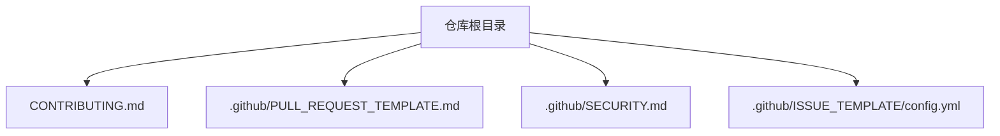
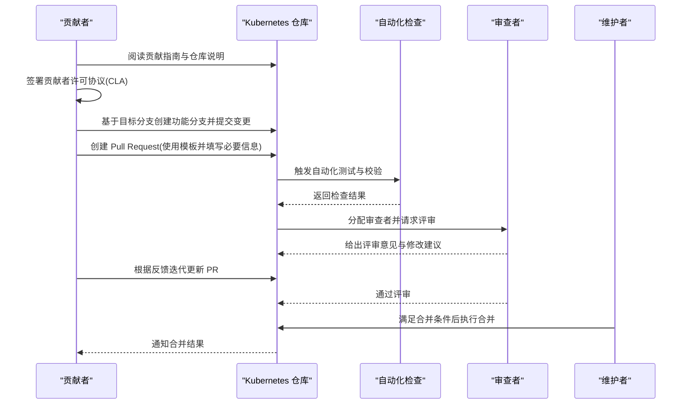
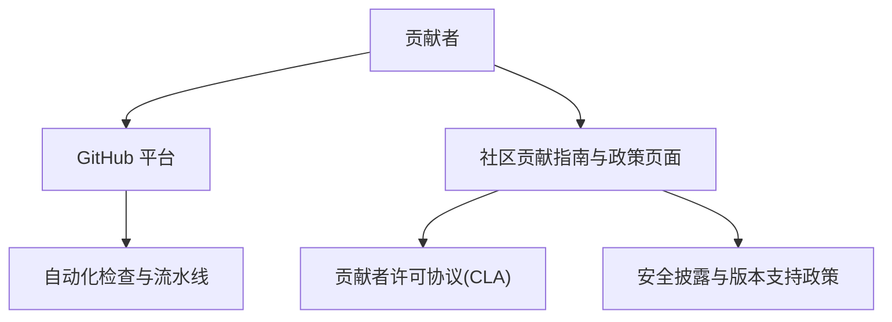

# 代码贡献流程

<cite>
**本文引用的文件**   
- [CONTRIBUTING.md](file://CONTRIBUTING.md)
- [PULL_REQUEST_TEMPLATE.md](file://.github/PULL_REQUEST_TEMPLATE.md)
- [SECURITY.md](file://.github/SECURITY.md)
- [config.yml](file://.github/ISSUE_TEMPLATE/config.yml)
</cite>

## 目录
1. [简介](#简介)
2. [项目结构](#项目结构)
3. [核心组件](#核心组件)
4. [架构总览](#架构总览)
5. [详细组件分析](#详细组件分析)
6. [依赖分析](#依赖分析)
7. [性能考虑](#性能考虑)
8. [故障排查指南](#故障排查指南)
9. [结论](#结论)
10. [附录](#附录)

## 简介
本指南面向希望为 Kubernetes 仓库贡献代码的开发者，聚焦于以下关键主题：贡献者许可协议（CLA）签署与重要性、Git 工作流（分支策略、提交规范、代码审查）、Pull Request 创建与管理（模板、描述、标签）、代码审查标准与合并条件、Go 语言编码规范与文档注释要求、安全漏洞报告与应急响应机制，以及社区参与方式（邮件列表、会议、行为准则）。

## 项目结构
仓库中与“贡献流程”直接相关的顶层配置集中在 .github 目录与根级说明文件中。下图展示了与本指南相关的文件组织关系。

**图示来源**
- [CONTRIBUTING.md:1-10](file://CONTRIBUTING.md#L1-L10)
- [PULL_REQUEST_TEMPLATE.md:1-83](file://.github/PULL_REQUEST_TEMPLATE.md#L1-L83)
- [SECURITY.md:1-15](file://.github/SECURITY.md#L1-L15)
- [config.yml:1-5](file://.github/ISSUE_TEMPLATE/config.yml#L1-L5)

**章节来源**
- [CONTRIBUTING.md:1-10](file://CONTRIBUTING.md#L1-L10)
- [PULL_REQUEST_TEMPLATE.md:1-83](file://.github/PULL_REQUEST_TEMPLATE.md#L1-L83)
- [SECURITY.md:1-15](file://.github/SECURITY.md#L1-L15)
- [config.yml:1-5](file://.github/ISSUE_TEMPLATE/config.yml#L1-L5)

## 核心组件
- 贡献入口与 CLA 指引：根级 CONTRIBUTING.md 提供贡献入口链接与 CLA 签署要求。
- PR 模板：.github/PULL_REQUEST_TEMPLATE.md 定义了 PR 类型、关联问题、发布说明等结构化字段。
- 安全策略：.github/SECURITY.md 指向版本支持与安全披露页面。
- Issue 模板配置：.github/ISSUE_TEMPLATE/config.yml 提供支持与问题分类入口。

**章节来源**
- [CONTRIBUTING.md:1-10](file://CONTRIBUTING.md#L1-L10)
- [PULL_REQUEST_TEMPLATE.md:1-83](file://.github/PULL_REQUEST_TEMPLATE.md#L1-L83)
- [SECURITY.md:1-15](file://.github/SECURITY.md#L1-L15)
- [config.yml:1-5](file://.github/ISSUE_TEMPLATE/config.yml#L1-L5)

## 架构总览
下图从“贡献者视角”展示一次典型贡献的生命周期：从阅读贡献指南到完成 CLA 签署、发起 PR、遵循模板填写、触发自动化检查、进行代码审查并最终合并。

[此图为概念性流程图，不直接映射具体源码文件]

## 详细组件分析

### 贡献者许可协议（CLA）
- 重要性：在 Kubernetes 项目中，签署 CLA 是贡献代码的前置条件，用于确保贡献内容的授权与合规。
- 签署流程：依据贡献指南中的指引前往官方页面完成签署；未签署将无法合入代码。
- 常见注意事项：
  - 个人与企业贡献者的签署主体不同，需按对应流程操作。
  - 若公司贡献，需确保公司层面的 CLA 已签署并由授权人员提交。
  - 签署完成后，首次提交或后续提交可能仍需系统校验状态。

**章节来源**
- [CONTRIBUTING.md:7-10](file://CONTRIBUTING.md#L7-L10)

### Git 工作流（分支策略、提交规范、代码审查）
- 分支策略（建议）：
  - 以主分支为集成基线，功能开发在独立分支上进行。
  - 修复类变更应明确关联问题编号，便于追踪。
- 提交规范（建议）：
  - 提交消息清晰表达“做了什么”和“为什么”，必要时引用相关 Issue/KEP。
  - 将逻辑相关的变更拆分为小而清晰的提交，便于审查与回溯。
- 代码审查（建议）：
  - 主动邀请领域专家或 OWNERS 指定人员参与评审。
  - 对评审意见逐条响应并记录决策理由。
  - 保持 PR 范围聚焦，避免一次性引入过多无关变更。

[本节为通用实践建议，不直接分析具体源码文件]

### Pull Request 创建与管理
- 模板使用：
  - 使用仓库提供的 PR 模板，完整填写 PR 类型、目的、关联问题、用户可见变更说明等。
  - 对于需要发布说明的变更，按要求在相应区块补充内容。
- 描述编写规范：
  - 用简洁标题概括变更要点，正文分点说明背景、方案与影响面。
  - 关联 Issue/KEP 时使用固定格式，便于自动化工具处理。
- 标签管理：
  - 根据变更性质添加合适的 kind 标签（如 bug、feature、documentation 等），有助于发布与统计。
  - 若涉及 API 变更或破坏性更新，务必标注 api-change 等标签。

**章节来源**
- [PULL_REQUEST_TEMPLATE.md:11-27](file://.github/PULL_REQUEST_TEMPLATE.md#L11-L27)
- [PULL_REQUEST_TEMPLATE.md:29-47](file://.github/PULL_REQUEST_TEMPLATE.md#L29-L47)
- [PULL_REQUEST_TEMPLATE.md:51-61](file://.github/PULL_REQUEST_TEMPLATE.md#L51-L61)
- [PULL_REQUEST_TEMPLATE.md:63-82](file://.github/PULL_REQUEST_TEMPLATE.md#L63-L82)

### 代码审查标准与流程
- 审查者选择：
  - 优先选择模块负责人或 OWNERS 中具备相关领域知识的成员。
  - 复杂变更可邀请多位审查者共同把关。
- 反馈处理：
  - 对每条评审意见进行回复，说明是否采纳及原因。
  - 针对需要重构或扩展的部分，拆分后续 PR 以保持当前 PR 聚焦。
- 合并条件（建议）：
  - 所有必要的自动化检查通过。
  - 至少一名相关领域审查者批准。
  - 变更符合发布说明与文档更新要求。
  - 无遗留的高风险问题或待确认项。

[本节为通用实践建议，不直接分析具体源码文件]

### Go 语言编码规范与文档注释
- 编码标准：
  - 遵循 Go 官方风格与工具链约定（格式化、导入分组、错误处理模式等）。
  - 保持包职责单一，避免循环依赖与过深嵌套。
- 命名约定：
  - 变量与函数名语义明确，避免缩写歧义。
  - 接口与实现分离，接口命名体现能力而非具体实现。
- 文档注释：
  - 对外暴露的包、类型、函数与常量需提供清晰注释，说明用途、参数与返回值。
  - 对重要算法或边界条件增加注释，帮助后续维护者理解。

[本节为通用实践建议，不直接分析具体源码文件]

### 安全漏洞报告与应急响应
- 受支持版本：参考官方版本与版本倾斜支持政策页面。
- 漏洞报告：
  - 通过官方安全披露页面提交，遵循保密流程。
  - 提供复现步骤、影响范围与潜在修复建议（可选）。
- 应急响应：
  - 维护团队将根据严重性与影响面评估并发布补丁或公告。
  - 贡献者在发现安全问题时应避免公开细节，直至修复与公告发布。

**章节来源**
- [SECURITY.md:3-6](file://.github/SECURITY.md#L3-L6)
- [SECURITY.md:8-11](file://.github/SECURITY.md#L8-L11)

### 社区参与指南
- 支持与讨论：
  - 使用官方讨论区进行问题咨询与支持请求。
- 会议参与：
  - 关注 SIG 会议日程与纪要，积极参与技术讨论与决策过程。
- 行为准则：
  - 遵守社区行为准则，尊重多元文化与技术观点，营造包容协作环境。

**章节来源**
- [config.yml:1-5](file://.github/ISSUE_TEMPLATE/config.yml#L1-L5)

## 依赖分析
贡献流程涉及的“外部依赖”主要是 GitHub 平台与自动化检查系统，以及社区治理文档与政策页面。下图示意这些依赖关系。

[此图为概念性依赖图，不直接映射具体源码文件]

## 性能考虑
- 提交粒度：小而频繁的提交有助于提升审查效率与回滚可控性。
- PR 范围控制：避免在一个 PR 中混合多种类型的变更，降低审查成本与回归风险。
- 自动化利用：善用本地预检与快速失败策略，减少不必要的 CI 轮次。

[本节为通用实践建议，不直接分析具体源码文件]

## 故障排查指南
- PR 无法合并：
  - 检查是否已通过全部自动化检查。
  - 确认是否缺少必要的审查批准或标签。
- 安全检查失败：
  - 查看 CI 日志定位失败环节，修正后再触发重新运行。
- 安全相关问题：
  - 按照安全披露流程私下上报，避免在公共渠道泄露细节。

[本节为通用实践建议，不直接分析具体源码文件]

## 结论
遵循本指南的流程与实践，能够显著提升贡献质量与协作效率。建议在每次贡献前对照清单自查：CLA 状态、PR 模板完整性、标签与关联问题、自动化检查结果、审查反馈闭环与发布说明准备。

## 附录
- 术语表：
  - CLA：贡献者许可协议
  - PR：拉取请求（Pull Request）
  - KEP：Kubernetes 增强提案
  - OWNERS：模块所有者与维护者名单

[本节为概念性附录，不直接分析具体源码文件]