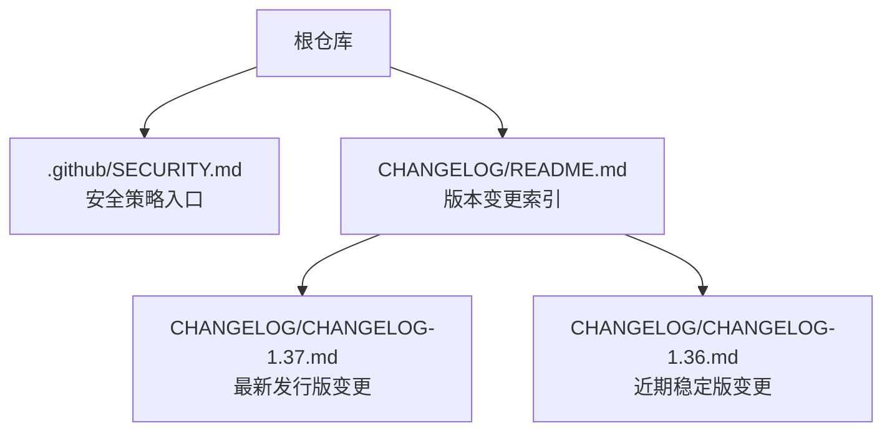
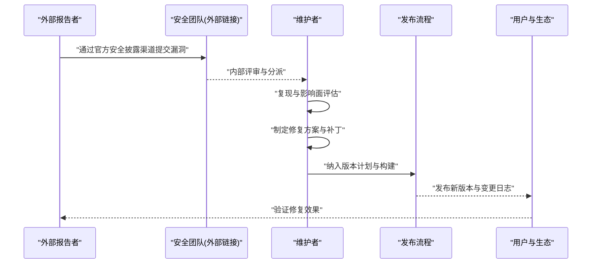
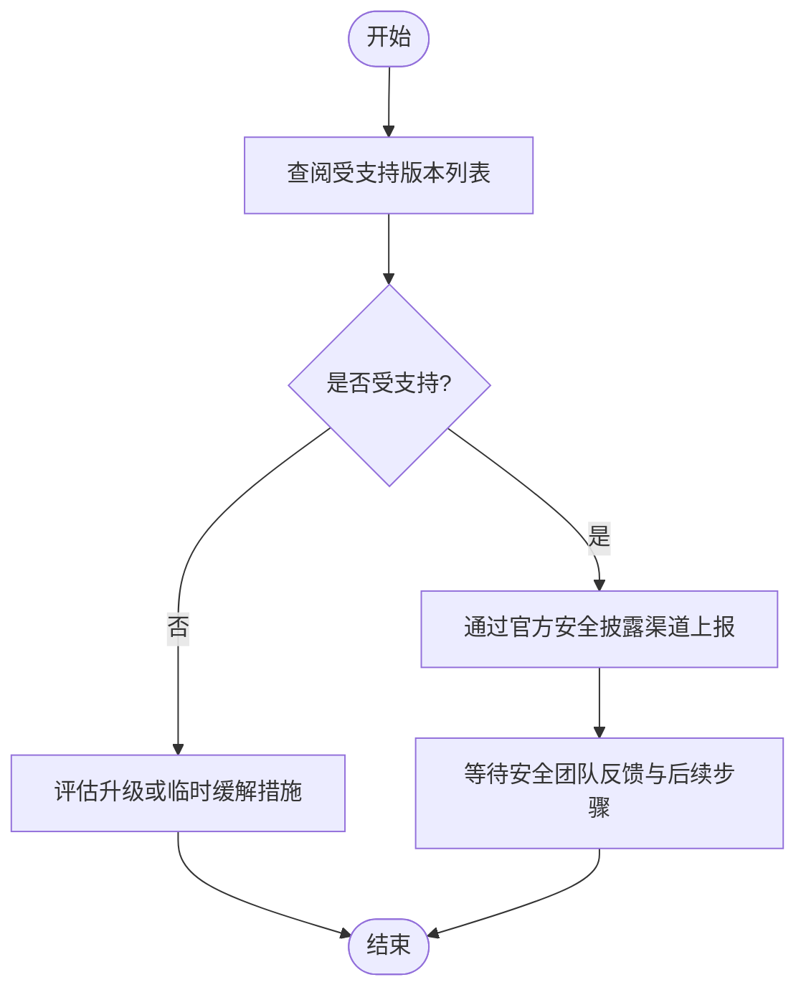
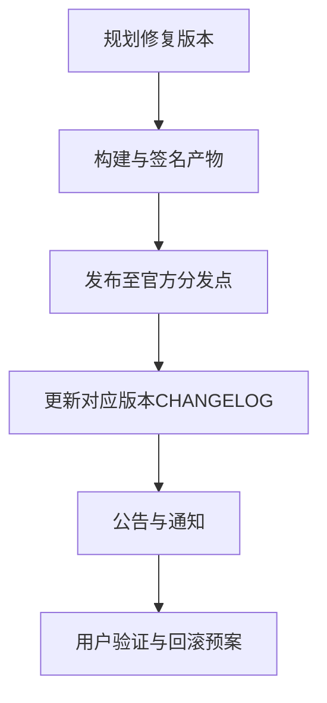
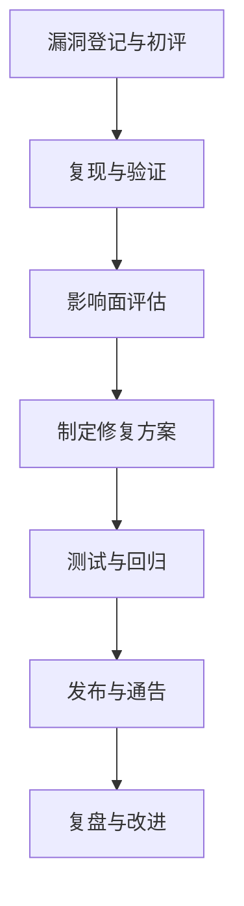
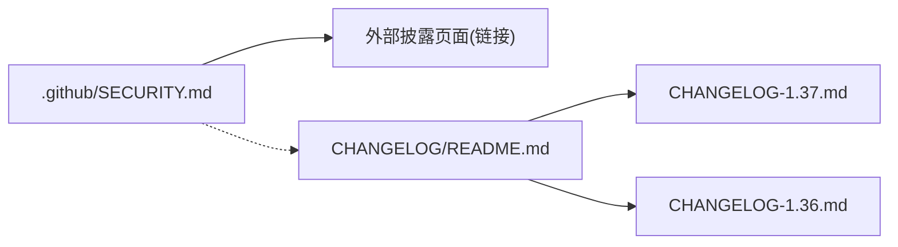

# 安全漏洞报告

<cite>
**本文引用的文件**   
- [.github/SECURITY.md](file://.github/SECURITY.md)
- [CHANGELOG/README.md](file://CHANGELOG/README.md)
- [CHANGELOG/CHANGELOG-1.37.md](file://CHANGELOG/CHANGELOG-1.37.md)
- [CHANGELOG/CHANGELOG-1.36.md](file://CHANGELOG/CHANGELOG-1.36.md)
</cite>

## 目录
1. [简介](#简介)
2. [项目结构](#项目结构)
3. [核心组件](#核心组件)
4. [架构总览](#架构总览)
5. [详细组件分析](#详细组件分析)
6. [依赖关系分析](#依赖关系分析)
7. [性能与可用性考虑](#性能与可用性考虑)
8. [故障排查指南](#故障排查指南)
9. [结论](#结论)
10. [附录](#附录)

## 简介
本文件面向Kubernetes项目的安全漏洞发现、报告、验证与修复流程，结合仓库内现有安全策略与版本发布材料，梳理私有披露政策、应急响应机制、严重性评估原则、补丁发布与版本管理、安全审计与渗透测试指导原则，以及参与安全社区与获取更新通知的方式。文档旨在为贡献者、维护者与用户提供清晰、可操作的安全治理参考。

## 项目结构
与安全相关的仓库级策略与变更记录主要位于以下位置：
- 安全策略入口：.github/SECURITY.md
- 版本变更与发布说明索引：CHANGELOG/README.md
- 具体版本的变更日志（含安全相关条目）：CHANGELOG/CHANGELOG-*.md

**图示来源** 
- [.github/SECURITY.md:1-15](file://.github/SECURITY.md#L1-L15)
- [CHANGELOG/README.md:1-39](file://CHANGELOG/README.md#L1-L39)
- [CHANGELOG/CHANGELOG-1.37.md:1-200](file://CHANGELOG/CHANGELOG-1.37.md#L1-L200)
- [CHANGELOG/CHANGELOG-1.36.md:1-200](file://CHANGELOG/CHANGELOG-1.36.md#L1-L200)

**章节来源**
- [.github/SECURITY.md:1-15](file://.github/SECURITY.md#L1-L15)
- [CHANGELOG/README.md:1-39](file://CHANGELOG/README.md#L1-L39)

## 核心组件
- 安全策略与披露入口
  - .github/SECURITY.md 提供“受支持版本”和“漏洞上报指引”，并链接至官方“安全与披露信息”页面，作为统一的对外披露与上报入口。
- 版本与变更追踪
  - CHANGELOG/README.md 汇总各版本变更日志；各版本CHANGELOG-*.md包含功能、API变更、依赖升级与缺陷修复等条目，可作为安全修复与影响面评估的权威依据。

**章节来源**
- [.github/SECURITY.md:1-15](file://.github/SECURITY.md#L1-L15)
- [CHANGELOG/README.md:1-39](file://CHANGELOG/README.md#L1-L39)

## 架构总览
下图展示从“发现漏洞”到“发布修复版本”的高层流程，并与仓库中的策略与变更文档对应。

[此图为概念流程图，不直接映射具体源码文件，故无图示来源]

## 详细组件分析

### 安全策略与披露入口
- 内容要点
  - 受支持版本：指向官方“版本与版本倾斜支持策略”页面，用于确定哪些版本仍获得安全更新。
  - 漏洞上报：指向官方“安全与披露信息”页面，作为统一的上报与沟通渠道。
- 实践建议
  - 在提交漏洞前，先确认受影响版本是否在支持范围内。
  - 使用官方披露渠道进行私有披露，避免提前公开细节。

**章节来源**
- [.github/SECURITY.md:1-15](file://.github/SECURITY.md#L1-L15)

### 版本管理与发布流程
- 版本索引与归档
  - CHANGELOG/README.md 集中列出各版本变更日志，便于快速定位特定版本的变更记录。
- 版本变更内容
  - 各CHANGELOG-*.md包含下载清单、依赖变更、API变更、特性与缺陷修复等条目，可作为安全修复与影响面评估的依据。
- 发布产物与完整性校验
  - 版本发布通常附带二进制、镜像与源码包，并提供哈希值以支持完整性校验。

**章节来源**
- [CHANGELOG/README.md:1-39](file://CHANGELOG/README.md#L1-L39)
- [CHANGELOG/CHANGELOG-1.37.md:1-200](file://CHANGELOG/CHANGELOG-1.37.md#L1-L200)
- [CHANGELOG/CHANGELOG-1.36.md:1-200](file://CHANGELOG/CHANGELOG-1.36.md#L1-L200)

### 安全分类与严重性评估（基于仓库材料的可操作框架）
- 分类维度（建议）
  - 影响范围：控制平面/节点/网络/存储/认证授权/配置管理等。
  - 可利用性：是否需要特权、本地访问、已知攻击路径复杂度。
  - 破坏程度：数据泄露、权限提升、服务中断、持久化控制等。
- 严重性等级（建议）
  - 紧急：远程代码执行、任意权限提升、关键组件未授权访问等。
  - 高：跨域越权、敏感信息泄露、绕过关键校验等。
  - 中：有限影响的可利用问题、需特定条件触发。
  - 低：信息泄露风险极低、仅影响非关键路径。
- 评估流程（建议）
  - 初步分级 → 技术复现 → 影响面评估 → 修复优先级排序 → 发布窗口决策。

[本节为通用方法论，不直接分析具体文件，故无章节来源]

### 应急响应机制（基于仓库材料的落地步骤）
- 接收与登记
  - 通过官方披露渠道接收漏洞，建立内部工单与时间线。
- 复现与验证
  - 在隔离环境复现，确认影响范围与可利用条件。
- 修复与回归
  - 最小化修复补丁，补充测试用例，确保回归通过。
- 发布与通告
  - 按版本节奏发布，更新CHANGELOG，必要时发布安全公告。
- 复盘与改进
  - 总结根因、完善检测与防护、优化流程。

[此图为概念流程图，不直接映射具体源码文件，故无图示来源]

### 安全审计与渗透测试指导原则
- 审计范围
  - 控制平面组件、节点代理、网络插件、存储驱动、认证授权链路、密钥与证书管理、日志与审计。
- 测试方法
  - 静态分析、依赖漏洞扫描、动态测试、渗透测试、红蓝对抗演练。
- 合规与基线
  - 遵循最小权限、默认安全、纵深防御、可观测性与可追溯性要求。
- 工具与自动化
  - 将安全扫描集成到CI流水线，对依赖与制品进行持续检查。

[本节为通用方法论，不直接分析具体文件，故无章节来源]

### 参与安全社区与获取更新通知
- 关注官方披露页面与版本发布页，订阅变更日志与公告。
- 在仓库中查看“.github/SECURITY.md”与“CHANGELOG/README.md”以了解受支持版本与版本变更索引。
- 对于重大安全问题，优先升级到受支持的最新稳定版本，并参考对应版本的CHANGELOG进行影响面评估与升级准备。

**章节来源**
- [.github/SECURITY.md:1-15](file://.github/SECURITY.md#L1-L15)
- [CHANGELOG/README.md:1-39](file://CHANGELOG/README.md#L1-L39)

## 依赖关系分析
- 策略与文档耦合
  - .github/SECURITY.md 作为策略入口，链接至外部官方披露页面；CHANGELOG/README.md 聚合各版本变更日志，二者共同构成“披露—修复—发布—通知”的闭环。
- 版本与修复关联
  - 具体修复与影响面可通过对应版本的CHANGELOG-*.md进行检索与评估。

**图示来源** 
- [.github/SECURITY.md:1-15](file://.github/SECURITY.md#L1-L15)
- [CHANGELOG/README.md:1-39](file://CHANGELOG/README.md#L1-L39)
- [CHANGELOG/CHANGELOG-1.37.md:1-200](file://CHANGELOG/CHANGELOG-1.37.md#L1-L200)
- [CHANGELOG/CHANGELOG-1.36.md:1-200](file://CHANGELOG/CHANGELOG-1.36.md#L1-L200)

**章节来源**
- [.github/SECURITY.md:1-15](file://.github/SECURITY.md#L1-L15)
- [CHANGELOG/README.md:1-39](file://CHANGELOG/README.md#L1-L39)

## 性能与可用性考虑
- 安全修复应兼顾稳定性与可用性，避免引入新的性能瓶颈或兼容性问题。
- 在灰度与金丝雀发布中逐步验证修复效果，降低大规模升级风险。
- 对关键组件的变更，建议配合监控与告警，及时发现问题并回滚。

[本节为通用建议，不直接分析具体文件，故无章节来源]

## 故障排查指南
- 若无法通过仓库内找到披露入口，请优先访问“.github/SECURITY.md”中的外部链接，以获取最新的上报与沟通方式。
- 针对特定版本的影响面评估，优先查阅对应版本的CHANGELOG-*.md，关注依赖升级、API变更与缺陷修复条目。
- 升级前务必核对受支持版本列表，确保目标版本仍在支持周期内。

**章节来源**
- [.github/SECURITY.md:1-15](file://.github/SECURITY.md#L1-L15)
- [CHANGELOG/CHANGELOG-1.37.md:1-200](file://CHANGELOG/CHANGELOG-1.37.md#L1-L200)
- [CHANGELOG/CHANGELOG-1.36.md:1-200](file://CHANGELOG/CHANGELOG-1.36.md#L1-L200)

## 结论
Kubernetes的安全治理以“统一披露入口 + 严格版本管理 + 透明变更日志”为核心。通过遵循仓库内的安全策略与变更文档，用户可以高效完成漏洞上报、修复验证与版本升级，保障集群的安全与稳定。

[本节为总结性内容，不直接分析具体文件，故无章节来源]

## 附录
- 术语
  - 私有披露：在未公开漏洞细节前，向项目方私下报告。
  - 受支持版本：仍在官方支持周期内、可获得安全更新的版本。
  - 变更日志：记录每个版本的功能、API、依赖与缺陷修复等信息的文档。

[本节为补充说明，不直接分析具体文件，故无章节来源]