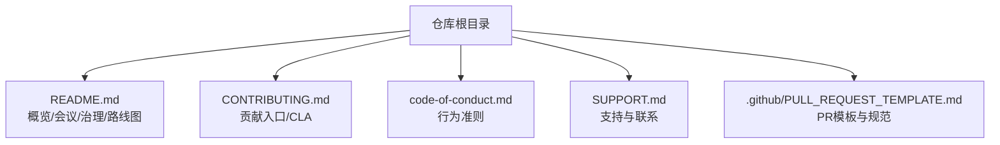
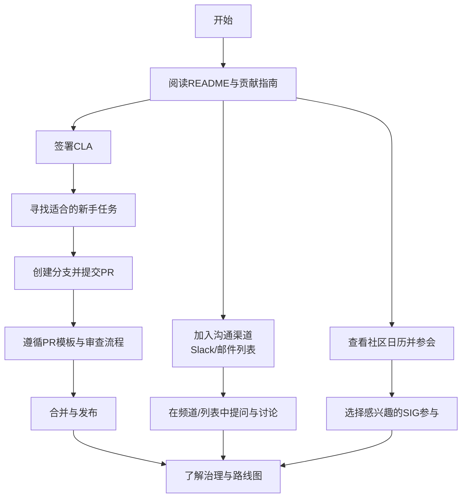
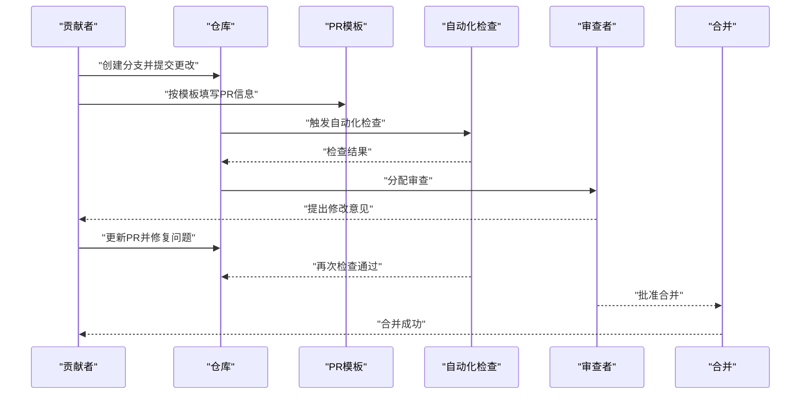
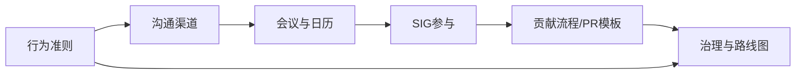

# 社区参与指南

<cite>
**本文引用的文件**   
- [README.md](file://README.md)
- [CONTRIBUTING.md](file://CONTRIBUTING.md)
- [code-of-conduct.md](file://code-of-conduct.md)
- [SUPPORT.md](file://SUPPORT.md)
- [.github/PULL_REQUEST_TEMPLATE.md](file://.github/PULL_REQUEST_TEMPLATE.md)
</cite>

## 目录
1. [简介](#简介)
2. [项目结构](#项目结构)
3. [核心组件](#核心组件)
4. [架构总览](#架构总览)
5. [详细组件分析](#详细组件分析)
6. [依赖关系分析](#依赖关系分析)
7. [性能与协作效率建议](#性能与协作效率建议)
8. [故障排查与常见问题](#故障排查与常见问题)
9. [结论](#结论)
10. [附录](#附录)

## 简介
本指南面向希望加入Kubernetes社区的贡献者，提供从入门到深度参与的完整路径。内容涵盖：
- 如何订阅邮件列表、使用Slack频道、参加社区会议
- 社区组织结构与SIG（特别兴趣小组）的参与方式与职责分工
- 行为准则与沟通礼仪
- 技术讨论、决策流程与项目治理
- 新贡献者入门与导师制度
- 提交代码与PR的基本规范

## 项目结构
仓库根目录包含与社区参与直接相关的文档与模板，便于快速定位入口：
- README.md：项目概览、开发入口、会议日历链接、治理与路线图入口
- CONTRIBUTING.md：贡献总览与CLA签署指引
- code-of-conduct.md：行为准则入口
- SUPPORT.md：支持渠道与联系方式
- .github/PULL_REQUEST_TEMPLATE.md：PR模板与最佳实践提示

图表来源
- [README.md:82-101](file://README.md#L82-L101)
- [CONTRIBUTING.md:1-10](file://CONTRIBUTING.md#L1-L10)
- [code-of-conduct.md:1-4](file://code-of-conduct.md#L1-L4)
- [SUPPORT.md:22-22](file://SUPPORT.md#L22-L22)
- [.github/PULL_REQUEST_TEMPLATE.md:1-83](file://.github/PULL_REQUEST_TEMPLATE.md#L1-L83)

章节来源
- [README.md:1-101](file://README.md#L1-L101)
- [CONTRIBUTING.md:1-10](file://CONTRIBUTING.md#L1-L10)
- [code-of-conduct.md:1-4](file://code-of-conduct.md#L1-L4)
- [SUPPORT.md:22-22](file://SUPPORT.md#L22-L22)
- [.github/PULL_REQUEST_TEMPLATE.md:1-83](file://.github/PULL_REQUEST_TEMPLATE.md#L1-L83)

## 核心组件
本节聚焦“社区参与”的关键入口与流程，帮助新成员快速上手。

- 社区组织与治理
  - 通过README中的治理与路线图链接了解总体治理框架、Steering Committee与Enhancements流程。
  - 参考社区仓库以获取更详细的组织架构说明。

- 会议参与
  - 使用社区日历统一查看所有会议安排，按兴趣选择SIG或主题会议参与。

- 沟通渠道
  - Slack：注册并加入相关频道，用于日常交流与问题反馈。
  - 邮件列表：关注kubernetes-dev等列表，参与重大议题讨论与公告。

- 行为准则
  - 遵循社区行为准则，保持尊重、包容与建设性沟通。

- 贡献入口
  - 阅读贡献指南，完成CLA签署后开始首次贡献。
  - 使用PR模板确保提交质量与可审查性。

章节来源
- [README.md:82-101](file://README.md#L82-L101)
- [SUPPORT.md:22-22](file://SUPPORT.md#L22-L22)
- [CONTRIBUTING.md:1-10](file://CONTRIBUTING.md#L1-L10)
- [code-of-conduct.md:1-4](file://code-of-conduct.md#L1-L4)
- [.github/PULL_REQUEST_TEMPLATE.md:1-83](file://.github/PULL_REQUEST_TEMPLATE.md#L1-L83)

## 架构总览
下图展示“新贡献者进入社区”的整体路径与关键节点，包括学习资源、沟通渠道、会议参与、贡献流程与治理入口。

[此图为概念流程图，不直接映射具体源码文件]

## 详细组件分析

### 沟通渠道与会务参与
- Slack
  - 注册并加入kubernetes.slack.com，根据兴趣加入相应频道（例如SIG相关频道）。
  - 用于快速问答、同步进展与收集反馈。
- 邮件列表
  - 关注kubernetes-dev等列表，参与重大议题讨论与公告。
- 会议
  - 通过社区日历集中查看各类会议，按需订阅提醒并参与。

章节来源
- [SUPPORT.md:22-22](file://SUPPORT.md#L22-L22)
- [README.md:82-84](file://README.md#L82-L84)

### 社区行为准则与沟通礼仪
- 行为准则
  - 遵循社区行为准则，倡导尊重、包容与建设性对话。
- 沟通礼仪
  - 在Slack与邮件列表中保持清晰、简洁与上下文充分；避免重复发帖；引用相关议题与链接。
  - 对敏感安全问题，遵循安全披露流程，不在公开渠道泄露细节。

章节来源
- [code-of-conduct.md:1-4](file://code-of-conduct.md#L1-L4)

### 贡献流程与PR模板
- 贡献入口
  - 阅读贡献指南，完成CLA签署后再进行代码或文档贡献。
- PR模板要点
  - 明确PR类型与动机
  - 关联相关Issue与KEP
  - 补充测试与文档更新
  - 填写变更说明（release-note）
- 审查与合并
  - 遵循审查流程，及时响应评论与CI结果，迭代改进直至合并。

图表来源
- [.github/PULL_REQUEST_TEMPLATE.md:1-83](file://.github/PULL_REQUEST_TEMPLATE.md#L1-L83)
- [CONTRIBUTING.md:1-10](file://CONTRIBUTING.md#L1-L10)

章节来源
- [CONTRIBUTING.md:1-10](file://CONTRIBUTING.md#L1-L10)
- [.github/PULL_REQUEST_TEMPLATE.md:1-83](file://.github/PULL_REQUEST_TEMPLATE.md#L1-L83)

### 社区组织结构与SIG参与
- 组织结构
  - 通过社区仓库了解整体组织方式与角色定义。
- SIG参与
  - 通过日历找到对应SIG会议，先旁听再逐步参与讨论与提案。
  - 在SIG频道与邮件列表中跟进议题，提交想法与方案。
- 决策与治理
  - 了解治理原则、Steering Committee职责与Enhancements流程，参与 KEP 讨论与评审。

章节来源
- [README.md:90-101](file://README.md#L90-L101)

### 新贡献者入门与导师制度
- 入门步骤
  - 阅读README与贡献指南，完成环境搭建与基础构建。
  - 从文档、测试或小功能入手，熟悉代码结构与流程。
- 导师制度
  - 在SIG频道或邮件列表中寻求指导，主动请求有经验的贡献者协助。
  - 定期同步进展，接受反馈并持续改进。

章节来源
- [README.md:35-59](file://README.md#L35-L59)
- [CONTRIBUTING.md:1-10](file://CONTRIBUTING.md#L1-L10)

## 依赖关系分析
社区参与各要素之间的依赖关系如下：
- 行为准则是所有沟通与协作的基础约束
- 沟通渠道（Slack/邮件列表）是日常协作与信息同步的载体
- 会议与日历是发现机会、对齐目标与推进决策的重要场景
- 贡献流程与PR模板保障提交质量与可维护性
- 治理与路线图决定方向与优先级，影响贡献者的选题与投入

[此图为概念图，不直接映射具体源码文件]

## 性能与协作效率建议
- 会前准备：提前阅读议程与相关材料，明确目标与问题清单
- 高效沟通：在Slack中结构化表达，必要时转至邮件列表沉淀讨论
- 高质量提交：完善测试与文档，减少反复修改成本
- 持续学习：跟踪路线图与增强提案，把握方向与节奏

[本节为通用建议，无需源码引用]

## 故障排查与常见问题
- 无法访问Slack
  - 确认注册流程与邀请状态，必要时重新申请
- 邮件列表未收到通知
  - 检查订阅状态与垃圾邮件过滤设置
- PR审查停滞
  - 主动在相关频道或邮件列表询问进度，补充必要信息
- 安全问题处理
  - 遵循安全披露流程，避免在公开渠道披露细节

章节来源
- [SUPPORT.md:22-22](file://SUPPORT.md#L22-L22)

## 结论
通过本指南，您可以快速融入Kubernetes社区：从理解治理与路线图，到选择合适的SIG与沟通渠道，再到完成首次贡献与持续参与。请始终遵循行为准则，保持开放与协作的态度，共同推动项目发展。

[本节为总结性内容，无需源码引用]

## 附录
- 常用入口
  - 社区仓库：了解组织、流程与资源
  - 社区日历：查看所有会议与活动
  - 行为准则：遵守社区规范
  - 贡献指南与PR模板：提升提交质量与审查效率

章节来源
- [README.md:82-101](file://README.md#L82-L101)
- [code-of-conduct.md:1-4](file://code-of-conduct.md#L1-L4)
- [CONTRIBUTING.md:1-10](file://CONTRIBUTING.md#L1-L10)
- [.github/PULL_REQUEST_TEMPLATE.md:1-83](file://.github/PULL_REQUEST_TEMPLATE.md#L1-L83)