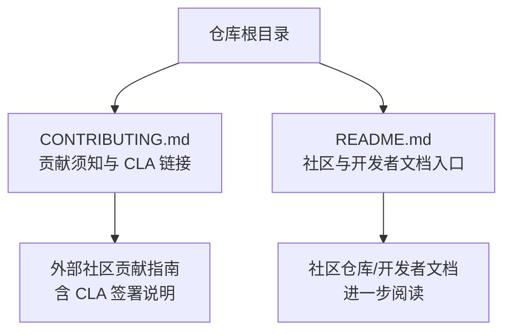
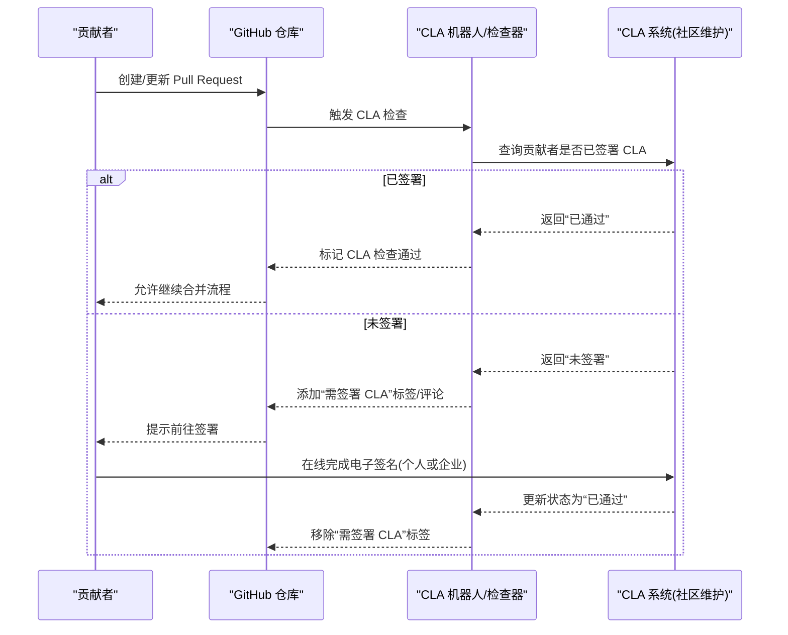
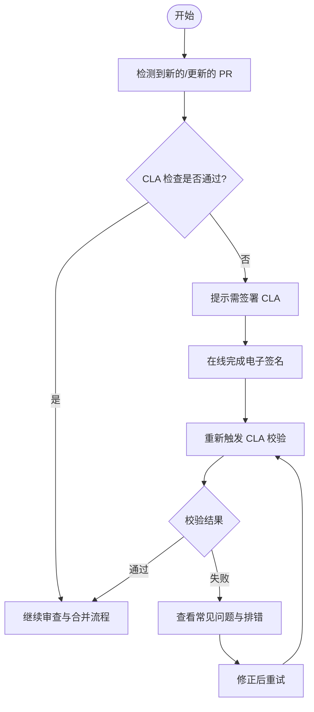
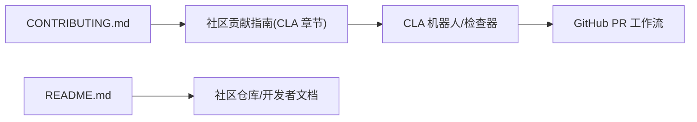

# 贡献者许可协议签署

<cite>
**本文引用的文件**   
- [CONTRIBUTING.md](file://CONTRIBUTING.md)
- [README.md](file://README.md)
</cite>

## 目录
1. [简介](#简介)
2. [项目结构](#项目结构)
3. [核心组件](#核心组件)
4. [架构总览](#架构总览)
5. [详细组件分析](#详细组件分析)
6. [依赖分析](#依赖分析)
7. [性能考虑](#性能考虑)
8. [故障排除指南](#故障排除指南)
9. [结论](#结论)
10. [附录](#附录)

## 简介
本指南面向希望为 Kubernetes 代码仓库提交贡献的开发者，聚焦于“贡献者许可协议（CLA）”的签署流程、法律意义与影响。Kubernetes 要求所有贡献者在提交 Pull Request 之前完成 CLA 签署，这是合并代码的必要条件之一。本指南将帮助你理解：
- 为什么需要签署 CLA
- 个人与公司如何分别签署
- 电子签名流程与验证步骤
- 常见问题与排错方法
- 未签署对贡献的影响

## 项目结构
在仓库根目录中，贡献入口与 CLA 指引位于以下位置：
- 贡献总览与 CLA 链接：[CONTRIBUTING.md](file://CONTRIBUTING.md)
- 社区与开发文档入口（包含更详细的贡献说明）：[README.md](file://README.md)

图表来源
- [CONTRIBUTING.md:1-10](file://CONTRIBUTING.md#L1-L10)
- [README.md:35-75](file://README.md#L35-L75)

章节来源
- [CONTRIBUTING.md:1-10](file://CONTRIBUTING.md#L1-L10)
- [README.md:35-75](file://README.md#L35-L75)

## 核心组件
- CLA 政策入口：仓库通过 CONTRIBUTING.md 明确“必须签署贡献者许可协议才能贡献”，并指向社区贡献指南中的 CLA 章节。
- 社区贡献指南：提供完整的 CLA 签署说明（包括个人与企业两种路径）、电子签名方式、验证与常见问题等。

章节来源
- [CONTRIBUTING.md:6-10](file://CONTRIBUTING.md#L6-L10)
- [README.md:35-75](file://README.md#L35-L75)

## 架构总览
下图展示了从“准备提交 PR”到“CLA 校验通过”的整体流程，以及 CLA 系统与 GitHub 工作流的交互关系。

图表来源
- [CONTRIBUTING.md:6-10](file://CONTRIBUTING.md#L6-L10)
- [README.md:35-75](file://README.md#L35-L75)

## 详细组件分析

### 贡献入口与 CLA 指引
- 仓库根级 CONTRIBUTING.md 明确指出：贡献前必须签署 CLA，并提供指向社区贡献指南中“签署 CLA”章节的链接。
- README.md 提供了社区仓库与开发者文档入口，便于查阅更全面的贡献流程与规范。

章节来源
- [CONTRIBUTING.md:6-10](file://CONTRIBUTING.md#L6-L10)
- [README.md:35-75](file://README.md#L35-L75)

### 个人与企业签署差异
- 个人贡献者：以个人身份在线签署 CLA，适用于独立开发者或代表自己提交的代码。
- 企业贡献者：若代码为公司所有或由公司指派提交，通常需由企业统一签署企业 CLA，并由授权人员提交变更；具体流程遵循社区贡献指南的企业条款说明。

说明：上述差异基于社区贡献指南中对 CLA 的通用实践。请在签署前确认你的代码归属与授权情况。

章节来源
- [CONTRIBUTING.md:6-10](file://CONTRIBUTING.md#L6-L10)
- [README.md:35-75](file://README.md#L35-L75)

### 电子签名流程与验证步骤
- 电子签名：通过社区提供的在线表单完成电子签名，无需纸质文件。
- 验证步骤：
  - 提交 PR 后，CLA 检查会自动运行。
  - 若显示“需签署 CLA”，请按照提示完成在线签署。
  - 签署完成后，机器人会重新校验并在 PR 上更新状态。
  - 当状态变为“已通过”，即可继续后续的审查与合并流程。

章节来源
- [CONTRIBUTING.md:6-10](file://CONTRIBUTING.md#L6-L10)
- [README.md:35-75](file://README.md#L35-L75)

### 对代码贡献的影响与必要性
- 必要性：未签署 CLA 的 PR 将被阻止合并，直至完成签署并通过校验。
- 影响范围：不仅首次提交，后续来自同一账户的所有贡献均受该签署状态约束。
- 合规性：签署 CLA 有助于确保项目在法律与知识产权层面的合规，保护贡献者与项目的双方权益。

章节来源
- [CONTRIBUTING.md:6-10](file://CONTRIBUTING.md#L6-L10)
- [README.md:35-75](file://README.md#L35-L75)

### 流程图：CLA 签署决策与处理

图表来源
- [CONTRIBUTING.md:6-10](file://CONTRIBUTING.md#L6-L10)
- [README.md:35-75](file://README.md#L35-L75)

## 依赖分析
- 直接依赖：
  - CONTRIBUTING.md 指向社区贡献指南中的 CLA 章节，作为签署流程的权威来源。
  - README.md 提供社区与开发者文档入口，便于扩展阅读。
- 间接依赖：
  - GitHub 工作流与 CLA 机器人负责自动校验与状态更新。
  - 社区维护的 CLA 系统记录并验证签署状态。

图表来源
- [CONTRIBUTING.md:6-10](file://CONTRIBUTING.md#L6-L10)
- [README.md:35-75](file://README.md#L35-L75)

章节来源
- [CONTRIBUTING.md:6-10](file://CONTRIBUTING.md#L6-L10)
- [README.md:35-75](file://README.md#L35-L75)

## 性能考虑
- CLA 校验为轻量级自动化检查，通常在 PR 创建或更新时即时触发，不会显著影响提交效率。
- 建议在提交前预先完成 CLA 签署，避免反复触发校验带来的等待时间。

## 故障排除指南
- 常见现象：
  - PR 被标注“需签署 CLA”或无法合并。
  - 已完成签署但状态仍未更新。
- 排查建议：
  - 确认使用与签署时一致的 GitHub 账号进行提交。
  - 检查邮箱是否与签署信息一致。
  - 如为企业贡献，确认企业 CLA 已正确登记并提交人具备授权。
  - 等待机器人重新校验，必要时手动触发重检或稍后再试。
  - 参考社区贡献指南中的“常见问题”获取更详细的解决方案。

章节来源
- [CONTRIBUTING.md:6-10](file://CONTRIBUTING.md#L6-L10)
- [README.md:35-75](file://README.md#L35-L75)

## 结论
签署 CLA 是为 Kubernetes 贡献代码的前置条件，既保障项目合规，也保护贡献者的权益。通过在线电子签名即可完成签署，GitHub 工作流与 CLA 机器人将自动校验并在 PR 上反馈状态。建议在提交前先完成签署，以减少阻塞与返工。

## 附录
- 快速导航：
  - 仓库贡献须知与 CLA 链接：[CONTRIBUTING.md](file://CONTRIBUTING.md)
  - 社区与开发者文档入口：[README.md](file://README.md)
- 建议阅读顺序：
  1) 打开 CONTRIBUTING.md，点击 CLA 链接进入社区贡献指南
  2) 根据“个人/企业”选择对应签署路径
  3) 完成在线电子签名
  4) 回到 PR，确认 CLA 状态已更新为“已通过”