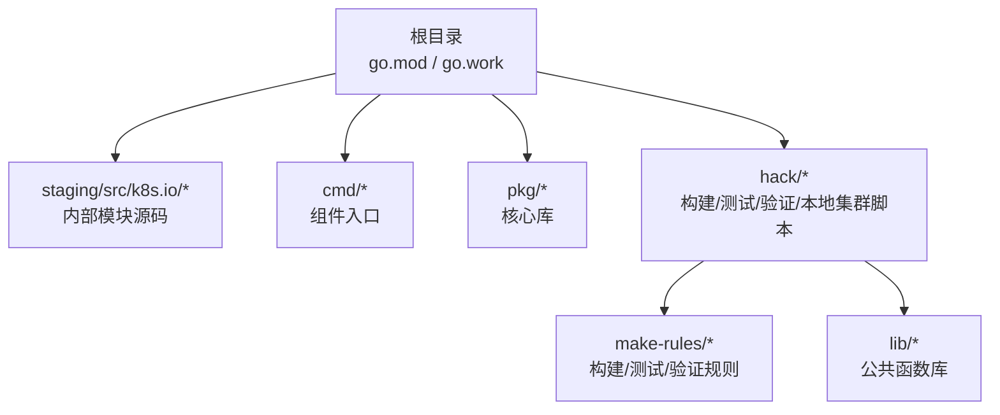
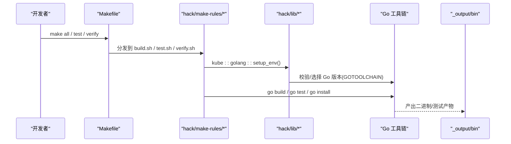
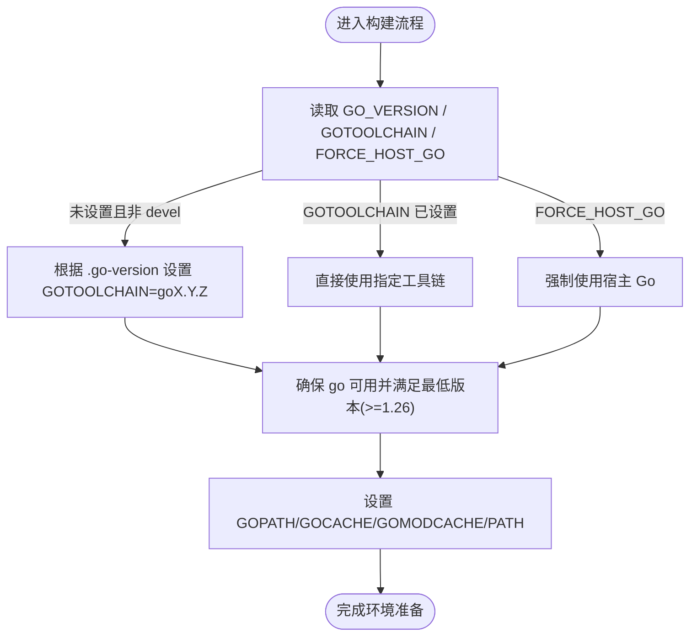
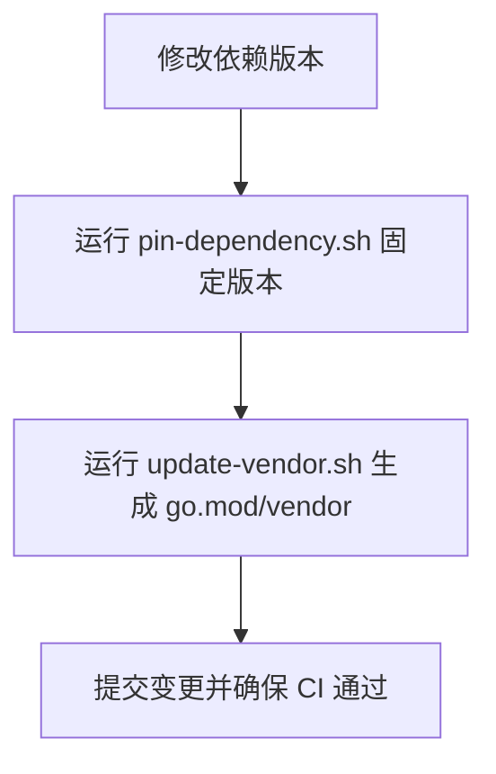
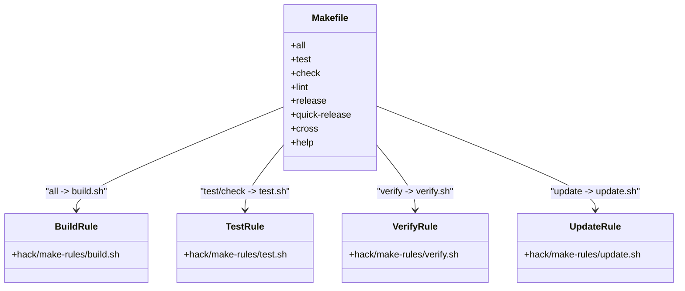
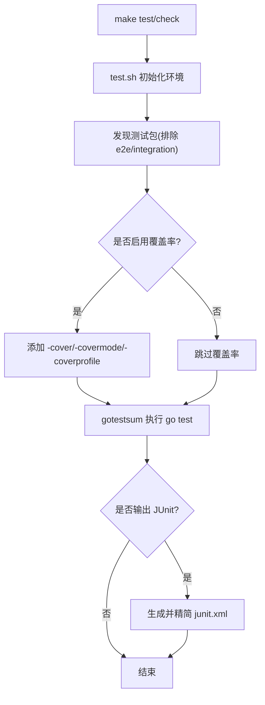
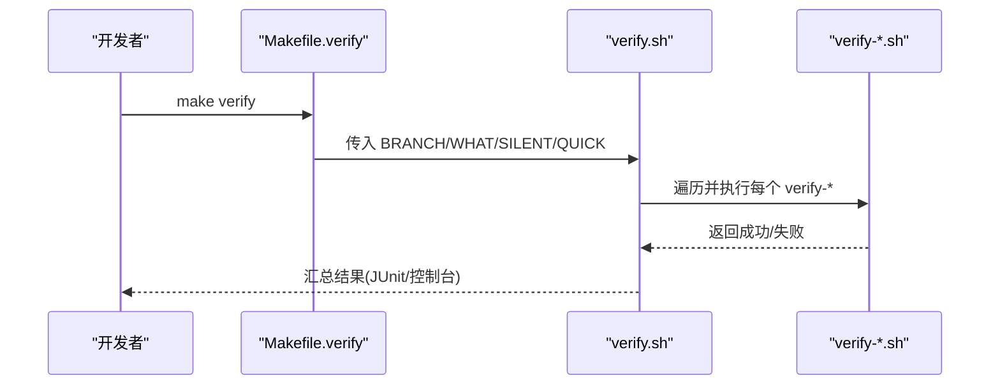
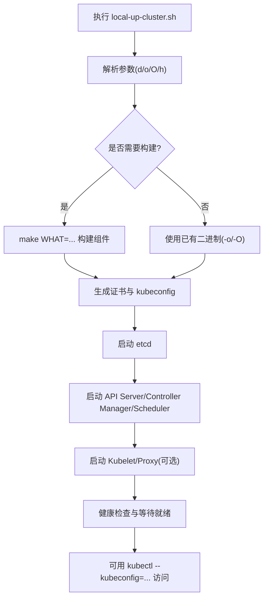
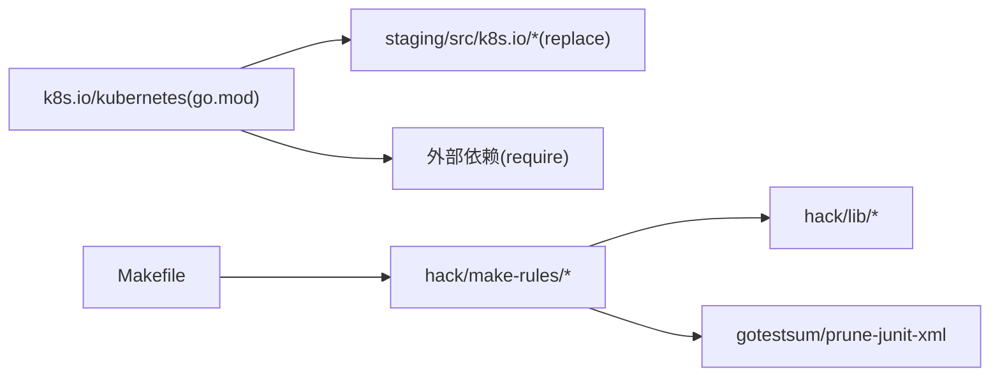

# 开发环境搭建

<cite>
**本文引用的文件**   
- [README.md](file://README.md)
- [go.mod](file://go.mod)
- [Makefile](file://Makefile)
- [hack/README.md](file://hack/README.md)
- [hack/make-rules/build.sh](file://hack/make-rules/build.sh)
- [hack/make-rules/test.sh](file://hack/make-rules/test.sh)
- [hack/make-rules/update.sh](file://hack/make-rules/update.sh)
- [hack/make-rules/verify.sh](file://hack/make-rules/verify.sh)
- [hack/lib/golang.sh](file://hack/lib/golang.sh)
- [hack/local-up-cluster.sh](file://hack/local-up-cluster.sh)
- [hack/update-vendor.sh](file://hack/update-vendor.sh)
- [hack/pin-dependency.sh](file://hack/pin-dependency.sh)
</cite>

## 目录
1. [简介](#简介)
2. [项目结构](#项目结构)
3. [核心组件](#核心组件)
4. [架构总览](#架构总览)
5. [详细组件分析](#详细组件分析)
6. [依赖关系分析](#依赖关系分析)
7. [性能考虑](#性能考虑)
8. [故障排查指南](#故障排查指南)
9. [结论](#结论)
10. [附录](#附录)

## 简介
本指南面向 Kubernetes 开发者，聚焦于本地开发环境的搭建与高效使用。内容涵盖：
- Go 语言环境与版本要求、环境变量配置
- 模块与 vendor 依赖管理、第三方依赖更新流程
- 构建系统（Makefile/hack 脚本）的架构与常用命令
- 本地集群快速启动（基于仓库脚本），以及 minikube/kind 的使用建议
- IDE 配置、代码格式化与静态分析工具集成
- 调试环境搭建（断点、日志、性能分析）

## 项目结构
Kubernetes 仓库采用多模块工作区模式，根目录包含 go.mod/go.work，staging 目录为内部模块源码，cmd 下为各组件入口，hack 提供构建、测试、验证与本地集群脚本。

图表来源
- [go.mod:1-20](file://go.mod#L1-L20)
- [Makefile:1-120](file://Makefile#L1-L120)
- [hack/make-rules/build.sh:1-30](file://hack/make-rules/build.sh#L1-L30)

章节来源
- [README.md:35-59](file://README.md#L35-L59)
- [go.mod:1-20](file://go.mod#L1-L20)
- [Makefile:1-120](file://Makefile#L1-L120)

## 核心组件
- Go 环境与版本
  - 最低版本要求：Go 1.26 或更高；仓库通过 GOTOOLCHAIN 自动拉取指定版本，也可强制使用宿主 Go。
  - 关键变量：GO_VERSION、GOTOOLCHAIN、FORCE_HOST_GO、GOPATH、GOCACHE、GOMODCACHE、PATH。
- 构建与测试
  - Makefile 目标：all、test、check、lint、release、quick-release、cross 等。
  - hack/make-rules 封装了具体实现：build.sh、test.sh、update.sh、verify.sh。
- 依赖管理
  - 根 go.mod 声明模块与 replace 指向 staging 子模块；vendor 目录由脚本维护。
  - 更新流程：pin-dependency.sh + update-vendor.sh。
- 本地集群
  - hack/local-up-cluster.sh 一键拉起 etcd、API Server、Controller Manager、Scheduler、Kubelet、Proxy 等。

章节来源
- [hack/lib/golang.sh:521-629](file://hack/lib/golang.sh#L521-L629)
- [Makefile:64-120](file://Makefile#L64-L120)
- [hack/make-rules/build.sh:1-30](file://hack/make-rules/build.sh#L1-L30)
- [hack/make-rules/test.sh:1-120](file://hack/make-rules/test.sh#L1-L120)
- [hack/make-rules/update.sh:1-68](file://hack/make-rules/update.sh#L1-L68)
- [hack/make-rules/verify.sh:1-120](file://hack/make-rules/verify.sh#L1-L120)
- [go.mod:1-20](file://go.mod#L1-L20)
- [hack/update-vendor.sh](file://hack/update-vendor.sh)
- [hack/pin-dependency.sh](file://hack/pin-dependency.sh)
- [hack/local-up-cluster.sh:1-120](file://hack/local-up-cluster.sh#L1-L120)

## 架构总览
下图展示了从 Makefile 到 hack 脚本再到 Go 工具链与构建产物的调用链路。

图表来源
- [Makefile:90-120](file://Makefile#L90-L120)
- [hack/make-rules/build.sh:17-30](file://hack/make-rules/build.sh#L17-L30)
- [hack/make-rules/test.sh:20-35](file://hack/make-rules/test.sh#L20-L35)
- [hack/lib/golang.sh:594-629](file://hack/lib/golang.sh#L594-L629)

## 详细组件分析

### Go 环境与版本要求
- 版本检查与选择
  - 若未设置 GOTOOLCHAIN，默认按 .go-version 解析 GO_VERSION，并通过 GOTOOLCHAIN=goX.Y.Z 拉取对应版本。
  - 支持 FORCE_HOST_GO 强制使用宿主 Go，或 GO_VERSION=devel 使用 master 分支版本。
- 关键环境变量
  - GOPATH：指向 _output/go，避免污染用户 GOPATH。
  - GOCACHE/GOMODCACHE：缓存目录，提升构建速度。
  - PATH：追加 $GOPATH/bin，确保工具可执行。
  - GOFLAGS：统一传递构建参数（如 -v）。
- 平台与交叉编译
  - 通过 KUBE_SERVER_PLATFORMS/KUBE_NODE_PLATFORMS/KUBE_CLIENT_PLATFORMS/KUBE_TEST_PLATFORMS 控制目标平台。
  - CGO_ENABLED/CC 在交叉编译时按需设置。

图表来源
- [hack/lib/golang.sh:521-584](file://hack/lib/golang.sh#L521-L584)
- [hack/lib/golang.sh:594-629](file://hack/lib/golang.sh#L594-L629)

章节来源
- [hack/lib/golang.sh:521-629](file://hack/lib/golang.sh#L521-L629)

### 依赖管理与 vendor 更新
- 模块与替换
  - 根 go.mod 声明 module k8s.io/kubernetes，并使用大量 replace 将 k8s.io/* 指向 staging/src/k8s.io/*。
  - 外部依赖以 require 列表声明，间接依赖以 indirect 标注。
- vendor 目录
  - 仓库包含 vendor 目录用于锁定依赖快照；更新需遵循官方脚本。
- 更新流程
  - 固定依赖版本：hack/pin-dependency.sh
  - 同步 go.mod 与 vendor：hack/update-vendor.sh
  - 注意：go.mod 顶部注释明确说明“不要直接编辑”，应通过脚本变更。

图表来源
- [go.mod:1-10](file://go.mod#L1-L10)
- [go.mod:225-260](file://go.mod#L225-L260)
- [hack/update-vendor.sh](file://hack/update-vendor.sh)
- [hack/pin-dependency.sh](file://hack/pin-dependency.sh)

章节来源
- [go.mod:1-20](file://go.mod#L1-L20)
- [go.mod:225-260](file://go.mod#L225-L260)
- [hack/update-vendor.sh](file://hack/update-vendor.sh)
- [hack/pin-dependency.sh](file://hack/pin-dependency.sh)

### 构建系统与 Makefile 命令
- 常用目标
  - all：构建所有组件或指定 WHAT 包；支持 DBG=1 关闭优化便于调试。
  - test/check：运行单元测试，支持 KUBE_COVER、KUBE_RACE、PARALLEL 等。
  - lint：运行 golangci-lint。
  - release/quick-release/release-images/quick-release-images/cross：发布与交叉编译。
  - help：打印帮助信息。
- 自定义选项
  - GOFLAGS/GOLDFLAGS/GOGCFLAGS：传递给 go 的参数。
  - KUBE_VERBOSE：构建输出详细程度。
  - BRANCH/WATCH/WHAT/TESTS：控制验证范围与构建目标。
- 底层实现
  - Makefile 仅做路由，实际逻辑在 hack/make-rules/*.sh。

图表来源
- [Makefile:64-120](file://Makefile#L64-L120)
- [Makefile:160-220](file://Makefile#L160-L220)
- [Makefile:330-360](file://Makefile#L330-L360)
- [Makefile:400-440](file://Makefile#L400-L440)
- [Makefile:485-517](file://Makefile#L485-L517)
- [hack/make-rules/build.sh:17-30](file://hack/make-rules/build.sh#L17-L30)
- [hack/make-rules/test.sh:105-120](file://hack/make-rules/test.sh#L105-L120)
- [hack/make-rules/verify.sh:115-150](file://hack/make-rules/verify.sh#L115-L150)
- [hack/make-rules/update.sh:38-68](file://hack/make-rules/update.sh#L38-L68)

章节来源
- [Makefile:64-120](file://Makefile#L64-L120)
- [Makefile:160-220](file://Makefile#L160-L220)
- [Makefile:330-360](file://Makefile#L330-L360)
- [Makefile:400-440](file://Makefile#L400-L440)
- [Makefile:485-517](file://Makefile#L485-L517)
- [hack/make-rules/build.sh:17-30](file://hack/make-rules/build.sh#L17-L30)
- [hack/make-rules/test.sh:105-120](file://hack/make-rules/test.sh#L105-L120)
- [hack/make-rules/verify.sh:115-150](file://hack/make-rules/verify.sh#L115-L150)
- [hack/make-rules/update.sh:38-68](file://hack/make-rules/update.sh#L38-L68)

### 测试与覆盖率
- 测试发现与过滤
  - 自动扫描工作区内含 *_test.go 的包，排除 e2e/integration 等特定目录。
  - 支持 PARALLEL 并行度、KUBE_TIMEOUT 超时、KUBE_RACE 并发检测。
- 覆盖率与报告
  - KUBE_COVER=y 开启覆盖率收集，输出 HTML 报告。
  - 支持 JUnit 输出与精简（prune-junit-xml）。
- gotestsum 集成
  - 自动安装 gotestsum 与 prune-junit-xml，统一输出格式。

图表来源
- [hack/make-rules/test.sh:35-71](file://hack/make-rules/test.sh#L35-L71)
- [hack/make-rules/test.sh:250-345](file://hack/make-rules/test.sh#L250-L345)

章节来源
- [hack/make-rules/test.sh:35-71](file://hack/make-rules/test.sh#L35-L71)
- [hack/make-rules/test.sh:250-345](file://hack/make-rules/test.sh#L250-L345)

### 验证与质量门禁
- verify-all 等价于 make verify，推荐在 PR 前运行。
- verify.sh 聚合多个 verify-* 脚本，支持 QUICK=true 快速模式与 WHAT 指定检查项。
- 常见检查：gofmt、imports、boilerplate、spelling、typecheck、vendor 一致性等。

图表来源
- [hack/README.md:1-25](file://hack/README.md#L1-L25)
- [Makefile:115-152](file://Makefile#L115-L152)
- [hack/make-rules/verify.sh:165-205](file://hack/make-rules/verify.sh#L165-L205)

章节来源
- [hack/README.md:1-25](file://hack/README.md#L1-L25)
- [Makefile:115-152](file://Makefile#L115-L152)
- [hack/make-rules/verify.sh:165-205](file://hack/make-rules/verify.sh#L165-L205)

### 本地集群搭建（local-up-cluster）
- 功能概览
  - 自动构建必要组件（kube-apiserver、controller-manager、scheduler、kube-proxy、kubelet 等）。
  - 启动 etcd、生成证书与 kubeconfig、拉起各组件进程。
  - 支持 dry-run、端口/网络/CNI/DNS/特性开关等丰富环境变量。
- 典型用法
  - 首次运行：./hack/local-up-cluster.sh
  - 使用已有构建产物：-o 指定 _output 路径，或 -O 自动探测。
  - 仅控制面（Mac 默认）：START_MODE=nokubelet,nokubeproxy。
- 清理与排障
  - 退出时自动清理进程与临时数据；可通过 LOG_DIR 查看日志。

图表来源
- [hack/local-up-cluster.sh:214-280](file://hack/local-up-cluster.sh#L214-L280)
- [hack/local-up-cluster.sh:570-768](file://hack/local-up-cluster.sh#L570-L768)

章节来源
- [hack/local-up-cluster.sh:214-280](file://hack/local-up-cluster.sh#L214-L280)
- [hack/local-up-cluster.sh:570-768](file://hack/local-up-cluster.sh#L570-L768)

### 本地集群搭建（minikube/kind）建议
- minikube
  - 适合快速体验与简单开发；可使用 --driver=docker 或 containerd。
  - 通过 kubectl config use-context 切换至 minikube 上下文。
- kind
  - 适合镜像构建与节点级测试；支持多节点集群与自定义镜像导入。
  - 结合本地构建产物，可将 _output 中的二进制打包为镜像并加载到 kind 集群。
- 与 local-up-cluster 的关系
  - local-up-cluster 更贴近源码调试；minikube/kind 更适合容器化开发与镜像验证。

[本节为概念性说明，不直接分析具体文件]

### IDE 配置建议
- Go 工作区
  - 使用 go.work 与工作区模式，IDE 应识别根 go.work 与 staging 子模块。
- 插件与工具
  - 启用 gopls、dlv（Delve）、golangci-lint、goimports/gofmt。
- 调试
  - 使用 DBG=1 构建未剥离符号的二进制，配合 Delve 进行断点调试。
  - 对 API Server/Controller Manager/Scheduler 等组件分别设置 launch 配置。

[本节为通用建议，不直接分析具体文件]

### 代码格式化与静态分析
- 格式化
  - gofmt/gofmt 规则由 update-gofmt 维护；提交前运行 make verify 或手动 update。
- 静态分析
  - golangci-lint 配置位于 hack/golangci.yaml；通过 make lint 或 verify-golangci-lint.sh 运行。
- 提交前检查
  - 推荐顺序：make verify → make update（修复自动生成与格式问题）→ 提交。

章节来源
- [hack/make-rules/update.sh:38-68](file://hack/make-rules/update.sh#L38-L68)
- [Makefile:330-360](file://Makefile#L330-L360)
- [hack/make-rules/verify.sh:80-98](file://hack/make-rules/verify.sh#L80-L98)

### 调试环境搭建
- 断点调试
  - 使用 DBG=1 构建，使二进制保留调试信息；通过 Delve 附加进程或启动调试。
  - 针对 API Server 等长驻进程，可在启动后 attach 到 PID。
- 日志配置
  - 通过 --v/--vmodule 调整日志级别与模块；local-up-cluster 支持 LOG_LEVEL/LOG_SPEC/LOG_DIR。
- 性能分析
  - 使用 pprof 采集 CPU/Mem/Block/Trace；结合 grab-profiles.sh 获取运行时指标。
  - 在测试中启用 -race 检测数据竞争。

章节来源
- [Makefile:76-90](file://Makefile#L76-L90)
- [hack/local-up-cluster.sh:315-340](file://hack/local-up-cluster.sh#L315-L340)
- [hack/make-rules/test.sh:196-202](file://hack/make-rules/test.sh#L196-L202)

## 依赖关系分析
- 模块耦合
  - 根模块通过 replace 指向 staging 子模块，形成强内聚的内部依赖。
  - 外部依赖集中在 go.mod require 列表，间接依赖较多但受 go.sum 锁定。
- 构建与脚本依赖
  - Makefile 仅作为入口，真正逻辑下沉到 hack/make-rules 与 hack/lib。
  - 测试与验证脚本依赖 gotestsum、prune-junit-xml 等工具，自动安装。

图表来源
- [go.mod:225-260](file://go.mod#L225-L260)
- [Makefile:90-120](file://Makefile#L90-L120)
- [hack/make-rules/test.sh:213-223](file://hack/make-rules/test.sh#L213-L223)

章节来源
- [go.mod:225-260](file://go.mod#L225-L260)
- [Makefile:90-120](file://Makefile#L90-L120)
- [hack/make-rules/test.sh:213-223](file://hack/make-rules/test.sh#L213-L223)

## 性能考虑
- 构建加速
  - 合理设置 GOCACHE/GOMODCACHE 路径，避免写入慢盘。
  - 使用 KUBE_FASTBUILD=true 减少交叉编译目标，加快本地构建。
- 测试加速
  - 使用 PARALLEL 提高并行度；必要时缩短 KUBE_TIMEOUT。
  - 选择性运行 WHAT 指定目录，缩小测试范围。
- 资源限制
  - 注意 ulimit -n 文件描述符限制，避免测试因 socket 不足而失败。

[本节为通用建议，不直接分析具体文件]

## 故障排查指南
- Go 版本不匹配
  - 现象：提示需要 Go 1.26+；解决：允许 GOTOOLCHAIN 自动下载或设置 FORCE_HOST_GO。
- 依赖不一致
  - 现象：vendor 与 go.mod 不一致；解决：运行 update-vendor.sh 重新生成。
- 构建失败
  - 现象：交叉编译缺少 CC；解决：设置 KUBE_LINUX_*_CC 或使用宿主机工具链。
- 测试失败
  - 现象：并发检测失败；解决：检查 -race 输出，定位竞态条件。
- 本地集群无法启动
  - 现象：端口占用或权限不足；解决：释放端口或以 sudo 运行，检查 CERT_DIR 权限。

章节来源
- [hack/lib/golang.sh:572-584](file://hack/lib/golang.sh#L572-L584)
- [hack/make-rules/test.sh:357-365](file://hack/make-rules/test.sh#L357-L365)
- [hack/local-up-cluster.sh:340-360](file://hack/local-up-cluster.sh#L340-L360)

## 结论
通过本指南，你可以：
- 正确配置 Go 环境与版本，利用 GOTOOLCHAIN 简化依赖
- 使用 Makefile 与 hack 脚本高效构建、测试与验证
- 规范地管理依赖与 vendor 目录
- 快速拉起本地集群进行开发与调试
- 结合 IDE 与静态分析工具提升代码质量
- 使用调试与性能分析工具定位问题

[本节为总结，不直接分析具体文件]

## 附录
- 常用命令速查
  - 构建：make all / make WHAT=./pkg/...
  - 测试：make test / make check WHAT=./pkg/...
  - 验证：make verify / make quick-verify
  - 更新：make update
  - 发布：make release / make quick-release
  - 交叉编译：make cross
- 参考文档
  - README 中的快速开始链接到社区开发者文档

章节来源
- [README.md:35-59](file://README.md#L35-L59)
- [Makefile:64-120](file://Makefile#L64-L120)
- [Makefile:160-220](file://Makefile#L160-L220)
- [Makefile:330-360](file://Makefile#L330-L360)
- [Makefile:400-440](file://Makefile#L400-L440)
- [Makefile:485-517](file://Makefile#L485-L517)