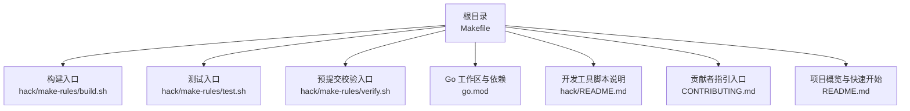
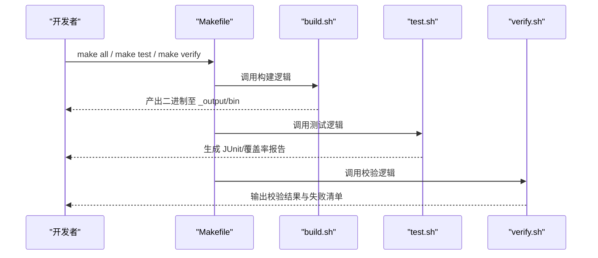
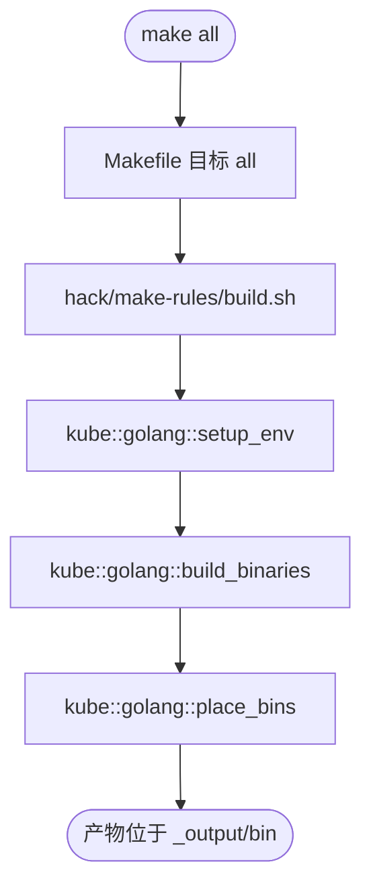
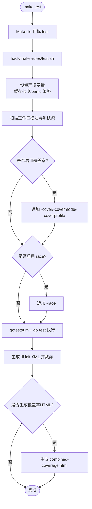
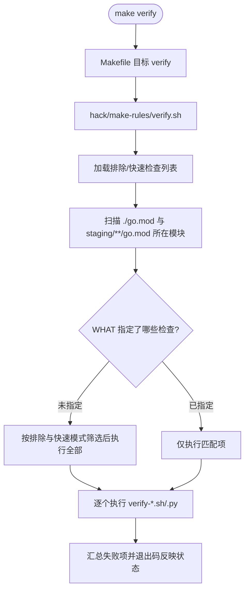
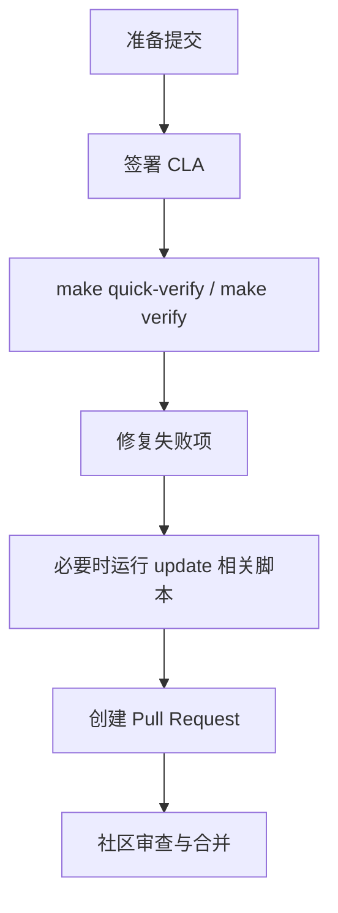
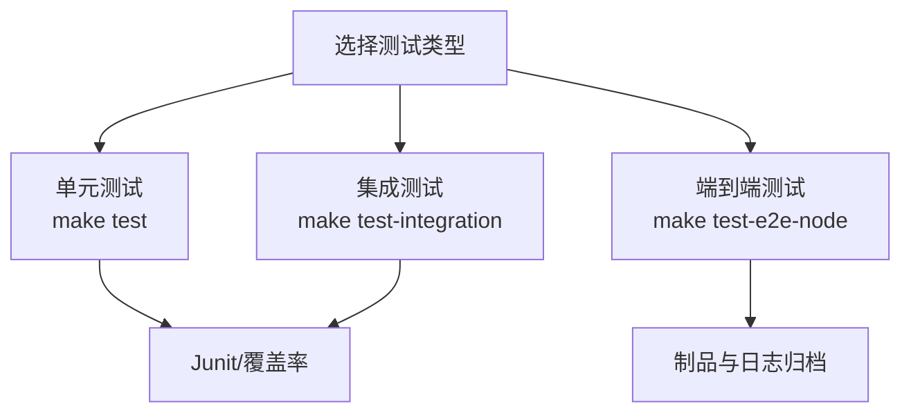
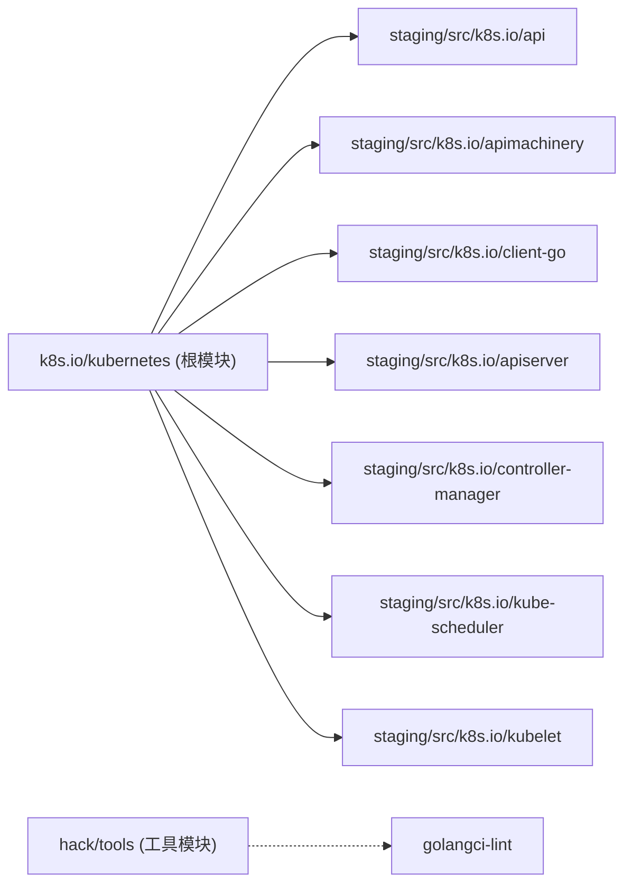

# 开发者指南

<cite>
**本文引用的文件**   
- [README.md](file://README.md)
- [CONTRIBUTING.md](file://CONTRIBUTING.md)
- [Makefile](file://Makefile)
- [go.mod](file://go.mod)
- [hack/README.md](file://hack/README.md)
- [hack/make-rules/build.sh](file://hack/make-rules/build.sh)
- [hack/make-rules/test.sh](file://hack/make-rules/test.sh)
- [hack/make-rules/verify.sh](file://hack/make-rules/verify.sh)
</cite>

## 目录
1. [简介](#简介)
2. [项目结构](#项目结构)
3. [核心组件](#核心组件)
4. [架构总览](#架构总览)
5. [详细组件分析](#详细组件分析)
6. [依赖分析](#依赖分析)
7. [性能考虑](#性能考虑)
8. [故障排查指南](#故障排查指南)
9. [结论](#结论)
10. [附录](#附录)

## 简介
本指南面向 Kubernetes 贡献者与开发者，聚焦于本地开发环境搭建、构建与测试流程、代码贡献规范、性能基准与调试方法、重构与安全审计最佳实践，以及文档编写与发布流程。内容基于仓库内现有脚本与配置进行说明，帮助读者快速上手并高效参与贡献。

## 项目结构
Kubernetes 采用多模块工作区（Go workspace）组织，根目录包含主模块与大量 staging 子模块；构建、验证、测试等工程化能力集中在 hack 与 Makefile 中。

**图示来源**
- [Makefile:1-517](file://Makefile#L1-L517)
- [hack/make-rules/build.sh:1-30](file://hack/make-rules/build.sh#L1-L30)
- [hack/make-rules/test.sh:1-374](file://hack/make-rules/test.sh#L1-L374)
- [hack/make-rules/verify.sh:1-254](file://hack/make-rules/verify.sh#L1-L254)
- [go.mod:1-260](file://go.mod#L1-L260)
- [hack/README.md:1-25](file://hack/README.md#L1-L25)
- [CONTRIBUTING.md:1-10](file://CONTRIBUTING.md#L1-L10)
- [README.md:1-101](file://README.md#L1-L101)

**章节来源**
- [Makefile:1-517](file://Makefile#L1-L517)
- [hack/README.md:1-25](file://hack/README.md#L1-L25)
- [go.mod:1-260](file://go.mod#L1-L260)

## 核心组件
- 构建系统：通过 Makefile 暴露常用目标（all、test、verify、release、cross 等），底层由 hack/make-rules/*.sh 实现。
- 依赖管理：使用 Go modules + workspace，根 go.mod 声明版本并通过 replace 指向 staging 源码。
- 测试框架：单元测试通过 test.sh 驱动，支持覆盖率、竞态检测、JUnit 报告输出；集成与端到端测试通过独立目标与脚本执行。
- 预提交校验：verify.sh 统一编排 verify-* 检查项，支持快速模式与选择性运行。
- 开发辅助：hack/README.md 提供关键脚本说明与注意事项。

**章节来源**
- [Makefile:1-517](file://Makefile#L1-L517)
- [hack/make-rules/build.sh:1-30](file://hack/make-rules/build.sh#L1-L30)
- [hack/make-rules/test.sh:1-374](file://hack/make-rules/test.sh#L1-L374)
- [hack/make-rules/verify.sh:1-254](file://hack/make-rules/verify.sh#L1-L254)
- [hack/README.md:1-25](file://hack/README.md#L1-L25)

## 架构总览
下图展示了从 Makefile 到具体脚本的调用关系，以及各脚本的职责边界。

**图示来源**
- [Makefile:1-517](file://Makefile#L1-L517)
- [hack/make-rules/build.sh:1-30](file://hack/make-rules/build.sh#L1-L30)
- [hack/make-rules/test.sh:1-374](file://hack/make-rules/test.sh#L1-L374)
- [hack/make-rules/verify.sh:1-254](file://hack/make-rules/verify.sh#L1-L254)

## 详细组件分析

### 构建子系统
- 入口：Makefile 的 all/ginkgo/cmd/* 目标最终委托给 build.sh。
- 职责：初始化 Go 环境、编译二进制、放置产物到 _output/bin。
- 可选项：DBG=1 关闭优化便于调试；GOFLAGS/GOLDFLAGS/GOGCFLAGS 透传给 go 命令。

**图示来源**
- [Makefile:67-98](file://Makefile#L67-L98)
- [hack/make-rules/build.sh:17-30](file://hack/make-rules/build.sh#L17-L30)

**章节来源**
- [Makefile:67-98](file://Makefile#L67-L98)
- [hack/make-rules/build.sh:17-30](file://hack/make-rules/build.sh#L17-L30)

### 测试子系统
- 入口：Makefile 的 check/test 目标委托给 test.sh。
- 特性：
  - 默认启用缓存变更检测与 watch decode 错误 panic，有助于发现潜在问题。
  - 支持并行度控制、race detector、覆盖率收集与 HTML 报告。
  - 自动安装 gotestsum 与 prune-junit-xml，并输出 JUnit XML。
  - 过滤第三方与 e2e 包，仅运行单元/集成测试集。
- 参数：
  - WHAT/TESTS：指定测试包路径。
  - KUBE_COVER/KUBE_COVERMODE/KUBE_COVER_REPORT_DIR：覆盖率开关与输出目录。
  - KUBE_RACE：是否开启竞态检测。
  - KUBE_TIMEOUT：单包超时。
  - PARALLEL：并行度。
  - KUBE_TEST_ARGS：透传给 go test 的参数。

**图示来源**
- [Makefile:169-193](file://Makefile#L169-L193)
- [hack/make-rules/test.sh:27-33](file://hack/make-rules/test.sh#L27-L33)
- [hack/make-rules/test.sh:35-71](file://hack/make-rules/test.sh#L35-L71)
- [hack/make-rules/test.sh:250-345](file://hack/make-rules/test.sh#L250-L345)

**章节来源**
- [Makefile:169-193](file://Makefile#L169-L193)
- [hack/make-rules/test.sh:27-33](file://hack/make-rules/test.sh#L27-L33)
- [hack/make-rules/test.sh:35-71](file://hack/make-rules/test.sh#L35-L71)
- [hack/make-rules/test.sh:250-345](file://hack/make-rules/test.sh#L250-L345)

### 预提交校验子系统
- 入口：Makefile 的 verify/quick-verify 目标委托给 verify.sh。
- 特性：
  - 支持排除规则与快速模式（QUICK=true）。
  - 遍历各模块下的 hack/verify-*.sh 与 .py 脚本执行。
  - 将失败项汇总打印，便于定位。
- 参数：
  - WHAT：指定要运行的校验名称（如 gofmt、typecheck）。
  - QUICK：仅运行快速检查。
  - SILENT：静默模式。

**图示来源**
- [Makefile:115-152](file://Makefile#L115-L152)
- [hack/make-rules/verify.sh:37-98](file://hack/make-rules/verify.sh#L37-L98)
- [hack/make-rules/verify.sh:235-254](file://hack/make-rules/verify.sh#L235-L254)

**章节来源**
- [Makefile:115-152](file://Makefile#L115-L152)
- [hack/make-rules/verify.sh:37-98](file://hack/make-rules/verify.sh#L37-L98)
- [hack/make-rules/verify.sh:235-254](file://hack/make-rules/verify.sh#L235-L254)

### 代码贡献流程
- 签署 CLA：贡献前需签署贡献者许可协议。
- 提交前建议：先运行校验，再按需更新生成文件。
- 社区资源：贡献者指南、社区治理与沟通渠道在 README 与 CONTRIBUTING 中给出链接。

**图示来源**
- [CONTRIBUTING.md:1-10](file://CONTRIBUTING.md#L1-L10)
- [hack/README.md:19-25](file://hack/README.md#L19-L25)
- [Makefile:115-152](file://Makefile#L115-L152)

**章节来源**
- [CONTRIBUTING.md:1-10](file://CONTRIBUTING.md#L1-L10)
- [hack/README.md:19-25](file://hack/README.md#L19-L25)
- [Makefile:115-152](file://Makefile#L115-L152)

### 测试策略与实践
- 单元测试：
  - 使用 make test 或 make check，支持 WHAT/TESTS 指定范围。
  - 推荐开启 KUBE_RACE 与 KUBE_COVER，结合 JUnit 报告定位问题。
- 集成测试：
  - 使用 make test-integration，可通过 KUBE_TEST_ARGS 传递 go test 参数。
- 端到端测试：
  - 节点级 e2e：make test-e2e-node，支持远程执行、日志采集与并行度控制。
  - 其他 e2e 套件参考 hack 与 test 目录下对应脚本。

**图示来源**
- [Makefile:169-216](file://Makefile#L169-L216)
- [Makefile:218-293](file://Makefile#L218-L293)
- [hack/make-rules/test.sh:250-345](file://hack/make-rules/test.sh#L250-L345)

**章节来源**
- [Makefile:169-216](file://Makefile#L169-L216)
- [Makefile:218-293](file://Makefile#L218-L293)
- [hack/make-rules/test.sh:250-345](file://hack/make-rules/test.sh#L250-L345)

### 性能基准与结果分析
- 基准脚本：仓库提供 benchmark-go.sh 用于运行 Go 基准测试。
- 结果分析：
  - 关注 p50/p90/p99 延迟与吞吐变化。
  - 对比不同分支或配置的基线差异，结合 CPU/内存 profile 定位热点。
  - 在 CI 中持久化基准结果以便回归分析。

**章节来源**
- [hack/benchmark-go.sh](file://hack/benchmark-go.sh)

### 调试技巧与工具
- 构建期调试：
  - DBG=1 关闭优化，便于使用 delve 等调试器。
- 运行时调试：
  - 针对 e2e_node 测试可使用 E2E_TEST_DEBUG_TOOL 指定 dlv/delve/gdb。
- 日志与指标：
  - 利用 JUnit 输出与 artifacts 目录收集日志与中间产物。
  - 结合 Prometheus 抓取 etcd 等组件指标进行分析。

**章节来源**
- [Makefile:67-98](file://Makefile#L67-L98)
- [Makefile:218-293](file://Makefile#L218-L293)

### 代码重构、性能优化与安全审计最佳实践
- 重构：
  - 小步提交，保持单一职责；优先补充/完善单元测试。
  - 使用 verify-all 确保风格与一致性。
- 性能优化：
  - 以基准测试为据，避免过早优化；对热点路径进行 profiling。
  - 谨慎引入新依赖，评估间接依赖影响。
- 安全审计：
  - 定期运行依赖与许可证校验脚本，关注 CVE 与合规风险。
  - 遵循最小权限原则与输入校验规范。

[本节为通用指导，不直接分析具体文件]

### 文档编写与发布流程
- 文档生成：
  - 使用 genkubedocs、genman、gendocs 等工具生成 API/CLI 文档。
  - 通过 update-generated-docs.sh 等脚本更新生成内容。
- 发布：
  - release/release-images/package-tarballs/cross 等目标负责产物构建与打包。
  - 容器化构建可使用 release-in-a-container 与 cross-in-a-container。

**章节来源**
- [Makefile:345-483](file://Makefile#L345-L483)
- [hack/update-generated-docs.sh](file://hack/update-generated-docs.sh)

## 依赖分析
- 工作区与替换：
  - 根 go.mod 声明 go 版本与外部依赖，并通过 replace 将 k8s.io/* 指向 staging/src/k8s.io/* 源码，实现本地开发与跨模块引用。
- 模块化：
  - staging 下包含 api、apimachinery、client-go、apiserver、controller-manager、scheduler、kubelet 等核心模块，均具备独立 go.mod。
- 工具链：
  - hack/tools 下维护 golangci-lint、instrumentation 等工具的 go.mod，隔离工具依赖。

**图示来源**
- [go.mod:225-259](file://go.mod#L225-L259)

**章节来源**
- [go.mod:1-260](file://go.mod#L1-L260)

## 性能考虑
- 构建性能：
  - 合理设置 GOFLAGS 与并行度；仅在需要时启用 DBG=1。
- 测试性能：
  - 使用 PARALLEL 提升并行度；按需缩小 WHAT 范围。
  - 在 CI 中缓存依赖与工具，减少重复下载。
- 基准与回归：
  - 建立稳定的基准基线，定期回归；对异常波动进行根因分析。

[本节为通用指导，不直接分析具体文件]

## 故障排查指南
- 常见问题：
  - 依赖不一致：运行 update-vendor 或 pin-dependency 脚本同步依赖。
  - 校验失败：根据 verify 输出的失败清单逐项修复。
  - 测试不稳定：结合 JUnit 与 artifacts 定位失败用例与环境因素。
- 实用命令：
  - make quick-verify：快速检查。
  - make verify WHAT="gofmt typecheck"：定向校验。
  - make test WHAT=./pkg/...：限定范围测试。

**章节来源**
- [hack/make-rules/verify.sh:154-205](file://hack/make-rules/verify.sh#L154-L205)
- [hack/README.md:19-25](file://hack/README.md#L19-L25)

## 结论
通过 Makefile 与 hack 脚本体系，Kubernetes 提供了完善的构建、测试与校验流水线。配合 Go workspace 与 staging 模块，开发者可在本地高效迭代。建议在日常贡献中遵循“先校验、后提交”的流程，并以基准与测试数据驱动质量保障。

## 附录
- 快速开始：
  - 参考 README 中的克隆与构建步骤。
- 贡献者入口：
  - 参见 CONTRIBUTING 与社区仓库链接。

**章节来源**
- [README.md:35-59](file://README.md#L35-L59)
- [CONTRIBUTING.md:1-10](file://CONTRIBUTING.md#L1-L10)