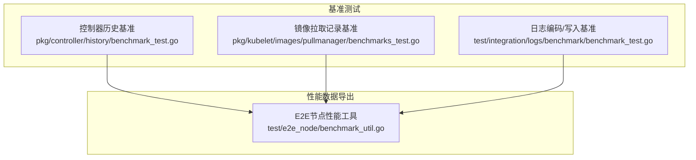
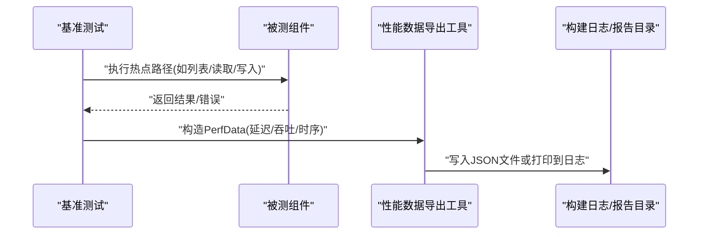
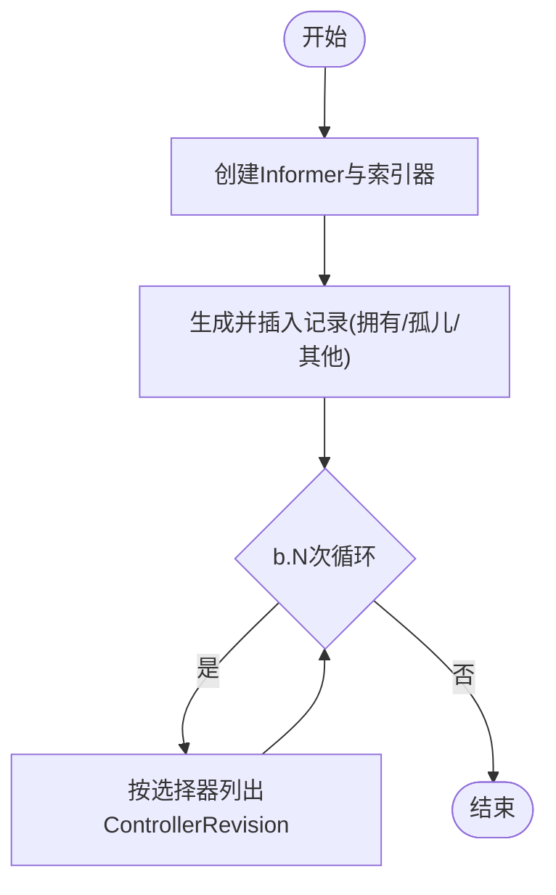
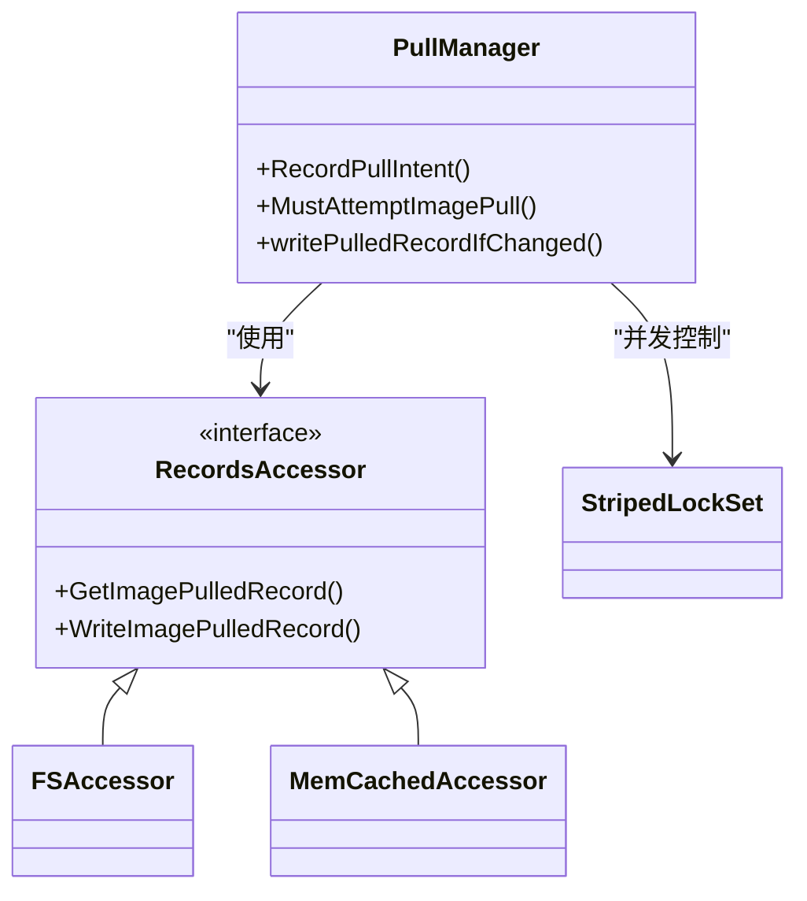
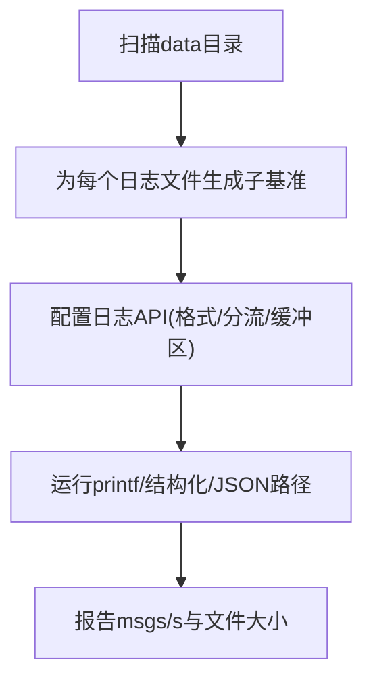
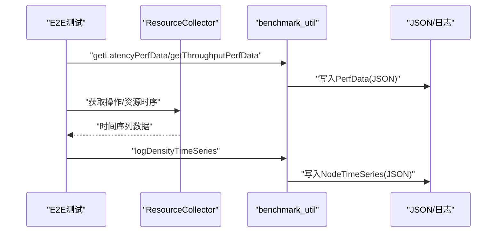
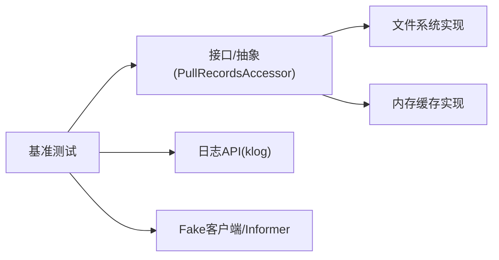

# 性能优化与基准测试

<cite>
**本文引用的文件**   
- [pkg/controller/history/benchmark_test.go](file://pkg/controller/history/benchmark_test.go)
- [pkg/kubelet/images/pullmanager/benchmarks_test.go](file://pkg/kubelet/images/pullmanager/benchmarks_test.go)
- [test/e2e_node/benchmark_util.go](file://test/e2e_node/benchmark_util.go)
- [test/integration/logs/benchmark/benchmark_test.go](file://test/integration/logs/benchmark/benchmark_test.go)
</cite>

## 目录
1. [引言](#引言)
2. [项目结构](#项目结构)
3. [核心组件](#核心组件)
4. [架构总览](#架构总览)
5. [详细组件分析](#详细组件分析)
6. [依赖分析](#依赖分析)
7. [性能考虑](#性能考虑)
8. [故障排查指南](#故障排查指南)
9. [结论](#结论)
10. [附录](#附录)

## 引言
本指南面向Kubernetes开发者，聚焦于性能分析方法论、基准测试框架使用、指标采集与监控、性能调优实践、回归检测方案以及分布式系统性能的特殊考量。文档基于仓库中已有的基准测试与工具代码进行系统化梳理，帮助读者快速建立从“定位瓶颈—设计基准—度量指标—持续回归”的完整闭环。

## 项目结构
围绕性能与基准测试，仓库中与本主题直接相关的代码主要分布在以下位置：
- 控制器历史对象列表基准：用于评估大规模ControllerRevision下的查询性能
- Kubelet镜像拉取记录访问器基准：对比文件系统与内存缓存在不同并发与命中率场景下的表现
- E2E节点性能数据导出工具：将延迟、吞吐与时序数据以结构化JSON输出
- 日志编码与写入基准：覆盖文本/JSON格式、单流/分流、丢弃/落盘等组合场景

图表来源
- [pkg/controller/history/benchmark_test.go:34-157](file://pkg/controller/history/benchmark_test.go#L34-L157)
- [pkg/kubelet/images/pullmanager/benchmarks_test.go:45-207](file://pkg/kubelet/images/pullmanager/benchmarks_test.go#L45-L207)
- [test/integration/logs/benchmark/benchmark_test.go:41-174](file://test/integration/logs/benchmark/benchmark_test.go#L41-L174)
- [test/e2e_node/benchmark_util.go:46-92](file://test/e2e_node/benchmark_util.go#L46-L92)

章节来源
- [pkg/controller/history/benchmark_test.go:34-157](file://pkg/controller/history/benchmark_test.go#L34-L157)
- [pkg/kubelet/images/pullmanager/benchmarks_test.go:45-207](file://pkg/kubelet/images/pullmanager/benchmarks_test.go#L45-L207)
- [test/integration/logs/benchmark/benchmark_test.go:41-174](file://test/integration/logs/benchmark/benchmark_test.go#L41-L174)
- [test/e2e_node/benchmark_util.go:46-92](file://test/e2e_node/benchmark_util.go#L46-L92)

## 核心组件
- 控制器历史基准（ListControllerRevisions）
  - 目标：评估在大量ControllerRevision下按标签选择器查询的性能
  - 关键变量：总记录数、被拥有比例、孤儿比例
  - 典型场景：不同拥有/孤儿比例对索引查询的影响
- 镜像拉取记录访问器基准（PullRecordsAccessor）
  - 目标：对比文件系统与内存缓存在不同并发度、缓存命中/未命中、缓存大小与总量比率下的读写性能
  - 关键维度：并发倍数、缓存命中率、缓存容量、是否权威模式
- 日志编码与写入基准
  - 目标：比较printf/结构化/JSON三种输出方式，以及单流/分流、丢弃/落盘的差异
  - 关键指标：消息吞吐（msgs/s）、文件大小与I/O速率
- E2E节点性能数据导出
  - 目标：将延迟分位、吞吐与时序数据以JSON形式持久化或打印到构建日志
  - 关键能力：时间序列聚合、资源与操作两类时序、节点信息标注

章节来源
- [pkg/controller/history/benchmark_test.go:34-157](file://pkg/controller/history/benchmark_test.go#L34-L157)
- [pkg/kubelet/images/pullmanager/benchmarks_test.go:45-207](file://pkg/kubelet/images/pullmanager/benchmarks_test.go#L45-L207)
- [test/integration/logs/benchmark/benchmark_test.go:41-174](file://test/integration/logs/benchmark/benchmark_test.go#L41-L174)
- [test/e2e_node/benchmark_util.go:112-153](file://test/e2e_node/benchmark_util.go#L112-L153)

## 架构总览
下图展示了基准测试与性能数据导出的整体交互关系：各基准用例驱动被测组件执行热点路径，并通过标准Go benchmark机制收集耗时与分配；同时，E2E节点工具负责将延迟、吞吐与时序结果以统一格式输出，便于后续分析与回归判定。

图表来源
- [test/e2e_node/benchmark_util.go:46-92](file://test/e2e_node/benchmark_util.go#L46-L92)
- [test/e2e_node/benchmark_util.go:112-153](file://test/e2e_node/benchmark_util.go#L112-L153)

## 详细组件分析

### 控制器历史基准（ListControllerRevisions）
- 设计要点
  - 通过构造不同“拥有/孤儿”比例的ControllerRevision集合，评估索引查询在不同分布下的性能
  - 使用Fake客户端与共享Informer索引，模拟真实控制器场景
- 关键流程
  - 初始化Informer并添加索引器
  - 批量插入记录（包含被拥有、孤儿、其他控制器拥有三类）
  - 针对同一父对象与选择器重复调用列表接口，统计耗时
- 复杂度与关注点
  - 时间复杂度受索引结构与过滤条件影响；空间复杂度随记录规模线性增长
  - 关注点：索引构建成本、选择器匹配开销、对象序列化/反序列化

图表来源
- [pkg/controller/history/benchmark_test.go:34-157](file://pkg/controller/history/benchmark_test.go#L34-L157)

章节来源
- [pkg/controller/history/benchmark_test.go:34-157](file://pkg/controller/history/benchmark_test.go#L34-L157)

### 镜像拉取记录访问器基准（PullRecordsAccessor）
- 设计要点
  - 对比两种后端：文件系统访问器与内存缓存访问器
  - 多维度参数：并发倍数、缓存命中率、缓存容量、是否权威模式
- 关键流程
  - 准备记录集与请求集（命中/未命中）
  - 初始化PullManager与意图/已拉取锁集合
  - 单线程与并行两种模式执行读/写路径，报告分配与耗时
- 复杂度与关注点
  - 读路径：缓存命中时接近O(1)，未命中可能触发磁盘或额外计算
  - 写路径：并发写入需考虑锁粒度与持久化成本
  - 关注点：StripedLockSet的并发控制、缓存淘汰策略、权威模式一致性

图表来源
- [pkg/kubelet/images/pullmanager/benchmarks_test.go:45-207](file://pkg/kubelet/images/pullmanager/benchmarks_test.go#L45-L207)
- [pkg/kubelet/images/pullmanager/benchmarks_test.go:241-266](file://pkg/kubelet/images/pullmanager/benchmarks_test.go#L241-L266)

章节来源
- [pkg/kubelet/images/pullmanager/benchmarks_test.go:45-207](file://pkg/kubelet/images/pullmanager/benchmarks_test.go#L45-L207)
- [pkg/kubelet/images/pullmanager/benchmarks_test.go:241-266](file://pkg/kubelet/images/pullmanager/benchmarks_test.go#L241-L266)

### 日志编码与写入基准
- 设计要点
  - 覆盖多种输出格式（text/json）、输出流（单流/分流）、目标（丢弃/临时文件）
  - 通过klog配置与特性门控，贴近生产环境行为
- 关键流程
  - 加载日志样例数据，按目录级别设置v阈值
  - 分别运行printf/结构化/JSON三种打印路径
  - 报告msgs/s与文件大小/速率
- 复杂度与关注点
  - JSON编码与字段填充通常比文本更昂贵
  - 分流会增加缓冲与同步开销，但可降低竞争
  - 关注点：缓冲区大小、I/O合并、flush策略

图表来源
- [test/integration/logs/benchmark/benchmark_test.go:41-174](file://test/integration/logs/benchmark/benchmark_test.go#L41-L174)
- [test/integration/logs/benchmark/benchmark_test.go:194-301](file://test/integration/logs/benchmark/benchmark_test.go#L194-L301)

章节来源
- [test/integration/logs/benchmark/benchmark_test.go:41-174](file://test/integration/logs/benchmark/benchmark_test.go#L41-L174)
- [test/integration/logs/benchmark/benchmark_test.go:194-301](file://test/integration/logs/benchmark/benchmark_test.go#L194-L301)

### E2E节点性能数据导出工具
- 设计要点
  - 将延迟分位（P50/P90/P99/P100）与吞吐（pods/min）封装为统一PerfData
  - 支持将时间序列（操作时序与资源时序）写入独立JSON文件或打印到构建日志
- 关键流程
  - 收集节点信息与测试元数据
  - 组装延迟/吞吐数据项，附加标签
  - 根据ReportDir决定输出位置
- 复杂度与关注点
  - 时间序列排序与聚合开销
  - 大体积JSON输出的I/O压力
  - 关注点：标签一致性、版本兼容、输出稳定性

图表来源
- [test/e2e_node/benchmark_util.go:112-153](file://test/e2e_node/benchmark_util.go#L112-L153)
- [test/e2e_node/benchmark_util.go:74-92](file://test/e2e_node/benchmark_util.go#L74-L92)

章节来源
- [test/e2e_node/benchmark_util.go:112-153](file://test/e2e_node/benchmark_util.go#L112-L153)
- [test/e2e_node/benchmark_util.go:74-92](file://test/e2e_node/benchmark_util.go#L74-L92)

## 依赖分析
- 组件耦合
  - 基准测试与具体实现解耦，通过接口与抽象（如PullRecordsAccessor）降低耦合度
  - 并发控制通过StripedLockSet隔离热点键，减少全局锁竞争
- 外部依赖
  - Fake客户端与Informer用于控制器基准
  - klog与日志API用于日志基准
  - 标准testing包提供基准框架与并行执行能力
- 潜在循环依赖
  - 基准代码仅依赖被测组件接口，不反向引入实现，避免循环依赖

图表来源
- [pkg/kubelet/images/pullmanager/benchmarks_test.go:45-207](file://pkg/kubelet/images/pullmanager/benchmarks_test.go#L45-L207)
- [pkg/controller/history/benchmark_test.go:34-157](file://pkg/controller/history/benchmark_test.go#L34-L157)
- [test/integration/logs/benchmark/benchmark_test.go:41-174](file://test/integration/logs/benchmark/benchmark_test.go#L41-L174)

章节来源
- [pkg/kubelet/images/pullmanager/benchmarks_test.go:45-207](file://pkg/kubelet/images/pullmanager/benchmarks_test.go#L45-L207)
- [pkg/controller/history/benchmark_test.go:34-157](file://pkg/controller/history/benchmark_test.go#L34-L157)
- [test/integration/logs/benchmark/benchmark_test.go:41-174](file://test/integration/logs/benchmark/benchmark_test.go#L41-L174)

## 性能考虑
- CPU优化
  - 减少热点路径中的对象分配与拷贝，复用数据结构
  - 合理设置并发度，避免过度并行导致上下文切换与锁竞争
- 内存管理
  - 使用内存缓存替代频繁磁盘IO，注意缓存淘汰与一致性
  - 监控分配率（go test -benchmem），结合pprof定位泄漏
- I/O性能提升
  - 批量写入与合并flush，减少系统调用次数
  - 分流输出以降低竞争，调整缓冲区大小平衡内存与吞吐
- 网络与序列化
  - 优先使用Protobuf等高效序列化格式
  - 控制请求批大小与重试策略，避免雪崩
- 并发控制
  - 采用分片锁（StripedLockSet）降低锁粒度
  - 使用无锁数据结构（如sync.Map）在特定场景提升吞吐

[本节为通用指导，无需引用具体文件]

## 故障排查指南
- 基准不稳定
  - 现象：多次运行结果波动大
  - 排查：确认是否启用b.ReportAllocs、是否重置计时器、是否存在外部I/O干扰
- 内存泄漏迹象
  - 现象：长期运行后RSS持续增长
  - 排查：结合pprof heap/profile，检查未释放的资源与缓存上限
- 日志基准异常
  - 现象：JSON输出显著慢于文本
  - 排查：检查字段数量与嵌套深度、分流缓冲配置、flush频率
- 并发写入冲突
  - 现象：文件系统访问器出现竞态错误
  - 排查：确保每次基准在独立临时目录执行，或使用内存缓存

章节来源
- [pkg/kubelet/images/pullmanager/benchmarks_test.go:294-324](file://pkg/kubelet/images/pullmanager/benchmarks_test.go#L294-L324)
- [test/integration/logs/benchmark/benchmark_test.go:233-301](file://test/integration/logs/benchmark/benchmark_test.go#L233-L301)

## 结论
通过将热点路径纳入标准化基准、以多维参数驱动场景、并以统一格式输出性能数据，Kubernetes项目能够持续发现退化、验证优化效果并支撑工程决策。建议将上述基准纳入CI流水线，配合阈值与告警形成自动化回归检测闭环。

[本节为总结性内容，无需引用具体文件]

## 附录
- Go基准函数编写要点
  - 使用b.ResetTimer与b.ReportAllocs
  - 预热数据与随机种子固定，保证可复现
  - 使用b.RunParallel评估并发性能
- 测试数据设计
  - 覆盖极端与常见分布（如拥有/孤儿比例、缓存命中率）
  - 控制数据规模与键空间分布，评估最坏情况
- 结果分析
  - 关注ns/op、ops/sec、msgs/s、分配率、峰值内存
  - 结合时间序列观察长尾与抖动
- Prometheus指标（概念性说明）
  - 定义业务相关指标（如请求延迟、队列长度、错误率）
  - 使用Prometheus客户端暴露HTTP端点，配置抓取间隔
  - 在Grafana中构建看板，设定阈值与告警规则
- 分布式系统特殊考虑
  - 网络延迟：区分本地与跨节点RTT，关注重传与超时
  - 序列化开销：对比JSON/Protobuf，评估CPU与带宽占用
  - 并发控制：分片锁、背压与限流，避免级联失败

[本节为概念性内容，无需引用具体文件]