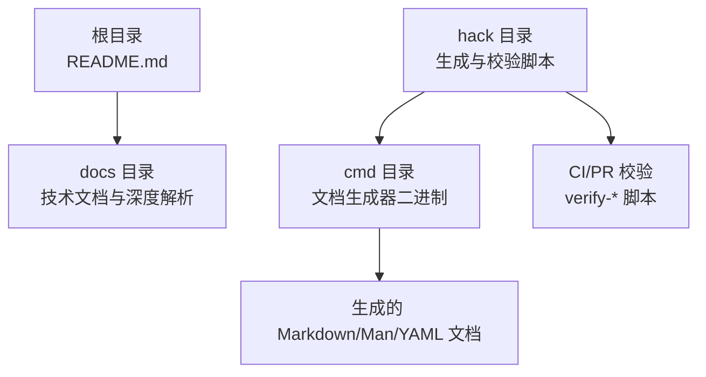
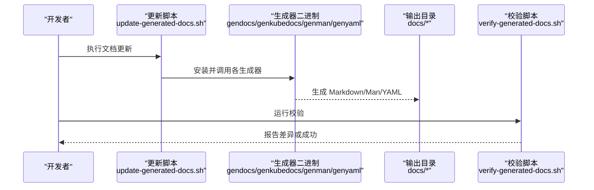
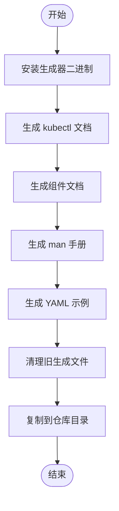
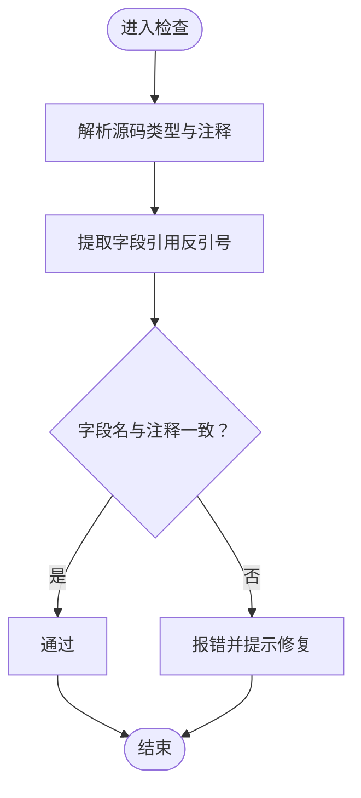
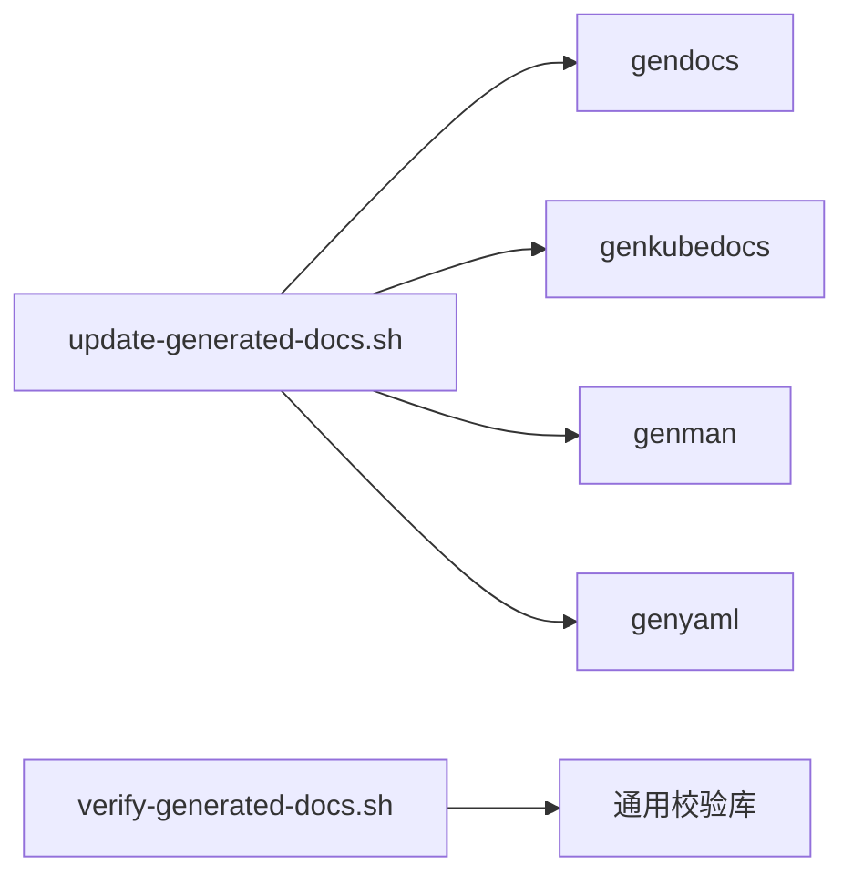

# 文档编写规范

<cite>
**本文引用的文件**   
- [README.md](file://README.md)
- [CONTRIBUTING.md](file://CONTRIBUTING.md)
- [generate-docs.sh](file://hack/generate-docs.sh)
- [update-generated-docs.sh](file://hack/update-generated-docs.sh)
- [verify-generated-docs.sh](file://hack/verify-generated-docs.sh)
- [gen_kubectl_docs.go](file://cmd/gendocs/gen_kubectl_docs.go)
- [gen_kube_docs.go](file://cmd/genkubedocs/gen_kube_docs.go)
- [field_name_docs_check.go](file://cmd/fieldnamedocscheck/field_name_docs_check.go)
- [kubernetes-internals-deep-dive.md](file://docs/kubernetes-internals-deep-dive.md)
</cite>

## 目录
1. [引言](#引言)
2. [项目结构](#项目结构)
3. [核心组件](#核心组件)
4. [架构总览](#架构总览)
5. [详细组件分析](#详细组件分析)
6. [依赖关系分析](#依赖关系分析)
7. [性能与可维护性考虑](#性能与可维护性考虑)
8. [故障排查指南](#故障排查指南)
9. [结论](#结论)
10. [附录](#附录)

## 引言
本规范面向 Kubernetes 开发者，统一仓库内技术文档的编写、生成、校验与发布流程。目标包括：
- 明确文档结构与组织原则（README、API 文档、用户指南）
- 规定术语一致性、示例代码规范与图表绘制要求
- 说明自动化文档生成工具链的使用方式
- 建立多语言文档管理策略（翻译、版本同步、本地化）
- 提供质量检查方法（链接验证、格式检查、内容审核）
- 区分用户文档与开发者文档的侧重点
- 定义贡献流程与审查标准

## 项目结构
仓库中与文档相关的核心位置与职责如下：
- 根级 README：项目概览、快速开始、社区与治理入口
- docs：仓库内技术文档与深度解析文章
- hack：文档生成与校验脚本
- cmd：文档生成器二进制（kubectl 文档、Kubernetes 组件文档、man/yaml 等）

**图示来源**
- [README.md:1-101](file://README.md#L1-L101)
- [update-generated-docs.sh:1-98](file://hack/update-generated-docs.sh#L1-L98)
- [verify-generated-docs.sh:1-29](file://hack/verify-generated-docs.sh#L1-L29)

**章节来源**
- [README.md:1-101](file://README.md#L1-L101)
- [update-generated-docs.sh:1-98](file://hack/update-generated-docs.sh#L1-L98)
- [verify-generated-docs.sh:1-29](file://hack/verify-generated-docs.sh#L1-L29)

## 核心组件
- 文档生成器
  - kubectl 文档生成器：从 CLI 命令树生成 Markdown
  - Kubernetes 组件文档生成器：为 apiserver、controller-manager、proxy、scheduler、kubelet、kubeadm 等生成文档
  - man/yaml 文档生成器：生成手册页与 YAML 示例清单
- 字段文档检查器：校验 API 字段名与注释的一致性
- 生成与校验脚本：封装生成流程并用于 CI 校验

**章节来源**
- [gen_kubectl_docs.go:1-100](file://cmd/gendocs/gen_kubectl_docs.go#L1-L100)
- [gen_kube_docs.go:1-120](file://cmd/genkubedocs/gen_kube_docs.go#L1-L120)
- [field_name_docs_check.go:1-120](file://cmd/fieldnamedocscheck/field_name_docs_check.go#L1-L120)
- [update-generated-docs.sh:1-98](file://hack/update-generated-docs.sh#L1-L98)
- [verify-generated-docs.sh:1-29](file://hack/verify-generated-docs.sh#L1-L29)

## 架构总览
文档生成与校验的整体流程如下：

**图示来源**
- [update-generated-docs.sh:1-98](file://hack/update-generated-docs.sh#L1-L98)
- [verify-generated-docs.sh:1-29](file://hack/verify-generated-docs.sh#L1-L29)

## 详细组件分析

### 文档生成器与脚本
- 生成器职责
  - gendocs：基于 Cobra 文档能力生成 kubectl 子命令文档
  - genkubedocs：为多个 Kubernetes 组件生成命令行文档
  - genman：生成 man 手册页
  - genyaml：生成 YAML 示例清单
- 脚本职责
  - generate-docs.sh：别名脚本，指向 update-generated-docs.sh
  - update-generated-docs.sh：安装生成器、生成到临时目录、清理旧文件、复制新文件到仓库
  - verify-generated-docs.sh：在 CI 中校验生成产物是否与源码一致

**图示来源**
- [generate-docs.sh:1-31](file://hack/generate-docs.sh#L1-L31)
- [update-generated-docs.sh:1-98](file://hack/update-generated-docs.sh#L1-L98)

**章节来源**
- [gen_kubectl_docs.go:1-100](file://cmd/gendocs/gen_kubectl_docs.go#L1-L100)
- [gen_kube_docs.go:1-120](file://cmd/genkubedocs/gen_kube_docs.go#L1-L120)
- [generate-docs.sh:1-31](file://hack/generate-docs.sh#L1-L31)
- [update-generated-docs.sh:1-98](file://hack/update-generated-docs.sh#L1-L98)
- [verify-generated-docs.sh:1-29](file://hack/verify-generated-docs.sh#L1-L29)

### API 字段文档一致性检查
- 目的：确保 API 类型字段名与其文档注释保持一致，避免漂移
- 机制：解析源码中的类型与注释，提取反引号包裹的字段引用，进行匹配校验
- 建议：在新增或修改 API 字段时，同步更新注释并在 PR 中运行检查

**图示来源**
- [field_name_docs_check.go:1-120](file://cmd/fieldnamedocscheck/field_name_docs_check.go#L1-L120)

**章节来源**
- [field_name_docs_check.go:1-120](file://cmd/fieldnamedocscheck/field_name_docs_check.go#L1-L120)

### 文档样例与风格参考
- 仓库内包含一篇“底层原理与核心机制深度解析”的技术文档，可作为复杂主题的结构与表达参考
- 建议采用清晰的层级标题、表格与流程图辅助理解

**章节来源**
- [kubernetes-internals-deep-dive.md:1-800](file://docs/kubernetes-internals-deep-dive.md#L1-L800)

## 依赖关系分析
- 生成器与脚本的依赖关系
  - update-generated-docs.sh 依赖 gendocs、genkubedocs、genman、genyaml 四个二进制
  - verify-generated-docs.sh 依赖通用校验库以比较生成产物
- 生成器对 CLI 定义的依赖
  - gendocs 与 genkubedocs 均基于 Cobra 文档能力，从命令树导出 Markdown

**图示来源**
- [update-generated-docs.sh:1-98](file://hack/update-generated-docs.sh#L1-L98)
- [verify-generated-docs.sh:1-29](file://hack/verify-generated-docs.sh#L1-L29)

**章节来源**
- [update-generated-docs.sh:1-98](file://hack/update-generated-docs.sh#L1-L98)
- [verify-generated-docs.sh:1-29](file://hack/verify-generated-docs.sh#L1-L29)

## 性能与可维护性考虑
- 生成效率
  - 将生成过程限制在临时目录，减少磁盘 I/O 与冲突
  - 按需增量更新，避免全量重建
- 可维护性
  - 使用统一的生成脚本与校验脚本，降低人工干预
  - 保持生成器与 CLI 定义强绑定，减少文档漂移风险

[本节为通用指导，不直接分析具体文件]

## 故障排查指南
- 常见问题
  - 生成失败：检查 Go 环境与依赖是否就绪；确认生成器二进制安装成功
  - 校验失败：根据提示运行更新脚本后再次校验
  - 字段不一致：依据错误信息定位字段与注释，修正后重新生成与校验
- 建议步骤
  - 先运行更新脚本，再运行校验脚本
  - 若仍失败，查看生成日志与差异列表，逐项修复

**章节来源**
- [update-generated-docs.sh:1-98](file://hack/update-generated-docs.sh#L1-L98)
- [verify-generated-docs.sh:1-29](file://hack/verify-generated-docs.sh#L1-L29)

## 结论
通过统一的生成与校验体系，Kubernetes 仓库实现了文档与源码的强一致性。遵循本规范，可在保证质量的同时提升协作效率。

[本节为总结，不直接分析具体文件]

## 附录

### 文档结构与组织原则
- README 编写规范
  - 项目简介与背景
  - 快速开始（构建、运行、入门教程）
  - 支持渠道与社区会议
  - 治理与路线图链接
- API 文档格式
  - 字段描述清晰、类型与默认值完整
  - 示例请求/响应与错误码说明
  - 变更历史与兼容性标注
- 用户指南结构
  - 场景化任务导向（如部署、扩缩容、排障）
  - 前置条件、操作步骤、预期结果、回滚方案
  - 常见问题与最佳实践

**章节来源**
- [README.md:1-101](file://README.md#L1-L101)

### 写作标准
- 术语一致性
  - 首次出现给出全称与缩写
  - 全文统一术语表，避免同义替换
- 示例代码规范
  - 最小可复现示例，避免敏感信息
  - 标注适用版本与平台差异
- 图表绘制要求
  - 使用 Mermaid 或标准矢量图
  - 图中节点命名简洁，避免样式自定义

[本节为通用指导，不直接分析具体文件]

### 自动化工具使用
- 文档生成脚本
  - 使用别名脚本或直接调用更新脚本
  - 生成产物位于 docs 下对应目录
- 代码注释提取
  - 通过生成器从 CLI 与源码注释导出文档
- API 文档自动生成
  - 结合 OpenAPI/Swagger 与生成器产出结构化文档

**章节来源**
- [generate-docs.sh:1-31](file://hack/generate-docs.sh#L1-L31)
- [update-generated-docs.sh:1-98](file://hack/update-generated-docs.sh#L1-L98)
- [gen_kubectl_docs.go:1-100](file://cmd/gendocs/gen_kubectl_docs.go#L1-L100)
- [gen_kube_docs.go:1-120](file://cmd/genkubedocs/gen_kube_docs.go#L1-L120)

### 多语言文档管理
- 翻译流程
  - 源文档优先维护英文，翻译作为镜像分支或独立仓库
  - 翻译变更需与源文档版本对齐
- 版本同步
  - 使用标签或分支映射版本
  - 定期拉取上游变更并合并翻译差异
- 本地化策略
  - 术语表本地化
  - 区域化示例（时间、货币、网络环境）

[本节为通用指导，不直接分析具体文件]

### 文档质量检查
- 链接验证
  - 使用静态站点生成器的链接检查插件
  - 定期扫描外部链接有效性
- 格式检查
  - Markdown 语法与风格统一（标题层级、列表、代码块）
  - 图片与资源路径正确
- 内容审核流程
  - 同行评审（至少一名领域专家）
  - 自动化校验（生成与一致性检查）
  - 发布前回归测试（示例可运行）

[本节为通用指导，不直接分析具体文件]

### 用户文档与开发者文档的区别
- 用户文档
  - 侧重任务完成与最佳实践
  - 强调易用性与可操作性
- 开发者文档
  - 侧重实现细节与扩展点
  - 强调接口契约与内部约定

[本节为通用指导，不直接分析具体文件]

### 贡献流程与审查标准
- 贡献入口
  - 遵循贡献者指南与 CLA 签署要求
- 审查标准
  - 文档与源码一致性
  - 可读性与准确性
  - 示例可运行且覆盖关键路径

**章节来源**
- [CONTRIBUTING.md:1-10](file://CONTRIBUTING.md#L1-L10)