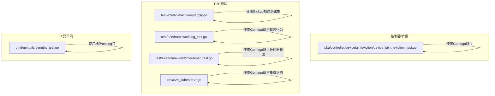
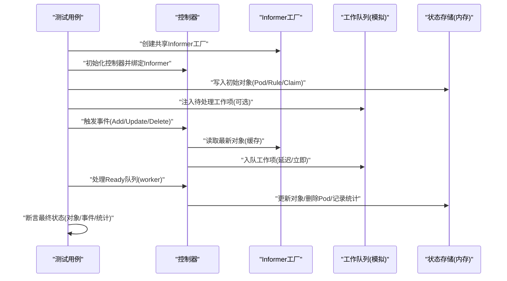
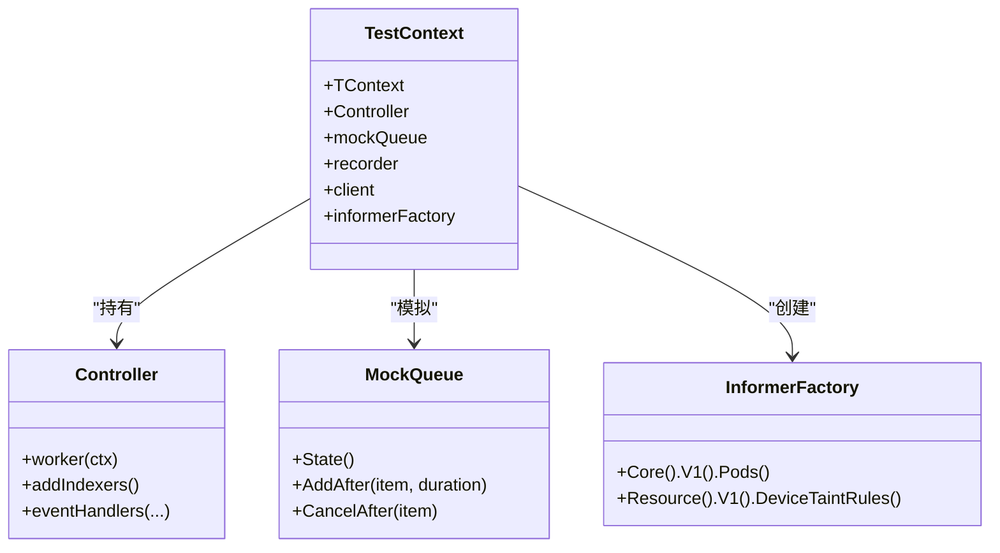
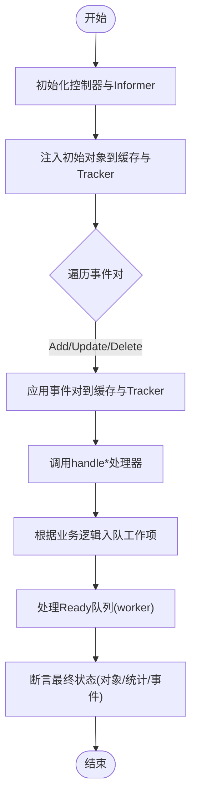
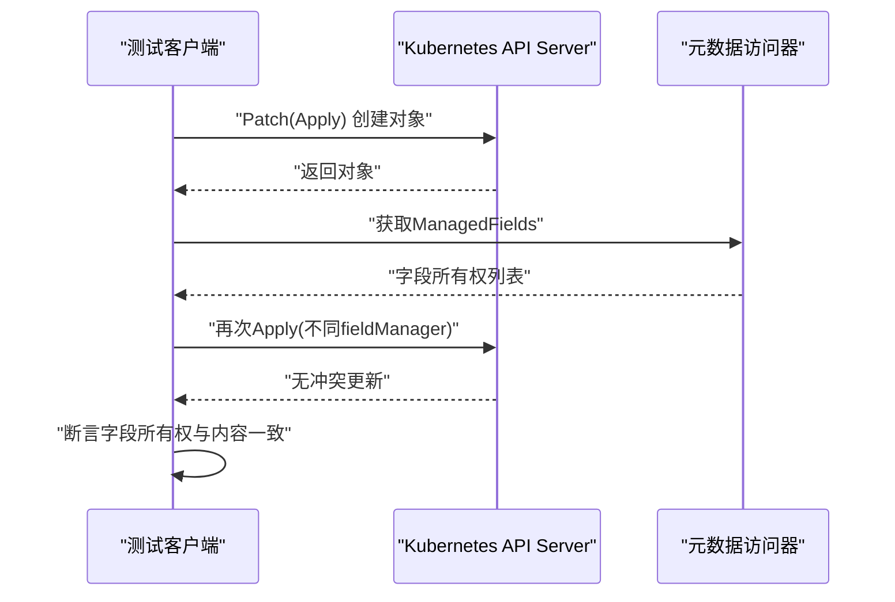
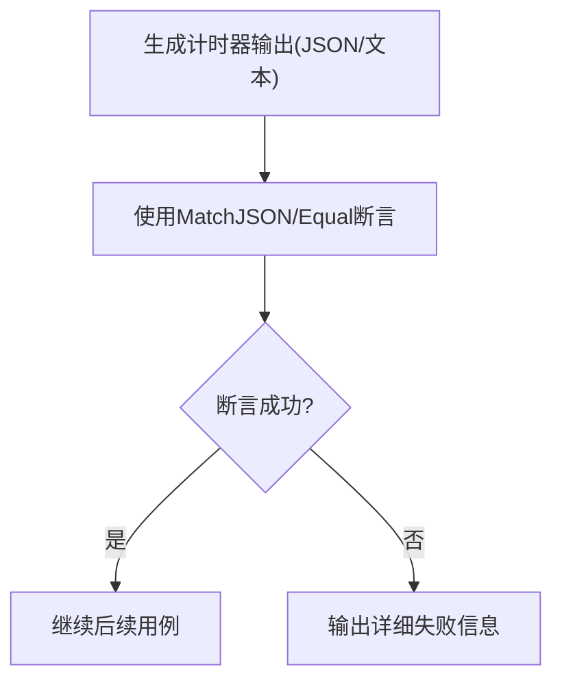
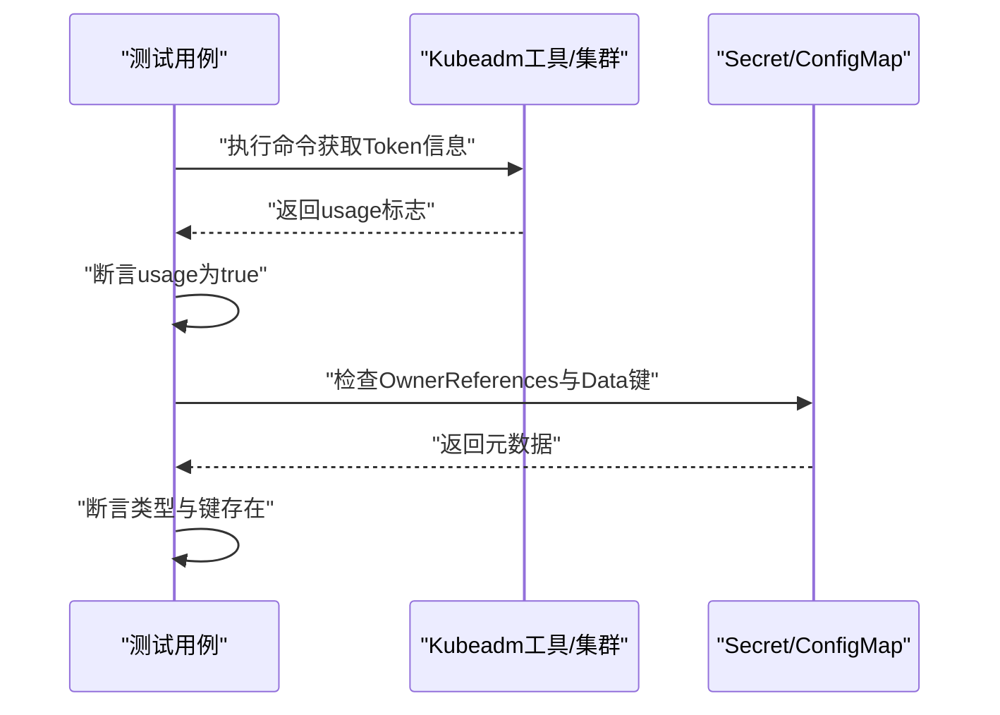
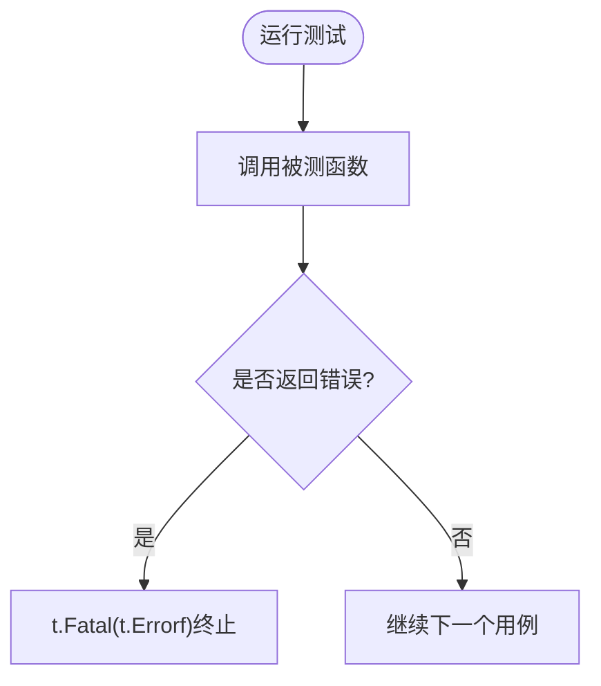
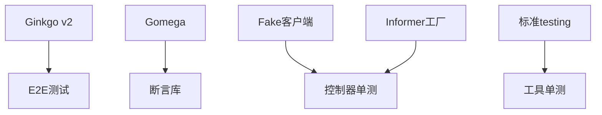

# 单元测试

<cite>
**本文引用的文件**   
- [device_taint_eviction_test.go](file://pkg/controller/devicetainteviction/device_taint_eviction_test.go)
- [apply.go](file://test/e2e/apimachinery/apply.go)
- [log_test.go](file://test/e2e/framework/log_test.go)
- [timer_test.go](file://test/e2e/framework/timer/timer_test.go)
- [bootstrap_token_test.go](file://test/e2e_kubeadm/bootstrap_token_test.go)
- [controlplane_nodes_test.go](file://test/e2e_kubeadm/controlplane_nodes_test.go)
- [kubeadm_certs_test.go](file://test/e2e_kubeadm/kubeadm_certs_test.go)
- [genutils_test.go](file://cmd/genutils/genutils_test.go)
</cite>

## 目录
1. [简介](#简介)
2. [项目结构](#项目结构)
3. [核心组件](#核心组件)
4. [架构总览](#架构总览)
5. [详细组件分析](#详细组件分析)
6. [依赖分析](#依赖分析)
7. [性能考虑](#性能考虑)
8. [故障排查指南](#故障排查指南)
9. [结论](#结论)
10. [附录](#附录)

## 简介
本指南面向Kubernetes开发者，聚焦于在Kubernetes代码库中编写高质量的单元测试。内容涵盖：
- Ginkgo与Gomega测试框架的核心语法与最佳实践（Describe、Context、It等）
- 高质量单元测试的编写方法：测试数据准备、Mock对象创建与使用、断言的正确用法
- 测试隔离与环境设置：测试数据库清理、资源管理、并发控制
- 常见测试场景示例：API调用测试、并发测试、错误处理测试
- 覆盖率统计与质量门禁的设置建议
- 调试技巧与性能优化建议

## 项目结构
Kubernetes仓库包含大量测试用例，既包括基于标准testing包的单测，也广泛采用Ginkgo/Gomega进行E2E与集成测试。以下图展示了与本指南相关的测试组织方式与典型入口：

图表来源
- [device_taint_eviction_test.go:1-200](file://pkg/controller/devicetainteviction/device_taint_eviction_test.go#L1-L200)
- [apply.go:1-200](file://test/e2e/apimachinery/apply.go#L1-L200)
- [log_test.go:52-67](file://test/e2e/framework/log_test.go#L52-L67)
- [timer_test.go:50-88](file://test/e2e/framework/timer/timer_test.go#L50-L88)
- [bootstrap_token_test.go:65-70](file://test/e2e_kubeadm/bootstrap_token_test.go#L65-L70)
- [controlplane_nodes_test.go:49](file://test/e2e_kubeadm/controlplane_nodes_test.go#L49)
- [kubeadm_certs_test.go:68-93](file://test/e2e_kubeadm/kubeadm_certs_test.go#L68-L93)
- [genutils_test.go:23-42](file://cmd/genutils/genutils_test.go#L23-L42)

章节来源
- [device_taint_eviction_test.go:1-200](file://pkg/controller/devicetainteviction/device_taint_eviction_test.go#L1-L200)
- [apply.go:1-200](file://test/e2e/apimachinery/apply.go#L1-L200)
- [log_test.go:52-67](file://test/e2e/framework/log_test.go#L52-L67)
- [timer_test.go:50-88](file://test/e2e/framework/timer/timer_test.go#L50-L88)
- [bootstrap_token_test.go:65-70](file://test/e2e_kubeadm/bootstrap_token_test.go#L65-L70)
- [controlplane_nodes_test.go:49](file://test/e2e_kubeadm/controlplane_nodes_test.go#L49)
- [kubeadm_certs_test.go:68-93](file://test/e2e_kubeadm/kubeadm_certs_test.go#L68-L93)
- [genutils_test.go:23-42](file://cmd/genutils/genutils_test.go#L23-L42)

## 核心组件
本节从Kubernetes源码中提取并总结Ginkgo/Gomega与单测的关键模式，帮助读者快速掌握在仓库内编写高质量测试的方法。

- Ginkgo测试组织
  - 使用“描述块”组织测试套件，便于按功能域划分用例
  - 使用“上下文块”表达不同前置条件或环境下的行为差异
  - 使用“它”定义具体测试点，强调单一职责与可维护性
  - 参考路径：[apply.go:44-61](file://test/e2e/apimachinery/apply.go#L44-L61)

- Gomega断言风格
  - 统一使用Expect/Should/To组合，提供可读性强的自然语言式断言
  - 常用断言：相等、长度、键存在、数值比较、JSON匹配等
  - 参考路径：
    - [log_test.go:52-67](file://test/e2e/framework/log_test.go#L52-L67)
    - [timer_test.go:50-88](file://test/e2e/framework/timer/timer_test.go#L50-L88)
    - [bootstrap_token_test.go:65-70](file://test/e2e_kubeadm/bootstrap_token_test.go#L65-L70)
    - [controlplane_nodes_test.go:49](file://test/e2e_kubeadm/controlplane_nodes_test.go#L49)
    - [kubeadm_certs_test.go:68-93](file://test/e2e_kubeadm/kubeadm_certs_test.go#L68-L93)

- 控制器单测中的工作队列与事件驱动流程
  - 通过模拟工作队列与Informer缓存，构造事件对（旧/新对象），驱动处理器执行
  - 使用断言验证最终状态（如Pod、规则、统计信息、事件）
  - 参考路径：
    - [device_taint_eviction_test.go:2003-2103](file://pkg/controller/devicetainteviction/device_taint_eviction_test.go#L2003-L2103)
    - [device_taint_eviction_test.go:2132-2173](file://pkg/controller/devicetainteviction/device_taint_eviction_test.go#L2132-L2173)

- 标准testing包的基础用例
  - 对于简单逻辑，可直接使用Go标准testing包，配合t.Fatal/t.Errorf进行失败报告
  - 参考路径：[genutils_test.go:23-42](file://cmd/genutils/genutils_test.go#L23-L42)

章节来源
- [apply.go:44-61](file://test/e2e/apimachinery/apply.go#L44-L61)
- [log_test.go:52-67](file://test/e2e/framework/log_test.go#L52-L67)
- [timer_test.go:50-88](file://test/e2e/framework/timer/timer_test.go#L50-L88)
- [bootstrap_token_test.go:65-70](file://test/e2e_kubeadm/bootstrap_token_test.go#L65-L70)
- [controlplane_nodes_test.go:49](file://test/e2e_kubeadm/controlplane_nodes_test.go#L49)
- [kubeadm_certs_test.go:68-93](file://test/e2e_kubeadm/kubeadm_certs_test.go#L68-L93)
- [device_taint_eviction_test.go:2003-2103](file://pkg/controller/devicetainteviction/device_taint_eviction_test.go#L2003-L2103)
- [device_taint_eviction_test.go:2132-2173](file://pkg/controller/devicetainteviction/device_taint_eviction_test.go#L2132-L2173)
- [genutils_test.go:23-42](file://cmd/genutils/genutils_test.go#L23-L42)

## 架构总览
下图展示了一个典型的控制器单测流程：初始化控制器与Informer、注入初始状态、触发事件、处理工作项、断言最终状态。该流程体现了事件驱动与状态一致性校验的核心思想。

图表来源
- [device_taint_eviction_test.go:2003-2103](file://pkg/controller/devicetainteviction/device_taint_eviction_test.go#L2003-L2103)
- [device_taint_eviction_test.go:2132-2173](file://pkg/controller/devicetainteviction/device_taint_eviction_test.go#L2132-L2173)

## 详细组件分析

### 组件A：设备污点驱逐控制器单测
该单测围绕控制器的事件处理与工作队列调度展开，重点在于：
- 使用Informer缓存与Fake客户端同步状态
- 通过事件对驱动handle*处理器
- 使用Gomega断言最终状态与事件

#### 类关系图（概念映射到源码）

图表来源
- [device_taint_eviction_test.go:143-150](file://pkg/controller/devicetainteviction/device_taint_eviction_test.go#L143-L150)
- [device_taint_eviction_test.go:2195-2199](file://pkg/controller/devicetainteviction/device_taint_eviction_test.go#L2195-L2199)

#### 事件处理流程图（对应源码实现）

图表来源
- [device_taint_eviction_test.go:2003-2103](file://pkg/controller/devicetainteviction/device_taint_eviction_test.go#L2003-L2103)
- [device_taint_eviction_test.go:2132-2173](file://pkg/controller/devicetainteviction/device_taint_eviction_test.go#L2132-L2173)

章节来源
- [device_taint_eviction_test.go:143-150](file://pkg/controller/devicetainteviction/device_taint_eviction_test.go#L143-L150)
- [device_taint_eviction_test.go:2003-2103](file://pkg/controller/devicetainteviction/device_taint_eviction_test.go#L2003-L2103)
- [device_taint_eviction_test.go:2132-2173](file://pkg/controller/devicetainteviction/device_taint_eviction_test.go#L2132-L2173)
- [device_taint_eviction_test.go:2195-2199](file://pkg/controller/devicetainteviction/device_taint_eviction_test.go#L2195-L2199)

### 组件B：服务端侧Apply的E2E测试
该测试覆盖Server-Side Apply在不同资源与子资源上的行为，包括：
- 创建不存在对象
- 子资源更新
- 多管理器字段所有权
- CRD支持

图表来源
- [apply.go:68-155](file://test/e2e/apimachinery/apply.go#L68-L155)

章节来源
- [apply.go:68-155](file://test/e2e/apimachinery/apply.go#L68-L155)

### 组件C：Gomega断言与日志/计时器测试
- 日志断言：通过自定义原因参数增强失败信息可读性
- 计时器输出：使用JSON匹配与人类可读格式断言

图表来源
- [timer_test.go:50-88](file://test/e2e/framework/timer/timer_test.go#L50-L88)
- [log_test.go:52-67](file://test/e2e/framework/log_test.go#L52-L67)

章节来源
- [timer_test.go:50-88](file://test/e2e/framework/timer/timer_test.go#L50-L88)
- [log_test.go:52-67](file://test/e2e/framework/log_test.go#L52-L67)

### 组件D：kubeadm相关E2E断言
- Bootstrap Token可用性断言
- ControlPlane节点数量断言
- Secret拥有者引用与数据类型断言

图表来源
- [bootstrap_token_test.go:65-70](file://test/e2e_kubeadm/bootstrap_token_test.go#L65-L70)
- [controlplane_nodes_test.go:49](file://test/e2e_kubeadm/controlplane_nodes_test.go#L49)
- [kubeadm_certs_test.go:68-93](file://test/e2e_kubeadm/kubeadm_certs_test.go#L68-L93)

章节来源
- [bootstrap_token_test.go:65-70](file://test/e2e_kubeadm/bootstrap_token_test.go#L65-L70)
- [controlplane_nodes_test.go:49](file://test/e2e_kubeadm/controlplane_nodes_test.go#L49)
- [kubeadm_certs_test.go:68-93](file://test/e2e_kubeadm/kubeadm_certs_test.go#L68-L93)

### 组件E：标准testing包基础用例
适用于简单函数验证，直接利用Go原生测试能力，避免引入额外依赖。

图表来源
- [genutils_test.go:23-42](file://cmd/genutils/genutils_test.go#L23-L42)

章节来源
- [genutils_test.go:23-42](file://cmd/genutils/genutils_test.go#L23-L42)

## 依赖分析
- 测试框架依赖
  - Ginkgo v2用于组织E2E测试套件
  - Gomega提供丰富的断言与异步等待能力
- 控制器单测依赖
  - Fake客户端与Informer工厂用于模拟API交互与缓存
  - 模拟工作队列用于控制事件处理时序
- 工具单测依赖
  - 标准testing包，零外部依赖

图表来源
- [apply.go:41-42](file://test/e2e/apimachinery/apply.go#L41-L42)
- [device_taint_eviction_test.go:34-36](file://pkg/controller/devicetainteviction/device_taint_eviction_test.go#L34-L36)
- [device_taint_eviction_test.go:49-51](file://pkg/controller/devicetainteviction/device_taint_eviction_test.go#L49-L51)
- [genutils_test.go:19-21](file://cmd/genutils/genutils_test.go#L19-L21)

章节来源
- [apply.go:41-42](file://test/e2e/apimachinery/apply.go#L41-L42)
- [device_taint_eviction_test.go:34-36](file://pkg/controller/devicetainteviction/device_taint_eviction_test.go#L34-L36)
- [device_taint_eviction_test.go:49-51](file://pkg/controller/devicetainteviction/device_taint_eviction_test.go#L49-L51)
- [genutils_test.go:19-21](file://cmd/genutils/genutils_test.go#L19-L21)

## 性能考虑
- 控制器单测
  - 使用内存缓存与Fake客户端，避免真实I/O开销
  - 通过模拟工作队列精确控制时间推进与任务调度
  - 批量断言与排序选项减少比较成本
- E2E测试
  - 合理拆分测试套件，避免长链路阻塞
  - 复用命名空间与资源，减少创建/销毁开销
- 通用建议
  - 使用并行测试时注意资源隔离与竞态条件
  - 避免在关键路径上频繁分配大对象，优先复用缓冲区

## 故障排查指南
- 断言失败定位
  - 使用带原因的断言输出，快速定位问题上下文
  - 对比期望与实际状态的差异，关注关键字段（如UID、名称、计数）
- 事件与状态不一致
  - 检查事件对是否正确应用到缓存与Tracker
  - 确认处理器是否将预期工作项入队并处理
- 并发与时序问题
  - 使用模拟队列与时间推进控制，避免真实sleep带来的不确定性
  - 确保在断言前完成所有Ready队列的处理

章节来源
- [device_taint_eviction_test.go:2003-2103](file://pkg/controller/devicetainteviction/device_taint_eviction_test.go#L2003-L2103)
- [device_taint_eviction_test.go:2132-2173](file://pkg/controller/devicetainteviction/device_taint_eviction_test.go#L2132-L2173)
- [log_test.go:52-67](file://test/e2e/framework/log_test.go#L52-L67)

## 结论
通过在Kubernetes代码库中遵循统一的测试组织与断言风格，结合控制器单测的事件驱动模型与E2E测试的端到端验证，可以显著提升测试的可读性与稳定性。建议在团队内推广：
- 使用Ginkgo/Gomega进行结构化测试与强断言
- 以Informer+Fake客户端构建可控的控制器测试环境
- 明确测试隔离策略与资源生命周期管理
- 建立覆盖率统计与质量门禁，持续改进测试质量

## 附录
- 常见测试场景清单
  - API调用测试：使用RESTClient或动态客户端发起请求并断言响应
  - 并发测试：使用goroutine与通道协调，配合断言验证最终一致性
  - 错误处理测试：构造异常输入，断言错误类型与消息
- 覆盖率与质量门禁建议
  - 使用go test -coverprofile收集覆盖率
  - 在CI中设置最低覆盖率阈值与失败门禁
  - 定期审查未覆盖分支与复杂逻辑