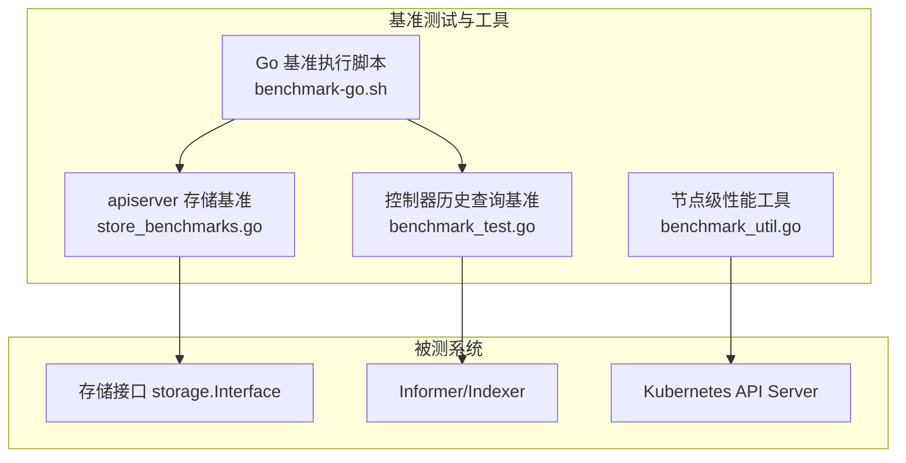
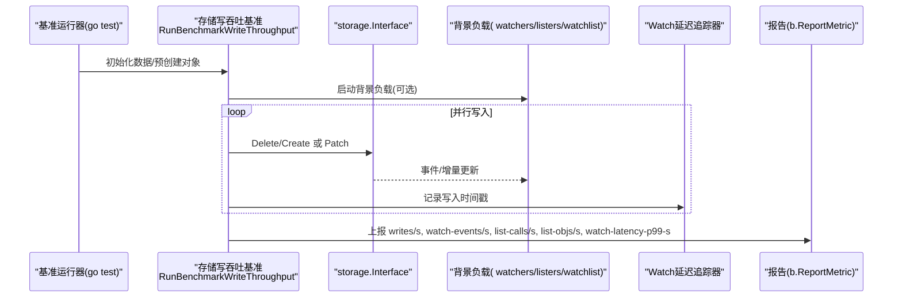
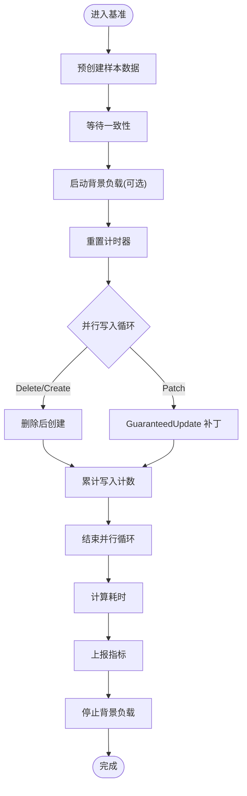
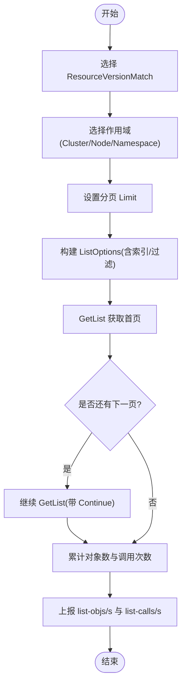
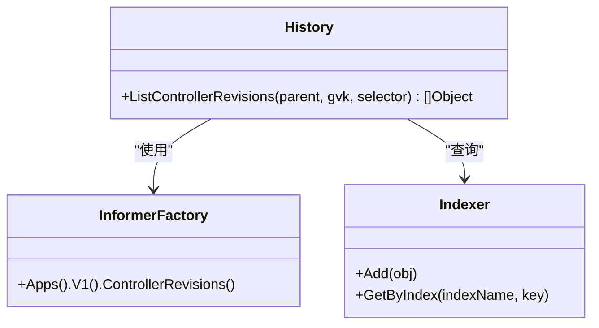
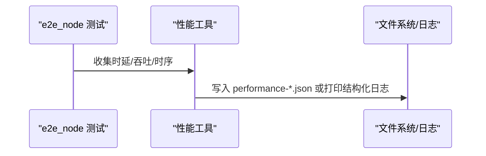
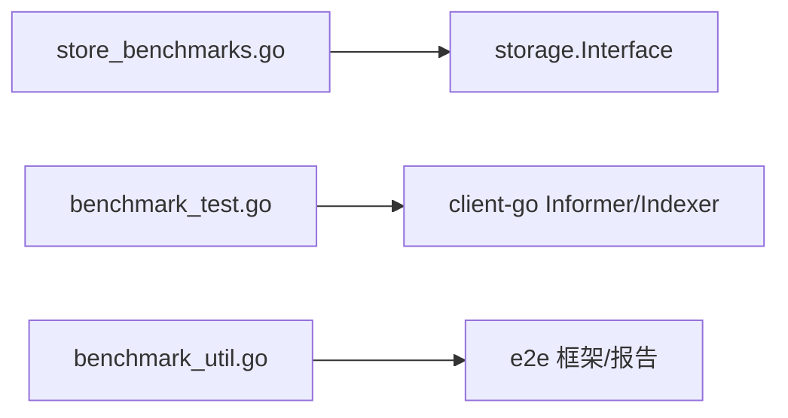

# 性能测试

<cite>
**本文引用的文件**
- [benchmark_util.go](file://test/e2e_node/benchmark_util.go)
- [store_benchmarks.go](file://staging/src/k8s.io/apiserver/pkg/storage/testing/store_benchmarks.go)
- [benchmark_test.go](file://pkg/controller/history/benchmark_test.go)
- [benchmark-go.sh](file://hack/benchmark-go.sh)
</cite>

## 目录
1. [简介](#简介)
2. [项目结构](#项目结构)
3. [核心组件](#核心组件)
4. [架构总览](#架构总览)
5. [详细组件分析](#详细组件分析)
6. [依赖关系分析](#依赖关系分析)
7. [性能考量](#性能考量)
8. [故障排查指南](#故障排查指南)
9. [结论](#结论)
10. [附录](#附录)

## 简介
本指南面向 Kubernetes 开发者，系统化阐述在 K8s 代码库中进行性能测试的设计原则与实施方法。内容覆盖：
- 基准测试（Benchmark）的编写、数据准备与回归检测
- 负载/压力测试场景设计、并发控制与服务降级策略
- 性能监控与指标采集（Prometheus 集成、自定义指标、仪表板）
- 典型用例：API 响应时间、内存占用、CPU 占用等
- 结果分析与优化建议

## 项目结构
仓库中多处包含性能相关实现与示例，本文聚焦以下关键位置：
- e2e_node 节点级性能工具与指标输出
- apiserver 存储层基准测试套件（写吞吐、读列表、Watch 延迟追踪）
- controller 历史对象查询基准
- hack 脚本用于 Go 基准测试执行

图表来源
- [store_benchmarks.go:68-163](file://staging/src/k8s.io/apiserver/pkg/storage/testing/store_benchmarks.go#L68-L163)
- [benchmark_test.go:34-157](file://pkg/controller/history/benchmark_test.go#L34-L157)
- [benchmark_util.go:46-104](file://test/e2e_node/benchmark_util.go#L46-L104)
- [benchmark-go.sh](file://hack/benchmark-go.sh)

章节来源
- [store_benchmarks.go:68-163](file://staging/src/k8s.io/apiserver/pkg/storage/testing/store_benchmarks.go#L68-L163)
- [benchmark_test.go:34-157](file://pkg/controller/history/benchmark_test.go#L34-L157)
- [benchmark_util.go:46-104](file://test/e2e_node/benchmark_util.go#L46-L104)
- [benchmark-go.sh](file://hack/benchmark-go.sh)

## 核心组件
- 存储层写吞吐基准：提供 Delete/Create、Patch 两种流量模式，支持 Watch/Lister/WatchList 背景负载，统计 writes/s、watch-events/s、list-calls/s、list-objs/s 及 watch 延迟 P99。
- 存储层 List 基准：按 ResourceVersionMatch、Scope（Cluster/Node/Namespace）、分页 Limit 组合维度评估 list-objs/s 与 list-calls/s。
- 控制器历史查询基准：模拟不同比例“被拥有/孤儿/其他拥有”的 ControllerRevision 数量，评估 Lister/Indexer 下查询耗时。
- 节点级性能工具：封装 Pod 启动时延、吞吐、资源时序数据的收集与输出格式，便于 CI 解析与归档。
- Go 基准执行脚本：统一入口，驱动 go test -bench 运行并输出结果。

章节来源
- [store_benchmarks.go:68-163](file://staging/src/k8s.io/apiserver/pkg/storage/testing/store_benchmarks.go#L68-L163)
- [store_benchmarks.go:397-512](file://staging/src/k8s.io/apiserver/pkg/storage/testing/store_benchmarks.go#L397-L512)
- [benchmark_test.go:34-157](file://pkg/controller/history/benchmark_test.go#L34-L157)
- [benchmark_util.go:112-153](file://test/e2e_node/benchmark_util.go#L112-L153)
- [benchmark-go.sh](file://hack/benchmark-go.sh)

## 架构总览
下图展示从基准入口到被测系统的调用链路与指标产出路径。

图表来源
- [store_benchmarks.go:68-163](file://staging/src/k8s.io/apiserver/pkg/storage/testing/store_benchmarks.go#L68-L163)
- [store_benchmarks.go:181-231](file://staging/src/k8s.io/apiserver/pkg/storage/testing/store_benchmarks.go#L181-L231)
- [store_benchmarks.go:233-395](file://staging/src/k8s.io/apiserver/pkg/storage/testing/store_benchmarks.go#L233-L395)
- [store_benchmarks.go:591-658](file://staging/src/k8s.io/apiserver/pkg/storage/testing/store_benchmarks.go#L591-L658)

## 详细组件分析

### 组件A：存储层写吞吐基准（Delete/Create 与 Patch）
- 目标：评估在高并发写与不同背景读负载下的吞吐与延迟。
- 关键流程：
  - 预创建样本数据（Pod），确保一致性后再开始计时。
  - 根据配置启动背景负载（无负载、Watcher、Lister、ExactRV、NotOlderThan、WatchList）。
  - 使用 b.SetParallelism 控制并发度，b.RunParallel 执行主测循环。
  - 通过原子计数器累计 writes、watch events、list calls/objects。
  - 可选地注入时间戳以计算 watch 端到端延迟 P99。
- 指标：
  - writes/s：每秒成功写入次数
  - watch-events/s：背景 watcher 接收事件速率
  - list-calls/s、list-objs/s：背景 lister 调用与对象读取速率
  - watch-latency-p99-s：P99 延迟秒数（若启用追踪）

图表来源
- [store_benchmarks.go:68-163](file://staging/src/k8s.io/apiserver/pkg/storage/testing/store_benchmarks.go#L68-L163)
- [store_benchmarks.go:181-231](file://staging/src/k8s.io/apiserver/pkg/storage/testing/store_benchmarks.go#L181-L231)

章节来源
- [store_benchmarks.go:68-163](file://staging/src/k8s.io/apiserver/pkg/storage/testing/store_benchmarks.go#L68-L163)
- [store_benchmarks.go:181-231](file://staging/src/k8s.io/apiserver/pkg/storage/testing/store_benchmarks.go#L181-L231)

### 组件B：存储层 List 基准（分页与过滤）
- 目标：评估在不同 ResourceVersionMatch、作用域与分页限制下的读取吞吐。
- 关键流程：
  - 遍历 RV 匹配策略与作用域组合，动态选择分页 limit。
  - 使用索引字段（如 nodeName、namespace）进行过滤以提升性能。
  - 递归分页拉取，累计对象数与列表调用次数。
- 指标：
  - list-objs/s：每秒读取对象数
  - list-calls/s：每秒列表调用次数

图表来源
- [store_benchmarks.go:397-512](file://staging/src/k8s.io/apiserver/pkg/storage/testing/store_benchmarks.go#L397-L512)

章节来源
- [store_benchmarks.go:397-512](file://staging/src/k8s.io/apiserver/pkg/storage/testing/store_benchmarks.go#L397-L512)

### 组件C：控制器历史查询基准（ControllerRevision）
- 目标：评估在大规模 ControllerRevision 集合下，基于 LabelSelector 的查询性能。
- 关键流程：
  - 构造不同比例的“被拥有/孤儿/其他拥有”对象，填充 Indexer。
  - 使用 Lister + Indexer 执行查询，统计耗时。
- 适用场景：验证索引与标签选择器对查询性能的影响。

图表来源
- [benchmark_test.go:34-157](file://pkg/controller/history/benchmark_test.go#L34-L157)

章节来源
- [benchmark_test.go:34-157](file://pkg/controller/history/benchmark_test.go#L34-L157)

### 组件D：节点级性能工具（e2e_node）
- 功能：
  - 将性能数据序列化为 JSON，附带时间戳与标签，便于 CI 归档。
  - 聚合 Pod 启动时延分位值（P50/P90/P99/P100）与吞吐（pods/min）。
  - 生成操作与资源使用的时序数据（时间戳序列）。
- 输出：
  - 独立 JSON 文件或标准日志中的结构化片段，供后续解析。

图表来源
- [benchmark_util.go:46-104](file://test/e2e_node/benchmark_util.go#L46-L104)
- [benchmark_util.go:112-153](file://test/e2e_node/benchmark_util.go#L112-L153)

章节来源
- [benchmark_util.go:46-104](file://test/e2e_node/benchmark_util.go#L46-L104)
- [benchmark_util.go:112-153](file://test/e2e_node/benchmark_util.go#L112-L153)

### 组件E：Go 基准执行脚本
- 作用：封装 go test -bench 的执行参数与环境，统一输出与归档。
- 使用方式：在仓库根目录执行该脚本，触发指定包或全部包的基准测试。

章节来源
- [benchmark-go.sh](file://hack/benchmark-go.sh)

## 依赖关系分析
- 存储基准依赖 storage.Interface 抽象，屏蔽底层存储实现差异，便于对比 etcd、内存等不同后端。
- 控制器历史基准依赖 client-go informer 与 indexer，体现缓存与索引对查询性能的增益。
- e2e_node 工具依赖框架的日志与报告机制，保证跨环境一致的数据导出。

图表来源
- [store_benchmarks.go:68-163](file://staging/src/k8s.io/apiserver/pkg/storage/testing/store_benchmarks.go#L68-L163)
- [benchmark_test.go:34-157](file://pkg/controller/history/benchmark_test.go#L34-L157)
- [benchmark_util.go:46-104](file://test/e2e_node/benchmark_util.go#L46-L104)

章节来源
- [store_benchmarks.go:68-163](file://staging/src/k8s.io/apiserver/pkg/storage/testing/store_benchmarks.go#L68-L163)
- [benchmark_test.go:34-157](file://pkg/controller/history/benchmark_test.go#L34-L157)
- [benchmark_util.go:46-104](file://test/e2e_node/benchmark_util.go#L46-L104)

## 性能考量
- 基准设计原则
  - 隔离与可重复：固定数据规模、随机种子与并发度；预热与一致性检查。
  - 单一变量：每次只改变一个维度（如并发度、索引开关、RV 匹配策略）。
  - 指标完备：同时报告吞吐与时延分位，避免仅看均值。
- 并发控制
  - 使用 b.SetParallelism 与 b.RunParallel 控制 goroutine 数量，避免过度竞争。
  - 背景负载与主测负载解耦，分别统计，避免相互干扰。
- 数据准备
  - 预创建样本对象，减少 I/O 抖动；必要时打散分布（多命名空间/节点）。
- 回归检测
  - 在 CI 中固化基线阈值，比较 P99 与吞吐变化，超过阈值即告警。
- 监控与可视化
  - 结合 Prometheus 抓取 kube-apiserver 与组件指标，配合 Grafana 搭建仪表板。
  - 自定义指标：在关键路径埋点，暴露为 prometheus.Counter/Gauge/Histogram。
- 服务降级
  - 高负载下优先保障核心路径（如短请求），对非关键路径限流或退避重试。
  - 利用 WatchList 初始事件与书签机制降低冷启动开销。

[本节为通用指导，不直接分析具体文件]

## 故障排查指南
- 指标缺失或不稳定
  - 确认已正确调用 b.ResetTimer 与 b.ReportMetric，避免预热阶段污染计时。
  - 检查背景负载是否正确启动与停止，避免 goroutine 泄漏导致结果漂移。
- 读写冲突与不一致
  - 在开始测量前执行一致性检查（如 GetList 一次），确保存储状态稳定。
- 索引未生效
  - 确认 ListOptions 中 IndexFields 与 Predicate.Field 设置正确，且 GetAttrs 返回对应字段。
- Watch 延迟偏高
  - 检查 WatchLatencyTracker 的时间戳注入与解析逻辑，确认注解键名一致。
- 输出不可解析
  - 核对 JSON 结构与标签字段，确保 CI 解析器能识别 timestamp、test、datatype 等关键字段。

章节来源
- [store_benchmarks.go:165-179](file://staging/src/k8s.io/apiserver/pkg/storage/testing/store_benchmarks.go#L165-L179)
- [store_benchmarks.go:591-658](file://staging/src/k8s.io/apiserver/pkg/storage/testing/store_benchmarks.go#L591-L658)
- [benchmark_util.go:46-104](file://test/e2e_node/benchmark_util.go#L46-L104)

## 结论
通过在 apiserver 存储层、控制器历史查询与节点级场景建立完善的基准与工具链，Kubernetes 开发者可以：
- 量化吞吐与时延，定位热点与瓶颈
- 在变更前后进行回归对比，保障性能稳定性
- 结合监控体系持续观测生产表现，快速发现退化

[本节为总结性内容，不直接分析具体文件]

## 附录

### 常用基准命令与用法
- 执行 Go 基准测试
  - 使用仓库提供的脚本统一执行，便于在 CI 中复用。
- 针对特定包运行
  - 在需要时限定包路径，缩短反馈周期。
- 调整并发与超时
  - 通过环境变量或脚本参数控制并行度与超时，适配不同硬件环境。

章节来源
- [benchmark-go.sh](file://hack/benchmark-go.sh)

### 指标清单与含义
- 写吞吐类
  - writes/s：每秒成功写入对象数
  - watch-events/s：背景 watcher 事件速率
  - list-calls/s、list-objs/s：背景 lister 调用与对象读取速率
  - watch-latency-p99-s：P99 延迟秒数
- 读吞吐类
  - list-objs/s：每秒读取对象数
  - list-calls/s：每秒列表调用次数
- 节点级
  - 时延分位（ms）：P50/P90/P99/P100
  - 吞吐（pods/min）：批量创建吞吐与单条最差时延换算

章节来源
- [store_benchmarks.go:144-163](file://staging/src/k8s.io/apiserver/pkg/storage/testing/store_benchmarks.go#L144-L163)
- [store_benchmarks.go:485-488](file://staging/src/k8s.io/apiserver/pkg/storage/testing/store_benchmarks.go#L485-L488)
- [benchmark_util.go:112-153](file://test/e2e_node/benchmark_util.go#L112-L153)