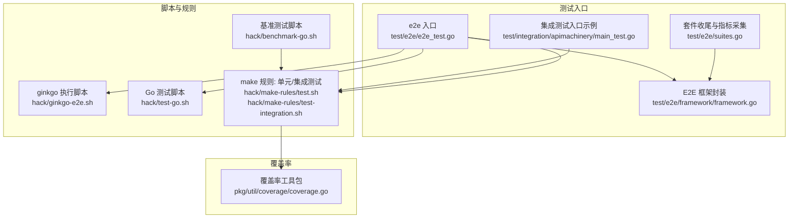
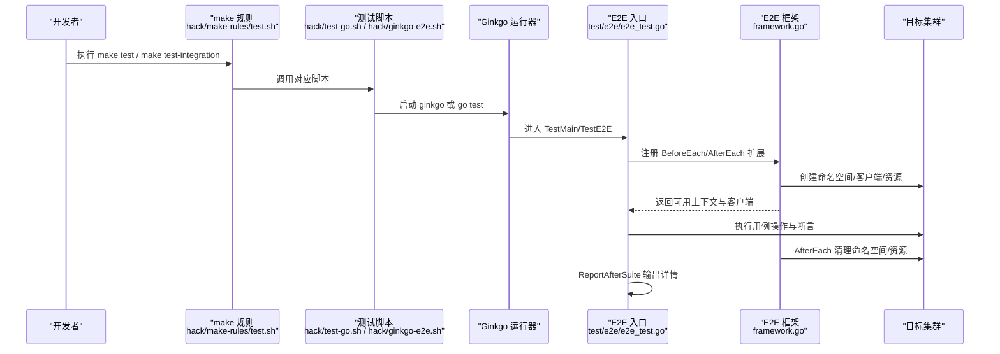
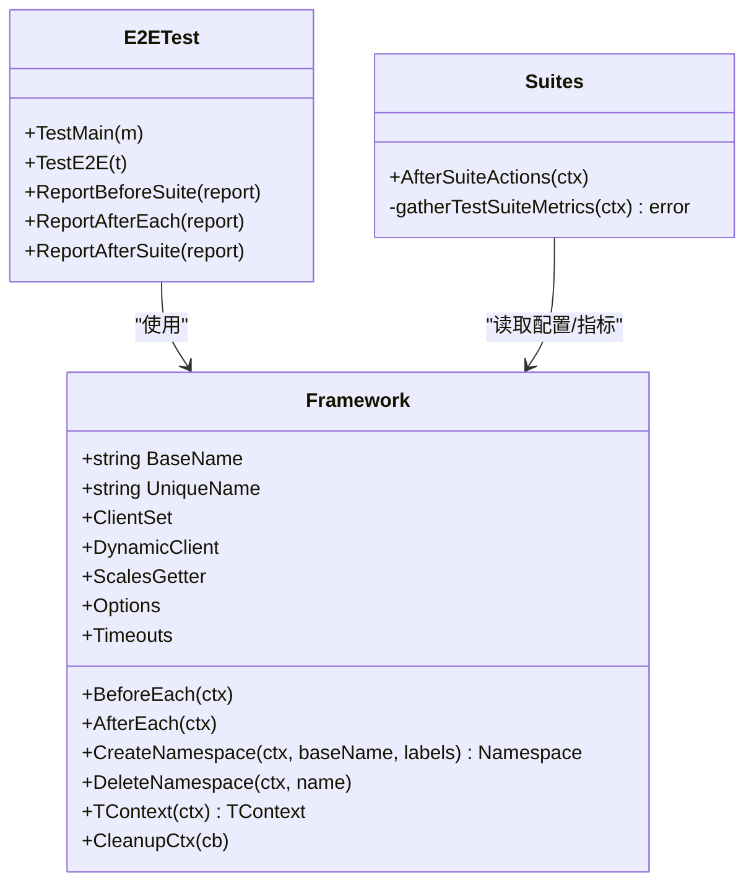
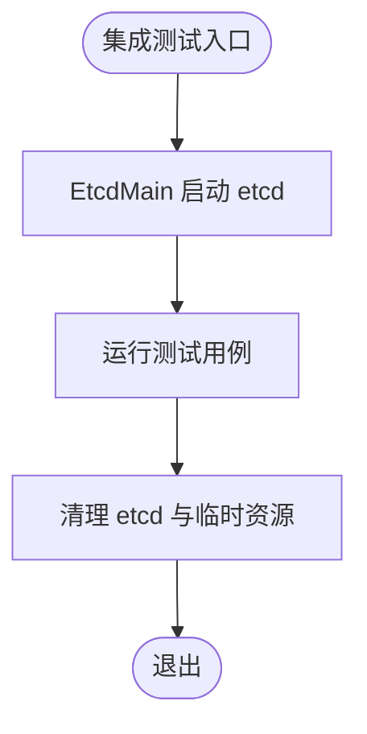
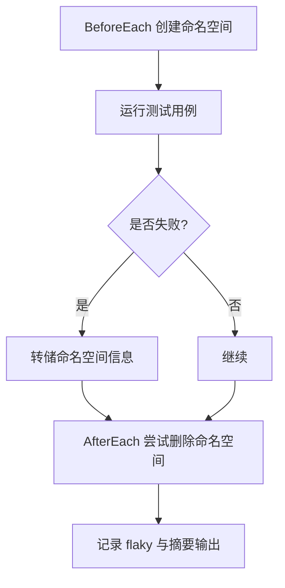
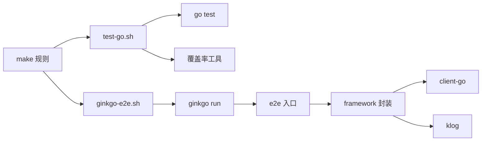

# 测试指南

<cite>
**本文引用的文件**   
- [README.md](file://README.md)
- [test/e2e/e2e_test.go](file://test/e2e/e2e_test.go)
- [test/e2e/suites.go](file://test/e2e/suites.go)
- [test/e2e/framework/framework.go](file://test/e2e/framework/framework.go)
- [test/integration/apimachinery/main_test.go](file://test/integration/apimachinery/main_test.go)
- [hack/ginkgo-e2e.sh](file://hack/ginkgo-e2e.sh)
- [hack/test-go.sh](file://hack/test-go.sh)
- [hack/make-rules/test.sh](file://hack/make-rules/test.sh)
- [hack/make-rules/test-integration.sh](file://hack/make-rules/test-integration.sh)
- [hack/benchmark-go.sh](file://hack/benchmark-go.sh)
- [pkg/util/coverage/coverage.go](file://pkg/util/coverage/coverage.go)
</cite>

## 目录
1. [简介](#简介)
2. [项目结构](#项目结构)
3. [核心组件](#核心组件)
4. [架构总览](#架构总览)
5. [详细组件分析](#详细组件分析)
6. [依赖分析](#依赖分析)
7. [性能考虑](#性能考虑)
8. [故障排查指南](#故障排查指南)
9. [结论](#结论)
10. [附录](#附录)

## 简介
本指南面向 Kubernetes 开发者，系统化阐述仓库中的测试体系与最佳实践，覆盖：
- 测试框架选择与使用（Ginkgo v2 + Gomega）
- 单元测试编写方法（mock、数据准备、断言）
- 集成测试架构与实现（测试集群、资源清理、并发）
- 端到端测试设计模式（场景设计、环境隔离、结果验证）
- 性能与基准测试（指标收集、结果分析、回归检测）
- 覆盖率统计与质量门禁
- 调试技巧与常见问题排查

## 项目结构
Kubernetes 仓库的测试代码主要分布在 test 目录下，按测试类型分层组织：
- e2e：端到端测试套件，基于 Ginkgo v2 编排，通过 framework 管理命名空间、客户端、生命周期与报告。
- integration：集成测试，围绕真实或嵌入式 etcd 启动最小化控制面进行功能验证。
- e2e_node：节点级测试，聚焦 kubelet 与运行时行为。
- conformance：合规性测试集。
- fixtures、images、utils：测试数据、镜像与工具库。

图表来源
- [test/e2e/e2e_test.go:1-196](file://test/e2e/e2e_test.go#L1-L196)
- [test/e2e/suites.go:1-81](file://test/e2e/suites.go#L1-L81)
- [test/e2e/framework/framework.go:1-800](file://test/e2e/framework/framework.go#L1-L800)
- [test/integration/apimachinery/main_test.go:1-28](file://test/integration/apimachinery/main_test.go#L1-L28)
- [hack/ginkgo-e2e.sh](file://hack/ginkgo-e2e.sh)
- [hack/test-go.sh](file://hack/test-go.sh)
- [hack/make-rules/test.sh](file://hack/make-rules/test.sh)
- [hack/make-rules/test-integration.sh](file://hack/make-rules/test-integration.sh)
- [hack/benchmark-go.sh](file://hack/benchmark-go.sh)
- [pkg/util/coverage/coverage.go](file://pkg/util/coverage/coverage.go)

章节来源
- [README.md:1-101](file://README.md#L1-L101)

## 核心组件
- E2E 测试入口与套件钩子
  - TestMain 负责注册标志位、加载内嵌清单与测试数据源、输出合规测试列表等。
  - ReportBeforeSuite/ReportAfterEach/ReportAfterSuite 用于进度上报与汇总输出。
  - AfterSuiteActions 在套件结束后收集堆栈与指标并落盘。
- E2E 框架 Framework
  - 提供 BeforeEach/AfterEach 生命周期，自动创建/删除命名空间、初始化 clientset/dynamic client、REST mapper、ScalesGetter 等。
  - 支持自定义超时、QPS/Burst、GroupVersion、PodSecurityAdmission 级别标签注入。
  - 失败时转储命名空间信息，记录 flaky 情况，统一日志输出。
- 集成测试入口
  - 每个集成测试包通过 main_test.go 调用 EtcdMain 启动最小化 etcd 环境并运行测试。

章节来源
- [test/e2e/e2e_test.go:74-143](file://test/e2e/e2e_test.go#L74-L143)
- [test/e2e/e2e_test.go:149-195](file://test/e2e/e2e_test.go#L149-L195)
- [test/e2e/suites.go:32-80](file://test/e2e/suites.go#L32-L80)
- [test/e2e/framework/framework.go:281-394](file://test/e2e/framework/framework.go#L281-L394)
- [test/e2e/framework/framework.go:452-519](file://test/e2e/framework/framework.go#L452-L519)
- [test/integration/apimachinery/main_test.go:25-27](file://test/integration/apimachinery/main_test.go#L25-L27)

## 架构总览
下图展示从 make/hack 脚本到具体测试执行的调用链，以及 E2E 框架在生命周期内的职责边界。

图表来源
- [hack/make-rules/test.sh](file://hack/make-rules/test.sh)
- [hack/test-go.sh](file://hack/test-go.sh)
- [hack/ginkgo-e2e.sh](file://hack/ginkgo-e2e.sh)
- [test/e2e/e2e_test.go:74-143](file://test/e2e/e2e_test.go#L74-L143)
- [test/e2e/framework/framework.go:281-394](file://test/e2e/framework/framework.go#L281-L394)

## 详细组件分析

### 端到端测试（E2E）
- 入口与配置
  - TestMain 中解析标志位、注册框架与集群相关标志、添加内嵌清单与测试数据源、可选列出合规测试。
  - 通过 ReportBeforeSuite/ReportAfterEach/ReportAfterSuite 完成进度与细节输出。
- 套件收尾
  - AfterSuiteActions 仅在首个节点执行，支持导出 core dump、抓取组件指标并写入报告目录。
- 框架能力
  - 自动创建命名空间并注入 PodSecurityAdmission 级别标签；支持跳过创建、等待默认 ServiceAccount 与 CA Secret。
  - 构建 clientset、dynamic client、rest mapper、scale getter，并设置 QPS/Burst 与 GroupVersion。
  - 失败时转储命名空间信息，记录 flaky 次数，统一打印摘要。
  - 提供 CleanupCtx 与 TContext 以兼容 ktesting 接口。

图表来源
- [test/e2e/e2e_test.go:74-143](file://test/e2e/e2e_test.go#L74-L143)
- [test/e2e/e2e_test.go:149-195](file://test/e2e/e2e_test.go#L149-L195)
- [test/e2e/suites.go:32-80](file://test/e2e/suites.go#L32-L80)
- [test/e2e/framework/framework.go:108-153](file://test/e2e/framework/framework.go#L108-L153)
- [test/e2e/framework/framework.go:281-394](file://test/e2e/framework/framework.go#L281-L394)
- [test/e2e/framework/framework.go:452-519](file://test/e2e/framework/framework.go#L452-L519)

章节来源
- [test/e2e/e2e_test.go:74-143](file://test/e2e/e2e_test.go#L74-L143)
- [test/e2e/e2e_test.go:149-195](file://test/e2e/e2e_test.go#L149-L195)
- [test/e2e/suites.go:32-80](file://test/e2e/suites.go#L32-L80)
- [test/e2e/framework/framework.go:281-394](file://test/e2e/framework/framework.go#L281-L394)
- [test/e2e/framework/framework.go:452-519](file://test/e2e/framework/framework.go#L452-L519)

### 集成测试
- 入口模式
  - 各集成测试包通过 main_test.go 调用 EtcdMain 启动 etcd 并运行测试，保证对 API 层的最小闭环验证。
- 典型流程
  - 启动 etcd -> 初始化测试上下文 -> 运行测试用例 -> 关闭 etcd 并回收资源。

图表来源
- [test/integration/apimachinery/main_test.go:25-27](file://test/integration/apimachinery/main_test.go#L25-L27)

章节来源
- [test/integration/apimachinery/main_test.go:25-27](file://test/integration/apimachinery/main_test.go#L25-L27)

### 单元测试与 Mock
- 框架与断言
  - E2E 与集成测试广泛采用 Ginkgo v2 作为测试框架，Gomega 作为断言库。
  - 断言风格示例可参考 apimachinery 下的 e2e 用例中对对象字段与状态的校验。
- Mock 与测试数据
  - 建议在单元测试中使用 mock 替代外部依赖（如存储、网络），并通过 fixtures 或内嵌文件系统提供稳定测试数据。
  - 对于需要访问集群资源的场景，优先使用集成测试或 E2E 框架提供的命名空间隔离。

章节来源
- [test/e2e/apimachinery/aggregator.go:452-454](file://test/e2e/apimachinery/aggregator.go#L452-L454)
- [test/e2e/apimachinery/chunking.go:98-126](file://test/e2e/apimachinery/chunking.go#L98-L126)

### 并发与资源清理
- 并发策略
  - 通过 Ginkgo 的并行选项与套件钩子在多节点上协调执行；AfterSuiteActions 仅在主节点执行收尾逻辑。
- 资源清理
  - Framework.AfterEach 负责删除命名空间与附加资源，支持保留命名空间以便调试；失败时可转储命名空间信息。

图表来源
- [test/e2e/framework/framework.go:452-519](file://test/e2e/framework/framework.go#L452-L519)
- [test/e2e/suites.go:32-44](file://test/e2e/suites.go#L32-L44)

章节来源
- [test/e2e/framework/framework.go:452-519](file://test/e2e/framework/framework.go#L452-L519)
- [test/e2e/suites.go:32-44](file://test/e2e/suites.go#L32-L44)

## 依赖分析
- 测试入口与脚本
  - make 规则与 hack 脚本驱动 go test 与 ginkgo 执行，统一参数与产物路径。
- 框架与第三方库
  - E2E 框架依赖 Ginkgo v2、client-go、klog 等；集成测试依赖内部 testing 框架与 etcd。
- 覆盖率
  - 覆盖率工具位于 pkg/util/coverage，配合测试脚本生成覆盖率数据。

图表来源
- [hack/make-rules/test.sh](file://hack/make-rules/test.sh)
- [hack/test-go.sh](file://hack/test-go.sh)
- [hack/ginkgo-e2e.sh](file://hack/ginkgo-e2e.sh)
- [test/e2e/e2e_test.go:74-143](file://test/e2e/e2e_test.go#L74-L143)
- [test/e2e/framework/framework.go:281-394](file://test/e2e/framework/framework.go#L281-L394)
- [pkg/util/coverage/coverage.go](file://pkg/util/coverage/coverage.go)

章节来源
- [hack/make-rules/test.sh](file://hack/make-rules/test.sh)
- [hack/test-go.sh](file://hack/test-go.sh)
- [hack/ginkgo-e2e.sh](file://hack/ginkgo-e2e.sh)
- [test/e2e/e2e_test.go:74-143](file://test/e2e/e2e_test.go#L74-L143)
- [test/e2e/framework/framework.go:281-394](file://test/e2e/framework/framework.go#L281-L394)
- [pkg/util/coverage/coverage.go](file://pkg/util/coverage/coverage.go)

## 性能考虑
- 指标采集
  - 套件结束后可通过 AfterSuiteActions 抓取 apiserver、scheduler、controller-manager、kubelet 等组件指标并落盘，便于回归分析。
- 基准测试
  - 使用 hack/benchmark-go.sh 执行 Go 基准测试，结合 CI 基线对比进行回归检测。
- 超时与重试
  - 利用 Framework.Timeouts 与 Ginkgo 的重试机制处理不稳定操作，避免误报。

章节来源
- [test/e2e/suites.go:46-80](file://test/e2e/suites.go#L46-L80)
- [hack/benchmark-go.sh](file://hack/benchmark-go.sh)

## 故障排查指南
- 常见现象
  - 命名空间未清理：检查 DeleteNamespace 与 DeleteNamespaceOnFailure 标志；确认 AfterEach 是否被触发。
  - 指标缺失：确认 ReportDir 是否配置且 AfterSuiteActions 已执行。
  - 断言失败：核对 Gomega 断言条件与期望值，必要时开启详细日志。
- 定位手段
  - 使用 ReportAfterSuite 输出的 spec 详情定位失败用例。
  - 失败时自动转储命名空间信息，结合日志与事件定位根因。
  - 使用 ginkgo 的聚焦与过滤选项快速复现问题。

章节来源
- [test/e2e/e2e_test.go:149-195](file://test/e2e/e2e_test.go#L149-L195)
- [test/e2e/framework/framework.go:452-519](file://test/e2e/framework/framework.go#L452-L519)

## 结论
Kubernetes 的测试体系以 Ginkgo v2 为核心，配合完善的 E2E 框架与集成测试入口，形成从单测到端到端的完整闭环。通过统一的脚本与 make 规则，开发者可以便捷地执行各类测试、采集指标与覆盖率，并在失败时获得丰富的诊断信息。建议在新功能开发中遵循命名空间隔离、明确超时与重试策略、完善断言与日志，以提升测试稳定性与可维护性。

## 附录
- 常用命令
  - 运行 E2E：参考 hack/ginkgo-e2e.sh 与 make 规则。
  - 运行 Go 测试：参考 hack/test-go.sh 与 make 规则。
  - 运行集成测试：参考 hack/make-rules/test-integration.sh。
  - 运行基准测试：参考 hack/benchmark-go.sh。
- 覆盖率
  - 使用 pkg/util/coverage 工具配合测试脚本生成覆盖率报告。

章节来源
- [hack/ginkgo-e2e.sh](file://hack/ginkgo-e2e.sh)
- [hack/test-go.sh](file://hack/test-go.sh)
- [hack/make-rules/test.sh](file://hack/make-rules/test.sh)
- [hack/make-rules/test-integration.sh](file://hack/make-rules/test-integration.sh)
- [hack/benchmark-go.sh](file://hack/benchmark-go.sh)
- [pkg/util/coverage/coverage.go](file://pkg/util/coverage/coverage.go)