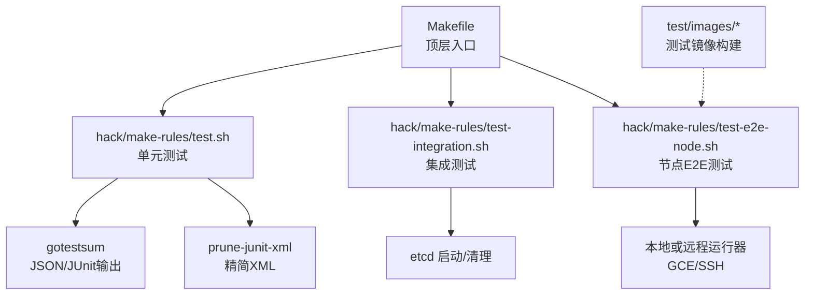
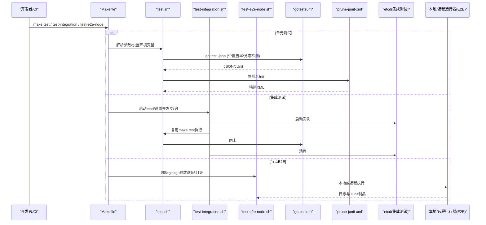
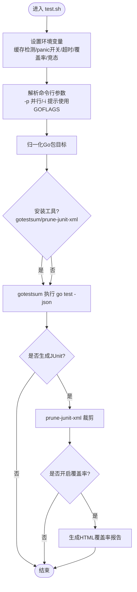
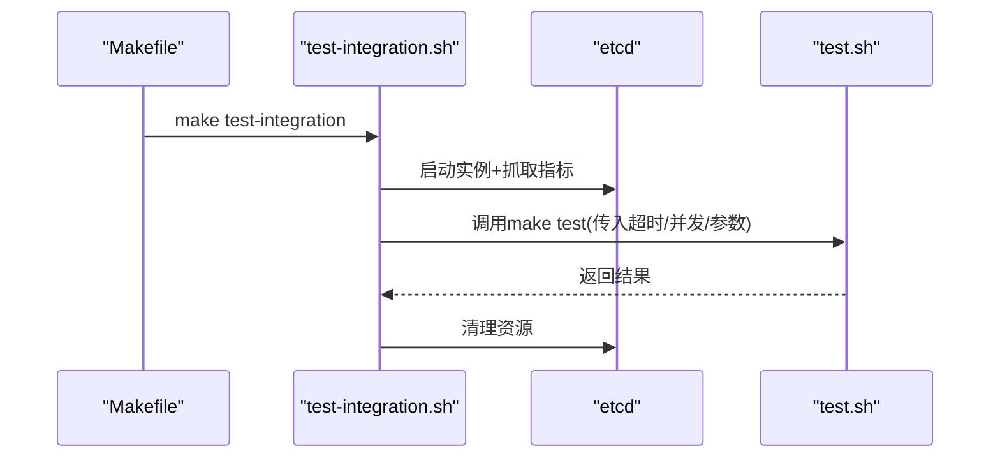
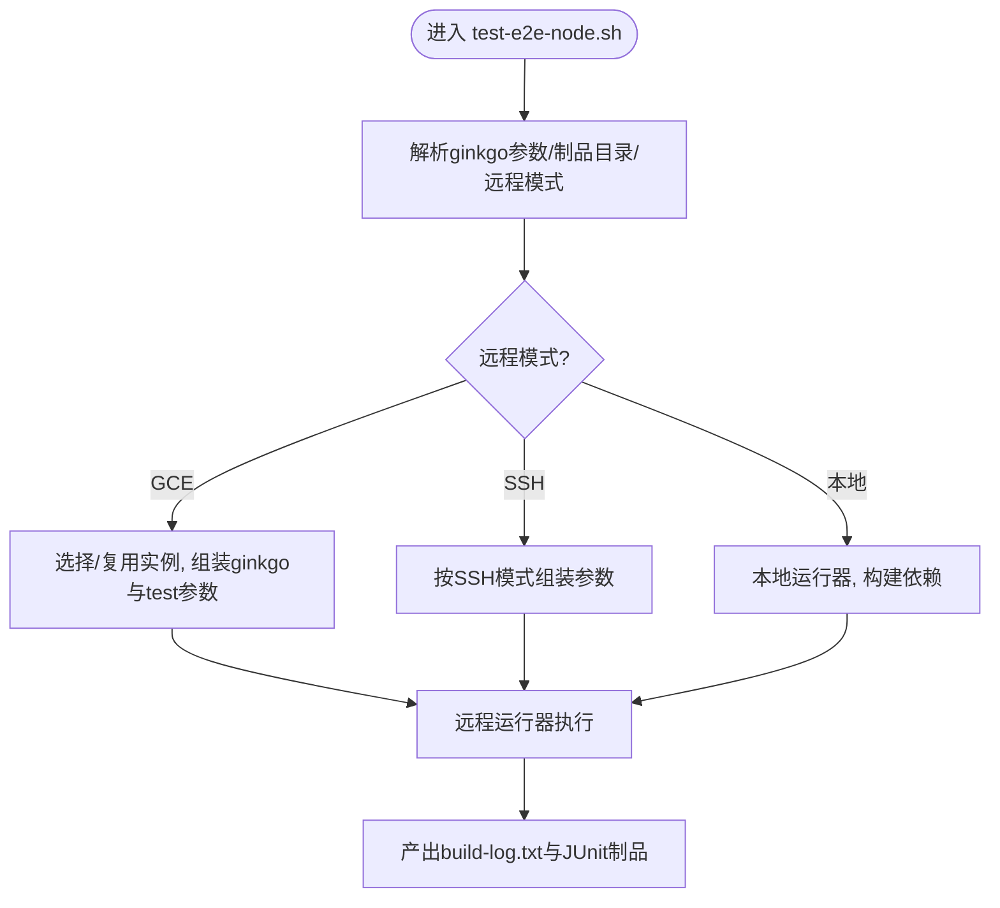
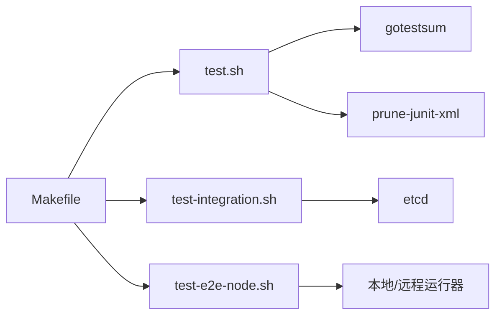

# 测试自动化

<cite>
**本文引用的文件**   
- [Makefile](file://Makefile)
- [hack/make-rules/test.sh](file://hack/make-rules/test.sh)
- [hack/make-rules/test-integration.sh](file://hack/make-rules/test-integration.sh)
- [hack/make-rules/test-e2e-node.sh](file://hack/make-rules/test-e2e-node.sh)
- [hack/lib/test.sh](file://hack/lib/test.sh)
- [cmd/prune-junit-xml/prunexml.go](file://cmd/prune-junit-xml/prunexml.go)
- [test/images/agnhost/Dockerfile](file://test/images/agnhost/Dockerfile)
- [test/images/agnhost/Makefile](file://test/images/agnhost/Makefile)
- [test/images/Makefile](file://test/images/Makefile)
</cite>

## 目录
1. [简介](#简介)
2. [项目结构](#项目结构)
3. [核心组件](#核心组件)
4. [架构总览](#架构总览)
5. [详细组件分析](#详细组件分析)
6. [依赖关系分析](#依赖关系分析)
7. [性能考虑](#性能考虑)
8. [故障排查指南](#故障排查指南)
9. [结论](#结论)
10. [附录](#附录)

## 简介
本指南面向 Kubernetes 开发者，系统化阐述在 CI/CD 流水线中实现测试自动化的方法与实践。内容覆盖：
- GitHub Actions 工作流编写、任务调度与结果通知（结合仓库现有脚本能力）
- 测试脚本的编写与管理（Makefile 规则、参数配置、并行控制）
- 测试环境自动化搭建（Docker 镜像构建、集群初始化、测试数据准备）
- 测试结果收集与分析（JUnit 报告、覆盖率统计、质量门禁）
- 多平台（Linux、Windows、macOS）测试自动化示例
- 故障排查与持续改进建议

## 项目结构
仓库围绕“顶层 Makefile + hack/make-rules 子脚本 + 工具链”组织测试自动化能力：
- 顶层 Makefile 暴露常用目标（如 test、test-integration、test-e2e-node），统一入口
- hack/make-rules 下提供具体执行逻辑（单元测试、集成测试、节点端到端测试）
- hack/lib 提供通用库函数（日志、断言等）
- cmd/prune-junit-xml 用于精简 JUnit XML 输出
- test/images 包含测试用镜像源码与构建脚本

图表来源
- [Makefile:1-517](file://Makefile#L1-L517)
- [hack/make-rules/test.sh:1-374](file://hack/make-rules/test.sh#L1-L374)
- [hack/make-rules/test-integration.sh:1-124](file://hack/make-rules/test-integration.sh#L1-L124)
- [hack/make-rules/test-e2e-node.sh:1-290](file://hack/make-rules/test-e2e-node.sh#L1-L290)
- [cmd/prune-junit-xml/prunexml.go:1-200](file://cmd/prune-junit-xml/prunexml.go#L1-L200)

章节来源
- [Makefile:1-517](file://Makefile#L1-L517)

## 核心组件
- 顶层测试入口
  - make test / make check：调用 hack/make-rules/test.sh，支持 KUBE_COVER、KUBE_RACE、PARALLEL、KUBE_TIMEOUT、KUBE_JUNIT_REPORT_DIR 等参数
  - make test-integration：调用 hack/make-rules/test-integration.sh，自动启停 etcd，并复用 make test
  - make test-e2e-node：调用 hack/make-rules/test-e2e-node.sh，支持本地与远程（GCE/SSH）两种模式
- 测试执行引擎
  - gotestsum：生成 JSON 与 JUnit XML；可切换格式以适配不同 CI 系统
  - prune-junit-xml：对 JUnit XML 进行裁剪，减少体积与噪声
- 辅助库
  - hack/lib/test.sh：提供 kubectl 相关断言、版本比较、结果对比等工具函数

章节来源
- [Makefile:169-312](file://Makefile#L169-L312)
- [hack/make-rules/test.sh:75-102](file://hack/make-rules/test.sh#L75-L102)
- [hack/make-rules/test-integration.sh:85-107](file://hack/make-rules/test-integration.sh#L85-L107)
- [hack/make-rules/test-e2e-node.sh:72-98](file://hack/make-rules/test-e2e-node.sh#L72-L98)
- [hack/lib/test.sh:28-133](file://hack/lib/test.sh#L28-L133)

## 架构总览
下图展示从 Makefile 到各测试类型的执行路径、产物与外部依赖的关系。

图表来源
- [Makefile:169-312](file://Makefile#L169-L312)
- [hack/make-rules/test.sh:204-345](file://hack/make-rules/test.sh#L204-L345)
- [hack/make-rules/test-integration.sh:85-107](file://hack/make-rules/test-integration.sh#L85-L107)
- [hack/make-rules/test-e2e-node.sh:217-289](file://hack/make-rules/test-e2e-node.sh#L217-L289)

## 详细组件分析

### 单元测试执行流程（test.sh）
- 关键特性
  - 默认启用缓存变更检测与 watch 解码错误 panic 开关
  - 支持 KUBE_COVER/KUBE_COVERMODE/KUBE_COVER_REPORT_DIR 生成覆盖率
  - 支持 KUBE_RACE 开启竞态检测
  - 通过 PARALLEL 控制 go test 并行度
  - 通过 KUBE_TIMEOUT 控制单个包超时
  - 自动生成 JUnit XML，并可保留原始 JSON 以便调试
  - 使用 prune-junit-xml 裁剪 XML，减小体积
- 典型变量
  - KUBE_TEST_ARGS：透传给 go test 的参数（含 -args 后的二进制参数）
  - FULL_LOG：切换 gotestsum 输出格式为 verbose
  - ARTIFACTS：若未显式设置 KUBE_JUNIT_REPORT_DIR，则自动对齐至该目录

图表来源
- [hack/make-rules/test.sh:27-102](file://hack/make-rules/test.sh#L27-L102)
- [hack/make-rules/test.sh:118-194](file://hack/make-rules/test.sh#L118-L194)
- [hack/make-rules/test.sh:204-345](file://hack/make-rules/test.sh#L204-L345)

章节来源
- [hack/make-rules/test.sh:1-374](file://hack/make-rules/test.sh#L1-L374)

### 集成测试执行流程（test-integration.sh）
- 关键特性
  - 自动启动 etcd 并在退出时清理
  - 支持 KUBE_INTEGRATION_TEST_MAX_CONCURRENCY 控制 GOMAXPROCS
  - 默认更长的超时时间，便于复杂场景
  - 内部复用 make test 执行实际用例
- 典型变量
  - KUBE_TEST_ARGS：透传给 go test
  - SHORT：控制是否仅运行短用例
  - KUBE_TEST_VMODULE：glog vmodule 设置

图表来源
- [hack/make-rules/test-integration.sh:38-52](file://hack/make-rules/test-integration.sh#L38-L52)
- [hack/make-rules/test-integration.sh:85-107](file://hack/make-rules/test-integration.sh#L85-L107)

章节来源
- [hack/make-rules/test-integration.sh:1-124](file://hack/make-rules/test-integration.sh#L1-L124)

### 节点端到端测试（test-e2e-node.sh）
- 关键特性
  - 支持本地与远程（GCE/SSH）两种模式
  - 支持 ginkgo 过滤（focus/skip/label-filter）、并行节点数、直到失败重试
  - 制品目录统一写入 artifacts，包含 build-log.txt 与 junit.xml
  - 支持容器运行时与镜像服务端点、预拉取镜像、系统规格校验
- 典型变量
  - PARALLELISM、FOCUS、SKIP、LABEL_FILTER、TEST_ARGS、ARTIFACTS、REMOTE、REMOTE_MODE
  - SYSTEM_SPEC_NAME、IMAGE_PROJECT、INSTANCE_TYPE、SSH_USER/KEY/OPTIONS

图表来源
- [hack/make-rules/test-e2e-node.sh:30-98](file://hack/make-rules/test-e2e-node.sh#L30-L98)
- [hack/make-rules/test-e2e-node.sh:217-289](file://hack/make-rules/test-e2e-node.sh#L217-L289)

章节来源
- [hack/make-rules/test-e2e-node.sh:1-290](file://hack/make-rules/test-e2e-node.sh#L1-L290)

### 测试辅助库（hack/lib/test.sh）
- 提供丰富的断言与对比工具，便于编写稳定可靠的测试脚本
- 典型能力
  - 对象查询断言（get/describe/jsonpath）
  - 事件存在性断言
  - 版本信息导出与差异比较
  - 标准输出/错误输出与返回码对比

章节来源
- [hack/lib/test.sh:28-133](file://hack/lib/test.sh#L28-L133)
- [hack/lib/test.sh:419-572](file://hack/lib/test.sh#L419-L572)

### 结果处理与报告（prune-junit-xml）
- 作用：对 JUnit XML 进行裁剪，仅保留顶层测试项，降低存储与传输成本
- 触发时机：在单元测试执行后由 test.sh 统一调用

章节来源
- [cmd/prune-junit-xml/prunexml.go:1-200](file://cmd/prune-junit-xml/prunexml.go#L1-L200)
- [hack/make-rules/test.sh:334-336](file://hack/make-rules/test.sh#L334-L336)

### 测试镜像与数据准备（test/images）
- agnhost 等测试镜像提供网络、挂载、证书、Webhook 等基础能力
- 通过各自 Dockerfile 与 Makefile 构建，供 e2e/integration 使用

章节来源
- [test/images/agnhost/Dockerfile:1-200](file://test/images/agnhost/Dockerfile#L1-L200)
- [test/images/agnhost/Makefile:1-200](file://test/images/agnhost/Makefile#L1-L200)
- [test/images/Makefile:1-200](file://test/images/Makefile#L1-L200)

## 依赖关系分析
- Makefile 作为统一入口，将不同测试类型委派给对应脚本
- test.sh 依赖 gotestsum 与 prune-junit-xml，二者在安装阶段按需获取
- test-integration.sh 依赖 etcd 二进制，负责生命周期管理
- test-e2e-node.sh 依赖 ginkgo 与远程运行器（Go 程序），根据 REMOTE_MODE 选择执行路径

图表来源
- [Makefile:169-312](file://Makefile#L169-L312)
- [hack/make-rules/test.sh:213-223](file://hack/make-rules/test.sh#L213-L223)
- [hack/make-rules/test-integration.sh:109-118](file://hack/make-rules/test-integration.sh#L109-L118)
- [hack/make-rules/test-e2e-node.sh:217-289](file://hack/make-rules/test-e2e-node.sh#L217-L289)

章节来源
- [Makefile:1-517](file://Makefile#L1-L517)

## 性能考虑
- 并行度
  - 单元测试：通过 PARALLEL 控制 go test 并行度；合理设置避免资源争用
  - 集成测试：通过 KUBE_INTEGRATION_TEST_MAX_CONCURRENCY 调整 GOMAXPROCS
  - 节点E2E：通过 PARALLELISM 控制 ginkgo nodes
- 超时与重试
  - 单元测试默认较短超时；集成测试默认更长；E2E 支持 --until-it-fails
- 覆盖率开销
  - 开启覆盖率会显著增加编译与运行时间，建议在 nightly 或发布前流水线启用
- 制品与日志
  - 使用 KUBE_KEEP_VERBOSE_TEST_OUTPUT 仅在需要时保留 JSON 原始输出，避免过大

[本节为通用指导，不直接分析具体文件]

## 故障排查指南
- 常见问题定位
  - 找不到 etcd：集成测试要求 etcd 在 PATH 中，可使用仓库提供的安装脚本
  - 文件描述符限制过低：test.sh 会在 macOS 上检查 ulimit -n，建议至少 1000
  - 覆盖率报告缺失：确认 KUBE_COVER=y 且 KUBE_COVER_REPORT_DIR 已设置或未设置（将使用临时目录）
  - JUnit 报告为空或过大：检查 KUBE_JUNIT_REPORT_DIR 与 ARTIFACTS 映射；必要时启用 prune
- 快速自检清单
  - 本地先运行 make test 与 make test-integration，确保基础链路畅通
  - 在 CI 中设置 ARTIFACTS 并上传 JUnit 与 HTML 覆盖率报告
  - 针对不稳定用例，优先使用 LABEL_FILTER 或 FOCUS/SKIP 缩小范围复现

章节来源
- [hack/make-rules/test-integration.sh:109-118](file://hack/make-rules/test-integration.sh#L109-L118)
- [hack/make-rules/test.sh:357-367](file://hack/make-rules/test.sh#L357-L367)
- [hack/make-rules/test.sh:91-96](file://hack/make-rules/test.sh#L91-L96)

## 结论
Kubernetes 仓库提供了完善的测试自动化基础设施：统一的 Makefile 入口、分层清晰的测试脚本、成熟的产物处理与报告机制。借助这些能力，可以在 CI/CD 中高效地编排单元测试、集成测试与节点 E2E 测试，并实现跨平台、可观测、可回归的质量保障体系。

[本节为总结性内容，不直接分析具体文件]

## 附录

### GitHub Actions 工作流示例（概念性说明）
- 触发条件
  - push/PR 触发全量测试；特定路径变更触发增量测试
- 作业划分
  - unit-tests：执行 make test，设置 KUBE_JUNIT_REPORT_DIR=artifacts，上传 junit*.xml
  - integration-tests：执行 make test-integration，上传 junit*.xml
  - node-e2e：执行 make test-e2e-node（本地或远程），上传 artifacts
- 结果通知
  - 基于 JUnit 报告聚合结果；失败时发送 Slack/邮件通知
- 覆盖率门禁
  - 在 nightly 或 release 分支启用 KUBE_COVER=y，生成 HTML 报告并归档
- 多平台矩阵
  - 使用 matrix 指定 os: [ubuntu-latest, windows-latest, macos-latest]，分别执行相应目标
- 缓存与加速
  - 缓存 Go module、gotestsum 与工具链，缩短冷启动时间

[本节为概念性说明，不直接分析具体文件]

### 多平台测试要点
- Linux
  - 推荐容器化执行，利用缓存层与并行度最大化吞吐
- Windows
  - 注意路径分隔符与权限模型；E2E 远程模式可通过 SSH 或云厂商 SDK 管理实例
- macOS
  - 关注 ulimit 限制与文件系统大小写敏感性；必要时提升文件描述符上限

[本节为通用指导，不直接分析具体文件]