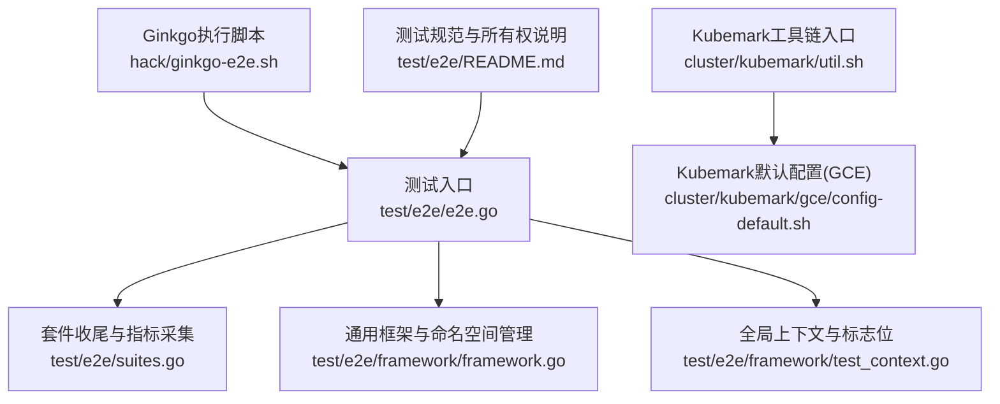
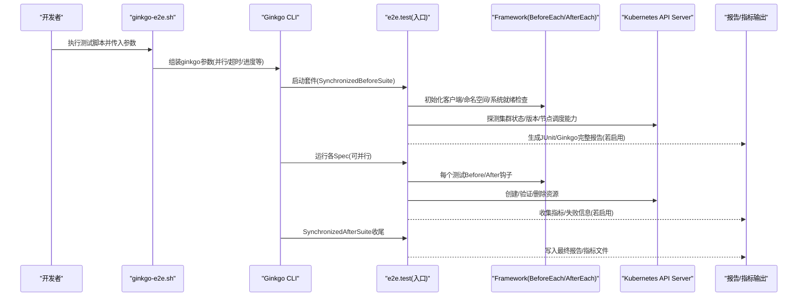
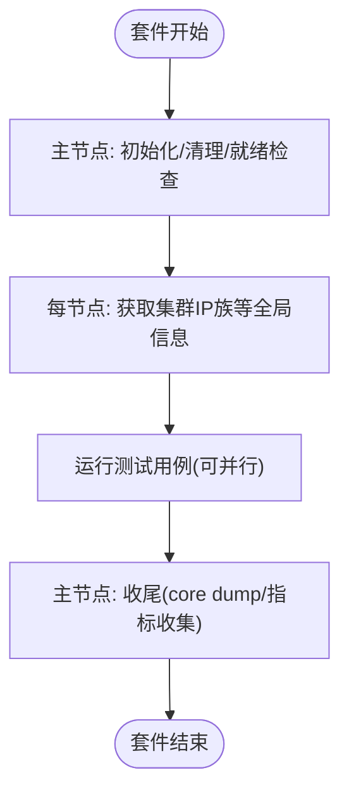
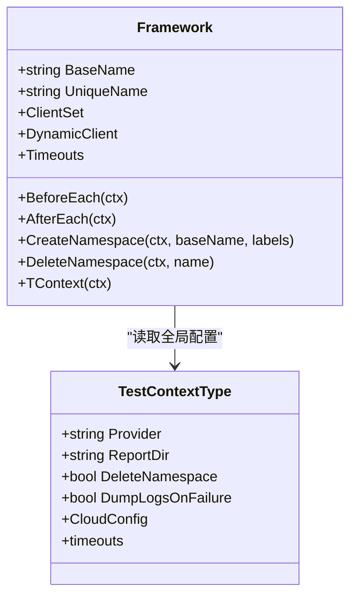
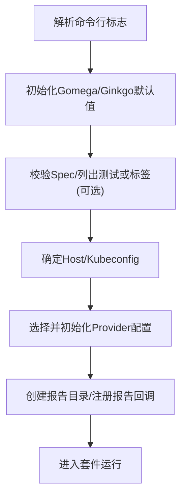
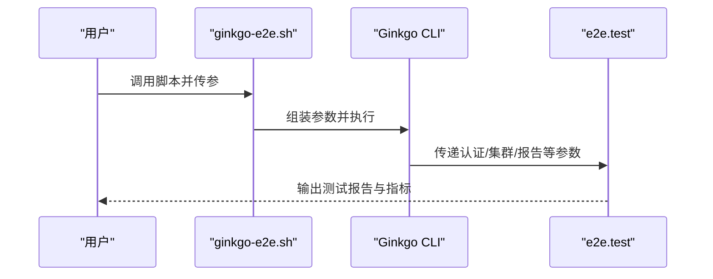
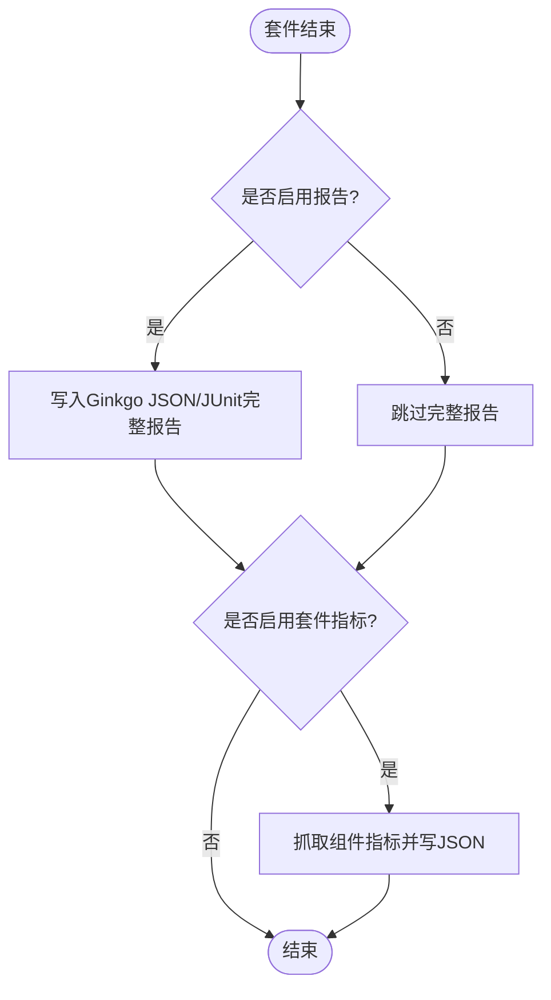
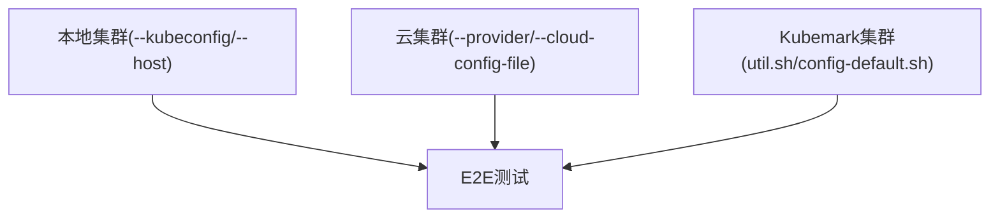
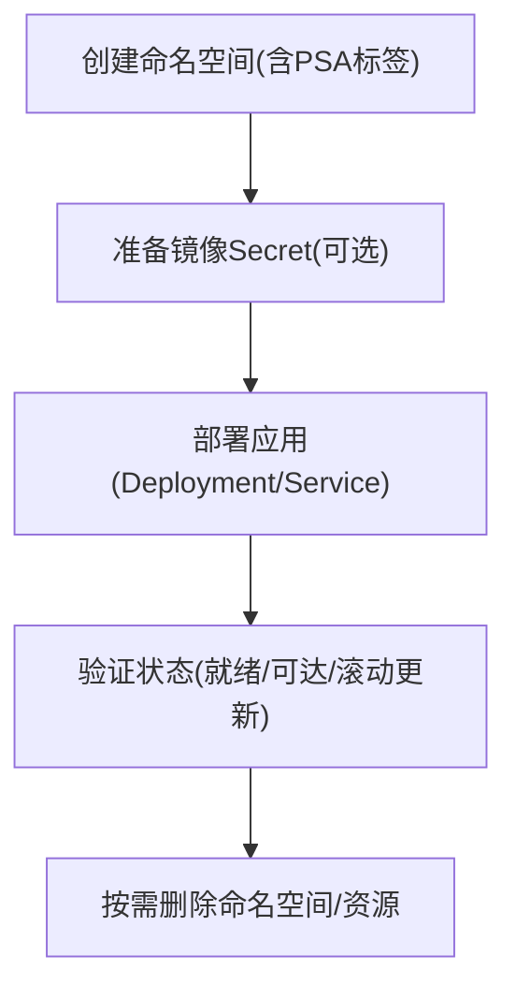
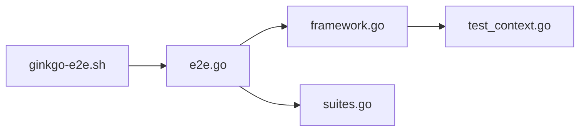

# 端到端测试

<cite>
**本文引用的文件**   
- [hack/ginkgo-e2e.sh](file://hack/ginkgo-e2e.sh)
- [test/e2e/e2e.go](file://test/e2e/e2e.go)
- [test/e2e/suites.go](file://test/e2e/suites.go)
- [test/e2e/framework/framework.go](file://test/e2e/framework/framework.go)
- [test/e2e/framework/test_context.go](file://test/e2e/framework/test_context.go)
- [test/e2e/README.md](file://test/e2e/README.md)
- [cluster/kubemark/util.sh](file://cluster/kubemark/util.sh)
- [cluster/kubemark/gce/config-default.sh](file://cluster/kubemark/gce/config-default.sh)
</cite>

## 目录
1. [简介](#简介)
2. [项目结构](#项目结构)
3. [核心组件](#核心组件)
4. [架构总览](#架构总览)
5. [详细组件分析](#详细组件分析)
6. [依赖关系分析](#依赖关系分析)
7. [性能与稳定性考量](#性能与稳定性考量)
8. [故障排查指南](#故障排查指南)
9. [结论](#结论)
10. [附录](#附录)

## 简介
本指南面向Kubernetes开发者，系统化阐述端到端（E2E）测试的设计模式、架构与落地实践。内容覆盖：
- 测试场景设计与环境隔离策略
- 基于Ginkgo的测试套件组织与数据生命周期管理
- 测试集群搭建与管理（本地、云、kubemark）
- 测试结果收集、失败分析与性能指标监控
- 复杂业务场景的端到端实现思路（应用部署、服务发现、滚动更新等）
- 调试技巧与故障排查方法

## 项目结构
Kubernetes E2E测试位于 test/e2e 目录，采用按特性域分层的组织方式，并通过统一的框架与入口进行编排。关键位置包括：
- 测试入口与套件初始化：test/e2e/e2e.go、test/e2e/suites.go
- 通用框架与上下文：test/e2e/framework/framework.go、test/e2e/framework/test_context.go
- 运行脚本与参数注入：hack/ginkgo-e2e.sh
- 测试规范与所有权约定：test/e2e/README.md
- Kubemark集群配置：cluster/kubemark/util.sh、cluster/kubemark/gce/config-default.sh

**图表来源** 
- [test/e2e/e2e.go:69-111](file://test/e2e/e2e.go#L69-L111)
- [test/e2e/suites.go:32-80](file://test/e2e/suites.go#L32-L80)
- [test/e2e/framework/framework.go:281-394](file://test/e2e/framework/framework.go#L281-L394)
- [test/e2e/framework/test_context.go:369-379](file://test/e2e/framework/test_context.go#L369-L379)
- [hack/ginkgo-e2e.sh:178-298](file://hack/ginkgo-e2e.sh#L178-L298)
- [test/e2e/README.md:1-79](file://test/e2e/README.md#L1-L79)
- [cluster/kubemark/util.sh:17-21](file://cluster/kubemark/util.sh#L17-L21)
- [cluster/kubemark/gce/config-default.sh:26-62](file://cluster/kubemark/gce/config-default.sh#L26-L62)

**章节来源**
- [test/e2e/e2e.go:69-111](file://test/e2e/e2e.go#L69-L111)
- [test/e2e/suites.go:32-80](file://test/e2e/suites.go#L32-L80)
- [test/e2e/framework/framework.go:281-394](file://test/e2e/framework/framework.go#L281-L394)
- [test/e2e/framework/test_context.go:369-379](file://test/e2e/framework/test_context.go#L369-L379)
- [hack/ginkgo-e2e.sh:178-298](file://hack/ginkgo-e2e.sh#L178-L298)
- [test/e2e/README.md:1-79](file://test/e2e/README.md#L1-L79)
- [cluster/kubemark/util.sh:17-21](file://cluster/kubemark/util.sh#L17-L21)
- [cluster/kubemark/gce/config-default.sh:26-62](file://cluster/kubemark/gce/config-default.sh#L26-L62)

## 核心组件
- 测试入口与套件生命周期
  - 使用Ginkgo v2的SynchronizedBeforeSuite/SynchronizedAfterSuite完成跨节点的全局初始化与收尾。
  - 在启动时加载客户端、清理历史命名空间、等待系统Pod就绪、可选预拉取镜像、记录版本信息等。
- 通用框架
  - Framework封装了ClientSet/DynamicClient创建、命名空间生命周期、失败后信息转储、Flake统计、超时上下文等。
  - BeforeEach/AfterEach确保每个测试拥有独立命名空间与资源隔离。
- 全局上下文与标志位
  - TestContextType集中管理所有命令行参数、报告路径、Provider、超时、日志与指标开关等。
  - AfterReadingAllFlags负责统一初始化Gomega/Ginkgo行为、生成JUnit/Ginkgo完整报告、设置默认Host等。
- 执行脚本
  - hack/ginkgo-e2e.sh负责组装ginkgo与e2e.test的参数，支持并行、进度轮询、颜色输出、调试器集成、SIGTERM转发等。

**章节来源**
- [test/e2e/e2e.go:69-111](file://test/e2e/e2e.go#L69-L111)
- [test/e2e/e2e.go:177-256](file://test/e2e/e2e.go#L177-L256)
- [test/e2e/framework/framework.go:281-394](file://test/e2e/framework/framework.go#L281-L394)
- [test/e2e/framework/test_context.go:369-379](file://test/e2e/framework/test_context.go#L369-L379)
- [test/e2e/framework/test_context.go:449-596](file://test/e2e/framework/test_context.go#L449-L596)
- [hack/ginkgo-e2e.sh:178-298](file://hack/ginkgo-e2e.sh#L178-L298)

## 架构总览
下图展示了从脚本到测试执行的端到端流程，以及结果与指标的产出点。

**图表来源** 
- [hack/ginkgo-e2e.sh:178-298](file://hack/ginkgo-e2e.sh#L178-L298)
- [test/e2e/e2e.go:69-111](file://test/e2e/e2e.go#L69-L111)
- [test/e2e/framework/framework.go:281-394](file://test/e2e/framework/framework.go#L281-L394)
- [test/e2e/framework/test_context.go:553-596](file://test/e2e/framework/test_context.go#L553-L596)
- [test/e2e/suites.go:32-80](file://test/e2e/suites.go#L32-L80)

## 详细组件分析

### 测试入口与套件生命周期
- 同步前置：仅在主节点执行一次，用于清理历史命名空间、等待系统Pod/DS就绪、预拉取镜像、记录版本等。
- 每节点前置：获取集群IP族等信息，供后续测试适配IPv4/IPv6。
- 同步后置：在全部节点完成后执行，如导出core dump、抓取套件级指标。

**图表来源** 
- [test/e2e/e2e.go:69-111](file://test/e2e/e2e.go#L69-L111)
- [test/e2e/e2e.go:177-256](file://test/e2e/e2e.go#L177-L256)
- [test/e2e/suites.go:32-80](file://test/e2e/suites.go#L32-L80)

**章节来源**
- [test/e2e/e2e.go:69-111](file://test/e2e/e2e.go#L69-L111)
- [test/e2e/e2e.go:177-256](file://test/e2e/e2e.go#L177-L256)
- [test/e2e/suites.go:32-80](file://test/e2e/suites.go#L32-L80)

### 通用框架与命名空间隔离
- Framework.BeforeEach：创建ClientSet/DynamicClient、构建RESTMapper、创建命名空间、可选创建ImagePullSecret、注册DeferCleanup。
- Framework.AfterEach：根据配置决定是否删除命名空间；失败时转储命名空间信息；汇总Flake统计与摘要输出。
- 命名空间安全：通过PSA标签控制PodSecurity级别，默认restricted。

**图表来源** 
- [test/e2e/framework/framework.go:108-153](file://test/e2e/framework/framework.go#L108-L153)
- [test/e2e/framework/framework.go:281-394](file://test/e2e/framework/framework.go#L281-L394)
- [test/e2e/framework/framework.go:452-519](file://test/e2e/framework/framework.go#L452-L519)
- [test/e2e/framework/test_context.go:99-225](file://test/e2e/framework/test_context.go#L99-L225)

**章节来源**
- [test/e2e/framework/framework.go:281-394](file://test/e2e/framework/framework.go#L281-L394)
- [test/e2e/framework/framework.go:452-519](file://test/e2e/framework/framework.go#L452-L519)
- [test/e2e/framework/test_context.go:99-225](file://test/e2e/framework/test_context.go#L99-L225)

### 全局上下文与标志位
- RegisterCommonFlags/RegisterClusterFlags：集中注册常用与集群相关标志位，如report-dir、provider、num-nodes、prepull-images等。
- AfterReadingAllFlags：统一初始化Gomega/Ginkgo默认值、校验Spec、准备报告目录、生成JUnit/Ginkgo完整报告、设置默认Host与BearerToken、选择Provider等。

**图表来源** 
- [test/e2e/framework/test_context.go:309-432](file://test/e2e/framework/test_context.go#L309-L432)
- [test/e2e/framework/test_context.go:449-596](file://test/e2e/framework/test_context.go#L449-L596)

**章节来源**
- [test/e2e/framework/test_context.go:309-432](file://test/e2e/framework/test_context.go#L309-L432)
- [test/e2e/framework/test_context.go:449-596](file://test/e2e/framework/test_context.go#L449-L596)

### 执行脚本与参数注入
- 脚本职责：
  - 查找ginkgo与e2e.test二进制
  - 组装ginkgo参数（并行节点数、超时、进度轮询、颜色、跳过规则等）
  - 根据调试工具切换执行器（ginkgo/dlv/gdb）
  - 将认证与集群参数传递给e2e.test（kubeconfig、host、provider、区域、网络、前缀等）
  - 支持SIGTERM转发以在CI中捕获最后进度
- 典型参数：
  - --nodes/--poll-progress-after/--timeout/--skip/--no-color
  - --kubeconfig/--host/--provider/--gce-project/--gce-zone/--network/--prefix等

**图表来源** 
- [hack/ginkgo-e2e.sh:178-298](file://hack/ginkgo-e2e.sh#L178-L298)

**章节来源**
- [hack/ginkgo-e2e.sh:178-298](file://hack/ginkgo-e2e.sh#L178-L298)

### 测试报告与指标
- 报告生成：
  - 通过TestContext.ReportDir指定输出目录
  - 支持Ginkgo JSON与JUnit XML完整报告
  - 套件结束后生成精简版JUnit报告
- 指标采集：
  - 套件结束后可通过gather-suite-metrics-at-teardown开启
  - 采集apiserver、scheduler、controller-manager、kubelet及可选Cluster Autoscaler指标，并落盘为JSON

**图表来源** 
- [test/e2e/framework/test_context.go:553-596](file://test/e2e/framework/test_context.go#L553-L596)
- [test/e2e/suites.go:46-80](file://test/e2e/suites.go#L46-L80)

**章节来源**
- [test/e2e/framework/test_context.go:553-596](file://test/e2e/framework/test_context.go#L553-L596)
- [test/e2e/suites.go:46-80](file://test/e2e/suites.go#L46-L80)

### 测试集群搭建与管理
- 本地集群：
  - 通过--kubeconfig/--host连接已有集群；未提供时使用in-cluster或默认localhost。
- 云集群：
  - 通过--provider与对应cloud-config-file、gce-*、gke-*等参数配置。
- Kubemark集群：
  - 通过cluster/kubemark/util.sh引入具体云平台配置与默认参数。
  - cluster/kubemark/gce/config-default.sh定义NUM_NODES、日志级别、DNS域名、是否启用CA等。

**图表来源** 
- [test/e2e/framework/test_context.go:489-531](file://test/e2e/framework/test_context.go#L489-L531)
- [cluster/kubemark/util.sh:17-21](file://cluster/kubemark/util.sh#L17-L21)
- [cluster/kubemark/gce/config-default.sh:26-62](file://cluster/kubemark/gce/config-default.sh#L26-L62)

**章节来源**
- [test/e2e/framework/test_context.go:489-531](file://test/e2e/framework/test_context.go#L489-L531)
- [cluster/kubemark/util.sh:17-21](file://cluster/kubemark/util.sh#L17-L21)
- [cluster/kubemark/gce/config-default.sh:26-62](file://cluster/kubemark/gce/config-default.sh#L26-L62)

### 测试场景设计与数据生命周期
- 设计模式：
  - 使用SIGDescribe组织测试归属，结合feature标签与描述性标题。
  - 每个测试通过Framework创建独立命名空间，避免相互干扰。
- 数据生命周期：
  - BeforeEach创建命名空间与必要Secret（私有镜像仓库），AfterEach按需删除。
  - 失败时自动转储命名空间信息，便于定位问题。
- 示例场景（概念性说明）：
  - 应用部署测试：创建Deployment/Service，验证Pod就绪与服务可达。
  - 服务发现测试：通过ClusterIP/Headless Service验证DNS解析与负载均衡。
  - 滚动更新测试：更新Deployment版本，观察RollingUpdate策略与回滚。

[此图为概念流程图，不直接映射具体源码文件]

**章节来源**
- [test/e2e/README.md:1-79](file://test/e2e/README.md#L1-L79)
- [test/e2e/framework/framework.go:554-599](file://test/e2e/framework/framework.go#L554-L599)
- [test/e2e/framework/framework.go:452-519](file://test/e2e/framework/framework.go#L452-L519)

## 依赖关系分析
- 入口与框架：
  - e2e.go依赖framework与reporters，负责套件生命周期与全局初始化。
  - suites.go在套件收尾阶段聚合指标与dump。
- 框架与上下文：
  - framework.go依赖client-go、ginkgo/gomega、admission api，提供命名空间与客户端管理。
  - test_context.go集中注册标志位与报告逻辑。
- 执行脚本：
  - ginkgo-e2e.sh作为外部驱动，组装参数并调用e2e.test。

**图表来源** 
- [test/e2e/e2e.go:69-111](file://test/e2e/e2e.go#L69-L111)
- [test/e2e/suites.go:32-80](file://test/e2e/suites.go#L32-L80)
- [test/e2e/framework/framework.go:281-394](file://test/e2e/framework/framework.go#L281-L394)
- [test/e2e/framework/test_context.go:369-379](file://test/e2e/framework/test_context.go#L369-L379)
- [hack/ginkgo-e2e.sh:178-298](file://hack/ginkgo-e2e.sh#L178-L298)

**章节来源**
- [test/e2e/e2e.go:69-111](file://test/e2e/e2e.go#L69-L111)
- [test/e2e/suites.go:32-80](file://test/e2e/suites.go#L32-L80)
- [test/e2e/framework/framework.go:281-394](file://test/e2e/framework/framework.go#L281-L394)
- [test/e2e/framework/test_context.go:369-379](file://test/e2e/framework/test_context.go#L369-L379)
- [hack/ginkgo-e2e.sh:178-298](file://hack/ginkgo-e2e.sh#L178-L298)

## 性能与稳定性考量
- 并行执行：
  - 通过--nodes控制并行度；当启用race检测时建议降低并行数以减少内存压力。
- 进度与超时：
  - 使用--poll-progress-after/--poll-progress-interval监控长时间运行的测试；合理设置--timeout避免卡死。
- 资源与镜像：
  - 使用--prepull-images预拉取镜像，降低因镜像拉取导致的抖动。
  - 允许少量非就绪节点(--allowed-not-ready-nodes)以适应大规模集群的不稳定因素。
- 指标与日志：
  - 开启套件级指标采集(--gather-suite-metrics-at-teardown)与失败日志转储(--dump-logs-on-failure)。

[本节为通用指导，无需特定文件引用]

## 故障排查指南
- 常见失败原因与定位：
  - 命名空间未清理：使用CleanStart在套件开始前清理历史命名空间。
  - 系统组件未就绪：等待system pods/daemonsets就绪后再运行测试。
  - 镜像拉取失败：启用预拉取或使用私有镜像Secret。
  - 报告缺失：确认--report-dir与完整报告开关已启用。
- 调试技巧：
  - 使用E2E_TEST_DEBUG_TOOL=dlv/gdb配合DBG=1编译的e2e.test进行断点调试。
  - 在CI环境中启用GINKGO_PROGRESS_REPORT_ON_SIGTERM以捕获中断时的最后进度。
  - 使用--list-tests/--list-labels辅助筛选与聚焦测试。

**章节来源**
- [test/e2e/e2e.go:177-256](file://test/e2e/e2e.go#L177-L256)
- [hack/ginkgo-e2e.sh:47-52](file://hack/ginkgo-e2e.sh#L47-L52)
- [hack/ginkgo-e2e.sh:256-264](file://hack/ginkgo-e2e.sh#L256-L264)
- [test/e2e/framework/test_context.go:309-367](file://test/e2e/framework/test_context.go#L309-L367)

## 结论
Kubernetes E2E测试体系以Ginkgo为核心，结合统一的框架与上下文管理，提供了强大的并行执行、命名空间隔离、报告与指标采集能力。通过合理的场景设计、环境隔离与结果验证策略，开发者可以高效地覆盖复杂业务场景，并在本地、云与kubemark等多种环境下稳定运行。

## 附录
- 测试所有权与组织规范：参考test/e2e/README.md中的SIGDescribe与OWNERS要求。
- 常用标志位速查：
  - 报告：--report-dir、--report-prefix、--report-complete-ginkgo、--report-complete-junit
  - 集群：--provider、--kubeconfig、--host、--gce-project、--gce-zone、--gke-cluster、--network、--prefix
  - 性能与稳定性：--nodes、--timeout、--poll-progress-after、--poll-progress-interval、--prepull-images、--allowed-not-ready-nodes
  - 指标与日志：--gather-suite-metrics-at-teardown、--dump-logs-on-failure、--disable-log-dump

**章节来源**
- [test/e2e/README.md:1-79](file://test/e2e/README.md#L1-L79)
- [test/e2e/framework/test_context.go:309-432](file://test/e2e/framework/test_context.go#L309-L432)