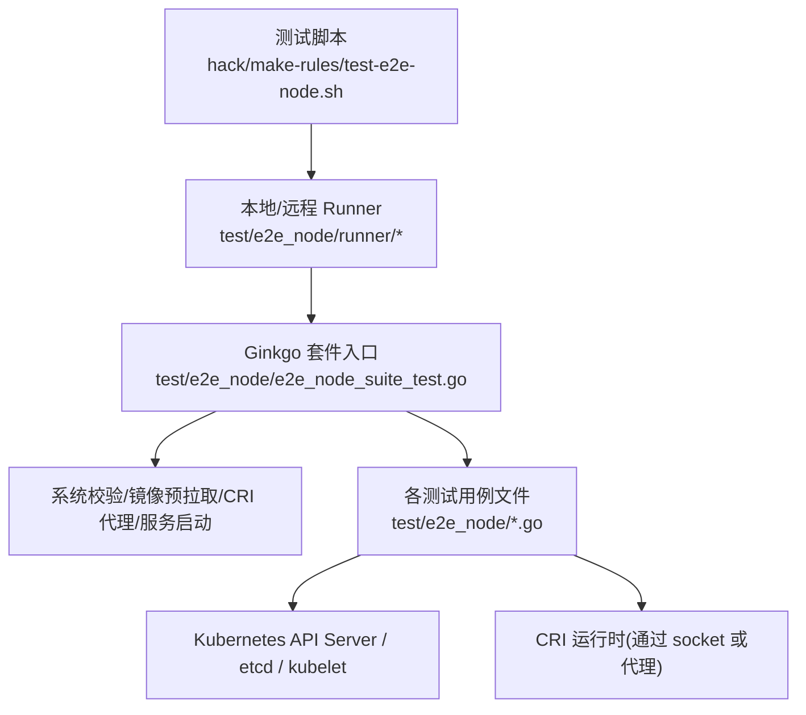
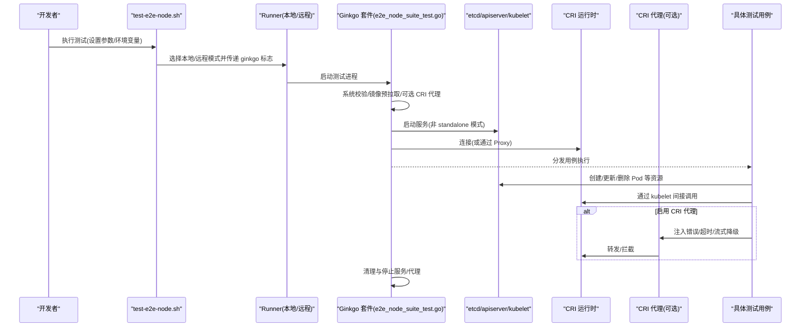
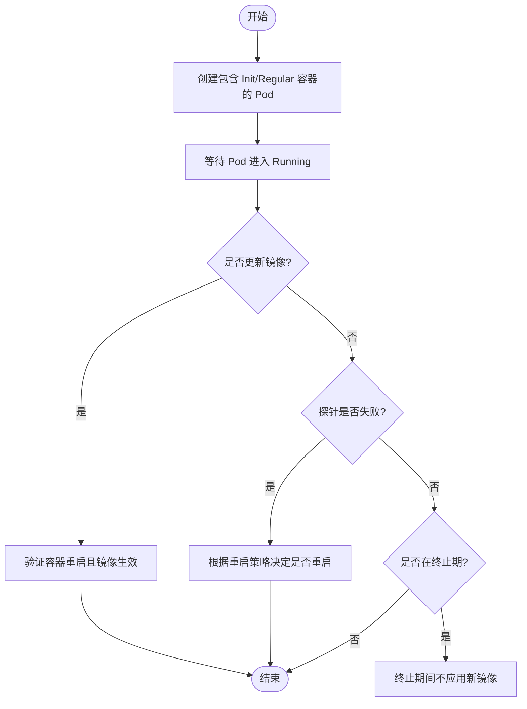
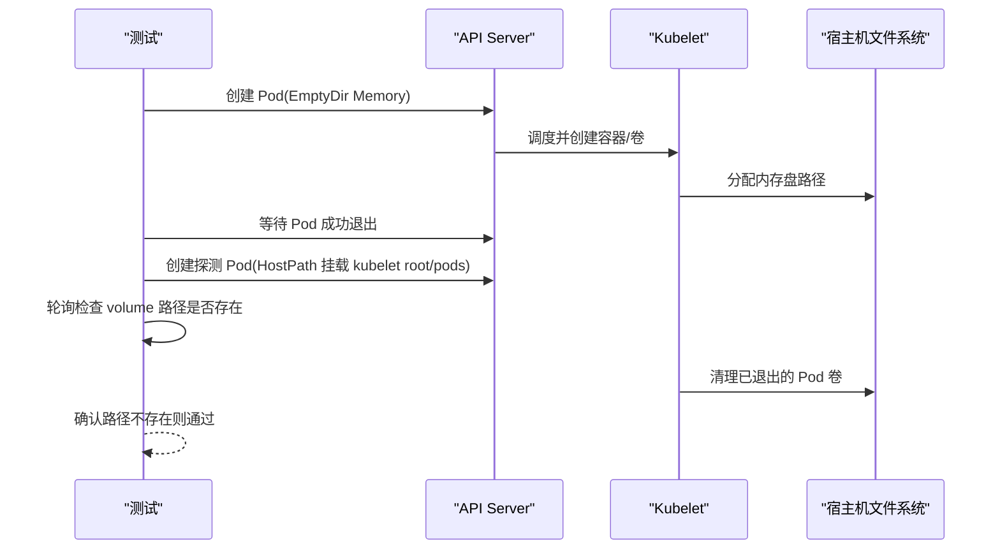
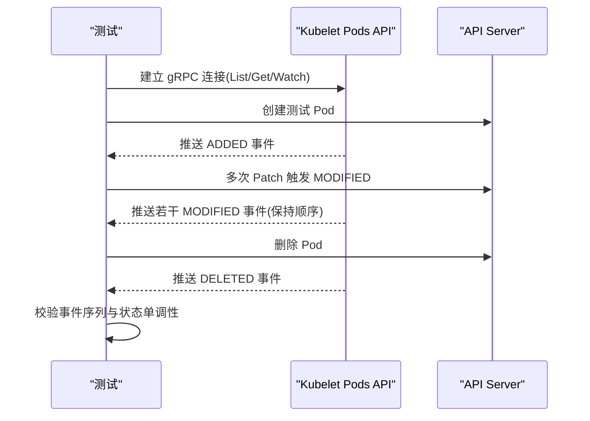
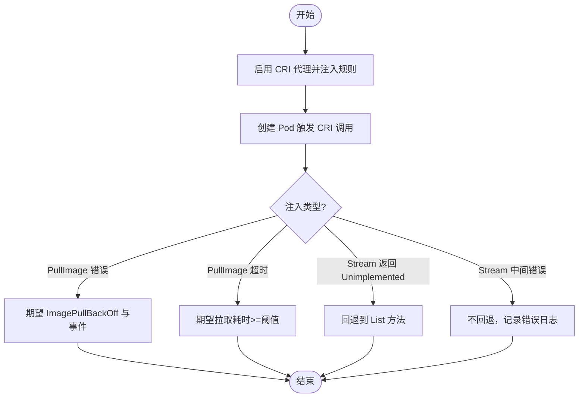
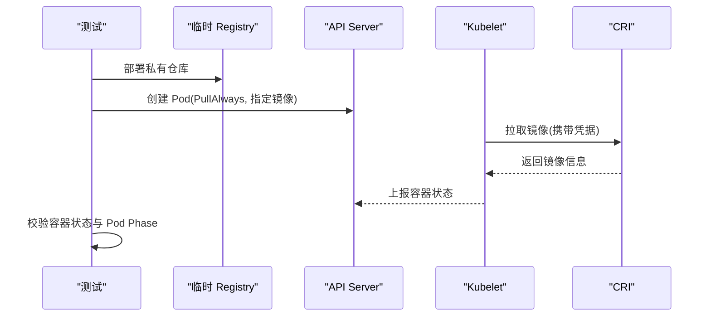
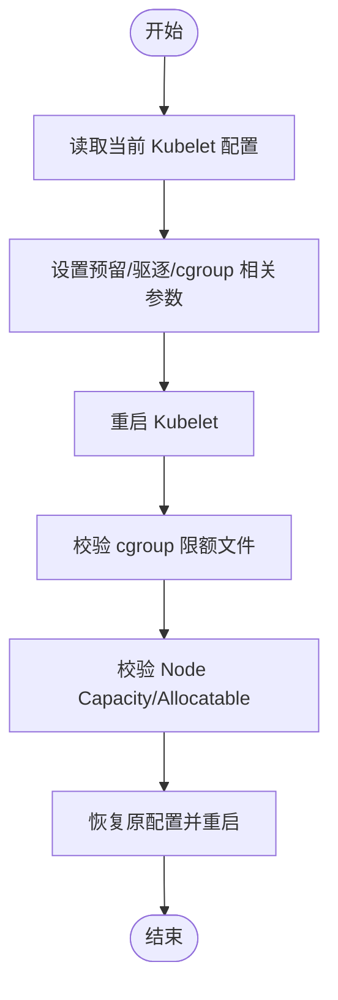
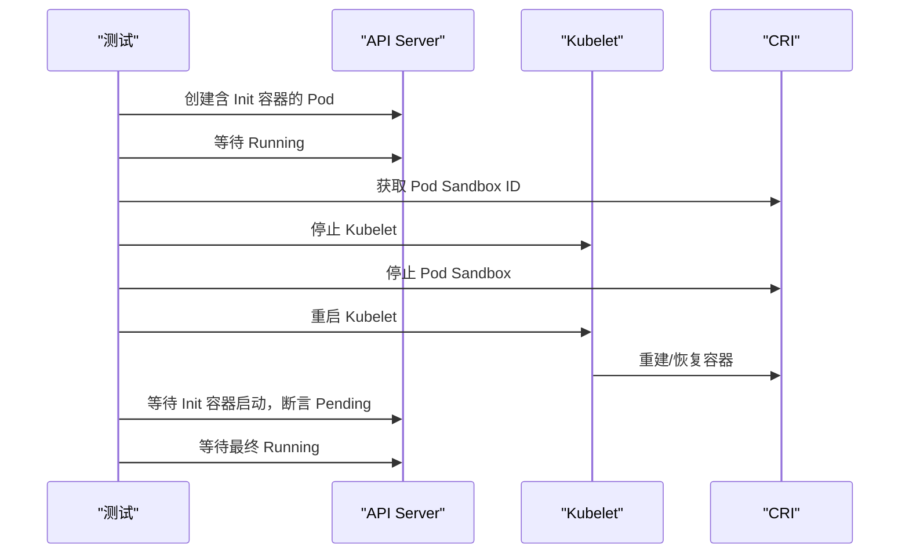
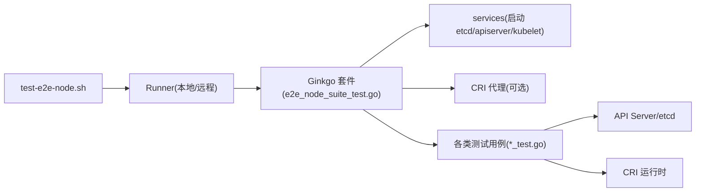

# 节点测试

<cite>
**本文引用的文件**   
- [test-e2e-node.sh](file://hack/make-rules/test-e2e-node.sh)
- [README.md](file://test/e2e_node/README.md)
- [framework.go](file://test/e2e_node/framework.go)
- [e2e_node_suite_test.go](file://test/e2e_node/e2e_node_suite_test.go)
- [container_lifecycle_test.go](file://test/e2e_node/container_lifecycle_test.go)
- [volume_manager_test.go](file://test/e2e_node/volume_manager_test.go)
- [pods_api_test.go](file://test/e2e_node/pods_api_test.go)
- [criproxy_test.go](file://test/e2e_node/criproxy_test.go)
- [runtime_conformance_test.go](file://test/e2e_node/runtime_conformance_test.go)
- [node_container_manager_test.go](file://test/e2e_node/node_container_manager_test.go)
- [pod_status_test.go](file://test/e2e_node/pod_status_test.go)
</cite>

## 目录
1. [简介](#简介)
2. [项目结构](#项目结构)
3. [核心组件](#核心组件)
4. [架构总览](#架构总览)
5. [详细组件分析](#详细组件分析)
6. [依赖关系分析](#依赖关系分析)
7. [性能考虑](#性能考虑)
8. [故障排查指南](#故障排查指南)
9. [结论](#结论)
10. [附录](#附录)

## 简介
本指南面向 Kubernetes 开发者，聚焦于“节点级端到端测试”的体系与实现。内容覆盖：
- 测试架构与入口：Ginkgo 套件、服务启动、CRI 代理注入、系统校验等
- 关键测试域：kubelet 行为、容器运行时（CRI）兼容性、存储卷管理、Pod 状态与生命周期、资源与配额、健康检查等
- 环境搭建：单节点集群、CRI 接口模拟、系统依赖配置
- 执行环境与工具链：测试二进制构建、权限与资源限制、并行度控制、远程与本地运行模式
- 调试与性能分析：日志采集、指标抓取、延迟与吞吐观测

## 项目结构
节点测试位于 test/e2e_node 目录，采用 Ginkgo 组织用例，并通过 hack/make-rules/test-e2e-node.sh 统一编排执行。核心要点：
- 测试套件入口与初始化：在 e2e_node_suite_test.go 中完成系统校验、镜像预拉取、可选 CRI 代理、服务进程（etcd/apiserver/kubelet）启动、等待节点就绪等
- 框架辅助：framework.go 提供 SIGDescribe 标签封装，便于按 SIG 分类筛选
- 典型测试文件：
  - 容器生命周期：container_lifecycle_test.go
  - 存储卷管理：volume_manager_test.go
  - Kubelet Pods API：pods_api_test.go
  - CRI 代理与流式列表：criproxy_test.go
  - 运行时合规性：runtime_conformance_test.go
  - 节点容器管理与 cgroup：node_container_manager_test.go
  - Pod 状态阶段：pod_status_test.go

图表来源
- [test-e2e-node.sh:1-290](file://hack/make-rules/test-e2e-node.sh#L1-L290)
- [e2e_node_suite_test.go:127-358](file://test/e2e_node/e2e_node_suite_test.go#L127-L358)

章节来源
- [test-e2e-node.sh:1-290](file://hack/make-rules/test-e2e-node.sh#L1-L290)
- [README.md:1-2](file://test/e2e_node/README.md#L1-L2)
- [framework.go:17-23](file://test/e2e_node/framework.go#L17-L23)
- [e2e_node_suite_test.go:127-358](file://test/e2e_node/e2e_node_suite_test.go#L127-L358)

## 核心组件
- 测试驱动与入口
  - Ginkgo 套件：TestE2eNode 作为主入口，SynchronizedBeforeSuite/SynchronizedAfterSuite 负责全局前置/后置
  - 命令行模式：支持 run-services-mode、run-kubelet-mode、system-validate-mode 等专用模式
- 系统与环境准备
  - 系统规格校验：system.ValidateSpec，可加载自定义 system spec
  - 镜像预拉取：PrePullAllImages，减少网络抖动导致的失败
  - CRI 代理：criproxy.NewRemoteRuntimeProxy，用于注入错误、超时、流式降级等场景
  - 服务进程：services.RunE2EServices 启动 etcd/apiserver/kubelet；standalone 模式可仅启动 kubelet
- 节点就绪与健康检查
  - waitForNodeReady 轮询 Node Ready 条件
  - HealthCheck 访问 kubelet 健康端点
- 测试框架辅助
  - framework.NewDefaultFramework、e2epod.* 客户端、admissionapi.LevelPrivileged 等

章节来源
- [e2e_node_suite_test.go:127-358](file://test/e2e_node/e2e_node_suite_test.go#L127-L358)
- [e2e_node_suite_test.go:390-440](file://test/e2e_node/e2e_node_suite_test.go#L390-L440)
- [framework.go:17-23](file://test/e2e_node/framework.go#L17-L23)

## 架构总览
下图展示从脚本到测试执行的端到端流程，以及关键组件交互。

图表来源
- [test-e2e-node.sh:1-290](file://hack/make-rules/test-e2e-node.sh#L1-L290)
- [e2e_node_suite_test.go:127-358](file://test/e2e_node/e2e_node_suite_test.go#L127-L358)
- [criproxy_test.go:50-113](file://test/e2e_node/criproxy_test.go#L50-L113)

## 详细组件分析

### 容器生命周期测试
- 目标：验证不同重启策略下容器镜像更新、初始化阶段、探针失败后更新、终止期间更新等行为
- 关键点：
  - 使用 e2epod 客户端创建/更新/删除 Pod，配合 WaitForPodCondition/WaitForPodNameRunningInNamespace 等断言
  - 针对 InitContainers 与 Regular Containers 的组合，验证顺序与状态机一致性
  - 结合 Liveness/Readiness/Startup 探针的不同失败路径，观察重启与镜像切换的交互

图表来源
- [container_lifecycle_test.go:140-631](file://test/e2e_node/container_lifecycle_test.go#L140-L631)

章节来源
- [container_lifecycle_test.go:140-631](file://test/e2e_node/container_lifecycle_test.go#L140-L631)

### 存储卷管理测试
- 目标：验证内存盘（EmptyDir medium=Memory）在 Pod 终止后被正确清理
- 关键点：
  - 创建带 EmptyDir 的 Pod，等待成功退出
  - 通过 HostPath 挂载 kubelet pods 目录，轮询确认对应 volume 路径被移除
  - 使用 UUID 命名避免冲突，确保幂等性与隔离性

图表来源
- [volume_manager_test.go:35-129](file://test/e2e_node/volume_manager_test.go#L35-L129)

章节来源
- [volume_manager_test.go:35-129](file://test/e2e_node/volume_manager_test.go#L35-L129)

### Kubelet Pods API 测试
- 目标：验证 Kubelet 暴露的 Pods API（gRPC Unix Socket）具备 List/Get/Watch 能力，事件有序且一致
- 关键点：
  - 动态开启 PodsAPI FeatureGate，连接 /var/lib/kubelet/pods-api 套接字
  - 监听 INITIAL_SYNC_COMPLETE，随后验证 ADDED/MODIFIED/DELETED 的顺序与单调性
  - 对静态 Pod 清单变更进行 Watch 验证

图表来源
- [pods_api_test.go:52-634](file://test/e2e_node/pods_api_test.go#L52-L634)

章节来源
- [pods_api_test.go:52-634](file://test/e2e_node/pods_api_test.go#L52-L634)

### CRI 代理与流式列表测试
- 目标：通过 CRI 代理注入异常、超时、Unimplemented 等，验证 Kubelet 的健壮性与回退逻辑
- 关键点：
  - 注入 PullImage 错误/超时，验证 Pod 状态与事件
  - 启用 CRIListStreaming 特性，验证 StreamContainers/StreamPodSandboxes 优先使用，并在 Unimplemented 时回退至 List 方法
  - 中间流错误不应触发回退，但会记录错误日志

图表来源
- [criproxy_test.go:50-414](file://test/e2e_node/criproxy_test.go#L50-L414)

章节来源
- [criproxy_test.go:50-414](file://test/e2e_node/criproxy_test.go#L50-L414)

### 运行时合规性测试
- 目标：黑盒验证容器运行时在不同镜像源与认证场景下的行为
- 关键点：
  - 使用临时私有仓库与凭据，验证 PullAlways 策略下的拉取与运行
  - 通过 restartKubelet 与清理 image_manager 目录，保证缓存影响可控
  - 校验容器状态与 Pod Phase 符合预期

图表来源
- [runtime_conformance_test.go:39-188](file://test/e2e_node/runtime_conformance_test.go#L39-L188)

章节来源
- [runtime_conformance_test.go:39-188](file://test/e2e_node/runtime_conformance_test.go#L39-L188)

### 节点容器管理与 cgroup 验证
- 目标：验证 Node Allocatable、kube-reserved/system-reserved 的 cgroup 限额与报告值
- 关键点：
  - 动态修改 Kubelet 配置（CPU/Memory/PIDs 预留与驱逐阈值），重启 kubelet
  - 读取 cgroup v1/v2 相应文件，校验 cpu.shares/cpu.weight、memory.limit_in_bytes/memory.max、pids.max
  - 对比 Node.Status.Capacity/Allocatable 与 cgroup 实际限额的一致性

图表来源
- [node_container_manager_test.go:72-418](file://test/e2e_node/node_container_manager_test.go#L72-L418)

章节来源
- [node_container_manager_test.go:72-418](file://test/e2e_node/node_container_manager_test.go#L72-L418)

### Pod 状态阶段测试（节点重启场景）
- 目标：验证节点重启后，Init Container 执行期间 Pod 应处于 Pending 状态
- 关键点：
  - 获取 Pod Sandbox ID，停止 kubelet 并停止 sandbox，再重启 kubelet
  - 等待 Init Container 重新执行，断言 Pod Phase 为 Pending，直至最终 Running

图表来源
- [pod_status_test.go:34-128](file://test/e2e_node/pod_status_test.go#L34-L128)

章节来源
- [pod_status_test.go:34-128](file://test/e2e_node/pod_status_test.go#L34-L128)

## 依赖关系分析
- 测试脚本与 Runner
  - test-e2e-node.sh 解析参数（并行度、焦点/跳过、标签过滤、远程模式、制品目录等），决定走 GCE/SSH/本地三种模式
  - 本地模式默认使用 ginkgo 的默认并行度（cores-1），远程模式受 PARALLELISM 控制
- 套件与服务
  - e2e_node_suite_test.go 负责系统校验、镜像预拉取、CRI 代理、服务启动、节点就绪等待
  - services 包提供 etcd/apiserver/kubelet 的启动与停止
- 测试用例与外部依赖
  - 大量使用 k8s.io/client-go/kubernetes、k8s.io/apimachinery、k8s.io/api/core/v1
  - 通过 e2epod 客户端操作 Pod，通过 CRI 接口直接查询沙箱/容器（部分用例）
  - 通过 HealthCheck 访问 kubelet 健康端点

图表来源
- [test-e2e-node.sh:1-290](file://hack/make-rules/test-e2e-node.sh#L1-L290)
- [e2e_node_suite_test.go:127-358](file://test/e2e_node/e2e_node_suite_test.go#L127-L358)

章节来源
- [test-e2e-node.sh:1-290](file://hack/make-rules/test-e2e-node.sh#L1-L290)
- [e2e_node_suite_test.go:127-358](file://test/e2e_node/e2e_node_suite_test.go#L127-L358)

## 性能考虑
- 并行度与资源争用
  - 脚本默认 SKIP 掉 Flaky/Slow/Serial 用例，可通过 LABEL_FILTER/Focus 精确筛选
  - 合理设置 PARALLELISM，避免资源竞争导致不稳定
- 镜像预热
  - 启用 --prepull-images=true 可减少网络抖动带来的失败，提升稳定性
- 流式 CRI 列表
  - 启用 CRIListStreaming 可降低大列表开销，提高响应速度；当后端不支持时自动回退
- 指标与日志
  - 通过 report-dir 输出 junit 与 kubelet.log，便于定位慢路径与错误堆栈

[本节为通用建议，无需特定文件引用]

## 故障排查指南
- 常见失败原因
  - 镜像拉取失败：检查 CRI 代理注入的错误与事件，确认凭据与仓库可达
  - 流式列表超时/中间错误：查看 kubelet.log 中的 recv 失败与是否触发回退
  - 节点未就绪：检查 waitForNodeReady 轮询结果与 kubelet 健康端点
- 快速定位
  - 使用 --focus/--label-filter 缩小范围
  - 打开 --cri-proxy-enabled 注入可控异常，复现问题
  - 查看 artifacts 目录下的 build-log.txt、junit.xml、kubelet.log

章节来源
- [criproxy_test.go:416-506](file://test/e2e_node/criproxy_test.go#L416-L506)
- [e2e_node_suite_test.go:390-440](file://test/e2e_node/e2e_node_suite_test.go#L390-L440)

## 结论
节点测试以 Ginkgo 为核心，围绕 kubelet、CRI、存储与网络等子系统展开，通过系统校验、镜像预热、CRI 代理注入等手段，形成稳定且可诊断的端到端验证闭环。借助脚本化的执行入口与灵活的过滤机制，开发者可以高效地编写与维护节点级测试用例，并对复杂场景（如流式列表回退、节点重启恢复、cgroup 限额一致性）进行精准验证。

[本节为总结性内容，无需特定文件引用]

## 附录
- 执行方式概览
  - 本地执行：默认使用宿主机的 sudo 权限，自动拉起 etcd/apiserver/kubelet
  - 远程执行：支持 GCE 与 SSH 两种模式，自动处理实例/镜像/网络等元数据
  - 调试模式：支持 debug-tool（需编译 DBG=1），便于深入定位
- 常用参数
  - --focus/--skip/--label-filter：用例筛选
  - --prepull-images：镜像预热
  - --cri-proxy-enabled：启用 CRI 代理
  - --system-spec-name：系统规格名（如 gke）
  - --dns-domain/--kubelet-flags：DNS 与 kubelet 额外参数
  - --artifacts：制品输出目录

章节来源
- [test-e2e-node.sh:1-290](file://hack/make-rules/test-e2e-node.sh#L1-L290)
- [e2e_node_suite_test.go:127-358](file://test/e2e_node/e2e_node_suite_test.go#L127-L358)