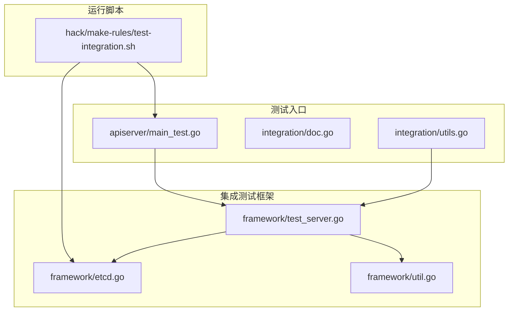
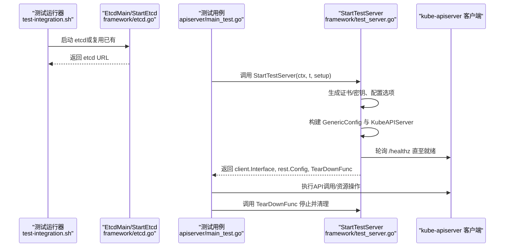
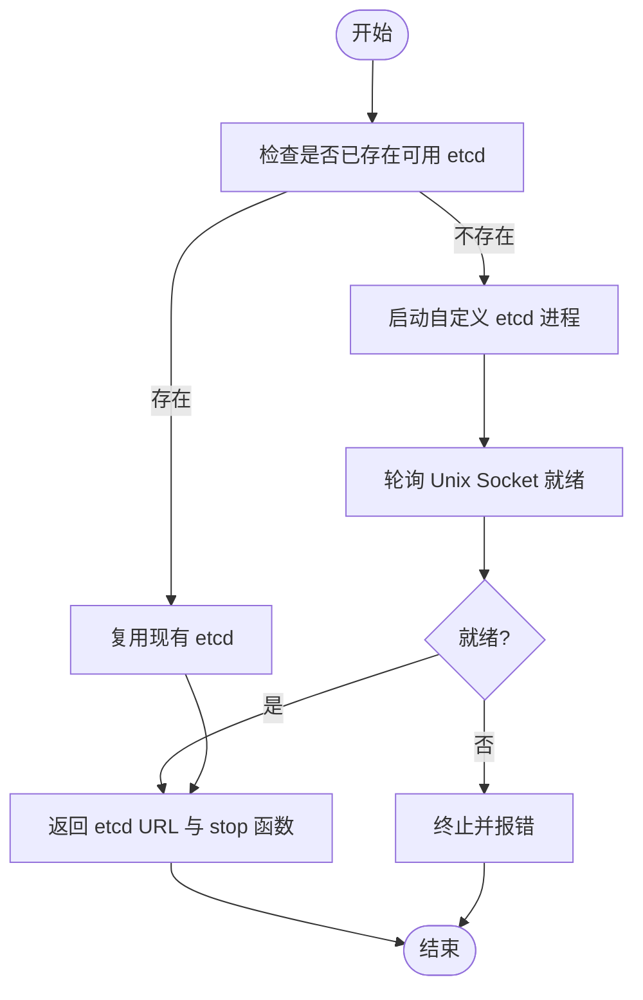
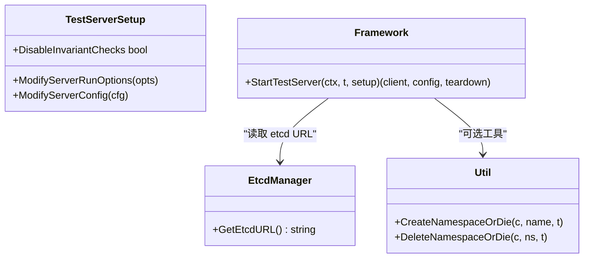
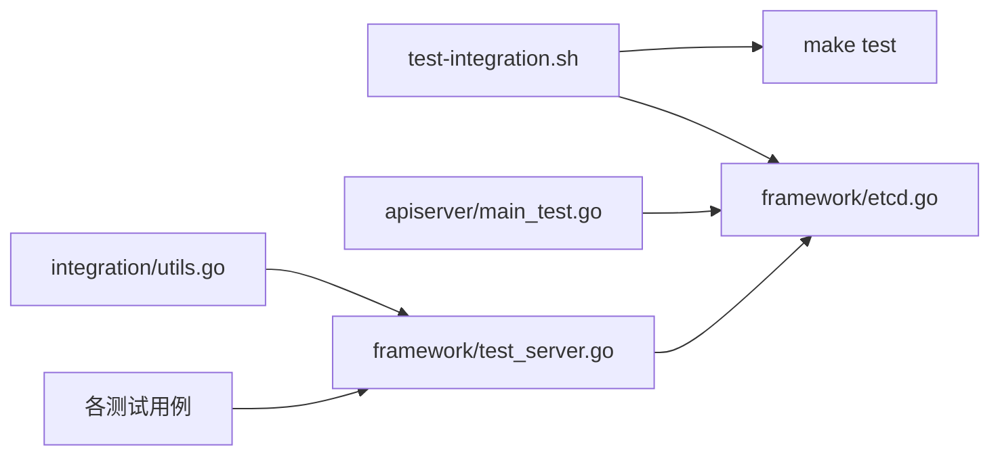

# 集成测试

<cite>
**本文引用的文件**   
- [test-integration.sh](file://hack/make-rules/test-integration.sh)
- [doc.go](file://test/integration/doc.go)
- [utils.go](file://test/integration/utils.go)
- [main_test.go](file://test/integration/apiserver/main_test.go)
- [test_server.go](file://test/integration/framework/test_server.go)
- [etcd.go](file://test/integration/framework/etcd.go)
- [util.go](file://test/integration/framework/util.go)
</cite>

## 目录
1. [简介](#简介)
2. [项目结构](#项目结构)
3. [核心组件](#核心组件)
4. [架构总览](#架构总览)
5. [详细组件分析](#详细组件分析)
6. [依赖关系分析](#依赖关系分析)
7. [性能与并发](#性能与并发)
8. [故障排查指南](#故障排查指南)
9. [结论](#结论)
10. [附录](#附录)

## 简介
本指南面向Kubernetes开发者，系统化阐述仓库内“集成测试”的架构设计与实现模式，覆盖测试集群搭建与管理、环境初始化配置、API服务器/控制器/存储后端等关键组件的测试方法，以及测试数据准备、状态验证与清理策略。同时给出并发测试处理、资源竞争解决方案、性能考量与并行执行策略，并提供具体代码示例路径以便快速上手。

## 项目结构
集成测试位于 test/integration 目录，按功能域组织（如 apiserver、auth、scheduler、storage 等）。每个子包通常包含 main_test.go 作为入口，并通过 framework 提供的工具启动 etcd 和 API Server，完成端到端场景验证。

图表来源
- [test_server.go:1-297](file://test/integration/framework/test_server.go#L1-L297)
- [etcd.go:1-322](file://test/integration/framework/etcd.go#L1-L322)
- [util.go:1-164](file://test/integration/framework/util.go#L1-L164)
- [main_test.go:1-28](file://test/integration/apiserver/main_test.go#L1-L28)
- [doc.go:1-20](file://test/integration/doc.go#L1-L20)
- [utils.go:1-73](file://test/integration/utils.go#L1-L73)
- [test-integration.sh:1-124](file://hack/make-rules/test-integration.sh#L1-L124)

章节来源
- [doc.go:1-20](file://test/integration/doc.go#L1-L20)
- [test-integration.sh:1-124](file://hack/make-rules/test-integration.sh#L1-L124)

## 核心组件
- 测试运行器与脚本
  - hack/make-rules/test-integration.sh：负责发现测试包、启动 etcd、设置并发度与超时、调用 make test 执行测试并清理。
- 测试框架
  - framework/etcd.go：提供 EtcdMain/StartEtcd/RunCustomEtcd 等能力，自动拉起本地 etcd、管理生命周期、过滤日志、泄漏检测。
  - framework/test_server.go：提供 StartTestServer，构建最小化 kube-apiserver 实例，生成证书、配置认证授权、等待健康检查并返回客户端与清理函数。
  - framework/util.go：提供命名空间创建/删除、节点条件判断等通用工具。
- 测试入口与辅助
  - apiserver/main_test.go：通过 framework.EtcdMain 启动 etcd 后运行测试。
  - integration/utils.go：封装常用操作（如删除Pod、等待消失、获取 etcd 客户端）与HTTP状态码集合。

章节来源
- [test-integration.sh:1-124](file://hack/make-rules/test-integration.sh#L1-L124)
- [etcd.go:1-322](file://test/integration/framework/etcd.go#L1-L322)
- [test_server.go:1-297](file://test/integration/framework/test_server.go#L1-L297)
- [util.go:1-164](file://test/integration/framework/util.go#L1-L164)
- [main_test.go:1-28](file://test/integration/apiserver/main_test.go#L1-L28)
- [utils.go:1-73](file://test/integration/utils.go#L1-L73)

## 架构总览
集成测试采用“进程内API Server + 独立 etcd”的模式：测试通过 framework 启动一个真实的 etcd 实例，再在进程中构建并运行最小化的 kube-apiserver，使用真实的路由、认证、授权、存储后端与特性门控，从而获得接近生产环境的验证效果。

图表来源
- [test-integration.sh:1-124](file://hack/make-rules/test-integration.sh#L1-L124)
- [etcd.go:1-322](file://test/integration/framework/etcd.go#L1-L322)
- [test_server.go:1-297](file://test/integration/framework/test_server.go#L1-L297)
- [main_test.go:1-28](file://test/integration/apiserver/main_test.go#L1-L28)

## 详细组件分析

### 组件A：etcd 管理与生命周期
- 目标
  - 为集成测试提供稳定、隔离的 etcd 实例；支持外部复用与自动启动；统一日志输出与泄漏检测。
- 关键能力
  - EtcdMain：在测试主流程前启动 etcd，结束后进行 goroutine 泄漏检查。
  - StartEtcd：在单个测试中启动 etcd，并在测试结束时自动清理。
  - RunCustomEtcd：以 Unix Domain Socket 方式启动 etcd，过滤已知无害日志，优雅退出并清理数据目录。
- 并发与隔离
  - 每个测试可拥有独立 etcd 实例，避免共享状态导致的竞态。
  - 可通过环境变量复用外部 etcd，便于CI复用。
- 典型用法
  - 在包的 TestMain 中调用 framework.EtcdMain(m.Run)。
  - 或在测试函数中使用 framework.StartEtcd(logger, tb, forceCreate=false)。

图表来源
- [etcd.go:1-322](file://test/integration/framework/etcd.go#L1-L322)

章节来源
- [etcd.go:1-322](file://test/integration/framework/etcd.go#L1-L322)

### 组件B：API Server 测试服务
- 目标
  - 在测试中启动最小化 kube-apiserver，具备完整认证、授权、OpenAPI、聚合器等能力，且可被外部客户端访问。
- 关键能力
  - StartTestServer：创建临时证书目录、生成代理CA与客户端CA、绑定监听端口、配置 ServiceAccount 签名密钥、设置 RBAC+Node 授权、注入 FeatureGate 与兼容性版本、构建 GenericConfig 与 KubeAPIServer、轮询健康检查、返回客户端与清理函数。
  - 支持通过 TestServerSetup.ModifyServerRunOptions/ModifyServerConfig 定制行为。
- 健康检查与就绪
  - 轮询 /healthz 并校验 default/kube-system 命名空间存在，确保控制面完全就绪。
- 清理与不变式检查
  - 停止前抓取指标并进行不变式检查（可禁用），随后取消上下文、等待进程退出、清理证书目录。

图表来源
- [test_server.go:1-297](file://test/integration/framework/test_server.go#L1-L297)
- [etcd.go:1-322](file://test/integration/framework/etcd.go#L1-L322)
- [util.go:1-164](file://test/integration/framework/util.go#L1-L164)

章节来源
- [test_server.go:1-297](file://test/integration/framework/test_server.go#L1-L297)
- [util.go:1-164](file://test/integration/framework/util.go#L1-L164)

### 组件C：测试入口与辅助工具
- apiserver/main_test.go
  - 通过 framework.EtcdMain 启动 etcd 后再运行测试，保证所有测试共享同一 etcd 实例（适合需要跨测试复用的场景）。
- integration/utils.go
  - 提供 DeletePodOrErrorf、WaitForPodToDisappear、GetEtcdClients 等便捷方法，以及常见HTTP状态码映射，简化断言与清理逻辑。

章节来源
- [main_test.go:1-28](file://test/integration/apiserver/main_test.go#L1-L28)
- [utils.go:1-73](file://test/integration/utils.go#L1-L73)

### 组件D：测试运行脚本
- hack/make-rules/test-integration.sh
  - 设置并发度（GOMAXPROCS）、超时、VMODULE 等参数；查找所有 test/integration 下的测试包；启动 etcd 并监控其指标；最终调用 make test 执行测试；在退出时清理 etcd。
  - 默认开启缓存变更检测，关闭解码错误 panic，便于捕获潜在问题。

章节来源
- [test-integration.sh:1-124](file://hack/make-rules/test-integration.sh#L1-L124)

## 依赖关系分析
- 模块耦合
  - 测试脚本依赖 framework/etcd.go 提供的 etcd 管理能力。
  - 各测试包通过 apiserver/main_test.go 或各自 TestMain 调用 framework.EtcdMain/StartEtcd。
  - 测试用例通过 framework/test_server.go 启动 API Server，并使用返回的 client.Interface 与 rest.Config 发起请求。
- 外部依赖
  - etcd 二进制需在 PATH 中或通过环境变量指定；测试脚本会检查并提示安装方式。
- 可能的循环依赖
  - 当前结构清晰分层，未见循环依赖迹象。

图表来源
- [test-integration.sh:1-124](file://hack/make-rules/test-integration.sh#L1-L124)
- [etcd.go:1-322](file://test/integration/framework/etcd.go#L1-L322)
- [test_server.go:1-297](file://test/integration/framework/test_server.go#L1-L297)
- [main_test.go:1-28](file://test/integration/apiserver/main_test.go#L1-L28)
- [utils.go:1-73](file://test/integration/utils.go#L1-L73)

章节来源
- [test-integration.sh:1-124](file://hack/make-rules/test-integration.sh#L1-L124)
- [etcd.go:1-322](file://test/integration/framework/etcd.go#L1-L322)
- [test_server.go:1-297](file://test/integration/framework/test_server.go#L1-L297)
- [main_test.go:1-28](file://test/integration/apiserver/main_test.go#L1-L28)
- [utils.go:1-73](file://test/integration/utils.go#L1-L73)

## 性能与并发
- 并发执行
  - 通过 KUBE_INTEGRATION_TEST_MAX_CONCURRENCY 控制 GOMAXPROCS，提升并行度。
  - 建议将测试按资源域拆分，减少跨测试共享资源，降低锁竞争。
- 超时与重试
  - 使用 KUBE_TIMEOUT 调整整体超时；对长耗时操作使用 wait.PollImmediate/PollUntilContextTimeout 等机制。
- 指标与不变式
  - 测试结束前抓取指标并进行不变式检查，有助于尽早发现回归。
- 资源隔离
  - 每个测试尽量使用独立 etcd 实例与命名空间，避免相互干扰。

[本节为通用指导，不直接分析具体文件]

## 故障排查指南
- etcd 未找到或未就绪
  - 现象：脚本提示无法找到 etcd 或启动失败。
  - 处理：确保 etcd 在 PATH 中，或使用 hack/install-etcd.sh 安装；也可通过 KUBE_INTEGRATION_ETCD_URL 指向外部 etcd。
- API Server 健康检查失败
  - 现象：StartTestServer 轮询 /healthz 超时。
  - 处理：检查证书目录权限、ServiceAccount 签名密钥、FeatureGate 配置；查看测试日志中的中间步骤。
- 资源未清理导致后续测试失败
  - 现象：命名空间或对象残留。
  - 处理：确保在每个测试中调用返回的 TearDownFunc；必要时显式删除命名空间与相关资源。
- 并发竞争与死锁
  - 现象：偶发失败、goroutine 泄漏告警。
  - 处理：启用 goleak 检查；减少共享状态；增加退避与重试；拆分测试包。

章节来源
- [test-integration.sh:1-124](file://hack/make-rules/test-integration.sh#L1-L124)
- [etcd.go:1-322](file://test/integration/framework/etcd.go#L1-L322)
- [test_server.go:1-297](file://test/integration/framework/test_server.go#L1-L297)

## 结论
Kubernetes 集成测试通过“进程内 API Server + 独立 etcd”的方式，提供了高保真度的端到端验证能力。借助 framework 提供的 etcd 管理、API Server 启动与工具函数，开发者可以快速编写覆盖认证授权、网络、存储等关键路径的测试用例。配合合理的并发策略、超时与清理机制，能够在保持稳定性的同时显著提升测试效率。

[本节为总结性内容，不直接分析具体文件]

## 附录

### 如何编写有效的集成测试用例（实践清单）
- 选择合适的环境
  - 需要跨测试共享状态时使用 EtcdMain；否则优先 StartEtcd 以获得更好隔离。
- 启动 API Server
  - 使用 StartTestServer，并通过 TestServerSetup 按需修改选项与配置。
- 准备测试数据
  - 使用 CreateNamespaceOrDie 创建命名空间；在测试结束时删除命名空间以回收资源。
- 状态验证
  - 使用 wait.PollImmediate/PollUntilContextTimeout 轮询期望状态；结合 utils.go 中的 WaitForPodToDisappear 等方法。
- 清理机制
  - 务必调用 TearDownFunc；必要时显式删除命名空间与关联资源。
- 并发与竞争
  - 为每个测试分配独立命名空间与 etcd；避免共享全局可变状态；合理设置超时与重试。

章节来源
- [main_test.go:1-28](file://test/integration/apiserver/main_test.go#L1-L28)
- [test_server.go:1-297](file://test/integration/framework/test_server.go#L1-L297)
- [util.go:1-164](file://test/integration/framework/util.go#L1-L164)
- [utils.go:1-73](file://test/integration/utils.go#L1-L73)