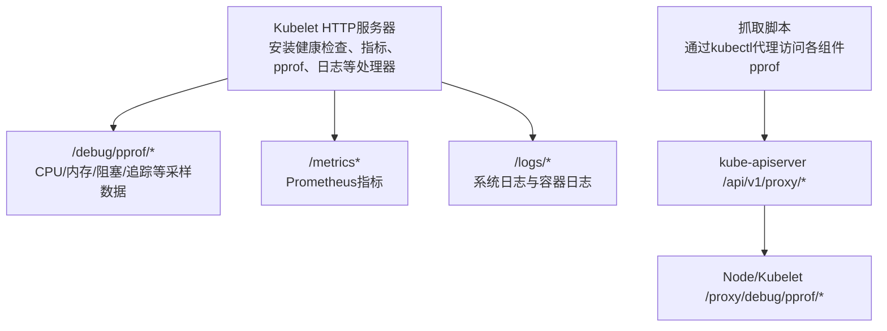
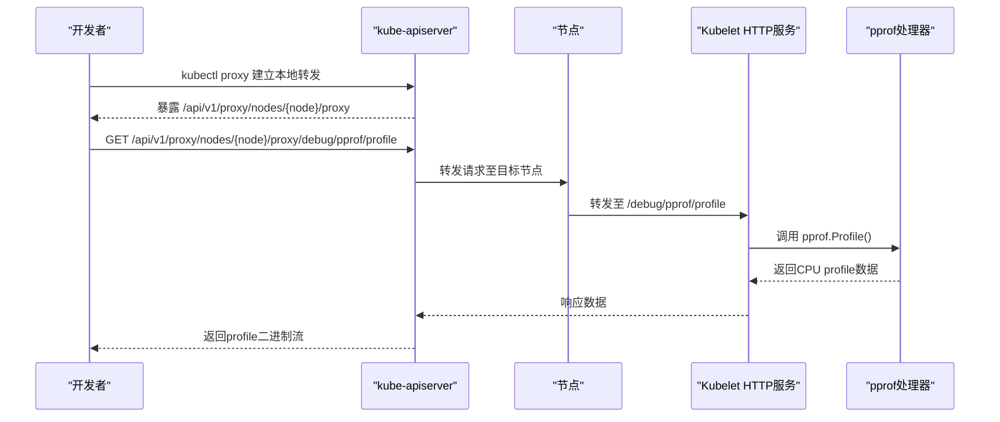
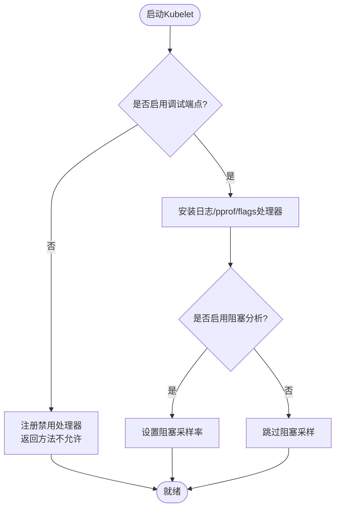
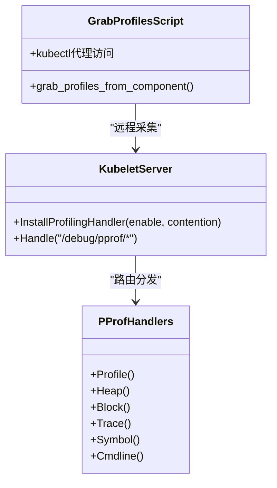
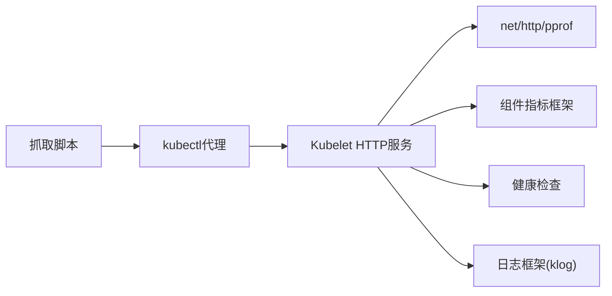

# 调试与故障排查

<cite>
**本文引用的文件**   
- [pkg/kubelet/server/server.go](file://pkg/kubelet/server/server.go)
- [hack/grab-profiles.sh](file://hack/grab-profiles.sh)
- [CHANGELOG/CHANGELOG-1.19.md](file://CHANGELOG/CHANGELOG-1.19.md)
- [CHANGELOG/CHANGELOG-1.21.md](file://CHANGELOG/CHANGELOG-1.21.md)
- [CHANGELOG/CHANGELOG-1.27.md](file://CHANGELOG/CHANGELOG-1.27.md)
</cite>

## 目录
1. [简介](#简介)
2. [项目结构](#项目结构)
3. [核心组件](#核心组件)
4. [架构总览](#架构总览)
5. [详细组件分析](#详细组件分析)
6. [依赖关系分析](#依赖关系分析)
7. [性能考虑](#性能考虑)
8. [故障排查指南](#故障排查指南)
9. [结论](#结论)
10. [附录](#附录)

## 简介
本指南面向Kubernetes开发者，聚焦生产环境下的调试与故障排查。内容覆盖：
- 调试工具链配置与使用：Delve、pprof、trace
- 日志系统设计与查询：结构化日志、级别控制、聚合分析
- 分布式系统调试技巧：跨组件调用跟踪、状态同步问题、网络通信诊断
- 常见故障模式识别与解决：死锁检测、内存溢出、网络超时
- 生产环境排障流程：日志收集、快照分析、根因定位
- 性能问题诊断步骤：CPU占用分析、内存使用监控、I/O瓶颈识别
- 最佳实践与问题报告标准化格式

## 项目结构
围绕调试与可观测性，仓库中与运行时可观测能力直接相关的代码主要集中在Kubelet的HTTP服务实现与辅助脚本中；同时，变更日志记录了klog结构化日志与各组件pprof端口的演进。

图示来源
- [pkg/kubelet/server/server.go:108-120](file://pkg/kubelet/server/server.go#L108-L120)
- [pkg/kubelet/server/server.go:750-783](file://pkg/kubelet/server/server.go#L750-L783)
- [hack/grab-profiles.sh:75-78](file://hack/grab-profiles.sh#L75-L78)
- [hack/grab-profiles.sh:238-241](file://hack/grab-profiles.sh#L238-L241)

章节来源
- [pkg/kubelet/server/server.go:108-120](file://pkg/kubelet/server/server.go#L108-L120)
- [pkg/kubelet/server/server.go:750-783](file://pkg/kubelet/server/server.go#L750-L783)
- [hack/grab-profiles.sh:75-78](file://hack/grab-profiles.sh#L75-L78)
- [hack/grab-profiles.sh:238-241](file://hack/grab-profiles.sh#L238-L241)

## 核心组件
- Kubelet HTTP服务器
  - 负责注册健康检查、指标、pprof、日志等HTTP处理器，并支持按配置启用/禁用调试端点。
  - 关键路径包括：/healthz、/metrics、/stats、/logs、/debug/pprof、/debug/flags/v等。
- pprof采集与导出
  - 提供profile、heap、block、trace等子路径，用于CPU、内存、阻塞与执行轨迹采集。
- 抓取脚本
  - 通过SSH隧道与kubectl代理批量拉取多组件的pprof数据，便于快速定位热点。

章节来源
- [pkg/kubelet/server/server.go:329-367](file://pkg/kubelet/server/server.go#L329-L367)
- [pkg/kubelet/server/server.go:750-783](file://pkg/kubelet/server/server.go#L750-L783)
- [hack/grab-profiles.sh:24-51](file://hack/grab-profiles.sh#L24-L51)

## 架构总览
下图展示了从外部到Kubelet的pprof数据采集链路，以及Kubelet内部对pprof处理器的安装逻辑。

图示来源
- [pkg/kubelet/server/server.go:750-783](file://pkg/kubelet/server/server.go#L750-L783)
- [hack/grab-profiles.sh:75-78](file://hack/grab-profiles.sh#L75-L78)
- [hack/grab-profiles.sh:238-241](file://hack/grab-profiles.sh#L238-L241)

## 详细组件分析

### Kubelet HTTP服务器与调试端点
- 功能要点
  - 根据配置决定是否启用调试端点（如pprof、日志、flags）。
  - 将pprof子路径映射到标准库pprof处理器，支持profile、symbol、cmdline、trace等。
  - 可选开启阻塞分析（contention profiling）以捕获goroutine阻塞热点。
- 安全与权限
  - 可通过配置精细控制是否暴露/debug/pprof与/debug/flags/v。
  - 在较新版本中，pprof也可通过Unix域套接字提供服务以提升安全性。

图示来源
- [pkg/kubelet/server/server.go:353-367](file://pkg/kubelet/server/server.go#L353-L367)
- [pkg/kubelet/server/server.go:750-783](file://pkg/kubelet/server/server.go#L750-L783)

章节来源
- [pkg/kubelet/server/server.go:353-367](file://pkg/kubelet/server/server.go#L353-L367)
- [pkg/kubelet/server/server.go:750-783](file://pkg/kubelet/server/server.go#L750-L783)
- [CHANGELOG/CHANGELOG-1.27.md:2592](file://CHANGELOG/CHANGELOG-1.27.md#L2592)

### pprof性能分析器与trace追踪
- pprof端点
  - /debug/pprof/profile：CPU profile
  - /debug/pprof/heap：内存分配与使用
  - /debug/pprof/block：阻塞分析（需启用阻塞采样）
  - /debug/pprof/trace：执行轨迹
- trace采集
  - 通过/trace子路径获取时间线，结合go tool trace进行可视化分析。
- 自动化抓取
  - 使用仓库内脚本批量抓取多个组件的profile，生成PDF或原始数据以便离线分析。

图示来源
- [pkg/kubelet/server/server.go:750-783](file://pkg/kubelet/server/server.go#L750-L783)
- [hack/grab-profiles.sh:24-51](file://hack/grab-profiles.sh#L24-L51)

章节来源
- [pkg/kubelet/server/server.go:750-783](file://pkg/kubelet/server/server.go#L750-L783)
- [hack/grab-profiles.sh:24-51](file://hack/grab-profiles.sh#L24-L51)

### 日志系统与结构化日志
- 结构化日志
  - 自1.19起引入结构化日志能力，组件逐步迁移至统一格式，便于解析与聚合。
  - 1.21中Kubelet完成大规模结构化日志迁移。
- 日志级别与控制
  - 通过/debug/flags/v动态调整glog级别，配合--v参数控制输出粒度。
- 日志聚合与分析
  - 建议结合集中式日志平台（如ELK/Loki）进行索引与检索。
  - 利用结构化字段（组件、资源、用户、操作等）构建告警与看板。

章节来源
- [CHANGELOG/CHANGELOG-1.19.md:2138](file://CHANGELOG/CHANGELOG-1.19.md#L2138)
- [CHANGELOG/CHANGELOG-1.19.md:2214](file://CHANGELOG/CHANGELOG-1.19.md#L2214)
- [CHANGELOG/CHANGELOG-1.19.md:2265](file://CHANGELOG/CHANGELOG-1.19.md#L2265)
- [CHANGELOG/CHANGELOG-1.19.md:2268](file://CHANGELOG/CHANGELOG-1.19.md#L2268)
- [CHANGELOG/CHANGELOG-1.21.md:1722](file://CHANGELOG/CHANGELOG-1.21.md#L1722)

### Delve调试器集成（开发环境）
- 适用场景
  - 本地或受控环境中对Kubernetes组件源码进行断点调试。
- 基本步骤
  - 编译带调试信息的二进制。
  - 使用dlv attach或run启动进程，设置断点并观察堆栈与变量。
- 注意事项
  - 生产环境不建议直接暴露调试接口；优先使用pprof/trace与日志。
  - 若必须远程调试，请确保网络与鉴权策略严格限制。

[本节为通用指导，不直接分析具体文件]

## 依赖关系分析
- Kubelet HTTP服务依赖
  - 标准库net/http与net/http/pprof提供基础HTTP与pprof能力。
  - 组件基座提供指标、健康检查、日志等基础设施。
- 外部依赖
  - 通过kubectl代理访问集群内组件，避免直连节点端口。
  - 抓取脚本依赖SSH隧道与kubectl代理，简化跨节点采集。

图示来源
- [pkg/kubelet/server/server.go:750-783](file://pkg/kubelet/server/server.go#L750-L783)
- [hack/grab-profiles.sh:75-78](file://hack/grab-profiles.sh#L75-L78)

章节来源
- [pkg/kubelet/server/server.go:750-783](file://pkg/kubelet/server/server.go#L750-L783)
- [hack/grab-profiles.sh:75-78](file://hack/grab-profiles.sh#L75-L78)

## 性能考虑
- CPU热点定位
  - 采集CPU profile，结合符号表分析热点函数与调用链。
- 内存泄漏与增长
  - 对比inuse与alloc两类heap profile，定位未释放对象与频繁分配路径。
- 阻塞与竞争
  - 启用阻塞分析后，查看block profile定位锁竞争与等待热点。
- I/O瓶颈
  - 结合系统指标与组件指标，区分CPU、内存、磁盘与网络瓶颈。
- 采样开销
  - 在生产环境谨慎开启高开销采样，合理选择采样时长与频率。

[本节为通用指导，不直接分析具体文件]

## 故障排查指南

### 常见故障模式与定位
- 死锁检测
  - 现象：goroutine长时间阻塞，CPU低但任务停滞。
  - 手段：启用阻塞分析，采集block profile；结合trace观察调用时序。
- 内存溢出
  - 现象：OOM事件、Pod被驱逐、组件重启。
  - 手段：采集heap profile，分析inuse与alloc差异；关注大对象与长生命周期缓存。
- 网络超时
  - 现象：请求延迟升高、连接失败、重试风暴。
  - 手段：结合trace与网络指标，定位慢下游与拥塞点；检查连接池与超时配置。

章节来源
- [pkg/kubelet/server/server.go:750-783](file://pkg/kubelet/server/server.go#L750-L783)

### 生产环境排障流程
- 日志收集
  - 使用集中式日志平台收集组件与容器日志，基于结构化字段过滤与关联。
- 快照分析
  - 采集pprof与trace快照，保存符号信息与时间戳，便于离线复现。
- 根因定位
  - 先宏观（指标与告警），再微观（profile与trace），最后回归代码与配置变更。

章节来源
- [CHANGELOG/CHANGELOG-1.19.md:2138](file://CHANGELOG/CHANGELOG-1.19.md#L2138)
- [CHANGELOG/CHANGELOG-1.21.md:1722](file://CHANGELOG/CHANGELOG-1.21.md#L1722)

### 性能问题诊断步骤
- CPU占用分析
  - 采集profile，识别Top函数，结合调用图定位热点。
- 内存使用监控
  - 对比不同时刻heap快照，观察增长趋势与峰值来源。
- I/O瓶颈识别
  - 结合系统级指标与组件指标，定位磁盘与网络热点。

章节来源
- [hack/grab-profiles.sh:24-51](file://hack/grab-profiles.sh#L24-L51)

### 调试最佳实践
- 最小化影响
  - 仅在必要时开启高开销采样，限定时间与范围。
- 安全可控
  - 生产环境尽量通过Unix域套接字或受限网络访问pprof。
- 标准化记录
  - 记录时间窗口、触发条件、相关变更与快照链接，便于复盘。

章节来源
- [CHANGELOG/CHANGELOG-1.27.md:2592](file://CHANGELOG/CHANGELOG-1.27.md#L2592)

### 问题报告标准化格式
- 基本信息
  - 版本、部署方式、节点信息、时间窗口
- 现象描述
  - 症状、影响范围、复现步骤
- 证据材料
  - 日志片段（含结构化字段）、pprof/trace快照、指标截图
- 初步分析
  - 已尝试的定位方法与假设
- 期望结果
  - 预期修复或缓解措施

[本节为通用指导，不直接分析具体文件]

## 结论
通过合理利用pprof与trace、结构化日志与集中式分析平台，并结合标准化的排障流程与问题报告规范，可以显著提升Kubernetes系统的可观测性与问题定位效率。在生产环境中，应坚持“最小影响、安全可控”的原则，优先采用非侵入式手段进行诊断。

[本节为总结性内容，不直接分析具体文件]

## 附录
- 常用命令参考
  - 通过kubectl代理访问pprof端点并下载profile
  - 使用go tool pprof分析CPU/内存/阻塞/trace
- 相关脚本
  - 使用仓库内脚本批量抓取多组件pprof数据，加速定位

章节来源
- [hack/grab-profiles.sh:75-78](file://hack/grab-profiles.sh#L75-L78)
- [hack/grab-profiles.sh:238-241](file://hack/grab-profiles.sh#L238-L241)