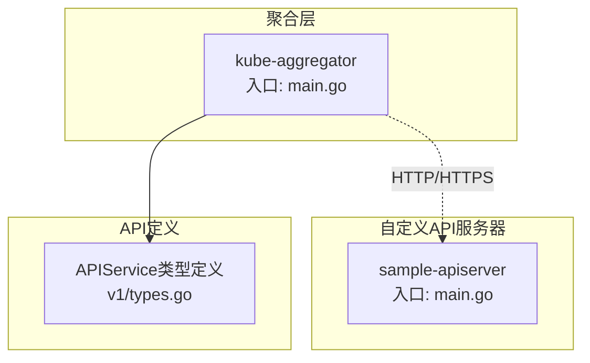
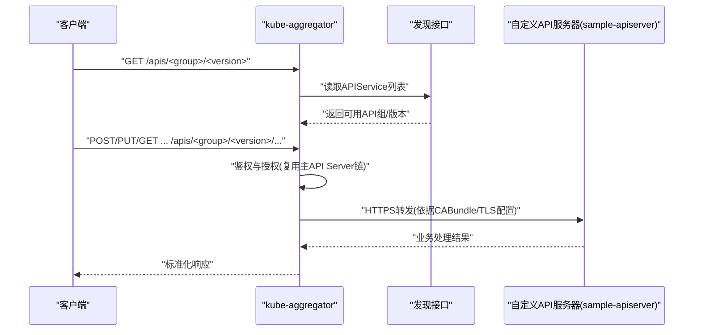
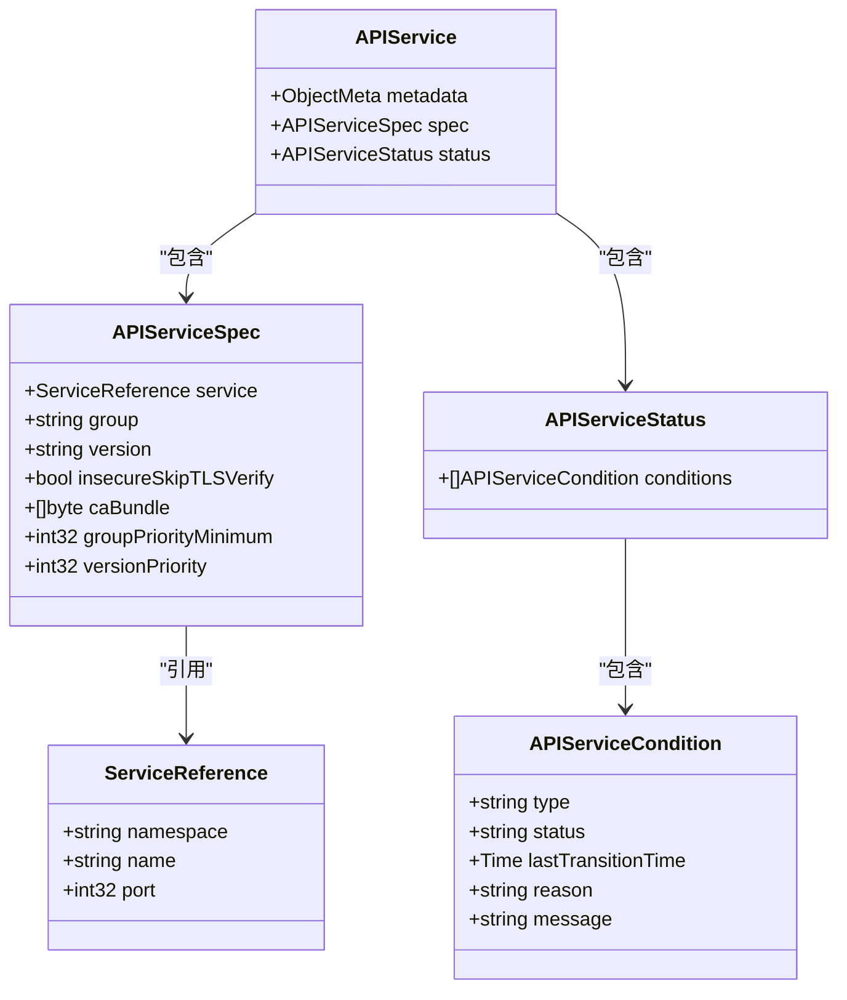
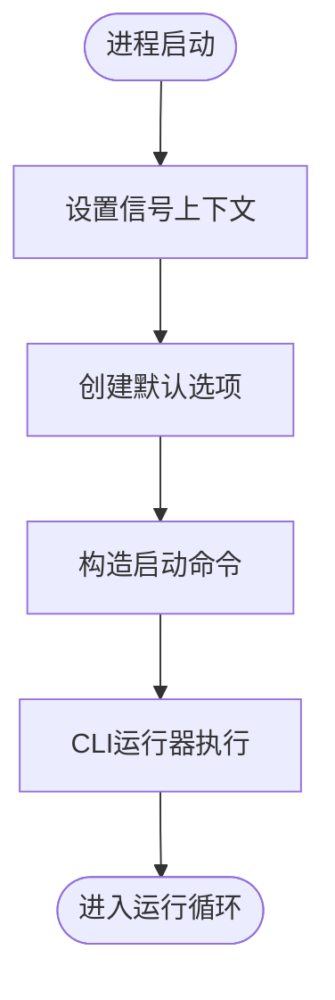
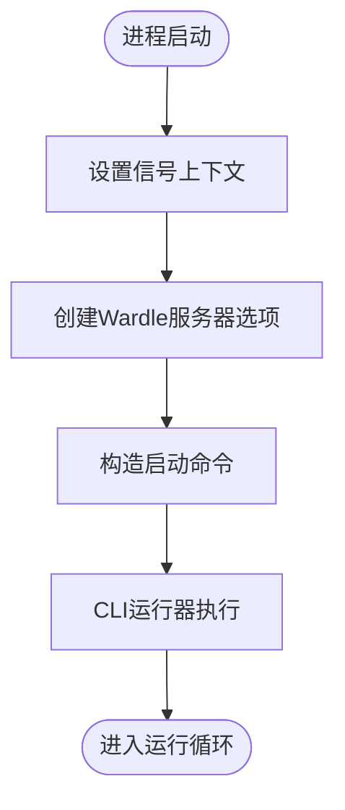
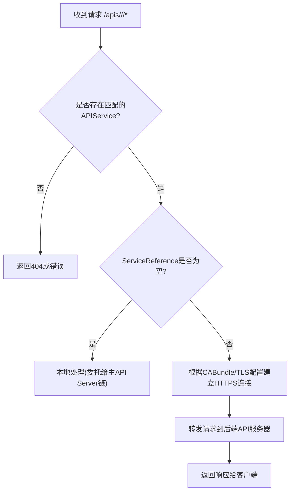
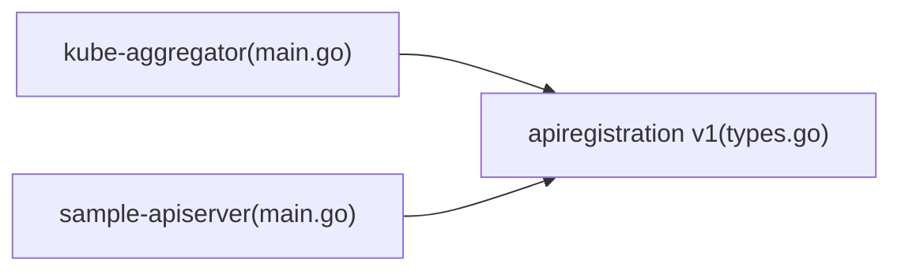

# API聚合器

<cite>
**本文引用的文件**   
- [staging/src/k8s.io/kube-aggregator/main.go](file://staging/src/k8s.io/kube-aggregator/main.go)
- [staging/src/k8s.io/sample-apiserver/main.go](file://staging/src/k8s.io/sample-apiserver/main.go)
- [staging/src/k8s.io/kube-aggregator/pkg/apis/apiregistration/v1/types.go](file://staging/src/k8s.io/kube-aggregator/pkg/apis/apiregistration/v1/types.go)
</cite>

## 目录
1. [简介](#简介)
2. [项目结构](#项目结构)
3. [核心组件](#核心组件)
4. [架构总览](#架构总览)
5. [详细组件分析](#详细组件分析)
6. [依赖关系分析](#依赖关系分析)
7. [性能考虑](#性能考虑)
8. [故障排查指南](#故障排查指南)
9. [结论](#结论)
10. [附录](#附录)

## 简介
本文件面向Kubernetes API聚合器（kube-aggregator）与自定义API服务器（sample-apiserver），提供从架构、请求路由、APIService资源管理、证书与安全通信，到开发指南、版本兼容与迁移策略、性能调优、监控指标与故障诊断的全面技术文档。内容基于仓库中实际源码路径进行说明，帮助读者从零开始构建并生产化部署一个可被主API Server聚合的自定义API服务。

## 项目结构
- kube-aggregator入口程序通过通用API Server框架启动，注册apiregistration相关API组，并提供对APIService资源的CRUD能力。
- sample-apiserver作为示例自定义API服务器，演示如何基于通用API Server框架实现RESTful API并与kube-aggregator集成。
- APIService资源定义位于apiregistration v1 API中，描述目标API服务器的寻址、安全参数与优先级等。

图表来源
- [staging/src/k8s.io/kube-aggregator/main.go:1-41](file://staging/src/k8s.io/kube-aggregator/main.go#L1-L41)
- [staging/src/k8s.io/sample-apiserver/main.go:1-34](file://staging/src/k8s.io/sample-apiserver/main.go#L1-L34)
- [staging/src/k8s.io/kube-aggregator/pkg/apis/apiregistration/v1/types.go:1-165](file://staging/src/k8s.io/kube-aggregator/pkg/apis/apiregistration/v1/types.go#L1-L165)

章节来源
- [staging/src/k8s.io/kube-aggregator/main.go:1-41](file://staging/src/k8s.io/kube-aggregator/main.go#L1-L41)
- [staging/src/k8s.io/sample-apiserver/main.go:1-34](file://staging/src/k8s.io/sample-apiserver/main.go#L1-L34)
- [staging/src/k8s.io/kube-aggregator/pkg/apis/apiregistration/v1/types.go:1-165](file://staging/src/k8s.io/kube-aggregator/pkg/apis/apiregistration/v1/types.go#L1-L165)

## 核心组件
- kube-aggregator进程：负责对外暴露聚合API前缀，维护APIService列表，按GroupVersion将请求转发至对应的后端API服务器。
- APIService资源：声明式配置，指定后端API服务器的Service引用、TLS参数、Group/Version以及优先级等。
- sample-apiserver：示例自定义API服务器，展示如何注册API组与版本、实现REST Handler、接入认证授权与准入控制。

章节来源
- [staging/src/k8s.io/kube-aggregator/main.go:1-41](file://staging/src/k8s.io/kube-aggregator/main.go#L1-L41)
- [staging/src/k8s.io/kube-aggregator/pkg/apis/apiregistration/v1/types.go:1-165](file://staging/src/k8s.io/kube-aggregator/pkg/apis/apiregistration/v1/types.go#L1-L165)
- [staging/src/k8s.io/sample-apiserver/main.go:1-34](file://staging/src/k8s.io/sample-apiserver/main.go#L1-L34)

## 架构总览
下图展示了客户端请求经kube-aggregator路由到自定义API服务器的整体流程，包括发现、鉴权、授权、转发与响应返回。

图表来源
- [staging/src/k8s.io/kube-aggregator/main.go:1-41](file://staging/src/k8s.io/kube-aggregator/main.go#L1-L41)
- [staging/src/k8s.io/sample-apiserver/main.go:1-34](file://staging/src/k8s.io/sample-apiserver/main.go#L1-L34)
- [staging/src/k8s.io/kube-aggregator/pkg/apis/apiregistration/v1/types.go:1-165](file://staging/src/k8s.io/kube-aggregator/pkg/apis/apiregistration/v1/types.go#L1-L165)

## 详细组件分析

### APIService资源模型
APIService是连接主API Server与自定义API服务器的关键资源，包含以下要点：
- ServiceReference：指向托管自定义API服务器的Service（命名空间、名称、端口）。
- APIServiceSpec：
  - group/version：标识该API服务器承载的API组与版本。
  - InsecureSkipTLSVerify/CABundle：控制与后端的安全通信；推荐通过CABundle注入CA证书，避免跳过校验。
  - GroupPriorityMinimum/VersionPriority：控制API组与版本的优先级排序，影响客户端选择与发现顺序。
- APIServiceStatus：条件状态（如Available），用于反映可达性与健康情况。

图表来源
- [staging/src/k8s.io/kube-aggregator/pkg/apis/apiregistration/v1/types.go:1-165](file://staging/src/k8s.io/kube-aggregator/pkg/apis/apiregistration/v1/types.go#L1-L165)

章节来源
- [staging/src/k8s.io/kube-aggregator/pkg/apis/apiregistration/v1/types.go:1-165](file://staging/src/k8s.io/kube-aggregator/pkg/apis/apiregistration/v1/types.go#L1-L165)

### kube-aggregator启动与注册
- 入口main函数初始化信号上下文，创建默认选项，构造启动命令，并通过通用CLI运行器执行。
- 通过导入包触发apiregistration API组的安装与验证逻辑，使APIService资源在主API Server中可用。

图表来源
- [staging/src/k8s.io/kube-aggregator/main.go:1-41](file://staging/src/k8s.io/kube-aggregator/main.go#L1-L41)

章节来源
- [staging/src/k8s.io/kube-aggregator/main.go:1-41](file://staging/src/k8s.io/kube-aggregator/main.go#L1-L41)

### sample-apiserver示例服务器
- 入口main函数同样基于通用API Server框架，创建Wardle服务器选项并启动命令。
- 作为示例，演示了如何注册API组与版本、实现REST处理器、接入认证授权与准入控制插件。

图表来源
- [staging/src/k8s.io/sample-apiserver/main.go:1-34](file://staging/src/k8s.io/sample-apiserver/main.go#L1-L34)

章节来源
- [staging/src/k8s.io/sample-apiserver/main.go:1-34](file://staging/src/k8s.io/sample-apiserver/main.go#L1-L34)

### 请求路由机制
- 客户端访问/apis/<group>/<version>时，kube-aggregator根据APIService中的group/version匹配后端。
- 若ServiceReference为空，表示该GroupVersion由本地处理；否则通过HTTPS转发到后端API服务器。
- TLS验证遵循InsecureSkipTLSVerify与CABundle配置，推荐使用CABundle以增强安全性。

图表来源
- [staging/src/k8s.io/kube-aggregator/pkg/apis/apiregistration/v1/types.go:1-165](file://staging/src/k8s.io/kube-aggregator/pkg/apis/apiregistration/v1/types.go#L1-L165)

章节来源
- [staging/src/k8s.io/kube-aggregator/pkg/apis/apiregistration/v1/types.go:1-165](file://staging/src/k8s.io/kube-aggregator/pkg/apis/apiregistration/v1/types.go#L1-L165)

## 依赖关系分析
- kube-aggregator依赖通用API Server框架与apiregistration API组安装逻辑。
- sample-apiserver依赖通用API Server框架，提供示例API组与版本。
- APIService类型定义是两者之间的契约：kube-aggregator消费该资源进行路由，sample-apiserver作为被路由的目标。

图表来源
- [staging/src/k8s.io/kube-aggregator/main.go:1-41](file://staging/src/k8s.io/kube-aggregator/main.go#L1-L41)
- [staging/src/k8s.io/sample-apiserver/main.go:1-34](file://staging/src/k8s.io/sample-apiserver/main.go#L1-L34)
- [staging/src/k8s.io/kube-aggregator/pkg/apis/apiregistration/v1/types.go:1-165](file://staging/src/k8s.io/kube-aggregator/pkg/apis/apiregistration/v1/types.go#L1-L165)

章节来源
- [staging/src/k8s.io/kube-aggregator/main.go:1-41](file://staging/src/k8s.io/kube-aggregator/main.go#L1-L41)
- [staging/src/k8s.io/sample-apiserver/main.go:1-34](file://staging/src/k8s.io/sample-apiserver/main.go#L1-L34)
- [staging/src/k8s.io/kube-aggregator/pkg/apis/apiregistration/v1/types.go:1-165](file://staging/src/k8s.io/kube-aggregator/pkg/apis/apiregistration/v1/types.go#L1-L165)

## 性能考虑
- 优先级与发现优化：合理设置GroupPriorityMinimum与VersionPriority，减少客户端不必要的重试与回退。
- TLS握手开销：使用CABundle避免跳过校验的同时，确保后端证书有效且受信任，减少握手失败重试。
- 并发与限流：在自定义API服务器侧启用合理的并发限制与速率限制，避免过载导致聚合层抖动。
- 缓存与短连接：尽量复用连接池，减少频繁建立HTTPS连接的开销。

[本节为通用指导，不直接分析具体文件]

## 故障排查指南
- APIService不可用：检查ServiceReference是否正确、端口是否开放、CABundle是否匹配后端证书。
- TLS错误：确认InsecureSkipTLSVerify未在生产环境启用，优先使用CABundle；检查证书链完整性。
- 路由失败：核对APIService的group/version是否与客户端请求一致；确认优先级配置是否符合预期。
- 鉴权/授权问题：确认自定义API服务器正确集成认证与授权链，返回标准错误码以便聚合层透传。

章节来源
- [staging/src/k8s.io/kube-aggregator/pkg/apis/apiregistration/v1/types.go:1-165](file://staging/src/k8s.io/kube-aggregator/pkg/apis/apiregistration/v1/types.go#L1-L165)

## 结论
API聚合器通过APIService资源将自定义API服务器无缝纳入Kubernetes API生态。借助通用API Server框架，开发者可以快速实现RESTful API、集成认证授权与准入控制，并通过优先级与TLS配置保障稳定与安全的生产级集成。建议在生产环境中严格管理证书、合理设置优先级、完善监控与告警，持续优化性能与可靠性。

[本节为总结性内容，不直接分析具体文件]

## 附录

### 自定义API服务器开发指南（从初始化到生产部署）
- 项目初始化
  - 基于通用API Server框架创建入口main函数，设置信号上下文与命令行选项。
  - 参考示例入口文件的组织方式，确保正确加载API组与版本。
- 实现RESTful API
  - 注册API组与版本，定义资源对象与存储接口。
  - 实现Handler以处理GET/POST/PUT/DELETE等操作，返回标准REST响应。
- 认证与授权集成
  - 复用主API Server的认证与授权链，确保RBAC策略生效。
  - 如需扩展，可在自定义API服务器中集成额外插件。
- 准入控制
  - 实现Admission插件，对请求进行前置校验与修改。
- 证书与安全通信
  - 生成服务端证书，配置CABundle供kube-aggregator校验。
  - 避免在生产环境使用InsecureSkipTLSVerify。
- 部署与运维
  - 将自定义API服务器部署为Pod/Deployment，暴露Service。
  - 创建APIService资源，指向Service与CABundle，设置合适的优先级。
  - 配置监控指标与日志采集，建立告警规则。

章节来源
- [staging/src/k8s.io/sample-apiserver/main.go:1-34](file://staging/src/k8s.io/sample-apiserver/main.go#L1-L34)
- [staging/src/k8s.io/kube-aggregator/pkg/apis/apiregistration/v1/types.go:1-165](file://staging/src/k8s.io/kube-aggregator/pkg/apis/apiregistration/v1/types.go#L1-L165)

### API版本兼容性与迁移策略
- 多版本共存：通过不同group/version注册多个实现，利用VersionPriority控制首选版本。
- 向后兼容：保持旧版本字段与行为不变，逐步引入新字段与行为。
- 迁移步骤：先发布新版本，验证无误后调整优先级，最后下线旧版本。

章节来源
- [staging/src/k8s.io/kube-aggregator/pkg/apis/apiregistration/v1/types.go:1-165](file://staging/src/k8s.io/kube-aggregator/pkg/apis/apiregistration/v1/types.go#L1-L165)