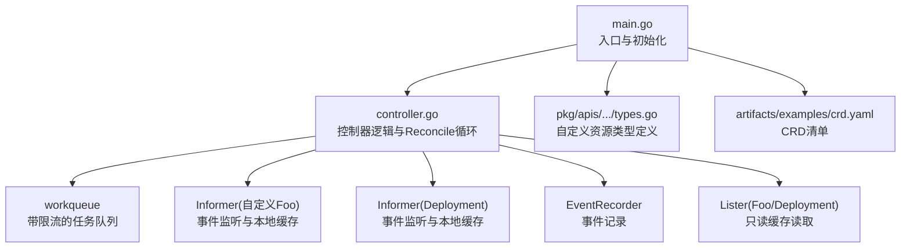
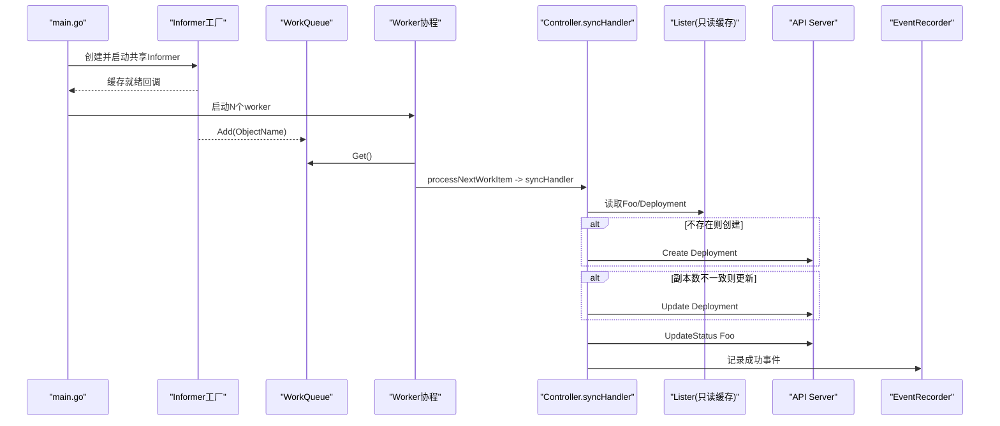
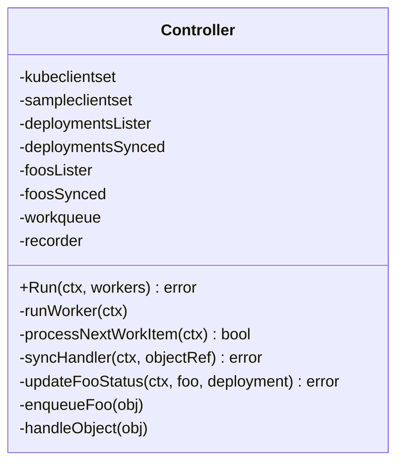
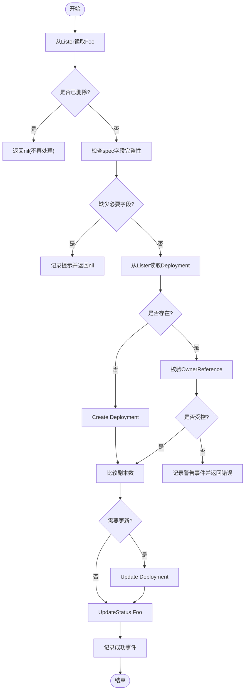
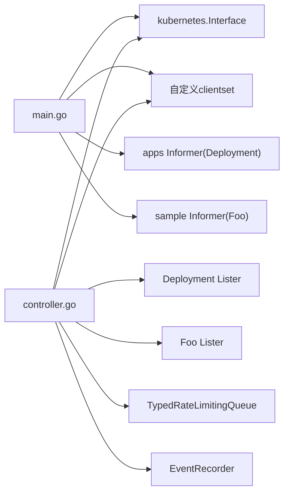

# Operator开发

<cite>
**本文引用的文件**   
- [staging/src/k8s.io/sample-controller/README.md](file://staging/src/k8s.io/sample-controller/README.md)
- [staging/src/k8s.io/sample-controller/main.go](file://staging/src/k8s.io/sample-controller/main.go)
- [staging/src/k8s.io/sample-controller/controller.go](file://staging/src/k8s.io/sample-controller/controller.go)
- [staging/src/k8s.io/sample-controller/controller_test.go](file://staging/src/k8s.io/sample-controller/controller_test.go)
- [staging/src/k8s.io/sample-controller/pkg/apis/samplecontroller/v1alpha1/types.go](file://staging/src/k8s.io/sample-controller/pkg/apis/samplecontroller/v1alpha1/types.go)
- [staging/src/k8s.io/sample-controller/artifacts/examples/crd.yaml](file://staging/src/k8s.io/sample-controller/artifacts/examples/crd.yaml)
- [staging/src/k8s.io/sample-controller/docs/controller-client-go.md](file://staging/src/k8s.io/sample-controller/docs/controller-client-go.md)
</cite>

## 目录
1. [简介](#简介)
2. [项目结构](#项目结构)
3. [核心组件](#核心组件)
4. [架构总览](#架构总览)
5. [详细组件分析](#详细组件分析)
6. [依赖关系分析](#依赖关系分析)
7. [性能与并发特性](#性能与并发特性)
8. [测试方法与实践](#测试方法与实践)
9. [部署与版本管理](#部署与版本管理)
10. [监控、日志与故障诊断](#监控日志与故障诊断)
11. [结论](#结论)

## 简介
本技术文档面向Kubernetes Operator开发者，围绕Operator模式原理、自定义控制器开发框架、Reconcile循环与状态同步机制、Informer事件监听与缓存、并发控制与错误重试策略、测试方法（单元/集成/端到端）、部署与版本管理、以及监控指标与日志诊断等主题展开。文档以仓库中的sample-controller为参考实现，结合官方文档说明，提供从概念到落地的完整指南。

## 项目结构
示例控制器位于staging目录下的sample-controller模块，包含API定义、CRD清单、控制器主流程、单元测试与文档说明。整体组织遵循“API类型 + CRD + 控制器 + 代码生成产物”的典型结构。

图表来源
- [staging/src/k8s.io/sample-controller/main.go:66-81](file://staging/src/k8s.io/sample-controller/main.go#L66-L81)
- [staging/src/k8s.io/sample-controller/controller.go:115-156](file://staging/src/k8s.io/sample-controller/controller.go#L115-L156)
- [staging/src/k8s.io/sample-controller/pkg/apis/samplecontroller/v1alpha1/types.go:27-44](file://staging/src/k8s.io/sample-controller/pkg/apis/samplecontroller/v1alpha1/types.go#L27-L44)
- [staging/src/k8s.io/sample-controller/artifacts/examples/crd.yaml:1-38](file://staging/src/k8s.io/sample-controller/artifacts/examples/crd.yaml#L1-L38)

章节来源
- [staging/src/k8s.io/sample-controller/README.md:1-171](file://staging/src/k8s.io/sample-controller/README.md#L1-L171)
- [staging/src/k8s.io/sample-controller/main.go:40-82](file://staging/src/k8s.io/sample-controller/main.go#L40-L82)
- [staging/src/k8s.io/sample-controller/controller.go:68-156](file://staging/src/k8s.io/sample-controller/controller.go#L68-L156)
- [staging/src/k8s.io/sample-controller/pkg/apis/samplecontroller/v1alpha1/types.go:27-44](file://staging/src/k8s.io/sample-controller/pkg/apis/samplecontroller/v1alpha1/types.go#L27-L44)
- [staging/src/k8s.io/sample-controller/artifacts/examples/crd.yaml:1-38](file://staging/src/k8s.io/sample-controller/artifacts/examples/crd.yaml#L1-L38)

## 核心组件
- 自定义资源类型：通过CRD声明并配合Go类型定义，形成用户可见的API对象。
- Informer与Lister：基于client-go的Reflector+Indexer实现，负责从API Server拉取并缓存资源，触发事件回调。
- WorkQueue：带速率限制的任务队列，解耦事件到达与处理，支持指数退避与桶限流。
- Reconcile循环：从队列取出对象引用，调用syncHandler进行期望与实际状态对比与收敛，更新Status子资源。
- EventRecorder：向API Server写入事件，便于观测与排障。

章节来源
- [staging/src/k8s.io/sample-controller/controller.go:190-312](file://staging/src/k8s.io/sample-controller/controller.go#L190-L312)
- [staging/src/k8s.io/sample-controller/controller.go:110-124](file://staging/src/k8s.io/sample-controller/controller.go#L110-L124)
- [staging/src/k8s.io/sample-controller/controller.go:126-156](file://staging/src/k8s.io/sample-controller/controller.go#L126-L156)
- [staging/src/k8s.io/sample-controller/controller.go:314-326](file://staging/src/k8s.io/sample-controller/controller.go#L314-L326)
- [staging/src/k8s.io/sample-controller/docs/controller-client-go.md:1-64](file://staging/src/k8s.io/sample-controller/docs/controller-client-go.md#L1-L64)

## 架构总览
下图展示了控制器启动、Informer注册、事件入队、工作协程消费、Reconcile执行与状态更新的完整链路。

图表来源
- [staging/src/k8s.io/sample-controller/main.go:66-81](file://staging/src/k8s.io/sample-controller/main.go#L66-L81)
- [staging/src/k8s.io/sample-controller/controller.go:162-188](file://staging/src/k8s.io/sample-controller/controller.go#L162-L188)
- [staging/src/k8s.io/sample-controller/controller.go:200-236](file://staging/src/k8s.io/sample-controller/controller.go#L200-L236)
- [staging/src/k8s.io/sample-controller/controller.go:241-312](file://staging/src/k8s.io/sample-controller/controller.go#L241-L312)
- [staging/src/k8s.io/sample-controller/controller.go:314-326](file://staging/src/k8s.io/sample-controller/controller.go#L314-L326)

## 详细组件分析

### 控制器结构与职责
- Controller结构体持有标准客户端、自定义客户端、Lister与Synced回调、RateLimitingWorkQueue与EventRecorder。
- NewController完成事件广播器、限流器、事件处理器与工作队列的初始化。
- Run等待缓存同步后启动多个worker协程，阻塞直到上下文取消。

图表来源
- [staging/src/k8s.io/sample-controller/controller.go:68-89](file://staging/src/k8s.io/sample-controller/controller.go#L68-L89)
- [staging/src/k8s.io/sample-controller/controller.go:92-156](file://staging/src/k8s.io/sample-controller/controller.go#L92-L156)
- [staging/src/k8s.io/sample-controller/controller.go:162-188](file://staging/src/k8s.io/sample-controller/controller.go#L162-L188)

章节来源
- [staging/src/k8s.io/sample-controller/controller.go:68-156](file://staging/src/k8s.io/sample-controller/controller.go#L68-L156)
- [staging/src/k8s.io/sample-controller/controller.go:162-188](file://staging/src/k8s.io/sample-controller/controller.go#L162-L188)

### Reconcile循环与状态同步
- 事件入队：对自定义资源Foo的Add/Update事件直接入队；对Deployment的变更通过OwnerReference反向查找所属Foo再入队。
- 工作项处理：从队列获取对象引用，调用syncHandler。
- 同步逻辑：
  - 从Lister读取Foo与目标Deployment。
  - 若Deployment不存在则创建，存在则校验所有权归属。
  - 比较副本数，必要时更新Deployment。
  - 将实际可用副本数写回Foo.Status.AvailableReplicas。
  - 记录成功事件。
- 错误与重试：非nil错误将被记录并重新入队，使用指数退避与桶限流避免风暴。

图表来源
- [staging/src/k8s.io/sample-controller/controller.go:200-236](file://staging/src/k8s.io/sample-controller/controller.go#L200-L236)
- [staging/src/k8s.io/sample-controller/controller.go:241-312](file://staging/src/k8s.io/sample-controller/controller.go#L241-L312)
- [staging/src/k8s.io/sample-controller/controller.go:314-326](file://staging/src/k8s.io/sample-controller/controller.go#L314-L326)

章节来源
- [staging/src/k8s.io/sample-controller/controller.go:200-312](file://staging/src/k8s.io/sample-controller/controller.go#L200-L312)
- [staging/src/k8s.io/sample-controller/controller.go:314-326](file://staging/src/k8s.io/sample-controller/controller.go#L314-L326)

### Informer机制与事件监听
- Reflector负责Watch/List并填充DeltaFIFO。
- Informer从DeltaFIFO弹出对象，保存到Indexer，并调用注册的ResourceEventHandler。
- 示例中：
  - 对Foo的Add/Update事件直接入队。
  - 对Deployment的变更，通过OwnerReference反查所属Foo并入队，无需自行维护复杂关联逻辑。

章节来源
- [staging/src/k8s.io/sample-controller/docs/controller-client-go.md:1-64](file://staging/src/k8s.io/sample-controller/docs/controller-client-go.md#L1-L64)
- [staging/src/k8s.io/sample-controller/controller.go:126-156](file://staging/src/k8s.io/sample-controller/controller.go#L126-L156)
- [staging/src/k8s.io/sample-controller/controller.go:340-383](file://staging/src/k8s.io/sample-controller/controller.go#L340-L383)

### 自定义资源与CRD
- 类型定义包含Spec与Status，分别描述期望与当前状态。
- CRD清单声明组名、版本、OpenAPIV3Schema验证规则、名称与作用域。
- Status子资源启用后可仅更新status部分，符合API约定。

章节来源
- [staging/src/k8s.io/sample-controller/pkg/apis/samplecontroller/v1alpha1/types.go:27-44](file://staging/src/k8s.io/sample-controller/pkg/apis/samplecontroller/v1alpha1/types.go#L27-L44)
- [staging/src/k8s.io/sample-controller/artifacts/examples/crd.yaml:1-38](file://staging/src/k8s.io/sample-controller/artifacts/examples/crd.yaml#L1-L38)
- [staging/src/k8s.io/sample-controller/README.md:128-144](file://staging/src/k8s.io/sample-controller/README.md#L128-L144)

## 依赖关系分析
- main.go负责构建kubeconfig、创建kubernetes.Interface与自定义clientset、初始化SharedInformerFactory、启动Informer、构造Controller并运行。
- controller.go依赖：
  - kubernetes.Interface用于读写Deployment与Events。
  - 自定义clientset用于读写Foo及Status子资源。
  - Listers用于只读访问缓存。
  - workqueue.TypedRateLimitingInterface用于任务调度与重试。
  - record.EventRecorder用于事件输出。

图表来源
- [staging/src/k8s.io/sample-controller/main.go:48-81](file://staging/src/k8s.io/sample-controller/main.go#L48-L81)
- [staging/src/k8s.io/sample-controller/controller.go:115-156](file://staging/src/k8s.io/sample-controller/controller.go#L115-L156)

章节来源
- [staging/src/k8s.io/sample-controller/main.go:40-82](file://staging/src/k8s.io/sample-controller/main.go#L40-L82)
- [staging/src/k8s.io/sample-controller/controller.go:115-156](file://staging/src/k8s.io/sample-controller/controller.go#L115-L156)

## 性能与并发特性
- 并发模型：Run启动N个worker协程并行消费队列，提升吞吐。
- 限流与退避：
  - 组合限流器：最大者选择策略，同时采用指数失败退避与桶限流，防止热点对象或全局风暴。
  - 失败重入队：AddRateLimited自动应用退避策略。
- 缓存优先：所有读取走Lister（内存索引），降低API Server压力。
- 选择性更新：仅在副本数变化时发起Update，减少不必要的写放大。

章节来源
- [staging/src/k8s.io/sample-controller/controller.go:110-124](file://staging/src/k8s.io/sample-controller/controller.go#L110-L124)
- [staging/src/k8s.io/sample-controller/controller.go:177-188](file://staging/src/k8s.io/sample-controller/controller.go#L177-L188)
- [staging/src/k8s.io/sample-controller/controller.go:228-236](file://staging/src/k8s.io/sample-controller/controller.go#L228-L236)
- [staging/src/k8s.io/sample-controller/controller.go:291-301](file://staging/src/k8s.io/sample-controller/controller.go#L291-L301)

## 测试方法与实践
- 单元测试：
  - 使用fake clientset与informer，预置Foo与Deployment到Indexer。
  - 直接调用syncHandler，断言预期的Create/Update/UpdateStatus动作。
  - 覆盖正常路径、无操作路径、副本数变更路径、非受控对象路径等。
- 集成/端到端测试建议：
  - 在本地集群或测试集群中部署CRD与控制器，模拟真实事件流。
  - 验证事件、状态更新与最终一致性。
  - 可结合ginkgo/e2e框架与工具链进行自动化。

章节来源
- [staging/src/k8s.io/sample-controller/controller_test.go:87-110](file://staging/src/k8s.io/sample-controller/controller_test.go#L87-L110)
- [staging/src/k8s.io/sample-controller/controller_test.go:120-163](file://staging/src/k8s.io/sample-controller/controller_test.go#L120-L163)
- [staging/src/k8s.io/sample-controller/controller_test.go:249-316](file://staging/src/k8s.io/sample-controller/controller_test.go#L249-L316)

## 部署与版本管理
- 运行方式：
  - 构建二进制并传入-kubeconfig或-in-cluster配置。
  - 先创建CRD，再创建自定义资源实例，控制器会自动创建/更新下游资源并同步状态。
- 版本演进：
  - 通过CRD多版本能力逐步迁移至稳定版API。
  - 控制器需兼容多版本，按版本分发不同处理逻辑。
- 生产部署建议：
  - 使用Deployment/Helm/Kustomize管理控制器Pod，设置资源请求/限制、探针、滚动更新策略。
  - 合理设置workers数量与限流参数，结合业务规模调优。
  - 启用RBAC最小权限原则，仅授予必要的Get/List/Watch/Create/Update/Patch权限。

章节来源
- [staging/src/k8s.io/sample-controller/README.md:68-85](file://staging/src/k8s.io/sample-controller/README.md#L68-L85)
- [staging/src/k8s.io/sample-controller/README.md:146-147](file://staging/src/k8s.io/sample-controller/README.md#L146-L147)
- [staging/src/k8s.io/sample-controller/main.go:40-82](file://staging/src/k8s.io/sample-controller/main.go#L40-L82)

## 监控、日志与故障诊断
- 日志：
  - 使用结构化日志记录关键步骤与对象引用，便于检索。
  - 在错误路径记录上下文信息，辅助定位问题。
- 事件：
  - 通过EventRecorder记录成功与异常事件，可在kubectl get events中查看。
- 指标（建议）：
  - 暴露Prometheus指标：队列长度、处理耗时、错误计数、资源差异统计等。
  - 结合Grafana面板进行可视化监控。
- 故障诊断：
  - 关注“未受控对象”、“缺失字段”、“缓存未同步”等典型场景。
  - 利用事件与日志快速定位根因，必要时调整限流与workers。

章节来源
- [staging/src/k8s.io/sample-controller/controller.go:228-236](file://staging/src/k8s.io/sample-controller/controller.go#L228-L236)
- [staging/src/k8s.io/sample-controller/controller.go:282-286](file://staging/src/k8s.io/sample-controller/controller.go#L282-L286)
- [staging/src/k8s.io/sample-controller/controller.go:310-312](file://staging/src/k8s.io/sample-controller/controller.go#L310-L312)

## 结论
本指南基于sample-controller展示了Kubernetes Operator的核心实践：以CRD扩展API、用Informer监听与缓存、借助WorkQueue实现可靠的重试与限流、在Reconcile中比对期望与实际并收敛状态、通过Status子资源对外暴露运行态。结合完善的测试、合理的限流与并发策略、以及完善的日志与事件输出，可以构建出高可用、易运维的生产级Operator。