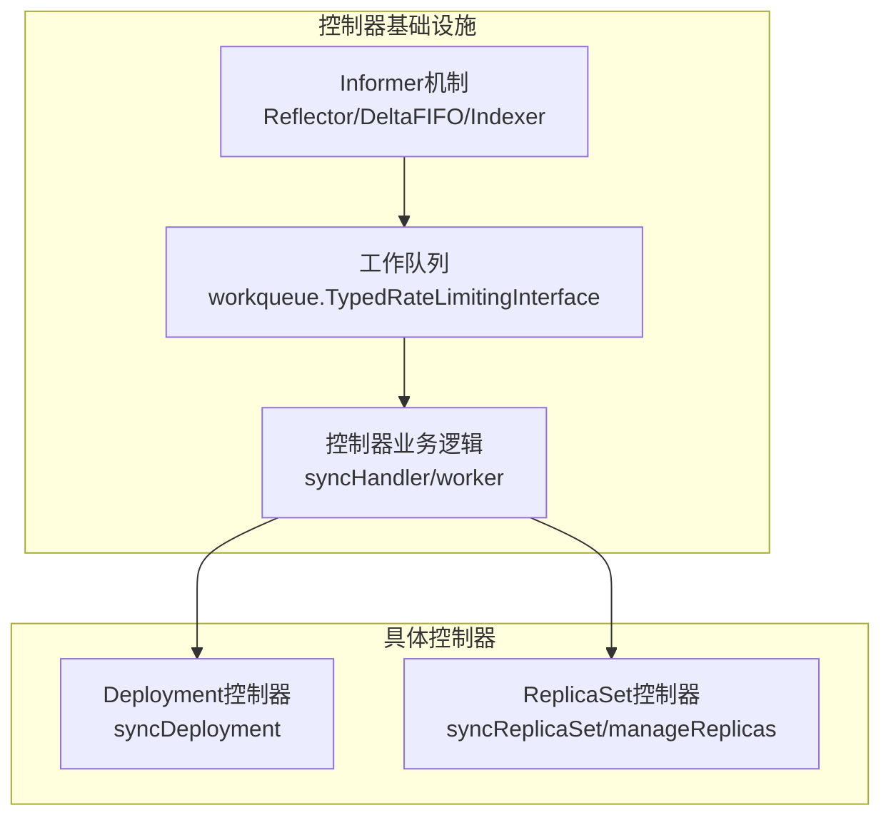
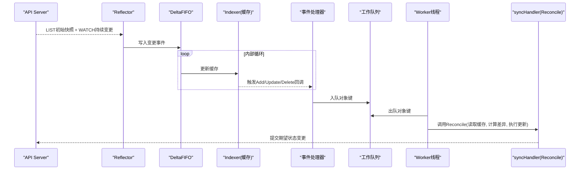
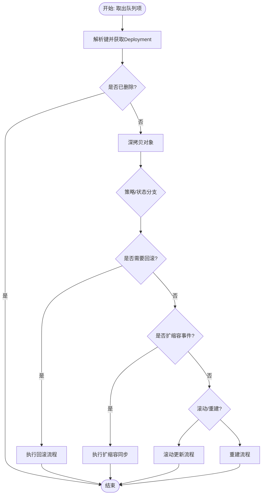
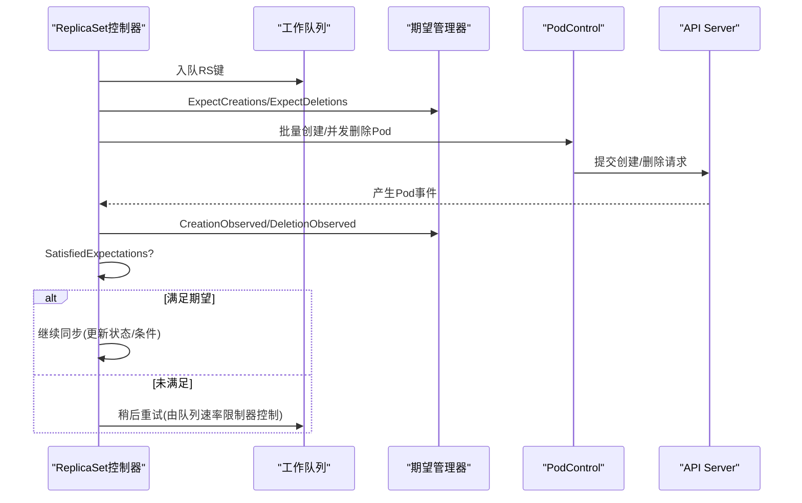
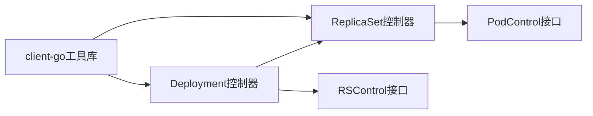

# Reconcile模式实现

<cite>
**本文引用的文件**   
- [deployment_controller.go](file://pkg/controller/deployment/deployment_controller.go)
- [replica_set.go](file://pkg/controller/replicaset/replica_set.go)
- [ARCHITECTURE.md](file://staging/src/k8s.io/client-go/ARCHITECTURE.md)
- [controller-client-go.md](file://staging/src/k8s.io/sample-controller/docs/controller-client-go.md)
- [README.md](file://staging/src/k8s.io/sample-controller/README.md)
</cite>

## 目录
1. [简介](#简介)
2. [项目结构](#项目结构)
3. [核心组件](#核心组件)
4. [架构总览](#架构总览)
5. [详细组件分析](#详细组件分析)
6. [依赖关系分析](#依赖关系分析)
7. [性能考量](#性能考量)
8. [故障排查指南](#故障排查指南)
9. [结论](#结论)
10. [附录](#附录)

## 简介
本文件面向Kubernetes控制器开发者，系统性阐述Reconcile模式在Kubernetes中的实现与最佳实践。内容覆盖：
- Reconcile循环的核心原理与工作流
- 期望状态与实际状态的比较与同步机制
- 资源创建、更新、删除事件的处理方式
- 并发控制与锁机制（工作队列）
- 错误处理与重试策略（含指数退避）
- 幂等性与一致性保证
- 性能优化技巧（批量处理、增量更新）
- 完整示例路径与故障排查要点

## 项目结构
围绕Reconcile模式的代码主要分布在以下位置：
- 控制器基础设施与模式说明：client-go的控制器架构文档与sample-controller文档
- 典型控制器实现：Deployment控制器与ReplicaSet控制器

图表来源
- [ARCHITECTURE.md:89-146](file://staging/src/k8s.io/client-go/ARCHITECTURE.md#L89-L146)
- [deployment_controller.go:170-200](file://pkg/controller/deployment/deployment_controller.go#L170-L200)
- [replica_set.go:274-304](file://pkg/controller/replicaset/replica_set.go#L274-L304)

章节来源
- [ARCHITECTURE.md:89-146](file://staging/src/k8s.io/client-go/ARCHITECTURE.md#L89-L146)
- [controller-client-go.md:39-64](file://staging/src/k8s.io/sample-controller/docs/controller-client-go.md#L39-L64)
- [deployment_controller.go:170-200](file://pkg/controller/deployment/deployment_controller.go#L170-L200)
- [replica_set.go:274-304](file://pkg/controller/replicaset/replica_set.go#L274-L304)

## 核心组件
- Informer与缓存
  - Reflector负责LIST/WATCH，DeltaFIFO缓冲变更，Indexer维护本地缓存，Lister提供只读访问
- 工作队列
  - 使用TypedRateLimitingInterface承载待处理的对象键，支持速率限制与延迟入队
- 控制器主循环
  - worker从队列取任务，调用syncHandler执行一次Reconcile；同一key串行化避免并发冲突
- 事件处理器
  - Add/Update/Delete回调将对象键入队，触发Reconcile
- 期望与观测
  - ReplicaSet控制器通过Expectations跟踪预期创建/删除数量，确保在观测到结果前不重复操作
- 一致性保障
  - 可选的一致性存储用于等待写回传播完成后再继续处理

章节来源
- [ARCHITECTURE.md:89-146](file://staging/src/k8s.io/client-go/ARCHITECTURE.md#L89-L146)
- [deployment_controller.go:103-168](file://pkg/controller/deployment/deployment_controller.go#L103-L168)
- [replica_set.go:202-272](file://pkg/controller/replicaset/replica_set.go#L202-L272)

## 架构总览
下图展示了从API Server到控制器Reconcile的端到端数据流，以及关键组件的职责边界。

图表来源
- [ARCHITECTURE.md:89-132](file://staging/src/k8s.io/client-go/ARCHITECTURE.md#L89-L132)
- [deployment_controller.go:123-168](file://pkg/controller/deployment/deployment_controller.go#L123-L168)
- [replica_set.go:223-272](file://pkg/controller/replicaset/replica_set.go#L223-L272)

## 详细组件分析

### Deployment控制器Reconcile流程
- 启动与监听
  - 为Deployment/ReplicaSet/Pod分别注册事件处理器，将相关变化转换为Deployment键入队
- 工作线程
  - 多worker并行消费队列，但同一Deployment键串行执行syncDeployment
- 同步逻辑
  - 解析键获取对象，深拷贝避免修改缓存
  - 根据策略（滚动/重建）、暂停/回滚/扩缩容分支处理
  - 通过ControllerRef管理器进行RS的认领/释放，保证所有权一致
- 错误与重试
  - 失败按最大重试次数与默认速率限制器进行指数退避重入队
  - 特殊原因（如命名空间终止）直接Forget不再重试

图表来源
- [deployment_controller.go:572-661](file://pkg/controller/deployment/deployment_controller.go#L572-L661)
- [deployment_controller.go:499-519](file://pkg/controller/deployment/deployment_controller.go#L499-L519)

章节来源
- [deployment_controller.go:103-168](file://pkg/controller/deployment/deployment_controller.go#L103-L168)
- [deployment_controller.go:170-200](file://pkg/controller/deployment/deployment_controller.go#L170-L200)
- [deployment_controller.go:479-519](file://pkg/controller/deployment/deployment_controller.go#L479-L519)
- [deployment_controller.go:572-661](file://pkg/controller/deployment/deployment_controller.go#L572-L661)

### ReplicaSet控制器Reconcile流程
- 启动与监听
  - 为RS与Pod注册事件处理器，Pod变化会触发对应RS入队
- 期望与观测
  - 创建/删除前记录期望，收到实际事件后标记观测，满足期望后才进入后续同步
- 副本管理
  - 计算差值，必要时批量创建或并发删除，受burstReplicas限制
  - 慢启动批量创建，避免对API Server造成突发压力
- 一致性
  - 可选一致性存储确保写回传播完成后才继续处理，减少抖动

图表来源
- [replica_set.go:646-750](file://pkg/controller/replicaset/replica_set.go#L646-L750)
- [replica_set.go:752-800](file://pkg/controller/replicaset/replica_set.go#L752-L800)

章节来源
- [replica_set.go:202-272](file://pkg/controller/replicaset/replica_set.go#L202-L272)
- [replica_set.go:620-644](file://pkg/controller/replicaset/replica_set.go#L620-L644)
- [replica_set.go:646-750](file://pkg/controller/replicaset/replica_set.go#L646-L750)
- [replica_set.go:752-800](file://pkg/controller/replicaset/replica_set.go#L752-L800)

### 事件处理与入队策略
- 新增/更新/删除
  - 事件处理器仅提取对象键并入队，避免阻塞Watch流
- 去抖与合并
  - 高频更新时，工作队列与速率限制器可合并处理，降低抖动
- 延迟入队
  - 针对MinReadySeconds等场景，使用AddAfter延后再次检查可用性

章节来源
- [controller-client-go.md:39-64](file://staging/src/k8s.io/sample-controller/docs/controller-client-go.md#L39-L64)
- [deployment_controller.go:123-168](file://pkg/controller/deployment/deployment_controller.go#L123-L168)
- [replica_set.go:223-272](file://pkg/controller/replicaset/replica_set.go#L223-L272)

### 并发控制与锁机制
- 工作队列串行化
  - 同一对象的key在同一时刻仅被一个worker处理，天然避免并发写冲突
- 多worker并行
  - 不同对象可并行处理，提升吞吐
- 可选全局锁
  - 若需跨对象的全局互斥，可在业务层引入细粒度锁（谨慎使用）

章节来源
- [deployment_controller.go:479-497](file://pkg/controller/deployment/deployment_controller.go#L479-L497)
- [replica_set.go:620-644](file://pkg/controller/replicaset/replica_set.go#L620-L644)

### 错误处理与重试策略（指数退避）
- 默认速率限制器
  - 基于指数退避的重试策略，随重试次数增加等待时间递增
- 最大重试次数
  - 超过阈值后丢弃并上报错误，防止无限重试
- 特殊错误快速收敛
  - 如命名空间终止原因，直接Forget不再重试

章节来源
- [deployment_controller.go:54-60](file://pkg/controller/deployment/deployment_controller.go#L54-L60)
- [deployment_controller.go:499-519](file://pkg/controller/deployment/deployment_controller.go#L499-L519)
- [replica_set.go:627-644](file://pkg/controller/replicaset/replica_set.go#L627-L644)

### 幂等性与一致性保证
- 幂等设计
  - Reconcile每次以当前缓存为准，对比期望与实际，仅做必要变更
- 一致性存储
  - 在写操作后记录时间戳，确保后续Reconcile在写回传播完成后再继续
- 期望与观测
  - 通过Expectations精确匹配预期与观测，避免过早推进导致的状态不一致

章节来源
- [replica_set.go:162-200](file://pkg/controller/replicaset/replica_set.go#L162-L200)
- [replica_set.go:752-800](file://pkg/controller/replicaset/replica_set.go#L752-L800)

### 性能优化技巧
- 批量处理
  - 慢启动批量创建，逐步放大批次大小，降低瞬时压力
- 并发删除
  - 删除操作并发执行，缩短收敛时间
- 增量更新
  - 仅当Spec或关键标签变化时才入队，减少无效同步
- 本地缓存
  - 大量读取走Lister/本地缓存，避免频繁网络IO

章节来源
- [replica_set.go:646-750](file://pkg/controller/replicaset/replica_set.go#L646-L750)
- [deployment_controller.go:207-212](file://pkg/controller/deployment/deployment_controller.go#L207-L212)

## 依赖关系分析
- 外部依赖
  - client-go工具库：Informer、WorkQueue、LeaderElection等
- 内部依赖
  - Deployment控制器依赖ReplicaSet控制器能力（通过RSControl接口）
  - ReplicaSet控制器依赖PodControl接口

图表来源
- [deployment_controller.go:65-101](file://pkg/controller/deployment/deployment_controller.go#L65-L101)
- [replica_set.go:95-140](file://pkg/controller/replicaset/replica_set.go#L95-L140)

章节来源
- [deployment_controller.go:65-101](file://pkg/controller/deployment/deployment_controller.go#L65-L101)
- [replica_set.go:95-140](file://pkg/controller/replicaset/replica_set.go#L95-L140)

## 性能考量
- 合理设置workers数量，平衡吞吐与CPU占用
- 调整burstReplicas与慢启动参数，适配集群规模与API Server容量
- 利用本地缓存与索引，减少不必要的API调用
- 对高频率事件采用节流与合并策略，避免风暴

[本节为通用指导，无需特定文件引用]

## 故障排查指南
- 常见问题定位
  - 观察事件记录与日志，确认事件是否入队与处理
  - 检查工作队列长度与重试次数，判断是否存在异常重试风暴
  - 核对期望与观测计数，确认是否长期不满足导致卡住
- 常见错误与对策
  - 命名空间终止：快速收敛，不再重试
  - 权限不足：检查RBAC与ServiceAccount
  - 资源配额限制：分批创建，避免一次性超限
- 诊断建议
  - 开启结构化日志与指标采集
  - 使用klog级别与采样，聚焦关键路径
  - 结合Prometheus/Grafana监控队列深度与处理耗时

章节来源
- [deployment_controller.go:499-519](file://pkg/controller/deployment/deployment_controller.go#L499-L519)
- [replica_set.go:627-644](file://pkg/controller/replicaset/replica_set.go#L627-L644)

## 结论
Reconcile模式通过“事件驱动+本地缓存+工作队列”的组合，实现了高可用、可扩展且幂等的控制器框架。借助指数退避、期望观测与一致性存储，控制器能够在复杂分布式环境中稳健收敛至期望状态。配合批量与并发优化，可在大规模集群中保持良好性能。

[本节为总结性内容，无需特定文件引用]

## 附录
- 参考示例
  - sample-controller README与文档提供了从零构建自定义控制器的入门路径
- 术语表
  - Reconcile：将实际状态调整为期望状态的过程
  - Informer：监听API Server变更并维护本地缓存的组件
  - WorkQueue：解耦事件接收与处理的有界队列
  - Expectations：用于跟踪预期操作的计数器

章节来源
- [README.md:6-171](file://staging/src/k8s.io/sample-controller/README.md#L6-L171)
- [controller-client-go.md:39-64](file://staging/src/k8s.io/sample-controller/docs/controller-client-go.md#L39-L64)